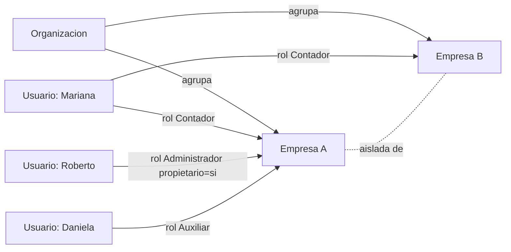
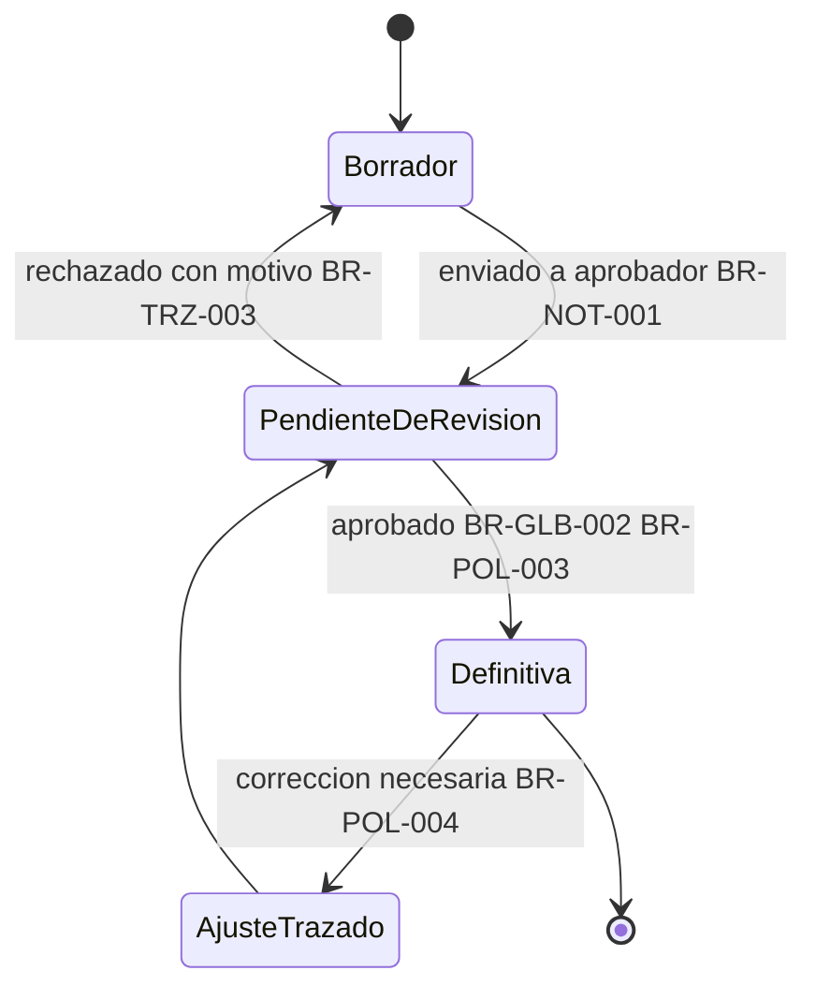
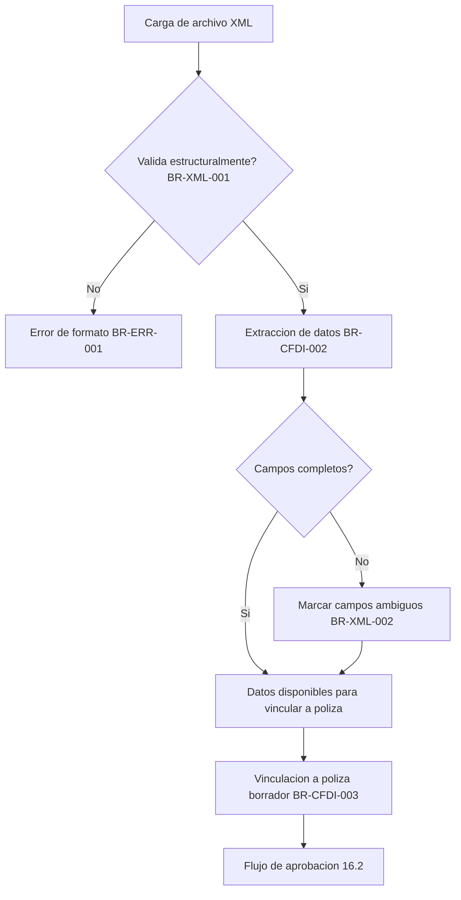
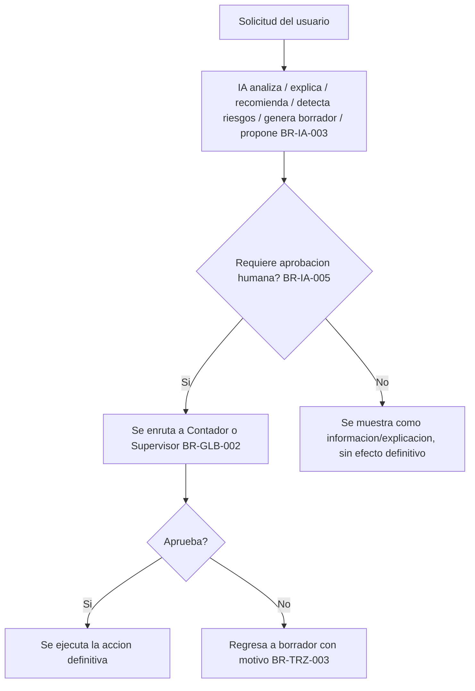
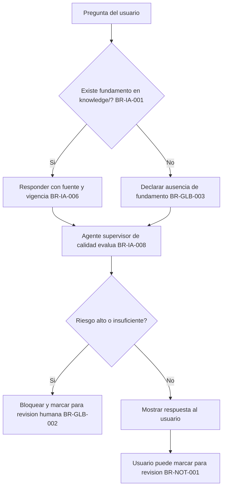

# Reglas de Negocio — ContaIA

## Control del documento

| Campo                          | Valor                                                                                                                                                            |
| ------------------------------ | ---------------------------------------------------------------------------------------------------------------------------------------------------------------- |
| Documento                      | 04_BUSINESS_RULES.md (reubicado desde 03_BUSINESS_RULES.md el 2026-07-18 durante AWO-001, para corregir un error de numeración propio; ver Historial de cambios) |
| Orden de trabajo               | CEW-004 (reemplaza el contenido generado bajo WO-003)                                                                                                            |
| Versión                        | 2.0                                                                                                                                                              |
| **Estado**                     | **Draft v1.0**                                                                                                                                                   |
| Fecha de creación              | 2026-07-18                                                                                                                                                       |
| Última actualización           | 2026-07-18                                                                                                                                                       |
| Fuentes de verdad              | `MASTER_CONTEXT.md`, `docs/00_PRODUCT_VISION.md`, `docs/01_PRD.md`, `docs/02_USER_PERSONAS.md`                                                                   |
| Consumidores de este documento | Backend, Frontend, Arquitectura, IA, Base de datos, APIs, Seguridad, Auditoría, QA, Testing                                                                      |

> Nota: Este documento define el comportamiento del negocio — qué debe cumplirse y por qué — no su implementación técnica. No diseña interfaces, no escribe código, no diseña base de datos ni APIs. Ningún desarrollo puede contradecir lo aquí definido; donde falte un parámetro técnico específico, se marca "por definir" en el documento técnico correspondiente en vez de inventarse.

---

## 1. Objetivo del documento

Construir el conjunto completo y oficial de reglas de negocio de ContaIA: la referencia que Backend, Frontend, IA, Base de datos, APIs, Seguridad, Auditoría y Testing deben usar para construir, validar y probar el sistema sin reinterpretar el comportamiento esperado. Cada regla es clara, determinística, verificable, implementable, auditable y mantenible; si una regla no puede convertirse fácilmente en lógica de software, se reescribe hasta que sí pueda.

## 2. Principios generales

Los diez principios de `MASTER_CONTEXT.md` (sección 10) — confiabilidad, revisión humana, IA con fundamentos, cálculos determinísticos, versionado normativo, seguridad y privacidad, simplicidad, trazabilidad, modularidad y honestidad de la IA — son la base de toda regla de este documento. A ellos se añade el siguiente principio, declarado explícitamente para esta fase de ingeniería:

> **Principio fundamental: la IA nunca decide.** ContaIA es una plataforma SaaS empresarial en la que la IA **analiza, explica, recomienda, detecta riesgos, genera borradores y propone soluciones** — nunca ejecuta, aprueba, contabiliza ni decide por sí misma. El usuario humano autorizado conserva siempre la decisión final. Este principio permea cada regla de la sección 8 y toda regla de este documento que involucre un agente de IA.

Toda regla de negocio debe poder trazarse a al menos uno de estos once principios; si no puede, no se incluye en este documento.

## 3. Reglas globales

#### BR-GLB-001 — Aislamiento estricto entre empresas

- **ID:** BR-GLB-001
- **Nombre:** Aislamiento estricto entre empresas
- **Objetivo:** Garantizar que ningún dato de una empresa sea accesible desde el contexto de otra.
- **Descripción:** Toda operación de lectura o escritura se ejecuta exclusivamente sobre datos de la empresa activa en la sesión del usuario.
- **Actor:** Sistema (transversal).
- **Prioridad:** Crítica.
- **Precondiciones:** Existen dos o más empresas registradas.
- **Regla:** El sistema DEBE filtrar toda consulta y operación por el identificador de empresa activa y DEBE validar que el usuario tenga rol asignado en esa empresa antes de procesar la solicitud.
- **Excepciones:** Acceso de soporte interno de plataforma bajo BR-SEC-004, con motivo registrado.
- **Resultado esperado:** Ninguna respuesta del sistema contiene datos de una empresa distinta a la solicitada.
- **Impacto técnico:** El identificador de empresa es un filtro obligatorio en todo modelo de datos y toda consulta, no opcional.
- **Dependencias:** BR-EMP-001, BR-ROL-001.
- **Casos afectados:** Todos los módulos que manejan datos de empresa (Documentos, XML, CFDI, Pólizas, Catálogo, Estados financieros, Dashboard, IA).
- **Escenarios de prueba:** Dado un usuario con rol solo en la Empresa A, cuando solicita datos de la Empresa B, entonces el sistema responde con acceso denegado o vacío, nunca con datos reales de B.

#### BR-GLB-002 — Ninguna acción sensible sin revisión humana

- **ID:** BR-GLB-002
- **Nombre:** Revisión humana obligatoria en acciones sensibles
- **Objetivo:** Asegurar que ninguna operación fiscal, contable o legal relevante se ejecute sin control humano.
- **Descripción:** Contabilizar, aprobar en definitiva, descargar como definitivo o enviar información relevante requiere un paso explícito de aprobación humana.
- **Actor:** Contador, Supervisor, Administrador (según el tipo de acción).
- **Prioridad:** Crítica.
- **Precondiciones:** Existe una propuesta generada por un usuario o por un agente de IA.
- **Regla:** El sistema NO DEBE permitir que una propuesta alcance estado definitivo sin una transición de aprobación ejecutada por un actor humano con permiso vigente.
- **Excepciones:** Ninguna.
- **Resultado esperado:** No existe ruta técnica que permita a una acción sensible saltarse el paso de aprobación.
- **Impacto técnico:** Todo estado "definitivo" debe ser alcanzable únicamente mediante una transición de aprobación auditada.
- **Dependencias:** BR-POL-003, BR-TRZ-003, BR-IA-005.
- **Casos afectados:** Pólizas, respuestas de IA de alto riesgo, cambios de configuración crítica.
- **Escenarios de prueba:** Dado una póliza en borrador, cuando se intenta marcarla definitiva sin pasar por el endpoint de aprobación, entonces el sistema rechaza la operación.

#### BR-GLB-003 — Fundamento obligatorio o declaración de ausencia

- **ID:** BR-GLB-003
- **Nombre:** Fundamento verificable en respuestas de IA
- **Objetivo:** Evitar que la IA presente información sin respaldo como si fuera certeza.
- **Descripción:** Toda respuesta especializada de IA muestra fuente, apartado y vigencia, o declara explícitamente que no cuenta con fundamento suficiente.
- **Actor:** IA.
- **Prioridad:** Crítica.
- **Precondiciones:** Un agente de IA genera una respuesta especializada.
- **Regla:** El sistema DEBE adjuntar metadatos de fuente y vigencia a toda respuesta especializada, o DEBE marcarla como "sin fundamento suficiente" cuando no exista contenido validado en `knowledge/`.
- **Excepciones:** Preguntas puramente operativas sobre el uso de la plataforma (fuera del alcance de agentes especializados del MVP).
- **Resultado esperado:** Ninguna respuesta especializada se presenta sin fuente y sin que su ausencia, si aplica, sea explícita.
- **Impacto técnico:** El pipeline de generación incluye un paso de verificación de fuente antes de entregar la respuesta final.
- **Dependencias:** BR-VER-001, BR-IA-006, BR-IA-008.
- **Casos afectados:** Chat contable-fiscal (módulo IA).
- **Escenarios de prueba:** Dado una pregunta sin cobertura en `knowledge/`, cuando el usuario la envía, entonces la respuesta declara ausencia de fundamento en vez de generalizar.

#### BR-GLB-004 — Cálculo determinístico obligatorio

- **ID:** BR-GLB-004
- **Nombre:** Determinismo en cálculos críticos
- **Objetivo:** Garantizar que ningún cálculo fiscal o contable crítico dependa de generación de IA.
- **Descripción:** Balanza, estados financieros y calculadoras se ejecutan mediante motores de reglas determinísticos.
- **Actor:** Sistema.
- **Prioridad:** Crítica.
- **Precondiciones:** Existen datos suficientes y validados para el cálculo.
- **Regla:** El sistema DEBE calcular cifras críticas mediante funciones puras y versionadas; NO DEBE delegar dichos cálculos a un modelo de IA generativa.
- **Excepciones:** Ninguna.
- **Resultado esperado:** El mismo conjunto de entradas produce siempre el mismo resultado.
- **Impacto técnico:** Separación arquitectónica entre motores de cálculo y componente de IA generativa.
- **Dependencias:** BR-VER-002, BR-IA-004.
- **Casos afectados:** Estados financieros, calculadoras determinísticas.
- **Escenarios de prueba:** Dado el mismo conjunto de pólizas definitivas, cuando se genera la balanza dos veces, entonces el resultado es idéntico byte a byte.

#### BR-GLB-005 — Prohibición de simular integraciones inexistentes

- **ID:** BR-GLB-005
- **Nombre:** No simulación de integración oficial
- **Objetivo:** Evitar que el usuario confunda el procesamiento local con una validación oficial.
- **Descripción:** El sistema no simula ni sugiere una conexión real con el SAT, timbrado o validación oficial cuando no existe.
- **Actor:** Sistema, IA.
- **Prioridad:** Crítica.
- **Precondiciones:** Un usuario carga o consulta un CFDI.
- **Regla:** El sistema NO DEBE usar lenguaje que implique timbrado, validación oficial o conexión con el SAT fuera de su significado literal de archivo ya timbrado por el emisor original.
- **Excepciones:** Ninguna en el MVP; se revisará al integrar un PAC autorizado en una etapa posterior.
- **Resultado esperado:** Ningún texto de interfaz o de IA da a entender que existe una validación oficial inexistente.
- **Impacto técnico:** Revisión de copy y de las respuestas de IA para evitar dicha implicación.
- **Dependencias:** BR-CFDI-001.
- **Casos afectados:** Módulo CFDI/XML, Dashboard.
- **Escenarios de prueba:** Dado un CFDI cargado, cuando se muestra su detalle, entonces ningún texto afirma "validado por el SAT".

## 4. Reglas por módulo

### 4.1 Usuarios

#### BR-USR-001 — Invitación de usuario a una empresa con rol explícito

- **ID:** BR-USR-001 · **Nombre:** Invitación con rol explícito
- **Objetivo:** Que ningún usuario obtenga acceso a una empresa sin una invitación con rol definido.
- **Descripción:** Un Administrador invita a un usuario a colaborar en una empresa, asignándole uno de los seis roles oficiales.
- **Actor:** Administrador.
- **Prioridad:** Alta.
- **Precondiciones:** El invitador tiene rol Administrador en la empresa.
- **Regla:** El sistema DEBE requerir un rol explícito al crear una invitación y NO DEBE conceder acceso hasta que el invitado la acepte.
- **Excepciones:** Ninguna.
- **Resultado esperado:** Toda relación (usuario, empresa) tiene un rol asociado desde su creación.
- **Impacto técnico:** Flujo de invitación con estado (pendiente/aceptada/rechazada).
- **Dependencias:** BR-EMP-001, BR-ROL-001 a BR-ROL-006.
- **Casos afectados:** Onboarding de colaboradores en Empresas y Organizaciones.
- **Escenarios de prueba:** Dado un Administrador, cuando invita a un usuario sin especificar rol, entonces el sistema rechaza la invitación.

#### BR-USR-002 — Identidad única del usuario a través de empresas y organizaciones

- **ID:** BR-USR-002 · **Nombre:** Identidad única multiempresa
- **Objetivo:** Evitar que un mismo usuario tenga identidades duplicadas al operar en varias empresas.
- **Descripción:** Un usuario conserva una sola identidad y credenciales, con roles independientes por empresa.
- **Actor:** Sistema.
- **Prioridad:** Alta.
- **Precondiciones:** Un usuario es invitado a más de una empresa.
- **Regla:** El sistema DEBE representar la relación como (usuario, empresa, rol) y NO DEBE crear una cuenta nueva por cada empresa a la que se une el mismo correo electrónico.
- **Excepciones:** Ninguna.
- **Resultado esperado:** Un usuario inicia sesión una sola vez y accede a todas sus empresas desde ahí.
- **Impacto técnico:** Modelo de datos usuario-empresa-rol como relación many-to-many con atributo de rol.
- **Dependencias:** BR-EMP-004.
- **Casos afectados:** Despacho contable (Organización con múltiples Empresas).
- **Escenarios de prueba:** Dado un usuario ya registrado, cuando se le invita a una segunda empresa con el mismo correo, entonces no se crea una cuenta duplicada.

### 4.2 Organizaciones

> Una Organización es la entidad que agrupa varias Empresas administradas por el mismo conjunto de usuarios (formaliza lo que `docs/01_PRD.md` describe como "Despacho contable": un tipo de cuenta, no un rol ni una empresa).

#### BR-ORG-001 — Una Organización agrupa una o varias Empresas

- **ID:** BR-ORG-001 · **Nombre:** Organización como agrupador de empresas
- **Objetivo:** Modelar formalmente el caso de un despacho que administra múltiples empresas cliente.
- **Descripción:** Una Organización contiene una o varias Empresas; los usuarios de la Organización tienen roles independientes en cada Empresa que administran.
- **Actor:** Administrador.
- **Prioridad:** Alta.
- **Precondiciones:** Un usuario crea más de una empresa bajo una misma cuenta operativa.
- **Regla:** El sistema DEBE permitir agrupar varias Empresas bajo una Organización y NO DEBE fusionar sus datos: cada Empresa conserva su propio aislamiento (BR-GLB-001) dentro de la Organización.
- **Excepciones:** Un usuario individual (Contador independiente) puede operar sin una Organización explícita, como caso trivial de una Organización con una sola persona.
- **Resultado esperado:** Un despacho ve todas sus empresas agrupadas, sin que eso implique mezcla de datos entre ellas.
- **Impacto técnico:** Entidad Organización como agrupador lógico; el aislamiento de datos sigue siendo por Empresa, no por Organización.
- **Dependencias:** BR-GLB-001, BR-EMP-001.
- **Casos afectados:** Despacho contable, Contador independiente con múltiples clientes.
- **Escenarios de prueba:** Dada una Organización con tres Empresas, cuando un Contador con rol solo en dos de ellas consulta la lista, entonces solo ve esas dos.

#### BR-ORG-002 — Aislamiento entre Organizaciones distintas

- **ID:** BR-ORG-002 · **Nombre:** Aislamiento entre organizaciones
- **Objetivo:** Evitar que dos despachos o cuentas distintas compartan información.
- **Descripción:** Ninguna Organización puede ver o administrar Empresas de otra Organización.
- **Actor:** Sistema.
- **Prioridad:** Crítica.
- **Precondiciones:** Existen dos o más Organizaciones en la plataforma.
- **Regla:** El sistema DEBE validar la pertenencia de una Empresa a la Organización del usuario antes de mostrarla en cualquier listado o reporte agregado.
- **Excepciones:** Acceso de soporte interno bajo BR-SEC-004.
- **Resultado esperado:** Ninguna Organización ve empresas ajenas.
- **Impacto técnico:** Filtro de Organización adicional al filtro de Empresa en vistas agregadas (por ejemplo, el panel de un despacho).
- **Dependencias:** BR-ORG-001, BR-GLB-001.
- **Casos afectados:** Vistas agregadas multiempresa de un despacho.
- **Escenarios de prueba:** Dado un Administrador de la Organización X, cuando intenta listar empresas, entonces solo aparecen las de la Organización X.

### 4.3 Empresas

#### BR-EMP-001 — Creación de empresa asigna Administrador propietario

- **ID:** BR-EMP-001 · **Nombre:** Creación de empresa con propietario
- **Objetivo:** Garantizar que toda empresa tenga un responsable identificado desde su creación.
- **Descripción:** Al crear una empresa, el usuario creador recibe rol Administrador dentro de ella, marcado con el atributo propietario.
- **Actor:** Usuario que crea la empresa.
- **Prioridad:** Alta.
- **Precondiciones:** El usuario tiene cuenta verificada (BR-AUTH-001).
- **Regla:** El sistema DEBE asignar rol Administrador con atributo propietario=verdadero al creador de una empresa, como parte de la misma transacción de creación.
- **Excepciones:** Ninguna.
- **Resultado esperado:** Toda empresa tiene al menos un Administrador propietario desde su creación.
- **Impacto técnico:** Creación de empresa y asignación de rol como operación atómica; atributo "propietario" en la relación (usuario, empresa, rol).
- **Dependencias:** BR-ROL-001, BR-PERM-003.
- **Casos afectados:** Onboarding de Contador independiente, Empresa o negocio, Despacho.
- **Escenarios de prueba:** Dado un usuario que crea una empresa, cuando la creación termina, entonces existe exactamente un Administrador propietario para esa empresa.

#### BR-EMP-002 — Cambio de empresa activa sin cerrar sesión

- **ID:** BR-EMP-002 · **Nombre:** Cambio de contexto de empresa
- **Objetivo:** Permitir operar varias empresas sin fricción de reautenticación.
- **Descripción:** Un usuario con rol en varias empresas puede cambiar cuál es su empresa activa dentro de la misma sesión.
- **Actor:** Contador, Administrador, Supervisor, Auditor.
- **Prioridad:** Alta.
- **Precondiciones:** El usuario tiene rol asignado en más de una empresa.
- **Regla:** El sistema DEBE permitir el cambio de empresa activa sin nueva autenticación y DEBE mostrar siempre cuál es la empresa activa.
- **Excepciones:** Ninguna.
- **Resultado esperado:** La empresa activa nunca es ambigua para el usuario ni para el sistema.
- **Impacto técnico:** El identificador de empresa activa forma parte del estado de sesión.
- **Dependencias:** BR-GLB-001.
- **Casos afectados:** Despacho contable, Contador independiente.
- **Escenarios de prueba:** Dado un usuario en la Empresa A, cuando cambia a la Empresa B, entonces toda vista subsecuente opera solo sobre B.

#### BR-EMP-003 — Datos generales de empresa como configuración protegida

- **ID:** BR-EMP-003 · **Nombre:** Protección de datos generales de empresa
- **Objetivo:** Evitar cambios no autorizados a la identidad de una empresa.
- **Descripción:** Los datos generales de una empresa (razón social, giro) solo pueden modificarse por un Administrador de esa empresa.
- **Actor:** Administrador.
- **Prioridad:** Media.
- **Precondiciones:** Existe una empresa creada.
- **Regla:** El sistema NO DEBE permitir que un rol distinto de Administrador edite los datos generales de la empresa.
- **Excepciones:** Ninguna.
- **Resultado esperado:** Ningún Contador, Auxiliar, Supervisor, Auditor o Estudiante puede alterar la identidad de una empresa.
- **Impacto técnico:** Validación de rol en el endpoint de edición de datos generales.
- **Dependencias:** BR-ROL-001, BR-CFG-001.
- **Casos afectados:** Módulo Configuración.
- **Escenarios de prueba:** Dado un Auxiliar, cuando intenta editar la razón social de la empresa, entonces el sistema rechaza la operación.

#### BR-EMP-004 — Membresía única por par usuario-empresa, con Rol propio de esa relación

- **ID:** BR-EMP-004 · **Nombre:** Unicidad y especificidad de la Membresía por empresa
- **Objetivo:** Que un mismo usuario pueda colaborar en varias empresas con roles independientes entre sí, sin ambigüedad sobre cuál rol aplica en cada una ni riesgo de relaciones duplicadas.
- **Descripción:** El Rol de un usuario es siempre un atributo de su Membresía con una empresa concreta, nunca un atributo global del usuario; para cada par (usuario, empresa) existe como máximo una Membresía activa a la vez.
- **Actor:** Sistema.
- **Prioridad:** Alta.
- **Precondiciones:** Un usuario tiene Membresía, activa o histórica, en una o más empresas.
- **Regla:** El sistema DEBE representar el Rol como un atributo de la relación (usuario, empresa) y NO DEBE evaluar permisos a partir de un Rol global del usuario; DEBE garantizar que exista como máximo una Membresía activa por cada par (usuario, empresa) a la vez.
- **Excepciones:** Ninguna.
- **Resultado esperado:** Un mismo usuario puede tener el Rol Administrador en una empresa y un Rol distinto (por ejemplo, Contador) en otra, sin que un Rol interfiera con el otro; ningún par (usuario, empresa) tiene más de una Membresía activa simultánea.
- **Impacto técnico:** El Rol vive en la relación (usuario, empresa, rol), nunca en el usuario; restricción de unicidad sobre el par (usuario, empresa) a nivel de modelo de datos.
- **Dependencias:** BR-GLB-001.
- **Casos afectados:** Despacho contable (Organización con múltiples Empresas), Contador independiente con varios clientes, invitación y aceptación de usuarios, evaluación de permisos por endpoint.
- **Escenarios de prueba:** Dado un usuario con Rol Administrador en la Empresa A y Rol Contador en la Empresa B, cuando opera en cada una, entonces el sistema aplica el Rol correspondiente a la empresa activa de la solicitud, sin cruzar permisos entre ambas.

### 4.4 Ejercicios

> Un Ejercicio es el periodo contable (por ejemplo, un año fiscal) al que se asocian pólizas y estados financieros. Formaliza el requisito ya existente de que todo estado financiero indique su periodo (`docs/01_PRD.md`, RF-19).

#### BR-EJE-001 — Toda póliza y estado financiero se asocia a un ejercicio

- **ID:** BR-EJE-001 · **Nombre:** Asociación obligatoria a ejercicio
- **Objetivo:** Que ningún registro contable quede sin periodo identificable.
- **Descripción:** Cada póliza pertenece a un ejercicio determinado por su fecha; balanza y estados financieros se generan siempre para un ejercicio y periodo específicos.
- **Actor:** Sistema.
- **Prioridad:** Alta.
- **Precondiciones:** Se captura una póliza o se solicita un estado financiero.
- **Regla:** El sistema DEBE asociar toda póliza a un ejercicio según su fecha y DEBE exigir un ejercicio como parámetro obligatorio para generar balanza o estados financieros.
- **Excepciones:** Ninguna.
- **Resultado esperado:** Ningún estado financiero se genera sin un ejercicio y periodo explícitos.
- **Impacto técnico:** El ejercicio es un atributo derivado o asignado en el momento de captura de la póliza.
- **Dependencias:** BR-EF-003, BR-POL-001.
- **Casos afectados:** Pólizas, Estados financieros.
- **Escenarios de prueba:** Dada una póliza con fecha del ejercicio 2026, cuando se genera la balanza del ejercicio 2025, entonces esa póliza no se incluye.

#### BR-EJE-002 — Un ejercicio cerrado no admite nuevas pólizas definitivas

- **ID:** BR-EJE-002 · **Nombre:** Bloqueo de captura en ejercicio cerrado
- **Objetivo:** Preservar la integridad de un ejercicio ya reportado.
- **Descripción:** Si un ejercicio se marca como cerrado, no se permite aprobar nuevas pólizas definitivas dentro de él; las correcciones se hacen mediante ajuste trazado en el ejercicio abierto (BR-POL-004).
- **Actor:** Contador, Supervisor.
- **Prioridad:** Media.
- **Precondiciones:** Un ejercicio fue marcado como cerrado por un Administrador.
- **Regla:** El sistema NO DEBE permitir aprobar una póliza cuya fecha corresponda a un ejercicio cerrado.
- **Excepciones:** Ninguna en el MVP; el flujo formal de cierre de ejercicio se define con mayor detalle en una etapa posterior (ver sección 15, Casos especiales).
- **Resultado esperado:** Un ejercicio cerrado permanece estable una vez reportado.
- **Impacto técnico:** Validación de estado del ejercicio en el endpoint de aprobación de pólizas.
- **Dependencias:** BR-POL-003, BR-POL-004.
- **Casos afectados:** Pólizas, Estados financieros.
- **Escenarios de prueba:** Dado un ejercicio 2025 cerrado, cuando se intenta aprobar una póliza con fecha de 2025, entonces el sistema la rechaza y sugiere una póliza de ajuste en el ejercicio abierto.

### 4.5 Documentos

#### BR-DOC-001 — Todo documento pertenece a una sola empresa

- **ID:** BR-DOC-001 · **Nombre:** Pertenencia exclusiva de documentos
- **Objetivo:** Sostener el aislamiento entre empresas también a nivel documental.
- **Descripción:** Cada documento cargado se asocia de forma exclusiva a la empresa activa al momento de la carga.
- **Actor:** Sistema.
- **Prioridad:** Crítica.
- **Precondiciones:** Un usuario carga un archivo.
- **Regla:** El sistema DEBE asociar cada documento a exactamente una empresa y NO DEBE permitir compartirlo entre empresas.
- **Excepciones:** Ninguna.
- **Resultado esperado:** Ningún documento aparece en el repositorio de una empresa distinta a la que lo cargó.
- **Impacto técnico:** Clave de empresa obligatoria en el modelo de almacenamiento de documentos.
- **Dependencias:** BR-GLB-001.
- **Casos afectados:** Módulo Documentos, XML, CFDI.
- **Escenarios de prueba:** Dado un documento cargado en la Empresa A, cuando se consulta desde la Empresa B, entonces no aparece.

#### BR-DOC-002 — Metadatos mínimos obligatorios

- **ID:** BR-DOC-002 · **Nombre:** Metadatos mínimos de carga
- **Objetivo:** Asegurar trazabilidad desde el momento de la carga.
- **Descripción:** Todo documento registra fecha de carga, tipo de documento y usuario que lo cargó.
- **Actor:** Sistema.
- **Prioridad:** Alta.
- **Precondiciones:** Se completa la carga de un archivo.
- **Regla:** El sistema DEBE capturar los metadatos mínimos como parte de la misma transacción de carga.
- **Excepciones:** Ninguna.
- **Resultado esperado:** Ningún documento queda sin metadatos mínimos.
- **Impacto técnico:** Metadatos como campos obligatorios del modelo de documento.
- **Dependencias:** BR-TRZ-001.
- **Casos afectados:** Módulo Documentos.
- **Escenarios de prueba:** Dado un documento recién cargado, cuando se consulta su ficha, entonces muestra fecha, tipo y usuario de carga.

### 4.6 XML

#### BR-XML-001 — Validación estructural al cargar

- **ID:** BR-XML-001 · **Nombre:** Validación estructural de XML
- **Objetivo:** Evitar procesar archivos mal formados como si fueran válidos.
- **Descripción:** Todo archivo XML se valida estructuralmente antes de intentar extraer datos.
- **Actor:** Sistema (Agente de CFDI y XML).
- **Prioridad:** Alta.
- **Precondiciones:** Se carga un archivo con extensión XML.
- **Regla:** El sistema DEBE validar la estructura antes de extraer datos y DEBE marcar como error de formato (no como CFDI incompleto) cualquier archivo mal formado.
- **Excepciones:** Ninguna.
- **Resultado esperado:** Ningún XML mal formado se procesa como válido.
- **Impacto técnico:** Etapa de validación estructural separada de la etapa de extracción semántica.
- **Dependencias:** BR-ERR-001.
- **Casos afectados:** Módulo XML, CFDI.
- **Escenarios de prueba:** Dado un archivo XML corrupto, cuando se carga, entonces el sistema muestra un error de formato claro.

#### BR-XML-002 — Campos ambiguos o incompletos se marcan explícitamente

- **ID:** BR-XML-002 · **Nombre:** Señalización de campos ambiguos
- **Objetivo:** Que el usuario nunca confunda un dato inferido con un dato explícito del archivo.
- **Descripción:** Si el sistema no puede determinar con certeza un campo relevante, lo señala en vez de inferirlo.
- **Actor:** Sistema (Agente de CFDI y XML).
- **Prioridad:** Crítica.
- **Precondiciones:** Un XML válido estructuralmente contiene campos vacíos o inconsistentes.
- **Regla:** El sistema DEBE marcar con una bandera de revisión todo campo no determinable, visible en la interfaz.
- **Excepciones:** Ninguna.
- **Resultado esperado:** Ningún dato inferido se presenta como dato explícito del archivo.
- **Impacto técnico:** El modelo de datos extraídos distingue "valor extraído" de "valor no determinado".
- **Dependencias:** BR-XML-001, BR-GLB-003.
- **Casos afectados:** Módulo XML, CFDI, Pólizas (al vincular).
- **Escenarios de prueba:** Dado un XML con un monto ilegible, cuando se procesa, entonces el campo aparece marcado para revisión, no con un valor inventado.

### 4.7 CFDI

#### BR-CFDI-001 — El sistema no timbra ni valida ante el SAT

- **ID:** BR-CFDI-001 · **Nombre:** Sin timbrado ni validación oficial
- **Objetivo:** Respetar el límite explícito del producto.
- **Descripción:** ContaIA procesa únicamente CFDI ya emitidos y timbrados por el emisor original.
- **Actor:** Sistema.
- **Prioridad:** Crítica.
- **Precondiciones:** Se carga un archivo identificado como CFDI.
- **Regla:** El sistema NO DEBE ofrecer ninguna acción de timbrado ni de validación ante el SAT en el MVP.
- **Excepciones:** Ninguna en el MVP.
- **Resultado esperado:** Ninguna funcionalidad del MVP requiere ni simula integración con el SAT o un PAC.
- **Impacto técnico:** Ninguna llamada saliente a servicios de timbrado o validación oficial en esta etapa.
- **Dependencias:** BR-GLB-005.
- **Casos afectados:** Módulo CFDI.
- **Escenarios de prueba:** Dado un CFDI cargado, cuando se revisa la interfaz, entonces no existe botón ni acción de "timbrar" o "validar ante el SAT".

#### BR-CFDI-002 — Extracción de datos estructurados sin reinterpretación

- **ID:** BR-CFDI-002 · **Nombre:** Extracción fiel del comprobante
- **Objetivo:** Que los datos mostrados correspondan exactamente a lo declarado en el archivo.
- **Descripción:** El sistema extrae emisor, receptor, conceptos, montos e impuestos tal como aparecen en el XML.
- **Actor:** Sistema (Agente de CFDI y XML).
- **Prioridad:** Alta.
- **Precondiciones:** El XML pasó la validación estructural (BR-XML-001).
- **Regla:** El extractor NO DEBE aplicar lógica de negocio propia sobre los montos; solo mapeo estructural de los campos estándar.
- **Excepciones:** Campos no estándar se marcan como no procesados (BR-XML-002).
- **Resultado esperado:** Los datos mostrados corresponden exactamente a lo declarado en el archivo.
- **Impacto técnico:** Separación entre extracción estructural y cualquier cálculo posterior.
- **Dependencias:** BR-XML-001, BR-XML-002.
- **Casos afectados:** Módulo CFDI, Pólizas.
- **Escenarios de prueba:** Dado un CFDI con un monto específico, cuando se extrae, entonces el valor mostrado coincide exactamente con el del archivo.

#### BR-CFDI-003 — Vinculación de un CFDI con una póliza propuesta

- **ID:** BR-CFDI-003 · **Nombre:** Vinculación CFDI-póliza
- **Objetivo:** Agilizar la captura conservando trazabilidad al documento origen.
- **Descripción:** Un CFDI puede vincularse a una póliza en estado borrador.
- **Actor:** Auxiliar, Contador.
- **Prioridad:** Media.
- **Precondiciones:** El CFDI fue procesado (BR-CFDI-002) y pertenece a la empresa activa.
- **Regla:** El sistema DEBE conservar la referencia documento-póliza al vincular un CFDI a una póliza.
- **Excepciones:** Ninguna.
- **Resultado esperado:** Toda póliza originada de un CFDI puede rastrearse hasta el documento fuente.
- **Impacto técnico:** Relación explícita documento-póliza en el modelo de datos.
- **Dependencias:** BR-POL-001, BR-INT-003.
- **Casos afectados:** Módulo Pólizas.
- **Escenarios de prueba:** Dada una póliza vinculada a un CFDI, cuando se consulta su detalle, entonces se muestra el documento origen.

### 4.8 Pólizas

#### BR-POL-001 — Toda póliza inicia en estado borrador

- **ID:** BR-POL-001 · **Nombre:** Estado inicial borrador
- **Objetivo:** Garantizar que ninguna póliza nazca ya como definitiva.
- **Descripción:** Ninguna póliza puede crearse directamente en estado definitivo.
- **Actor:** Auxiliar, Contador.
- **Prioridad:** Crítica.
- **Precondiciones:** Se inicia la captura de una póliza.
- **Regla:** El sistema DEBE fijar el estado inicial de toda póliza como "borrador", sin excepción.
- **Excepciones:** Ninguna.
- **Resultado esperado:** El estado "definitiva" nunca es el estado inicial de una póliza.
- **Impacto técnico:** El estado inicial se fija a nivel de esquema, no solo de validación de formulario.
- **Dependencias:** BR-EJE-001.
- **Casos afectados:** Módulo Pólizas.
- **Escenarios de prueba:** Dado un usuario que crea una póliza, cuando se guarda, entonces su estado es "borrador".

#### BR-POL-002 — Balance obligatorio cargos = abonos

- **ID:** BR-POL-002 · **Nombre:** Balance obligatorio
- **Objetivo:** Preservar el principio contable de partida doble.
- **Descripción:** Una póliza no puede aprobarse si la suma de cargos no es igual a la suma de abonos.
- **Actor:** Sistema.
- **Prioridad:** Crítica.
- **Precondiciones:** Se intenta aprobar una póliza.
- **Regla:** El sistema DEBE bloquear la aprobación si cargos ≠ abonos, mostrando el descuadre.
- **Excepciones:** Ninguna.
- **Resultado esperado:** Ninguna póliza definitiva queda descuadrada.
- **Impacto técnico:** Validación de suma como condición bloqueante en el endpoint de aprobación.
- **Dependencias:** BR-INT-001.
- **Casos afectados:** Módulo Pólizas.
- **Escenarios de prueba:** Dada una póliza con cargos 1,000 y abonos 900, cuando se intenta aprobar, entonces el sistema la rechaza mostrando la diferencia.

#### BR-POL-003 — Aprobación humana requerida para pasar a definitiva

- **ID:** BR-POL-003 · **Nombre:** Aprobación humana obligatoria
- **Objetivo:** Sostener el principio de revisión humana en el registro contable.
- **Descripción:** El cambio de borrador a definitiva requiere una acción explícita de un Contador o Supervisor.
- **Actor:** Contador, Supervisor.
- **Prioridad:** Crítica.
- **Precondiciones:** La póliza está balanceada (BR-POL-002) y su ejercicio está abierto (BR-EJE-002).
- **Regla:** El sistema DEBE registrar usuario, fecha y hora del aprobador antes de marcar una póliza como definitiva.
- **Excepciones:** Ninguna.
- **Resultado esperado:** Ninguna póliza definitiva existe sin un aprobador identificado.
- **Impacto técnico:** El registro de aprobación alimenta BR-TRZ-001.
- **Dependencias:** BR-GLB-002, BR-ROL-002 (Auxiliar no aprueba).
- **Casos afectados:** Módulo Pólizas.
- **Escenarios de prueba:** Dado un Auxiliar, cuando intenta aprobar una póliza, entonces el sistema rechaza la acción (ver BR-ROL-002).

#### BR-POL-004 — Póliza definitiva inmutable salvo ajuste trazado

- **ID:** BR-POL-004 · **Nombre:** Inmutabilidad con ajuste trazado
- **Objetivo:** Preservar la integridad histórica del registro contable.
- **Descripción:** Una póliza definitiva no se edita directamente; cualquier corrección requiere una póliza de ajuste nueva, vinculada a la original.
- **Actor:** Contador, Supervisor.
- **Prioridad:** Crítica.
- **Precondiciones:** Se detecta un error en una póliza ya definitiva.
- **Regla:** El sistema NO DEBE permitir edición directa de una póliza definitiva; DEBE ofrecer la creación de una póliza de ajuste referenciando la original.
- **Excepciones:** Ninguna.
- **Resultado esperado:** El historial contable refleja siempre el registro original y su corrección, nunca una sobreescritura silenciosa.
- **Impacto técnico:** Relaciones de ajuste entre pólizas en el modelo de datos.
- **Dependencias:** BR-INT-002, BR-EJE-002.
- **Casos afectados:** Módulo Pólizas, Estados financieros.
- **Escenarios de prueba:** Dada una póliza definitiva, cuando se intenta editarla directamente, entonces el sistema lo impide y sugiere una póliza de ajuste.

### 4.9 Catálogo de cuentas

#### BR-CAT-001 — Alta y edición de cuentas con historial versionado

- **ID:** BR-CAT-001 · **Nombre:** Versionado del catálogo de cuentas
- **Objetivo:** Poder reconstruir el estado del catálogo en cualquier momento pasado.
- **Descripción:** Toda modificación al catálogo de cuentas de una empresa queda registrada con su historial de cambios.
- **Actor:** Contador.
- **Prioridad:** Media.
- **Precondiciones:** Se crea, edita o desactiva una cuenta.
- **Regla:** El sistema DEBE registrar usuario, fecha y valor anterior en cada cambio del catálogo.
- **Excepciones:** Ninguna.
- **Resultado esperado:** Es posible reconstruir el estado del catálogo en cualquier momento del pasado.
- **Impacto técnico:** Historial de cambios como mecanismo dedicado, no solo estado actual.
- **Dependencias:** BR-VER-003, BR-TRZ-001.
- **Casos afectados:** Módulo Catálogo de cuentas.
- **Escenarios de prueba:** Dada una cuenta editada, cuando se consulta su historial, entonces se ve el valor anterior y quién lo cambió.

#### BR-CAT-002 — Unicidad de cuentas dentro de una empresa

- **ID:** BR-CAT-002 · **Nombre:** Unicidad del catálogo por empresa
- **Objetivo:** Evitar ambigüedad en la clasificación contable.
- **Descripción:** No pueden existir dos cuentas idénticas activas dentro del catálogo de la misma empresa.
- **Actor:** Sistema.
- **Prioridad:** Media.
- **Precondiciones:** Se intenta crear una cuenta.
- **Regla:** El sistema NO DEBE permitir dos cuentas activas con el mismo identificador dentro de la misma empresa.
- **Excepciones:** Ninguna.
- **Resultado esperado:** El catálogo de cada empresa es internamente consistente.
- **Impacto técnico:** Restricción de unicidad a nivel de (empresa, identificador de cuenta).
- **Dependencias:** BR-INT-003.
- **Casos afectados:** Módulo Catálogo de cuentas.
- **Escenarios de prueba:** Dada una cuenta ya existente, cuando se intenta crear otra con el mismo identificador, entonces el sistema lo rechaza.

### 4.10 Estados financieros

#### BR-EF-001 — La balanza solo considera pólizas definitivas

- **ID:** BR-EF-001 · **Nombre:** Balanza solo con pólizas definitivas
- **Objetivo:** Que ningún movimiento pendiente de aprobación afecte los reportes.
- **Descripción:** El cálculo de la balanza excluye cualquier póliza en estado borrador.
- **Actor:** Sistema.
- **Prioridad:** Crítica.
- **Precondiciones:** Existen pólizas definitivas en el ejercicio consultado.
- **Regla:** El motor determinístico DEBE filtrar únicamente pólizas definitivas del ejercicio y periodo solicitados.
- **Excepciones:** Ninguna.
- **Resultado esperado:** La balanza nunca refleja movimientos pendientes de aprobación.
- **Impacto técnico:** El filtro de estado se aplica en el motor de cálculo, no en la interfaz.
- **Dependencias:** BR-POL-003, BR-EJE-001.
- **Casos afectados:** Módulo Estados financieros, Dashboard.
- **Escenarios de prueba:** Dada una póliza en borrador, cuando se genera la balanza, entonces esa póliza no se incluye en los saldos.

#### BR-EF-002 — Cálculo determinístico y reproducible

- **ID:** BR-EF-002 · **Nombre:** Reproducibilidad del cálculo
- **Objetivo:** Que dos solicitudes idénticas produzcan siempre el mismo resultado.
- **Descripción:** Balanza y estados financieros se generan con la fórmula versionada correspondiente.
- **Actor:** Sistema.
- **Prioridad:** Crítica.
- **Precondiciones:** Se solicita un estado financiero.
- **Regla:** El sistema DEBE registrar la versión de la fórmula usada junto con cada resultado generado.
- **Excepciones:** Ninguna.
- **Resultado esperado:** Es posible reconstruir con qué versión de reglas se generó cualquier resultado histórico.
- **Impacto técnico:** Versionado explícito de fórmulas en el diseño de los motores de cálculo.
- **Dependencias:** BR-GLB-004, BR-VER-002.
- **Casos afectados:** Módulo Estados financieros.
- **Escenarios de prueba:** Dado un mismo conjunto de pólizas, cuando se genera dos veces el mismo estado financiero, entonces el resultado es idéntico.

#### BR-EF-003 — Todo estado financiero indica periodo, fecha y advertencia

- **ID:** BR-EF-003 · **Nombre:** Contexto obligatorio del estado financiero
- **Objetivo:** Evitar que un estado financiero se interprete fuera de contexto o como documento oficial.
- **Descripción:** Cada balanza o estado financiero muestra el periodo que cubre, la fecha de generación, y una advertencia de que no constituye un documento fiscal oficial cuando corresponda.
- **Actor:** Sistema.
- **Prioridad:** Alta.
- **Precondiciones:** Se genera o exporta un estado financiero.
- **Regla:** El sistema DEBE incluir periodo, fecha de generación y advertencia como parte obligatoria de la plantilla de resultado o exportación.
- **Excepciones:** Ninguna.
- **Resultado esperado:** Ningún estado financiero se presenta sin contexto temporal claro ni se confunde con un documento oficial.
- **Impacto técnico:** Metadatos de periodo, fecha y advertencia como parte obligatoria del objeto de resultado.
- **Dependencias:** BR-EJE-001.
- **Casos afectados:** Módulo Estados financieros, Dashboard.
- **Escenarios de prueba:** Dado un estado financiero exportado, cuando se revisa el documento, entonces incluye periodo, fecha y advertencia visibles.

### 4.11 Dashboard

#### BR-DASH-001 — El dashboard solo presenta datos ya calculados y permitidos por rol

- **ID:** BR-DASH-001 · **Nombre:** Dashboard como capa de presentación
- **Objetivo:** Evitar que el dashboard se convierta en una fuente de cálculo o de fuga de datos.
- **Descripción:** El dashboard consolida y presenta resultados ya generados por los motores determinísticos y por la IA (con fundamento), filtrados según el rol del usuario.
- **Actor:** Sistema.
- **Prioridad:** Alta.
- **Precondiciones:** Un usuario accede al dashboard de una empresa.
- **Regla:** El dashboard NO DEBE calcular cifras por sí mismo ni mostrar datos que el rol del usuario no tenga permitido consultar (ver BR-ROL, sección 5).
- **Excepciones:** Ninguna.
- **Resultado esperado:** El dashboard es siempre consistente con los resultados oficiales de balanza, estados financieros y trazabilidad.
- **Impacto técnico:** El dashboard consume resultados ya calculados; no reimplementa lógica de cálculo propia.
- **Dependencias:** BR-EF-002, BR-GLB-001, BR-PERM-001.
- **Casos afectados:** Todos los roles con acceso de consulta.
- **Escenarios de prueba:** Dado un rol Auxiliar, cuando accede al dashboard, entonces no ve indicadores reservados a Administrador o Supervisor.

### 4.12 Inteligencia artificial (módulo)

> Las reglas de gobierno de IA (qué puede/no puede hacer, cuándo requiere aprobación, cómo fundamenta y cómo maneja incertidumbre) se desarrollan de forma completa en la sección 8, "Reglas para IA". Esta subsección cubre únicamente el comportamiento específico del chat y las calculadoras como módulos de producto.

#### BR-IA-001 — Alcance curado del chat contable-fiscal

- **ID:** BR-IA-001 · **Nombre:** Chat con alcance curado
- **Objetivo:** Evitar prometer cobertura fiscal completa en el MVP.
- **Descripción:** El chat contable-fiscal responde únicamente sobre temas con contenido validado en `knowledge/`.
- **Actor:** IA (agentes contable, fiscal, CFDI/XML, supervisor de calidad).
- **Prioridad:** Crítica.
- **Precondiciones:** Un usuario realiza una pregunta.
- **Regla:** El sistema DEBE limitar las respuestas fundamentadas al contenido curado disponible y DEBE aplicar BR-GLB-003 cuando no exista cobertura.
- **Excepciones:** Ninguna.
- **Resultado esperado:** Ninguna respuesta implica cobertura normativa que no existe en `knowledge/`.
- **Impacto técnico:** El motor de búsqueda de fundamento opera solo sobre el conjunto curado, no sobre conocimiento general del modelo.
- **Dependencias:** BR-VER-001, BR-GLB-003.
- **Casos afectados:** Módulo IA (chat).
- **Escenarios de prueba:** Dado un tema sin contenido en `knowledge/`, cuando se pregunta, entonces la respuesta declara ausencia de fundamento.

#### BR-IA-002 — Calculadoras: la IA solo interpreta, no calcula

- **ID:** BR-IA-002 · **Nombre:** Interpretación, no cálculo
- **Objetivo:** Sostener BR-GLB-004 en el módulo de calculadoras.
- **Descripción:** El resultado numérico de una calculadora proviene siempre del motor determinístico; la IA solo lo explica.
- **Actor:** IA.
- **Prioridad:** Crítica.
- **Precondiciones:** Un usuario solicita el resultado de una calculadora.
- **Regla:** La IA NO DEBE generar el valor numérico del resultado; DEBE limitarse a explicar el resultado ya calculado por el motor.
- **Excepciones:** Ninguna.
- **Resultado esperado:** Ninguna cifra de una calculadora se origina de una generación de IA.
- **Impacto técnico:** Separación de responsabilidades entre el motor de cálculo y el componente explicativo.
- **Dependencias:** BR-GLB-004, BR-VER-002.
- **Casos afectados:** Módulo Estados financieros (calculadoras).
- **Escenarios de prueba:** Dado el resultado de una calculadora, cuando la IA lo explica, entonces el valor mostrado coincide exactamente con el calculado por el motor.

### 4.13 Notificaciones

> Alcance del MVP: notificaciones dentro de la plataforma (in-app). No se asume correo o SMS como parte del MVP, por no estar definido como requisito en `docs/01_PRD.md`.

#### BR-NOT-001 — Aviso de casos pendientes de revisión

- **ID:** BR-NOT-001 · **Nombre:** Cola de pendientes visible
- **Objetivo:** Que ningún caso de aprobación quede invisible para su aprobador.
- **Descripción:** Todo usuario con permiso de aprobación ve, dentro de la plataforma, los casos pendientes de su revisión.
- **Actor:** Contador, Supervisor.
- **Prioridad:** Alta.
- **Precondiciones:** Existe una propuesta pendiente de aprobación asignable a ese usuario.
- **Regla:** El sistema DEBE generar una entrada visible en la cola de pendientes del aprobador correspondiente.
- **Excepciones:** Ninguna.
- **Resultado esperado:** Ningún caso pendiente queda invisible para su aprobador.
- **Impacto técnico:** Vista de "pendientes" filtrada por rol y empresa.
- **Dependencias:** BR-GLB-002.
- **Casos afectados:** Módulo Pólizas, IA (respuestas marcadas).
- **Escenarios de prueba:** Dada una póliza enviada a revisión, cuando el Contador responsable inicia sesión, entonces la ve en su cola de pendientes.

#### BR-NOT-002 — Alertas básicas dirigidas al rol responsable

- **ID:** BR-NOT-002 · **Nombre:** Alertas dirigidas
- **Objetivo:** Que cada inconsistencia detectada tenga un responsable claro.
- **Descripción:** Las alertas deterministas (póliza descuadrada, documento sin clasificar, campos incompletos) se dirigen al rol que puede resolverlas.
- **Actor:** Auxiliar, Contador.
- **Prioridad:** Media.
- **Precondiciones:** El sistema detecta una inconsistencia determinista.
- **Regla:** El sistema DEBE generar la alerta automáticamente y asociarla al rol responsable de esa área, sin intervención de IA generativa.
- **Excepciones:** Ninguna.
- **Resultado esperado:** Ninguna alerta queda sin un responsable claro.
- **Impacto técnico:** Las alertas se generan por reglas deterministas (BR-GLB-004).
- **Dependencias:** BR-POL-002, BR-XML-002.
- **Casos afectados:** Módulo Pólizas, Documentos, CFDI.
- **Escenarios de prueba:** Dada una póliza descuadrada, cuando se guarda, entonces se genera una alerta visible para el Auxiliar o Contador responsable.

#### BR-NOT-003 — Ninguna notificación filtra información entre empresas

- **ID:** BR-NOT-003 · **Nombre:** Aislamiento de notificaciones
- **Objetivo:** Sostener BR-GLB-001 también en notificaciones.
- **Descripción:** Ningún aviso revela información de una empresa a un usuario sin acceso a ella.
- **Actor:** Sistema.
- **Prioridad:** Crítica.
- **Precondiciones:** Se genera una notificación.
- **Regla:** El sistema DEBE validar el acceso del destinatario a la empresa referida antes de mostrar la notificación.
- **Excepciones:** Ninguna.
- **Resultado esperado:** Ninguna notificación es visible para un usuario sin acceso a la empresa correspondiente.
- **Impacto técnico:** El filtro de acceso se aplica también en la capa de notificaciones.
- **Dependencias:** BR-GLB-001.
- **Casos afectados:** Todos los módulos con alertas.
- **Escenarios de prueba:** Dado un usuario sin acceso a la Empresa B, cuando se genera una alerta en B, entonces ese usuario no la recibe.

### 4.14 Configuración

#### BR-CFG-001 — Solo Administrador modifica configuración de empresa

- **ID:** BR-CFG-001 · **Nombre:** Configuración restringida a Administrador
- **Objetivo:** Evitar cambios de configuración no autorizados.
- **Descripción:** Catálogo base, invitación de usuarios y datos generales de la empresa solo se modifican por un Administrador de esa empresa.
- **Actor:** Administrador.
- **Prioridad:** Alta.
- **Precondiciones:** Se solicita un cambio de configuración de empresa.
- **Regla:** El sistema DEBE validar rol Administrador en esa empresa antes de aceptar el cambio.
- **Excepciones:** Ninguna.
- **Resultado esperado:** Ningún cambio de configuración ocurre sin un Administrador que lo autorice.
- **Impacto técnico:** Ver BR-EMP-003, BR-USR-001 — misma validación de rol reutilizada.
- **Dependencias:** BR-EMP-003, BR-USR-001, BR-PERM-002.
- **Casos afectados:** Módulo Empresas, Usuarios, Catálogo de cuentas.
- **Escenarios de prueba:** Dado un Contador (no Administrador), cuando intenta invitar a un nuevo usuario, entonces el sistema rechaza la operación.

#### BR-CFG-002 — Cambios de configuración quedan trazados

- **ID:** BR-CFG-002 · **Nombre:** Trazabilidad de configuración
- **Objetivo:** Poder auditar quién cambió qué en la configuración de una empresa.
- **Descripción:** Todo cambio de configuración relevante se registra en trazabilidad.
- **Actor:** Sistema.
- **Prioridad:** Media.
- **Precondiciones:** Se ejecuta un cambio de configuración autorizado (BR-CFG-001).
- **Regla:** El sistema DEBE registrar usuario, fecha y valor anterior de todo cambio de configuración.
- **Excepciones:** Ninguna.
- **Resultado esperado:** Todo cambio de configuración es reconstruible después del hecho.
- **Impacto técnico:** Ver BR-TRZ-001.
- **Dependencias:** BR-TRZ-001.
- **Casos afectados:** Módulo Configuración.
- **Escenarios de prueba:** Dado un cambio en la configuración de roles, cuando se consulta el historial, entonces aparece quién lo hizo y cuándo.

## 5. Reglas por rol

### 5.1 Matriz de acceso base por rol

| Rol           | Empresas que ve                       | Puede capturar     | Puede aprobar        | Puede configurar      | Acceso a IA                     | Acceso a evidencia/auditoría |
| ------------- | ------------------------------------- | ------------------ | -------------------- | --------------------- | ------------------------------- | ---------------------------- |
| Administrador | Las suyas (todas si es de plataforma) | Sí                 | Sí                   | Sí                    | Consulta y gestión              | Sí, de sus empresas          |
| Contador      | Las asignadas                         | Sí                 | Sí                   | Catálogo, no usuarios | Uso completo                    | Consulta                     |
| Auxiliar      | Las asignadas                         | Sí (solo borrador) | No                   | No                    | Uso limitado                    | No                           |
| Supervisor    | Las asignadas para revisión           | No (solo revisa)   | Sí (casos sensibles) | No                    | Revisión de respuestas marcadas | Sí                           |
| Auditor       | Las asignadas para auditoría          | No                 | No                   | No                    | No                              | Sí, solo lectura             |
| Estudiante    | Ninguna real (sandbox)                | Sí (simulado)      | No                   | No                    | Uso educativo                   | No                           |

### 5.2 Reglas específicas de rol

#### BR-ROL-001 — Auxiliar no aprueba ni finaliza

- **ID:** BR-ROL-001 · **Nombre:** Restricción de aprobación al rol Auxiliar
- **Objetivo:** Sostener la separación entre captura y aprobación.
- **Descripción:** El rol Auxiliar puede capturar y proponer, pero nunca aprobar una póliza ni finalizar una acción sensible.
- **Actor:** Auxiliar.
- **Prioridad:** Crítica.
- **Precondiciones:** Un Auxiliar intenta aprobar una póliza u otra acción sensible.
- **Regla:** El sistema DEBE rechazar cualquier intento de aprobación proveniente de un usuario con rol Auxiliar en esa empresa.
- **Excepciones:** Ninguna.
- **Resultado esperado:** Ninguna póliza pasa a definitiva por acción exclusiva de un Auxiliar.
- **Impacto técnico:** Validación de rol en el endpoint de aprobación, no solo ocultar el botón en la interfaz.
- **Dependencias:** BR-POL-003.
- **Casos afectados:** Módulo Pólizas.
- **Escenarios de prueba:** Dado un Auxiliar, cuando llama directamente al endpoint de aprobación, entonces recibe un rechazo, incluso sin pasar por la interfaz.

#### BR-ROL-002 — Estudiante nunca accede a datos reales

- **ID:** BR-ROL-002 · **Nombre:** Aislamiento del rol Estudiante
- **Objetivo:** Proteger datos reales de cualquier uso educativo.
- **Descripción:** El rol Estudiante opera exclusivamente sobre datos simulados, sin acceso a ninguna empresa real.
- **Actor:** Estudiante.
- **Prioridad:** Crítica.
- **Precondiciones:** El rol Estudiante está habilitado (sujeto a la decisión de alcance de MVP aún pendiente, ver `docs/01_PRD.md`, sección 21).
- **Regla:** El sistema NO DEBE resolver ninguna consulta de un Estudiante contra datos de una empresa real.
- **Excepciones:** Ninguna.
- **Resultado esperado:** Es técnicamente imposible que un Estudiante vea datos de una empresa real.
- **Impacto técnico:** El entorno sandbox debe estar aislado a nivel de datos, idealmente en un espacio separado, no una empresa real con permisos restringidos.
- **Dependencias:** BR-GLB-001.
- **Casos afectados:** Módulo IA (modo educativo).
- **Escenarios de prueba:** Dado un Estudiante, cuando intenta acceder a una empresa real por identificador directo, entonces el sistema lo rechaza.

#### BR-ROL-003 — Auditor con acceso de solo lectura, sin excepción

- **ID:** BR-ROL-003 · **Nombre:** Auditor de solo lectura
- **Objetivo:** Garantizar que el rol Auditor nunca altere información.
- **Descripción:** El rol Auditor puede consultar evidencia, trazabilidad y estados financieros de las empresas que tiene asignadas, pero no puede crear, editar ni aprobar nada.
- **Actor:** Auditor.
- **Prioridad:** Crítica.
- **Precondiciones:** Un Auditor tiene acceso asignado a una empresa.
- **Regla:** El sistema DEBE deshabilitar toda operación de escritura para el rol Auditor a nivel de API, no solo de interfaz.
- **Excepciones:** Ninguna.
- **Resultado esperado:** Ningún dato se modifica desde una sesión con rol Auditor.
- **Impacto técnico:** Permisos de escritura explícitamente denegados para este rol en la capa de autorización.
- **Dependencias:** BR-AUD-002, BR-PERM-001.
- **Casos afectados:** Todos los módulos de consulta.
- **Escenarios de prueba:** Dado un Auditor, cuando intenta modificar una póliza vía API directa, entonces el sistema rechaza la operación por permisos insuficientes.

## 6. Reglas de permisos

#### BR-PERM-001 — Mínimos privilegios por defecto

- **ID:** BR-PERM-001 · **Nombre:** Denegar por defecto
- **Objetivo:** Reducir la superficie de riesgo de cada rol y componente.
- **Descripción:** Todo usuario y todo componente técnico opera con el menor nivel de acceso necesario para su función.
- **Actor:** Sistema.
- **Prioridad:** Crítica.
- **Precondiciones:** Se asigna un rol o se configura un componente técnico.
- **Regla:** El sistema DEBE denegar por defecto y permitir solo explícitamente, nunca al revés.
- **Excepciones:** Ninguna.
- **Resultado esperado:** Ningún usuario o componente tiene más acceso del estrictamente necesario.
- **Impacto técnico:** Diseño de permisos "deny by default, allow explicitly".
- **Dependencias:** BR-ROL-001 a BR-ROL-003.
- **Casos afectados:** Todos los módulos.
- **Escenarios de prueba:** Dado un rol recién creado sin permisos asignados, cuando intenta cualquier operación, entonces se le deniega por defecto.

#### BR-PERM-002 — Escalamiento de permisos requiere Administrador

- **ID:** BR-PERM-002 · **Nombre:** Escalamiento controlado
- **Objetivo:** Evitar que un usuario se otorgue a sí mismo mayores privilegios.
- **Descripción:** Solo un Administrador de la empresa puede modificar el rol de otro usuario.
- **Actor:** Administrador.
- **Prioridad:** Alta.
- **Precondiciones:** Se solicita un cambio de rol.
- **Regla:** El sistema NO DEBE permitir que un usuario modifique su propio rol ni el de otro sin ser Administrador de esa empresa.
- **Excepciones:** Ninguna.
- **Resultado esperado:** Ninguna escalación de privilegios ocurre sin acción explícita de un Administrador.
- **Impacto técnico:** Validación de rol Administrador en el endpoint de cambio de rol; registro en BR-TRZ-001.
- **Dependencias:** BR-CFG-001.
- **Casos afectados:** Módulo Usuarios.
- **Escenarios de prueba:** Dado un Contador, cuando intenta cambiar su propio rol a Administrador, entonces el sistema lo rechaza.

#### BR-PERM-003 — El atributo propietario no otorga permisos adicionales

- **ID:** BR-PERM-003 · **Nombre:** Propietario como atributo, no como permiso extra
- **Objetivo:** Evitar ambigüedad entre "quién representa legalmente la empresa" y "qué puede hacer técnicamente en el sistema".
- **Descripción:** El atributo propietario, marcado sobre un usuario con rol Administrador, identifica quién representa a la empresa, pero no amplía sus permisos técnicos más allá de los del rol Administrador.
- **Actor:** Sistema.
- **Prioridad:** Media.
- **Precondiciones:** Un Administrador tiene el atributo propietario en una empresa.
- **Regla:** El sistema NO DEBE otorgar ninguna capacidad técnica adicional exclusiva por el atributo propietario; sus permisos son idénticos a los de cualquier Administrador de esa empresa.
- **Excepciones:** Reglas de negocio futuras fuera del MVP podrían usar el atributo propietario para fines no técnicos (por ejemplo, representación legal en documentos exportados), sin que ello implique un nuevo nivel de permisos.
- **Resultado esperado:** No existe una jerarquía oculta de "superadministrador" basada en este atributo.
- **Impacto técnico:** El atributo propietario es metadato informativo, no un modificador de la matriz de permisos.
- **Dependencias:** BR-EMP-001, BR-ROL (sección 5).
- **Casos afectados:** Todos los módulos donde interviene un Administrador.
- **Escenarios de prueba:** Dado un Administrador propietario y un Administrador no propietario en la misma empresa, cuando ambos intentan la misma operación, entonces ambos tienen exactamente el mismo resultado de autorización.

#### BR-PERM-004 — Matriz canónica de permisos de Documento y CFDI

- **ID:** BR-PERM-004 · **Nombre:** Matriz canónica Documento/CFDI
- **Objetivo:** Fijar una única fuente normativa por acción para los recursos Documento y CFDI, eliminando la contradicción detectada entre `docs/08`, `docs/31`, `docs/32` y el catálogo sembrado (D-011, `brain/DECISIONS.md`).
- **Descripción:** Documento (metadatos), Documento (archivo original), CFDI (datos fiscales estructurados) y CFDI (XML original) son cuatro recursos distintos, cada uno con su propia clave de permiso. `document.read` nunca se asume equivalente a obtener el binario original.
- **Actor:** Sistema (capa de autorización).
- **Prioridad:** Alta.
- **Precondiciones:** Un actor con Membresía vigente solicita un recurso de Documento o CFDI.
- **Regla:** El sistema DEBE autorizar cada acción exclusivamente contra la clave de esta tabla; ningún otro documento puede introducir una asignación distinta sin actualizarla aquí primero. El sistema NO DEBE derivar una capacidad de otra: poseer `document.read` no autoriza descargar el binario y poseer `cfdi.read` no autoriza descargar el XML original — la descarga exige `document.download` de forma explícita (D-011, contrato vinculante punto 10; BR-PERM-001, denegar por defecto).

| Recurso                | Acción                                                  | Clave de permiso                     | Roles autorizados                                       | Estado                                                                                                                                                                                                               |
| ---------------------- | ------------------------------------------------------- | ------------------------------------ | ------------------------------------------------------- | -------------------------------------------------------------------------------------------------------------------------------------------------------------------------------------------------------------------- |
| Documento              | Listar / ver metadatos                                  | `document.read`                      | Administrador, Contador, Auxiliar, Supervisor, Auditor  | Implementado (API-0024, API-0025)                                                                                                                                                                                    |
| Documento              | Descargar archivo original                              | `document.download`                  | Administrador, Contador, Auxiliar, Supervisor, Auditor  | Aprobado (D-011, 2026-08-05); catálogo implementado (`permissions-catalog.ts`); contrato de API fijado — `API-0026` DEBE exigir `document.download` (`docs/08` §9.5); endpoint aún no implementado                   |
| Documento              | Cargar                                                  | `document.upload`                    | Administrador, Contador, Auxiliar                       | Implementado (API-0023)                                                                                                                                                                                              |
| CFDI                   | Listar / ver resumen / ver datos fiscales estructurados | `cfdi.read`                          | Administrador, Contador, Auxiliar, Supervisor, Auditor  | Catálogo implementado (`seed.ts`); sin endpoint todavía (API-0027/API-0028 no implementadas)                                                                                                                         |
| CFDI                   | Descargar XML original                                  | `document.download`                  | Administrador, Contador, Auxiliar, Supervisor, Auditor  | Aprobado (D-011, 2026-08-05); mismo binario que el Documento origen — se descarga por `API-0026`, no por una ruta del módulo `cfdi`; `cfdi.read` no lo autoriza; catálogo implementado; endpoint aún no implementado |
| CFDI                   | Generar/cargar                                          | `cfdi.generate`                      | Administrador, Contador, Auxiliar                       | Implementado (API-0023, como carga de Documento origen)                                                                                                                                                              |
| CFDI                   | Cancelar                                                | `cfdi.cancel`                        | Administrador, Contador                                 | Implementado en catálogo; sin endpoint (fuera de alcance del MVP, BR-CFDI-001)                                                                                                                                       |
| CFDI                   | Modificar                                               | —                                    | Ninguno — operación inexistente por diseño (BR-INT-002) | No debe crearse                                                                                                                                                                                                      |
| CFDI                   | Eliminar                                                | —                                    | Ninguno — operación inexistente por diseño (BR-INT-002) | No debe crearse                                                                                                                                                                                                      |
| Evidencia de auditoría | Consultar                                               | `API-0049`/`API-0050` (módulo Audit) | Auditor, Supervisor, Administrador                      | No implementado                                                                                                                                                                                                      |

- **Resultado esperado:** Ningún documento del corpus (`docs/08`, `docs/31`, `docs/32`, `docs/15`, `docs/16`) describe una asignación de rol distinta a esta tabla para Documento o CFDI.
- **Impacto técnico:** `packages/database/prisma/permissions-catalog.ts` (catálogo `Permission`/`RolePermission`) es la implementación de esta tabla; `docs/08_API_DESIGN.md` (API-0023–API-0028) es su contrato de API. La correspondencia entre esta tabla y el catálogo está fijada por una prueba automatizada que lee este mismo documento (`packages/database/src/permissions-catalog.test.ts`): si una fila y el catálogo divergen, la prueba falla — la sincronización deja de depender de la revisión manual.
- **Dependencias:** D-011 (`brain/DECISIONS.md`), BR-CFDI-001, BR-CFDI-002, BR-INT-002, BR-ROL-003, BR-AUD-002.
- **Casos afectados:** Módulo Documentos, módulo CFDI, módulo Auditoría.
- **Escenarios de prueba:** Dado un Auditor con Membresía vigente, cuando consulta `cfdi.read`, entonces el catálogo lo autoriza; cuando intenta una acción de escritura sobre CFDI, entonces no existe clave de permiso que la cubra.

## 7. Reglas de autenticación

#### BR-AUTH-001 — Verificación de cuenta obligatoria

- **ID:** BR-AUTH-001 · **Nombre:** Verificación de correo
- **Objetivo:** Evitar cuentas fraudulentas o mal escritas operando sobre datos reales.
- **Descripción:** Ninguna cuenta puede operar sobre datos reales sin verificar su correo electrónico.
- **Actor:** Sistema, usuario en registro.
- **Prioridad:** Alta.
- **Precondiciones:** Un usuario completa el formulario de registro.
- **Regla:** El sistema DEBE bloquear la creación de empresas y el acceso a datos reales hasta que la cuenta esté verificada.
- **Excepciones:** Ninguna.
- **Resultado esperado:** Ninguna cuenta no verificada puede crear una empresa ni acceder a datos reales.
- **Impacto técnico:** Estado de cuenta (no verificada / activa) como campo obligatorio del modelo de usuario.
- **Dependencias:** BR-EMP-001.
- **Casos afectados:** Registro de usuario.
- **Escenarios de prueba:** Dado un usuario no verificado, cuando intenta crear una empresa, entonces el sistema lo bloquea.

#### BR-AUTH-002 — Autenticación multifactor para roles sensibles

- **ID:** BR-AUTH-002 · **Nombre:** MFA obligatorio
- **Objetivo:** Reducir el riesgo de acceso no autorizado a datos sensibles.
- **Descripción:** Los roles con acceso a datos reales de empresa deben usar autenticación multifactor.
- **Actor:** Administrador, Contador, Auxiliar, Supervisor, Auditor.
- **Prioridad:** Crítica.
- **Precondiciones:** El usuario tiene asignado un rol distinto de Estudiante.
- **Regla:** El sistema DEBE exigir un segundo factor antes de conceder acceso a datos reales.
- **Excepciones:** El rol Estudiante, al operar exclusivamente en sandbox, puede quedar exento (a confirmar en `docs/11_SECURITY_ARCHITECTURE.md`).
- **Resultado esperado:** Ninguna sesión con acceso a datos reales se establece sin segundo factor.
- **Impacto técnico:** El mecanismo específico de MFA se define en `docs/11_SECURITY_ARCHITECTURE.md`.
- **Dependencias:** BR-AUTH-001.
- **Casos afectados:** Todos los roles salvo Estudiante.
- **Escenarios de prueba:** Dado un Contador que inicia sesión, cuando no completa el segundo factor, entonces no obtiene acceso.

#### BR-AUTH-003 — Protección ante intentos de acceso indebido

- **ID:** BR-AUTH-003 · **Nombre:** Límite de intentos fallidos
- **Objetivo:** Reducir el riesgo de ataques de fuerza bruta.
- **Descripción:** El sistema limita intentos de inicio de sesión fallidos consecutivos.
- **Actor:** Sistema.
- **Prioridad:** Alta.
- **Precondiciones:** Se registran intentos fallidos sobre una misma cuenta.
- **Regla:** El sistema DEBE aplicar una restricción temporal al superar un umbral de intentos fallidos (umbral por definir en `docs/11_SECURITY_ARCHITECTURE.md`).
- **Excepciones:** Ninguna.
- **Resultado esperado:** Un ataque de fuerza bruta no logra acceso mediante intentos repetidos.
- **Impacto técnico:** El umbral exacto queda pendiente de `docs/11_SECURITY_ARCHITECTURE.md`.
- **Dependencias:** BR-AUTH-001.
- **Casos afectados:** Inicio de sesión.
- **Escenarios de prueba:** Dados N intentos fallidos consecutivos, cuando se alcanza el umbral definido, entonces la cuenta queda temporalmente restringida.

#### BR-AUTH-004 — Cierre de sesión por inactividad

- **ID:** BR-AUTH-004 · **Nombre:** Expiración por inactividad
- **Objetivo:** Evitar sesiones abandonadas expuestas indefinidamente.
- **Descripción:** Las sesiones con acceso a datos sensibles se cierran automáticamente tras un periodo de inactividad.
- **Actor:** Sistema.
- **Prioridad:** Media.
- **Precondiciones:** Una sesión activa permanece sin actividad del usuario.
- **Regla:** El sistema DEBE cerrar la sesión y exigir reautenticación al superar el umbral de inactividad (por definir en `docs/11_SECURITY_ARCHITECTURE.md`).
- **Excepciones:** Ninguna.
- **Resultado esperado:** Ninguna sesión abandonada queda expuesta indefinidamente.
- **Impacto técnico:** El umbral exacto se define en `docs/11_SECURITY_ARCHITECTURE.md`.
- **Dependencias:** BR-AUTH-002.
- **Casos afectados:** Todas las sesiones activas.
- **Escenarios de prueba:** Dada una sesión inactiva por el tiempo umbral, cuando el usuario intenta continuar, entonces se le pide reautenticarse.

## 8. Reglas para IA

> Estas reglas desarrollan el principio fundamental de la sección 2: la IA analiza, explica, recomienda, detecta riesgos, genera borradores y propone soluciones — nunca decide.

#### BR-IA-003 — Qué puede hacer la IA

- **ID:** BR-IA-003 · **Nombre:** Capacidades permitidas de la IA
- **Objetivo:** Delimitar positivamente el rol de la IA en el sistema.
- **Descripción:** La IA puede analizar datos, explicar conceptos y resultados, recomendar clasificaciones o acciones, detectar riesgos e inconsistencias, generar borradores (de pólizas, respuestas, explicaciones) y proponer soluciones.
- **Actor:** IA.
- **Prioridad:** Crítica.
- **Precondiciones:** Ninguna — regla base de diseño.
- **Regla:** El sistema DEBE limitar toda funcionalidad de IA generativa a las seis capacidades listadas (analizar, explicar, recomendar, detectar, generar borradores, proponer).
- **Excepciones:** Ninguna.
- **Resultado esperado:** Toda funcionalidad de IA es clasificable dentro de estas seis capacidades.
- **Impacto técnico:** El catálogo de acciones de IA en el diseño técnico debe mapearse explícitamente a estas categorías.
- **Dependencias:** Principio fundamental (sección 2).
- **Casos afectados:** Todos los agentes de IA.
- **Escenarios de prueba:** Dada cualquier función de IA propuesta en diseño, cuando se revisa, entonces se puede clasificar en una de las seis capacidades permitidas.

#### BR-IA-004 — Qué no puede hacer la IA

- **ID:** BR-IA-004 · **Nombre:** Prohibiciones explícitas de la IA
- **Objetivo:** Delimitar negativamente el rol de la IA.
- **Descripción:** La IA no decide, no ejecuta, no aprueba, no contabiliza, no calcula cifras críticas, no timbra, no mezcla datos entre empresas y no presenta estimaciones como hechos.
- **Actor:** IA.
- **Prioridad:** Crítica.
- **Precondiciones:** Ninguna — regla base de diseño.
- **Regla:** El sistema NO DEBE permitir que un agente de IA ejecute una acción con efecto definitivo sobre datos contables, fiscales o legales sin pasar por BR-GLB-002.
- **Excepciones:** Ninguna.
- **Resultado esperado:** Ninguna acción irreversible se origina exclusivamente de una decisión de IA.
- **Impacto técnico:** Los endpoints que ejecutan acciones definitivas no aceptan al agente de IA como actor autorizante, solo como generador de propuesta.
- **Dependencias:** BR-GLB-002, BR-GLB-004, BR-GLB-005.
- **Casos afectados:** Todos los agentes de IA.
- **Escenarios de prueba:** Dado un agente de IA que genera una propuesta de póliza, cuando intenta marcarla como definitiva directamente, entonces el sistema lo impide.

#### BR-IA-005 — Cuándo la IA requiere aprobación humana

- **ID:** BR-IA-005 · **Nombre:** Disparadores de aprobación humana
- **Objetivo:** Especificar con precisión los eventos que obligan a intervención humana.
- **Descripción:** Toda propuesta de IA requiere aprobación humana antes de: contabilizarse, aprobarse en definitiva, descargarse como definitivo, enviarse, o cuando el Agente supervisor de calidad la marque como insuficiente o de alto riesgo.
- **Actor:** IA, Supervisor, Contador.
- **Prioridad:** Crítica.
- **Precondiciones:** Existe una propuesta generada por IA.
- **Regla:** El sistema DEBE enrutar automáticamente a revisión humana toda propuesta que cumpla alguno de los criterios listados.
- **Excepciones:** Ninguna.
- **Resultado esperado:** Ninguna propuesta de alto riesgo llega al usuario final sin pasar por revisión.
- **Impacto técnico:** Motor de clasificación de riesgo como paso obligatorio antes de exponer una propuesta.
- **Dependencias:** BR-GLB-002, BR-IA-008.
- **Casos afectados:** Chat, extracción de CFDI, propuestas de pólizas.
- **Escenarios de prueba:** Dada una respuesta marcada como "insuficiente" por el supervisor de calidad, cuando se genera, entonces queda bloqueada hasta revisión humana.

#### BR-IA-006 — Cómo la IA explica sus fundamentos

- **ID:** BR-IA-006 · **Nombre:** Formato de fundamento
- **Objetivo:** Estandarizar cómo se comunica la base de una respuesta.
- **Descripción:** Toda respuesta especializada muestra fuente, documento, apartado o regla, vigencia y advertencias, cuando corresponda.
- **Actor:** IA.
- **Prioridad:** Crítica.
- **Precondiciones:** Un agente especializado genera una respuesta.
- **Regla:** El sistema DEBE adjuntar los cinco elementos de fundamento (fuente, documento, apartado, vigencia, advertencias) cuando existan, siguiendo un formato consistente en todos los módulos con IA.
- **Excepciones:** Cuando no existe fundamento, se aplica BR-GLB-003 en su lugar.
- **Resultado esperado:** El formato de fundamento es predecible y consistente en toda la plataforma.
- **Impacto técnico:** Plantilla de presentación de fundamento reutilizable entre módulos.
- **Dependencias:** BR-GLB-003, BR-VER-001.
- **Casos afectados:** Chat contable-fiscal.
- **Escenarios de prueba:** Dadas dos respuestas de distintos agentes con fundamento disponible, cuando se comparan, entonces ambas siguen el mismo formato de presentación de fuente.

#### BR-IA-007 — Cómo la IA gestiona la incertidumbre

- **ID:** BR-IA-007 · **Nombre:** Manejo de incertidumbre
- **Objetivo:** Evitar que la IA presente ambigüedad como certeza.
- **Descripción:** La IA distingue entre "regla general" y "caso especial que requiere consulta adicional", y nunca convierte una estimación en un hecho.
- **Actor:** IA.
- **Prioridad:** Crítica.
- **Precondiciones:** Existe ambigüedad normativa o de datos relevante para la respuesta.
- **Regla:** El sistema DEBE etiquetar explícitamente cualquier respuesta basada en una generalización, y DEBE remitir a revisión humana ante ambigüedad relevante en vez de forzar una respuesta.
- **Excepciones:** Ninguna.
- **Resultado esperado:** El usuario siempre puede distinguir una respuesta segura de una incierta.
- **Impacto técnico:** Los metadatos de respuesta incluyen un nivel de certeza o una bandera de ambigüedad.
- **Dependencias:** BR-GLB-003, BR-IA-005.
- **Casos afectados:** Chat contable-fiscal, extracción de CFDI.
- **Escenarios de prueba:** Dada una pregunta con múltiples interpretaciones normativas posibles, cuando se responde, entonces la respuesta señala la ambigüedad en vez de elegir una interpretación silenciosamente.

#### BR-IA-008 — El Agente supervisor de calidad evalúa toda respuesta especializada

- **ID:** BR-IA-008 · **Nombre:** Evaluación de calidad obligatoria
- **Objetivo:** Que ninguna respuesta especializada llegue al usuario sin control de calidad.
- **Descripción:** Antes de mostrarse, toda respuesta de los agentes contable, fiscal y de CFDI/XML pasa por el Agente supervisor de calidad y fuentes.
- **Actor:** IA (Agente supervisor de calidad).
- **Prioridad:** Crítica.
- **Precondiciones:** Un agente especializado genera una respuesta candidata.
- **Regla:** El sistema DEBE clasificar cada respuesta como aprobada, requiere revisión o insuficiente antes de mostrarla, y DEBE bloquear las dos últimas categorías hasta revisión humana.
- **Excepciones:** Ninguna.
- **Resultado esperado:** Ninguna respuesta especializada omite este paso.
- **Impacto técnico:** El supervisor de calidad es un paso obligatorio del pipeline, no una capa opcional.
- **Dependencias:** BR-IA-005, BR-IA-006.
- **Casos afectados:** Todos los agentes especializados.
- **Escenarios de prueba:** Dada una respuesta generada, cuando se traza el pipeline, entonces siempre pasa por el paso del supervisor de calidad antes de llegar al usuario.

## 9. Reglas de auditoría

#### BR-AUD-001 — Toda acción crítica deja evidencia

- **ID:** BR-AUD-001 · **Nombre:** Evidencia obligatoria en acciones críticas
- **Objetivo:** Que ninguna decisión relevante quede sin respaldo verificable.
- **Descripción:** Toda acción crítica (aprobación de póliza, cambio de rol, acceso de soporte interno, respuesta de IA de alto riesgo) genera un registro de evidencia asociado.
- **Actor:** Sistema.
- **Prioridad:** Crítica.
- **Precondiciones:** Ocurre una acción crítica.
- **Regla:** El sistema DEBE generar un registro de evidencia vinculado a toda acción crítica, sin excepción.
- **Excepciones:** Ninguna.
- **Resultado esperado:** Ninguna acción crítica carece de evidencia consultable.
- **Impacto técnico:** Ver BR-TRZ-001 — mismo mecanismo de registro, consumido aquí con fines de auditoría.
- **Dependencias:** BR-TRZ-001.
- **Casos afectados:** Pólizas, permisos, soporte interno, IA de alto riesgo.
- **Escenarios de prueba:** Dada una aprobación de póliza, cuando se consulta su evidencia, entonces se encuentra el registro completo del evento.

#### BR-AUD-002 — El rol Auditor consulta sin alterar

- **ID:** BR-AUD-002 · **Nombre:** Consulta de auditoría sin escritura
- **Objetivo:** Formalizar el acceso del rol Auditor a la evidencia disponible.
- **Descripción:** El rol Auditor puede consultar pólizas (incluidas las definitivas), documentos origen, historial de aprobación y estados financieros de las empresas que tiene asignadas.
- **Actor:** Auditor.
- **Prioridad:** Alta.
- **Precondiciones:** Un Auditor tiene acceso asignado a una empresa.
- **Regla:** El sistema DEBE exponer estos datos en modo de solo lectura al rol Auditor, sin necesidad de reconstrucción manual.
- **Excepciones:** Ninguna.
- **Resultado esperado:** Ninguna póliza definitiva carece de evidencia consultable para el Auditor asignado.
- **Impacto técnico:** Relación póliza-documento-aprobación accesible en una sola consulta de solo lectura.
- **Dependencias:** BR-ROL-003, BR-AUD-001.
- **Casos afectados:** Módulo Auditoría (Auditor).
- **Escenarios de prueba:** Dado un Auditor asignado a la Empresa A, cuando consulta una póliza definitiva de A, entonces ve el documento origen y el historial de aprobación sin pasos adicionales.

#### BR-AUD-003 — Acceso de soporte interno con motivo registrado

- **ID:** BR-AUD-003 · **Nombre:** Soporte interno auditado
- **Objetivo:** Que el equipo de ContaIA nunca acceda a datos de cliente sin justificación registrada.
- **Descripción:** Todo acceso del equipo interno de ContaIA a una empresa cliente requiere un motivo registrado antes de concederse.
- **Actor:** Administrador de plataforma.
- **Prioridad:** Crítica.
- **Precondiciones:** El equipo interno necesita acceder a una empresa cliente.
- **Regla:** El sistema NO DEBE conceder el acceso sin motivo registrado previamente.
- **Excepciones:** Ninguna.
- **Resultado esperado:** Todo acceso interno a datos de cliente es justificable y consultable posteriormente.
- **Impacto técnico:** Ver BR-SEC-004 — misma implementación, doble propósito (seguridad y auditoría).
- **Dependencias:** BR-SEC-004, BR-USR-002 (separación de roles de plataforma y de empresa).
- **Casos afectados:** Módulo Configuración (soporte interno).
- **Escenarios de prueba:** Dado un Administrador de plataforma, cuando intenta acceder a una empresa cliente sin registrar motivo, entonces el sistema lo bloquea.

## 10. Reglas de trazabilidad

#### BR-TRZ-001 — Registro obligatorio de toda acción sensible

- **ID:** BR-TRZ-001 · **Nombre:** Registro estándar de trazabilidad
- **Objetivo:** Sostener el principio de trazabilidad de `MASTER_CONTEXT.md` (10.8) de forma técnica y uniforme.
- **Descripción:** Toda acción sensible registra usuario, empresa, fecha y hora, acción, información afectada, resultado y versión de reglas utilizada.
- **Actor:** Sistema.
- **Prioridad:** Crítica.
- **Precondiciones:** Ocurre una acción sensible en cualquier módulo.
- **Regla:** El sistema DEBE registrar los siete campos mínimos en cada evento de trazabilidad, sin excepción.
- **Excepciones:** Ninguna.
- **Resultado esperado:** Todo evento de trazabilidad es completo y comparable entre módulos.
- **Impacto técnico:** Esquema de evento de trazabilidad estandarizado, reutilizado por todos los módulos.
- **Dependencias:** Ninguna — regla base.
- **Casos afectados:** Todos los módulos.
- **Escenarios de prueba:** Dado cualquier evento sensible, cuando se registra, entonces contiene los siete campos mínimos completos.

#### BR-TRZ-002 — El registro de trazabilidad es inmutable

- **ID:** BR-TRZ-002 · **Nombre:** Inmutabilidad del registro
- **Objetivo:** Garantizar que la evidencia no pueda alterarse después del hecho.
- **Descripción:** Ningún registro de trazabilidad puede editarse ni eliminarse una vez creado.
- **Actor:** Sistema.
- **Prioridad:** Crítica.
- **Precondiciones:** Existe un registro de trazabilidad.
- **Regla:** El sistema NO DEBE exponer ninguna operación de edición o borrado sobre registros de trazabilidad, ni siquiera para Administrador de plataforma.
- **Excepciones:** Ninguna.
- **Resultado esperado:** El historial de trazabilidad es confiable como fuente de verdad histórica.
- **Impacto técnico:** Almacenamiento de solo-anexado (append-only) para el registro de trazabilidad.
- **Dependencias:** BR-INT-002.
- **Casos afectados:** Todos los módulos.
- **Escenarios de prueba:** Dado un registro de trazabilidad existente, cuando se intenta modificarlo por cualquier vía, entonces el sistema lo rechaza.

#### BR-TRZ-003 — Toda aprobación o rechazo humano incluye motivo y responsable

- **ID:** BR-TRZ-003 · **Nombre:** Motivo obligatorio en decisiones humanas
- **Objetivo:** Que las decisiones humanas sean explicables después del hecho.
- **Descripción:** Cada vez que un humano aprueba o rechaza una propuesta, el sistema registra su identidad y, en caso de rechazo, el motivo.
- **Actor:** Contador, Supervisor.
- **Prioridad:** Alta.
- **Precondiciones:** Se aprueba o rechaza una propuesta.
- **Regla:** El sistema DEBE exigir un motivo al rechazar y DEBE registrar siempre la identidad del aprobador o rechazador.
- **Excepciones:** Ninguna.
- **Resultado esperado:** Toda decisión humana es rastreable y explicable.
- **Impacto técnico:** Campo de motivo obligatorio en el flujo de rechazo.
- **Dependencias:** BR-GLB-002, BR-TRZ-001.
- **Casos afectados:** Pólizas, respuestas de IA marcadas.
- **Escenarios de prueba:** Dado un rechazo sin motivo, cuando se intenta registrar, entonces el sistema lo bloquea hasta que se proporcione uno.

## 11. Reglas de integridad

#### BR-INT-001 — Ninguna póliza definitiva puede quedar descuadrada

- **ID:** BR-INT-001 · **Nombre:** Integridad de balance
- **Objetivo:** Sostener BR-POL-002 como condición de integridad de datos, no solo de negocio.
- **Descripción:** La base de datos nunca contiene una póliza definitiva con cargos distintos de abonos.
- **Actor:** Sistema.
- **Prioridad:** Crítica.
- **Precondiciones:** Se persiste una póliza como definitiva.
- **Regla:** El sistema DEBE validar el balance como condición de integridad a nivel de dato persistido, no solo en la capa de aplicación.
- **Excepciones:** Ninguna.
- **Resultado esperado:** Es estructuralmente imposible persistir una póliza definitiva descuadrada.
- **Impacto técnico:** Restricción de integridad a nivel de almacenamiento, además de la validación de aplicación (BR-POL-002).
- **Dependencias:** BR-POL-002.
- **Casos afectados:** Módulo Pólizas.
- **Escenarios de prueba:** Dado un intento de persistir directamente una póliza descuadrada (evitando la capa de aplicación), cuando ocurre, entonces la restricción de integridad lo impide.

#### BR-INT-002 — Ningún registro contable se elimina físicamente

- **ID:** BR-INT-002 · **Nombre:** Prohibición de borrado físico
- **Objetivo:** Preservar la historia contable completa.
- **Descripción:** Los registros contables definitivos no se eliminan; se revierten mediante mecanismos trazados.
- **Actor:** Sistema.
- **Prioridad:** Crítica.
- **Precondiciones:** Se solicita eliminar un registro contable definitivo.
- **Regla:** El sistema NO DEBE exponer una operación de eliminación física para registros definitivos; DEBE ofrecer la ruta de ajuste trazado (BR-POL-004).
- **Excepciones:** Documentos y pólizas en estado borrador pueden eliminarse antes de su aprobación.
- **Resultado esperado:** Ningún registro contable definitivo desaparece sin dejar rastro.
- **Impacto técnico:** Modelo de datos basado en estados y reversiones para todo lo definitivo.
- **Dependencias:** BR-POL-004, BR-TRZ-002.
- **Casos afectados:** Pólizas, Estados financieros.
- **Escenarios de prueba:** Dada una póliza definitiva, cuando se intenta eliminarla, entonces el sistema no ofrece esa opción y remite al flujo de ajuste.

#### BR-INT-003 — Consistencia referencial entre documentos, pólizas, catálogo y ejercicio

- **ID:** BR-INT-003 · **Nombre:** Integridad referencial
- **Objetivo:** Evitar registros huérfanos o inconsistentes.
- **Descripción:** Toda póliza referencia cuentas existentes de su empresa y, si aplica, un documento existente de la misma empresa y un ejercicio válido.
- **Actor:** Sistema.
- **Prioridad:** Alta.
- **Precondiciones:** Se crea o edita una póliza.
- **Regla:** El sistema DEBE validar que cada cuenta, documento y ejercicio referenciados existan y pertenezcan a la empresa activa.
- **Excepciones:** Ninguna.
- **Resultado esperado:** Ninguna póliza referencia una cuenta, documento o ejercicio inexistente o de otra empresa.
- **Impacto técnico:** Integridad referencial exigida en el modelo de datos, no solo verificada en la interfaz.
- **Dependencias:** BR-CAT-002, BR-DOC-001, BR-EJE-001.
- **Casos afectados:** Módulo Pólizas.
- **Escenarios de prueba:** Dada una póliza que referencia una cuenta de otra empresa, cuando se intenta guardar, entonces el sistema la rechaza.

## 12. Reglas de seguridad funcional

#### BR-SEC-001 — Cifrado de datos sensibles

- **ID:** BR-SEC-001 · **Nombre:** Cifrado en tránsito y reposo
- **Objetivo:** Proteger la confidencialidad de la información.
- **Descripción:** Los datos sensibles se protegen mediante cifrado en tránsito y en reposo.
- **Actor:** Sistema.
- **Prioridad:** Crítica.
- **Precondiciones:** Se almacena o transmite información sensible.
- **Regla:** El sistema DEBE cifrar toda comunicación y todo dato sensible en reposo; el mecanismo específico se define en `docs/11_SECURITY_ARCHITECTURE.md`.
- **Excepciones:** Ninguna.
- **Resultado esperado:** Ningún dato sensible viaja o se almacena sin cifrar.
- **Impacto técnico:** Requisito de existencia, no de implementación concreta en este documento.
- **Dependencias:** Ninguna — regla base de seguridad.
- **Casos afectados:** Todos los módulos con datos sensibles.
- **Escenarios de prueba:** Dado el tráfico entre cliente y servidor, cuando se inspecciona, entonces se confirma el uso de un canal cifrado.

#### BR-SEC-002 — Ninguna contraseña o e.firma se almacena de forma insegura

- **ID:** BR-SEC-002 · **Nombre:** Gestión segura de credenciales
- **Objetivo:** Respetar el límite explícito del producto sobre credenciales.
- **Descripción:** Las contraseñas nunca se almacenan en texto plano; la e.firma, en etapas futuras, requiere gestión segura de secretos.
- **Actor:** Sistema.
- **Prioridad:** Crítica.
- **Precondiciones:** Se registra una credencial de usuario.
- **Regla:** El sistema DEBE almacenar contraseñas mediante un mecanismo de hash seguro, nunca en texto plano ni de forma reversible sin control adecuado.
- **Excepciones:** Ninguna.
- **Resultado esperado:** Ninguna credencial es recuperable en texto plano por el propio sistema o su personal.
- **Impacto técnico:** Gestión de secretos y hashing como requisito no negociable desde el primer sprint.
- **Dependencias:** BR-AUTH-001.
- **Casos afectados:** Registro y autenticación.
- **Escenarios de prueba:** Dado el almacenamiento de una contraseña, cuando se inspecciona la base de datos, entonces no aparece en texto plano.

#### BR-SEC-003 — Mensajes de error no exponen información sensible

- **ID:** BR-SEC-003 · **Nombre:** Errores seguros
- **Objetivo:** Evitar que un error revele estructura interna o datos ajenos.
- **Descripción:** Los mensajes de error nunca revelan detalles técnicos internos ni datos de otra empresa.
- **Actor:** Sistema.
- **Prioridad:** Alta.
- **Precondiciones:** Ocurre un error interno no anticipado.
- **Regla:** El sistema DEBE mostrar un mensaje genérico y seguro al usuario, registrando el detalle técnico solo en sus propios registros internos.
- **Excepciones:** Ninguna.
- **Resultado esperado:** Ningún mensaje de error filtra información sensible o estructura interna.
- **Impacto técnico:** Separación entre registro técnico interno y mensaje de cara al usuario.
- **Dependencias:** BR-ERR-002.
- **Casos afectados:** Todos los módulos.
- **Escenarios de prueba:** Dado un error interno inesperado, cuando se muestra al usuario, entonces el mensaje no incluye trazas técnicas ni datos de otra empresa.

#### BR-SEC-004 — Todo acceso interno a datos de empresa se registra

- **ID:** BR-SEC-004 · **Nombre:** Acceso interno auditado
- **Objetivo:** Igual que BR-AUD-003; ver esa regla para el detalle completo (comparten implementación).
- **Descripción:** Cualquier acceso del equipo de ContaIA a datos de una empresa cliente queda registrado con motivo, usuario, fecha y hora.
- **Actor:** Administrador de plataforma.
- **Prioridad:** Crítica.
- **Precondiciones:** Se requiere soporte sobre una cuenta cliente.
- **Regla:** El sistema DEBE registrar el motivo antes de conceder el acceso.
- **Excepciones:** Ninguna.
- **Resultado esperado:** Ningún acceso interno queda sin rastro.
- **Impacto técnico:** Compartido con BR-AUD-003.
- **Dependencias:** BR-AUD-003, BR-TRZ-001.
- **Casos afectados:** Módulo Configuración (soporte interno).
- **Escenarios de prueba:** Ver BR-AUD-003.

## 13. Manejo de errores

#### BR-ERR-001 — Errores de validación en lenguaje claro

- **ID:** BR-ERR-001 · **Nombre:** Mensajes de error comprensibles
- **Objetivo:** Sostener el principio de simplicidad también en los errores.
- **Descripción:** Cualquier error de validación se explica en lenguaje claro, no en términos técnicos.
- **Actor:** Sistema.
- **Prioridad:** Media.
- **Precondiciones:** Una operación falla por datos inválidos.
- **Regla:** El sistema DEBE traducir la causa técnica del error a un mensaje comprensible con la acción sugerida.
- **Excepciones:** Ninguna.
- **Resultado esperado:** Ningún usuario recibe un mensaje de error técnico sin traducción a lenguaje claro.
- **Impacto técnico:** Capa de traducción de errores técnicos a mensajes de usuario.
- **Dependencias:** Ninguna.
- **Casos afectados:** Todos los módulos.
- **Escenarios de prueba:** Dado un error de validación de formato de archivo, cuando se muestra, entonces el mensaje explica qué formatos sí son válidos.

#### BR-ERR-002 — Los fallos del sistema no exponen información sensible

- **ID:** BR-ERR-002 · **Nombre:** No exposición en fallos
- **Objetivo:** Ver BR-SEC-003 — misma regla, doble propósito (errores y seguridad).
- **Descripción:** Ningún fallo revela detalles técnicos internos ni datos de otra empresa.
- **Actor:** Sistema.
- **Prioridad:** Alta.
- **Precondiciones:** Ocurre un fallo no anticipado.
- **Regla:** El sistema DEBE registrar el detalle técnico solo internamente.
- **Excepciones:** Ninguna.
- **Resultado esperado:** Ver BR-SEC-003.
- **Impacto técnico:** Compartido con BR-SEC-003.
- **Dependencias:** BR-SEC-003.
- **Casos afectados:** Todos los módulos.
- **Escenarios de prueba:** Ver BR-SEC-003.

#### BR-ERR-003 — Toda operación fallida permite reintento sin duplicar datos

- **ID:** BR-ERR-003 · **Nombre:** Reintento seguro
- **Objetivo:** Evitar datos duplicados o inconsistentes tras un fallo parcial.
- **Descripción:** Si una operación falla a medio camino, el usuario puede reintentarla sin generar registros duplicados.
- **Actor:** Sistema.
- **Prioridad:** Alta.
- **Precondiciones:** Una operación crítica falla parcialmente.
- **Regla:** El sistema DEBE revertir cualquier cambio parcial o marcarlo claramente como incompleto, y NO DEBE crear un segundo registro para la misma operación en el reintento.
- **Excepciones:** Ninguna.
- **Resultado esperado:** Ninguna operación fallida deja datos duplicados o inconsistentes.
- **Impacto técnico:** Operaciones críticas deben ser idempotentes o transaccionales.
- **Dependencias:** BR-INT-003.
- **Casos afectados:** Carga de documentos, captura de pólizas.
- **Escenarios de prueba:** Dada una carga de documento interrumpida a la mitad, cuando el usuario reintenta, entonces no se genera un documento duplicado.

## 14. Versionado de información

#### BR-VER-001 — Todo contenido normativo en `knowledge/` registra vigencia y versión

- **ID:** BR-VER-001 · **Nombre:** Versionado de fuentes normativas
- **Objetivo:** Que la IA nunca cite una fuente sin vigencia y versión conocidas.
- **Descripción:** Cada documento fuente usado por los agentes de IA tiene metadatos de vigencia, versión y estatus de validación.
- **Actor:** Responsable de contenido (equipo interno de ContaIA).
- **Prioridad:** Crítica.
- **Precondiciones:** Se agrega o actualiza contenido en `knowledge/`.
- **Regla:** El sistema NO DEBE considerar como fuente válida ningún contenido sin los metadatos mínimos definidos en `MASTER_CONTEXT.md` (sección 14.2).
- **Excepciones:** Ninguna.
- **Resultado esperado:** Ningún agente de IA cita una fuente sin vigencia y versión conocidas.
- **Impacto técnico:** Metadatos obligatorios en el almacén de conocimiento.
- **Dependencias:** BR-GLB-003, BR-IA-001.
- **Casos afectados:** Módulo IA (chat).
- **Escenarios de prueba:** Dado un documento sin fecha de vigencia, cuando se intenta usar como fuente, entonces el sistema lo excluye de las respuestas.

#### BR-VER-002 — Todo cálculo determinístico tiene versión de sus reglas

- **ID:** BR-VER-002 · **Nombre:** Versionado de fórmulas
- **Objetivo:** Poder reconstruir con qué reglas se generó cualquier resultado histórico.
- **Descripción:** Cada motor de cálculo identifica la versión de la fórmula que utilizó para un resultado dado.
- **Actor:** Sistema.
- **Prioridad:** Alta.
- **Precondiciones:** Se genera un resultado mediante un motor determinístico.
- **Regla:** El sistema DEBE adjuntar la versión de la fórmula usada a cada resultado generado.
- **Excepciones:** Ninguna.
- **Resultado esperado:** Es posible reconstruir con qué versión de reglas se generó cualquier resultado histórico.
- **Impacto técnico:** Versionado explícito de fórmulas en el diseño de los motores de cálculo.
- **Dependencias:** BR-GLB-004, BR-EF-002.
- **Casos afectados:** Estados financieros, calculadoras.
- **Escenarios de prueba:** Dado un resultado histórico, cuando se consulta, entonces se puede identificar la versión de fórmula que lo generó.

#### BR-VER-003 — Cambios en catálogo de cuentas quedan versionados

- **ID:** BR-VER-003 · **Nombre:** Historial del catálogo
- **Objetivo:** Ver BR-CAT-001 — misma regla, presentada aquí como parte de la categoría transversal de versionado.
- **Descripción:** Toda modificación al catálogo de cuentas queda registrada con su historial de cambios.
- **Actor:** Contador.
- **Prioridad:** Media.
- **Precondiciones:** Se crea, edita o desactiva una cuenta.
- **Regla:** El sistema DEBE registrar usuario, fecha y valor anterior en cada cambio.
- **Excepciones:** Ninguna.
- **Resultado esperado:** Ver BR-CAT-001.
- **Impacto técnico:** Compartido con BR-CAT-001.
- **Dependencias:** BR-CAT-001.
- **Casos afectados:** Módulo Catálogo de cuentas.
- **Escenarios de prueba:** Ver BR-CAT-001.

## 15. Casos especiales

> Los siguientes escenarios no son reglas atómicas nuevas; son situaciones límite que combinan varias reglas ya definidas. Se documentan aquí en formato de escenario (no con el formato completo de 14 campos) para evitar inventar reglas adicionales no derivadas de las fuentes de verdad.

**CE-01 — Baja de una empresa dentro de una Organización con varias empresas.** Cuando una Empresa se da de baja dentro de una Organización, los roles de los usuarios en las demás empresas de esa Organización no se ven afectados (BR-ORG-001). El historial de la empresa dada de baja permanece consultable solo por quienes tenían rol Administrador o Auditor en ella al momento de la baja (BR-TRZ-002, BR-AUD-002).

**CE-02 — CFDI con fecha de un ejercicio ya cerrado.** El sistema permite cargar y extraer el CFDI con normalidad (BR-XML-001, BR-CFDI-002), pero no permite vincularlo a una póliza definitiva del ejercicio cerrado (BR-EJE-002). La corrección se resuelve mediante una póliza de ajuste en el ejercicio abierto, referenciando el periodo original (BR-POL-004).

**CE-03 — Un Supervisor es también propietario de una de las empresas que administra.** El atributo propietario no amplía sus capacidades técnicas (BR-PERM-003); su rol Supervisor sigue rigiendo qué puede aprobar y qué no, exactamente igual que si no fuera propietario.

**CE-04 — La IA detecta un patrón que sugiere un error sistemático grave.** La IA genera una alerta y un borrador de explicación del patrón detectado; nunca ejecuta una acción correctiva por sí misma (principio fundamental, sección 2; BR-IA-003, BR-IA-004). El caso se enruta a un Supervisor para su revisión (BR-NOT-001).

**CE-05 — Un Auditor solicita acceso a una empresa fuera de las que tiene asignadas.** El sistema deniega por defecto (BR-PERM-001). Un Administrador de esa empresa debe otorgarle acceso explícito de auditoría (BR-USR-001) antes de que el Auditor pueda consultar cualquier dato de ella.

## 16. Diagramas Mermaid

### 16.1 Modelo de entidades: Organización, Empresa, Usuario, Rol

### 16.2 Flujo de aprobación de una propuesta sensible

### 16.3 Ciclo de vida de un CFDI cargado

### 16.4 Principio fundamental: la IA nunca decide

### 16.5 Manejo de incertidumbre de la IA

---

## 17. Preguntas pendientes

1. El alcance del rol Estudiante en el MVP sigue sin decidirse (heredado de `docs/01_PRD.md`, sección 21); BR-ROL-002 asume que, si se habilita, el aislamiento de datos reales es innegociable, pero no resuelve si se habilita.
2. Los umbrales técnicos exactos de BR-AUTH-003 y BR-AUTH-004 quedan pendientes de `docs/11_SECURITY_ARCHITECTURE.md`.
3. El mecanismo concreto de cifrado (BR-SEC-001) y de gestión de secretos (BR-SEC-002) queda pendiente de `docs/11_SECURITY_ARCHITECTURE.md`.
4. El flujo formal de "cierre de ejercicio" (más allá del bloqueo básico de BR-EJE-002) no está definido en el MVP; se deja como extensión futura (ver Observaciones del Arquitecto).

## 18. Historial de cambios

| Fecha      | Cambio                                                                                                                                                                                                                                                                                                                                                                         | Responsable                        |
| ---------- | ------------------------------------------------------------------------------------------------------------------------------------------------------------------------------------------------------------------------------------------------------------------------------------------------------------------------------------------------------------------------------ | ---------------------------------- |
| 2026-07-18 | WO-003: primera versión de `docs/03_BUSINESS_RULES.md`, 61 reglas en 17 categorías con formato de 11 campos.                                                                                                                                                                                                                                                                   | Responsable de producto de ContaIA |
| 2026-07-18 | CEW-004: reescritura completa. Se adopta el nuevo modelo de roles (Empresa como entidad de dominio, Auditor como rol de primera clase, Invitado fuera del MVP), se reorganiza por 15 módulos + reglas transversales, se amplía el formato a 14 campos por regla, se añade el principio fundamental "la IA nunca decide", y se agregan 5 diagramas Mermaid. Estado: Draft v1.0. | Responsable de producto de ContaIA |
| 2026-07-18 | AWO-001: se detectó que el archivo estaba en `docs/03_BUSINESS_RULES.md`, en conflicto de numeración con `docs/03_ROADMAP.md` (posición ya asignada en la reorganización previa). Se reubicó a `docs/04_BUSINESS_RULES.md`, su posición correcta, y se corrigieron las referencias cruzadas en `MASTER_CONTEXT.md`, `docs/01_PRD.md` y dentro de este mismo documento.         | Responsable de producto de ContaIA |

---

## Observaciones del Arquitecto

**Decisiones tomadas:**

- Antes de escribir este documento se detectó que CEW-004 pedía un modelo de roles (8 roles, incluyendo "Dueño" e "Invitado") que contradecía el modelo ya aprobado en `docs/01_PRD.md` (6 roles). Por instrucción explícita, esto se reportó y se detuvo el trabajo hasta recibir la decisión del responsable de producto, que definió el modelo definitivo: Empresa como entidad de dominio (no rol), propietario como atributo del rol Administrador, Auditor como rol de primera clase, e Invitado fuera del MVP. Ese modelo ya quedó reflejado en `docs/01_PRD.md` (sección 11 y 19) y en `docs/02_USER_PERSONAS.md` antes de escribir este documento, para que las tres fuentes de verdad permanezcan consistentes entre sí.
- Se organizó el documento primero por los 15 módulos pedidos (incluyendo los conceptos nuevos "Organizaciones" y "Ejercicios", que se interpretaron como formalización de conceptos ya implícitos en `docs/01_PRD.md` — el "tipo de cuenta" de un despacho y el "periodo" de los estados financieros — sin agregar funcionalidad nueva al MVP) y después por las categorías transversales pedidas (rol, permisos, autenticación, IA, auditoría, trazabilidad, integridad, seguridad, errores, versionado), evitando duplicar el contenido completo de reglas que aplican a ambas dimensiones (se usa referencia cruzada en su lugar, por ejemplo BR-SEC-004 y BR-AUD-003).
- El módulo "Dashboard" se definió como capa de presentación de datos ya calculados, sin lógica de cálculo propia, para no introducir una fuente de verdad paralela a los motores determinísticos ya definidos.
- El módulo "Configuración" se definió reutilizando las validaciones de rol ya existentes (Administrador), en vez de crear un sistema de permisos paralelo.
- Los "Casos especiales" (sección 15) se documentaron como escenarios que combinan reglas existentes, no como reglas atómicas nuevas con el formato completo de 14 campos, para no inventar comportamiento no derivado de las fuentes de verdad.
- El "principio fundamental" solicitado ("la IA nunca decide") se incorporó como principio 11 en la sección 2 y se desarrolló explícitamente en las reglas BR-IA-003 a BR-IA-008 de la sección 8.

**Inconsistencias corregidas:**

- El modelo de roles de CEW-004 (8 roles) contradecía `docs/01_PRD.md` (6 roles); resuelto mediante la decisión del responsable de producto y propagado a `docs/01_PRD.md` y `docs/02_USER_PERSONAS.md` antes de este documento (ver "Decisiones tomadas").
- La lista de módulos de CEW-004 no incluía "Calculadoras determinísticas" como módulo propio (a diferencia de `docs/01_PRD.md`, que sí lo lista como M10); se resolvió automáticamente integrando sus reglas dentro de "Estados financieros" e "IA" (BR-IA-002), sin perder cobertura.

**Riesgos detectados:**

- El documento ahora depende de tres fuentes de verdad que fueron modificadas en la misma sesión (`docs/01_PRD.md`, `docs/02_USER_PERSONAS.md`, este documento); si alguna se revierte o edita de forma aislada en el futuro, existe riesgo de que el modelo de roles vuelva a divergir entre documentos.
- BR-EJE-002 introduce el concepto de "ejercicio cerrado" sin un flujo formal de cierre definido en el MVP; si se implementa sin definir antes quién puede cerrar un ejercicio y bajo qué condiciones, podría bloquear operaciones legítimas.
- El número de reglas (más de 90 entre módulo y transversales) es considerablemente mayor que en la versión WO-003; si `docs/07_SOFTWARE_ARCHITECTURE.md` no las usa como checklist explícito, aumenta el riesgo de que varias no se implementen.

**Mejoras futuras:**

- Definir un flujo formal de cierre de ejercicio (quién puede cerrarlo, si admite reapertura, qué pasa con pólizas en borrador al cierre) como extensión posterior al MVP.
- Cuando se resuelva el alcance del rol Estudiante, actualizar BR-ROL-002 para que deje de ser condicional.
- Evaluar si el atributo "propietario" (BR-PERM-003) debe tener algún efecto en documentos exportados (por ejemplo, quién firma como representante) en una fase posterior — se dejó explícitamente sin efectos técnicos por ahora.

**Dependencias para el siguiente documento:**

- `docs/07_SOFTWARE_ARCHITECTURE.md` debe modelar explícitamente las entidades Organización, Empresa, Ejercicio y la relación (Usuario, Empresa, Rol, propietario) definidas aquí.
- `docs/11_SECURITY_ARCHITECTURE.md` debe cerrar los parámetros técnicos pendientes de la sección 17 (umbrales de autenticación, mecanismo de cifrado y gestión de secretos).
- `docs/09_DATABASE_DESIGN.md` debe considerar el crecimiento indefinido de datos derivado de BR-TRZ-002 e BR-INT-002 (no eliminación física).
- `docs/05_SYSTEM_DOMAIN_MODEL.md` (siguiente documento, AWO-001) debe modelar formalmente las entidades Organización, Empresa, Ejercicio y sus relaciones antes de que `docs/07_SOFTWARE_ARCHITECTURE.md` las traduzca a arquitectura técnica.
- `docs/00_DOCUMENTATION_INDEX.md` y `docs/00_DOCUMENTATION_GUIDE.md` siguen sin existir (hallazgo registrado desde `docs/02_USER_PERSONAS.md`, confirmado como fuera de alcance por decisión del responsable de producto).
