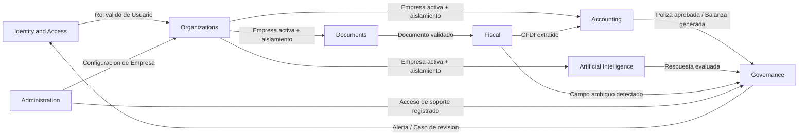

# Modelo de Dominio del Sistema — ContaIA

## Control del documento

| Campo                               | Valor                                                                                                                                                       |
| ----------------------------------- | ----------------------------------------------------------------------------------------------------------------------------------------------------------- |
| Documento                           | 05_SYSTEM_DOMAIN_MODEL.md                                                                                                                                   |
| Orden de trabajo                    | AWO-001                                                                                                                                                     |
| Versión                             | 1.0                                                                                                                                                         |
| **Estado**                          | **Draft v1.0**                                                                                                                                              |
| Fecha de creación                   | 2026-07-18                                                                                                                                                  |
| Última actualización                | 2026-07-18                                                                                                                                                  |
| Fuentes de verdad                   | `MASTER_CONTEXT.md`, `docs/00_PRODUCT_VISION.md`, `docs/01_PRD.md`, `docs/02_USER_PERSONAS.md`, `docs/04_BUSINESS_RULES.md`                                 |
| Documentos que este modelo alimenta | `docs/07_SOFTWARE_ARCHITECTURE.md`, `docs/09_DATABASE_DESIGN.md`, `docs/08_API_DESIGN.md`, `docs/10_AI_ARCHITECTURE.md`, `docs/11_SECURITY_ARCHITECTURE.md` |

> Nota: Este documento modela el **negocio**, no la base de datos ni la interfaz. No define tablas, endpoints, microservicios ni tecnologías. Ninguna decisión técnica futura puede contradecir este modelo sin pasar antes por una actualización explícita del mismo.

---

## 1. Introducción

El dominio de ContaIA es la gestión contable, fiscal y de conocimiento de una o varias empresas mexicanas, mediada por personas humanas con roles definidos y asistida — nunca sustituida — por agentes de inteligencia artificial. El dominio cubre cuatro preocupaciones centrales: (1) quién puede hacer qué, sobre qué empresa; (2) cómo se organiza, extrae y usa la información de documentos fiscales; (3) cómo se registra, aprueba y consolida la información contable; y (4) cómo la IA participa — analizando, explicando y proponiendo, pero nunca decidiendo — con fundamento verificable en todo momento.

Este modelo se limita al alcance del MVP definido en `docs/01_PRD.md` (doce módulos, seis roles, cuatro agentes de IA activos). No modela nómina, inventarios, activos fijos, tesorería, integraciones fiscales reales ni facturación de ContaIA como negocio — por ser explícitamente fuera de alcance del MVP.

## 2. Lenguaje ubicuo

Cada término tiene una única definición oficial en todo el proyecto. Donde el término ya estaba definido en `docs/04_BUSINESS_RULES.md`, se conserva sin alterar su significado.

| Término                               | Definición oficial                                                                                                                                                                                                                |
| ------------------------------------- | --------------------------------------------------------------------------------------------------------------------------------------------------------------------------------------------------------------------------------- |
| **Usuario**                           | Persona con una identidad única en ContaIA (credenciales propias), que puede tener una o varias Membresías en distintas Empresas.                                                                                                 |
| **Organización**                      | Entidad que agrupa una o varias Empresas administradas por el mismo conjunto de Usuarios (formaliza el caso de un despacho contable).                                                                                             |
| **Empresa**                           | Entidad de dominio central; unidad de aislamiento de datos. Ya no es un rol (decisión del 2026-07-18, `docs/01_PRD.md` §11). Contiene su propio Catálogo de Cuentas, Documentos, Pólizas, Ejercicios y registros de Trazabilidad. |
| **Membresía**                         | La relación (Usuario, Empresa, Rol) que determina qué puede hacer un Usuario dentro de una Empresa concreta; puede llevar el atributo _propietario_.                                                                              |
| **Rol**                               | Uno de los seis roles oficiales del MVP: Administrador, Contador, Auxiliar, Supervisor, Auditor, Estudiante (`docs/04_BUSINESS_RULES.md`, sección 5).                                                                             |
| **Ejercicio Fiscal (Ejercicio)**      | Periodo contable al que se asocian Pólizas y Estados Financieros; puede estar abierto o cerrado.                                                                                                                                  |
| **Documento**                         | Cualquier archivo cargado al repositorio de una Empresa (XML, PDF, imagen), con metadatos de carga. Es el concepto más general.                                                                                                   |
| **XML**                               | Formato de archivo estructurado en el que se recibe un CFDI. Es una propiedad/representación del Documento, no una entidad distinta.                                                                                              |
| **Documento Fiscal**                  | Un Documento con relevancia fiscal declarada. En el MVP, su único tipo concreto es el CFDI.                                                                                                                                       |
| **CFDI**                              | Comprobante Fiscal Digital por Internet — especialización de Documento Fiscal, ya timbrado por su emisor original antes de llegar a ContaIA. ContaIA lo lee y extrae datos; no lo timbra ni lo valida ante el SAT.                |
| **Catálogo de Cuentas**               | Conjunto versionado de Cuentas Contables de una Empresa.                                                                                                                                                                          |
| **Cuenta Contable (Cuenta)**          | Unidad de clasificación contable dentro del Catálogo de una Empresa (ej. clasificaciones de Activo, Pasivo, Capital, Ingreso, Gasto).                                                                                             |
| **Activo / Pasivo / Capital**         | Categorías contables generales usadas para clasificar Cuentas; ContaIA no redefine su significado contable, solo las usa como agrupadores del Catálogo.                                                                           |
| **Póliza**                            | Registro contable de un movimiento, compuesto por movimientos de cargo y abono sobre Cuentas del Catálogo. Term oficial de ContaIA; ver nota sobre "Asiento" abajo.                                                               |
| **Asiento**                           | Sinónimo genérico de "Póliza" usado en otros sistemas contables. **No es una entidad distinta en ContaIA** — se documenta aquí solo para evitar ambigüedad; el término oficial y único es **Póliza**.                             |
| **Balanza de Comprobación (Balanza)** | Resultado calculado (no una entidad editable) que resume saldos por Cuenta para un Ejercicio y periodo, a partir de Pólizas definitivas.                                                                                          |
| **Estado Financiero**                 | Resultado calculado (balance general, estado de resultados) derivado de la Balanza.                                                                                                                                               |
| **Agente de IA (Agente)**             | Componente de IA especializado (Contable, Fiscal, CFDI/XML, Supervisor de calidad) que analiza, explica, recomienda, detecta riesgos, genera borradores y propone — nunca decide.                                                 |
| **Fundamento**                        | Conjunto de metadatos (fuente, documento, apartado, vigencia, advertencias) que respalda una respuesta especializada de un Agente.                                                                                                |
| **Caso de Revisión**                  | Instancia de algo pendiente de aprobación o rechazo humano (una Póliza en revisión, una respuesta de IA marcada).                                                                                                                 |
| **Auditoría**                         | Actividad de consulta de evidencia y trazabilidad, ejercida principalmente por el rol Auditor y por el rol Supervisor sobre Casos de Revisión.                                                                                    |
| **Trazabilidad**                      | Registro inmutable y estandarizado de toda acción sensible (usuario, empresa, fecha, acción, resultado).                                                                                                                          |
| **Evento (Evento de Dominio)**        | Hecho relevante ya ocurrido en el dominio, usado para comunicar cambios entre Bounded Contexts (sección 8).                                                                                                                       |
| **Notificación / Alerta**             | Aviso dentro de la plataforma que dirige la atención de un Usuario hacia un Caso de Revisión o una inconsistencia detectada de forma determinista.                                                                                |

> **Término deliberadamente excluido: "Workspace".** No se define como entidad porque duplicaría el par ya aprobado Organización/Empresa (`docs/01_PRD.md` §11) sin aportar un concepto nuevo. Ver "Observaciones del Arquitecto".

## 3. Bounded contexts

| Contexto                    | Responsabilidad                                                                                                                                                                               | Fuera de su responsabilidad                                                                       |
| --------------------------- | --------------------------------------------------------------------------------------------------------------------------------------------------------------------------------------------- | ------------------------------------------------------------------------------------------------- |
| **Identity & Access**       | Usuario, credenciales, autenticación, Membresía, Rol, permisos.                                                                                                                               | Qué datos de negocio ve un rol (eso lo decide cada contexto consumidor, usando el Rol como dato). |
| **Organizations**           | Organización, Empresa, Ejercicio; aislamiento entre Empresas.                                                                                                                                 | Contenido contable o documental de la Empresa.                                                    |
| **Documents**               | Documento genérico: carga, metadatos, repositorio.                                                                                                                                            | Interpretación fiscal del contenido (eso es del contexto Fiscal).                                 |
| **Fiscal**                  | CFDI: validación estructural de XML, extracción de datos, vinculación a Pólizas. En el MVP, no incluye obligaciones, declaraciones ni integración con el SAT/PAC (Etapa 4, fuera de alcance). | Timbrado, validación oficial, cálculo de impuestos a pagar.                                       |
| **Accounting**              | Catálogo de Cuentas, Pólizas, Balanza, Estados Financieros — todo el cálculo determinístico.                                                                                                  | Generación de contenido explicativo (eso es de Artificial Intelligence).                          |
| **Artificial Intelligence** | Agentes, Fundamento, evaluación de calidad, gestión de incertidumbre.                                                                                                                         | Ejecutar o aprobar acciones definitivas (principio fundamental: la IA nunca decide).              |
| **Governance**              | Trazabilidad, Auditoría (consulta), Notificaciones/Alertas, Casos de Revisión.                                                                                                                | Generar el dato de negocio en sí (solo lo registra, expone y notifica).                           |
| **Administration**          | Panel administrativo interno de ContaIA, soporte con motivo registrado, configuración de Empresa.                                                                                             | Operación contable o fiscal de la Empresa cliente.                                                |

**Billing (facturación de ContaIA como negocio) se excluye deliberadamente de este modelo.** No existe como módulo aprobado del MVP (`docs/01_PRD.md`, sección 19: el modelo de negocio sigue "Propuesta pendiente de validación"). Se documenta como contexto futuro sin entidades definidas, para no inventar alcance no aprobado. Ver "Observaciones del Arquitecto".

## 4. Entidades

Para cada entidad: propósito, responsabilidades, ciclo de vida, relaciones, invariantes y reglas principales (referenciadas por ID a `docs/04_BUSINESS_RULES.md`, sin repetir su texto).

### Usuario

- **Propósito:** representar a una persona con acceso a la plataforma.
- **Responsabilidades:** mantener credenciales propias; sostener una o varias Membresías.
- **Ciclo de vida:** registrado → verificado → activo → (opcional) desactivado. La desactivación no borra historial (BR-USR-003).
- **Relaciones:** 1 Usuario → N Membresías (una por Empresa en la que participa).
- **Invariantes:** una sola identidad por persona, sin duplicados por correo (BR-USR-002).
- **Reglas principales:** BR-AUTH-001 a BR-AUTH-004, BR-USR-001 a BR-USR-003.

### Organización

- **Propósito:** agrupar Empresas administradas por el mismo conjunto de Usuarios (formaliza al despacho contable).
- **Responsabilidades:** ser el punto de entrada de gestión multiempresa; no almacenar datos contables propios.
- **Ciclo de vida:** creada implícitamente al crear la primera Empresa de un Usuario; crece al agregar Empresas.
- **Relaciones:** 1 Organización → N Empresas. Una Empresa pertenece a una sola Organización (supuesto de diseño; ver "Riesgos del dominio").
- **Invariantes:** ninguna Empresa es visible desde una Organización distinta a la suya (BR-ORG-002).
- **Reglas principales:** BR-ORG-001, BR-ORG-002.

### Empresa

- **Propósito:** unidad central de aislamiento de datos; representa a un negocio o cliente.
- **Responsabilidades:** ser el límite de consistencia para Catálogo, Documentos, Pólizas, Ejercicios y Trazabilidad.
- **Ciclo de vida:** creada (con un Administrador propietario asignado automáticamente) → operativa → (fuera de MVP: dada de baja).
- **Relaciones:** pertenece a una Organización; tiene N Membresías, N Documentos, un Catálogo, N Ejercicios.
- **Invariantes:** aislamiento estricto frente a cualquier otra Empresa (BR-GLB-001); siempre tiene al menos un Administrador (BR-EMP-001).
- **Reglas principales:** BR-EMP-001 a BR-EMP-003, BR-GLB-001.

### Membresía (Usuario, Empresa, Rol)

- **Propósito:** determinar qué puede hacer un Usuario dentro de una Empresa concreta.
- **Responsabilidades:** portar el Rol asignado y, si corresponde, el atributo _propietario_.
- **Ciclo de vida:** invitación pendiente → aceptada (activa) → (opcional) revocada.
- **Relaciones:** conecta exactamente un Usuario con exactamente una Empresa.
- **Invariantes:** el atributo propietario no amplía permisos técnicos (BR-PERM-003); solo un Administrador puede crear o modificar Membresías de otros (BR-PERM-002, BR-USR-001).
- **Reglas principales:** BR-USR-001, BR-EMP-004, BR-PERM-002, BR-PERM-003, sección 5 de `docs/04_BUSINESS_RULES.md`.

### Ejercicio

- **Propósito:** delimitar el periodo contable de las Pólizas y Estados Financieros.
- **Responsabilidades:** contener el rango de fechas y su estatus (abierto/cerrado).
- **Ciclo de vida:** abierto → (fuera de MVP: cierre formal) cerrado.
- **Relaciones:** pertenece a una Empresa; contiene N Pólizas.
- **Invariantes:** un Ejercicio cerrado no admite nuevas Pólizas definitivas (BR-EJE-002).
- **Reglas principales:** BR-EJE-001, BR-EJE-002.

### Documento

- **Propósito:** representar cualquier archivo cargado por un Usuario a una Empresa.
- **Responsabilidades:** conservar metadatos mínimos de carga.
- **Ciclo de vida:** cargado → (si es XML) procesado → vinculado o archivado.
- **Relaciones:** pertenece a exactamente una Empresa; puede estar vinculado a una o varias Pólizas.
- **Invariantes:** pertenencia exclusiva a una Empresa (BR-DOC-001); metadatos mínimos obligatorios (BR-DOC-002).
- **Reglas principales:** BR-DOC-001, BR-DOC-002, BR-DOC-003.

### CFDI (especialización de Documento)

- **Propósito:** representar un comprobante fiscal ya timbrado por su emisor original.
- **Responsabilidades:** exponer sus datos estructurados (emisor, receptor, conceptos, montos, impuestos) tal como aparecen en el archivo.
- **Ciclo de vida:** cargado → validado estructuralmente → extraído (con o sin campos marcados como ambiguos) → vinculado a Póliza (opcional).
- **Relaciones:** es un Documento; puede vincularse a una Póliza.
- **Invariantes:** nunca se timbra ni se valida ante el SAT dentro de ContaIA (BR-CFDI-001); ningún dato se usa contablemente sin revisión humana (BR-XML-003).
- **Reglas principales:** BR-XML-001, BR-XML-002, BR-CFDI-001 a BR-CFDI-003.

### Catálogo de Cuentas / Cuenta Contable

- **Propósito:** estructurar la clasificación contable de una Empresa.
- **Responsabilidades:** mantener Cuentas únicas y su jerarquía; versionar cambios.
- **Ciclo de vida:** cuenta creada → activa → (opcional) desactivada; nunca eliminada físicamente.
- **Relaciones:** pertenece a una Empresa; referenciada por N Pólizas.
- **Invariantes:** unicidad de Cuenta dentro de una Empresa (BR-CAT-002); historial versionado (BR-CAT-001).
- **Reglas principales:** BR-CAT-001, BR-CAT-002, BR-VER-003.

### Póliza

- **Propósito:** registrar un movimiento contable balanceado.
- **Responsabilidades:** mantener sus movimientos de cargo/abono; sostener su propio estado de aprobación.
- **Ciclo de vida:** borrador → pendiente de revisión → definitiva (inmutable) → (si requiere corrección) referenciada por una Póliza de ajuste nueva.
- **Relaciones:** pertenece a una Empresa y a un Ejercicio; referencia Cuentas del Catálogo; puede vincularse a un Documento/CFDI origen.
- **Invariantes:** cargos = abonos (BR-POL-002); nunca nace definitiva (BR-POL-001); inmutable una vez definitiva (BR-POL-004); nunca se aprueba a sí misma sin actor humano (BR-GLB-002, BR-POL-003).
- **Reglas principales:** BR-POL-001 a BR-POL-004, BR-EJE-002, BR-INT-001, BR-INT-002.

### Caso de Revisión

- **Propósito:** representar cualquier propuesta (Póliza pendiente, respuesta de IA marcada) que requiere una decisión humana.
- **Responsabilidades:** enrutarse al Rol correspondiente; conservar el resultado de la decisión (aprobado/rechazado, motivo).
- **Ciclo de vida:** creado → visible en la cola del aprobador → resuelto (aprobado o rechazado).
- **Relaciones:** referencia a la Póliza o respuesta de IA que lo originó; referencia al Usuario que lo resuelve.
- **Invariantes:** todo rechazo requiere motivo (BR-TRZ-003); ninguna acción sensible se ejecuta sin pasar por un Caso de Revisión resuelto como aprobado (BR-GLB-002).
- **Reglas principales:** BR-GLB-002, BR-NOT-001, BR-TRZ-003, BR-IA-005.

### Registro de Trazabilidad

- **Propósito:** dejar evidencia inmutable de toda acción sensible.
- **Responsabilidades:** capturar usuario, empresa, fecha/hora, acción, información afectada, resultado y versión de reglas.
- **Ciclo de vida:** creado una vez; nunca editado ni eliminado.
- **Relaciones:** referencia a la entidad y al Usuario que originaron la acción.
- **Invariantes:** inmutabilidad total (BR-TRZ-002); campos mínimos obligatorios (BR-TRZ-001).
- **Reglas principales:** BR-TRZ-001 a BR-TRZ-003, BR-AUD-001, BR-INT-002.

### Alerta

- **Propósito:** señalar de forma determinista una inconsistencia detectable (póliza descuadrada, documento sin clasificar, campo ambiguo).
- **Responsabilidades:** dirigirse al Rol responsable de resolverla.
- **Ciclo de vida:** generada → visible → resuelta (implícitamente, al corregirse la causa).
- **Relaciones:** referencia a la entidad que la originó (Póliza, Documento).
- **Invariantes:** nunca generada por IA generativa, solo por reglas deterministas (BR-NOT-002); nunca visible fuera de su Empresa (BR-NOT-003).
- **Reglas principales:** BR-NOT-001 a BR-NOT-003.

### Respuesta de IA

- **Propósito:** representar la salida de un Agente ante una pregunta o solicitud.
- **Responsabilidades:** portar su Fundamento (o la declaración de ausencia) y su clasificación de calidad.
- **Ciclo de vida:** generada → evaluada por el Agente supervisor de calidad → (si aplica) bloqueada como Caso de Revisión, o mostrada al Usuario, quien puede además marcarla para revisión.
- **Relaciones:** referencia a la Empresa activa de la consulta; puede originar un Caso de Revisión.
- **Invariantes:** nunca mezcla datos de otra Empresa (BR-IA-003, BR-GLB-001); nunca se presenta sin Fundamento o sin declaración explícita de su ausencia (BR-GLB-003, BR-IA-006).
- **Reglas principales:** BR-IA-001 a BR-IA-008, BR-GLB-003 a BR-GLB-005.

## 5. Value objects

| Value Object             | Descripción                                                                                                                                                                      |
| ------------------------ | -------------------------------------------------------------------------------------------------------------------------------------------------------------------------------- |
| **RFC**                  | Identificador fiscal mexicano de una persona o empresa, tal como aparece en un CFDI. ContaIA valida su formato estructural; no lo valida ante el SAT (fuera de alcance del MVP). |
| **Folio Fiscal**         | Identificador único (UUID) de un CFDI, tal como lo declara el propio archivo.                                                                                                    |
| **Periodo Fiscal**       | Rango de fechas (inicio, fin) que delimita un Ejercicio o una consulta de Balanza/Estado Financiero.                                                                             |
| **Dinero**               | Par (monto, moneda) usado en montos de Pólizas y CFDI. ContaIA no define tasas de conversión ni reglas cambiarias en el MVP.                                                     |
| **Correo Electrónico**   | Identificador de contacto y de inicio de sesión de un Usuario.                                                                                                                   |
| **Vigencia**             | Par (fecha de inicio, fecha de terminación opcional) usado para versionar contenido normativo en `knowledge/` (BR-VER-001) y para calificar la actualidad de un Fundamento.      |
| **Fundamento**           | Conjunto (fuente, documento, apartado o regla, vigencia, advertencias) que respalda una Respuesta de IA (BR-IA-006).                                                             |
| **Estado de Aprobación** | Enumeración: borrador, pendiente de revisión, definitiva, rechazada — aplicable a Pólizas y, de forma análoga, a Casos de Revisión.                                              |
| **Rol**                  | Enumeración cerrada de los seis roles oficiales del MVP (sección 2).                                                                                                             |

## 6. Aggregate roots

- **Empresa** es el agregado raíz principal del dominio: define el límite de consistencia para Catálogo de Cuentas, Documentos, Pólizas, Ejercicios y Trazabilidad (BR-GLB-001). Ninguna operación cruza este límite sin pasar por una validación explícita de acceso.
- **Usuario** es agregado raíz independiente: su identidad y credenciales existen fuera del límite de cualquier Empresa; solo su Membresía se relaciona con una Empresa concreta.
- **Organización** es agregado raíz ligero: agrupa Empresas por referencia, sin absorber su contenido — cada Empresa sigue siendo su propio límite de consistencia (BR-ORG-001).
- **Póliza** es agregado raíz dentro del límite de una Empresa: tiene sus propios invariantes fuertes (balance, inmutabilidad) que deben protegerse con su propia transacción, independientemente del resto de la Empresa.
- **Documento / CFDI** es agregado raíz dentro del límite de una Empresa: su ciclo de validación y extracción es autónomo respecto a Pólizas u otras entidades, aunque luego se vincule a ellas.

Estos cinco agregados existen porque cada uno protege una invariante que ningún otro componente del sistema puede violar de forma parcial: aislamiento (Empresa), unicidad de identidad (Usuario), balance e inmutabilidad (Póliza), fidelidad de extracción (Documento/CFDI), y agrupación sin fuga de datos (Organización).

## 7. Domain services

Procesos de negocio que no pertenecen a una sola entidad:

- **Servicio de Aislamiento Multiempresa:** valida en cada operación que el Usuario tenga Membresía vigente en la Empresa solicitada (BR-GLB-001).
- **Servicio de Aprobación:** gestiona el ciclo genérico de un Caso de Revisión (creación, enrutamiento al Rol correcto, resolución con motivo) — reutilizado por Pólizas y por Respuestas de IA marcadas (BR-GLB-002, BR-NOT-001, BR-TRZ-003).
- **Motor de Cálculo Contable:** genera Balanza y Estados Financieros de forma determinística a partir de Pólizas definitivas de un Ejercicio (BR-GLB-004, BR-EF-001 a BR-EF-003).
- **Servicio de Extracción de CFDI:** valida estructuralmente un XML y extrae sus datos sin reinterpretarlos (BR-XML-001, BR-CFDI-002).
- **Servicio de Fundamentación de IA:** busca contenido curado en `knowledge/`, ensambla el Fundamento y lo somete al Agente supervisor de calidad antes de exponer la Respuesta (BR-IA-001, BR-IA-006, BR-IA-008).
- **Servicio de Trazabilidad:** estandariza el registro de todo evento sensible con sus siete campos mínimos (BR-TRZ-001).
- **Servicio de Notificación:** enruta Alertas y Casos de Revisión al Rol responsable dentro de la Empresa correspondiente (BR-NOT-002, BR-NOT-003).

## 8. Domain events

| Evento                           | Cuándo ocurre                                                                                                               |
| -------------------------------- | --------------------------------------------------------------------------------------------------------------------------- |
| **EmpresaCreada**                | Al completarse BR-EMP-001; genera automáticamente la Membresía de Administrador propietario.                                |
| **UsuarioInvitado**              | Cuando un Administrador crea una invitación con Rol explícito (BR-USR-001).                                                 |
| **InvitaciónAceptada**           | Cuando el Usuario invitado confirma, activando su Membresía.                                                                |
| **DocumentoCargado**             | Al completar la carga de un archivo con sus metadatos mínimos (BR-DOC-002).                                                 |
| **XMLValidado**                  | Cuando un archivo XML pasa (o falla) la validación estructural (BR-XML-001).                                                |
| **CFDIExtraído**                 | Cuando el Servicio de Extracción produce los datos estructurados de un CFDI (BR-CFDI-002).                                  |
| **CampoAmbiguoDetectado**        | Cuando un campo de un CFDI no puede determinarse con certeza (BR-XML-002).                                                  |
| **PólizaCapturada**              | Al crearse una Póliza en estado borrador (BR-POL-001).                                                                      |
| **PólizaEnviadaARevisión**       | Cuando una Póliza balanceada se enruta a un aprobador (BR-POL-002, genera un Caso de Revisión).                             |
| **PólizaAprobada**               | Cuando un Contador o Supervisor aprueba una Póliza, volviéndola definitiva (BR-POL-003).                                    |
| **PólizaRechazada**              | Cuando un aprobador rechaza una Póliza con motivo (BR-TRZ-003), regresándola a borrador.                                    |
| **PólizaDeAjusteCreada**         | Cuando se corrige una Póliza definitiva mediante una nueva Póliza referenciada (BR-POL-004).                                |
| **EjercicioCerrado**             | Cuando un Ejercicio se marca como cerrado (BR-EJE-002; flujo formal pendiente, ver sección 11).                             |
| **BalanzaGenerada**              | Cuando el Motor de Cálculo Contable produce una Balanza para un Ejercicio y periodo (BR-EF-001, BR-EF-002).                 |
| **EstadoFinancieroGenerado**     | Cuando se genera un Estado Financiero a partir de una Balanza (BR-EF-003).                                                  |
| **IAGeneróRespuesta**            | Cuando un Agente produce una Respuesta candidata, antes de la evaluación de calidad (BR-IA-001).                            |
| **RespuestaEvaluada**            | Cuando el Agente supervisor de calidad clasifica una Respuesta como aprobada, requiere revisión o insuficiente (BR-IA-008). |
| **RespuestaMarcadaParaRevisión** | Cuando un Usuario marca una Respuesta de IA para que la revise un Supervisor (BR-NOT-001).                                  |
| **AlertaGenerada**               | Cuando el sistema detecta una inconsistencia determinista (BR-NOT-002).                                                     |
| **AccesoDeSoporteRegistrado**    | Cuando el Administrador de plataforma registra un motivo antes de acceder a una Empresa cliente (BR-SEC-004, BR-AUD-003).   |
| **RolAsignado / RolModificado**  | Cuando un Administrador crea o cambia una Membresía existente (BR-PERM-002).                                                |

## 9. Relaciones entre contextos

Cada flecha representa un Evento de Dominio (sección 8) que un contexto publica y otro consume; ningún contexto lee directamente el almacenamiento interno de otro (principio de modularidad, `MASTER_CONTEXT.md` 10.9).

## 10. Reglas del dominio (resumen)

Este resumen no repite `docs/04_BUSINESS_RULES.md`; solo enuncia los invariantes que definen la forma del modelo:

- Aislamiento estricto entre Empresas (BR-GLB-001).
- La IA nunca ejecuta ni decide; solo analiza, explica, recomienda, detecta, borra borradores y propone (principio fundamental, `docs/04_BUSINESS_RULES.md` sección 2; BR-IA-003, BR-IA-004).
- Ninguna acción sensible se completa sin un Caso de Revisión resuelto por un humano (BR-GLB-002).
- Toda Respuesta de IA especializada porta Fundamento o declara su ausencia (BR-GLB-003).
- Todo cálculo contable crítico es determinístico y versionado (BR-GLB-004).
- Una Póliza nace en borrador, se balancea, se aprueba humanamente y, una vez definitiva, es inmutable salvo ajuste trazado (BR-POL-001 a BR-POL-004).
- Un Ejercicio cerrado protege su historia: no admite nuevas Pólizas definitivas (BR-EJE-002).
- Toda acción sensible deja un Registro de Trazabilidad inmutable (BR-TRZ-001, BR-TRZ-002).

## 11. Riesgos del dominio

- **Cardinalidad Organización-Empresa no confirmada.** Este modelo asume que una Empresa pertenece a exactamente una Organización. Ninguna fuente de verdad lo confirma ni lo contradice explícitamente; si en el futuro una Empresa necesitara pertenecer a varias Organizaciones (por ejemplo, dos despachos que la comparten), este modelo tendría que revisarse.
- **"Ejercicio" está subespecificado.** `docs/04_BUSINESS_RULES.md` ya señala que el flujo formal de cierre de Ejercicio no está definido en el MVP (BR-EJE-002, nota de excepción). Este modelo declara la entidad y su invariante básico, pero su ciclo de vida completo (quién cierra, si se puede reabrir) queda pendiente.
- **"Fundamento" es compartido entre IA y, potencialmente, Auditoría.** Si en el futuro Auditoría necesita su propio concepto de evidencia normativa, existe riesgo de definiciones duplicadas si no se reutiliza este mismo value object.
- **Ausencia de un contexto Billing definido.** Cuando se apruebe el modelo de negocio (`docs/01_PRD.md`, sección 19), este documento deberá actualizarse para incorporarlo; hoy no tiene entidades ni eventos.
- **Documento vs. Documento Fiscal vs. CFDI.** La jerarquía de tres niveles (sección 2) es una interpretación de este documento, no una distinción explícita en `docs/01_PRD.md`. Si en el futuro se agregan tipos de Documento Fiscal distintos del CFDI, esta jerarquía deberá revalidarse.

## 12. Preparación para arquitectura

Este modelo facilita el trabajo de los documentos técnicos siguientes:

- **`docs/07_SOFTWARE_ARCHITECTURE.md`** puede usar los ocho Bounded Contexts (sección 3) como candidatos directos a módulos del monolito modular (principio 10.9 de `MASTER_CONTEXT.md`), y los cinco Aggregate Roots (sección 6) como límites de transacción.
- **`docs/09_DATABASE_DESIGN.md`** puede derivar entidades de almacenamiento candidatas directamente de la sección 4, y campos candidatos de los Value Objects de la sección 5 — sin que este documento prescriba tablas ni tipos de columna.
- **`docs/08_API_DESIGN.md`** puede usar los Domain Events de la sección 8 como candidatos a operaciones o webhooks expuestos entre módulos.
- **`docs/10_AI_ARCHITECTURE.md`** puede partir directamente de la entidad Respuesta de IA, el value object Fundamento, y el Servicio de Fundamentación de IA (sección 7) para diseñar el pipeline técnico de los Agentes.
- **`docs/11_SECURITY_ARCHITECTURE.md`** puede anclar sus controles de acceso en la Membresía (sección 4) y en el Servicio de Aislamiento Multiempresa (sección 7), que ya encapsulan la regla de aislamiento más crítica del sistema (BR-GLB-001).

---

## Historial de cambios

| Fecha      | Cambio                                                                                                                                                                                                                                                                             | Responsable                        |
| ---------- | ---------------------------------------------------------------------------------------------------------------------------------------------------------------------------------------------------------------------------------------------------------------------------------- | ---------------------------------- |
| 2026-07-18 | Creación de la primera versión completa de `docs/05_SYSTEM_DOMAIN_MODEL.md` bajo AWO-001: lenguaje ubicuo, 8 bounded contexts, 13 entidades, 9 value objects, 5 aggregate roots, 7 domain services, 20 domain events, mapa de contextos y riesgos del dominio. Estado: Draft v1.0. | Responsable de producto de ContaIA |

---

## Observaciones del Arquitecto

**Decisiones tomadas:**

- Antes de escribir este documento se detectó y corrigió un error de numeración propio de una Work Order anterior: el contenido de reglas de negocio vivía en `docs/03_BUSINESS_RULES.md`, en conflicto con `docs/03_ROADMAP.md` (posición ya asignada en la reorganización previa de `docs/`). Se reubicó a `docs/04_BUSINESS_RULES.md` (su posición correcta) y se corrigieron todas las referencias cruzadas en `MASTER_CONTEXT.md`, `docs/01_PRD.md`, `docs/02_USER_PERSONAS.md` y dentro del propio archivo movido, antes de insertar este documento en la posición 05 y desplazar el resto de `docs/` de 05-16 a 06-17.
- Se excluyó el término "Workspace" (sugerido como ejemplo en la Work Order) por duplicar el par ya aprobado Organización/Empresa sin aportar un concepto nuevo — mantenerlo habría creado dos formas de nombrar lo mismo.
- Se excluyó "Asiento" como entidad distinta de "Póliza"; se documentó como sinónimo no oficial para evitar que un lector con vocabulario de otros sistemas contables lo busque como concepto separado.
- Se excluyó el Bounded Context "Billing" (sugerido como ejemplo) por no existir como módulo aprobado del MVP; se documentó su ausencia explícitamente en la sección 3 en vez de inventar entidades sin respaldo en las fuentes de verdad.
- Se definió "Fiscal" como Bounded Context deliberadamente acotado a CFDI/XML en el MVP, dejando explícito que obligaciones, declaraciones e integración con el SAT/PAC son extensión futura (Etapa 4 de `MASTER_CONTEXT.md`), para no sugerir alcance no aprobado.
- Se modeló "Caso de Revisión" como entidad propia (no explícita en `docs/04_BUSINESS_RULES.md` con ese nombre) para dar una representación de dominio unificada al flujo de aprobación que hoy se describe de forma dispersa entre reglas de Pólizas, IA y Notificaciones — decisión de modelado, no un cambio de reglas de negocio.

**Conceptos redefinidos:**

- Ninguno de los conceptos ya aprobados (`Empresa`, `Organización`, `Rol`, `Membresía`/atributo propietario) fue redefinido; este documento los hereda tal como quedaron fijados en `docs/01_PRD.md` y `docs/04_BUSINESS_RULES.md` tras la decisión del 2026-07-18 sobre el modelo de roles.

**Inconsistencias corregidas:**

- La numeración de archivos descrita arriba (impacto: `docs/03_BUSINESS_RULES.md` → `docs/04_BUSINESS_RULES.md`, y `docs/05` a `docs/16` → `docs/06` a `docs/17`).

**Riesgos futuros:**

- Ver sección 11 completa: cardinalidad Organización-Empresa no confirmada, ciclo de vida de Ejercicio subespecificado, posible duplicación futura del concepto Fundamento, ausencia de Billing, y la jerarquía Documento/Documento Fiscal/CFDI como interpretación propia de este documento.

**Dependencias para AWO-002:**

- El siguiente documento técnico (`docs/07_SOFTWARE_ARCHITECTURE.md`) debe tomar los 8 Bounded Contexts y los 5 Aggregate Roots de este documento como punto de partida, no redefinirlos.
- Debe resolverse, antes o durante AWO-002, si el monolito modular (principio 10.9) mapea un módulo de código por Bounded Context o si algunos se combinan — este documento deja los 8 contextos como candidatos, no como una decisión de despliegue.
- `docs/00_DOCUMENTATION_INDEX.md` y `docs/00_DOCUMENTATION_GUIDE.md` siguen sin existir (hallazgo original en `docs/02_USER_PERSONAS.md`, confirmado fuera de alcance); con la reubicación de archivos de esta sesión, su necesidad se refuerza — sin un índice, el desplazamiento de numeración de `docs/` es más difícil de rastrear para un lector nuevo.
