# Workflows del Sistema — ContaIA

## Control del documento

| Campo                                  | Valor                                                                                                                                                                             |
| -------------------------------------- | --------------------------------------------------------------------------------------------------------------------------------------------------------------------------------- |
| Documento                              | 06_SYSTEM_WORKFLOWS.md                                                                                                                                                            |
| Orden de trabajo                       | AWO-002                                                                                                                                                                           |
| Versión                                | 1.0                                                                                                                                                                               |
| **Estado**                             | **Draft v1.0**                                                                                                                                                                    |
| Fecha de creación                      | 2026-07-18                                                                                                                                                                        |
| Última actualización                   | 2026-07-18                                                                                                                                                                        |
| Fuentes de verdad                      | `MASTER_CONTEXT.md`, `docs/00_PRODUCT_VISION.md`, `docs/01_PRD.md`, `docs/02_USER_PERSONAS.md`, `docs/04_BUSINESS_RULES.md`, `docs/05_SYSTEM_DOMAIN_MODEL.md`                     |
| Documentos que este documento alimenta | `docs/07_SOFTWARE_ARCHITECTURE.md`, `docs/09_DATABASE_DESIGN.md`, `docs/08_API_DESIGN.md`, `docs/17_UI_UX_DESIGN.md`, `docs/10_AI_ARCHITECTURE.md`, `docs/18_TESTING_STRATEGY.md` |

> Nota: Este documento describe **cómo fluye la información** entre usuarios, módulos y procesos — no diseña código, tablas, APIs ni tecnologías. Cada workflow debe poder convertirse en casos de uso, APIs, eventos, código, pruebas y automatizaciones sin reinterpretación. Ante cualquier contradicción, `docs/04_BUSINESS_RULES.md` y `docs/05_SYSTEM_DOMAIN_MODEL.md` prevalecen.

---

## 1. Filosofía de los workflows

Un workflow en ContaIA es la secuencia observable de pasos, actores y puntos de decisión que realiza, en la práctica, las entidades y Domain Events ya definidos en `docs/05_SYSTEM_DOMAIN_MODEL.md`. Un workflow no inventa comportamiento nuevo: expresa en el tiempo lo que las Reglas de Negocio (`docs/04_BUSINESS_RULES.md`) ya exigen. Todo workflow que involucre una acción sensible contiene, de forma explícita, el punto donde un humano decide — nunca lo omite ni lo automatiza (principio fundamental, `docs/04_BUSINESS_RULES.md`, sección 2).

## 2. Principios de diseño

- **Cada paso sensible es visible.** Ningún workflow oculta un punto de aprobación humana dentro de un paso "automático" (BR-GLB-002).
- **Cada transición de estado emite un evento.** Todo cambio relevante de estado (Póliza, Ejercicio, Respuesta de IA, Caso de Revisión) se comunica como un Domain Event ya catalogado en `docs/05_SYSTEM_DOMAIN_MODEL.md` (sección 8).
- **Aislamiento primero.** Todo workflow que cruza datos de una Empresa valida la Membresía del actor antes de avanzar (BR-GLB-001).
- **Determinismo donde hay cálculo.** Ningún workflow delega un cálculo crítico a un paso de IA generativa (BR-GLB-004).
- **Trazabilidad no opcional.** Todo workflow que termina en una acción sensible deja un Registro de Trazabilidad (BR-TRZ-001).
- **Reversible, no destructivo.** Ningún workflow borra físicamente información definitiva; corrige mediante nuevos registros trazados (BR-INT-002, BR-POL-004).
- **Simplicidad para el usuario, rigor para el sistema.** Un workflow puede simplificarse en la interfaz, pero nunca en las validaciones que lo respaldan (principio 10.7 de `MASTER_CONTEXT.md`).

## 3. Workflow de autenticación

**Actores:** Usuario, Sistema.
**Precondición:** El Usuario tiene una cuenta registrada.
**Pasos:**

1. El Usuario ingresa correo y contraseña.
2. El sistema valida las credenciales.
3. Si la cuenta no está verificada, el sistema bloquea el acceso (BR-AUTH-001).
4. Si el rol requiere MFA (todos salvo Estudiante, BR-AUTH-002), el sistema solicita el segundo factor.
5. Tras validar el segundo factor, el sistema establece la sesión.
6. Intentos fallidos consecutivos activan una restricción temporal (BR-AUTH-003); la inactividad prolongada cierra la sesión (BR-AUTH-004).
   **Postcondición:** Sesión activa con Usuario identificado, o acceso denegado con motivo claro (BR-ERR-001).
   **Reglas aplicables:** BR-AUTH-001 a BR-AUTH-004.

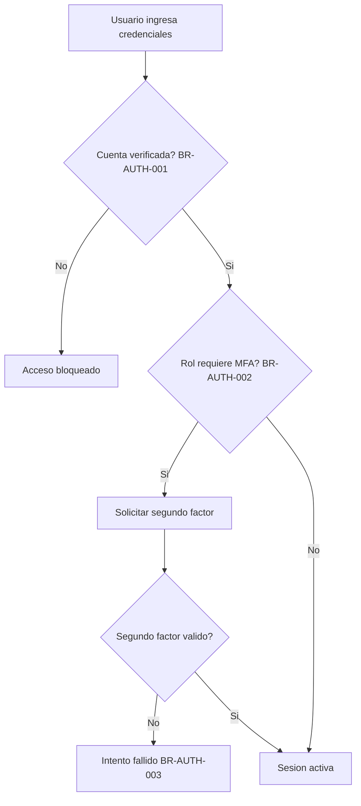

## 4. Workflow de creación de empresa

**Actores:** Usuario (futuro Administrador propietario).
**Precondición:** Sesión activa (workflow 3 completado).
**Pasos:**

1. El Usuario proporciona los datos generales de la Empresa.
2. El sistema crea la Empresa.
3. El sistema asigna al creador una Membresía con rol Administrador y atributo propietario=verdadero, en la misma transacción (BR-EMP-001).
4. Si el Usuario ya administra otras Empresas, el sistema las agrupa bajo la misma Organización; si es la primera, se crea una Organización implícita para él (BR-ORG-001).
   **Postcondición:** Empresa operativa, con un Administrador propietario identificado.
   **Eventos generados:** `EmpresaCreada`.
   **Reglas aplicables:** BR-EMP-001, BR-ORG-001, BR-GLB-001.

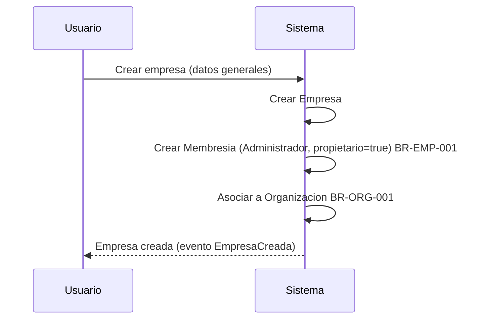

## 5. Workflow de invitación de usuarios

**Actores:** Administrador (invitador), Usuario invitado.
**Precondición:** El invitador tiene rol Administrador en la Empresa (BR-USR-001).
**Pasos:**

1. El Administrador especifica correo y Rol del invitado.
2. El sistema crea una Membresía en estado "pendiente".
3. El invitado recibe la invitación y la acepta.
4. La Membresía pasa a estado "activa".
5. Si el invitado ya tiene cuenta, se reutiliza su identidad única (BR-USR-002); si no, se le pide crearla y verificarla (workflow 3).
   **Postcondición:** El Usuario invitado tiene acceso a la Empresa con el Rol asignado.
   **Eventos generados:** `UsuarioInvitado`, `InvitaciónAceptada`.
   **Reglas aplicables:** BR-USR-001, BR-USR-002, BR-EMP-004, BR-PERM-002.

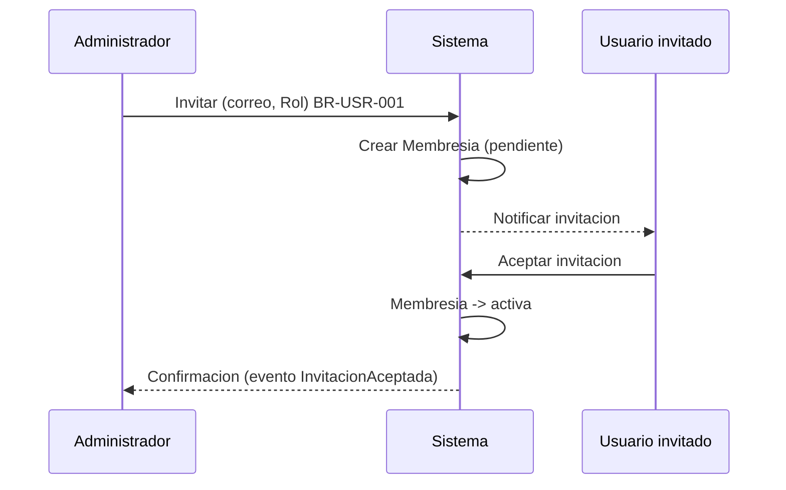

## 6. Workflow de carga de XML

**Actores:** Auxiliar, Contador.
**Precondición:** Sesión activa con Membresía en la Empresa activa.
**Pasos:**

1. El Usuario carga un archivo.
2. El sistema valida el tipo de archivo permitido (BR-DOC-003).
3. El sistema registra los metadatos mínimos (fecha, tipo, usuario) como parte de la misma transacción (BR-DOC-002).
4. Si el archivo es XML, el sistema valida su estructura antes de continuar (BR-XML-001); si no es válido, se marca como error de formato y el workflow termina aquí (ver workflow 13).
5. Si es válido, el archivo queda disponible para el workflow 7 (validación de CFDI).
   **Postcondición:** Documento almacenado y, si es XML válido, listo para extracción.
   **Eventos generados:** `DocumentoCargado`, `XMLValidado`.
   **Reglas aplicables:** BR-DOC-001 a BR-DOC-003, BR-XML-001.

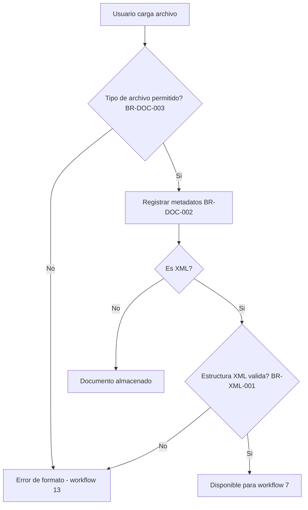

## 7. Workflow de validación de CFDI

**Actores:** Sistema (Agente de CFDI y XML), Auxiliar, Contador.
**Precondición:** XML validado estructuralmente (workflow 6).
**Pasos:**

1. El sistema extrae emisor, receptor, conceptos, montos e impuestos tal como aparecen en el archivo (BR-CFDI-002).
2. Todo campo ambiguo o incompleto se marca explícitamente, no se infiere (BR-XML-002).
3. El sistema presenta los datos extraídos al Usuario, señalando que no han sido validados ante el SAT (BR-CFDI-001).
4. El Usuario puede vincular el CFDI a una Póliza propuesta (workflow 8), conservando la referencia al documento origen (BR-CFDI-003).
   **Postcondición:** Datos estructurados disponibles, con marcas de revisión donde corresponda.
   **Eventos generados:** `CFDIExtraído`, `CampoAmbiguoDetectado` (si aplica).
   **Reglas aplicables:** BR-CFDI-001 a BR-CFDI-003, BR-XML-002.

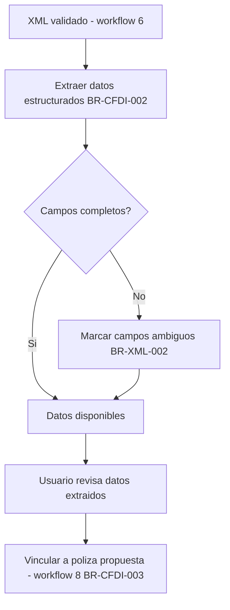

## 8. Workflow de generación de pólizas

**Actores:** Auxiliar (captura), Contador o Supervisor (aprobación).
**Precondición:** Catálogo de Cuentas configurado (BR-CAT-001); Ejercicio correspondiente abierto (BR-EJE-002).
**Pasos:**

1. El Usuario captura una Póliza manualmente o a partir de un CFDI vinculado (workflow 7).
2. La Póliza se crea en estado "borrador" (BR-POL-001), asociada a un Ejercicio según su fecha (BR-EJE-001).
3. El sistema valida que cargos = abonos (BR-POL-002); si no cuadra, bloquea el envío a revisión y genera una Alerta (workflow 12).
4. Si está balanceada, el Usuario la envía a revisión, generando un Caso de Revisión (workflow 9 comparte este mecanismo con las respuestas de IA).
5. Un Contador o Supervisor aprueba (la Póliza pasa a "definitiva") o rechaza con motivo (regresa a "borrador").
6. Si más tarde se detecta un error en una Póliza definitiva, se crea una Póliza de ajuste referenciada, que repite este mismo flujo (BR-POL-004).
   **Postcondición:** Póliza definitiva contabilizada, o en borrador pendiente de corrección.
   **Eventos generados:** `PólizaCapturada`, `PólizaEnviadaARevisión`, `PólizaAprobada` / `PólizaRechazada`, `PólizaDeAjusteCreada` (si aplica).
   **Reglas aplicables:** BR-POL-001 a BR-POL-004, BR-EJE-001, BR-EJE-002, BR-GLB-002, BR-INT-001.

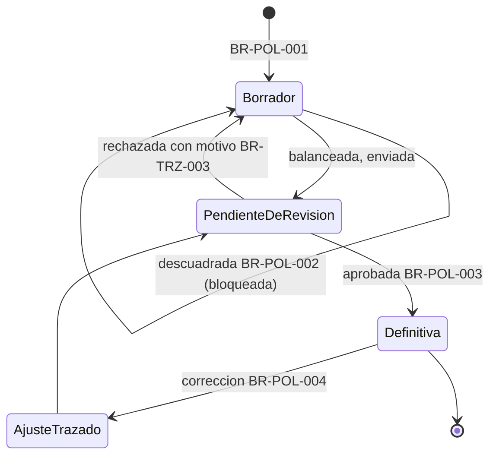

## 9. Workflow de aprobación de sugerencias de IA

**Actores:** Agente especializado (Contable, Fiscal, CFDI/XML), Agente supervisor de calidad, Usuario, Supervisor (rol humano).
**Precondición:** Un Usuario realiza una consulta, o el sistema genera una propuesta asistida por IA.
**Pasos:**

1. El Agente especializado genera una Respuesta candidata, con Fundamento si existe (BR-IA-001, BR-IA-006) o declaración explícita de ausencia (BR-GLB-003).
2. El Agente supervisor de calidad evalúa la Respuesta: aprobada, requiere revisión, o insuficiente (BR-IA-008).
3. Si es "insuficiente" o de alto riesgo, se bloquea y se crea un Caso de Revisión enrutado a un Supervisor humano (BR-IA-005, BR-GLB-002).
4. Si es "aprobada", se muestra al Usuario, quien puede además marcarla manualmente para revisión (BR-NOT-001).
5. El Supervisor humano, si interviene, aprueba o rechaza con motivo (BR-TRZ-003); la Respuesta nunca se ejecuta ni se contabiliza por sí sola (principio fundamental).
   **Postcondición:** Respuesta mostrada con su nivel de confianza explícito, o bloqueada hasta revisión humana.
   **Eventos generados:** `IAGeneróRespuesta`, `RespuestaEvaluada`, `RespuestaMarcadaParaRevisión` (si aplica).
   **Reglas aplicables:** BR-IA-001 a BR-IA-008, BR-GLB-002 a BR-GLB-005.

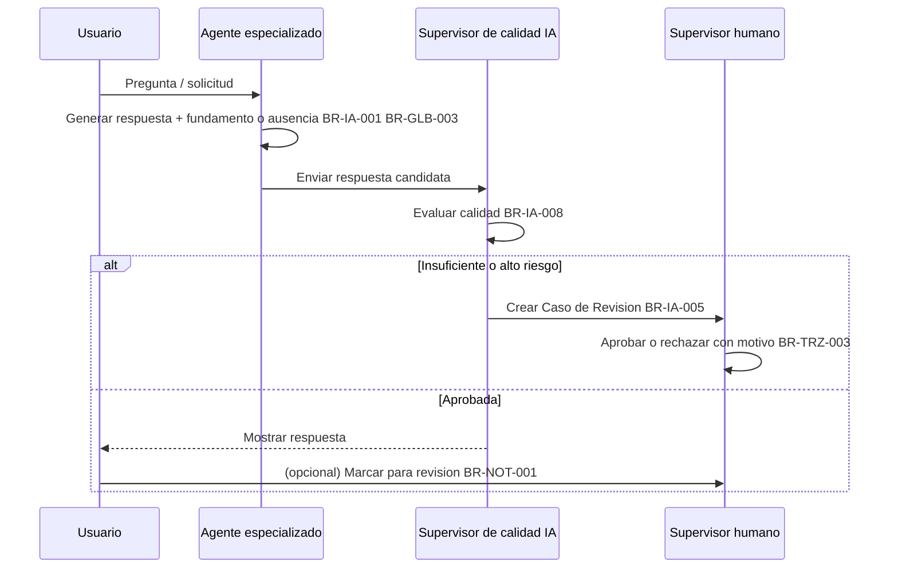

## 10. Workflow de generación de estados financieros

**Actores:** Sistema (Motor de Cálculo Contable), Contador, Director financiero (rol Administrador no propietario), Empresa (rol Administrador propietario).
**Precondición:** Existen Pólizas definitivas en el Ejercicio y periodo solicitados.
**Pasos:**

1. El Usuario solicita balanza o estado financiero de un Ejercicio y periodo.
2. El Motor de Cálculo filtra únicamente Pólizas definitivas (BR-EF-001).
3. El Motor calcula de forma determinística, registrando la versión de la fórmula usada (BR-GLB-004, BR-EF-002).
4. El resultado se presenta con periodo, fecha de generación y advertencia de que no es un documento fiscal oficial, cuando corresponda (BR-EF-003).
   **Postcondición:** Balanza o Estado Financiero disponible para consulta o exportación.
   **Eventos generados:** `BalanzaGenerada`, `EstadoFinancieroGenerado`.
   **Reglas aplicables:** BR-EF-001 a BR-EF-003, BR-GLB-004, BR-VER-002.

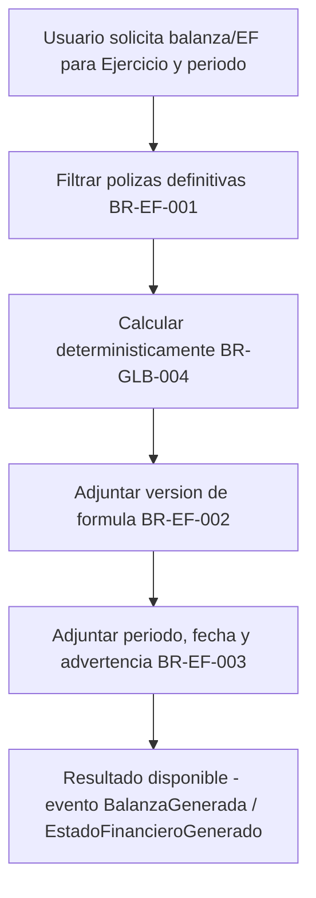

## 11. Workflow de auditoría

**Actores:** Auditor, Administrador de Empresa, Administrador de plataforma (soporte interno).
**Precondición:** El Auditor no tiene, por defecto, acceso a ninguna Empresa (BR-PERM-001).
**Pasos — acceso de un Auditor externo:**

1. Un Administrador de la Empresa otorga acceso explícito de auditoría al Auditor (BR-USR-001, análogo a una invitación con rol Auditor).
2. El Auditor consulta, en modo de solo lectura, Pólizas (incluidas las definitivas), documentos origen, historial de aprobación y estados financieros (BR-AUD-002, BR-ROL-003).
3. Ninguna operación de escritura está disponible para este rol, ni siquiera por vía directa (BR-ROL-003).
   **Pasos — acceso de soporte interno de ContaIA:**
4. El Administrador de plataforma registra un motivo antes de solicitar acceso a una Empresa cliente (BR-SEC-004, BR-AUD-003).
5. El sistema concede el acceso y lo registra en trazabilidad.
6. El acceso se limita a lo necesario para resolver la incidencia reportada.
   **Postcondición:** Evidencia consultada sin alteración; acceso completamente trazado.
   **Eventos generados:** `AccesoDeSoporteRegistrado`.
   **Reglas aplicables:** BR-AUD-001 a BR-AUD-003, BR-ROL-003, BR-SEC-004, BR-PERM-001.

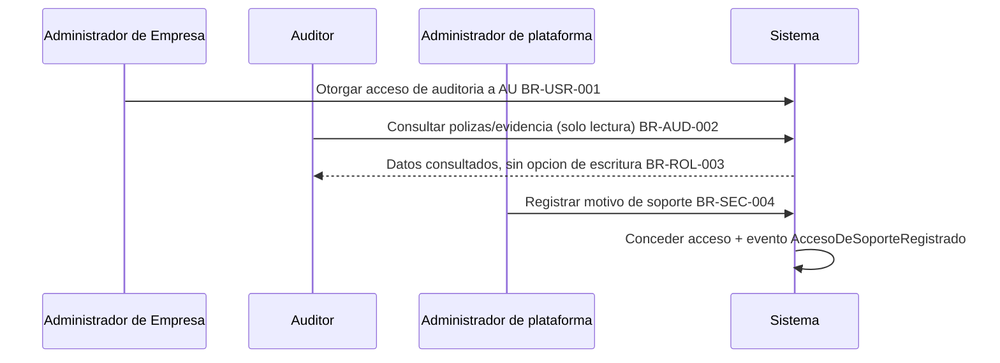

## 12. Workflow de notificaciones

**Actores:** Sistema, Rol responsable (Auxiliar, Contador, Supervisor según el caso).
**Precondición:** Ocurre un evento que requiere atención (inconsistencia determinista o Caso de Revisión creado).
**Pasos:**

1. El sistema detecta la condición (póliza descuadrada, documento sin clasificar, campo ambiguo, Caso de Revisión nuevo) de forma determinista, nunca por IA generativa (BR-NOT-002).
2. El sistema valida que el destinatario tenga Membresía en la Empresa correspondiente antes de mostrar la notificación (BR-NOT-003, BR-GLB-001).
3. La Alerta o el Caso de Revisión aparece en la cola de pendientes del Rol responsable (BR-NOT-001).
   **Postcondición:** El responsable ve la alerta o el pendiente la próxima vez que accede a la plataforma.
   **Eventos generados:** `AlertaGenerada`.
   **Reglas aplicables:** BR-NOT-001 a BR-NOT-003.

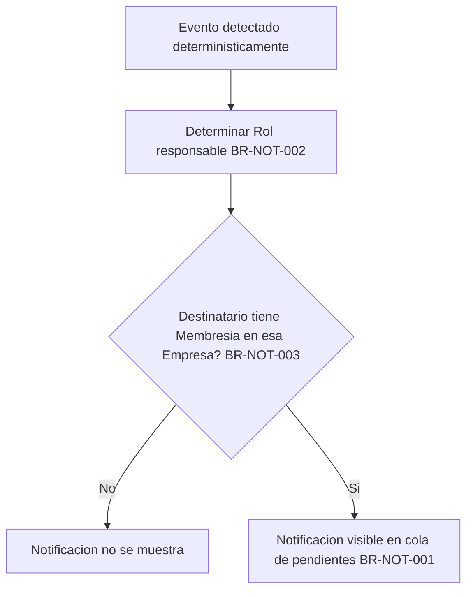

## 13. Workflow de errores

**Actores:** Sistema, Usuario.
**Precondición:** Una operación falla, por validación de datos o por fallo interno inesperado.
**Pasos:**

1. Si el fallo es de validación (dato inválido, formato incorrecto), el sistema traduce la causa a un mensaje claro con la acción sugerida (BR-ERR-001).
2. Si el fallo es interno e inesperado, el sistema registra el detalle técnico solo en sus registros internos y muestra al Usuario un mensaje genérico y seguro (BR-ERR-002, BR-SEC-003).
3. Si la operación falló a medio camino (por ejemplo, una carga interrumpida), el sistema revierte el cambio parcial o lo marca como incompleto, permitiendo reintento sin duplicar datos (BR-ERR-003).
   **Postcondición:** El Usuario entiende qué ocurrió y puede reintentar sin generar inconsistencias.
   **Reglas aplicables:** BR-ERR-001 a BR-ERR-003, BR-SEC-003.

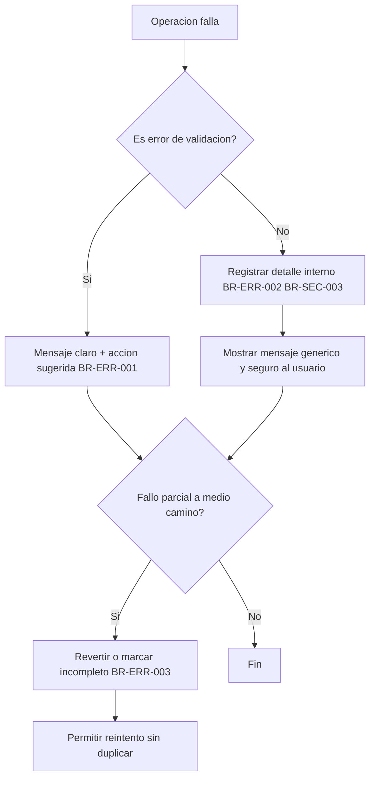

## 14. Workflow de cierre de ejercicio fiscal

> **Nota de alcance:** `docs/04_BUSINESS_RULES.md` (BR-EJE-002) define el efecto del cierre (bloquear nuevas Pólizas definitivas) pero señala explícitamente que el flujo formal de cierre no está definido en el MVP. El workflow siguiente es la interpretación mínima y consistente con BR-EJE-002 y con el patrón ya usado para operaciones de configuración de alto impacto (BR-CFG-001, restringidas a Administrador); **no introduce una regla de negocio nueva**, solo la secuencia más simple que satisface la regla existente. Se marca como supuesto a validar (ver sección 20).

**Actores:** Administrador (por analogía con BR-CFG-001, dado que cerrar un Ejercicio es una acción de configuración de alto impacto).
**Precondición:** El Ejercicio está abierto.
**Pasos:**

1. El Administrador solicita cerrar el Ejercicio.
2. El sistema muestra las Pólizas en estado "borrador" o "pendiente de revisión" que quedarían fuera del cierre, como advertencia (no bloqueante, salvo decisión posterior de negocio).
3. El Administrador confirma el cierre.
4. El sistema marca el Ejercicio como cerrado.
5. A partir de ese momento, ninguna Póliza con fecha de ese Ejercicio puede aprobarse como definitiva (BR-EJE-002); las correcciones requieren una Póliza de ajuste en el Ejercicio abierto (BR-POL-004).
   **Postcondición:** Ejercicio cerrado; su historial contable queda estable.
   **Eventos generados:** `EjercicioCerrado`.
   **Reglas aplicables:** BR-EJE-001, BR-EJE-002, BR-POL-004 (analogía BR-CFG-001).

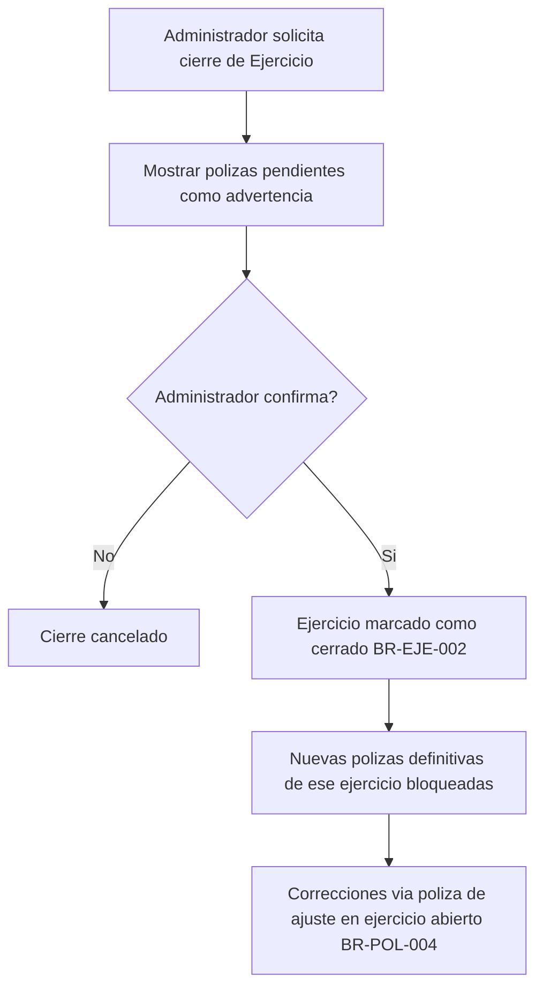

## 15. Workflow de administración

**Actores:** Administrador de Empresa, Administrador de plataforma.
**Precondición:** Se requiere un cambio de configuración o soporte operativo.
**Pasos — configuración de Empresa:**

1. El Administrador de Empresa solicita un cambio (datos generales, catálogo base, usuarios).
2. El sistema valida que el solicitante tenga rol Administrador en esa Empresa (BR-CFG-001, BR-EMP-003).
3. El cambio se ejecuta y se registra con usuario, fecha y valor anterior (BR-CFG-002, BR-TRZ-001).
   **Pasos — panel administrativo interno:**
4. El Administrador de plataforma da soporte a una cuenta, con motivo registrado (BR-SEC-004).
5. Visualiza estado agregado de cuentas sin exponer datos sensibles de una Empresa a otra (BR-GLB-001).
   **Postcondición:** Cambios de configuración trazados; soporte interno auditable.
   **Eventos generados:** `RolAsignado` / `RolModificado`, `AccesoDeSoporteRegistrado`.
   **Reglas aplicables:** BR-CFG-001, BR-CFG-002, BR-SEC-004, BR-EMP-003.

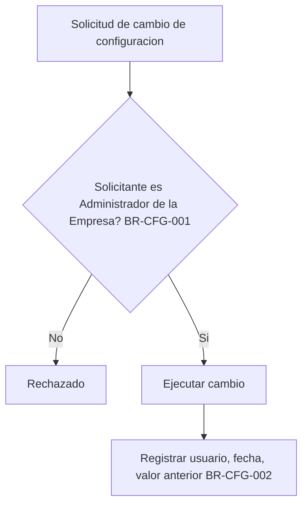

## 16. Workflows entre Bounded Contexts

Ejemplo de extremo a extremo: de la carga de un CFDI a un Estado Financiero actualizado, mostrando cómo cruza los ocho Bounded Contexts de `docs/05_SYSTEM_DOMAIN_MODEL.md` (sección 3).

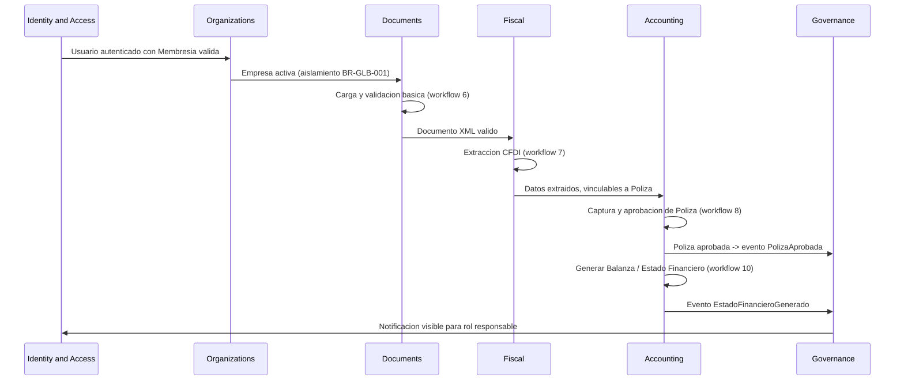

Ningún contexto accede directamente al almacenamiento interno de otro; todo cruce ocurre mediante los Domain Events ya catalogados (principio de modularidad, `MASTER_CONTEXT.md` 10.9).

## 17. Eventos generados en cada workflow

| Workflow                        | Eventos generados                                                                                        |
| ------------------------------- | -------------------------------------------------------------------------------------------------------- |
| 3. Autenticación                | (ninguno formal a nivel de dominio de negocio; gestionado por Identity & Access)                         |
| 4. Creación de empresa          | `EmpresaCreada`                                                                                          |
| 5. Invitación de usuarios       | `UsuarioInvitado`, `InvitaciónAceptada`                                                                  |
| 6. Carga de XML                 | `DocumentoCargado`, `XMLValidado`                                                                        |
| 7. Validación de CFDI           | `CFDIExtraído`, `CampoAmbiguoDetectado`                                                                  |
| 8. Generación de pólizas        | `PólizaCapturada`, `PólizaEnviadaARevisión`, `PólizaAprobada`, `PólizaRechazada`, `PólizaDeAjusteCreada` |
| 9. Aprobación de sugerencias IA | `IAGeneróRespuesta`, `RespuestaEvaluada`, `RespuestaMarcadaParaRevisión`                                 |
| 10. Estados financieros         | `BalanzaGenerada`, `EstadoFinancieroGenerado`                                                            |
| 11. Auditoría                   | `AccesoDeSoporteRegistrado`                                                                              |
| 12. Notificaciones              | `AlertaGenerada`                                                                                         |
| 13. Errores                     | (ninguno formal; alimenta registros internos, no eventos de dominio)                                     |
| 14. Cierre de ejercicio         | `EjercicioCerrado`                                                                                       |
| 15. Administración              | `RolAsignado` / `RolModificado`, `AccesoDeSoporteRegistrado`                                             |

## 18. Reglas de transición entre estados

**Póliza** (BR-POL-001 a BR-POL-004):

| Desde                 | Hacia                            | Condición                    | Regla      |
| --------------------- | -------------------------------- | ---------------------------- | ---------- |
| (nueva)               | Borrador                         | Siempre                      | BR-POL-001 |
| Borrador              | Pendiente de revisión            | Cargos = abonos              | BR-POL-002 |
| Pendiente de revisión | Definitiva                       | Aprobación humana            | BR-POL-003 |
| Pendiente de revisión | Borrador                         | Rechazo con motivo           | BR-TRZ-003 |
| Definitiva            | (nueva Póliza de ajuste)         | Corrección necesaria         | BR-POL-004 |
| Definitiva            | Definitiva (editar directamente) | **Prohibido, sin excepción** | BR-POL-004 |

**Ejercicio** (BR-EJE-001, BR-EJE-002):

| Desde   | Hacia                | Condición                                    | Regla                            |
| ------- | -------------------- | -------------------------------------------- | -------------------------------- |
| Abierto | Cerrado              | Confirmación del Administrador (workflow 14) | BR-EJE-002 (analogía BR-CFG-001) |
| Cerrado | Abierto (reapertura) | **No definido en el MVP**                    | Ver sección 20, riesgo operativo |

**Respuesta de IA / Caso de Revisión** (BR-IA-005, BR-IA-008, BR-GLB-002):

| Desde                                 | Hacia                         | Condición                                         | Regla                 |
| ------------------------------------- | ----------------------------- | ------------------------------------------------- | --------------------- |
| Generada                              | Evaluada                      | Paso obligatorio del Agente supervisor de calidad | BR-IA-008             |
| Evaluada (aprobada)                   | Mostrada                      | Sin bloqueo                                       | BR-IA-008             |
| Evaluada (insuficiente / alto riesgo) | Caso de Revisión              | Bloqueo automático                                | BR-IA-005, BR-GLB-002 |
| Caso de Revisión                      | Resuelta (aprobada/rechazada) | Decisión humana con motivo si rechaza             | BR-TRZ-003            |

## 19. Casos excepcionales

- **Dos aprobadores intentan resolver el mismo Caso de Revisión simultáneamente.** Las reglas de negocio no definen un mecanismo de bloqueo optimista o pesimista para este caso; se documenta como riesgo operativo (sección 20) para que `docs/07_SOFTWARE_ARCHITECTURE.md` lo resuelva a nivel técnico sin contradecir BR-POL-003.
- **Un CFDI se carga dos veces por error.** `docs/04_BUSINESS_RULES.md` no define una regla de deduplicación por Folio Fiscal; se documenta como riesgo operativo, no se asume una regla de negocio no aprobada.
- **Un Auxiliar es removido de una Empresa mientras tiene Pólizas en borrador sin enviar.** Las Pólizas en borrador permanecen en la Empresa (pertenecen a la Empresa, no al Usuario que las capturó — ver `docs/05_SYSTEM_DOMAIN_MODEL.md`, entidad Póliza); otro Contador o Auxiliar puede continuar su captura. La desactivación del Usuario no borra su historial (BR-USR-003).
- **Se solicita un Estado Financiero de un Ejercicio sin ninguna Póliza definitiva.** El Motor de Cálculo genera un resultado en ceros, con periodo y fecha, sin error — es un resultado válido, no una excepción del sistema (BR-EF-001, BR-EF-002).
- **La IA no encuentra fundamento para una pregunta que el Usuario considera básica.** El sistema declara la ausencia de fundamento igualmente (BR-GLB-003); no se hacen excepciones al principio de honestidad por percepción de trivialidad de la pregunta.
- **Un Ejercicio se cierra con Pólizas aún en borrador.** El workflow 14 solo advierte, no bloquea el cierre (ver nota de alcance en esa sección); esas Pólizas en borrador quedan huérfanas de Ejercicio abierto y requerirán recapturarse en el siguiente Ejercicio — comportamiento no confirmado por el responsable de producto, ver sección 20.

## 20. Riesgos operativos

- **Concurrencia en aprobaciones.** No existe una regla de negocio que defina qué ocurre si dos Supervisores intentan aprobar/rechazar el mismo Caso de Revisión al mismo tiempo. Debe resolverse en `docs/07_SOFTWARE_ARCHITECTURE.md`.
- **Ausencia de deduplicación de CFDI.** Cargar el mismo CFDI dos veces no está prohibido por las reglas actuales; podría duplicar Pólizas si no se diseña una verificación por Folio Fiscal en la capa técnica.
- **Cierre de Ejercicio sin flujo de reapertura.** BR-EJE-002 no contempla reabrir un Ejercicio cerrado; si se necesita corregir un error después del cierre, el único camino modelado es una Póliza de ajuste en el Ejercicio abierto siguiente, lo que podría no ser suficiente para todos los casos de negocio reales.
- **Pólizas en borrador huérfanas al cerrar un Ejercicio.** El workflow 14 no define qué pasa con las Pólizas no enviadas a revisión al momento del cierre; es una decisión de producto pendiente, no una regla ya aprobada.
- **Confiabilidad de notificaciones in-app.** Al no existir notificaciones externas (correo, SMS) en el MVP (`docs/04_BUSINESS_RULES.md`, sección 4.13), un Usuario que no inicia sesión con frecuencia podría no atender un Caso de Revisión a tiempo.
- **Volumen de Registros de Trazabilidad.** Al ser append-only y sin eliminación física (BR-TRZ-002, BR-INT-002), el crecimiento indefinido de estos registros es un riesgo de almacenamiento a largo plazo, ya señalado en `docs/04_BUSINESS_RULES.md` y `docs/05_SYSTEM_DOMAIN_MODEL.md`, y reafirmado aquí desde la perspectiva de workflows de alto volumen (carga de documentos, generación de alertas).

---

## Historial de cambios

| Fecha      | Cambio                                                                                                                                                                                                                                                                            | Responsable                        |
| ---------- | --------------------------------------------------------------------------------------------------------------------------------------------------------------------------------------------------------------------------------------------------------------------------------- | ---------------------------------- |
| 2026-07-18 | Creación de la primera versión completa de `docs/06_SYSTEM_WORKFLOWS.md` bajo AWO-002: 13 workflows de negocio, workflow entre bounded contexts, tabla de eventos por workflow, reglas de transición entre estados, casos excepcionales y riesgos operativos. Estado: Draft v1.0. | Responsable de producto de ContaIA |

---

## Observaciones del Arquitecto

**Decisiones tomadas:**

- Antes de escribir este documento se detectó, de nuevo, que la Work Order referenciaba nombres de archivo desactualizados (`docs/03_BUSINESS_RULES.md`, `docs/04_SYSTEM_DOMAIN_MODEL.md`) y que el nombre solicitado (`docs/05_SYSTEM_WORKFLOWS.md`) colisionaba con `docs/05_SYSTEM_DOMAIN_MODEL.md`, ya creado en AWO-001. Se resolvió automáticamente insertando este documento en la posición `06`, desplazando `docs/06` a `docs/17` una posición (ahora `07` a `18`), y corrigiendo todas las referencias cruzadas en `MASTER_CONTEXT.md`, `docs/01_PRD.md`, `docs/02_USER_PERSONAS.md`, `docs/04_BUSINESS_RULES.md` y `docs/05_SYSTEM_DOMAIN_MODEL.md`.
- El workflow de cierre de ejercicio (sección 14) se construyó como la interpretación mínima consistente con BR-EJE-002, sin inventar una regla de negocio nueva; se marcó explícitamente como supuesto pendiente de validación, no como comportamiento ya aprobado.
- Se atribuyó la capacidad de cerrar un Ejercicio al rol Administrador por analogía directa con BR-CFG-001 (operaciones de configuración de alto impacto reservadas a Administrador), no por una regla explícita — señalado en el propio workflow.
- Los "Casos excepcionales" (sección 19) que no tienen respaldo en una regla de negocio existente se documentaron como tales, en vez de inventar una resolución — por ejemplo, la deduplicación de CFDI y la concurrencia en aprobaciones se dejaron como riesgos abiertos, no como reglas nuevas.

**Riesgos detectados:**

- Ver sección 20 completa. Los de mayor impacto potencial para la arquitectura técnica son: concurrencia en aprobaciones (sin mecanismo de bloqueo definido) y ausencia de deduplicación de CFDI por Folio Fiscal.

**Mejoras futuras:**

- Formalizar el flujo completo de cierre y eventual reapertura de Ejercicio como una decisión de producto explícita, no como una inferencia de arquitectura.
- Definir si las Pólizas en borrador al momento del cierre de un Ejercicio deben bloquear el cierre, migrarse automáticamente, o quedar señaladas para acción manual — hoy solo se advierten (workflow 14).
- Evaluar si el MVP necesita notificaciones fuera de la plataforma (correo) para Casos de Revisión de alta prioridad, dado el riesgo de confiabilidad señalado en la sección 20.

**Dependencias para AWO-003:**

- El siguiente documento técnico debe resolver el mecanismo de concurrencia para aprobaciones simultáneas (sección 20) sin contradecir BR-POL-003 ni BR-GLB-002.
- Debe decidir cómo representar técnicamente la deduplicación de CFDI por Folio Fiscal (value object ya definido en `docs/05_SYSTEM_DOMAIN_MODEL.md`, sección 5), dado que las reglas de negocio actuales no la exigen pero el riesgo ya está documentado.
- Debe tomar los 17 Domain Events de `docs/05_SYSTEM_DOMAIN_MODEL.md` (sección 8) y la tabla de la sección 17 de este documento como el catálogo autoritativo de eventos a soportar técnicamente.
- `docs/00_DOCUMENTATION_INDEX.md` y `docs/00_DOCUMENTATION_GUIDE.md` siguen sin existir (hallazgo original en `docs/02_USER_PERSONAS.md`); con dos renumeraciones adicionales de `docs/` en esta sesión, la necesidad de un índice mantenido activamente es cada vez más alta.
