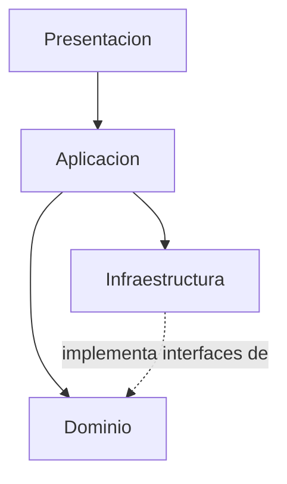
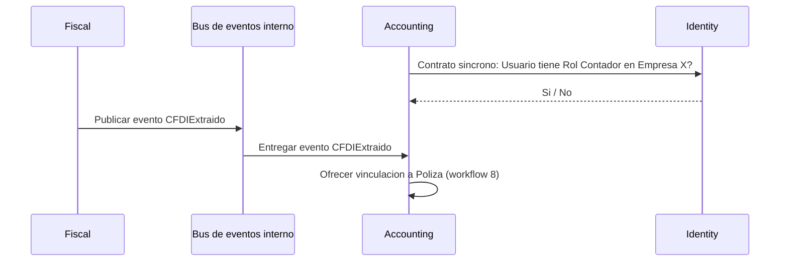
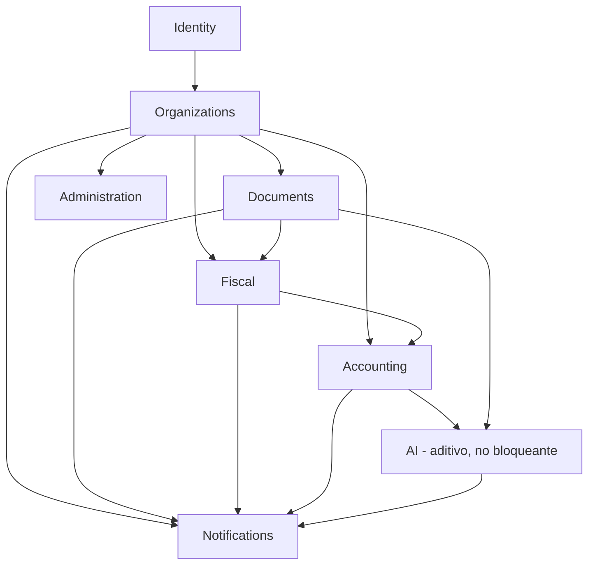

# Arquitectura de Software — ContaIA

## Control del documento

| Campo                                     | Valor                                                                                                                                                                                        |
| ----------------------------------------- | -------------------------------------------------------------------------------------------------------------------------------------------------------------------------------------------- |
| Documento                                 | 07_SOFTWARE_ARCHITECTURE.md                                                                                                                                                                  |
| Orden de trabajo                          | AWO-003                                                                                                                                                                                      |
| Versión                                   | 1.0                                                                                                                                                                                          |
| **Estado**                                | **Draft v1.0**                                                                                                                                                                               |
| Fecha de creación                         | 2026-07-18                                                                                                                                                                                   |
| Última actualización                      | 2026-07-18                                                                                                                                                                                   |
| Fuentes de verdad                         | `MASTER_CONTEXT.md`, `docs/00_PRODUCT_VISION.md`, `docs/01_PRD.md`, `docs/02_USER_PERSONAS.md`, `docs/04_BUSINESS_RULES.md`, `docs/05_SYSTEM_DOMAIN_MODEL.md`, `docs/06_SYSTEM_WORKFLOWS.md` |
| Documentos que esta arquitectura alimenta | `docs/09_DATABASE_DESIGN.md`, `docs/08_API_DESIGN.md`, `docs/10_AI_ARCHITECTURE.md`, `docs/25_DEVOPS.md`, `docs/11_SECURITY_ARCHITECTURE.md`, `docs/18_TESTING_STRATEGY.md`                  |

> Nota: La Work Order referenciaba `docs/03_BUSINESS_RULES.md` y `docs/05_SYSTEM_WORKFLOWS.md` — nombres desactualizados por renumeraciones ya corregidas en AWO-001 y AWO-002. Se usan aquí las rutas reales (`docs/04` y `docs/06`). `docs/07_SOFTWARE_ARCHITECTURE.md` ya ocupaba la posición correcta; no fue necesaria ninguna renumeración esta vez.

> Este documento diseña la arquitectura, no el código, ni las tablas, ni los endpoints específicos, ni el proveedor cloud. Toda implementación debe seguirlo; cualquier desviación debe actualizar primero este documento.

---

## 1. Objetivos de la arquitectura

1. Materializar los 8 Bounded Contexts de `docs/05_SYSTEM_DOMAIN_MODEL.md` como módulos de un único sistema desplegable, sin perder sus límites de responsabilidad.
2. Sostener técnicamente el aislamiento multiempresa (BR-GLB-001) como propiedad estructural, no como convención de código.
3. Garantizar que la IA nunca ejecute ni decida (principio fundamental de `docs/04_BUSINESS_RULES.md`), separando físicamente el componente de IA generativa del motor de cálculo determinístico.
4. Permitir que el sistema crezca por módulos (principio 10.9 de `MASTER_CONTEXT.md`) sin forzar una migración prematura a servicios independientes.
5. Dar a Backend, Frontend, IA, DevOps y QA una guía suficiente para comenzar a construir sin ambigüedad sobre capas, módulos, dependencias y comunicación.

## 2. Principios arquitectónicos

- **Modularidad:** cada módulo (sección 6) corresponde a un Bounded Context; su código vive en un límite físico propio dentro del monolito.
- **Alta cohesión:** un módulo agrupa entidades, servicios y reglas de un mismo Bounded Context; nunca reglas de negocio de otro.
- **Bajo acoplamiento:** los módulos se comunican solo por contratos explícitos y eventos de dominio (sección 7); ningún módulo lee o escribe directamente el almacenamiento de otro.
- **Seguridad por diseño:** el aislamiento multiempresa y los mínimos privilegios (BR-GLB-001, BR-PERM-001) se implementan como validaciones obligatorias en la capa de Aplicación, no opcionales por módulo.
- **Observabilidad:** todo evento sensible es trazable (BR-TRZ-001) y todo módulo expone señales técnicas mínimas (sección 12).
- **Testabilidad:** el Dominio no depende de infraestructura, por lo que las reglas de negocio son probables sin base de datos ni servicios externos.
- **Mantenibilidad:** el vocabulario de código coincide con el lenguaje ubicuo de `docs/05_SYSTEM_DOMAIN_MODEL.md` (sección 2); ningún módulo inventa su propio glosario.
- **Evolución progresiva:** un módulo se extrae a servicio independiente solo cuando existan razones operativas, de seguridad, escalabilidad o de equipo concretas (principio 10.9) — nunca por defecto.

## 3. Restricciones

- El MVP se implementa como **monolito modular**, no microservicios (restricción explícita de esta Work Order y principio 10.9 de `MASTER_CONTEXT.md`).
- El stack técnico preliminar de `MASTER_CONTEXT.md` (sección 17) sigue `Estado: Propuesta pendiente de validación`; este documento no lo confirma ni lo cambia, solo diseña sobre supuestos compatibles con él (aplicación web, base de datos relacional principal, almacenamiento de objetos, sistema de colas, entornos separados).
- Ninguna integración real con el SAT o un PAC en el MVP (BR-CFDI-001, BR-GLB-005); la arquitectura reserva el punto de extensión pero no lo implementa.
- El aislamiento multiempresa (BR-GLB-001) es no negociable: ninguna decisión de arquitectura puede debilitarlo por conveniencia técnica.
- La IA nunca ejecuta ni decide (principio fundamental); el Motor de Cálculo Contable y los Agentes de IA deben poder desplegarse, probarse y fallar de forma independiente entre sí.
- No se eligen proveedores cloud ni herramientas específicas en este documento.

## 4. Arquitectura general

ContaIA se despliega como una única aplicación (monolito modular) con módulos internos bien delimitados, una base de datos relacional principal, almacenamiento de objetos para Documentos, un sistema de colas para trabajo asíncrono (extracción de CFDI, llamadas a IA, cálculo de estados financieros pesados), y una capa de abstracción hacia uno o varios proveedores de IA externos.

```mermaid
flowchart TB
    subgraph Cliente
        WEB[Aplicacion web]
    end
    subgraph Monolito["Monolito modular ContaIA"]
        PRES[Capa de Presentacion]
        APP[Capa de Aplicacion]
        DOM[Capa de Dominio]
        INFRA[Capa de Infraestructura]
    end
    DB[(Base de datos relacional)]
    FILES[(Almacenamiento de objetos - Documentos)]
    QUEUE[[Sistema de colas]]
    AIABS[Capa de abstraccion de IA]
    AIPROV[(Proveedor(es) de IA externos)]

    WEB --> PRES
    PRES --> APP
    APP --> DOM
    APP --> INFRA
    INFRA --> DB
    INFRA --> FILES
    INFRA --> QUEUE
    INFRA --> AIABS
    AIABS --> AIPROV
```

## 5. Capas del sistema

- **Presentación:** interfaces de usuario y punto de entrada de solicitudes (web); traduce entrada de usuario a comandos/consultas de la capa de Aplicación; no contiene reglas de negocio.
- **Aplicación:** orquesta los workflows de `docs/06_SYSTEM_WORKFLOWS.md`; valida Membresía/Rol antes de invocar al Dominio (BR-GLB-001, BR-PERM-001); traduce errores de Dominio a mensajes claros (BR-ERR-001); es el único punto que coordina varios módulos entre sí.
- **Dominio:** entidades, value objects, aggregate roots, domain services y domain events de `docs/05_SYSTEM_DOMAIN_MODEL.md`; no depende de ninguna otra capa; contiene toda regla de negocio determinística (BR-GLB-004).
- **Infraestructura:** persistencia, almacenamiento de archivos, colas, trazabilidad, notificaciones técnicas y la capa de abstracción de proveedores de IA; implementa las interfaces que el Dominio y la Aplicación definen, nunca al revés (inversión de dependencias).



## 6. Módulos principales

Ocho módulos, uno por cada Bounded Context de `docs/05_SYSTEM_DOMAIN_MODEL.md` (sección 3), con una decisión arquitectónica: **Auditoría y Trazabilidad se implementan como capacidad transversal de Infraestructura, no como módulo de negocio propio** (ver AD-02, sección 19) — resuelve la pregunta que `docs/05_SYSTEM_DOMAIN_MODEL.md` dejó abierta sobre si Governance mapea 1:1 a un módulo.

| Módulo             | Responsabilidad (Bounded Context)                                                       | Entidades principales                     | Eventos que publica                                                                                                                                     |
| ------------------ | --------------------------------------------------------------------------------------- | ----------------------------------------- | ------------------------------------------------------------------------------------------------------------------------------------------------------- |
| **Identity**       | Usuario, credenciales, autenticación, Membresía, Rol.                                   | Usuario, Membresía                        | `UsuarioInvitado`, `InvitaciónAceptada`, `RolAsignado`/`RolModificado`                                                                                  |
| **Organizations**  | Organización, Empresa, Ejercicio; aislamiento entre Empresas.                           | Organización, Empresa, Ejercicio          | `EmpresaCreada`, `EjercicioCerrado`                                                                                                                     |
| **Documents**      | Documento genérico: carga, metadatos, repositorio.                                      | Documento                                 | `DocumentoCargado`                                                                                                                                      |
| **Fiscal**         | CFDI: validación de XML, extracción, vinculación.                                       | CFDI (especialización de Documento)       | `XMLValidado`, `CFDIExtraído`, `CampoAmbiguoDetectado`                                                                                                  |
| **Accounting**     | Catálogo de Cuentas, Pólizas, Balanza, Estados Financieros.                             | Catálogo de Cuentas, Cuenta, Póliza       | `PólizaCapturada`, `PólizaEnviadaARevisión`, `PólizaAprobada`, `PólizaRechazada`, `PólizaDeAjusteCreada`, `BalanzaGenerada`, `EstadoFinancieroGenerado` |
| **AI**             | Agentes, Fundamento, evaluación de calidad, gestión de incertidumbre.                   | Respuesta de IA                           | `IAGeneróRespuesta`, `RespuestaEvaluada`                                                                                                                |
| **Notifications**  | Alertas y Casos de Revisión: generación determinista y enrutamiento al Rol responsable. | Alerta, Caso de Revisión                  | `AlertaGenerada`, `RespuestaMarcadaParaRevisión`                                                                                                        |
| **Administration** | Panel interno de ContaIA, soporte con motivo registrado, configuración de Empresa.      | (usa entidades de Organizations/Identity) | `AccesoDeSoporteRegistrado`                                                                                                                             |

## 7. Comunicación entre módulos

Regla arquitectónica única: **ningún módulo accede directamente a los datos de otro.** Dos mecanismos, ambos dentro del mismo proceso (monolito):

1. **Llamadas síncronas a contratos de aplicación:** para operaciones que requieren una respuesta inmediata dentro del mismo workflow (por ejemplo, Accounting pide a Identity "¿este Usuario tiene Rol Contador en esta Empresa?"). El contrato es una interfaz explícita, no una consulta directa a la tabla de Membresías.
2. **Eventos de dominio:** para reacciones desacopladas que no requieren respuesta inmediata (por ejemplo, Fiscal publica `CFDIExtraído`; Accounting lo consume para ofrecer la vinculación a una Póliza, sin que Fiscal necesite saber que Accounting existe).



## 8. Gestión de eventos internos

El catálogo autoritativo de eventos es el de `docs/05_SYSTEM_DOMAIN_MODEL.md` (sección 8), operacionalizado en `docs/06_SYSTEM_WORKFLOWS.md` (sección 17). Reglas de diseño del bus de eventos interno:

- Cada evento lleva un payload mínimo: identificadores y referencias, nunca datos sensibles completos — el consumidor consulta el detalle a través del contrato del módulo dueño si lo necesita (mantiene bajo acoplamiento).
- La publicación de un evento sensible y su registro de Trazabilidad (BR-TRZ-001) ocurren en la misma operación — **el mismo mecanismo de registro sirve como bus de eventos y como fuente de auditoría** (AD-06, sección 19), evitando duplicar infraestructura.
- Los eventos son append-only y no se reprocesan destructivamente; un consumidor caído se puede recuperar reproduciendo eventos no procesados, sin alterar los ya emitidos (coherente con BR-TRZ-002, inmutabilidad).

```mermaid
flowchart LR
    subgraph Productores
        ORG[Organizations]
        DOC[Documents]
        FIS[Fiscal]
        ACC[Accounting]
        AI[AI]
    end
    BUS[[Bus de eventos interno = Registro de Trazabilidad]]
    subgraph Consumidores
        NOT[Notifications]
        GOVLOG[Infraestructura de Auditoria]
        ACC2[Accounting]
    end
    ORG --> BUS
    DOC --> BUS
    FIS --> BUS
    ACC --> BUS
    AI --> BUS
    BUS --> NOT
    BUS --> GOVLOG
    BUS --> ACC2
```



## 9. Arquitectura de dependencias

Regla de dependencia entre capas: Presentación → Aplicación → Dominio; Infraestructura implementa interfaces del Dominio/Aplicación (inversión de dependencias, ninguna flecha entra a Dominio desde Infraestructura).

Regla de dependencia entre módulos (sin ciclos): Identity es la base — todos los módulos lo consultan para validar Membresía/Rol. Organizations depende de Identity. Documents, Fiscal, Accounting y Administration dependen de Organizations (para aislamiento por Empresa). AI depende de Accounting y Documents para tener contexto, pero **ningún módulo depende de AI para funcionar** — es aditivo, nunca bloqueante (coherente con "la IA nunca decide"). Notifications depende de los eventos publicados por los demás, pero ningún módulo depende de Notifications.



## 10. Manejo de errores

Cada módulo expresa sus fallos de negocio como tipos de error de Dominio explícitos (por ejemplo, "póliza descuadrada", "campo ambiguo"), nunca como excepciones genéricas. La capa de Aplicación los traduce a mensajes claros para el usuario (BR-ERR-001) sin exponer detalle técnico (BR-ERR-002, BR-SEC-003) — el detalle técnico solo llega a los registros internos de Infraestructura (sección 11). Toda operación que modifica estado crítico (aprobar Póliza, cerrar Ejercicio) debe ser transaccional o idempotente, de forma que un reintento tras un fallo parcial no duplique datos (BR-ERR-003).

## 11. Logging

Dos flujos de registro, deliberadamente separados:

1. **Registro de Trazabilidad de negocio** (BR-TRZ-001, BR-TRZ-002): inmutable, append-only, con los siete campos mínimos, usado también como bus de eventos (sección 8). Nunca se purga ni se edita.
2. **Log técnico interno** (errores no anticipados, rendimiento, diagnóstico): puede rotarse y purgarse con políticas normales de operación; nunca contiene datos sensibles de una Empresa (BR-SEC-003) ni sustituye al Registro de Trazabilidad.

## 12. Observabilidad

- Métricas técnicas por módulo: latencia, tasa de error, volumen de eventos procesados.
- Trazas de flujo entre módulos para diagnosticar workflows de extremo a extremo (por ejemplo, de `DocumentoCargado` a `EstadoFinancieroGenerado`), útiles incluso dentro de un monolito para entender acoplamiento real.
- Distinción explícita entre **alerta técnica de operación** (por ejemplo, latencia alta del proveedor de IA) y **Alerta de negocio** (BR-NOT, por ejemplo póliza descuadrada) — mismo nombre coloquial, conceptos distintos; deben implementarse en sistemas de observación separados para no confundir a Soporte con a Auxiliares/Contadores.

## 13. Configuración

- Configuración separada por entorno: desarrollo, pruebas, staging, producción (ya propuesto en `MASTER_CONTEXT.md`, sección 17).
- Gestión de secretos fuera del código fuente (BR-SEC-002); ningún módulo lee credenciales directamente de archivos versionados.
- Activación de Agentes de IA por configuración, no por código muerto: los cuatro Agentes activos del MVP (`docs/01_PRD.md`, sección 10) se habilitan mediante configuración, dejando el resto de Agentes documentados pero apagados, listos para activarse en etapas futuras sin reescribir el módulo AI.

## 14. Gestión de archivos

Todo Documento (XML, PDF, imagen) se almacena en almacenamiento de objetos, con su referencia lógica gestionada exclusivamente por el módulo Documents. Ningún otro módulo (Fiscal incluido) accede al almacenamiento de archivos directamente: Fiscal solicita el contenido a Documents mediante contrato de aplicación, preservando BR-DOC-001 (pertenencia exclusiva a una Empresa) y el aislamiento general (BR-GLB-001).

## 15. Integraciones externas

- **MVP:** la única integración externa activa es la capa de abstracción hacia uno o varios proveedores de IA (ya propuesto en `MASTER_CONTEXT.md`: "evitar dependencia absoluta de un solo proveedor"). Ninguna integración con el SAT o un PAC existe ni se simula (BR-CFDI-001, BR-GLB-005).
- **Punto de extensión reservado, no implementado:** una interfaz de "proveedor fiscal externo" (PAC) queda reservada en el módulo Fiscal para la Etapa 4 de `MASTER_CONTEXT.md`, sin implementación en el MVP.

## 16. Estrategia de escalabilidad

- El monolito modular escala horizontalmente mediante instancias idénticas detrás de un balanceador (sin definir proveedor concreto).
- Las cargas pesadas o variables (extracción de XML, llamadas a proveedores de IA, generación de estados financieros de gran volumen) se procesan de forma asíncrona vía el sistema de colas, para no bloquear la capa de Presentación.
- La base de datos relacional principal se diseña para permitir separar lecturas de escrituras en el futuro si el volumen lo justifica (recomendación para `docs/09_DATABASE_DESIGN.md`, no una decisión tomada aquí).
- Camino de evolución: un módulo se extrae a servicio independiente solo cuando tenga necesidades de escalado, seguridad o equipo claramente desproporcionadas frente a los demás (principio 10.9); AI y Fiscal son los candidatos más probables a mediano plazo, dado su volumen de procesamiento variable.

## 17. Estrategia de despliegue

- Entornos separados: desarrollo, pruebas, staging, producción (`MASTER_CONTEXT.md`, sección 17).
- Integración y despliegue continuos con pruebas automatizadas obligatorias antes de cada despliegue a producción.
- El monolito se despliega como una sola unidad versionada; los módulos no se despliegan por separado en el MVP (coherente con la restricción de no usar microservicios desde el inicio).
- Migraciones de base de datos versionadas y reversibles; ningún despliegue debe requerir downtime como práctica normal.

## 18. Riesgos arquitectónicos

- **Acoplamiento oculto por atajos de código.** El mayor riesgo de un monolito modular es que, bajo presión de tiempo, un módulo termine leyendo directamente el almacenamiento de otro en vez de usar sus contratos — rompiendo silenciosamente BR-GLB-001 y el bajo acoplamiento (sección 2). Requiere disciplina de revisión de código, no solo diseño.
- **Crecimiento indefinido del Registro de Trazabilidad.** Ya señalado en `docs/04_BUSINESS_RULES.md` y `docs/06_SYSTEM_WORKFLOWS.md`; desde esta capa se añade que, al ser también el bus de eventos (sección 8), su volumen crece más rápido de lo que crecería solo por auditoría — requiere estrategia de particionado o archivado a futuro, sin violar BR-TRZ-002 (no eliminación).
- **Dependencia de un solo proveedor de IA si la capa de abstracción se implementa tarde.** Si el módulo AI se construye acoplado a un proveedor específico "para ir más rápido", revertirlo después es costoso.
- **Mezcla accidental de cálculo determinístico e IA generativa.** Si el Motor de Cálculo Contable y los Agentes de IA no están en paquetes claramente separados desde el inicio, un desarrollador podría insertar una llamada a IA dentro de un cálculo crítico "para simplificar", violando BR-GLB-004 sin que ninguna prueba automatizada lo detecte si no se diseña explícitamente para prevenirlo.
- **Concurrencia no resuelta en aprobaciones**, heredada de `docs/06_SYSTEM_WORKFLOWS.md` (sección 20): esta arquitectura debe decidir un mecanismo (optimista o pesimista) al nivel de la capa de Aplicación del módulo Accounting; no se resuelve en este documento, queda como pendiente explícito para el diseño detallado.

## 19. Decisiones arquitectónicas

- **AD-01.** El MVP se construye como monolito modular; la migración a servicios independientes solo ocurre ante razones concretas (principio 10.9). _Motivo:_ restricción explícita de esta Work Order y de `MASTER_CONTEXT.md`.
- **AD-02.** Los 8 módulos de código son Identity, Organizations, Documents, Fiscal, Accounting, AI, Notifications, Administration. Auditoría y Trazabilidad **no** son un módulo de negocio separado; se implementan como capacidad transversal de Infraestructura (Servicio de Trazabilidad), consumida por todos los módulos. _Motivo:_ resuelve la pregunta dejada abierta en `docs/05_SYSTEM_DOMAIN_MODEL.md` ("Dependencias para AWO-002") sobre si cada Bounded Context mapea 1:1 a un módulo de código; Auditoría/Trazabilidad es, en la práctica, un requisito transversal (como el logging), no una capa con su propia interfaz de usuario o lógica de negocio distintiva.
- **AD-03.** La comunicación entre módulos ocurre solo mediante contratos de aplicación síncronos o eventos de dominio; ningún módulo accede a los datos de otro directamente. _Motivo:_ bajo acoplamiento y refuerzo técnico de BR-GLB-001.
- **AD-04.** El Motor de Cálculo Contable y los Agentes de IA son componentes físicamente distintos en el código. _Motivo:_ BR-GLB-004 y el principio fundamental "la IA nunca decide".
- **AD-05.** Toda llamada a un modelo de IA pasa por una capa de abstracción de proveedor. _Motivo:_ evitar dependencia absoluta de un solo proveedor (`MASTER_CONTEXT.md`, sección 17).
- **AD-06.** El Registro de Trazabilidad y el bus de eventos internos comparten el mismo mecanismo de registro. _Motivo:_ evitar duplicar infraestructura entre dos necesidades (auditoría y comunicación desacoplada) que requieren las mismas garantías (inmutabilidad, orden, siete campos mínimos).
- **AD-07.** El acceso a archivos (Documentos) solo ocurre a través del módulo Documents. _Motivo:_ BR-DOC-001 y aislamiento multiempresa.

## 20. Recomendaciones para Database Design

- Modelar Empresa como unidad de aislamiento a nivel de dato (por ejemplo, clave de Empresa obligatoria y filtrada en cada tabla relevante, o esquema por Empresa si el volumen lo justifica) — decisión técnica de `docs/09_DATABASE_DESIGN.md`, no de este documento.
- Diseñar el Registro de Trazabilidad como estructura append-only desde el inicio, sin operación de borrado disponible a nivel de aplicación.
- Separar el versionado del Catálogo de Cuentas y de las fórmulas de cálculo en estructuras de historial propias, no como campos mutables sobre el registro actual (BR-CAT-001, BR-VER-002).
- Considerar particionamiento por Empresa o por Ejercicio para Pólizas y Trazabilidad ante volúmenes altos, sin comprometer BR-INT-002 (no eliminación física).

## 21. Recomendaciones para API Design

- Todo endpoint debe recibir el contexto de Empresa activa de forma explícita, nunca inferido implícitamente de la sesión sin validación (BR-GLB-001).
- Separar endpoints de comando (mutan estado, requieren validación de Rol) de los de consulta (solo lectura), especialmente relevante para el rol Auditor (BR-ROL-003, escritura deshabilitada a nivel de API, no solo de interfaz).
- Exponer Estado de Aprobación (Póliza, Caso de Revisión) y estatus de Ejercicio como recursos con transiciones controladas por endpoint específico, no como un campo editable libremente.
- Versionar la API desde el primer diseño, anticipando la API pública controlada de la Etapa 6 (`MASTER_CONTEXT.md`, sección 16).

## 22. Recomendaciones para AI Architecture

- Diseñar el pipeline de IA en etapas explícitas y sustituibles: recuperación de Fundamento sobre `knowledge/` → generación de Respuesta → evaluación del Agente supervisor de calidad → decisión de bloqueo o exposición (BR-IA-001, BR-IA-006, BR-IA-008).
- Cada Agente (Contable, Fiscal, CFDI/XML, Supervisor de calidad) debe ser un componente independiente y sustituible detrás de la capa de abstracción de proveedor (AD-05), no código entrelazado con un modelo específico.
- Ningún Agente debe tener acceso de escritura directa a la base de datos transaccional; solo lectura de contexto y generación de propuestas, que siempre pasan por el Servicio de Aprobación del módulo Accounting o Notifications (principio fundamental, BR-GLB-002).
- El límite del contexto entregado a un Agente debe filtrarse por Empresa activa antes de la inferencia, no depender de que el modelo "ignore" datos ajenos (RF-23 de `docs/01_PRD.md`).

---

## Historial de cambios

| Fecha      | Cambio                                                                                                                                                                                                                                                                         | Responsable                        |
| ---------- | ------------------------------------------------------------------------------------------------------------------------------------------------------------------------------------------------------------------------------------------------------------------------------ | ---------------------------------- |
| 2026-07-18 | Creación de la primera versión completa de `docs/07_SOFTWARE_ARCHITECTURE.md` bajo AWO-003: arquitectura de monolito modular con 8 módulos, 4 capas, comunicación por contratos y eventos, y recomendaciones para los tres documentos técnicos siguientes. Estado: Draft v1.0. | Responsable de producto de ContaIA |

---

## Observaciones del Arquitecto

**Decisiones tomadas:**

- Se resolvió la pregunta que `docs/05_SYSTEM_DOMAIN_MODEL.md` dejó abierta sobre el mapeo Bounded Context → módulo de código: Auditoría/Trazabilidad (Governance) se implementa como capacidad transversal de Infraestructura, no como módulo de negocio con interfaz propia, mientras que Notifications sí se mantiene como módulo propio por tener comportamiento de negocio distintivo (enrutamiento a Rol responsable). Esto reconcilia la lista de 8 módulos pedida por esta Work Order (que no mencionaba Governance/Auditoría explícitamente) con los 8 Bounded Contexts del modelo de dominio, sin contradecir ninguno de los dos documentos.
- El mismo mecanismo de registro se usa como Registro de Trazabilidad de negocio y como bus de eventos internos (AD-06), evitando construir dos infraestructuras paralelas con garantías casi idénticas (inmutabilidad, orden).
- No se retomó el stack técnico preliminar de `MASTER_CONTEXT.md` como decisión definitiva; se diseñó de forma compatible con él, dejando su confirmación fuera del alcance de este documento, tal como esta Work Order restringe ("no elijas proveedores cloud concretos").

**Riesgos detectados:**

- Ver sección 18 completa. El de mayor probabilidad de materializarse en la práctica es el acoplamiento oculto por atajos de código (un módulo leyendo datos de otro directamente), que ningún diagrama puede prevenir por sí solo — requiere disciplina de revisión.
- La concurrencia en aprobaciones simultáneas (heredada de `docs/06_SYSTEM_WORKFLOWS.md`) sigue sin resolverse; queda explícitamente pendiente para el diseño detallado del módulo Accounting.

**Posibles evoluciones futuras:**

- Extracción de AI a servicio independiente si su volumen de procesamiento o necesidad de escalado diverge significativamente del resto del monolito.
- Extracción de Fiscal a servicio independiente si se integra un PAC real en la Etapa 4, dado que en ese momento tendrá requisitos de disponibilidad y seguridad distintos del resto.
- Separación de lecturas y escrituras en la base de datos si el volumen de consultas de Dashboard/Estados Financieros crece de forma desproporcionada frente a la captura.

**Dependencias para AWO-004:**

- `docs/09_DATABASE_DESIGN.md` debe tomar las recomendaciones de la sección 20 como punto de partida, especialmente el aislamiento por Empresa a nivel de dato y el diseño append-only del Registro de Trazabilidad.
- Debe definirse el mecanismo de concurrencia para aprobaciones simultáneas (sección 18) antes o durante el diseño detallado de la base de datos, ya que probablemente requiera bloqueo optimista a nivel de fila.
- `docs/00_DOCUMENTATION_INDEX.md` y `docs/00_DOCUMENTATION_GUIDE.md` siguen sin existir (hallazgo original en `docs/02_USER_PERSONAS.md`); con ocho documentos técnicos ya interconectados por referencias cruzadas, la ausencia de un índice mantenido activamente es ya un riesgo operativo de la propia documentación, no solo una conveniencia.
