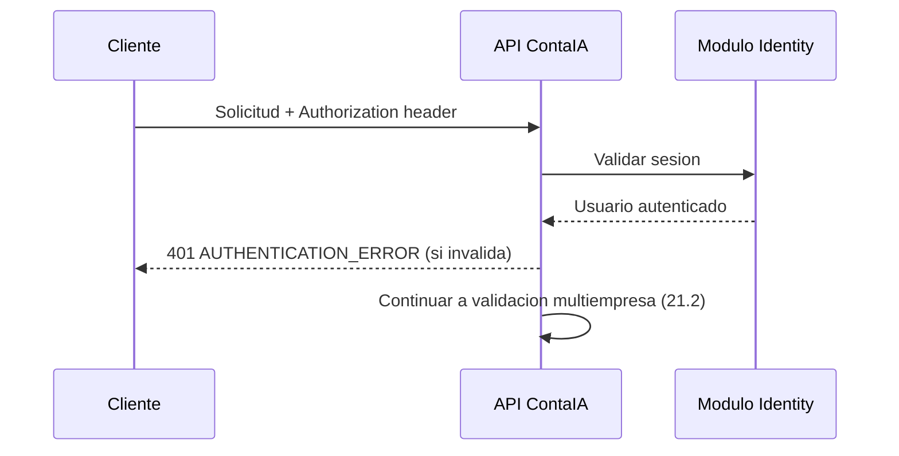
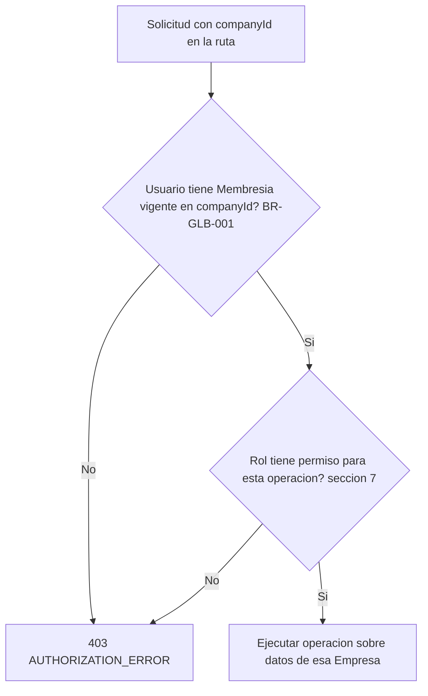
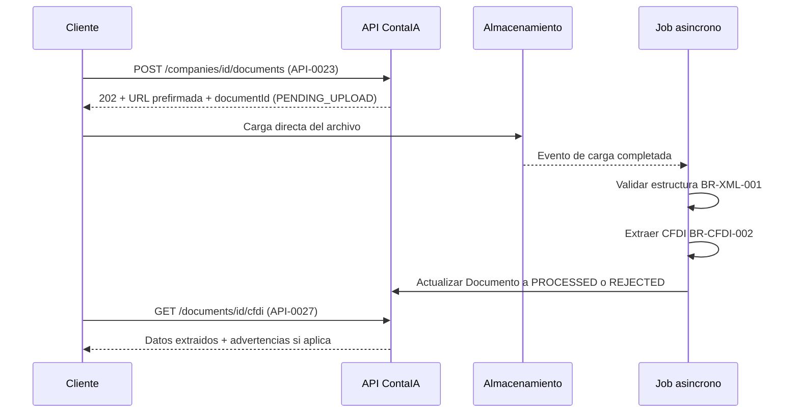
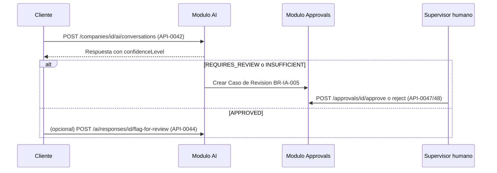
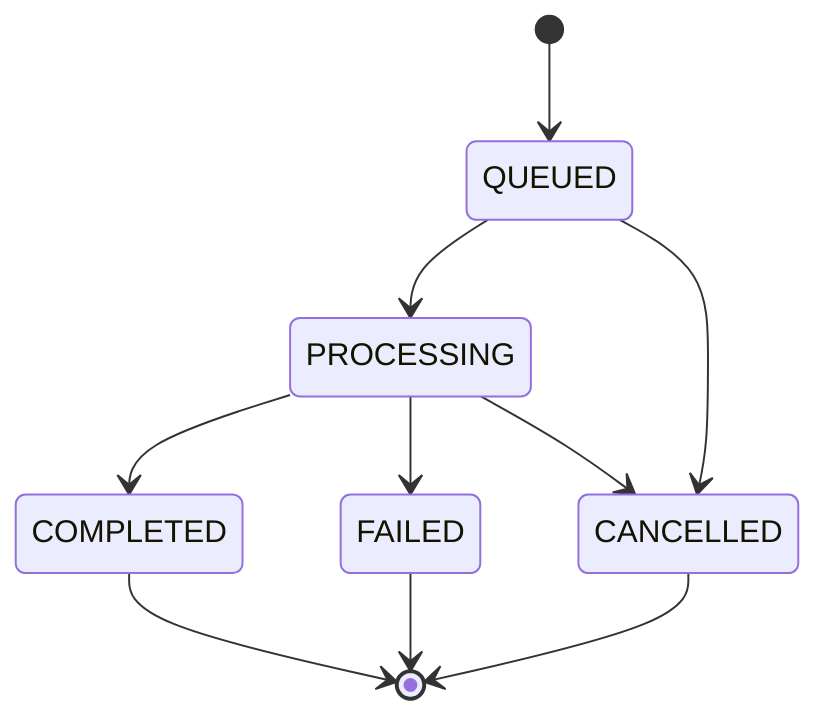
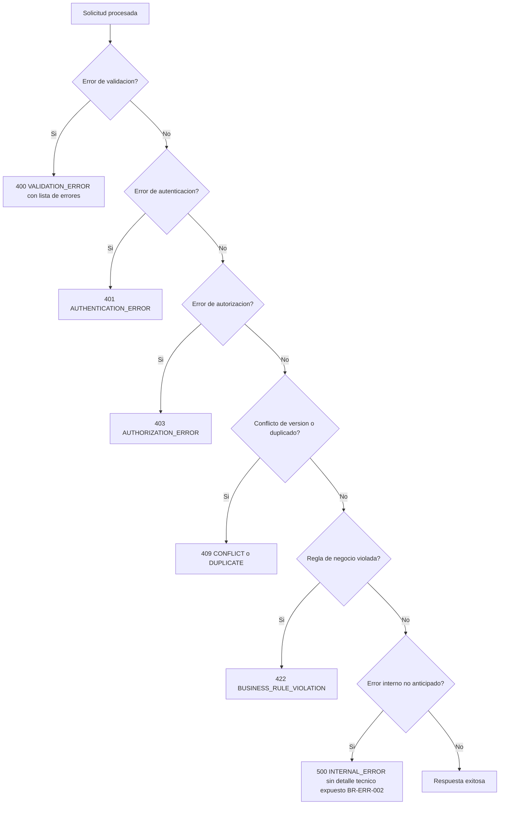

# Diseño de API — ContaIA

## Control del documento

| Campo                               | Valor                                                                                                                                                                                                                            |
| ----------------------------------- | -------------------------------------------------------------------------------------------------------------------------------------------------------------------------------------------------------------------------------- |
| Documento                           | 08_API_DESIGN.md                                                                                                                                                                                                                 |
| Orden de trabajo                    | AWO-004                                                                                                                                                                                                                          |
| Versión                             | 1.0                                                                                                                                                                                                                              |
| **Estado**                          | **Draft v1.0**                                                                                                                                                                                                                   |
| Fecha de creación                   | 2026-07-18                                                                                                                                                                                                                       |
| Última actualización                | 2026-07-18                                                                                                                                                                                                                       |
| Fuentes de verdad                   | `MASTER_CONTEXT.md`, `docs/00_PRODUCT_VISION.md`, `docs/01_PRD.md`, `docs/02_USER_PERSONAS.md`, `docs/04_BUSINESS_RULES.md`, `docs/05_SYSTEM_DOMAIN_MODEL.md`, `docs/06_SYSTEM_WORKFLOWS.md`, `docs/07_SOFTWARE_ARCHITECTURE.md` |
| Documentos que este diseño alimenta | `docs/09_DATABASE_DESIGN.md`, `docs/10_AI_ARCHITECTURE.md`, `docs/11_SECURITY_ARCHITECTURE.md`, `docs/18_TESTING_STRATEGY.md`                                                                                                    |

> Nota: La Work Order referenciaba `docs/03_BUSINESS_RULES.md` y `docs/05_SYSTEM_WORKFLOWS.md` (nombres desactualizados; las rutas reales son `docs/04` y `docs/06`). También pedía el entregable en `docs/08_API_DESIGN.md`, posición que ocupaba `docs/08_DATABASE_DESIGN.md`; como la propia Work Order nombra a Database Design como "AWO-005" (es decir, posterior a este documento), intercambié las posiciones 08 y 09 — ambos archivos eran placeholders vacíos, sin riesgo de contenido. Ver "Observaciones del Arquitecto".

> Este documento diseña contratos de API a nivel conceptual: recursos, operaciones, contratos de datos y reglas. No es código, no es OpenAPI todavía, no diseña tablas ni endpoints sin valor de negocio. No cambia el alcance del MVP definido en `docs/01_PRD.md`.

---

## 1. Propósito y alcance

Esta API es el contrato oficial entre el frontend web, el backend, los módulos internos, los Agentes de IA y el procesamiento de documentos de ContaIA. Cubre los ocho módulos de `docs/07_SOFTWARE_ARCHITECTURE.md` (Identity, Organizations, Documents, Fiscal, Accounting, AI, Notifications, Administration) en el alcance del MVP de `docs/01_PRD.md`.

**Cubre:** autenticación y sesiones; gestión de Organizaciones, Empresas, Membresías y Ejercicios; carga y extracción de Documentos y CFDI; Catálogo de Cuentas y Pólizas; Balanza y Estados Financieros; conversaciones con Agentes de IA acotadas al conjunto curado de `knowledge/`; Casos de Revisión y aprobaciones; consulta de auditoría y trazabilidad; Alertas; administración interna con acceso auditado.

**No cubre (ver sección 23):** API pública para terceros, GraphQL, webhooks generales, SDKs, aplicación móvil nativa, integraciones bancarias, timbrado propio o integración real con el SAT/PAC.

La API refleja el dominio (`docs/05_SYSTEM_DOMAIN_MODEL.md`) y los workflows (`docs/06_SYSTEM_WORKFLOWS.md`) — no las pantallas del frontend ni las tablas de la base de datos.

## 2. Principios de diseño

- **Consistencia:** mismo formato de respuesta, error, paginación y nombres en todos los módulos (secciones 4, 10, 11).
- **Previsibilidad:** un mismo tipo de operación (crear, listar, aprobar) se expresa siempre con el mismo patrón HTTP en cualquier recurso.
- **Seguridad:** ningún endpoint concede acceso por el solo hecho de recibir un identificador (decisión obligatoria 7); toda autorización se valida en servidor (sección 7).
- **Trazabilidad:** toda operación sensible lleva un identificador de correlación y genera un Registro de Trazabilidad (BR-TRZ-001, sección 17).
- **Idempotencia:** las operaciones de creación con efectos de negocio aceptan una clave de idempotencia (sección 13).
- **Compatibilidad:** los cambios no rompen contratos existentes dentro de una misma versión (sección 18).
- **Evolución sin rupturas:** nuevos campos opcionales sí; renombrar o eliminar campos existentes, no, sin una nueva versión.
- **Separación por contexto de dominio:** cada grupo de recursos pertenece a un único módulo (sección 8); ningún endpoint mezcla responsabilidades de dos módulos.

## 3. Estilo arquitectónico

- **REST sobre HTTPS**, sin excepción; ningún endpoint se sirve sobre HTTP simple.
- **JSON** como único formato de intercambio (`Content-Type: application/json; charset=utf-8`).
- **Recursos** representan sustantivos del dominio (Empresa, Póliza, Documento); **comandos** sobre un recurso se expresan como sub-rutas de acción en plural de verbo cuando no encajan en una operación CRUD estándar (por ejemplo, `POST /journal-entries/{id}/approve`), nunca como verbos en la raíz de la ruta.
- **Consultas** (`GET`) son siempre de solo lectura y sin efectos secundarios, incluidas las de auditoría.
- **Operaciones síncronas** para lecturas y escrituras simples (crear Póliza en borrador, invitar Usuario). **Operaciones asíncronas** (sección 15) para procesos pesados o de duración variable (extracción de XML, generación de Estados Financieros de gran volumen, respuestas de IA que requieran análisis extenso).
- **Eventos internos** (`docs/07_SOFTWARE_ARCHITECTURE.md`, sección 8) no se exponen como API pública en el MVP; son un mecanismo interno del monolito.
- **Webhooks futuros:** reservados para cuando exista API pública controlada (Etapa 6 de `MASTER_CONTEXT.md`); no se diseñan en este documento (sección 23).

## 4. Convenciones generales

| Aspecto                    | Convención                                                                                                                                                                                                       |
| -------------------------- | ---------------------------------------------------------------------------------------------------------------------------------------------------------------------------------------------------------------- |
| Nombres de rutas           | Sustantivos en plural, en inglés técnico (`/companies`, `/journal-entries`), consistente con el catálogo de recursos (sección 8).                                                                                |
| Casing de rutas            | `kebab-case` (`/journal-entries`, no `/journalEntries`).                                                                                                                                                         |
| Casing de campos JSON      | `camelCase` (`companyId`, `createdAt`).                                                                                                                                                                          |
| Fechas y horas             | ISO 8601 en UTC (`2026-07-18T14:30:00Z`); la interfaz de usuario convierte a zona horaria local, la API nunca asume una zona horaria implícita.                                                                  |
| Importes y monedas         | Objeto `{ "amount": "1234.56", "currency": "MXN" }`; `amount` como cadena decimal exacta, nunca `float`, para evitar errores de redondeo (BR-GLB-004).                                                           |
| Porcentajes                | Fracción decimal (`0.16`), nunca como entero implícito (`16`); ContaIA no asume ninguna tasa fiscal específica como valor por defecto (`MASTER_CONTEXT.md`, límite de no inventar datos fiscales).               |
| RFC                        | Cadena validada solo en formato estructural (value object RFC de `docs/05_SYSTEM_DOMAIN_MODEL.md`); la API no valida su existencia ante el SAT.                                                                  |
| UUID fiscal (Folio Fiscal) | Cadena UUID tal como aparece en el CFDI; usado como clave de deduplicación por Empresa (sección 13).                                                                                                             |
| Identificadores internos   | UUID v4 para todo recurso (`companyId`, `documentId`, etc.); nunca identificadores secuenciales expuestos.                                                                                                       |
| Valores nulos              | Un campo ausente y un campo `null` son distintos: ausente significa "no se solicitó actualizar"; `null` significa "se solicita vaciar el campo". Documentado por endpoint donde aplica.                          |
| Enumeraciones              | Cadenas explícitas en `UPPER_SNAKE_CASE` (`DRAFT`, `PENDING_REVIEW`, `DEFINITIVE`), alineadas con el Estado de Aprobación de `docs/05_SYSTEM_DOMAIN_MODEL.md` (sección 5).                                       |
| Idioma                     | Mensajes de error y contenido de negocio en español (coherente con `CLAUDE.md`); nombres técnicos de campos y rutas en inglés, por convención de API.                                                            |
| Codificación               | UTF-8 en toda solicitud y respuesta.                                                                                                                                                                             |
| Encabezados HTTP           | `Authorization` (sesión), `X-Correlation-Id` (trazabilidad, generado por el cliente o el servidor si falta), `Idempotency-Key` (sección 13), `Accept-Language` (para mensajes localizados, español por defecto). |

## 5. Contexto multiempresa

- **Organización:** agrupador de Empresas administradas por el mismo conjunto de Usuarios (`docs/05_SYSTEM_DOMAIN_MODEL.md`). Se referencia por `organizationId`, principalmente en operaciones de listado agregado.
- **Empresa:** unidad de aislamiento de datos. Se referencia por `companyId` en la ruta de **todo** endpoint que toque datos de negocio (`/companies/{companyId}/...`). "Empresa" nunca se usa como rol — es una entidad de dominio (`docs/01_PRD.md`, sección 11).
- **Membresía:** relación (Usuario, Empresa, Rol), con atributo opcional `owner: true/false`. Determina qué puede hacer un Usuario en esa Empresa.
- **Rol por Empresa:** el Rol de un Usuario se evalúa siempre en el contexto de la Empresa de la ruta, nunca de forma global (BR-EMP-004).
- **Empresa activa:** es una noción de interfaz (workflow 4 de `docs/06_SYSTEM_WORKFLOWS.md`), no de la API. La API no mantiene "empresa activa" implícita en la sesión: **todo endpoint recibe `companyId` explícito en la ruta.**
- **Aislamiento de datos:** en cada solicitud, el servidor valida que el Usuario autenticado tenga una Membresía vigente en el `companyId` de la ruta antes de ejecutar cualquier lógica (BR-GLB-001). Esta validación ocurre siempre, incluso si el recurso solicitado no existe.
- **Cambio de contexto:** cambiar de Empresa activa en la interfaz no es una operación de API; es simplemente que el cliente empieza a usar un `companyId` distinto en sus siguientes solicitudes.
- **Prevención de acceso cruzado (decisión obligatoria 7):** un `companyId`, `documentId` o cualquier otro identificador enviado por el cliente **nunca** otorga acceso por sí mismo. El servidor siempre revalida la pertenencia del recurso a la Empresa y la Membresía del Usuario, incluso si el identificador es "adivinable" o fue válido en una solicitud anterior.

## 6. Autenticación y sesiones

Contratos conceptuales (ver catálogo de endpoints, sección 9, grupo Identity):

- **Registro:** crea Usuario en estado no verificado (BR-AUTH-001).
- **Verificación de correo:** activa la cuenta; sin ella, ningún endpoint de negocio es accesible.
- **Inicio de sesión:** valida credenciales; si el Rol del Usuario en alguna Empresa requiere MFA (todos salvo Estudiante, BR-AUTH-002), exige segundo factor antes de emitir la sesión.
- **Cierre de sesión:** revoca la sesión activa del cliente que la solicita.
- **Recuperación de contraseña:** flujo de dos pasos (solicitud, confirmación con token de un solo uso).
- **Renovación de sesión:** extiende la validez sin pedir credenciales completas, dentro del umbral de inactividad de BR-AUTH-004 (umbral exacto pendiente de `docs/11_SECURITY_ARCHITECTURE.md`).
- **Revocación:** un Usuario o un Administrador puede revocar sesiones activas (por ejemplo, tras sospecha de acceso indebido).
- **MFA futuro:** el contrato de login ya reserva el paso de segundo factor (`mfaRequired: true/false` en la respuesta de login); el mecanismo concreto (aplicación, SMS) se define en `docs/11_SECURITY_ARCHITECTURE.md`.

**Autenticación separada de autorización (decisión obligatoria 5):** autenticarse (sección 6) prueba _quién eres_; autorizar (sección 7) decide _qué puedes hacer en esta Empresa_. Ningún endpoint combina ambas validaciones en un solo paso opaco.

## 7. Autorización

- **Modelo:** RBAC (Role-Based Access Control) del MVP con seis roles oficiales (`docs/04_BUSINESS_RULES.md`, sección 5): **Administrador, Contador, Auxiliar, Supervisor, Auditor, Estudiante**.
- **Permisos por Empresa:** el mismo Usuario puede tener Roles distintos en Empresas distintas; la autorización siempre se evalúa con el par (Usuario, `companyId`).
- **Propietario:** atributo booleano sobre una Membresía con Rol Administrador; no otorga permisos técnicos adicionales (BR-PERM-003) — la API lo expone como metadato informativo (`owner: true`), no como un nivel de acceso distinto.
- **Administrador:** acceso completo de lectura/escritura dentro de su(s) Empresa(s); único Rol que puede invitar Usuarios, modificar configuración y cerrar Ejercicios.
- **Contador:** lectura/escritura sobre Catálogo, Pólizas, Estados Financieros, IA; puede aprobar Pólizas.
- **Auxiliar:** escritura solo en borrador (Documentos, Pólizas en estado `DRAFT`); sin permiso de aprobación (BR-ROL-001) — la API rechaza `POST /journal-entries/{id}/approve` con `403` para este Rol, a nivel de servidor, no solo de interfaz.
- **Supervisor:** lectura amplia; escritura limitada a resolver Casos de Revisión (aprobar/rechazar).
- **Auditor:** solo lectura, sin excepción, a nivel de API (BR-ROL-003) — ningún verbo distinto de `GET` está disponible para este Rol, incluso si el cliente lo intenta directamente contra el endpoint.
- **Estudiante:** acceso exclusivo a un espacio de datos simulado, nunca a `companyId` reales (BR-ROL-002); su alcance definitivo de MVP sigue pendiente de decisión (`docs/01_PRD.md`, sección 21).
- **Validación obligatoria en servidor:** la interfaz puede ocultar botones según el Rol, pero **todo endpoint valida el Rol y la Membresía de forma independiente**, sin confiar en lo que la interfaz decidió mostrar.

## 8. Catálogo de recursos

| Recurso (módulo)                            | Responsabilidad                                    | Actor principal                                       | Operaciones permitidas                                                  | Restricciones                                                        | Regla BR                               | Workflow        |
| ------------------------------------------- | -------------------------------------------------- | ----------------------------------------------------- | ----------------------------------------------------------------------- | -------------------------------------------------------------------- | -------------------------------------- | --------------- |
| **Identity** (Usuarios, sesiones)           | Identidad, credenciales, sesión.                   | Todos                                                 | Registrar, verificar, iniciar/cerrar sesión, recuperar contraseña       | Sin Rol de Empresa asociado; es prerrequisito de todo lo demás       | BR-AUTH-001 a 004                      | Workflow 3      |
| **Organizations**                           | Agrupar Empresas de una misma cuenta operativa.    | Administrador                                         | Crear, consultar                                                        | Sin datos contables propios                                          | BR-ORG-001, BR-ORG-002                 | Workflow 4      |
| **Companies** (Empresas)                    | Unidad de aislamiento; datos generales.            | Administrador (config.); todos (consulta según Rol)   | Crear, consultar, actualizar configuración                              | Toda operación exige `companyId` en ruta                             | BR-EMP-001 a 003, BR-GLB-001           | Workflow 4      |
| **Memberships**                             | Relación Usuario-Empresa-Rol.                      | Administrador                                         | Invitar, listar, aceptar, cambiar Rol, desactivar                       | Solo Administrador invita/modifica                                   | BR-USR-001, BR-USR-002, BR-PERM-002    | Workflow 5      |
| **Documents**                               | Repositorio de archivos de una Empresa.            | Auxiliar, Contador                                    | Cargar, listar, consultar, descargar                                    | Pertenencia exclusiva a una Empresa                                  | BR-DOC-001 a 003                       | Workflow 6      |
| **CFDI**                                    | Datos estructurados extraídos de un Documento XML. | Auxiliar, Contador                                    | Consultar extracción, listar                                            | Nunca timbra ni valida ante el SAT                                   | BR-CFDI-001 a 003, BR-XML-001/002      | Workflow 7      |
| **Chart of Accounts** (Catálogo de Cuentas) | Estructura contable de una Empresa.                | Contador                                              | Crear, listar, actualizar, desactivar                                   | Unicidad por Empresa, historial versionado                           | BR-CAT-001, BR-CAT-002                 | —               |
| **Journal Entries** (Pólizas)               | Registro contable balanceado.                      | Auxiliar (borrador), Contador/Supervisor (aprobación) | Crear, listar, consultar, enviar a revisión, aprobar, rechazar, ajustar | Balance obligatorio; inmutable una vez definitiva                    | BR-POL-001 a 004, BR-EJE-002           | Workflow 8      |
| **Financial Statements** (incluye Balanza)  | Resultados calculados deterministas.               | Contador, Administrador                               | Consultar balanza, consultar estado financiero                          | Nunca editable directamente; siempre derivado                        | BR-EF-001 a 003, BR-GLB-004            | Workflow 10     |
| **AI Suggestions**                          | Conversaciones y respuestas de Agentes de IA.      | Todos los Roles con acceso al chat                    | Preguntar, consultar historial, marcar para revisión, retroalimentar    | Nunca ejecuta ni decide; siempre con Fundamento o ausencia declarada | BR-IA-001 a 008, BR-GLB-002 a 005      | Workflow 9      |
| **Approvals** (Casos de Revisión)           | Cola de pendientes de aprobación humana.           | Contador, Supervisor                                  | Listar pendientes, consultar, aprobar, rechazar                         | Motivo obligatorio al rechazar                                       | BR-GLB-002, BR-TRZ-003, BR-NOT-001     | Workflow 9      |
| **Audit**                                   | Consulta de evidencia y trazabilidad.              | Auditor, Supervisor                                   | Listar eventos, consultar evento                                        | Solo lectura, sin excepción                                          | BR-AUD-001 a 003, BR-ROL-003           | Workflow 11     |
| **Notifications** (Alertas)                 | Avisos deterministas dentro de la plataforma.      | Rol responsable según el caso                         | Listar, marcar como atendida                                            | Nunca generadas por IA generativa                                    | BR-NOT-001 a 003                       | Workflow 12     |
| **Administration**                          | Panel interno, soporte, configuración.             | Administrador de plataforma, Administrador de Empresa | Registrar acceso de soporte, listar cuentas (agregado)                  | Motivo obligatorio antes de cada acceso interno                      | BR-SEC-004, BR-AUD-003, BR-CFG-001/002 | Workflow 11, 15 |

## 9. Catálogo de endpoints del MVP

Formato compacto por grupo: **ID · Método · Ruta · Propósito · Actor · Permiso · Idempotencia · Auditoría · BR · Workflow**. Parámetros, cuerpo de solicitud, respuesta y errores siguen los contratos estándar de las secciones 10 y 11, salvo que se indique lo contrario en la nota del grupo.

### 9.1 Identity

_Nota de grupo:_ ninguno de estos endpoints requiere `companyId`; operan antes o fuera del contexto de Empresa.

| ID       | Método y ruta                       | Propósito                  | Actor                             | Permiso                  | Idemp.          | Auditoría | BR                       | Workflow |
| -------- | ----------------------------------- | -------------------------- | --------------------------------- | ------------------------ | --------------- | --------- | ------------------------ | -------- |
| API-0001 | `POST /auth/register`               | Crear cuenta de Usuario    | Anónimo                           | Ninguno                  | Sí (por correo) | Sí        | BR-AUTH-001              | 3        |
| API-0002 | `POST /auth/verify-email`           | Confirmar correo           | Usuario no verificado             | Token de verificación    | Sí              | Sí        | BR-AUTH-001              | 3        |
| API-0003 | `POST /auth/login`                  | Iniciar sesión             | Usuario verificado                | Ninguno                  | No aplica       | Sí        | BR-AUTH-002, BR-AUTH-003 | 3        |
| API-0004 | `POST /auth/mfa/verify`             | Confirmar segundo factor   | Usuario en login pendiente de MFA | Sesión temporal de login | No aplica       | Sí        | BR-AUTH-002              | 3        |
| API-0005 | `POST /auth/logout`                 | Cerrar sesión actual       | Usuario autenticado               | Sesión propia            | Sí              | Sí        | BR-AUTH-004              | 3        |
| API-0006 | `POST /auth/password-reset/request` | Solicitar recuperación     | Anónimo                           | Ninguno                  | Sí              | Sí        | BR-AUTH-001              | 3        |
| API-0007 | `POST /auth/password-reset/confirm` | Confirmar nueva contraseña | Poseedor de token de reset        | Token de un solo uso     | Sí              | Sí        | BR-AUTH-001, BR-SEC-002  | 3        |
| API-0008 | `POST /auth/session/refresh`        | Renovar sesión             | Usuario autenticado               | Sesión propia vigente    | No aplica       | No        | BR-AUTH-004              | 3        |

### 9.2 Organizations y Companies

| ID       | Método y ruta                         | Propósito                                  | Actor                             | Permiso                                        | Idemp.          | Auditoría | BR                                 | Workflow |
| -------- | ------------------------------------- | ------------------------------------------ | --------------------------------- | ---------------------------------------------- | --------------- | --------- | ---------------------------------- | -------- |
| API-0009 | `POST /organizations`                 | Crear Organización                         | Usuario autenticado               | Ninguno (se vuelve su Administrador)           | Sí              | Sí        | BR-ORG-001                         | 4        |
| API-0010 | `GET /organizations/{organizationId}` | Consultar Organización y sus Empresas      | Administrador de esa Organización | Membresía en alguna Empresa de la Organización | No aplica       | No        | BR-ORG-002                         | 4        |
| API-0011 | `POST /companies`                     | Crear Empresa (con o sin `organizationId`) | Usuario autenticado               | Ninguno (se vuelve Administrador propietario)  | Sí              | Sí        | BR-EMP-001                         | 4        |
| API-0012 | `GET /companies`                      | Listar Empresas del Usuario autenticado    | Usuario autenticado               | Implícito (solo las propias)                   | No aplica       | No        | BR-GLB-001                         | 4        |
| API-0013 | `GET /companies/{companyId}`          | Consultar datos generales                  | Cualquier Rol con Membresía       | Membresía vigente                              | No aplica       | No        | BR-EMP-003, BR-GLB-001             | 4        |
| API-0014 | `PATCH /companies/{companyId}`        | Actualizar datos generales / configuración | Administrador                     | Rol Administrador en esa Empresa               | Sí (`If-Match`) | Sí        | BR-CFG-001, BR-CFG-002, BR-EMP-003 | 15       |

### 9.3 Memberships

| ID       | Método y ruta                             | Propósito                       | Actor                     | Permiso                              | Idemp.          | Auditoría | BR                      | Workflow |
| -------- | ----------------------------------------- | ------------------------------- | ------------------------- | ------------------------------------ | --------------- | --------- | ----------------------- | -------- |
| API-0015 | `POST /companies/{companyId}/memberships` | Invitar Usuario con Rol         | Administrador             | Rol Administrador                    | Sí              | Sí        | BR-USR-001, BR-PERM-002 | 5        |
| API-0016 | `GET /companies/{companyId}/memberships`  | Listar Membresías de la Empresa | Administrador, Supervisor | Rol Administrador o Supervisor       | No aplica       | No        | BR-USR-001              | 5        |
| API-0017 | `POST /memberships/{membershipId}/accept` | Aceptar invitación              | Usuario invitado          | Ser el destinatario de la invitación | Sí              | Sí        | BR-USR-001              | 5        |
| API-0018 | `PATCH /memberships/{membershipId}`       | Cambiar Rol de un Usuario       | Administrador             | Rol Administrador en esa Empresa     | Sí (`If-Match`) | Sí        | BR-PERM-002, BR-EMP-004 | 5        |
| API-0019 | `DELETE /memberships/{membershipId}`      | Desactivar Membresía            | Administrador             | Rol Administrador                    | Sí              | Sí        | BR-USR-003              | 5        |

### 9.4 Fiscal Years (Ejercicios)

| ID       | Método y ruta                              | Propósito         | Actor                       | Permiso                                 | Idemp.    | Auditoría | BR         | Workflow |
| -------- | ------------------------------------------ | ----------------- | --------------------------- | --------------------------------------- | --------- | --------- | ---------- | -------- |
| API-0020 | `POST /companies/{companyId}/fiscal-years` | Abrir Ejercicio   | Administrador               | Rol Administrador                       | Sí        | Sí        | BR-EJE-001 | 14       |
| API-0021 | `GET /companies/{companyId}/fiscal-years`  | Listar Ejercicios | Cualquier Rol con Membresía | Membresía vigente                       | No aplica | No        | BR-EJE-001 | 14       |
| API-0022 | `POST /fiscal-years/{fiscalYearId}/close`  | Cerrar Ejercicio  | Administrador               | Rol Administrador (analogía BR-CFG-001) | Sí        | Sí        | BR-EJE-002 | 14       |

### 9.5 Documents y CFDI

_Nota de grupo:_ la carga de archivos sigue el patrón de URL prefirmada (decisión obligatoria 9 y sección 14): `API-0023` no recibe el archivo binario, solo inicia la intención de carga. La columna **Permiso** de este grupo enuncia la clave del catálogo `Permission`/`RolePermission` que el endpoint DEBE exigir; la matriz canónica por acción y sus roles autorizados viven en `docs/04_BUSINESS_RULES.md` **BR-PERM-004** (D-011). Toda ruta sigue exigiendo además Membresía vigente y aislamiento por Empresa: la clave se suma a esa condición, nunca la sustituye.

| ID       | Método y ruta                           | Propósito                                              | Actor                                                   | Permiso              | Idemp.                 | Auditoría | BR                                   | Workflow |
| -------- | --------------------------------------- | ------------------------------------------------------ | ------------------------------------------------------- | -------------------- | ---------------------- | --------- | ------------------------------------ | -------- |
| API-0023 | `POST /companies/{companyId}/documents` | Iniciar carga (devuelve URL prefirmada + `documentId`) | Administrador, Contador, Auxiliar                       | `document.upload`    | Sí (`Idempotency-Key`) | Sí        | BR-DOC-001, BR-DOC-002, BR-PERM-004  | 6        |
| API-0024 | `GET /companies/{companyId}/documents`  | Listar Documentos                                      | Administrador, Contador, Auxiliar, Supervisor, Auditor  | `document.read`      | No aplica              | No        | BR-DOC-001, BR-PERM-004              | 6        |
| API-0025 | `GET /documents/{documentId}`           | Consultar Documento y su estado                        | Administrador, Contador, Auxiliar, Supervisor, Auditor  | `document.read`      | No aplica              | No        | BR-DOC-001, BR-XML-001, BR-PERM-004  | 6, 7     |
| API-0026 | `GET /documents/{documentId}/download`  | Obtener URL de descarga segura y temporal              | Administrador, Contador, Auxiliar, Supervisor, Auditor  | `document.download`† | No aplica              | Sí        | BR-DOC-001, BR-PERM-004              | 6        |
| API-0027 | `GET /documents/{documentId}/cfdi`      | Consultar datos extraídos del CFDI                     | Administrador, Contador, Auxiliar, Supervisor, Auditor* | `cfdi.read`          | No aplica              | No        | BR-CFDI-002, BR-XML-002, BR-PERM-004 | 7        |
| API-0028 | `GET /companies/{companyId}/cfdi`       | Listar CFDI de la Empresa                              | Administrador, Contador, Auxiliar, Supervisor, Auditor* | `cfdi.read`          | No aplica              | No        | BR-CFDI-001 a 003, BR-PERM-004       | 7        |

`*` Supervisor y Auditor acceden vía `cfdi.read`, estrictamente de lectura (D-011, `brain/DECISIONS.md`).

`†` `API-0026` DEBE exigir `document.download`. **`document.read` no autoriza la descarga del binario** (D-011, contrato vinculante punto 10): consultar metadatos y obtener el archivo almacenado son dos capacidades distintas y se conceden por separado. La misma clave gobierna la descarga del **XML original de un CFDI** — es el archivo del Documento origen, no un recurso del módulo `cfdi`: **`cfdi.read` tampoco autoriza descargarlo**. El Estudiante no recibe ninguna de estas claves (opera en sandbox, `docs/11_SECURITY_ARCHITECTURE.md` sección 9).

### 9.6 Chart of Accounts

| ID       | Método y ruta                          | Propósito                  | Actor                       | Permiso                      | Idemp.          | Auditoría | BR                     | Workflow |
| -------- | -------------------------------------- | -------------------------- | --------------------------- | ---------------------------- | --------------- | --------- | ---------------------- | -------- |
| API-0029 | `POST /companies/{companyId}/accounts` | Crear Cuenta contable      | Contador                    | Rol Contador o Administrador | Sí              | Sí        | BR-CAT-001, BR-CAT-002 | —        |
| API-0030 | `GET /companies/{companyId}/accounts`  | Listar Catálogo de Cuentas | Cualquier Rol con Membresía | Membresía vigente            | No aplica       | No        | BR-CAT-001             | —        |
| API-0031 | `PATCH /accounts/{accountId}`          | Editar Cuenta              | Contador                    | Rol Contador o Administrador | Sí (`If-Match`) | Sí        | BR-CAT-001             | —        |
| API-0032 | `DELETE /accounts/{accountId}`         | Desactivar Cuenta          | Contador                    | Rol Contador o Administrador | Sí              | Sí        | BR-CAT-001, BR-INT-003 | —        |

### 9.7 Journal Entries (Pólizas)

| ID       | Método y ruta                                 | Propósito                           | Actor                                     | Permiso                                                 | Idemp.                             | Auditoría | BR                     | Workflow |
| -------- | --------------------------------------------- | ----------------------------------- | ----------------------------------------- | ------------------------------------------------------- | ---------------------------------- | --------- | ---------------------- | -------- |
| API-0033 | `POST /companies/{companyId}/journal-entries` | Crear Póliza en borrador            | Auxiliar, Contador                        | Rol con permiso de captura                              | Sí (`Idempotency-Key`)             | Sí        | BR-POL-001, BR-EJE-001 | 8        |
| API-0034 | `GET /companies/{companyId}/journal-entries`  | Listar Pólizas                      | Cualquier Rol con Membresía               | Membresía vigente                                       | No aplica                          | No        | BR-POL-001             | 8        |
| API-0035 | `GET /journal-entries/{entryId}`              | Consultar Póliza                    | Cualquier Rol con Membresía en su Empresa | Pertenencia a la Empresa                                | No aplica                          | No        | BR-POL-001 a 004       | 8        |
| API-0036 | `POST /journal-entries/{entryId}/submit`      | Enviar a revisión                   | Auxiliar, Contador                        | Balance validado (BR-POL-002)                           | Sí                                 | Sí        | BR-POL-002, BR-NOT-001 | 8        |
| API-0037 | `POST /journal-entries/{entryId}/approve`     | Aprobar (vuelve definitiva)         | Contador, Supervisor                      | Rol Contador o Supervisor; **no Auxiliar** (BR-ROL-001) | Sí (`If-Match`, bloqueo optimista) | Sí        | BR-POL-003, BR-GLB-002 | 8        |
| API-0038 | `POST /journal-entries/{entryId}/reject`      | Rechazar con motivo                 | Contador, Supervisor                      | Rol Contador o Supervisor                               | Sí (`If-Match`)                    | Sí        | BR-TRZ-003             | 8        |
| API-0039 | `POST /journal-entries/{entryId}/adjustments` | Crear Póliza de ajuste referenciada | Contador, Supervisor                      | Rol Contador o Supervisor                               | Sí (`Idempotency-Key`)             | Sí        | BR-POL-004             | 8        |

### 9.8 Financial Statements

| ID       | Método y ruta                                                                 | Propósito                         | Actor                   | Permiso           | Idemp.    | Auditoría | BR                   | Workflow |
| -------- | ----------------------------------------------------------------------------- | --------------------------------- | ----------------------- | ----------------- | --------- | --------- | -------------------- | -------- |
| API-0040 | `GET /companies/{companyId}/trial-balance?fiscalYearId=&period=`              | Consultar Balanza de Comprobación | Contador, Administrador | Membresía vigente | No aplica | No        | BR-EF-001, BR-EF-002 | 10       |
| API-0041 | `GET /companies/{companyId}/financial-statements?type=&fiscalYearId=&period=` | Consultar Estado Financiero       | Contador, Administrador | Membresía vigente | No aplica | No        | BR-EF-001 a 003      | 10       |

### 9.9 AI Suggestions

| ID       | Método y ruta                                                  | Propósito                                     | Actor                                   | Permiso                                            | Idemp.                 | Auditoría | BR                    | Workflow |
| -------- | -------------------------------------------------------------- | --------------------------------------------- | --------------------------------------- | -------------------------------------------------- | ---------------------- | --------- | --------------------- | -------- |
| API-0042 | `POST /companies/{companyId}/ai/conversations`                 | Iniciar conversación / enviar pregunta        | Cualquier Rol con acceso al chat        | Membresía vigente (o sandbox si Estudiante)        | Sí (`Idempotency-Key`) | Sí        | BR-IA-001, BR-GLB-003 | 9        |
| API-0043 | `GET /companies/{companyId}/ai/conversations/{conversationId}` | Consultar historial de la conversación        | Mismo actor que la inició, o Supervisor | Membresía vigente                                  | No aplica              | No        | BR-IA-006             | 9        |
| API-0044 | `POST /ai/responses/{responseId}/flag-for-review`              | Marcar respuesta para revisión humana         | Cualquier Rol                           | Membresía vigente en la Empresa de la conversación | Sí                     | Sí        | BR-NOT-001, BR-IA-005 | 9        |
| API-0045 | `POST /ai/responses/{responseId}/feedback`                     | Retroalimentar una respuesta (útil / no útil) | Cualquier Rol                           | Membresía vigente                                  | Sí                     | No        | BR-IA-007             | 9        |

### 9.10 Approvals (Casos de Revisión)

| ID       | Método y ruta                                         | Propósito                 | Actor                | Permiso                             | Idemp.          | Auditoría | BR                    | Workflow |
| -------- | ----------------------------------------------------- | ------------------------- | -------------------- | ----------------------------------- | --------------- | --------- | --------------------- | -------- |
| API-0046 | `GET /companies/{companyId}/approvals?status=PENDING` | Listar cola de pendientes | Contador, Supervisor | Rol con permiso de aprobación       | No aplica       | No        | BR-NOT-001            | 9        |
| API-0047 | `POST /approvals/{approvalId}/approve`                | Aprobar Caso de Revisión  | Contador, Supervisor | Rol correspondiente al tipo de caso | Sí (`If-Match`) | Sí        | BR-GLB-002, BR-IA-005 | 9        |
| API-0048 | `POST /approvals/{approvalId}/reject`                 | Rechazar con motivo       | Contador, Supervisor | Rol correspondiente                 | Sí (`If-Match`) | Sí        | BR-TRZ-003            | 9        |

### 9.11 Audit

| ID       | Método y ruta                                              | Propósito                      | Actor                              | Permiso                             | Idemp.    | Auditoría                          | BR                     | Workflow |
| -------- | ---------------------------------------------------------- | ------------------------------ | ---------------------------------- | ----------------------------------- | --------- | ---------------------------------- | ---------------------- | -------- |
| API-0049 | `GET /companies/{companyId}/audit-log?resource=&from=&to=` | Listar eventos de trazabilidad | Auditor, Supervisor, Administrador | Rol de consulta de auditoría        | No aplica | No aplica (es la propia auditoría) | BR-AUD-001, BR-AUD-002 | 11       |
| API-0050 | `GET /audit-log/{eventId}`                                 | Consultar detalle de un evento | Auditor, Supervisor, Administrador | Pertenencia a la Empresa del evento | No aplica | No aplica                          | BR-TRZ-001, BR-AUD-002 | 11       |

### 9.12 Notifications (Alertas)

| ID       | Método y ruta                               | Propósito                   | Actor                                   | Permiso                                      | Idemp.    | Auditoría | BR                     | Workflow |
| -------- | ------------------------------------------- | --------------------------- | --------------------------------------- | -------------------------------------------- | --------- | --------- | ---------------------- | -------- |
| API-0051 | `GET /companies/{companyId}/alerts?status=` | Listar Alertas              | Rol responsable según el tipo de alerta | Membresía vigente                            | No aplica | No        | BR-NOT-001, BR-NOT-003 | 12       |
| API-0052 | `PATCH /alerts/{alertId}`                   | Marcar Alerta como atendida | Rol responsable                         | Membresía vigente en la Empresa de la Alerta | Sí        | Sí        | BR-NOT-002             | 12       |

### 9.13 Administration

| ID       | Método y ruta                | Propósito                                                            | Actor                       | Permiso                         | Idemp.    | Auditoría                                   | BR                     | Workflow |
| -------- | ---------------------------- | -------------------------------------------------------------------- | --------------------------- | ------------------------------- | --------- | ------------------------------------------- | ---------------------- | -------- |
| API-0053 | `POST /admin/support-access` | Registrar motivo y solicitar acceso de soporte a una Empresa cliente | Administrador de plataforma | Rol Administrador de plataforma | Sí        | Sí (doble propósito: seguridad y auditoría) | BR-SEC-004, BR-AUD-003 | 11, 15   |
| API-0054 | `GET /admin/companies`       | Listado agregado de cuentas (sin datos sensibles de negocio)         | Administrador de plataforma | Rol Administrador de plataforma | No aplica | Sí                                          | BR-GLB-001             | 15       |

### 9.14 Jobs (operaciones asíncronas)

| ID       | Método y ruta       | Propósito                                   | Actor                                              | Permiso                          | Idemp.    | Auditoría | BR                             | Workflow |
| -------- | ------------------- | ------------------------------------------- | -------------------------------------------------- | -------------------------------- | --------- | --------- | ------------------------------ | -------- |
| API-0055 | `GET /jobs/{jobId}` | Consultar estado de una operación asíncrona | Quien inició el job, o su Empresa con Rol adecuado | Pertenencia a la Empresa del job | No aplica | No        | BR-DOC-002 (si aplica a carga) | 6, 10    |

## 10. Contrato estándar de respuestas

**Recurso individual:**

```json
{
  "data": { "id": "3f1b...", "type": "journalEntry", "status": "DRAFT" },
  "meta": { "correlationId": "9c2e...", "timestamp": "2026-07-18T14:30:00Z" }
}
```

**Colección (con paginación, sección 12):**

```json
{
  "data": [{ "id": "...", "type": "journalEntry" }],
  "meta": {
    "correlationId": "9c2e...",
    "timestamp": "2026-07-18T14:30:00Z",
    "pagination": { "page": 1, "pageSize": 20, "hasNextPage": true }
  }
}
```

**Operación asíncrona (`202 Accepted`):**

```json
{
  "data": { "jobId": "b7a0...", "status": "QUEUED" },
  "meta": { "correlationId": "9c2e...", "timestamp": "2026-07-18T14:30:00Z" }
}
```

Incluye encabezado `Location: /jobs/{jobId}`.

**Advertencias** (por ejemplo, campos ambiguos de un CFDI o Pólizas pendientes al cerrar un Ejercicio) viajan junto a `data`, nunca como error:

```json
{
  "data": { "...": "..." },
  "warnings": [
    {
      "code": "AMBIGUOUS_FIELD",
      "message": "El campo 'concepto' no pudo determinarse con certeza."
    }
  ],
  "meta": { "correlationId": "9c2e..." }
}
```

**Trazabilidad:** todo `meta.correlationId` corresponde al identificador de correlación registrado en el Registro de Trazabilidad (sección 17); si el cliente no envía `X-Correlation-Id`, el servidor genera uno y lo devuelve.

## 11. Contrato estándar de errores

```json
{
  "error": {
    "code": "BUSINESS_RULE_VIOLATION",
    "message": "La póliza no está balanceada: cargos y abonos no coinciden.",
    "detail": "Cargos: 1000.00, Abonos: 900.00",
    "field": null,
    "correlationId": "9c2e...",
    "retryable": false
  }
}
```

**Errores múltiples de validación:**

```json
{
  "error": {
    "code": "VALIDATION_ERROR",
    "message": "La solicitud contiene campos inválidos.",
    "correlationId": "9c2e...",
    "retryable": true,
    "errors": [
      { "field": "amount", "message": "Debe ser un valor decimal positivo." },
      { "field": "accountId", "message": "Es obligatorio." }
    ]
  }
}
```

**Categorías de error:**

| Categoría           | Código de ejemplo         | HTTP    | Reintentable                                              |
| ------------------- | ------------------------- | ------- | --------------------------------------------------------- |
| Validación          | `VALIDATION_ERROR`        | 400     | Sí, tras corregir                                         |
| Autenticación       | `AUTHENTICATION_ERROR`    | 401     | Sí, tras reautenticar                                     |
| Autorización        | `AUTHORIZATION_ERROR`     | 403     | No                                                        |
| Recurso inexistente | `NOT_FOUND`               | 404     | No                                                        |
| Conflicto           | `CONFLICT`                | 409     | Depende (ver sección 13)                                  |
| Duplicidad          | `DUPLICATE`               | 409     | No (recurso ya existe)                                    |
| Regla de negocio    | `BUSINESS_RULE_VIOLATION` | 422     | Depende de la regla                                       |
| Límite de uso       | `RATE_LIMIT_EXCEEDED`     | 429     | Sí, tras esperar                                          |
| Dependencia externa | `DEPENDENCY_ERROR`        | 502/503 | Sí                                                        |
| Error interno       | `INTERNAL_ERROR`          | 500     | Sí, sin detalle técnico expuesto (BR-ERR-002, BR-SEC-003) |

## 12. Paginación, filtrado y ordenamiento

- **Paginación:** basada en página (`?page=1&pageSize=20`); `pageSize` máximo **pendiente de validación** en `docs/11_SECURITY_ARCHITECTURE.md`, no se fija aquí un número arbitrario.
- **Filtrado:** parámetros de consulta explícitos y documentados por recurso (por ejemplo, `?status=PENDING` en Approvals, `?resource=&from=&to=` en Audit); no se admite un lenguaje de filtro genérico no tipado en el MVP.
- **Ordenamiento:** `?sort=campo:asc|desc`; el campo por defecto es `createdAt:desc` salvo que el recurso indique otro (por ejemplo, Journal Entries ordena por fecha contable por defecto).

## 13. Idempotencia y concurrencia

- **Carga de XML / creación de Pólizas / conversaciones de IA:** requieren encabezado `Idempotency-Key` generado por el cliente; el servidor almacena la clave y, ante una repetición con la misma clave, devuelve la respuesta original sin duplicar el efecto (BR-ERR-003).
- **Aprobaciones y rechazos:** usan **bloqueo optimista** vía encabezado `If-Match` con la versión actual del recurso (por ejemplo, de la Póliza o el Caso de Revisión). Si la versión enviada no coincide con la actual, el servidor responde `409 CONFLICT` — **esta es la resolución concreta al riesgo de concurrencia en aprobaciones simultáneas**, señalado como pendiente en `docs/06_SYSTEM_WORKFLOWS.md` y `docs/07_SOFTWARE_ARCHITECTURE.md`.
- **Edición concurrente de configuración** (`PATCH /companies/{companyId}`, `PATCH /memberships/{membershipId}`): mismo mecanismo de `If-Match`.
- **Prevención de duplicados de CFDI:** el Folio Fiscal (UUID del CFDI) es único por Empresa. Si `POST /companies/{companyId}/documents` procesa un XML cuyo Folio Fiscal ya existe en esa Empresa, el servidor responde `409 DUPLICATE` con una referencia al Documento existente — **esta es la resolución concreta al riesgo de deduplicación de CFDI**, señalado como pendiente en documentos anteriores.
- **Reintentos:** solo se reintenta con la misma `Idempotency-Key`; reintentar sin ella puede crear un recurso duplicado y es responsabilidad del cliente evitarlo.

## 14. Archivos y procesamiento documental

1. **Solicitud de carga:** el cliente llama `API-0023`; el servidor crea el Documento en estado `PENDING_UPLOAD` y devuelve una URL prefirmada de carga directa al almacenamiento de objetos (decisión obligatoria: evitar transferir archivos grandes a través del servidor de aplicación).
2. **Carga directa:** el cliente sube el archivo directamente a la URL prefirmada, sin pasar por el backend de ContaIA.
3. **Validación:** al completarse la carga, un evento de almacenamiento dispara un Job asíncrono (sección 15) que valida tipo y estructura (BR-DOC-003, BR-XML-001).
4. **Procesamiento:** si es XML válido, el Job continúa con la extracción de CFDI (BR-CFDI-002); si no, el Documento pasa a `REJECTED` con motivo.
5. **Estado:** el Documento expone `status`: `PENDING_UPLOAD → PROCESSING → PROCESSED | REJECTED`.
6. **Resultado:** `GET /documents/{documentId}/cfdi` expone los datos extraídos una vez `PROCESSED`.
7. **Rechazo:** un Documento `REJECTED` conserva el motivo (BR-ERR-001) y no puede vincularse a una Póliza.
8. **Descarga segura:** `API-0026` nunca devuelve el archivo directamente; devuelve una URL de descarga firmada y temporal.
9. **Límites:** tamaño máximo de archivo **pendiente de validación** en `docs/11_SECURITY_ARCHITECTURE.md`; no se asume un número aquí.
10. **Análisis asíncrono:** todo el ciclo de validación y extracción ocurre en un Job (sección 15), nunca de forma síncrona dentro de `API-0023`.

## 15. Operaciones asíncronas

Modelo de Job único, reutilizado por: importación/extracción de XML, generación de Estados Financieros de gran volumen, procesamiento extenso de IA (si aplica), exportaciones.

```json
{
  "jobId": "b7a0...",
  "type": "XML_EXTRACTION",
  "status": "PROCESSING",
  "companyId": "...",
  "createdAt": "...",
  "result": null,
  "error": null
}
```

Estados: `QUEUED → PROCESSING → COMPLETED | FAILED | CANCELLED`. El cliente consulta `GET /jobs/{jobId}` (API-0055) hasta observar un estado terminal; el `result` de un Job `COMPLETED` referencia el recurso final (por ejemplo, el `documentId` procesado o el `financialStatementId` generado).

## 16. Contratos de IA

Endpoints conceptuales ya listados en 9.9. Toda Respuesta de IA relevante (de `POST /companies/{companyId}/ai/conversations`) incluye:

```json
{
  "data": {
    "responseId": "...",
    "result": "Texto de la respuesta...",
    "explanation": "Explicación en lenguaje claro de por qué se responde así.",
    "sources": [{ "document": "...", "section": "...", "validFrom": "...", "validTo": null }],
    "warnings": ["Esta respuesta no cubre casos posteriores a la fecha de vigencia indicada."],
    "confidenceLevel": "APPROVED",
    "requiresHumanReview": false
  },
  "meta": { "correlationId": "..." }
}
```

- `confidenceLevel` refleja la evaluación del Agente supervisor de calidad (BR-IA-008): `APPROVED`, `REQUIRES_REVIEW`, `INSUFFICIENT`.
- `requiresHumanReview: true` cuando `confidenceLevel` es `REQUIRES_REVIEW` o `INSUFFICIENT` (BR-IA-005); en ese caso, la respuesta se bloquea para el usuario final hasta que un Caso de Revisión se resuelva (`API-0047`/`API-0048`).
- `sources` vacío junto con una declaración explícita en `result` cuando no existe Fundamento disponible (BR-GLB-003) — nunca se omite el campo, se declara vacío intencionalmente.
- Ningún endpoint de IA tiene un verbo de "confirmar" o "publicar" una operación contable (decisión obligatoria 10); toda propuesta de IA que derive en una Póliza pasa por `API-0033` (creación en borrador) como cualquier otra, nunca de forma automática.

## 17. Auditoría y trazabilidad

Todo endpoint marcado "Auditoría: Sí" en el catálogo (sección 9) registra, vía el mismo mecanismo de `docs/07_SOFTWARE_ARCHITECTURE.md` (sección 8):

- `correlationId` (de `X-Correlation-Id` o generado por el servidor).
- `actor` (Usuario autenticado).
- `companyId` (o `null` si es una operación de plataforma).
- `action` (identificador del endpoint, por ejemplo `API-0037`).
- `resource` (tipo y `id` del recurso afectado).
- `timestamp`.
- `result` (éxito/fallo, y estado resultante si aplica).
- `origin` (información básica de origen de la solicitud, sin exponerla al cliente).
- `evidence` (referencia al Documento/CFDI origen, cuando exista).
- `reason` (obligatorio en `API-0038`, `API-0048` y cualquier rechazo — BR-TRZ-003).

## 18. Versionado y compatibilidad

- **Versionado por ruta:** `/api/v1/...` (decisión obligatoria 2); un cambio incompatible requiere `/api/v2`, nunca una bandera oculta dentro de `v1`.
- **Cambios compatibles (no requieren nueva versión):** agregar un campo opcional a una respuesta; agregar un nuevo endpoint; agregar un nuevo valor a una enumeración cuando el cliente ya debe tolerar valores desconocidos (documentado explícitamente por campo).
- **Cambios incompatibles (requieren nueva versión):** eliminar o renombrar un campo; cambiar el tipo de un campo; cambiar la estructura de una ruta; cambiar el significado de un código de estado existente.
- **Deprecación:** un endpoint o campo deprecado se marca en la documentación y en un encabezado `Deprecation: true` con `Sunset` indicativo; el periodo de transición exacto **queda pendiente de validación** por el responsable de producto.
- **Documentación de cambios:** todo cambio de contrato se registra en el historial de este documento (control del documento) antes de implementarse.

## 19. Límites y protección

Conceptual, sin cifras inventadas (decisión obligatoria explícita de la Work Order):

- **Rate limiting** por Usuario y por Empresa: existe como control obligatorio; los umbrales exactos son `Estado: Propuesta pendiente de validación`, a definir en `docs/11_SECURITY_ARCHITECTURE.md`.
- **Tamaño máximo de archivo:** pendiente de validación, mismo documento.
- **Protección contra abuso:** los endpoints de autenticación (sección 9.1) están sujetos a un límite más estricto que el resto, dado su rol en BR-AUTH-003.
- **Reintentos:** el cliente debe aplicar retroceso exponencial ante `429` y `502/503`; el servidor no reintenta automáticamente operaciones de escritura.
- **Timeouts:** toda llamada a un proveedor de IA o dependencia externa tiene un timeout configurado; al vencer, la operación se marca `DEPENDENCY_ERROR` y, si corresponde, el Job asociado pasa a `FAILED` con posibilidad de reintento manual.
- **Circuit breakers:** la capa de abstracción de IA (`docs/07_SOFTWARE_ARCHITECTURE.md`, AD-05) debe poder interrumpir temporalmente las llamadas a un proveedor degradado, devolviendo `DEPENDENCY_ERROR` de forma inmediata en vez de agotar timeouts repetidamente.

## 20. Integraciones externas

- **PAC / SAT:** ninguna integración real en el MVP (BR-CFDI-001, BR-GLB-005). El módulo Fiscal reserva una interfaz interna para un futuro proveedor PAC (Etapa 4 de `MASTER_CONTEXT.md`), sin exponerla como endpoint público todavía. **El SAT no se presenta, en ningún punto de esta API, como una API pública general disponible para ContaIA** — límite explícito de `MASTER_CONTEXT.md`.
- **Correo:** no es parte del MVP (`docs/04_BUSINESS_RULES.md`, sección 4.13: notificaciones limitadas a in-app); no se define contrato de envío de correo en este documento.
- **Almacenamiento de objetos:** integración activa vía URLs prefirmadas (sección 14); el proveedor concreto no se define aquí (fuera del alcance de este documento).
- **Proveedores de IA:** integración activa detrás de la capa de abstracción (`docs/07_SOFTWARE_ARCHITECTURE.md`, AD-05); la API de ContaIA nunca expone directamente el contrato nativo de un proveedor de IA a sus clientes — siempre lo traduce al contrato de la sección 16.

## 21. Diagramas Mermaid

### 21.1 Flujo de solicitud autenticada



### 21.2 Validación multiempresa



### 21.3 Carga y procesamiento de XML



### 21.4 Aprobación de una sugerencia de IA



### 21.5 Operación asíncrona (estados del Job)



### 21.6 Manejo de errores



## 22. Matriz de trazabilidad

El detalle endpoint-por-endpoint (recurso, BR, workflow, permiso) ya está en la sección 9. Esta matriz resume por **grupo de recursos** los eventos de dominio y el nivel de auditoría requerido, para una vista rápida de cobertura:

| Grupo de recursos         | Recurso del dominio        | BR principales                   | Workflow | Permiso base                                           | Evento(s)                                                             | Auditoría requerida         |
| ------------------------- | -------------------------- | -------------------------------- | -------- | ------------------------------------------------------ | --------------------------------------------------------------------- | --------------------------- |
| Identity                  | Usuario                    | BR-AUTH-001 a 004                | 3        | Ninguno / propio                                       | —                                                                     | Sí (accesos)                |
| Organizations / Companies | Organización, Empresa      | BR-ORG-_, BR-EMP-_               | 4        | Administrador (escritura)                              | `EmpresaCreada`                                                       | Sí                          |
| Memberships               | Membresía                  | BR-USR-*, BR-PERM-002            | 5        | Administrador                                          | `UsuarioInvitado`, `InvitaciónAceptada`, `RolAsignado`                | Sí                          |
| Fiscal Years              | Ejercicio                  | BR-EJE-*                         | 14       | Administrador                                          | `EjercicioCerrado`                                                    | Sí                          |
| Documents / CFDI          | Documento, CFDI            | BR-DOC-_, BR-XML-_, BR-CFDI-*    | 6, 7     | Auxiliar/Contador                                      | `DocumentoCargado`, `XMLValidado`, `CFDIExtraído`                     | Sí (carga), No (consulta)   |
| Chart of Accounts         | Catálogo, Cuenta           | BR-CAT-*                         | —        | Contador                                               | —                                                                     | Sí (escritura)              |
| Journal Entries           | Póliza                     | BR-POL-*, BR-EJE-002, BR-GLB-002 | 8        | Auxiliar (borrador) / Contador-Supervisor (aprobación) | `PólizaCapturada`, `...Aprobada`, `...Rechazada`, `...DeAjusteCreada` | Sí                          |
| Financial Statements      | Balanza, Estado Financiero | BR-EF-*, BR-GLB-004              | 10       | Contador/Administrador (consulta)                      | `BalanzaGenerada`, `EstadoFinancieroGenerado`                         | No (solo lectura)           |
| AI Suggestions            | Respuesta de IA            | BR-IA-*, BR-GLB-002/003/004/005  | 9        | Todos (según Rol)                                      | `IAGeneróRespuesta`, `RespuestaEvaluada`                              | Sí                          |
| Approvals                 | Caso de Revisión           | BR-GLB-002, BR-TRZ-003           | 9        | Contador/Supervisor                                    | `RespuestaMarcadaParaRevisión`                                        | Sí                          |
| Audit                     | Registro de Trazabilidad   | BR-AUD-_, BR-TRZ-_               | 11       | Auditor/Supervisor                                     | —                                                                     | No aplica (es la auditoría) |
| Notifications             | Alerta                     | BR-NOT-*                         | 12       | Rol responsable                                        | `AlertaGenerada`                                                      | Sí (al atender)             |
| Administration            | (transversal)              | BR-SEC-004, BR-AUD-003, BR-CFG-* | 11, 15   | Administrador de plataforma/Empresa                    | `AccesoDeSoporteRegistrado`                                           | Sí                          |

## 23. Fuera de alcance del MVP

- API pública para terceros.
- Marketplace de especialistas.
- GraphQL (se usa REST exclusivamente).
- Webhooks generales hacia sistemas de terceros.
- SDKs oficiales de cliente.
- Aplicación móvil nativa.
- Integraciones bancarias complejas (open banking, conciliación automática con bancos).
- Timbrado propio de CFDI sin un PAC autorizado.

Todos estos puntos son consistentes con `docs/01_PRD.md` (sección 19, "Fuera de alcance") y con la Etapa 6 de `MASTER_CONTEXT.md`; no representan un cambio de alcance del MVP, solo lo confirman a nivel de API.

## 24. Riesgos y decisiones pendientes

| Tipo                        | Ítem                                                                                                                                                                                                                                      |
| --------------------------- | ----------------------------------------------------------------------------------------------------------------------------------------------------------------------------------------------------------------------------------------- |
| **Decisión tomada**         | Bloqueo optimista (`If-Match`) para aprobaciones simultáneas de Pólizas y Casos de Revisión (sección 13), resolviendo el riesgo de concurrencia heredado de AWO-002/AWO-003.                                                              |
| **Decisión tomada**         | Deduplicación de CFDI por Folio Fiscal único por Empresa, con respuesta `409 DUPLICATE` (sección 13), resolviendo el riesgo heredado de AWO-002/AWO-003.                                                                                  |
| **Decisión tomada**         | Carga de archivos vía URL prefirmada, sin pasar el binario por el servidor de aplicación (sección 14).                                                                                                                                    |
| **Supuesto**                | El cierre de Ejercicio (`API-0022`) lo ejecuta el Rol Administrador, por analogía con BR-CFG-001; no hay una regla de negocio que lo determine de forma explícita (heredado de `docs/06_SYSTEM_WORKFLOWS.md`).                            |
| **Supuesto**                | El campo `owner` de una Membresía se expone como metadato informativo sin efecto en la autorización (BR-PERM-003).                                                                                                                        |
| **Riesgo**                  | Si la deduplicación por Folio Fiscal no se implementa exactamente como se diseña aquí (por ejemplo, si se omite el índice de unicidad a nivel de dato), el riesgo original de duplicados reaparece — ver recomendación en la sección 25.  |
| **Riesgo**                  | El modelo de Job único (sección 15) reutilizado para tipos de trabajo muy distintos (extracción de XML, generación de reportes, IA) podría requerir subtipos con contratos de `result` distintos; este documento no los detalla por tipo. |
| **Pendiente de validación** | Umbrales de rate limiting, tamaño máximo de archivo, periodo de transición de deprecación (secciones 18, 19) — todos remitidos a `docs/11_SECURITY_ARCHITECTURE.md` o a decisión del responsable de producto.                             |
| **Pendiente de validación** | Mecanismo concreto de MFA (sección 6) — remitido a `docs/11_SECURITY_ARCHITECTURE.md`.                                                                                                                                                    |

## 25. Recomendaciones para Database Design

- Índice de **unicidad compuesta** `(companyId, folioFiscal)` sobre CFDI, para sostener la deduplicación de la sección 13 a nivel de dato, no solo de aplicación.
- Columna o campo de **versión** (entero incremental o `updatedAt` con precisión suficiente) en Póliza, Caso de Revisión y Membresía, para sostener el bloqueo optimista (`If-Match`) de la sección 13.
- Tabla o estructura de **claves de idempotencia** (clave, actor, endpoint, respuesta almacenada, expiración) independiente de las entidades de negocio.
- Estructura de **Job** (sección 15) con campos genéricos (`type`, `status`, `result`, `error`, `companyId`, timestamps) reutilizable entre tipos de trabajo, evitando una tabla por tipo de Job.
- El **Registro de Trazabilidad** (sección 17, `docs/07_SOFTWARE_ARCHITECTURE.md` sección 8) debe indexarse por `companyId`, `resource` y `timestamp` para soportar `API-0049`/`API-0050` con buen rendimiento, dado que también sirve como bus de eventos interno.
- Las URLs prefirmadas de carga y descarga (sección 14) no requieren almacenamiento propio más allá de la referencia lógica del Documento — su generación es responsabilidad de la capa de Infraestructura, no del modelo de datos.

---

## Historial de cambios

| Fecha      | Cambio                                                                                                                                                                                                                                                                                                                                                                                                                  | Responsable                        |
| ---------- | ----------------------------------------------------------------------------------------------------------------------------------------------------------------------------------------------------------------------------------------------------------------------------------------------------------------------------------------------------------------------------------------------------------------------- | ---------------------------------- |
| 2026-07-18 | Creación de la primera versión completa de `docs/08_API_DESIGN.md` bajo AWO-004: 55 endpoints en 14 grupos de recursos, contratos estándar de respuesta/error, idempotencia y concurrencia (incluyendo resolución de los riesgos de aprobaciones simultáneas y deduplicación de CFDI heredados de AWO-002/003), 6 diagramas Mermaid, matriz de trazabilidad y recomendaciones para Database Design. Estado: Draft v1.0. | Responsable de producto de ContaIA |

---

## Observaciones del Arquitecto

**Decisiones tomadas:**

- Se intercambiaron las posiciones `docs/08` y `docs/09` (API Design y Database Design), ambos placeholders vacíos, para que el orden de archivos coincida con el orden explícito de Work Orders que la propia AWO-004 declara (API Design = AWO-004, Database Design = AWO-005). Se corrigieron todas las referencias cruzadas en `docs/04_BUSINESS_RULES.md`, `docs/05_SYSTEM_DOMAIN_MODEL.md`, `docs/06_SYSTEM_WORKFLOWS.md` y `docs/07_SOFTWARE_ARCHITECTURE.md`.
- El catálogo de endpoints (sección 9) se documentó en formato de tabla compacta por grupo de recursos, en vez de un bloque expandido de 14 campos por cada uno de los 55 endpoints, para mantener el documento manejable. Los campos "parámetros", "cuerpo de solicitud" y "respuesta exitosa" no se repiten por endpoint porque siguen los contratos estándar de las secciones 10 y 11; las particularidades de cada grupo se explican en la "nota de grupo" cuando existen. Esta decisión de formato se declara explícitamente aquí para que sea auditable.
- Se resolvieron dos riesgos heredados de `docs/06_SYSTEM_WORKFLOWS.md` y `docs/07_SOFTWARE_ARCHITECTURE.md` con decisiones concretas de contrato: concurrencia en aprobaciones (bloqueo optimista vía `If-Match`) y deduplicación de CFDI (unicidad de Folio Fiscal por Empresa, `409 DUPLICATE`).
- Se decidió que la "empresa activa" es una noción exclusiva de interfaz; la API siempre exige `companyId` explícito en la ruta, sin estado implícito de sesión, para reforzar técnicamente BR-GLB-001 y la decisión obligatoria 7 de esta Work Order.
- Ninguna cifra de límites (rate limiting, tamaño de archivo, periodo de deprecación) se inventó; todas quedaron marcadas como pendientes de validación en `docs/11_SECURITY_ARCHITECTURE.md`, conforme a la instrucción explícita de la Work Order.

**Inconsistencias encontradas:**

- La Work Order referenciaba `docs/03_BUSINESS_RULES.md` y `docs/05_SYSTEM_WORKFLOWS.md` (nombres desactualizados por renumeraciones de AWO-001/002); se usaron las rutas reales `docs/04` y `docs/06`.
- El nombre de archivo solicitado (`docs/08_API_DESIGN.md`) colisionaba con `docs/08_DATABASE_DESIGN.md`; resuelto mediante intercambio de posiciones, según se detalla arriba.

**Riesgos:**

- Ver sección 24. El de mayor atención inmediata es que las dos resoluciones de concurrencia/deduplicación propuestas aquí son decisiones de **contrato de API**, no garantías por sí solas — si `docs/09_DATABASE_DESIGN.md` no las traduce en restricciones reales de datos (índice único, columna de versión), el riesgo original reaparece.
- El modelo de Job único puede quedarse corto si distintos tipos de trabajo asíncrono necesitan resultados de forma muy distinta; se dejó como riesgo abierto en vez de sobre-diseñar tipos de Job no solicitados por los workflows actuales.

**Pendientes de validación:**

- Umbrales numéricos de rate limiting y tamaño de archivo (sección 19).
- Mecanismo concreto de MFA (sección 6).
- Periodo de transición de deprecación de la API (sección 18).
- Quién puede cerrar un Ejercicio sigue siendo un supuesto por analogía, no una regla de negocio confirmada (heredado de `docs/06_SYSTEM_WORKFLOWS.md`).

**Dependencias para AWO-005 (Database Design):**

- Implementar el índice único `(companyId, folioFiscal)` y las columnas de versión para bloqueo optimista, tal como se detalla en la sección 25.
- Diseñar la tabla de claves de idempotencia y la estructura genérica de Job.
- Indexar el Registro de Trazabilidad por `companyId`, `resource` y `timestamp`, dado su doble uso como bus de eventos y fuente de auditoría (`docs/07_SOFTWARE_ARCHITECTURE.md`, AD-06).
- `docs/00_DOCUMENTATION_INDEX.md` y `docs/00_DOCUMENTATION_GUIDE.md` siguen sin existir; con nueve documentos técnicos ya interconectados y dos intercambios de numeración adicionales en esta sesión, se reitera la recomendación de crearlos como tarea próxima.
