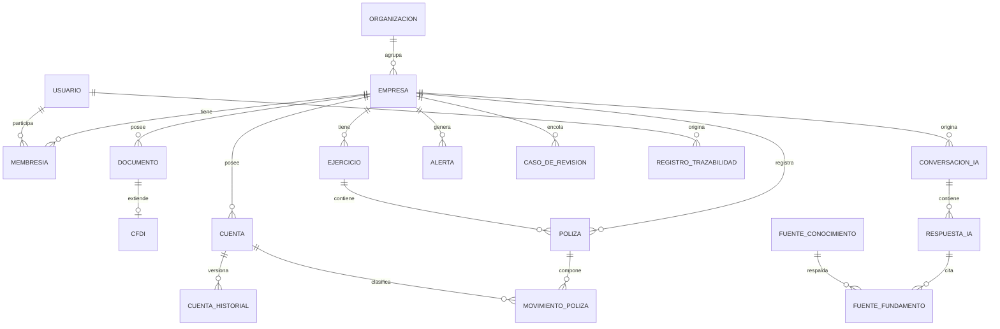
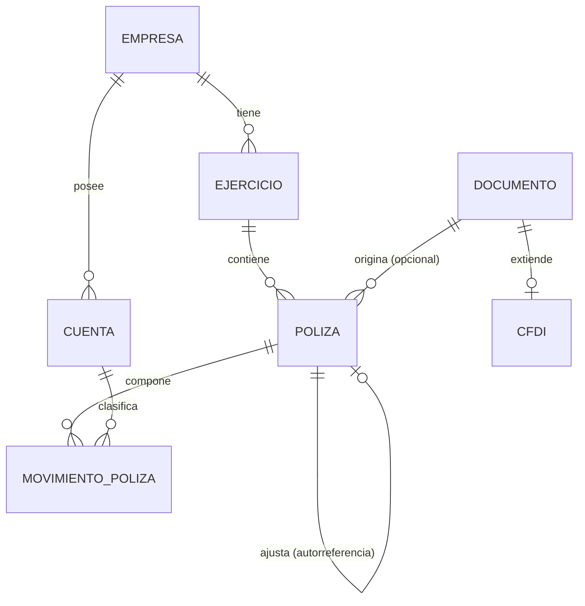
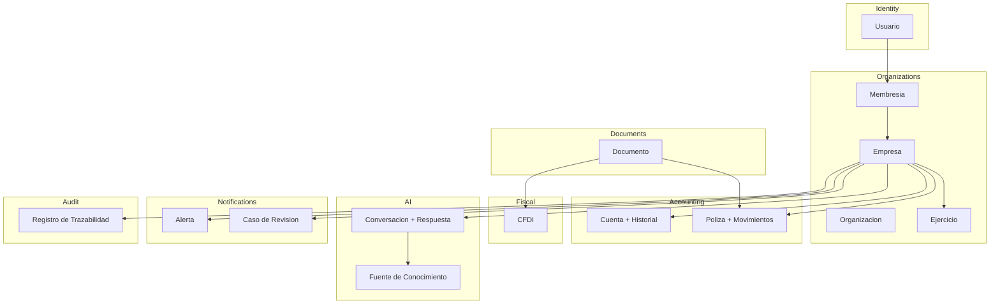

# Diseño de Base de Datos — ContaIA

## Control del documento

| Campo                               | Valor                                                                                                                                                                                                                                                     |
| ----------------------------------- | --------------------------------------------------------------------------------------------------------------------------------------------------------------------------------------------------------------------------------------------------------- |
| Documento                           | 09_DATABASE_DESIGN.md                                                                                                                                                                                                                                     |
| Orden de trabajo                    | AWO-005                                                                                                                                                                                                                                                   |
| Versión                             | 1.0                                                                                                                                                                                                                                                       |
| **Estado**                          | **Draft v1.0**                                                                                                                                                                                                                                            |
| Fecha de creación                   | 2026-07-18                                                                                                                                                                                                                                                |
| Última actualización                | 2026-07-18                                                                                                                                                                                                                                                |
| Fuentes de verdad                   | `MASTER_CONTEXT.md`, `docs/00_PRODUCT_VISION.md`, `docs/01_PRD.md`, `docs/02_USER_PERSONAS.md`, `docs/04_BUSINESS_RULES.md`, `docs/05_SYSTEM_DOMAIN_MODEL.md`, `docs/06_SYSTEM_WORKFLOWS.md`, `docs/07_SOFTWARE_ARCHITECTURE.md`, `docs/08_API_DESIGN.md` |
| Documentos que este diseño alimenta | `docs/10_AI_ARCHITECTURE.md`, `docs/11_SECURITY_ARCHITECTURE.md`, `docs/25_DEVOPS.md`, `docs/18_TESTING_STRATEGY.md`                                                                                                                                      |

> Nota: La Work Order referenciaba `docs/03_BUSINESS_RULES.md` y `docs/05_SYSTEM_WORKFLOWS.md` (nombres desactualizados por renumeraciones de AWO-001/002; rutas reales `docs/04` y `docs/06`). `docs/09_DATABASE_DESIGN.md` ya ocupaba su posición correcta tras el intercambio hecho en AWO-004; no fue necesaria ninguna renumeración esta vez.

> Este documento diseña el **modelo lógico** de datos: entidades, relaciones, restricciones e integridad. No contiene SQL, `CREATE TABLE`, migraciones, ORM ni índices concretos. Un ingeniero debe poder construir el esquema físico a partir de aquí sin reinterpretar decisiones.

---

## 1. Objetivos del diseño de datos

1. Sostener el aislamiento multiempresa (BR-GLB-001) como propiedad estructural del dato, no solo de la aplicación.
2. Representar exactamente las entidades del dominio de `docs/05_SYSTEM_DOMAIN_MODEL.md` — ninguna tabla existe si no representa un concepto real del negocio.
3. Cerrar, a nivel de dato, los dos riesgos que `docs/08_API_DESIGN.md` resolvió a nivel de contrato: deduplicación de CFDI por Folio Fiscal y bloqueo optimista en aprobaciones.
4. Garantizar que el Registro de Trazabilidad sea auditable, inmutable y utilizable como bus de eventos interno (AD-06 de `docs/07_SOFTWARE_ARCHITECTURE.md`), sin comprometer el rendimiento del resto del sistema.
5. Preparar el esquema para volúmenes altos (millones de registros de Pólizas y Trazabilidad a lo largo de varios Ejercicios) sin comprometer la regla de no eliminación física (BR-INT-002).
6. Dar a Backend, IA y DevOps un modelo suficiente para construir el esquema físico, sin ambigüedad sobre qué entidades existen y cómo se relacionan.

## 2. Principios de modelado

- **Una tabla, un concepto de dominio.** Ninguna entidad de este documento existe solo por conveniencia técnica sin representar algo real de `docs/05_SYSTEM_DOMAIN_MODEL.md` — salvo las excepciones técnicas explícitamente marcadas como tales en la sección 4 (Job, Clave de Idempotencia), que existen por necesidad de `docs/08_API_DESIGN.md`, no por moda técnica.
- **Aislamiento por diseño.** Toda entidad que pertenece a una Empresa lleva su clave de Empresa como parte de su identidad relacional, nunca como un campo opcional.
- **Inmutabilidad donde el negocio lo exige.** Póliza definitiva y Registro de Trazabilidad nunca se editan ni se eliminan (BR-POL-004, BR-TRZ-002, BR-INT-002); su corrección ocurre por adición de nuevos registros, no por modificación.
- **Versionado explícito, no implícito.** Donde el negocio requiere historial (Catálogo de Cuentas, fórmulas de cálculo), el modelo separa el "estado actual" del "historial de cambios" en vez de sobrescribir silenciosamente.
- **Claves primarias opacas.** Todo identificador primario es un UUID v4, sin significado de negocio ni secuencia adivinable (consistente con `docs/08_API_DESIGN.md`, sección 4).
- **La IA nunca escribe directamente sobre datos contables.** Ninguna entidad de IA (sección 11) tiene una relación de escritura hacia Póliza, Cuenta o Estado Financiero; solo puede generar sus propias entidades (Respuesta de IA) que después, si corresponde, alimentan una Póliza en borrador a través del mismo camino que cualquier otro origen (BR-GLB-002, BR-IA-004).

## 3. Estrategia multiempresa

- **Tenant:** en ContaIA, el tenant lógico es la **Empresa**, no la Organización ni el Usuario. Cada fila de datos de negocio pertenece exactamente a una Empresa.
- **Empresa:** entidad raíz de aislamiento (`docs/05_SYSTEM_DOMAIN_MODEL.md`); toda tabla de negocio (Documento, CFDI, Cuenta, Póliza, Alerta, ConversaciónIA, etc.) incluye `companyId` como parte de su clave relacional.
- **Pertenencia:** la pertenencia de un Usuario a una Empresa se modela exclusivamente a través de la entidad **Membresía** (sección 5); ningún Usuario tiene una relación directa e implícita con los datos de una Empresa fuera de su Membresía vigente.
- **Aislamiento:** se sostiene en dos niveles — (a) toda consulta de aplicación filtra por `companyId` (ya definido en `docs/07_SOFTWARE_ARCHITECTURE.md`), y (b) el modelo de datos hace que **sea estructuralmente imposible** construir una consulta válida sobre una tabla de negocio sin `companyId`, al ser parte de las claves foráneas encadenadas desde Empresa.
- **Ownership (propietario):** atributo booleano (`isOwner`) sobre la fila de Membresía, no una entidad ni un rol distinto (BR-PERM-003). No participa en ninguna restricción de acceso a nivel de dato; es metadato informativo.

## 4. Modelo lógico

Nueve agrupaciones de entidades. Ocho corresponden a los Bounded Contexts de `docs/05_SYSTEM_DOMAIN_MODEL.md`; **Audit** se separa de "Governance" porque, aunque `docs/07_SOFTWARE_ARCHITECTURE.md` la trata como capacidad transversal de infraestructura (no un módulo de negocio con interfaz propia), a nivel de **datos** sí constituye un grupo de entidades identificable y con reglas propias de retención — ambas decisiones son compatibles, no contradictorias (una es de arquitectura de código, esta es de modelo de datos).

| Grupo              | Función                                                                                                                         |
| ------------------ | ------------------------------------------------------------------------------------------------------------------------------- |
| **Identity**       | Identidad y credenciales de los Usuarios.                                                                                       |
| **Organizations**  | Organización, Empresa, Ejercicio: el árbol de aislamiento multiempresa.                                                         |
| **Accounting**     | Catálogo de Cuentas y su historial, Pólizas y sus movimientos.                                                                  |
| **Fiscal**         | Datos extraídos de comprobantes fiscales (CFDI), como extensión de Documento.                                                   |
| **Documents**      | Documentos genéricos cargados al repositorio de una Empresa.                                                                    |
| **AI**             | Conversaciones, Respuestas, Fuentes de Fundamento, retroalimentación y el contenido curado de `knowledge/`.                     |
| **Notifications**  | Alertas deterministas y Casos de Revisión (cola de aprobación humana).                                                          |
| **Audit**          | Registro de Trazabilidad — auditoría y bus de eventos interno (mismo mecanismo, AD-06).                                         |
| **Administration** | No introduce entidades propias; reutiliza Identity, Organizations y Audit con un tipo de acción específico (acceso de soporte). |

Adicionalmente, una agrupación **técnica** no pertenece al dominio de negocio, sino a necesidades de `docs/08_API_DESIGN.md`: **Job** (operaciones asíncronas) y **Clave de Idempotencia** — declaradas explícitamente como infraestructura técnica, no como conceptos de negocio, para no violar el principio de la sección 2.

## 5. Catálogo de entidades

### Identity

**Usuario**

- **Propósito:** identidad única de una persona con acceso a la plataforma.
- **Clave primaria:** `userId` (UUID).
- **Relaciones:** 1 Usuario → N Membresías.
- **Restricciones:** correo electrónico único en todo el sistema (BR-USR-002); contraseña almacenada solo como hash (BR-SEC-002), nunca en texto plano.
- **Ciclo de vida:** registrado (no verificado) → verificado → activo → (opcional) desactivado; nunca eliminado físicamente si tiene historial asociado (preserva trazabilidad, BR-USR-003).

### Organizations

**Organización**

- **Propósito:** agrupar Empresas administradas por el mismo conjunto de Usuarios.
- **Clave primaria:** `organizationId` (UUID).
- **Relaciones:** 1 Organización → N Empresas.
- **Restricciones:** ninguna Empresa existe sin una Organización asociada (incluso si es de una sola persona, se crea implícitamente — BR-ORG-001).
- **Ciclo de vida:** creada implícitamente con la primera Empresa de un Usuario; persiste mientras exista al menos una Empresa asociada.

**Empresa**

- **Propósito:** unidad central de aislamiento de datos.
- **Clave primaria:** `companyId` (UUID).
- **Relaciones:** N Empresas → 1 Organización; 1 Empresa → N Membresías, N Ejercicios, N Documentos, N Cuentas, N Pólizas, N Alertas, N ConversacionesIA.
- **Restricciones:** siempre tiene al menos una Membresía con rol Administrador y `isOwner = true` en el momento de su creación (BR-EMP-001).
- **Ciclo de vida:** creada → operativa; la baja de una Empresa (fuera del alcance funcional del MVP) no implica eliminación física de su historial.

**Membresía**

- **Propósito:** relación (Usuario, Empresa, Rol) que determina permisos.
- **Clave primaria:** `membershipId` (UUID).
- **Relaciones:** N:1 con Usuario; N:1 con Empresa — realiza, en conjunto, una relación N:M entre Usuario y Empresa **con atributos propios** (`role`, `isOwner`, `status`), razón por la cual es una entidad propia y no una tabla de unión simple (ver sección 6).
- **Restricciones:** único par (`userId`, `companyId`) activo a la vez (BR-EMP-004); `role` restringido a los seis valores oficiales (BR-ROL, sección 5 de `docs/04_BUSINESS_RULES.md`).
- **Ciclo de vida:** pendiente (invitada) → activa → (opcional) desactivada; desactivar no elimina la fila, preserva trazabilidad (BR-USR-003).

**Ejercicio**

- **Propósito:** periodo contable de una Empresa.
- **Clave primaria:** `fiscalYearId` (UUID).
- **Relaciones:** N:1 con Empresa; 1 Ejercicio → N Pólizas.
- **Restricciones:** rango de fechas (`startDate`, `endDate`) sin solapamiento con otro Ejercicio de la misma Empresa.
- **Ciclo de vida:** abierto → cerrado (BR-EJE-002); sin flujo de reapertura definido en el MVP (riesgo heredado, ver sección 16).

### Accounting

**Cuenta**

- **Propósito:** unidad de clasificación contable dentro del Catálogo de una Empresa.
- **Clave primaria:** `accountId` (UUID).
- **Relaciones:** N:1 con Empresa; 1 Cuenta → N MovimientoPoliza; 1 Cuenta → N CuentaHistorial.
- **Restricciones:** código de cuenta único por Empresa (`companyId` + `accountCode`, BR-CAT-002).
- **Ciclo de vida:** creada → activa → (opcional) desactivada; nunca eliminada físicamente (BR-INT-002); cambios generan una fila en CuentaHistorial (BR-CAT-001).

**CuentaHistorial**

- **Propósito:** versión anterior de una Cuenta antes de un cambio.
- **Clave primaria:** `accountHistoryId` (UUID).
- **Relaciones:** N:1 con Cuenta.
- **Restricciones:** de solo inserción (append-only); nunca se edita ni se borra.
- **Ciclo de vida:** creada en el momento de cada cambio a la Cuenta correspondiente; persiste indefinidamente.

**Póliza**

- **Propósito:** registro contable balanceado de un movimiento.
- **Clave primaria:** `journalEntryId` (UUID).
- **Relaciones:** N:1 con Empresa; N:1 con Ejercicio; 1 Póliza → N MovimientoPoliza; N:1 opcional con Documento (CFDI origen); 0:1 con Póliza origen (autorreferencia, para Pólizas de ajuste — BR-POL-004).
- **Restricciones:** suma de cargos de sus MovimientoPoliza = suma de abonos (BR-POL-002, BR-INT-001); estado inicial siempre `DRAFT` (BR-POL-001); campo `version` (entero) para bloqueo optimista, consistente con `docs/08_API_DESIGN.md` sección 13.
- **Ciclo de vida:** `DRAFT → PENDING_REVIEW → DEFINITIVE`, o `PENDING_REVIEW → DRAFT` (rechazo); una vez `DEFINITIVE`, inmutable — su corrección solo ocurre mediante una nueva Póliza que la referencia como origen de ajuste (BR-POL-004).

**MovimientoPoliza**

- **Propósito:** línea individual de cargo o abono dentro de una Póliza.
- **Clave primaria:** `journalEntryLineId` (UUID).
- **Relaciones:** N:1 con Póliza; N:1 con Cuenta.
- **Restricciones:** `type` restringido a `DEBIT`/`CREDIT`; `amount` positivo, representado como valor decimal exacto (nunca de punto flotante), consistente con `docs/08_API_DESIGN.md` sección 4.
- **Ciclo de vida:** creado y editable únicamente mientras su Póliza esté en `DRAFT`; inmutable en cuanto la Póliza pasa a `DEFINITIVE`.

### Fiscal

**CFDI**

- **Propósito:** datos estructurados extraídos de un Documento XML ya timbrado por su emisor original.
- **Clave primaria:** `cfdiId` (UUID).
- **Relaciones:** 1:1 con Documento (extiende exactamente un Documento).
- **Restricciones:** **unicidad compuesta (`companyId`, `folioFiscal`)** — cierra a nivel de dato la deduplicación diseñada en `docs/08_API_DESIGN.md` (sección 13); campos ambiguos se marcan explícitamente (`ambiguousFields`, lista), nunca se completan por inferencia (BR-XML-002).
- **Ciclo de vida:** creado cuando un Documento XML se valida y extrae con éxito (workflow 7); nunca se marca como "timbrado" ni "validado ante el SAT" (BR-CFDI-001) — esos estados no existen en este modelo.

### Documents

**Documento**

- **Propósito:** cualquier archivo cargado al repositorio de una Empresa.
- **Clave primaria:** `documentId` (UUID).
- **Relaciones:** N:1 con Empresa; 0:1 con CFDI (si es un XML fiscal válido); N:1 opcional referenciado por Póliza.
- **Restricciones:** pertenece exactamente a una Empresa (BR-DOC-001); `storageReference` apunta al almacenamiento de objetos, el archivo binario no vive en la base de datos relacional.
- **Ciclo de vida:** `PENDING_UPLOAD → PROCESSING → PROCESSED | REJECTED` (workflow 6, `docs/08_API_DESIGN.md` sección 14).

### AI

**ConversaciónIA**

- **Propósito:** agrupar el intercambio de preguntas y respuestas de un Usuario con los Agentes de IA.
- **Clave primaria:** `conversationId` (UUID).
- **Relaciones:** N:1 con Empresa (o con el espacio sandbox si es Estudiante); 1 Conversación → N RespuestaIA.
- **Restricciones:** nunca referencia datos de una Empresa distinta a la indicada (BR-GLB-001, BR-IA-003).
- **Ciclo de vida:** iniciada → activa mientras haya intercambio; no se elimina, forma parte del historial consultable.

**RespuestaIA**

- **Propósito:** salida de un Agente ante una pregunta, con su evaluación de calidad.
- **Clave primaria:** `aiResponseId` (UUID).
- **Relaciones:** N:1 con ConversaciónIA; 1 Respuesta → N FuenteFundamento; 0:1 con CasoDeRevisión (si fue marcada o bloqueada).
- **Restricciones:** `confidenceLevel` restringido a `APPROVED | REQUIRES_REVIEW | INSUFFICIENT` (BR-IA-008); **ninguna clave foránea de escritura hacia Póliza o Cuenta** (principio fundamental, sección 2 de este documento).
- **Ciclo de vida:** generada → evaluada → mostrada o bloqueada; inmutable una vez evaluada (una corrección genera una nueva Respuesta, no edita la anterior).

**FuenteFundamento**

- **Propósito:** referencia de fuente, vigencia y apartado que respalda una Respuesta.
- **Clave primaria:** `sourceReferenceId` (UUID).
- **Relaciones:** N:1 con RespuestaIA; N:1 opcional con FuenteConocimiento.
- **Restricciones:** si `sourceReferenceId` no tiene FuenteConocimiento asociada, la Respuesta debe declarar ausencia de fundamento (BR-GLB-003) — no puede existir una FuenteFundamento "vacía" simulando respaldo.
- **Ciclo de vida:** creada junto con su Respuesta; inmutable.

**FuenteConocimiento**

- **Propósito:** metadatos de un documento curado y validado de `knowledge/`, usado como fundamento por los Agentes.
- **Clave primaria:** `knowledgeSourceId` (UUID).
- **Relaciones:** 1 FuenteConocimiento → N FuenteFundamento.
- **Restricciones:** metadatos mínimos obligatorios de `MASTER_CONTEXT.md` (sección 14.2): título, institución, tipo, fecha de publicación, vigencia, versión, estatus de validación (BR-VER-001) — sin estos campos, no es citable (BR-GLB-003).
- **Ciclo de vida:** cargada y validada por el equipo interno → vigente → (opcional) marcada como derogada/sustituida, sin eliminarse (preserva trazabilidad histórica de qué fundamentó respuestas pasadas).

**RetroalimentaciónIA**

- **Propósito:** valoración de un Usuario sobre la utilidad de una Respuesta.
- **Clave primaria:** `aiFeedbackId` (UUID).
- **Relaciones:** N:1 con RespuestaIA; N:1 con Usuario.
- **Restricciones:** un Usuario retroalimenta una misma Respuesta una sola vez (unicidad `aiResponseId` + `userId`).
- **Ciclo de vida:** creada una vez; editable solo por el mismo Usuario que la emitió.

### Notifications

**Alerta**

- **Propósito:** aviso determinista de una inconsistencia detectable.
- **Clave primaria:** `alertId` (UUID).
- **Relaciones:** N:1 con Empresa; referencia polimórfica a la entidad que la originó (Póliza, Documento).
- **Restricciones:** nunca generada por un proceso de IA generativa (BR-NOT-002); visible solo para Usuarios con Membresía vigente en la Empresa (BR-NOT-003).
- **Ciclo de vida:** generada → visible → atendida (resuelta implícitamente al corregirse la causa, o marcada explícitamente).

**CasoDeRevisión**

- **Propósito:** unidad de trabajo pendiente de aprobación o rechazo humano.
- **Clave primaria:** `approvalId` (UUID).
- **Relaciones:** N:1 con Empresa; referencia polimórfica al origen (Póliza en `PENDING_REVIEW`, RespuestaIA marcada); N:1 opcional con Usuario resolutor.
- **Restricciones:** `status` restringido a `PENDING | APPROVED | REJECTED`; `reason` obligatorio si `status = REJECTED` (BR-TRZ-003); campo `version` para bloqueo optimista (`docs/08_API_DESIGN.md`, sección 13).
- **Ciclo de vida:** creado → resuelto; nunca se elimina, forma parte de la evidencia de auditoría.

### Audit

**RegistroDeTrazabilidad**

- **Propósito:** evidencia inmutable de toda acción sensible; también actúa como bus de eventos interno (AD-06 de `docs/07_SOFTWARE_ARCHITECTURE.md`).
- **Clave primaria:** `traceEventId` (UUID), con marca de tiempo de alta precisión para ordenamiento.
- **Relaciones:** N:1 con Usuario (actor); N:1 opcional con Empresa (nulo para acciones de plataforma); referencia polimórfica al recurso afectado.
- **Restricciones:** append-only — ninguna operación de actualización o borrado disponible a nivel de aplicación (BR-TRZ-002); campos mínimos obligatorios: actor, empresa, acción, recurso, fecha/hora, resultado, versión de reglas (BR-TRZ-001), extendidos aquí con IP, dispositivo, motivo y estado antes/después cuando aplique (petición explícita de esta Work Order, compatible con BR-TRZ-001 al ser una ampliación, no una reducción, del mínimo ya exigido).
- **Ciclo de vida:** creado una vez por evento; persiste indefinidamente (ver estrategia de archivado, sección 12).

### Infraestructura técnica (no es dominio de negocio)

**Job**

- **Propósito:** representar una operación asíncrona (extracción de XML, generación de reportes, etc.), según `docs/08_API_DESIGN.md` sección 15.
- **Clave primaria:** `jobId` (UUID).
- **Relaciones:** N:1 con Empresa; referencia polimórfica al recurso resultante cuando `status = COMPLETED`.
- **Restricciones:** `status` restringido a `QUEUED | PROCESSING | COMPLETED | FAILED | CANCELLED`.
- **Ciclo de vida:** creado → estado terminal; candidato a purga tras un periodo de retención técnica (a diferencia del Registro de Trazabilidad, no es evidencia de negocio permanente — ver sección 13).

**ClaveDeIdempotencia**

- **Propósito:** evitar que una repetición de solicitud duplique un efecto de negocio (`docs/08_API_DESIGN.md`, sección 13).
- **Clave primaria:** la propia clave de idempotencia (cadena provista por el cliente) + `endpoint`.
- **Relaciones:** ninguna relación de dominio; referencia técnica a la respuesta original almacenada.
- **Restricciones:** única por (`idempotencyKey`, `endpoint`, `userId`).
- **Ciclo de vida:** creada en la primera solicitud; expira tras una ventana de tiempo técnica (pendiente de validación, ver sección 16).

## 6. Relaciones

| Tipo                           | Ejemplo                          | Por qué existe                                                                                                                                                                                                                                                                                                                   |
| ------------------------------ | -------------------------------- | -------------------------------------------------------------------------------------------------------------------------------------------------------------------------------------------------------------------------------------------------------------------------------------------------------------------------------- |
| **1:1**                        | Documento ↔ CFDI                 | Un CFDI es una extensión de datos extraídos de un Documento XML específico; no todo Documento tiene CFDI, pero todo CFDI corresponde a exactamente un Documento (BR-CFDI-002).                                                                                                                                                   |
| **1:N**                        | Empresa → Póliza                 | Toda Póliza pertenece a una sola Empresa (aislamiento, BR-GLB-001); una Empresa tiene muchas Pólizas a lo largo del tiempo.                                                                                                                                                                                                      |
| **1:N**                        | Póliza → MovimientoPoliza        | Una Póliza balanceada requiere al menos dos movimientos (un cargo y un abono); los movimientos no existen fuera de su Póliza.                                                                                                                                                                                                    |
| **1:N**                        | Cuenta → CuentaHistorial         | Cada cambio a una Cuenta genera una fila de historial nueva, nunca sobrescribe la anterior (BR-CAT-001).                                                                                                                                                                                                                         |
| **1:N**                        | Organización → Empresa           | Una Organización agrupa varias Empresas (formaliza el despacho contable); cardinalidad inversa (¿una Empresa en más de una Organización?) queda como supuesto no confirmado — ver sección 16.                                                                                                                                    |
| **N:M (vía Membresía)**        | Usuario ↔ Empresa                | Un Usuario participa en varias Empresas y una Empresa tiene varios Usuarios; la relación **no** es una tabla de unión simple porque lleva atributos propios (`role`, `isOwner`, `status`) que son, en sí mismos, el núcleo del modelo de autorización — de ahí que Membresía sea una entidad de primera clase, no un mero cruce. |
| **N:M (vía FuenteFundamento)** | RespuestaIA ↔ FuenteConocimiento | Una Respuesta puede citar varias fuentes, y una misma fuente puede fundamentar muchas Respuestas distintas a lo largo del tiempo.                                                                                                                                                                                                |

## 7. Reglas de integridad

- **Integridad referencial:** toda clave foránea debe apuntar a un registro existente **de la misma Empresa** cuando ambas entidades son de negocio (BR-INT-003) — por ejemplo, un MovimientoPoliza no puede referenciar una Cuenta de una Empresa distinta a la de su Póliza, incluso si el UUID es técnicamente válido en otra tabla.
- **Unicidad:** correo de Usuario (global); (`companyId`, `folioFiscal`) en CFDI; (`companyId`, `accountCode`) en Cuenta; (`userId`, `companyId`) en Membresía activa; (`idempotencyKey`, `endpoint`, `userId`) en ClaveDeIdempotencia.
- **Consistencia:** suma de cargos = suma de abonos en toda Póliza `DEFINITIVE` (BR-POL-002, BR-INT-001) — validado antes de la transición de estado, no solo en la aplicación.
- **Validaciones:** `role` de Membresía limitado a los seis valores oficiales; `type` de MovimientoPoliza limitado a `DEBIT`/`CREDIT`; `status` de cada entidad con ciclo de vida limitado a sus valores declarados en la sección 5; el RFC (value object de `docs/05_SYSTEM_DOMAIN_MODEL.md`) se valida solo en formato estructural, nunca contra el SAT.

## 8. Estrategia de versionado

- **Catálogos (Cuenta):** patrón "estado actual + historial" — CuentaHistorial almacena una copia de cada versión anterior antes de un cambio (BR-CAT-001, BR-VER-003).
- **Reglas de cálculo (fórmulas de Balanza/Estados Financieros):** no se versionan como filas de negocio editables; cada resultado generado (fuera del alcance de este documento, ver `docs/08_API_DESIGN.md` sección 10) almacena la referencia a la versión de fórmula usada, de forma que el historial de resultados sea reproducible sin necesidad de versionar la fórmula en sí como entidad transaccional (BR-VER-002).
- **Configuraciones de Empresa:** los cambios de configuración (datos generales, ajustes) se registran en el Registro de Trazabilidad con el estado antes/después (BR-CFG-002); no requieren una tabla de historial dedicada aparte, dado que su frecuencia de cambio es baja y su evidencia ya vive en Audit.
- **Contenido normativo (FuenteConocimiento):** versionado explícito por campo `version` y `validFrom`/`validTo`, nunca sobrescrito — una actualización normativa crea una nueva FuenteConocimiento con nueva vigencia, dejando la anterior consultable como histórica (BR-VER-001).

## 9. Auditoría

El Registro de Trazabilidad (sección 5) captura, por cada evento:

| Campo                         | Descripción                                                                                                                |
| ----------------------------- | -------------------------------------------------------------------------------------------------------------------------- |
| `actorUserId`                 | Usuario que ejecutó la acción (o `null` si es un proceso del sistema).                                                     |
| `companyId`                   | Empresa afectada (`null` para acciones de plataforma).                                                                     |
| `action`                      | Identificador de la acción (por ejemplo, el ID de endpoint de `docs/08_API_DESIGN.md`).                                    |
| `resourceType` / `resourceId` | Tipo y clave del recurso afectado.                                                                                         |
| `timestamp`                   | Fecha y hora del evento.                                                                                                   |
| `result`                      | Éxito, fallo, o estado resultante.                                                                                         |
| `beforeState` / `afterState`  | Representación del recurso antes y después del cambio, cuando aplique (por ejemplo, en cambios de configuración o de Rol). |
| `ipAddress`                   | Dirección IP de origen de la solicitud.                                                                                    |
| `deviceInfo`                  | Información básica de dispositivo/cliente (agente de usuario u equivalente), sin fines de perfilado.                       |
| `reason`                      | Motivo, obligatorio en rechazos y en accesos de soporte interno (BR-TRZ-003, BR-SEC-004).                                  |

Este conjunto de campos amplía — sin contradecir — los siete campos mínimos exigidos por BR-TRZ-001; la regla de negocio fija un piso, este documento agrega detalle técnico sobre ese piso.

## 10. Manejo documental

- **Documento** almacena metadatos (tipo, estado, empresa, fechas, usuario) y una referencia lógica (`storageReference`) al almacenamiento de objetos — nunca el binario del archivo.
- **XML / PDF / otros formatos:** se distinguen por el campo `fileType` de Documento; el procesamiento de extracción (CFDI) solo aplica a XML válidos.
- **Evidencias:** toda Póliza, Caso de Revisión o Respuesta de IA que referencia un Documento lo hace por `documentId`, preservando la cadena de evidencia sin duplicar el archivo.
- **Estados:** `PENDING_UPLOAD → PROCESSING → PROCESSED | REJECTED` (idéntico al ciclo de vida de `docs/08_API_DESIGN.md`, sección 14); un Documento `REJECTED` conserva su motivo de rechazo (vía Registro de Trazabilidad o campo `rejectionReason`).
- **Almacenamiento:** fuera del alcance de este documento — es responsabilidad de la capa de Infraestructura (`docs/07_SOFTWARE_ARCHITECTURE.md`, sección 14); este modelo solo define la referencia lógica.

## 11. IA

Modelo mínimo suficiente para sostener el chat contable-fiscal del MVP: ConversaciónIA agrupa RespuestaIA; cada RespuestaIA lleva cero o más FuenteFundamento (nunca inventadas — BR-GLB-003); FuenteConocimiento es el contenido curado y versionado de `knowledge/`; RetroalimentaciónIA cierra el ciclo con el Usuario.

**Restricción estructural explícita, pedida por esta Work Order:** ninguna entidad de este grupo tiene clave foránea de escritura hacia Cuenta, Póliza o MovimientoPoliza. Si una Respuesta de IA propone una clasificación contable, esa propuesta vive dentro de `RespuestaIA.result` (texto/estructura de propuesta) — convertirla en una Póliza real requiere que un Usuario humano la capture explícitamente como una nueva Póliza en `DRAFT` (workflow 8), pasando por el mismo camino de aprobación que cualquier otra Póliza. La IA no tiene, en este modelo, ninguna vía técnica para insertar o modificar una fila de Cuenta, Póliza o MovimientoPoliza.

## 12. Rendimiento

Sin índices concretos (fuera del alcance de este documento); estrategia conceptual:

- **Índices:** todo campo `companyId` es candidato a índice, por ser el filtro de aislamiento omnipresente; la unicidad compuesta (`companyId`, `folioFiscal`) y (`companyId`, `accountCode`) debe implementarse como restricción indexada, no solo validada en aplicación.
- **Particionado:** Póliza, MovimientoPoliza y RegistroDeTrazabilidad son las tablas de mayor crecimiento; particionar por Empresa o por Ejercicio es la estrategia recomendada cuando el volumen lo justifique (consistente con `docs/07_SOFTWARE_ARCHITECTURE.md`, sección 16), sin necesidad de definirlo en el MVP inicial.
- **Archivado:** el Registro de Trazabilidad nunca se elimina (BR-TRZ-002), pero sí puede moverse a almacenamiento más frío tras un periodo de antigüedad, permaneciendo consultable — "archivar" no es "eliminar".
- **Consultas frecuentes:** Balanza y Estados Financieros (fuera de este documento, definidos como resultados calculados en `docs/08_API_DESIGN.md`) son candidatos a una futura tabla de resultados materializados/recalculables si el volumen de Pólizas por Ejercicio lo justifica; esto no compromete el determinismo (BR-GLB-004) siempre que la recalculación sea reproducible.
- **Grandes volúmenes:** el diseño evita relaciones N:M sin necesidad y prioriza claves foráneas directas por Empresa, para que la mayoría de consultas del MVP resuelvan con un filtro simple más un rango de fechas.

## 13. Seguridad

- **Cifrado lógico:** RFC, correo electrónico y cualquier dato personal identificable son candidatos a cifrado a nivel de columna; el mecanismo concreto se define en `docs/11_SECURITY_ARCHITECTURE.md` (BR-SEC-001).
- **Datos sensibles:** credenciales (nunca en texto plano, solo hash — BR-SEC-002), RFC, correo, y el contenido de Documentos/CFDI (información financiera de la Empresa).
- **Retención:** el Registro de Trazabilidad y las entidades contables definitivas (Póliza, Cuenta) se retienen indefinidamente por diseño (BR-TRZ-002, BR-INT-002); Job y ClaveDeIdempotencia son técnicos y tienen una ventana de retención corta, pendiente de definir en `docs/11_SECURITY_ARCHITECTURE.md`.
- **Eliminación:** ninguna entidad de negocio definitiva se elimina físicamente; solo entidades técnicas (Job, ClaveDeIdempotencia) y datos en estado `DRAFT`/`PENDING_UPLOAD` no confirmados pueden purgarse.
- **Anonimización:** el entorno sandbox del rol Estudiante (si se habilita — alcance de MVP aún pendiente en `docs/01_PRD.md`) **no** usa datos anonimizados de Empresas reales; usa datos completamente sintéticos desde su creación, porque BR-ROL-002 prohíbe cualquier forma de acceso a datos reales, incluida la anonimizada.

## 14. Recuperación

- **Backups:** copias de respaldo regulares de la base de datos relacional y del almacenamiento de objetos; frecuencia y retención **pendientes de validación** en `docs/25_DEVOPS.md` — no se fija un número aquí.
- **Recuperación:** capacidad de recuperación a un punto en el tiempo (point-in-time recovery), particularmente relevante dado que el Registro de Trazabilidad es evidencia legal/operativa que no puede reconstruirse si se pierde.
- **Continuidad:** entornos redundantes y separados (desarrollo, pruebas, staging, producción — `MASTER_CONTEXT.md`, sección 17); la estrategia de alta disponibilidad concreta se define en `docs/25_DEVOPS.md`, no en este documento.

## 15. Diagramas

### 15.1 Modelo general por grupo

### 15.2 Relaciones principales del núcleo contable

### 15.3 Módulos y su agrupación de entidades

## 16. Riesgos

- **Cuello de botella en el Registro de Trazabilidad.** Al ser simultáneamente auditoría y bus de eventos interno (AD-06), su volumen de escritura crece con cada acción sensible de todos los módulos; sin particionado o archivado, puede convertirse en el punto más caliente de la base de datos (heredado de `docs/07_SOFTWARE_ARCHITECTURE.md`).
- **Duplicidad de CFDI si el índice único no se implementa exactamente.** La deduplicación por (`companyId`, `folioFiscal`) depende de que esta restricción se implemente como índice único real, no solo como validación de aplicación — de lo contrario, el riesgo ya señalado en AWO-002/003/004 reaparece en producción.
- **Crecimiento indefinido sin eliminación.** Póliza, MovimientoPoliza, CuentaHistorial y RegistroDeTrazabilidad crecen sin límite por diseño (BR-INT-002, BR-TRZ-002); requiere una estrategia de particionado/archivado desde etapas tempranas, no como ocurrencia tardía.
- **Consistencia eventual entre Job y su resultado.** Un Documento en `PROCESSING` depende de que su Job asociado complete correctamente; si el Job falla silenciosamente sin actualizar el estado del Documento, puede quedar en un estado intermedio indefinido — requiere un mecanismo de expiración/reintento a nivel de infraestructura, no modelado en detalle aquí.
- **Cardinalidad Organización-Empresa no confirmada.** Heredado de `docs/05_SYSTEM_DOMAIN_MODEL.md`: este documento modela 1:N (una Empresa pertenece a una sola Organización); si el negocio requiere que una Empresa pertenezca a varias Organizaciones en el futuro, el modelo de Organización-Empresa deberá revisarse.
- **Ventana de expiración de Claves de Idempotencia no definida.** Sin una ventana clara, existe el riesgo de que una clave expire "demasiado pronto" (permitiendo duplicados reales) o "demasiado tarde" (acumulando datos técnicos innecesarios) — pendiente de validación.

## 17. Recomendaciones para implementación

- **Migraciones:** versionadas y reversibles (ya establecido en `docs/07_SOFTWARE_ARCHITECTURE.md`, sección 17); todo cambio de esquema que afecte una tabla con datos de negocio debe seguir un patrón expand/contract (agregar columna nullable → backfill → aplicar restricción → limpiar lo obsoleto), nunca una migración destructiva directa sobre datos definitivos.
- **Semillas (seed data):** limitarse a datos técnicos necesarios para operar (catálogo de los seis Roles oficiales, tipos de documento permitidos); **ningún catálogo de cuentas contables "por defecto" debe presentarse como oficial o válido fiscalmente** sin que quede explícitamente marcado como plantilla no oficial, consistente con el límite de `MASTER_CONTEXT.md` de no inventar datos fiscales o contables no validados.
- **Pruebas:** los entornos de prueba usan el mismo esquema que producción, poblado con datos sintéticos; nunca se copian datos reales de una Empresa cliente a un entorno de pruebas (coherente con BR-GLB-001 y con el aislamiento del rol Estudiante).
- **Evolución del esquema:** preferir agregar entidades y campos opcionales sobre modificar el significado de un campo existente; cualquier cambio incompatible con `docs/08_API_DESIGN.md` (sección 18) debe coordinarse explícitamente entre ambos documentos antes de implementarse.

---

## Historial de cambios

| Fecha      | Cambio                                                                                                                                                                                                                                                                                                                                                                                    | Responsable                        |
| ---------- | ----------------------------------------------------------------------------------------------------------------------------------------------------------------------------------------------------------------------------------------------------------------------------------------------------------------------------------------------------------------------------------------- | ---------------------------------- |
| 2026-07-18 | Creación de la primera versión completa de `docs/09_DATABASE_DESIGN.md` bajo AWO-005: modelo lógico de 20 entidades en 9 grupos de dominio más infraestructura técnica, relaciones, reglas de integridad, versionado, auditoría extendida, manejo documental, restricción estructural de escritura de IA, rendimiento, seguridad, recuperación y 3 diagramas Mermaid. Estado: Draft v1.0. | Responsable de producto de ContaIA |

---

## Observaciones del Arquitecto

**Decisiones tomadas:**

- Se separó **Audit** como grupo de entidades propio en el modelo de datos, aunque `docs/07_SOFTWARE_ARCHITECTURE.md` lo trate como capacidad transversal de infraestructura sin módulo de negocio dedicado — ambas decisiones son compatibles porque operan en capas distintas (arquitectura de código vs. modelo de datos).
- Se implementaron a nivel de dato las dos decisiones de `docs/08_API_DESIGN.md` que dependían de esto: unicidad compuesta (`companyId`, `folioFiscal`) en CFDI, y campo `version` para bloqueo optimista en Póliza y CasoDeRevisión.
- Se declaró explícitamente que Job y ClaveDeIdempotencia son infraestructura técnica, no conceptos de negocio, para no violar el principio de "una tabla, un concepto de dominio" sin transparencia sobre la excepción.
- Se modeló la restricción "la IA nunca modifica directamente información contable" como una **ausencia estructural de relación** (ninguna clave foránea de escritura desde entidades de IA hacia Cuenta/Póliza/MovimientoPoliza), no como una regla de aplicación que podría omitirse.
- Se decidió que FuenteConocimiento (el contenido curado de `knowledge/`) es parte de este modelo de datos, no un almacén externo no modelado, dado que `docs/10_AI_ARCHITECTURE.md` necesitará consultarlo con los mismos metadatos exigidos por `MASTER_CONTEXT.md` (sección 14.2).

**Riesgos:**

- Ver sección 16 completa. Los de mayor prioridad para `docs/10_AI_ARCHITECTURE.md` y `docs/11_SECURITY_ARCHITECTURE.md` son: el crecimiento del Registro de Trazabilidad como bus de eventos, y la consistencia eventual entre Job y el recurso que procesa.

**Mejoras futuras:**

- Evaluar una tabla de resultados materializados para Balanza/Estados Financieros si el volumen de consulta lo justifica, sin comprometer el determinismo (BR-GLB-004).
- Definir el flujo de reapertura de Ejercicio (heredado como pendiente desde `docs/06_SYSTEM_WORKFLOWS.md`) antes de que su ausencia bloquee un caso de negocio real.
- Revisar la cardinalidad Organización-Empresa (1:N asumida aquí) si el negocio confirma que una Empresa puede pertenecer a varias Organizaciones.

**Dependencias para AWO-006:**

- `docs/10_AI_ARCHITECTURE.md` debe partir de ConversaciónIA, RespuestaIA, FuenteFundamento y FuenteConocimiento (sección 5) para diseñar el pipeline técnico de los Agentes, respetando la restricción de que la IA nunca escribe directamente sobre Cuenta/Póliza.
- `docs/11_SECURITY_ARCHITECTURE.md` debe cerrar los mecanismos concretos de cifrado (sección 13), las ventanas de retención de Job y ClaveDeIdempotencia (sección 16), y la frecuencia de backups (sección 14).
- `docs/00_DOCUMENTATION_INDEX.md` y `docs/00_DOCUMENTATION_GUIDE.md` siguen sin existir (hallazgo original en `docs/02_USER_PERSONAS.md`); con diez documentos técnicos ya interconectados, se reitera la recomendación de crearlos.
