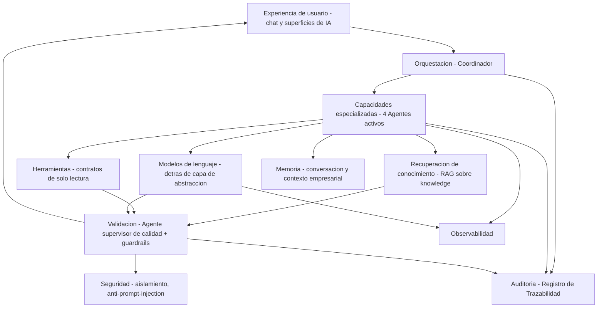
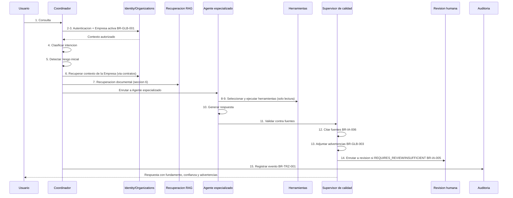
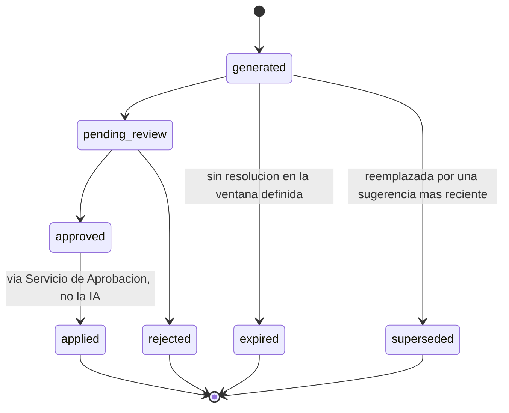
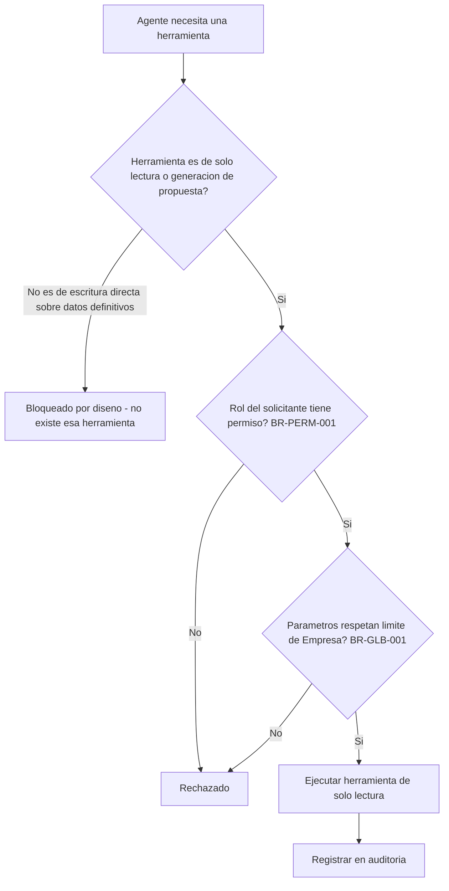
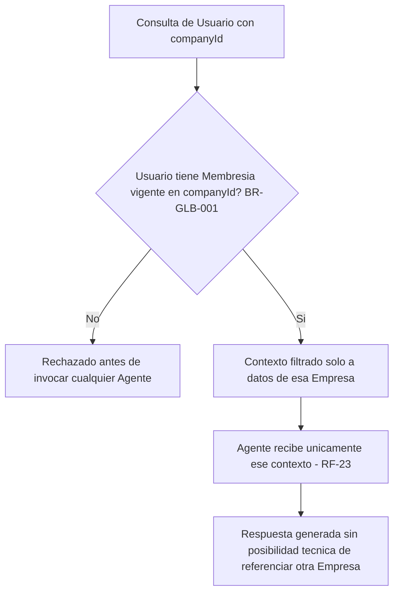
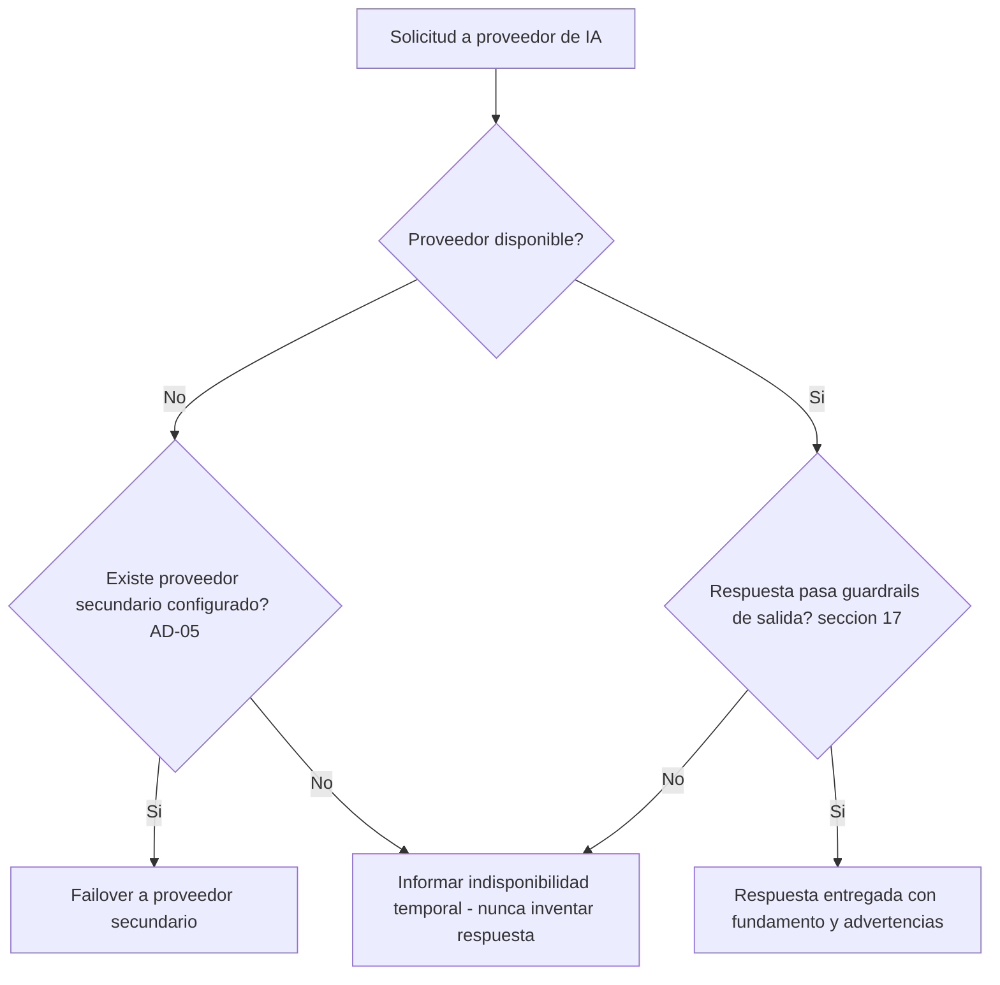

# Arquitectura de Inteligencia Artificial — ContaIA

## Control del documento

| Campo                                     | Valor                                                                                                                                                                                                                                                                                   |
| ----------------------------------------- | --------------------------------------------------------------------------------------------------------------------------------------------------------------------------------------------------------------------------------------------------------------------------------------- |
| Documento                                 | 10_AI_ARCHITECTURE.md                                                                                                                                                                                                                                                                   |
| Orden de trabajo                          | AWO-006                                                                                                                                                                                                                                                                                 |
| Versión                                   | 1.0                                                                                                                                                                                                                                                                                     |
| **Estado**                                | **Draft v1.0**                                                                                                                                                                                                                                                                          |
| Fecha de creación                         | 2026-07-18                                                                                                                                                                                                                                                                              |
| Última actualización                      | 2026-07-18                                                                                                                                                                                                                                                                              |
| Fuentes de verdad                         | `MASTER_CONTEXT.md`, `docs/00_PRODUCT_VISION.md`, `docs/01_PRD.md`, `docs/02_USER_PERSONAS.md`, `docs/04_BUSINESS_RULES.md`, `docs/05_SYSTEM_DOMAIN_MODEL.md`, `docs/06_SYSTEM_WORKFLOWS.md`, `docs/07_SOFTWARE_ARCHITECTURE.md`, `docs/08_API_DESIGN.md`, `docs/09_DATABASE_DESIGN.md` |
| Documentos que esta arquitectura alimenta | `docs/11_SECURITY_ARCHITECTURE.md`, `docs/29_RAG_ARCHITECTURE.md` (ver nota), `docs/18_TESTING_STRATEGY.md`                                                                                                                                                                             |

> Nota sobre numeración (histórica, AWO-006): la Work Order referenciaba `docs/03_BUSINESS_RULES.md` y `docs/05_SYSTEM_WORKFLOWS.md` (rutas reales: `docs/04` y `docs/06`). También pedía el entregable en `docs/10_AI_ARCHITECTURE.md`, posición que en ese momento ocupaba UI/UX Design; se intercambiaron posiciones. UI/UX Design se ha reubicado varias veces desde entonces (AWO-007 a AWO-011) y hoy vive en `docs/17_UI_UX_DESIGN.md`. Ver "Observaciones del Arquitecto" de `docs/15_UX_FLOWS.md` para el detalle más reciente.

> Este documento diseña arquitectura de IA a nivel conceptual. No es código de producción, no diseña interfaces, no rediseña tablas (`docs/09_DATABASE_DESIGN.md` ya las define) ni endpoints completos (`docs/08_API_DESIGN.md` ya los define). No cambia el alcance del MVP de `docs/01_PRD.md`.

---

## 1. Propósito y alcance

ContaIA usa IA para **analizar, explicar, recomendar, detectar riesgos, generar borradores y proponer soluciones — nunca para decidir** (principio fundamental, `docs/04_BUSINESS_RULES.md`, sección 2). Este documento diseña cómo se construye técnicamente esa promesa: orquestación, capacidades especializadas, recuperación de conocimiento (RAG), herramientas, memoria, seguridad, evaluación y observabilidad.

**Cubre en el MVP:** los cuatro Agentes ya activados por `docs/01_PRD.md` (sección 10) — Contable, Fiscal, CFDI/XML, Supervisor de calidad — y la capa de orquestación, recuperación y guardrails que los sostiene.

**Corresponde a fases futuras:** Agentes de nómina, jurídico corporativo, auditoría formal, educativo completo, financiero-empresarial (los siete restantes de los once definidos en `MASTER_CONTEXT.md`, sección 13); análisis predictivo; automatización administrativa; aprendizaje con retroalimentación de clientes.

**Tareas prohibidas, sin excepción, en cualquier fase:** ejecutar o confirmar una acción contable/fiscal definitiva; calcular cifras críticas (siempre determinístico, BR-GLB-004); timbrar o simular integración con el SAT (BR-GLB-005); mezclar datos entre Empresas (BR-GLB-001); usar datos de clientes para entrenar modelos generales sin consentimiento explícito y base contractual (sección 16); inventar leyes, artículos, tasas o fechas (BR-GLB-003, principio 10.10 de `MASTER_CONTEXT.md`).

**Siempre requieren revisión humana:** toda propuesta que derive en una Póliza, todo dato extraído de un CFDI antes de uso contable, toda Respuesta clasificada `REQUIRES_REVIEW` o `INSUFFICIENT` por el Agente supervisor de calidad (BR-IA-005, BR-IA-008).

## 2. Casos de uso de IA

| Caso de uso                                         | Usuario objetivo        | Entrada                               | Salida                              | Fuentes                                 | Herramientas                          | Riesgo | Revisión humana                              | BR relacionada                | Estado MVP                                                                                                                                                   |
| --------------------------------------------------- | ----------------------- | ------------------------------------- | ----------------------------------- | --------------------------------------- | ------------------------------------- | ------ | -------------------------------------------- | ----------------------------- | ------------------------------------------------------------------------------------------------------------------------------------------------------------ |
| Asistente contable                                  | Contador, Auxiliar      | Pregunta en lenguaje natural          | Explicación + fundamento o ausencia | `knowledge/NIF`, catálogo de la Empresa | Consultar catálogo, consultar pólizas | Medio  | Recomendada                                  | BR-IA-001, 006                | **MVP**                                                                                                                                                      |
| Asistente fiscal                                    | Contador, Asesor fiscal | Pregunta en lenguaje natural          | Explicación + fundamento o ausencia | `knowledge/SAT,CFF,ISR,IVA,IEPS,RMF`    | Obtener reglas aplicables             | Alto   | Recomendada / obligatoria según caso         | BR-IA-001, 002                | **MVP**                                                                                                                                                      |
| Análisis de CFDI                                    | Auxiliar, Contador      | XML cargado                           | Datos estructurados + advertencias  | El propio archivo                       | Consultar CFDI, validar RFC           | Medio  | Obligatoria antes de uso contable            | BR-CFDI-001 a 003, BR-XML-002 | **MVP**                                                                                                                                                      |
| Clasificación documental                            | Auxiliar                | Documento cargado                     | Tipo sugerido                       | Metadatos del archivo                   | Leer documentos                       | Bajo   | Recomendada                                  | BR-DOC-003                    | **MVP** (capacidad menor del Agente CFDI/XML, no agente propio)                                                                                              |
| Sugerencia de cuentas contables                     | Contador                | Datos de un CFDI o Póliza en borrador | Cuenta(s) sugerida(s)               | Catálogo de la Empresa                  | Consultar catálogo                    | Medio  | Obligatoria (nunca se aplica sin aprobación) | BR-IA-004, BR-POL-003         | **MVP** (capacidad del Agente Contable)                                                                                                                      |
| Sugerencia de pólizas                               | Contador, Auxiliar      | CFDI vinculado                        | Póliza propuesta en borrador        | Catálogo, CFDI                          | Generar borradores                    | Medio  | Obligatoria                                  | BR-POL-001, BR-CFDI-003       | **MVP** (capacidad del Agente Contable)                                                                                                                      |
| Explicación de errores                              | Cualquier Rol           | Error de validación                   | Explicación en lenguaje claro       | —                                       | —                                     | Bajo   | No requerida (es informativo)                | BR-ERR-001                    | **MVP** (capacidad menor, no agente propio)                                                                                                                  |
| Revisión de consistencia                            | —                       | —                                     | —                                   | —                                       | —                                     | —      | —                                            | BR-NOT-002                    | **Fuera de esta arquitectura de IA** — las alertas de consistencia son deterministas por regla de negocio explícita, nunca generadas por IA (ver sección 31) |
| Análisis de estados financieros                     | Contador, Administrador | Estado Financiero ya calculado        | Explicación de variaciones          | Resultado determinístico                | Analizar balanzas                     | Medio  | Recomendada                                  | BR-IA-002, BR-GLB-004         | **MVP** (explicación únicamente, capacidad del Agente Contable — nunca calcula)                                                                              |
| Consultas sobre NIF                                 | Contador                | Pregunta                              | Explicación + fundamento            | `knowledge/NIF`                         | —                                     | Medio  | Recomendada                                  | BR-IA-001                     | **MVP** (capacidad del Agente Contable)                                                                                                                      |
| Consultas sobre legislación fiscal                  | Contador, Asesor fiscal | Pregunta                              | Explicación + fundamento            | `knowledge/SAT` y relacionadas          | Obtener reglas aplicables             | Alto   | Recomendada / obligatoria                    | BR-IA-001, 002                | **MVP** (Agente Fiscal)                                                                                                                                      |
| Generación de papeles de trabajo                    | Contador                | Solicitud                             | Documento de apoyo estructurado     | Datos de la Empresa                     | —                                     | Medio  | Obligatoria                                  | —                             | **Fuera del MVP** — no es un módulo aprobado en `docs/01_PRD.md`                                                                                             |
| Apoyo educativo                                     | Estudiante              | Pregunta                              | Explicación didáctica               | `knowledge/` académico                  | —                                     | Bajo   | Recomendada por un docente                   | —                             | **Diferido** — Agente Educativo no activo; alcance del rol Estudiante aún pendiente (`docs/01_PRD.md`, sección 21)                                           |
| Automatización administrativa                       | —                       | —                                     | —                                   | —                                       | —                                     | —      | —                                            | —                             | **Fuera del MVP** — corresponde a la Etapa 3 de `MASTER_CONTEXT.md`                                                                                          |
| Detección de anomalías (proactiva, no determinista) | —                       | —                                     | —                                   | —                                       | —                                     | —      | —                                            | —                             | **Fuera del MVP** — ver sección 28                                                                                                                           |

## 3. Modelo general de arquitectura IA

Cada capa corresponde a mecanismos ya definidos en documentos previos: Orquestación y Capacidades (esta sección y 4-5), RAG (sección 6, y `docs/09_DATABASE_DESIGN.md` FuenteConocimiento/FuenteFundamento), Herramientas (sección 10), Memoria (sección 14), Validación (Agente supervisor de calidad, BR-IA-008), Seguridad (secciones 15-16), Auditoría (RegistroDeTrazabilidad, AD-06 de `docs/07_SOFTWARE_ARCHITECTURE.md`), Observabilidad (sección 21).

## 4. Estrategia de orquestación

**Decisión:** un **orquestador central ligero** (el "Coordinador", sección 5) enruta cada consulta a lo determinístico o a una capacidad especializada — nunca a un agente completamente autónomo con capacidad de encadenar acciones por sí mismo sin puntos de control.

| Situación                                                             | Mecanismo usado                                                                                                                        |
| --------------------------------------------------------------------- | -------------------------------------------------------------------------------------------------------------------------------------- |
| Cálculo contable o fiscal crítico                                     | Siempre **lógica determinística** (Motor de Cálculo Contable, `docs/07_SOFTWARE_ARCHITECTURE.md`, AD-04); nunca un modelo de lenguaje. |
| Pregunta conceptual con necesidad de fundamento normativo             | **Búsqueda documental (RAG)** + Agente Contable o Fiscal.                                                                              |
| Extracción de datos de un CFDI                                        | **Modelo de lenguaje asistido + validación determinística** (estructura XML validada por reglas, no por el modelo).                    |
| Acción con efecto contable (crear/aprobar una Póliza)                 | Siempre pasa por el **Servicio de Aprobación** (BR-GLB-002); ningún Agente ejecuta la acción por sí mismo.                             |
| Herramienta externa necesaria (consultar catálogo, consultar pólizas) | **Herramienta de solo lectura** (sección 10), nunca de escritura directa.                                                              |
| Ambigüedad o riesgo alto detectado                                    | **Revisión humana** obligatoria (BR-IA-005), el Agente se detiene y genera un Caso de Revisión.                                        |

Esta arquitectura evita deliberadamente diseñar "agentes completamente autónomos": ningún Agente decide su propia siguiente acción sin pasar por el Coordinador y, cuando corresponde, por el Servicio de Aprobación.

## 5. Catálogo de capacidades especializadas

**Reconciliación de alcance:** esta Work Order sugiere diez capacidades. `docs/01_PRD.md` (sección 10) ya aprobó únicamente **cuatro Agentes activos** para el MVP. La siguiente tabla mapea cada capacidad sugerida a un Agente activo existente, a una capacidad menor dentro de uno de ellos, o la marca como diferida — **no se crean agentes nuevos sin necesidad clara**, conforme a la instrucción explícita de esta Work Order.

| Capacidad sugerida                 | Resolución                                                                                                                                                                                                                            |
| ---------------------------------- | ------------------------------------------------------------------------------------------------------------------------------------------------------------------------------------------------------------------------------------- |
| Coordinador IA                     | **Nuevo, pero no es un Agente de negocio** — es la capa de orquestación técnica (sección 4), invisible como "persona" para el usuario. Siempre activo, no es opcional.                                                                |
| Asistente Fiscal                   | = **Agente Fiscal** (activo, `MASTER_CONTEXT.md` 13.2)                                                                                                                                                                                |
| Asistente Contable                 | = **Agente Contable** (activo, `MASTER_CONTEXT.md` 13.1)                                                                                                                                                                              |
| Analizador de CFDI                 | = **Agente de CFDI y XML** (activo, `MASTER_CONTEXT.md` 13.4)                                                                                                                                                                         |
| Clasificador Documental            | Capacidad menor del Agente de CFDI y XML; no es un Agente propio.                                                                                                                                                                     |
| Generador de Sugerencias de Póliza | Capacidad del Agente Contable (genera borrador, nunca aplica — BR-IA-004).                                                                                                                                                            |
| Analista Financiero                | = Agente financiero y empresarial (`MASTER_CONTEXT.md` 13.6) — **diferido**, no activo en el MVP. Su función mínima de explicar (no calcular) Estados Financieros ya calculados queda cubierta por el Agente Contable mientras tanto. |
| Revisor de Consistencia            | **No se implementa como capacidad de IA** — las alertas de consistencia son deterministas por regla de negocio explícita (BR-NOT-002); construirlo como IA contradiría esa regla.                                                     |
| Asistente Educativo                | = Agente educativo (`MASTER_CONTEXT.md` 13.9) — **diferido**, condicionado a que se resuelva el alcance del rol Estudiante (`docs/01_PRD.md`, sección 21).                                                                            |
| Explicador de Resultados           | Capacidad transversal del Agente Contable y Fiscal, no un Agente propio.                                                                                                                                                              |

### Agentes activos del MVP

| Agente                                     | Responsabilidad                                               | Límites                                | Herramientas permitidas                                                             | Fuentes                                          | Datos accesibles                                                            | Salidas                                                       | Prohibiciones                                          | Revisión requerida                                       |
| ------------------------------------------ | ------------------------------------------------------------- | -------------------------------------- | ----------------------------------------------------------------------------------- | ------------------------------------------------ | --------------------------------------------------------------------------- | ------------------------------------------------------------- | ------------------------------------------------------ | -------------------------------------------------------- |
| **Agente Contable**                        | Clasificar, explicar y proponer sobre información contable.   | Solo Empresa activa; nunca contabiliza | Consultar catálogo, consultar pólizas, analizar balanzas                            | `knowledge/NIF`, catálogo de la Empresa          | Catálogo, Pólizas (lectura), Estados Financieros ya calculados              | Explicación, sugerencia de clasificación, borrador de Póliza  | Contabilizar, calcular cifras críticas                 | Obligatoria antes de aplicar cualquier sugerencia        |
| **Agente Fiscal**                          | Interpretar y organizar obligaciones fiscales con fundamento. | Solo contenido curado y vigente        | Obtener reglas aplicables                                                           | `knowledge/SAT,CFF,ISR,IVA,IEPS,RMF`             | Ninguno dato contable directo salvo lo que el usuario provea en la pregunta | Explicación fundamentada, advertencias de vigencia            | Presentar declaraciones, garantizar cumplimiento       | Obligatoria antes de cualquier trámite                   |
| **Agente de CFDI y XML**                   | Extraer y validar estructuralmente comprobantes.              | No timbra, no valida ante el SAT       | Consultar CFDI, validar RFC (formato)                                               | El propio archivo XML                            | Documento/CFDI de la Empresa activa                                         | Datos estructurados + campos ambiguos marcados                | Timbrar, simular validación oficial                    | Obligatoria antes de uso contable                        |
| **Agente Supervisor de Calidad y Fuentes** | Evaluar toda respuesta especializada antes de mostrarla.      | No genera contenido sustantivo propio  | Ninguna herramienta de negocio; solo metadatos de fuente y Registro de Trazabilidad | Metadatos de `knowledge/` (vigencia, validación) | Solo metadatos, no datos contables de la Empresa                            | Clasificación `APPROVED` / `REQUIRES_REVIEW` / `INSUFFICIENT` | Aprobar de forma autónoma una respuesta de alto riesgo | Es quien enruta a revisión humana, no quien la reemplaza |

## 6. Arquitectura RAG

> Esta sección responde íntegramente al contenido que `docs/29_RAG_ARCHITECTURE.md` reservaba como documento propio. Dado que esta Work Order exige una "Arquitectura RAG" completa dentro de este documento, se resuelve aquí; ver "Observaciones del Arquitecto" sobre qué hacer con el placeholder restante.

| Etapa              | Descripción                                                                                                                                                                                                                                                                                                                                                              |
| ------------------ | ------------------------------------------------------------------------------------------------------------------------------------------------------------------------------------------------------------------------------------------------------------------------------------------------------------------------------------------------------------------------ |
| **Ingestión**      | Documentos normativos (NIF, leyes fiscales, reglamentos, resoluciones, RMF, anexos, criterios, documentación interna, catálogos, manuales) se incorporan manualmente por el equipo responsable de contenido, nunca de forma automática desde la web (evita fuentes no verificadas).                                                                                      |
| **Extracción**     | Texto y estructura se extraen del documento original, preservando referencias a artículo/apartado.                                                                                                                                                                                                                                                                       |
| **Limpieza**       | Normalización de formato sin alterar el contenido normativo; ninguna paráfrasis en esta etapa.                                                                                                                                                                                                                                                                           |
| **Segmentación**   | División en fragmentos por unidad normativa citable (artículo, fracción, criterio) — nunca por longitud de texto arbitraria, para que cada fragmento sea citable de forma precisa.                                                                                                                                                                                       |
| **Metadatos**      | Los 14 campos de `docs/04_BUSINESS_RULES.md` (BR-VER-001) y `MASTER_CONTEXT.md` (sección 14.2): título, institución, tipo, ejercicio, fecha de publicación, vigencia (inicio/fin), versión, apartado, fuente original, estatus de validación, fecha de incorporación, responsable de validación — modelados como **FuenteConocimiento** en `docs/09_DATABASE_DESIGN.md`. |
| **Embeddings**     | Representación vectorial de cada fragmento, generada por el proveedor de IA vigente detrás de la capa de abstracción (AD-05); recalculable si se cambia de proveedor.                                                                                                                                                                                                    |
| **Almacenamiento** | Base vectorial (ya prevista como "extensión vectorial para RAG" en `MASTER_CONTEXT.md`, sección 17), asociada 1:N a FuenteConocimiento.                                                                                                                                                                                                                                  |
| **Recuperación**   | Búsqueda híbrida (semántica + filtros de metadatos obligatorios: vigencia activa, estatus validado) — un fragmento con vigencia vencida o no validado **nunca** se recupera para fundamentar una respuesta nueva.                                                                                                                                                        |
| **Reranking**      | Reordenamiento de los fragmentos recuperados por relevancia y por jerarquía de fuente (sección 8), priorizando fuentes de mayor autoridad ante empates de relevancia.                                                                                                                                                                                                    |
| **Generación**     | El modelo de lenguaje genera la respuesta usando únicamente los fragmentos recuperados como contexto — no su conocimiento general no verificado (mitiga alucinación, BR-GLB-003).                                                                                                                                                                                        |
| **Citación**       | Cada afirmación normativa relevante enlaza a su FuenteFundamento (fuente, apartado, vigencia).                                                                                                                                                                                                                                                                           |
| **Validación**     | El Agente supervisor de calidad confirma que cada cita recuperada realmente respalda la afirmación generada, antes de exponer la respuesta (BR-IA-008).                                                                                                                                                                                                                  |

## 7. Versionado normativo

Todo registro de FuenteConocimiento incluye (ya definido en `docs/09_DATABASE_DESIGN.md`, sección 5, ampliado aquí con jurisdicción):

`jurisdicción` (México, salvo excepción explícita) · `tipo de fuente` · `título` · `autoridad` · `ejercicio` · `fecha de publicación` · `inicio de vigencia` · `fin de vigencia` · `versión` · `artículo o sección` · `fuente original` · `estatus` · `fecha de incorporación` · `responsable de validación`.

**Cómo se evita usar normas de un ejercicio incorrecto:** toda consulta al Agente Fiscal o Contable recibe el Ejercicio de la Empresa activa como parámetro de contexto (`docs/09_DATABASE_DESIGN.md`, entidad Ejercicio); la recuperación (sección 6) filtra `FuenteConocimiento` cuya vigencia cubra la fecha del Ejercicio consultado — un fragmento vigente solo para 2024 nunca se recupera para una pregunta sobre el Ejercicio 2026, incluso si es semánticamente el más relevante.

## 8. Jerarquía y confiabilidad de fuentes

1. Legislación y publicaciones oficiales (Diario Oficial de la Federación, leyes).
2. Reglas y resoluciones oficiales (RMF, criterios normativos del SAT).
3. NIF y normas profesionales (CINIF, respetando licencias — `MASTER_CONTEXT.md`, sección 14.4).
4. Criterios institucionales (PRODECON, jurisprudencia de SCJN/TFJA).
5. Documentación interna validada por el equipo de ContaIA.
6. Contenido educativo (sin uso en respuestas fiscales/contables sustantivas — solo en modo educativo diferido).
7. Archivos proporcionados por Usuarios (CFDI, documentos propios) — nunca se tratan como fundamento normativo, solo como datos de la Empresa.

**Resolución de contradicciones:** ante dos fuentes vigentes de nivel distinto que se contradicen, prevalece la de mayor nivel (número más bajo en la tabla); si el conflicto ocurre dentro del mismo nivel, el Agente supervisor de calidad clasifica la respuesta como `REQUIRES_REVIEW` (BR-IA-007, gestión de incertidumbre) en vez de elegir arbitrariamente. **Las fuentes de nivel 5 en adelante nunca se presentan como fundamento legal definitivo** — se citan explícitamente como "criterio orientativo" o "material educativo", nunca como norma.

## 9. Pipeline de consultas

## 10. Uso de herramientas

Todas las herramientas son de **solo lectura o generación de propuestas**; ninguna escribe directamente sobre Cuenta, Póliza o MovimientoPoliza (restricción estructural ya fijada en `docs/09_DATABASE_DESIGN.md`, sección 11).

| Herramienta               | Propósito                                                                 | Entrada                     | Salida                               | Permisos                               | Validaciones                                    | Riesgo                              | Auditoría | Prohibido                                  |
| ------------------------- | ------------------------------------------------------------------------- | --------------------------- | ------------------------------------ | -------------------------------------- | ----------------------------------------------- | ----------------------------------- | --------- | ------------------------------------------ |
| Consultar CFDI            | Leer datos extraídos de un CFDI                                           | `documentId`                | Datos estructurados                  | Lectura, Empresa activa                | Pertenencia a la Empresa (BR-GLB-001)           | Bajo                                | Sí        | Modificar el CFDI                          |
| Consultar catálogo        | Leer Catálogo de Cuentas                                                  | `companyId`                 | Lista de Cuentas                     | Lectura                                | Pertenencia a la Empresa                        | Bajo                                | No        | Crear/editar Cuentas                       |
| Leer documentos           | Obtener contenido de un Documento                                         | `documentId`                | Contenido/metadatos                  | Lectura                                | Pertenencia a la Empresa                        | Bajo                                | No        | Descargar fuera de contexto autorizado     |
| Calcular importes         | Delegar un cálculo al Motor determinístico (nunca calcular con el modelo) | Parámetros del cálculo      | Resultado + versión de fórmula       | Lectura                                | BR-GLB-004                                      | Medio (si se omite la delegación)   | Sí        | Que el modelo calcule directamente         |
| Analizar balanzas         | Leer una Balanza ya generada                                              | `companyId`, `fiscalYearId` | Datos de balanza                     | Lectura                                | Pertenencia a la Empresa                        | Bajo                                | No        | Recalcular o alterar el resultado          |
| Consultar pólizas         | Leer Pólizas de la Empresa                                                | `companyId`                 | Lista/detalle de Pólizas             | Lectura                                | Pertenencia a la Empresa                        | Bajo                                | No        | Crear/aprobar Pólizas                      |
| Generar borradores        | Producir una propuesta de Póliza o explicación                            | Contexto de la conversación | Objeto de Sugerencia (sección 11)    | Escritura solo en estado `generated`   | BR-IA-004                                       | Medio                               | Sí        | Marcar como aplicada por sí misma          |
| Validar RFC               | Verificar formato estructural de un RFC                                   | Cadena de RFC               | Válido/inválido estructuralmente     | Ninguno especial                       | Solo formato, nunca contra el SAT (BR-CFDI-001) | Bajo                                | No        | Afirmar validez ante el SAT                |
| Revisar periodos          | Confirmar Ejercicio/periodo vigente de una consulta                       | `companyId`, fecha          | Ejercicio aplicable                  | Lectura                                | BR-EJE-001                                      | Bajo                                | No        | Modificar el Ejercicio                     |
| Obtener reglas aplicables | Recuperar FuenteConocimiento relevante (RAG)                              | Consulta + Ejercicio        | Fragmentos citables                  | Lectura                                | Vigencia y estatus validado (sección 6)         | Alto si falla el filtro de vigencia | Sí        | Usar contenido no validado como fundamento |
| Crear sugerencias         | Registrar una Sugerencia de IA (sección 11)                               | Contenido propuesto         | `aiResponseId` en estado `generated` | Escritura solo de la propia Sugerencia | BR-IA-004, BR-GLB-002                           | Medio                               | Sí        | Aplicar la sugerencia directamente         |

## 11. Modelo de sugerencias

Objeto conceptual **Sugerencia de IA** (realizado por `RespuestaIA` + su ciclo de aprobación en `docs/09_DATABASE_DESIGN.md`, extendido aquí con el ciclo de vida completo pedido por esta Work Order):

`tipo` · `companyId` · `usuario solicitante` · `recurso relacionado` (por ejemplo, Póliza en borrador candidata) · `contenido propuesto` · `explicación` · `evidencia` · `fuentes` · `nivel de confianza` · `riesgos` · `modelo utilizado` · `versión del prompt` (sección 18) · `fecha` · `estado` · `aprobador` · `motivo de aprobación o rechazo`.

**Estados:** `generated → pending_review → approved | rejected`, con estados adicionales `expired` (sin resolución dentro de una ventana, pendiente de validación de negocio), `superseded` (reemplazada por una Sugerencia más reciente sobre el mismo caso) y `applied`.

**`applied` ocurre exclusivamente mediante el Servicio de Aprobación** (`docs/05_SYSTEM_DOMAIN_MODEL.md`, sección 7) — un servicio de aplicación autorizado que ejecuta la creación real de la Póliza u otro recurso, nunca el modelo de IA de forma directa. El estado `applied` en el objeto Sugerencia es solo una referencia informativa a que un humano aprobó y el sistema determinístico ejecutó, no una acción que la IA realiza por sí misma.

## 12. Revisión humana

| Nivel                      | Descripción                                                                           | Ejemplos de capacidades de ContaIA                                                                                               |
| -------------------------- | ------------------------------------------------------------------------------------- | -------------------------------------------------------------------------------------------------------------------------------- |
| **Informativo**            | El usuario puede confiar sin acción adicional, pero puede pedir revisión si lo desea. | Explicación de errores; explicación de un Estado Financiero ya calculado.                                                        |
| **Revisión recomendada**   | Se sugiere que un humano confirme antes de actuar, no es obligatorio técnicamente.    | Respuestas conceptuales de NIF/legislación con `confidenceLevel = APPROVED`.                                                     |
| **Aprobación obligatoria** | El sistema bloquea la acción hasta que un humano apruebe.                             | Toda Sugerencia que derive en Póliza; toda Respuesta `REQUIRES_REVIEW`/`INSUFFICIENT`; extracción de CFDI antes de uso contable. |
| **Prohibido automatizar**  | Ninguna versión de este producto lo automatiza.                                       | Timbrado; presentación de declaraciones; envío al SAT; cálculo de cifras críticas por IA.                                        |

## 13. Confianza y explicabilidad

- **Nivel de confianza:** se expresa como `APPROVED / REQUIRES_REVIEW / INSUFFICIENT` (BR-IA-008) — una clasificación categórica del Agente supervisor de calidad, **no un porcentaje numérico**, porque ContaIA no cuenta con una medición estadística válida y calibrada de "72% de confianza"; presentar un número así sería una falsa precisión (instrucción explícita de esta Work Order, coherente con BR-GLB-003).
- **Razones, datos faltantes y supuestos:** toda respuesta declara explícitamente qué información usó y qué le faltó, en vez de rellenar silenciosamente (BR-IA-007).
- **Fuentes:** siempre visibles cuando existen (sección 6); ausencia declarada cuando no (BR-GLB-003).
- **Contradicciones:** señaladas explícitamente cuando el pipeline las detecta (sección 8), no resueltas arbitrariamente.
- **Advertencias y limitaciones:** parte obligatoria del contrato de respuesta ya definido en `docs/08_API_DESIGN.md` (sección 16).

## 14. Memoria y contexto

| Tipo                                                        | Duración                                                                                               | Aislamiento                           | Permisos                                          | Eliminación                                                            |
| ----------------------------------------------------------- | ------------------------------------------------------------------------------------------------------ | ------------------------------------- | ------------------------------------------------- | ---------------------------------------------------------------------- |
| Contexto de conversación                                    | Duración de la ConversaciónIA (`docs/09_DATABASE_DESIGN.md`)                                           | Por Empresa y por conversación        | Solo el Usuario que la inició y roles de revisión | No se elimina; es evidencia consultable, igual que cualquier historial |
| Memoria temporal (de trabajo, dentro de una sola respuesta) | Segundos, no persistida                                                                                | N/A                                   | Interno del pipeline                              | Se descarta al terminar la solicitud                                   |
| Preferencias del usuario                                    | Persistente, ligada al Usuario, no a una Empresa                                                       | Por Usuario                           | Solo el propio Usuario                            | Editable/eliminable por el Usuario                                     |
| Contexto empresarial (catálogo, pólizas recientes)          | Se recupera en cada consulta vía contratos de aplicación, no se cachea como "memoria libre" del modelo | Por Empresa (BR-GLB-001)              | Según Rol del solicitante                         | No aplica (no es un almacén propio de IA)                              |
| Conocimiento documental                                     | Persistente, versionado (sección 7)                                                                    | Global, no por Empresa (es normativo) | Lectura para todos los Agentes                    | Solo se marca como derogado, nunca se borra (histórico)                |
| Historial auditable                                         | Indefinido (BR-TRZ-002)                                                                                | Por Empresa                           | Auditor, Supervisor                               | Nunca se elimina                                                       |

**Qué nunca debe almacenarse como "memoria libre" no estructurada:** credenciales, RFC completo fuera del CFDI de origen, contenido de archivos cargados por el usuario reutilizado como si fuera conocimiento normativo validado, o cualquier dato de una Empresa reutilizado en la conversación de otra (BR-GLB-001, BR-IA-003).

## 15. Seguridad contra ataques

| Amenaza                                        | Defensa                                                                                                                                                                                                             |
| ---------------------------------------------- | ------------------------------------------------------------------------------------------------------------------------------------------------------------------------------------------------------------------- |
| Prompt injection                               | Todo contenido recuperado (documentos, CFDI, `knowledge/`) se trata como **datos**, nunca como instrucciones del sistema — el prompt de sistema (sección 18) es la única fuente de instrucciones de comportamiento. |
| Instrucciones maliciosas embebidas en archivos | El extractor de CFDI/XML (BR-XML-001) solo produce datos estructurados tipados; texto libre de un archivo nunca se interpreta como comando.                                                                         |
| Extracción de datos de otra Empresa            | El contexto entregado al modelo se filtra por Empresa activa antes de la inferencia (RF-23 de `docs/01_PRD.md`), no se confía en que el modelo "ignore" datos ajenos que no debería tener en primer lugar.          |
| Acceso entre empresas vía el chat              | Mismo mecanismo de aislamiento que el resto de la plataforma (BR-GLB-001) — el chat no tiene una vía de acceso distinta.                                                                                            |
| Abuso de herramientas                          | Herramientas de solo lectura (sección 10); ninguna acepta parámetros que crucen el límite de Empresa.                                                                                                               |
| Jailbreaks                                     | El prompt de sistema y los guardrails (sección 17) son independientes de lo que el usuario escriba; ninguna instrucción del usuario puede anular una política de seguridad (principio obligatorio 8).               |
| Exfiltración                                   | Las respuestas nunca incluyen credenciales, secretos ni datos de otra Empresa, verificado por un guardrail posterior a la generación (sección 17).                                                                  |
| Manipulación de fuentes                        | Solo el equipo interno de ContaIA puede agregar FuenteConocimiento (BR-VER-001); ningún Usuario puede inyectar contenido que se trate como normativo.                                                               |
| Documentos falsos / contenido adversarial      | Un CFDI o Documento cargado nunca se trata como fuente normativa, solo como dato de la Empresa (sección 8, nivel 7).                                                                                                |

## 16. Protección de datos

- **Minimización:** cada Agente recibe solo el contexto de la Empresa activa necesario para la consulta, no un volcado completo de datos.
- **Clasificación:** datos personales (RFC, correo), datos financieros (montos, Pólizas) y contenido normativo (público) se tratan con niveles de sensibilidad distintos.
- **Enmascaramiento:** en registros de observabilidad (sección 21), los datos sensibles se enmascaran; nunca se registran en texto plano en logs técnicos.
- **Cifrado:** igual que el resto del sistema (`docs/09_DATABASE_DESIGN.md`, sección 13) — mecanismo concreto pendiente de `docs/11_SECURITY_ARCHITECTURE.md`.
- **Retención:** conversaciones y respuestas se retienen como evidencia (BR-TRZ-002); no existe una política de "olvido" distinta a la del resto del sistema en el MVP.
- **Eliminación:** no aplica eliminación física de conversaciones que formen parte de evidencia de negocio, igual que el resto del modelo de datos.
- **Anonimización:** el entorno educativo (Estudiante) usa datos sintéticos desde el origen, nunca datos reales anonimizados (`docs/09_DATABASE_DESIGN.md`, sección 13).
- **Uso de información para entrenamiento:** los datos de clientes **no se usan para entrenar modelos generales de ningún proveedor sin consentimiento explícito y base contractual válida** — instrucción explícita de esta Work Order y límite ya establecido en `MASTER_CONTEXT.md` (sección 15).
- **Proveedores externos:** solo el proveedor de IA vigente detrás de la capa de abstracción (AD-05) recibe datos, y solo el contexto mínimo necesario por consulta — nunca una exportación masiva.
- **Secretos y credenciales:** gestionados fuera del código y fuera del contexto entregado al modelo (BR-SEC-002); ningún prompt incluye credenciales.

## 17. Guardrails y validadores

| Punto de control              | Validación                                                                                                                                                                                                                                                                                                      |
| ----------------------------- | --------------------------------------------------------------------------------------------------------------------------------------------------------------------------------------------------------------------------------------------------------------------------------------------------------------- |
| Antes del modelo              | Empresa activa resuelta y autorizada (BR-GLB-001); intención clasificada; riesgo inicial estimado.                                                                                                                                                                                                              |
| Durante la recuperación       | Filtro de vigencia y estatus de validación de `FuenteConocimiento` (sección 6); jerarquía de fuentes aplicada (sección 8).                                                                                                                                                                                      |
| Antes de usar herramientas    | Permisos de la herramienta verificados contra el Rol del solicitante (sección 10).                                                                                                                                                                                                                              |
| Después de usar herramientas  | Resultado de la herramienta validado contra su esquema esperado antes de pasar al modelo.                                                                                                                                                                                                                       |
| Antes de mostrar la respuesta | Esquema de salida validado (campos obligatorios del contrato de `docs/08_API_DESIGN.md`, sección 16: `result`, `explanation`, `sources`, `warnings`, `confidenceLevel`, `requiresHumanReview`); citas verificadas contra las fuentes realmente recuperadas (BR-IA-006); detección de datos sensibles indebidos. |
| Antes de aprobar acciones     | Verificación de que la propuesta no contiene una ejecución directa disfrazada de sugerencia (principio fundamental); control de permisos del aprobador humano (BR-GLB-002).                                                                                                                                     |

Validadores: **determinísticos** (reglas de negocio, BR-*), de **esquema de salida** (estructura del contrato de IA), de **citas** (cada afirmación normativa tiene una FuenteFundamento real), de **verificación de periodo** (sección 7), de **control de permisos** (RBAC, `docs/08_API_DESIGN.md` sección 7), y de **detección de datos sensibles** (sección 16).

## 18. Gestión de prompts

- **Prompts de sistema:** uno por Agente activo (sección 5), definiendo su rol, límites y prohibiciones; nunca expuestos al usuario final.
- **Plantillas por capacidad:** parametrizadas por variables explícitas (Empresa activa, Ejercicio, Rol del solicitante, fragmentos recuperados) — nunca concatenación libre de texto no confiable.
- **Versiones:** cada plantilla tiene un identificador de versión; toda ejecución relevante registra qué versión se usó (campo `versión del prompt` de la Sugerencia, sección 11).
- **Pruebas:** cambios a una plantilla pasan por el conjunto de evaluación (sección 20) antes de publicarse.
- **Aprobaciones:** un cambio de prompt de sistema requiere aprobación del responsable de producto o del equipo de IA, no despliegue directo sin revisión.
- **Rollback:** toda versión anterior de una plantilla permanece disponible para revertir si una nueva versión degrada la calidad (sección 20).
- **Protección:** el contenido de los prompts de sistema nunca se expone al usuario final, incluso si lo solicita explícitamente (defensa contra extracción, sección 15).
- **Trazabilidad:** la versión de plantilla usada se registra en el Registro de Trazabilidad junto con cada Respuesta (BR-TRZ-001).

## 19. Estrategia de modelos

Arquitectura independiente del proveedor, detrás de la capa de abstracción (AD-05 de `docs/07_SOFTWARE_ARCHITECTURE.md`). Categorías conceptuales, sin nombres comerciales obligatorios:

| Categoría           | Uso típico                                                                                  | Criterios                                                                      |
| ------------------- | ------------------------------------------------------------------------------------------- | ------------------------------------------------------------------------------ |
| **Modelo pequeño**  | Clasificación de intención, extracción estructural simple de CFDI, clasificación documental | Baja latencia, bajo costo, tarea acotada y bien definida                       |
| **Modelo mediano**  | Explicaciones contables/fiscales estándar, generación de borradores de Póliza               | Balance costo/calidad, razonamiento moderado                                   |
| **Modelo avanzado** | Preguntas fiscales complejas o ambiguas, evaluación de calidad del Agente supervisor        | Mayor capacidad de razonamiento, contexto largo, mejor manejo de incertidumbre |

Criterios de selección por consulta: complejidad de la tarea, costo aceptable (sección 22), latencia tolerable, sensibilidad de los datos involucrados (privacidad), longitud de contexto necesaria (documentos normativos largos), necesidad de razonamiento multi-paso, necesidad de uso de herramientas, necesidad de salida estructurada (JSON validable), y disponibilidad/salud del proveedor (sección 23).

## 20. Evaluación de calidad

| Dimensión                    | Qué mide                                                                                       |
| ---------------------------- | ---------------------------------------------------------------------------------------------- |
| Exactitud                    | La respuesta coincide con el fundamento citado, sin distorsión.                                |
| Fundamento                   | Toda afirmación normativa relevante tiene una fuente real y vigente.                           |
| Relevancia                   | La respuesta atiende la pregunta formulada.                                                    |
| Consistencia                 | Preguntas equivalentes producen respuestas coherentes entre sí.                                |
| Cumplimiento de formato      | La salida cumple el esquema del contrato de IA (sección 17).                                   |
| Uso correcto de herramientas | Ninguna herramienta se usó fuera de su propósito o permisos.                                   |
| Seguridad                    | Resiste el conjunto de casos adversariales (sección 15).                                       |
| Rechazo apropiado            | El sistema declara ausencia de fundamento cuando corresponde, en vez de inventar (BR-GLB-003). |
| Costo                        | Costo por consulta dentro de lo esperado para su categoría de modelo.                          |
| Latencia                     | Tiempo de respuesta dentro de lo esperado por tipo de consulta.                                |

**Conjunto de evaluación:** casos contables (clasificación, explicación de pólizas), casos fiscales (con y sin fundamento disponible, para probar honestidad), casos adversariales (intentos de prompt injection, solicitudes de acción prohibida), regresiones (casos que fallaron antes y deben mantenerse corregidos). **Evaluación humana** obligatoria para cambios de prompt de sistema (sección 18); **métricas automáticas** para el resto de dimensiones en cada despliegue.

## 21. Observabilidad

Se registra (sin secretos ni razonamiento interno privado del modelo): identificador de solicitud, Usuario, Empresa, capacidad/Agente invocado, proveedor, modelo (categoría), tokens consumidos, latencia, costo estimado, fuentes recuperadas, herramientas usadas, errores, resultado de validaciones, nivel de riesgo estimado, resultado final (`confidenceLevel`), y retroalimentación del Usuario si existe.

**No se registra:** contenido de credenciales o secretos; el "razonamiento interno" (cadena de pensamiento) del modelo cuando el proveedor lo expone como dato privado no destinado a persistirse; datos de una Empresa distinta a la de la consulta.

## 22. Costos y rendimiento

- **Selección dinámica de modelos:** enrutar cada consulta a la categoría de modelo (sección 19) mínima suficiente para su complejidad.
- **Caché segura:** solo para contenido no sensible y sin fecha de vigencia próxima a expirar (por ejemplo, fragmentos de `knowledge/` recuperados recientemente), nunca para respuestas que incluyan datos de una Empresa.
- **Reducción de contexto:** enviar al modelo solo los fragmentos relevantes recuperados (sección 6), no documentos completos.
- **Recuperación selectiva:** aplicar el filtro de vigencia/estatus (sección 6) antes de la búsqueda semántica, no después, para reducir el volumen procesado.
- **Procesamiento por lotes:** para tareas no interactivas (por ejemplo, análisis de un lote de CFDI), usar el modelo de Job asíncrono ya definido en `docs/08_API_DESIGN.md` (sección 15).
- **Límites por plan y cuotas:** existen como control de costo, pero **ningún número se fija aquí** — pendiente de validación de negocio (instrucción explícita de esta Work Order).
- **Timeouts, reintentos y degradación controlada:** ver sección 23.

## 23. Fallos y degradación

| Situación                           | Comportamiento                                                                                                                                                                                                       |
| ----------------------------------- | -------------------------------------------------------------------------------------------------------------------------------------------------------------------------------------------------------------------- |
| El modelo no está disponible        | El sistema falla de forma segura: informa al Usuario que el servicio de IA no está disponible temporalmente; **nunca** sustituye la respuesta con una generada sin verificación.                                     |
| Falla el proveedor                  | El circuit breaker (`docs/07_SOFTWARE_ARCHITECTURE.md`, sección 19) interrumpe llamadas repetidas; si existe un proveedor secundario configurado, se reintenta ahí; si no, se degrada a mensaje de indisponibilidad. |
| No existen fuentes                  | La respuesta declara explícitamente ausencia de fundamento (BR-GLB-003) — no es un "fallo", es el comportamiento correcto esperado.                                                                                  |
| Las fuentes se contradicen          | Ver sección 8: se resuelve por jerarquía o se marca `REQUIRES_REVIEW`.                                                                                                                                               |
| Una herramienta falla               | La respuesta se genera con la limitación declarada ("no fue posible consultar X"), nunca simulando el resultado de la herramienta.                                                                                   |
| Se supera un límite (cuota, tamaño) | Error claro al Usuario (BR-ERR-001), sin intentar una respuesta parcial no solicitada.                                                                                                                               |
| La confianza es insuficiente        | `confidenceLevel = INSUFFICIENT`, bloqueo hasta revisión humana (BR-IA-005).                                                                                                                                         |

**Principio general:** ante cualquier fallo, el sistema prefiere **no responder o declarar la limitación** antes que **responder con menor certeza de la que aparenta**.

## 24. Integración con los módulos

| Módulo         | Relación con IA                                                                                                                                                                          |
| -------------- | ---------------------------------------------------------------------------------------------------------------------------------------------------------------------------------------- |
| Identity       | Provee la identidad y Rol del solicitante; IA nunca autentica por sí misma.                                                                                                              |
| Organizations  | Provee Empresa activa y Ejercicio; delimita el aislamiento de todo el pipeline (sección 15).                                                                                             |
| Accounting     | Consumido en solo lectura (Catálogo, Pólizas, Balanza); las Sugerencias de Póliza se aplican solo a través de su Servicio de Aprobación, nunca directo.                                  |
| Fiscal         | Fuente de datos de CFDI ya extraídos; la IA no reextrae ni reinterpreta el archivo, consume el resultado ya validado del módulo Fiscal.                                                  |
| Documents      | Fuente de archivos de contexto (lectura); IA nunca escribe Documentos.                                                                                                                   |
| Notifications  | La IA puede generar un Caso de Revisión (a través del contrato de Approvals), nunca una Alerta determinista (BR-NOT-002 sigue siendo responsabilidad exclusiva de Accounting/Documents). |
| Audit          | Toda interacción de IA se registra vía el mismo Registro de Trazabilidad que el resto del sistema (AD-06).                                                                               |
| Administration | Sin relación directa; la configuración de qué Agentes están activos (sección 5) es un dato de configuración técnica, gestionado por Administration a nivel de plataforma.                |

**Principio explícito:** la IA **consume contratos de aplicación autorizados** (`docs/08_API_DESIGN.md`) — nunca accede directamente a las tablas de `docs/09_DATABASE_DESIGN.md` sin pasar por la capa de Aplicación que valida Empresa y Rol.

## 25. API y eventos de IA

Ya definidos en `docs/08_API_DESIGN.md` (grupo 9.9 "AI Suggestions", `API-0042` a `API-0045`) y en `docs/05_SYSTEM_DOMAIN_MODEL.md` (sección 8, eventos `IAGeneróRespuesta`, `RespuestaEvaluada`). Este documento no vuelve a diseñarlos; los relaciona:

- **Consultas / conversaciones:** `API-0042`, `API-0043`.
- **Jobs (procesamiento extenso):** modelo de Job de `docs/08_API_DESIGN.md`, sección 15, reutilizado para análisis de IA de larga duración si aplica.
- **Sugerencias / aprobaciones:** el objeto Sugerencia (sección 11 de este documento) se resuelve mediante `API-0046` a `API-0048` (Approvals).
- **Retroalimentación:** `API-0045`.
- **Eventos:** `IAGeneróRespuesta`, `RespuestaEvaluada` (dominio); consumidos por Notifications para generar el Caso de Revisión correspondiente.
- **Notificaciones:** vía el módulo Notifications ya diseñado, no una vía propia de IA.

## 26. Modelo de amenazas de IA

| Amenaza                                                   | Activo afectado                                        | Probabilidad                                   | Impacto | Mitigación                                                                     | Detección                                       | Respuesta                                              |
| --------------------------------------------------------- | ------------------------------------------------------ | ---------------------------------------------- | ------- | ------------------------------------------------------------------------------ | ----------------------------------------------- | ------------------------------------------------------ |
| Prompt injection vía documento cargado                    | Integridad de la respuesta                             | Media                                          | Alto    | Contenido recuperado tratado como datos, no instrucciones (sección 15)         | Guardrail de esquema de salida (sección 17)     | Bloquear respuesta, marcar para revisión               |
| Extracción de datos de otra Empresa                       | Confidencialidad multiempresa                          | Baja (si BR-GLB-001 se respeta en el contexto) | Crítico | Filtrado de contexto por Empresa antes de inferencia (sección 15)              | Auditoría de cada consulta (sección 21)         | Incidente de seguridad, revisión inmediata             |
| Alucinación normativa (inventar una ley o tasa)           | Confianza del usuario, riesgo profesional del contador | Media si no hay RAG estricto                   | Alto    | RAG obligatorio para contenido normativo, declaración de ausencia (BR-GLB-003) | Evaluación de fundamento (sección 20)           | Ajustar prompt/plantilla, re-evaluar                   |
| Uso de norma de ejercicio incorrecto                      | Exactitud fiscal                                       | Media                                          | Alto    | Filtro de vigencia por Ejercicio (sección 7)                                   | Pruebas de regresión por Ejercicio (sección 20) | Corregir metadatos de FuenteConocimiento               |
| Jailbreak para obtener acción prohibida                   | Integridad del negocio                                 | Baja                                           | Crítico | Instrucciones de usuario no anulan políticas de sistema (principio 8)          | Evaluación adversarial (sección 20)             | Bloquear, registrar, revisar prompt de sistema         |
| Exfiltración de prompt de sistema                         | Propiedad intelectual, seguridad                       | Media                                          | Medio   | Protección de prompts (sección 18)                                             | Monitoreo de patrones de solicitud repetitiva   | Ajustar guardrail de protección                        |
| Dependencia de un solo proveedor de IA                    | Continuidad del servicio                               | Media                                          | Alto    | Capa de abstracción, proveedor secundario (AD-05)                              | Observabilidad de disponibilidad (sección 21)   | Failover a proveedor secundario                        |
| Sugerencia aplicada sin revisión por error de integración | Integridad contable                                    | Baja (si se respeta la arquitectura)           | Crítico | Ausencia estructural de escritura directa de IA (`docs/09_DATABASE_DESIGN.md`) | Auditoría de todo `applied` (sección 11)        | Reversión vía Póliza de ajuste (BR-POL-004), incidente |

## 27. Alcance del MVP

**Incluye:** chat contable y fiscal con fuentes (Agente Contable + Fiscal); análisis básico de XML y explicación de CFDI (Agente CFDI/XML); sugerencias contables no automáticas (clasificación, borrador de Póliza); ayuda en clasificación documental (capacidad menor); revisión humana obligatoria en todo lo sensible; auditoría completa vía Registro de Trazabilidad; retroalimentación del usuario sobre respuestas.

**Excluye explícitamente:** autonomía completa de cualquier Agente; presentación automática de declaraciones; modificación directa de contabilidad; envío automático al SAT; decisiones fiscales definitivas tomadas por IA; aprendizaje automático no supervisado con datos de clientes (sección 16).

## 28. Evolución futura

| Fase                        | Contenido                                                                                                                                                                                                                                                                                                                                                              |
| --------------------------- | ---------------------------------------------------------------------------------------------------------------------------------------------------------------------------------------------------------------------------------------------------------------------------------------------------------------------------------------------------------------------- |
| **MVP** (esta arquitectura) | 4 Agentes activos, RAG sobre conocimiento curado y acotado, revisión humana en todo lo sensible.                                                                                                                                                                                                                                                                       |
| **Fase intermedia**         | Activación de Agentes adicionales ya definidos en `MASTER_CONTEXT.md` (nómina, jurídico, auditoría, educativo) conforme se resuelvan sus preguntas pendientes de alcance; ampliación del conjunto curado de `knowledge/`; evaluación avanzada con más casos de prueba.                                                                                                 |
| **Fase empresarial**        | Modelos privados o afinados si el volumen y la sensibilidad lo justifican; automatizaciones asistidas (Etapa 3 de `MASTER_CONTEXT.md`) con aprobación por lotes; análisis predictivo y detección de anomalías, siempre con el mismo principio de revisión humana; simulaciones financieras y planificación, como extensión del Agente financiero-empresarial diferido. |

Ninguna fase futura elimina el principio fundamental: la IA analiza, explica, recomienda, detecta riesgos, genera borradores y propone — nunca decide.

## 29. Diagramas Mermaid

Ya incluidos en el cuerpo del documento: arquitectura general (sección 3), pipeline de consultas (sección 9), ciclo de vida de la Sugerencia (sección 11). Se agregan los restantes:

### 29.1 Uso seguro de herramientas

### 29.2 Aislamiento multiempresa en IA

### 29.3 Degradación ante fallos

## 30. Matriz de trazabilidad

| Capacidad IA                 | Usuario                 | Módulo            | BR                    | Workflow | Endpoint conceptual              | Fuente                  | Herramienta                           | Riesgo | Revisión humana                      | Evento                               | Auditoría |
| ---------------------------- | ----------------------- | ----------------- | --------------------- | -------- | -------------------------------- | ----------------------- | ------------------------------------- | ------ | ------------------------------------ | ------------------------------------ | --------- |
| Agente Contable (chat)       | Contador, Auxiliar      | AI, Accounting    | BR-IA-001,002,006     | 9        | API-0042/0043                    | `knowledge/NIF`         | Consultar catálogo/pólizas            | Medio  | Recomendada/obligatoria según acción | IAGeneróRespuesta, RespuestaEvaluada | Sí        |
| Agente Fiscal (chat)         | Contador, Asesor fiscal | AI                | BR-IA-001,002         | 9        | API-0042/0043                    | `knowledge/SAT,CFF,...` | Obtener reglas aplicables             | Alto   | Recomendada/obligatoria              | Igual                                | Sí        |
| Agente CFDI/XML              | Auxiliar, Contador      | Fiscal, AI        | BR-CFDI-_, BR-XML-_   | 7        | API-0027                         | El propio XML           | Consultar CFDI, validar RFC           | Medio  | Obligatoria antes de uso contable    | CFDIExtraído                         | Sí        |
| Agente Supervisor de calidad | (interno, transversal)  | AI                | BR-IA-008             | 9        | (interno, sin endpoint propio)   | Metadatos de fuentes    | Ninguna de negocio                    | —      | Es quien enruta la revisión          | RespuestaEvaluada                    | Sí        |
| Sugerencia de Póliza         | Contador                | AI, Accounting    | BR-IA-004, BR-POL-001 | 8, 9     | API-0042 → API-0033 (aplicación) | Catálogo, CFDI          | Generar borradores, crear sugerencias | Medio  | Obligatoria                          | PólizaCapturada (tras aplicar)       | Sí        |
| Marcar para revisión         | Cualquier Rol           | AI, Notifications | BR-NOT-001, BR-IA-005 | 9        | API-0044                         | —                       | —                                     | —      | Es la acción de revisión             | RespuestaMarcadaParaRevisión         | Sí        |
| Retroalimentación            | Cualquier Rol           | AI                | BR-IA-007             | 9        | API-0045                         | —                       | —                                     | Bajo   | No requerida                         | —                                    | No        |

## 31. Riesgos y decisiones pendientes

| Tipo                      | Ítem                                                                                                                                                                                            |
| ------------------------- | ----------------------------------------------------------------------------------------------------------------------------------------------------------------------------------------------- |
| **Decisión confirmada**   | Solo 4 Agentes activos en el MVP; el resto documentado y diferido (sección 5).                                                                                                                  |
| **Decisión confirmada**   | "Revisor de Consistencia" no se construye como capacidad de IA — permanece determinista (BR-NOT-002), evitando una contradicción directa con una regla de negocio ya aprobada.                  |
| **Decisión confirmada**   | Nivel de confianza categórico (`APPROVED/REQUIRES_REVIEW/INSUFFICIENT`), nunca un porcentaje sin medición estadística válida.                                                                   |
| **Supuesto**              | El contenido curado inicial de `knowledge/` sigue vacío (hallazgo original de `MASTER_CONTEXT.md`); esta arquitectura asume que se poblará antes del lanzamiento del chat, no lo resuelve aquí. |
| **Riesgo**                | Si la capa de abstracción de proveedor (AD-05) no se implementa desde el inicio, el failover de la sección 23 no es posible en la práctica.                                                     |
| **Riesgo**                | El filtro de vigencia por Ejercicio (sección 7) depende de que `FuenteConocimiento` se mantenga correctamente actualizada por el equipo de contenido — es un proceso humano, no solo técnico.   |
| **Experimento necesario** | Validar con casos reales si la categoría de "modelo pequeño" es suficiente para clasificación de intención y extracción de CFDI antes de comprometerse a esa asignación en producción.          |
| **Pendiente jurídico**    | Confirmar, con asesoría legal, si el uso de contenido de CINIF (NIF) en el RAG respeta los términos de licencia declarados en `MASTER_CONTEXT.md` (sección 14.4).                               |
| **Pendiente técnico**     | Umbrales de rate limiting y cuotas de IA (sección 22) — remitido a `docs/11_SECURITY_ARCHITECTURE.md` y a decisión de negocio.                                                                  |
| **Pendiente de negocio**  | Ventana de expiración para el estado `expired` de una Sugerencia (sección 11) no está definida.                                                                                                 |

## 32. Recomendaciones para Security Architecture

- **Amenazas:** partir de la matriz de la sección 26 como insumo directo, en vez de reconstruir el modelo de amenazas de IA desde cero.
- **Controles:** los guardrails de la sección 17 y las defensas de la sección 15 requieren controles técnicos concretos (filtrado de entrada/salida, listas de patrones de inyección conocidos) que `docs/11_SECURITY_ARCHITECTURE.md` debe especificar.
- **Secretos:** las credenciales del/los proveedor(es) de IA deben gestionarse con el mismo mecanismo de secretos que el resto del sistema (BR-SEC-002), nunca embebidas en prompts o configuración versionada.
- **Proveedores:** `docs/11_SECURITY_ARCHITECTURE.md` debe evaluar los términos de procesamiento de datos de cada proveedor de IA candidato, en particular la garantía contractual de no usar datos de ContaIA para entrenar modelos generales (sección 16).
- **Aislamiento:** el filtrado de contexto por Empresa (sección 15) debe validarse con pruebas de penetración específicas para IA (intentos de extracción cruzada), no solo con pruebas funcionales.
- **Auditoría:** confirmar que el volumen adicional de eventos de IA sobre el Registro de Trazabilidad (ya señalado como riesgo de crecimiento en `docs/07_SOFTWARE_ARCHITECTURE.md` y `docs/09_DATABASE_DESIGN.md`) se contempla en la capacidad planeada.
- **Privacidad:** definir el mecanismo concreto de anonimización/exclusión de datos personales antes de que cualquier dato de una Empresa llegue al proveedor de IA externo.
- **Respuesta a incidentes:** las respuestas de la columna "Respuesta" en la matriz de amenazas (sección 26) deben integrarse al plan general de respuesta a incidentes de `docs/11_SECURITY_ARCHITECTURE.md`, no tratarse como un proceso separado exclusivo de IA.

---

## Historial de cambios

| Fecha      | Cambio                                                                                                                                                                                                                                                                                                                                                       | Responsable                        |
| ---------- | ------------------------------------------------------------------------------------------------------------------------------------------------------------------------------------------------------------------------------------------------------------------------------------------------------------------------------------------------------------ | ---------------------------------- |
| 2026-07-18 | Creación de la primera versión completa de `docs/10_AI_ARCHITECTURE.md` bajo AWO-006: reconciliación de 10 capacidades sugeridas a 4 Agentes activos del MVP, arquitectura RAG completa, pipeline de 15 pasos, modelo de sugerencias con ciclo de vida completo, matriz de amenazas de IA, matriz de trazabilidad y 7 diagramas Mermaid. Estado: Draft v1.0. | Responsable de producto de ContaIA |

---

## Observaciones del Arquitecto

**Decisiones tomadas:**

- Se reconciliaron las diez capacidades sugeridas por la Work Order con los cuatro Agentes ya aprobados en `docs/01_PRD.md` (sección 5 de este documento): la mayoría se mapean como capacidades de un Agente existente, no como Agentes nuevos, conforme a la instrucción explícita "no crees agentes sin una necesidad clara".
- Se rechazó explícitamente construir "Revisor de Consistencia" como capacidad de IA, porque contradiría BR-NOT-002 (las alertas de consistencia deben ser deterministas, nunca generadas por IA generativa) — es la única capacidad sugerida que se descartó por completo en vez de reconciliarse o diferirse.
- Se definió el nivel de confianza como categórico (`APPROVED/REQUIRES_REVIEW/INSUFFICIENT`), no como porcentaje, siguiendo la instrucción explícita de evitar precisión falsa.
- Se resolvió la sección 6 (Arquitectura RAG) completa dentro de este documento, ya que la Work Order la exige íntegramente aquí, aunque existe un placeholder separado `docs/29_RAG_ARCHITECTURE.md` sin usar — ver pendiente abajo.
- Se intercambiaron las posiciones `docs/10` y `docs/11` (AI Architecture y UI/UX Design), ambos placeholders vacíos, para que el orden de archivos coincida con la secuencia de Work Orders (AWO-006 = AI Architecture, próxima "AWO-007 Security Architecture" = `docs/11_SECURITY_ARCHITECTURE.md`, ya en su posición correcta).

**Capacidades aprobadas para el MVP:**
Agente Contable, Agente Fiscal, Agente de CFDI y XML, Agente Supervisor de Calidad — sin cambios respecto a `docs/01_PRD.md`; ninguna capacidad nueva se activó en esta Work Order.

**Inconsistencias encontradas:**

- La Work Order sugería un catálogo de capacidades más amplio que el aprobado en `docs/01_PRD.md`; resuelto mediante la tabla de reconciliación de la sección 5, sin ampliar el alcance del MVP.
- "Revisor de Consistencia" (sección 2 de la Work Order) es incompatible con BR-NOT-002 tal como está aprobada; no se implementó como capacidad de IA por esa razón, documentado explícitamente en las secciones 2, 5 y 31.

**Riesgos críticos:**

- Ver sección 26 (matriz de amenazas). Los de mayor impacto potencial son la alucinación normativa si el RAG no se implementa con el rigor descrito, y la dependencia de un solo proveedor si la capa de abstracción no está lista desde el inicio.

**Experimentos requeridos:**

- Validar la asignación de categoría de modelo (pequeño/mediano/avanzado, sección 19) con casos reales antes de comprometerse en producción.

**Pendientes de validación:**

- Ver sección 31 completa (decisiones confirmadas, supuestos, riesgos, pendientes jurídicos/técnicos/de negocio).
- **Relación con `docs/29_RAG_ARCHITECTURE.md`:** dado que este documento ya resuelve la arquitectura RAG completa (sección 6), ese placeholder queda redundante en su forma actual. No se eliminó ni se modificó — es una decisión que corresponde al responsable de producto (posible acción destructiva sobre un archivo existente). Se recomienda, en una Work Order futura, decidir entre: (a) marcar `docs/29_RAG_ARCHITECTURE.md` como obsoleto/fusionado con una nota que remita aquí, o (b) reservarlo para el detalle de implementación técnica de la base vectorial cuando exista, distinto del contenido conceptual ya cubierto en esta sección 6.

**Dependencias para AWO-007 (Security Architecture):**

- Ver sección 32 completa.
- `docs/00_DOCUMENTATION_INDEX.md` y `docs/00_DOCUMENTATION_GUIDE.md` siguen sin existir (hallazgo original en `docs/02_USER_PERSONAS.md`); con once documentos técnicos ya interconectados y tres intercambios de numeración en esta sesión, se reitera — con mayor urgencia — la recomendación de crearlos.
