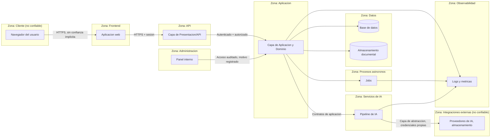
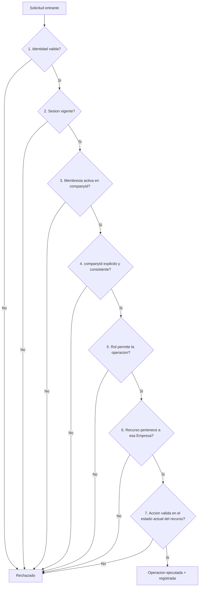
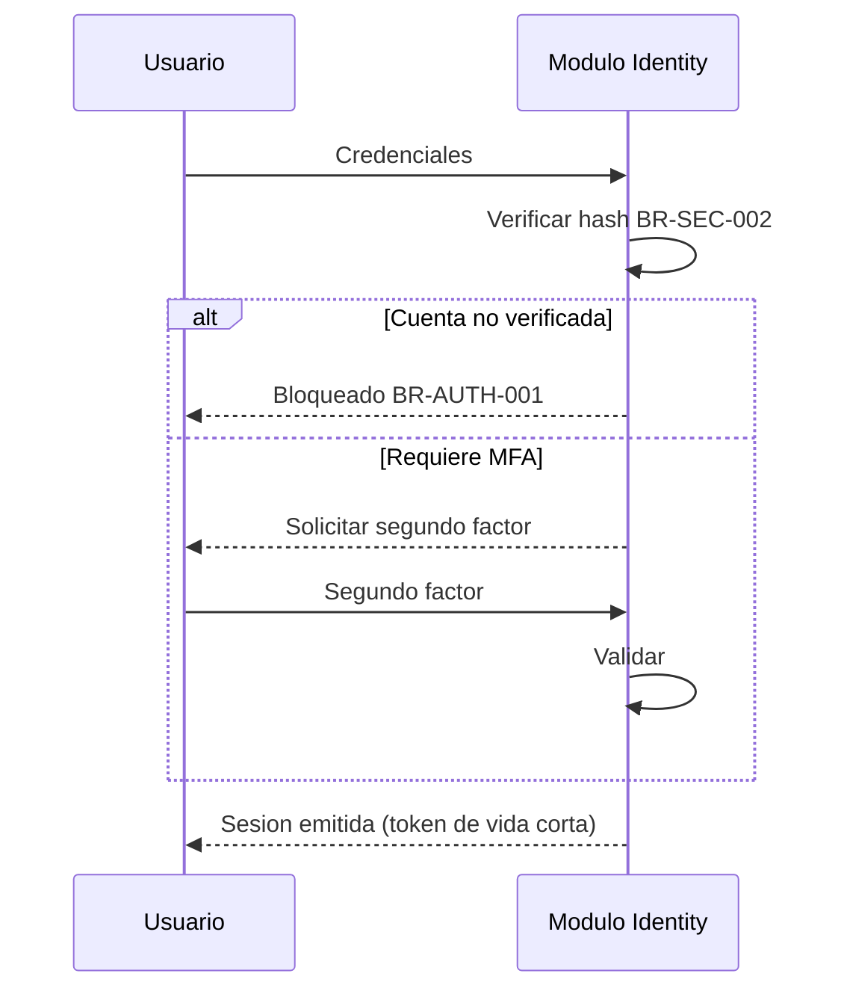
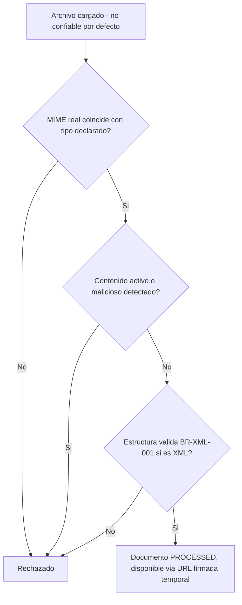
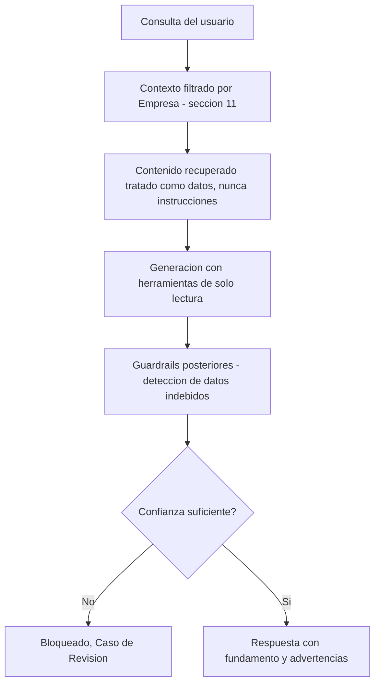
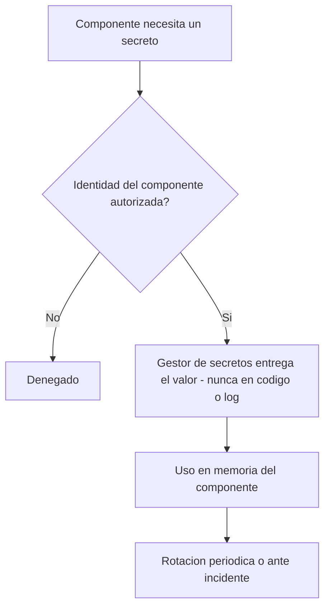
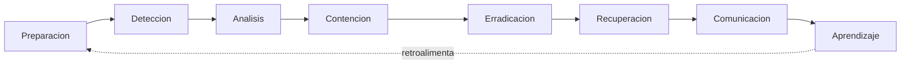
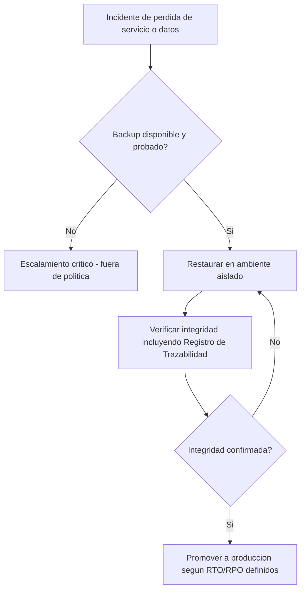

# Arquitectura de Seguridad — ContaIA

## Control del documento

| Campo                                     | Valor                                                                                                                                                                                                                                                                                                                 |
| ----------------------------------------- | --------------------------------------------------------------------------------------------------------------------------------------------------------------------------------------------------------------------------------------------------------------------------------------------------------------------- |
| Documento                                 | 11_SECURITY_ARCHITECTURE.md                                                                                                                                                                                                                                                                                           |
| Orden de trabajo                          | AWO-007                                                                                                                                                                                                                                                                                                               |
| Versión                                   | 1.0                                                                                                                                                                                                                                                                                                                   |
| **Estado**                                | **Draft v1.0**                                                                                                                                                                                                                                                                                                        |
| Fecha de creación                         | 2026-07-18                                                                                                                                                                                                                                                                                                            |
| Última actualización                      | 2026-07-18                                                                                                                                                                                                                                                                                                            |
| Fuentes de verdad                         | `MASTER_CONTEXT.md`, `docs/00_PRODUCT_VISION.md`, `docs/01_PRD.md`, `docs/02_USER_PERSONAS.md`, `docs/04_BUSINESS_RULES.md`, `docs/05_SYSTEM_DOMAIN_MODEL.md`, `docs/06_SYSTEM_WORKFLOWS.md`, `docs/07_SOFTWARE_ARCHITECTURE.md`, `docs/08_API_DESIGN.md`, `docs/09_DATABASE_DESIGN.md`, `docs/10_AI_ARCHITECTURE.md` |
| Documentos que esta arquitectura alimenta | `docs/17_UI_UX_DESIGN.md`, `docs/18_TESTING_STRATEGY.md`, `docs/25_DEVOPS.md`, `docs/27_LEGAL_COMPLIANCE.md`                                                                                                                                                                                                          |

> Nota sobre numeración (histórica, AWO-007): la Work Order pedía `docs/11_SECURITY_ARCHITECTURE.md`, posición que ocupaba UI/UX Design. Ya existía además un placeholder vacío `docs/13_SECURITY.md` del esqueleto original del proyecto — mantener ambos habría duplicado el mismo tema, como ya ocurrió antes con reglas de negocio (corregido en AWO-001). Se reutilizó esa posición: `docs/13_SECURITY.md` se renombró a este archivo y se movió a `docs/11`. UI/UX Design se ha reubicado varias veces desde entonces (incluidas AWO-008 a AWO-011) y hoy vive en `docs/17_UI_UX_DESIGN.md`; ver "Observaciones del Arquitecto" de `docs/15_UX_FLOWS.md` para el detalle más reciente. Todas las referencias cruzadas del proyecto se actualizaron antes de escribir este contenido.

> Este documento diseña arquitectura de seguridad conceptual. No es código, no son configuraciones concretas, no rediseña interfaces, tablas ni endpoints ya definidos en `docs/08_API_DESIGN.md` y `docs/09_DATABASE_DESIGN.md`.

---

## 1. Propósito y alcance

Esta arquitectura protege a ContaIA desde el diseño, no como capa añadida después. Cubre: Usuarios, Empresas, datos contables, información fiscal, CFDI, XML, Documentos, Estados Financieros, secretos, sesiones, integraciones, proveedores, Agentes de IA, conocimiento normativo (`knowledge/`), infraestructura y el Registro de Trazabilidad.

**Activos protegidos:** ver clasificación completa en la sección 3.

**Amenazas principales:** ver modelo de amenazas en la sección 2.

**Responsabilidades:** ver matriz RACI en la sección 38.

**Exclusiones del MVP:** SSO, SCIM, SIEM avanzado, DLP, claves administradas por el cliente, auditorías externas certificadas, multi-región — todas en la fase empresarial (sección 40); MFA universal obligatorio desde el día uno queda como objetivo arquitectónico progresivo, no bloqueante del MVP (ver sección 6, coherente con la Work Order).

**Relación con otros documentos:** esta arquitectura no repite reglas de negocio (`docs/04_BUSINESS_RULES.md`, categorías BR-AUTH, BR-SEC, BR-PERM, BR-ROL), no rediseña contratos de API (`docs/08_API_DESIGN.md`) ni el modelo de datos (`docs/09_DATABASE_DESIGN.md`), y no repite los controles de IA ya definidos en `docs/10_AI_ARCHITECTURE.md` (secciones 15-18) — los extiende y los cierra donde quedaron marcados como pendientes.

## 2. Modelo de amenazas

Referencia STRIDE donde aporta claridad, sin convertir la sección en teoría.

| Amenaza                                | STRIDE                  | Descripción breve                                                | Mitigación (referencia)                                  |
| -------------------------------------- | ----------------------- | ---------------------------------------------------------------- | -------------------------------------------------------- |
| Acceso no autorizado                   | Spoofing / Elevation    | Un actor obtiene acceso sin credenciales válidas                 | Sección 6 (Autenticación)                                |
| Robo de credenciales                   | Spoofing                | Phishing o filtración de contraseñas                             | Sección 6, 15                                            |
| Escalamiento de privilegios            | Elevation of Privilege  | Un Usuario obtiene permisos superiores a su Rol                  | Sección 8, 9                                             |
| Acceso entre empresas                  | Information Disclosure  | Un actor ve datos de una Empresa ajena                           | Sección 11                                               |
| Manipulación de CFDI                   | Tampering               | Un archivo se altera para simular datos falsos                   | Sección 17                                               |
| Carga de archivos maliciosos           | Tampering / DoS         | Documento con contenido dañino                                   | Sección 16                                               |
| Fuga de información                    | Information Disclosure  | Exposición no intencional de datos sensibles                     | Sección 13, 29                                           |
| Abuso de APIs                          | DoS / Elevation         | Uso excesivo o indebido de endpoints                             | Sección 12                                               |
| Fraude interno                         | Repudiation / Tampering | Personal con acceso legítimo actúa indebidamente                 | Sección 10, 37                                           |
| Ransomware                             | Tampering / DoS         | Cifrado malicioso de datos o infraestructura                     | Sección 24, 34                                           |
| Pérdida de datos                       | DoS (disponibilidad)    | Fallo sin respaldo recuperable                                   | Sección 34                                               |
| Suplantación                           | Spoofing                | Un actor se hace pasar por otro Usuario o servicio               | Sección 5, 6                                             |
| Ataques a integraciones                | Tampering / Spoofing    | Compromiso de un proveedor externo                               | Sección 20                                               |
| Prompt injection                       | Tampering               | Instrucciones maliciosas embebidas en contenido procesado por IA | `docs/10_AI_ARCHITECTURE.md` sección 15; aquí sección 18 |
| Exfiltración mediante IA               | Information Disclosure  | La IA revela datos que no debería                                | Sección 18                                               |
| Abuso de herramientas de IA            | Elevation               | Una herramienta de IA se usa fuera de su propósito               | Sección 18, `docs/10_AI_ARCHITECTURE.md` sección 10      |
| Manipulación de conocimiento normativo | Tampering               | Contenido no autorizado se hace pasar por fuente válida          | Sección 19                                               |
| Errores humanos                        | (transversal)           | Configuración o acción incorrecta sin intención maliciosa        | Sección 26, 37                                           |
| Fallos de proveedores                  | DoS                     | Indisponibilidad de un tercero del que depende ContaIA           | Sección 20, 23                                           |

## 3. Clasificación de activos

| Activo                                                              | Nivel                                         | Acceso                                                            | Retención                                            | Cifrado                             | Auditoría                           | Eliminación                                                      |
| ------------------------------------------------------------------- | --------------------------------------------- | ----------------------------------------------------------------- | ---------------------------------------------------- | ----------------------------------- | ----------------------------------- | ---------------------------------------------------------------- |
| Credenciales (hash)                                                 | **Secreto**                                   | Solo el propio sistema de autenticación                           | Mientras la cuenta exista                            | Hash irreversible (BR-SEC-002)      | Sí (cambios)                        | Nunca en texto plano; solo el hash se reemplaza                  |
| RFC                                                                 | **Altamente sensible**                        | Rol con Membresía vigente                                         | Indefinida (parte del CFDI/Empresa)                  | Candidato a cifrado de columna      | Sí                                  | No se elimina físicamente si está en un CFDI o Póliza definitiva |
| Datos fiscales (CFDI, montos)                                       | **Altamente sensible**                        | Rol con Membresía vigente                                         | Indefinida (BR-INT-002)                              | Sí, en reposo                       | Sí                                  | No aplica eliminación física                                     |
| Documentos XML                                                      | **Confidencial**                              | Rol con Membresía vigente                                         | Indefinida                                           | Sí, en almacenamiento de objetos    | Sí (carga, descarga)                | Solo si `PENDING_UPLOAD`/`REJECTED` no confirmado                |
| Estados Financieros                                                 | **Confidencial**                              | Rol con Membresía vigente (según nivel)                           | Indefinida                                           | Sí                                  | Sí (generación, consulta relevante) | No aplica                                                        |
| Información bancaria futura                                         | **Altamente sensible**                        | Fuera del MVP; reservado                                          | N/A                                                  | N/A                                 | N/A                                 | N/A — no existe todavía (`docs/01_PRD.md`, sección 19)           |
| Datos personales (correo, nombre)                                   | **Confidencial**                              | El propio Usuario, Administrador de su Empresa                    | Mientras la cuenta exista                            | Candidato a cifrado de columna      | Sí                                  | Ver sección 36                                                   |
| Secretos de integración (claves de proveedor de IA, almacenamiento) | **Secreto**                                   | Solo la capa de Infraestructura, nunca código versionado          | Hasta rotación                                       | Sí, en gestor de secretos           | Sí (acceso, rotación)               | Al rotar/revocar                                                 |
| Prompts internos (de sistema)                                       | **Confidencial**                              | Solo el pipeline de IA; nunca expuestos al usuario                | Versionado indefinidamente                           | No aplica (no son datos de cliente) | Sí (cambios de versión)             | No se eliminan, se versionan                                     |
| Registros de auditoría (Trazabilidad)                               | **Altamente sensible**                        | Auditor, Supervisor, Administrador de plataforma con motivo       | Indefinida (BR-TRZ-002)                              | Sí                                  | Es la propia auditoría              | Nunca (append-only)                                              |
| Copias de seguridad                                                 | **Secreto**                                   | Solo personal autorizado de operaciones                           | Según política (sección 34, pendiente de validación) | Sí                                  | Sí (acceso, restauración)           | Según política de retención                                      |
| Claves criptográficas                                               | **Secreto**                                   | Gestor de claves, nunca personas directamente                     | Según rotación (sección 14)                          | Es la propia protección             | Sí (uso, rotación)                  | Revocación controlada, nunca borrado accidental                  |
| Contenido de `knowledge/` (FuenteConocimiento)                      | **Interno / Público** (según fuente original) | Lectura por todos los Agentes; escritura solo equipo de contenido | Indefinida, versionada                               | No aplica (no sensible)             | Sí (altas, cambios)                 | No se elimina, se marca derogada                                 |

## 4. Arquitectura de confianza

**Límites de confianza:** el Cliente y las Integraciones externas nunca son confiables por defecto (principio 20 — "el sistema debe asumir que archivos, prompts, integraciones y entradas pueden ser maliciosos"). Cada flecha que cruza una zona implica **autenticación, autorización y registro** — nunca un paso silencioso. La zona de Datos nunca es alcanzable directamente desde el Cliente, el Frontend, ni los Agentes de IA (`docs/09_DATABASE_DESIGN.md`, sección 11: "ningún módulo accede a los datos de otro directamente"; aquí se extiende: ningún actor externo a la capa de Aplicación llega a Datos).

## 5. Identidad

| Tipo de identidad                               | Identidad única                                                                                                       | Estado de cuenta                                  | Notas                                                                                        |
| ----------------------------------------------- | --------------------------------------------------------------------------------------------------------------------- | ------------------------------------------------- | -------------------------------------------------------------------------------------------- |
| Usuario                                         | Correo electrónico único (BR-USR-002)                                                                                 | No verificada → verificada → activa → desactivada | Nunca cuentas compartidas — ni siquiera entre colaboradores del mismo despacho               |
| Administrador / Propietario                     | Es un Usuario con Membresía Administrador (`isOwner` opcional)                                                        | Igual que Usuario                                 | Ver aclaración de la sección 8                                                               |
| Personal interno de ContaIA                     | Identidad de plataforma, separada de cualquier Empresa cliente                                                        | Activa / suspendida / revocada                    | Nunca hereda Membresía de una Empresa cliente por defecto (BR-USR-002)                       |
| Servicios / procesos internos (Jobs)            | Identidad técnica propia, no una cuenta de Usuario                                                                    | Activa mientras el servicio exista                | Sin contraseña; credenciales gestionadas como secretos (sección 15)                          |
| Integraciones (proveedor de IA, almacenamiento) | Credencial de servicio por integración                                                                                | Activa / rotada / revocada                        | Nunca comparte credencial con otra integración                                               |
| Agentes de IA                                   | No son una identidad de acceso independiente — operan bajo el contexto y permisos del Usuario que originó la consulta | N/A                                               | Un Agente nunca tiene una sesión propia con más privilegio que su solicitante (principio 16) |

**Ciclo de vida común:** verificación (BR-AUTH-001) → activación → uso → suspensión (por sospecha o inactividad prolongada) → bloqueo (por abuso confirmado) → recuperación (sección 6) → eliminación (solo si no hay historial que preservar; en la práctica, casi siempre desactivación, no eliminación — BR-USR-003).

## 6. Autenticación

Basado en BR-AUTH-001 a 004 (`docs/04_BUSINESS_RULES.md`) y la sección 6 de `docs/08_API_DESIGN.md`, con el siguiente detalle de seguridad adicional:

- **Contraseñas:** almacenamiento solo como hash con función diseñada para credenciales (nunca hash genérico de propósito general); nunca en texto plano ni siquiera temporalmente en logs (BR-SEC-002).
- **MFA:** **obligatorio** para Administrador, Propietario, personal interno, y cualquier operación crítica (aprobar Póliza, cerrar Ejercicio, cambiar Rol); para el resto de Roles del MVP, la arquitectura debe soportarlo desde el diseño, con activación progresiva — coherente con la instrucción explícita de esta Work Order.
- **Recuperación de contraseña:** token de un solo uso, de vida corta, invalidado tras su primer uso o al expirar.
- **Verificación de correo:** obligatoria antes de cualquier acceso a datos reales (BR-AUTH-001).
- **Intentos fallidos y bloqueo progresivo:** cada intento fallido incrementa un contador; el bloqueo se aplica de forma creciente (no binaria) para frenar automatización sin penalizar un solo error humano (extiende BR-AUTH-003).
- **Prevención de enumeración de cuentas:** las respuestas de login, registro y recuperación de contraseña son indistinguibles entre "usuario no existe" y "credencial incorrecta".
- **Revocación:** un Usuario o un Administrador puede revocar sesiones activas; el personal de plataforma puede revocar por incidente de seguridad.
- **Autenticación de servicios e integraciones:** credenciales de servicio propias, nunca reutilización de una cuenta de Usuario para autenticar un proceso técnico.

## 7. Gestión de sesiones

- **Tokens:** de vida corta, renovables (BR-AUTH-004); nunca incluidos en URLs (evita quedar en logs de acceso o historial del navegador).
- **Duración y renovación:** ventana de inactividad pendiente de validación (heredado de `docs/04_BUSINESS_RULES.md`, BR-AUTH-004); la renovación no repite todo el flujo de credenciales completas.
- **Revocación y cierre global:** un Usuario puede cerrar todas sus sesiones activas desde cualquier dispositivo (relevante ante sospecha de robo de sesión).
- **Dispositivos y sesiones concurrentes:** permitidas por diseño (un Contador puede trabajar desde varios dispositivos), pero visibles y revocables individualmente.
- **Protección contra robo de sesión:** tokens vinculados a características de la sesión (por ejemplo, rotación al cambiar de contexto sensible); ningún token sensible se expone en logs, URLs ni almacenamiento inseguro del cliente (instrucción explícita de la Work Order).
- **CSRF:** mitigado mediante token anti-falsificación en operaciones de mutación desde el Frontend.
- **XSS:** mitigado por saneamiento de entrada/salida en el Frontend y por no ejecutar contenido no confiable (documentos, respuestas de IA) como si fuera código de interfaz.
- **Cookies seguras:** si se usan, marcadas `HttpOnly`, `Secure` y con política de sitio estricta.
- **Detección de comportamiento anómalo:** cambios bruscos de ubicación/dispositivo o patrones de acceso inusuales alimentan el monitoreo (sección 30), no bloquean automáticamente sin criterio (para evitar bloquear trabajo legítimo).

## 8. Autorización

**Modelo:** RBAC para el MVP (BR-PERM, BR-ROL de `docs/04_BUSINESS_RULES.md`; sección 7 de `docs/08_API_DESIGN.md`), con capacidad de evolucionar a políticas más granulares (por ejemplo, basadas en atributos) en fases posteriores, sin romper el modelo actual.

**Roles oficiales:** Administrador, Contador, Auxiliar, Supervisor, Auditor, Estudiante.

**Aclaraciones obligatorias (ya decididas el 2026-07-18, `docs/01_PRD.md` sección 11):**

- **Empresa no es un Rol** — es la entidad de dominio sobre la que se aplican los Roles.
- **Propietario no es un Rol distinto** — es un Administrador con el atributo `isOwner`, sin permisos técnicos adicionales (BR-PERM-003).
- Un mismo Usuario puede tener Roles diferentes en Empresas diferentes (BR-EMP-004).

**Permisos y alcance:** todo permiso se evalúa como (Usuario, Empresa, Rol) — nunca de forma global. **Validación en servidor:** obligatoria en cada operación, sin excepción; la interfaz puede ocultar opciones, pero eso nunca sustituye la validación real (instrucción explícita de la Work Order, sección 21). **Herencia:** no existe herencia implícita de permisos entre Empresas ni entre Organizaciones — cada Membresía es independiente. **Separación de funciones:** ver sección 10. **Acciones críticas:** requieren el Rol específico habilitado para ellas (por ejemplo, solo Contador/Supervisor aprueban Pólizas — BR-ROL-001). **Permisos temporales:** el acceso de soporte interno (sección 37) y el acceso de un Auditor externo son ejemplos de permisos con alcance y duración explícitos, no permanentes por defecto. **Revocación:** inmediata al desactivar una Membresía (BR-USR-003), sin periodo de gracia que mantenga acceso.

## 9. Matriz de permisos

`L` = Lectura · `C` = Creación · `M` = Modificación · `A` = Aprobación · `E` = Eliminación · `X` = Exportación · `Adm` = Administración

| Recurso                           | Administrador | Contador   | Auxiliar | Supervisor | Auditor | Estudiante    |
| --------------------------------- | ------------- | ---------- | -------- | ---------- | ------- | ------------- |
| Empresa (datos generales)         | L, M, Adm     | L          | L        | L          | L       | — (sandbox)   |
| Usuarios / Membresías             | L, C, M, E    | L          | —        | L          | L       | —             |
| CFDI                              | L             | L, C*      | L, C*    | L          | L       | — (simulado)  |
| Documentos                        | L             | L, C       | L, C     | L          | L       | — (simulado)  |
| Catálogo de Cuentas               | L             | L, C, M, E | L        | L          | L       | — (simulado)  |
| Pólizas                           | L             | L, C, A    | L, C**   | L, A       | L       | — (simulado)  |
| Estados Financieros               | L, X          | L, X       | L        | L, X       | L, X    | — (simulado)  |
| Sugerencias de IA                 | L             | L, C       | L, C     | L, A       | L       | L (educativo) |
| Auditoría (Trazabilidad)          | L             | —          | —        | L          | L       | —             |
| Configuración                     | L, M, Adm     | —          | —        | —          | —       | —             |
| Facturación futura (fuera de MVP) | —             | —          | —        | —          | —       | —             |

`*` Creación de CFDI = carga del Documento origen, no timbrado. `**` Auxiliar solo crea/edita Pólizas en estado `DRAFT`, nunca aprueba (BR-ROL-001).

**Ningún Rol puede aumentarse privilegios a sí mismo** (BR-PERM-002): solo un Administrador modifica Membresías de otros, y nunca la propia hacia un Rol superior sin intervención de otro Administrador.

## 10. Separación de funciones

| Operación                            | Por qué no depende de una sola persona                                                                                                                                      |
| ------------------------------------ | --------------------------------------------------------------------------------------------------------------------------------------------------------------------------- |
| Creación y aprobación de Pólizas     | Quien captura (Auxiliar/Contador) nunca es, por diseño de Rol, la única barrera antes de volverse definitiva — requiere aprobación de Contador/Supervisor (BR-POL-003).     |
| Generación y autorización de ajustes | Una Póliza de ajuste sigue el mismo flujo de aprobación que cualquier Póliza (BR-POL-004) — no se autoaplica por quien la generó.                                           |
| Cambios de permisos                  | Solo un Administrador distinto del afectado puede modificar su propio Rol (sección 9).                                                                                      |
| Cierre de Ejercicio                  | Reservado a Administrador (por analogía con BR-CFG-001, `docs/06_SYSTEM_WORKFLOWS.md` workflow 14); requiere confirmación explícita tras advertencia de Pólizas pendientes. |
| Eliminación de Documentos            | No existe eliminación física de Documentos procesados (BR-INT-002); solo Documentos `PENDING_UPLOAD`/`REJECTED` no confirmados pueden descartarse, y queda trazado.         |
| Exportación masiva                   | Requiere Rol con permiso de exportación explícito (sección 9); se registra como evento auditable.                                                                           |
| Cambios críticos de configuración    | Motivo obligatorio + registro (BR-CFG-002).                                                                                                                                 |
| Aprobación de sugerencias de IA      | El Agente que genera la sugerencia nunca es quien la aprueba — la aprobación siempre es humana (principio fundamental, `docs/04_BUSINESS_RULES.md` sección 2).              |

**Cuándo se requiere doble control:** toda transición hacia un estado `DEFINITIVE`/cerrado/aprobado. **Motivo y evidencia:** obligatorios en todo rechazo (BR-TRZ-003) y en todo acceso de soporte interno (BR-SEC-004). **Registro de auditoría:** automático en todos los casos anteriores, vía el mismo Registro de Trazabilidad (sección 29).

## 11. Aislamiento multiempresa

Toda operación empresarial valida, en este orden:

1. **Identidad** — ¿el token/sesión corresponde a un Usuario válido?
2. **Sesión** — ¿la sesión sigue vigente (sección 7)?
3. **Membresía** — ¿el Usuario tiene una Membresía activa en la Empresa objetivo?
4. **Empresa activa** — ¿el `companyId` de la solicitud es explícito y coincide con esa Membresía (`docs/08_API_DESIGN.md`, sección 5 — nunca "empresa activa" implícita)?
5. **Permiso** — ¿el Rol de esa Membresía permite la operación solicitada (sección 9)?
6. **Recurso** — ¿el recurso solicitado (Documento, Póliza, etc.) pertenece realmente a esa Empresa (BR-INT-003)?
7. **Acción** — ¿la acción específica está permitida sobre ese recurso en su estado actual (por ejemplo, no editar una Póliza definitiva)?

Este control aplica sin excepción a: **consultas** (`GET`), **caché** (nunca se cachea una respuesta sin la clave de Empresa como parte de su identidad de caché), **Jobs** (todo Job asíncrono lleva `companyId` y se revalida al completarse, no solo al encolarse), **archivos** (Documents es el único módulo con acceso al almacenamiento, sección 16), **búsquedas** (incluida la recuperación RAG, sección 19), **IA** (contexto filtrado antes de la inferencia, `docs/10_AI_ARCHITECTURE.md` sección 15), **logs** (un registro de Trazabilidad nunca se muestra a un Usuario sin Membresía en esa Empresa), **exportaciones** (mismo control de permisos que la lectura) y **backups** (un backup nunca se restaura parcialmente hacia el contexto de una Empresa equivocada).

## 12. Seguridad de API

Extiende `docs/08_API_DESIGN.md` sin repetirlo:

- **HTTPS obligatorio**, sin excepción (ya establecido, sección 3 de `docs/08_API_DESIGN.md`).
- **Validación de entrada:** todo campo se valida contra su tipo y formato antes de procesarse; ningún dato del cliente se usa sin validar, incluidos los que "parecen" internos (principio 9).
- **Autenticación y autorización:** separadas (decisión ya tomada), reforzadas por el flujo de la sección 11 de este documento.
- **Rate limiting, idempotencia y control de concurrencia:** ya diseñados conceptualmente en `docs/08_API_DESIGN.md` (secciones 13, 19); esta arquitectura los trata como controles de seguridad, no solo de rendimiento — el rate limiting es también una defensa contra fuerza bruta y abuso de IA (sección 22 de `docs/10_AI_ARCHITECTURE.md`).
- **CORS:** restringido a los orígenes autorizados del Frontend oficial; sin comodines abiertos.
- **CSRF:** ver sección 7.
- **Encabezados de seguridad:** respuestas incluyen cabeceras que reducen superficie de ataque en el navegador (por ejemplo, prevención de sniffing de tipo de contenido, políticas de referrer restrictivas) — mecanismo concreto pendiente de implementación técnica.
- **Errores:** nunca exponen detalle técnico interno ni estructura de la base de datos (BR-ERR-002, BR-SEC-003, ya establecido).
- **Protección de endpoints administrativos** (`/admin/*`, `docs/08_API_DESIGN.md` sección 9.13): requieren Rol de plataforma y quedan fuera del alcance de cualquier Rol de Empresa, sin excepción.

## 13. Seguridad de datos

| Estado del dato                      | Protección                                                                                                                                                     |
| ------------------------------------ | -------------------------------------------------------------------------------------------------------------------------------------------------------------- |
| En tránsito                          | Cifrado extremo a extremo (HTTPS/TLS), sin excepción, incluidas llamadas internas entre capas cuando cruzan red.                                               |
| En reposo (base de datos)            | Cifrado a nivel de almacenamiento; columnas de la sección 3 clasificadas "Secreto"/"Altamente sensible" son candidatas a cifrado adicional a nivel de columna. |
| Backups                              | Mismo nivel de cifrado que los datos de origen; nunca un backup queda menos protegido que el sistema vivo.                                                     |
| Archivos (almacenamiento documental) | Cifrado en el almacenamiento de objetos; acceso solo vía URLs firmadas y temporales (`docs/08_API_DESIGN.md`, sección 14).                                     |
| Caché                                | Nunca almacena datos de Empresa sin la clave de aislamiento (sección 11); nunca almacena secretos.                                                             |
| Colas (Jobs)                         | Payload mínimo necesario, sin secretos ni datos más allá de lo que el procesamiento requiere.                                                                  |
| Índices de búsqueda / vectores (RAG) | Ver sección 19 — nunca mezclan contenido normativo con datos de una Empresa específica.                                                                        |
| Logs técnicos                        | Enmascarado de datos sensibles antes de escribirse (sección 29).                                                                                               |
| Exportaciones                        | Mismo control de acceso que la fuente original; nunca un formato de exportación evade el aislamiento multiempresa.                                             |

**Minimización, enmascaramiento, tokenización:** cada capa recibe solo el dato mínimo necesario para su función (ya aplicado en IA, `docs/10_AI_ARCHITECTURE.md` sección 16); el RFC y otros identificadores sensibles son candidatos a tokenización en superficies de baja necesidad (por ejemplo, listados) mostrando el valor completo solo en el detalle autorizado.

## 14. Gestión criptográfica

- **Cifrado en tránsito:** protocolo TLS vigente, sin versiones obsoletas — el mecanismo exacto es una decisión de implementación, no de este documento.
- **Cifrado en reposo:** a nivel de almacenamiento y, para columnas sensibles (sección 3), a nivel de campo.
- **Claves:** gestionadas por un servicio de gestión de claves separado de la aplicación; ninguna clave vive en código ni en configuración versionada.
- **Rotación:** periódica y ante sospecha de compromiso; la ventana exacta es `Estado: Propuesta pendiente de validación`.
- **Separación:** las claves de cifrado de datos nunca son las mismas que las credenciales de acceso a servicios (separación de propósito).
- **Almacenamiento y acceso:** solo la capa de Infraestructura interactúa con el gestor de claves; ninguna persona accede a una clave en texto plano como parte de su flujo normal de trabajo.
- **Revocación y recuperación:** una clave comprometida se revoca y se re-cifra el material afectado según el procedimiento de respuesta a incidentes (sección 33).
- **Auditoría:** todo uso y rotación de clave se registra.

No se diseña criptografía propia (instrucción explícita); se usan mecanismos estándar de la industria, sin nombrar un algoritmo o proveedor específico aquí.

## 15. Gestión de secretos

Protege: credenciales de Usuario (hash, no secreto de infraestructura), claves de API de proveedores de IA, certificados, tokens de integración, credenciales de base de datos, claves de cifrado, secretos de firma.

- **Almacenamiento centralizado:** un gestor de secretos dedicado, nunca variables sueltas en archivos de configuración versionados.
- **Acceso por identidad:** cada componente técnico (no persona) accede solo a los secretos que su función requiere (mínimo privilegio, principio 3).
- **Rotación y revocación:** periódica y ante incidente; un secreto revocado deja de funcionar de inmediato en todos los componentes que lo usaban.
- **Separación por ambiente:** un secreto de desarrollo nunca es válido en producción y viceversa (ver sección 25).
- **Prevención de exposición en código:** ningún secreto se comitea al repositorio; se valida en la cadena de CI/CD (sección 28).
- **Prevención de exposición en logs:** los secretos se excluyen explícitamente de cualquier registro (sección 29).
- **Respuesta a filtraciones:** procedimiento de rotación de emergencia como parte del plan de incidentes (sección 33).

## 16. Seguridad documental

Todo archivo cargado (XML, PDF, hojas de cálculo, imágenes, comprimidos) **se considera no confiable por defecto** (principio 20).

| Control                             | Descripción                                                                                                                                                                         |
| ----------------------------------- | ----------------------------------------------------------------------------------------------------------------------------------------------------------------------------------- |
| Validación de formato               | El tipo declarado se verifica contra el contenido real, no solo la extensión (BR-DOC-003).                                                                                          |
| MIME real                           | Se detecta el tipo real del archivo, independientemente del nombre o extensión declarados por el cliente.                                                                           |
| Tamaño                              | Límite máximo por archivo, `Estado: Propuesta pendiente de validación` (sin cifra fija aquí).                                                                                       |
| Extensión y nombre                  | Normalizados; nunca se usa el nombre original del cliente como ruta de almacenamiento directa (previene path traversal).                                                            |
| Malware / contenido activo / macros | Todo archivo pasa por un análisis antes de considerarse `PROCESSED`; un archivo con contenido activo sospechoso se marca `REJECTED`, nunca se ejecuta ni se interpreta como código. |
| Archivos cifrados o comprimidos     | Se tratan con especial cautela — el contenido interno también debe validarse antes de confiar en él; no se descomprime de forma no acotada (previene "zip bombs").                  |
| Rutas de almacenamiento             | Generadas por el sistema (UUID), nunca derivadas del nombre proporcionado por el Usuario.                                                                                           |
| Descarga                            | Solo vía URL firmada y temporal (`docs/08_API_DESIGN.md`, sección 14), nunca una ruta pública permanente.                                                                           |
| Eliminación                         | Ver sección 36; un archivo procesado y vinculado a evidencia no se elimina físicamente.                                                                                             |

## 17. Seguridad específica de CFDI

**Un CFDI nunca se declara válido solo porque el XML puede leerse** (instrucción explícita de la Work Order, coherente con BR-CFDI-001).

| Tipo de validación | Qué cubre                                                                                                                     | Qué NO cubre                                                                                                                        |
| ------------------ | ----------------------------------------------------------------------------------------------------------------------------- | ----------------------------------------------------------------------------------------------------------------------------------- |
| **Estructural**    | El XML tiene la forma esperada y es parseable (BR-XML-001)                                                                    | No confirma que el sello o el certificado sean auténticos                                                                           |
| **Criptográfica**  | Verificación del sello digital y el certificado del emisor, si se implementa                                                  | Requiere validar contra la cadena de certificación del SAT — **no incluida en el MVP** (ContaIA no valida ante el SAT, BR-CFDI-001) |
| **Fiscal**         | Confirmar ante el SAT que el folio existe, no ha sido cancelado y corresponde al RFC declarado                                | **Fuera del MVP por completo** — requeriría integración con el SAT/PAC (Etapa 4)                                                    |
| **De negocio**     | El CFDI es coherente con el contexto de la Empresa (RFC receptor esperado, periodo razonable, sin duplicidad de Folio Fiscal) | No sustituye la validación fiscal — es una señal de consistencia interna, no de autenticidad oficial                                |

En el MVP, ContaIA realiza **validación estructural** completa y **validación de negocio** (deduplicación por Folio Fiscal, BR-CFDI-001/`docs/09_DATABASE_DESIGN.md` unicidad compuesta). La validación criptográfica y la validación fiscal quedan explícitamente fuera de alcance y así se comunica al Usuario en cada CFDI mostrado (BR-CFDI-001: nunca se afirma "validado por el SAT").

**Controles adicionales:** UUID (Folio Fiscal) como clave de unicidad por Empresa; RFC emisor/receptor validados solo en formato; integridad verificada contra manipulación evidente de la estructura (pero no contra un sello falsificado con sofisticación, dado que eso requeriría validación criptográfica no incluida); evidencia siempre trazable al Documento origen; procesamiento siempre asíncrono y aislado por Empresa (sección 11).

## 18. Seguridad de inteligencia artificial

Alineado con `docs/10_AI_ARCHITECTURE.md` (secciones 15-18), sin repetirlo — aquí se consolidan los controles desde la perspectiva de seguridad:

| Amenaza                                  | Control                                                                                                                                                                                               |
| ---------------------------------------- | ----------------------------------------------------------------------------------------------------------------------------------------------------------------------------------------------------- |
| Prompt injection                         | Contenido recuperado (documentos, CFDI, `knowledge/`) tratado siempre como datos, nunca como instrucciones (`docs/10_AI_ARCHITECTURE.md` sección 15).                                                 |
| Jailbreak                                | Instrucciones del Usuario nunca anulan el prompt de sistema ni las políticas de seguridad (principio 8 y 16 de esta Work Order).                                                                      |
| Extracción de información / exfiltración | Contexto filtrado por Empresa antes de la inferencia (sección 11 de este documento); guardrail posterior verifica ausencia de datos indebidos en la salida (`docs/10_AI_ARCHITECTURE.md` sección 17). |
| Acceso entre empresas vía IA             | Mismo control de la sección 11 — sin ruta alterna para el chat.                                                                                                                                       |
| Documentos adversariales                 | Tratados igual que cualquier archivo no confiable (sección 16); nunca se interpretan como fuente normativa (`docs/10_AI_ARCHITECTURE.md` sección 8, nivel 7).                                         |
| Herramientas inseguras                   | Todas las herramientas de IA son de solo lectura o generación de propuesta (`docs/10_AI_ARCHITECTURE.md` sección 10; `docs/09_DATABASE_DESIGN.md` sección 11 — ausencia estructural de escritura).    |
| Respuestas sin fundamento                | Bloqueadas o declaradas explícitamente (BR-GLB-003, `docs/10_AI_ARCHITECTURE.md` sección 6).                                                                                                          |
| Uso indebido de memoria                  | Ningún dato de una Empresa persiste como "memoria libre" reutilizable en otra conversación o Empresa (`docs/10_AI_ARCHITECTURE.md` sección 14).                                                       |
| Exposición de prompts internos           | Nunca se revelan al usuario, incluso si los solicita explícitamente (`docs/10_AI_ARCHITECTURE.md` sección 18).                                                                                        |
| Manipulación de fuentes                  | Solo el equipo interno agrega `FuenteConocimiento` (BR-VER-001); ver también sección 19.                                                                                                              |
| Abuso de modelos                         | Rate limiting y cuotas (sección 12; umbrales pendientes de validación).                                                                                                                               |

**La IA opera con:** permisos mínimos (nunca más que su Usuario solicitante), herramientas autorizadas únicamente (sección 10 de `docs/10_AI_ARCHITECTURE.md`), contexto aislado por Empresa, validación previa y posterior (guardrails), auditoría de cada interacción, y aprobación humana obligatoria antes de cualquier efecto contable (principio fundamental).

## 19. Seguridad de RAG

- **Fuentes permitidas:** solo `FuenteConocimiento` validada por el equipo interno (jerarquía de `docs/10_AI_ARCHITECTURE.md`, sección 8); nunca contenido cargado por un Usuario final.
- **Validación e ingestión:** manual, nunca automática desde la web (evita envenenamiento de fuentes no verificadas).
- **Metadatos y procedencia:** obligatorios (BR-VER-001) — sin ellos, un fragmento no es citable.
- **Vigencia:** filtrada antes de la recuperación (sección 7 de `docs/10_AI_ARCHITECTURE.md`); un fragmento vencido nunca se usa como fundamento nuevo.
- **Aislamiento:** los vectores de conocimiento normativo son globales (no pertenecen a una Empresa), pero **nunca se mezclan con embeddings derivados de datos de una Empresa específica** — son espacios de recuperación separados, para que una búsqueda documental jamás devuelva, por error de indexación, un fragmento de un CFDI de otra Empresa.
- **Control de acceso:** lectura para todos los Agentes activos; escritura solo para el proceso de ingestión del equipo de contenido.
- **Eliminación y manipulación:** una fuente no se elimina, se marca derogada (histórico, sección 8 de `docs/09_DATABASE_DESIGN.md`); ningún Usuario puede modificar el contenido indexado.
- **Actualización:** nueva versión = nuevo registro con nueva vigencia, nunca sobrescritura silenciosa (BR-VER-001).
- **Citación:** todo fragmento recuperado y usado se cita con su FuenteFundamento; el contenido recuperado **se trata siempre como información, nunca como instrucciones confiables** (mismo principio de la sección 18, reiterado aquí por ser el punto de entrada de datos externos al modelo).

## 20. Seguridad de integraciones

| Integración                          | Estado en el MVP                                                                                                                             | Controles                                                                                                                                                                                                                                                                |
| ------------------------------------ | -------------------------------------------------------------------------------------------------------------------------------------------- | ------------------------------------------------------------------------------------------------------------------------------------------------------------------------------------------------------------------------------------------------------------------------ |
| PAC                                  | No implementada (BR-CFDI-001)                                                                                                                | Interfaz reservada, sin credenciales activas todavía                                                                                                                                                                                                                     |
| SAT                                  | No implementada; **el SAT nunca se presenta como una API pública general disponible para ContaIA** (límite explícito de `MASTER_CONTEXT.md`) | N/A                                                                                                                                                                                                                                                                      |
| Correo                               | Fuera del MVP (`docs/04_BUSINESS_RULES.md`, sección 4.13)                                                                                    | N/A                                                                                                                                                                                                                                                                      |
| Almacenamiento de objetos            | Activa                                                                                                                                       | Credenciales de servicio propias, acceso vía URLs firmadas (sección 16), cifrado en reposo                                                                                                                                                                               |
| Proveedores de IA                    | Activa, detrás de capa de abstracción (AD-05)                                                                                                | Autenticación por credencial de servicio, timeouts y circuit breaker (`docs/07_SOFTWARE_ARCHITECTURE.md` sección 19), validación de respuesta antes de usarla, sin entrenamiento de modelos generales con datos de clientes (sección 16 de `docs/10_AI_ARCHITECTURE.md`) |
| Servicios futuros (bancos, PAC real) | Fuera del MVP                                                                                                                                | Se diseñarán con este mismo estándar cuando se aprueben                                                                                                                                                                                                                  |

**Estándar aplicable a toda integración activa o futura:** autenticación por credencial de servicio (nunca compartida), autorización de alcance mínimo, certificados vigentes, secretos gestionados (sección 15), timeouts y reintentos acotados, circuit breaker ante degradación, validación de toda respuesta externa antes de confiar en ella (nunca se asume que un tercero responde correctamente), registro de toda interacción, y contrato/términos de procesamiento de datos revisados antes de activar el proveedor (sección 32 de `docs/10_AI_ARCHITECTURE.md`).

## 21. Seguridad del frontend

- **XSS, CSRF, clickjacking:** mitigados por saneamiento de salida, tokens anti-falsificación (sección 7) y cabeceras que impiden incrustar la aplicación en un marco ajeno.
- **Contenido inseguro:** ningún contenido generado por Usuario o por IA se renderiza como código ejecutable.
- **Almacenamiento local y tokens:** ningún secreto ni token de sesión sensible se guarda en almacenamiento local no protegido del navegador de forma que sea accesible por script de terceros.
- **Formularios y carga de archivos:** validación en cliente como ayuda de experiencia, nunca como control de seguridad real (el servidor siempre revalida, sección 16).
- **Permisos visuales:** ocultar un botón u opción en pantalla **nunca reemplaza la autorización en servidor** (instrucción explícita, coherente con la sección 8).
- **Caché y datos sensibles:** el navegador no cachea agresivamente respuestas con datos de Empresa.
- **Mensajes de error:** en lenguaje claro (BR-ERR-001), sin detalle técnico expuesto.
- **Dependencias del frontend:** sujetas al mismo control de cadena de suministro que el backend (sección 27).

## 22. Seguridad del backend

- **Validación y autorización:** en cada capa de Aplicación, no solo en el punto de entrada (defensa en profundidad, principio 5).
- **Inyección:** toda consulta a datos usa parámetros, nunca concatenación de entrada de usuario.
- **Serialización:** solo formatos seguros y esquemas validados; nunca deserialización de datos no confiables sin control de tipo.
- **Acceso a archivos:** exclusivamente a través del módulo Documents (`docs/07_SOFTWARE_ARCHITECTURE.md`, sección 14).
- **Consultas y comandos del sistema operativo:** ninguna entrada de Usuario llega a un comando de sistema sin validación estricta; preferible evitarlo por completo.
- **Dependencias:** ver sección 27.
- **Errores:** ver sección 12.
- **Trabajos asíncronos, eventos y colas:** cada Job valida de nuevo el contexto de Empresa al completarse, no solo al encolarse (sección 11).
- **Transacciones:** operaciones críticas (aprobar Póliza, cerrar Ejercicio) son atómicas — no dejan estados intermedios inconsistentes ante un fallo parcial (BR-ERR-003).
- **Tiempo de ejecución:** límites de tiempo por operación para evitar que una solicitud costosa degrade el servicio para otras Empresas.

## 23. Seguridad de base de datos

Alineado con `docs/09_DATABASE_DESIGN.md`:

- **Acceso mínimo:** la aplicación se conecta con una cuenta de base de datos con privilegios mínimos necesarios, nunca con una cuenta administrativa de uso general.
- **Cuentas separadas:** por función (aplicación, migraciones, solo lectura para reportes/observabilidad) y por ambiente (sección 25).
- **Conexiones:** cifradas en tránsito (sección 13); nunca expuestas directamente a la red pública.
- **Cifrado en reposo:** ver sección 13, 14.
- **Aislamiento:** el filtro por `companyId` (sección 11) es la primera línea; la base de datos no es el único punto de aplicación de esta regla, pero debe sostenerla estructuralmente (índices y restricciones de `docs/09_DATABASE_DESIGN.md`).
- **Auditoría:** el Registro de Trazabilidad vive en la misma base, con protección de escritura reforzada (append-only, sección 29).
- **Backups y restauración:** ver sección 34.
- **Consultas administrativas:** cualquier consulta directa de un ingeniero de plataforma sobre datos de producción requiere el mismo estándar de acceso justo a tiempo que el soporte (sección 37) — **nunca acceso directo sin motivo registrado**.
- **Datos sensibles:** clasificación de la sección 3 aplicada a nivel de columna donde sea posible.
- **Borrado:** nunca físico sobre datos definitivos (BR-INT-002); ver sección 36.
- **Entornos:** cada ambiente tiene su propia base de datos, nunca compartida (sección 25).

**Ningún Usuario final ni Agente de IA tiene acceso directo a la base de datos** — instrucción explícita, ya reforzada estructuralmente por `docs/09_DATABASE_DESIGN.md` (sección 2: "la IA nunca escribe directamente") y `docs/07_SOFTWARE_ARCHITECTURE.md` (comunicación solo por contratos).

## 24. Seguridad de infraestructura

Conceptual, sin proveedor cloud obligatorio (instrucción explícita):

- **Redes y segmentación:** la zona de Datos (sección 4) no es alcanzable directamente desde la zona de Cliente ni desde Integraciones externas.
- **Firewalls / entrada-salida:** tráfico de entrada restringido a los puntos de entrada oficiales (API); tráfico de salida restringido a los destinos necesarios (proveedores de IA, almacenamiento) — nunca salida abierta sin control.
- **Servicios y ambientes:** cada módulo del monolito (`docs/07_SOFTWARE_ARCHITECTURE.md`, sección 6) corre en el mismo perímetro de red controlado; los procesos asíncronos (Jobs) están en la misma zona de confianza que la Aplicación.
- **Contenedores e imágenes:** si se usan, construidas desde una base mínima y con procedencia verificable (sección 27).
- **Parches y configuración:** actualizaciones de seguridad aplicadas con prioridad sobre otras mejoras; configuración gestionada como código, versionada y revisada.
- **Almacenamiento y backups:** ver secciones 13, 34.
- **Disponibilidad:** redundancia suficiente para tolerar el fallo de una instancia sin interrupción total del servicio — nivel exacto pendiente de `docs/25_DEVOPS.md`.

## 25. Separación de ambientes

| Ambiente   | Datos                                        | Credenciales                                  | Accesos                                            | Integraciones                                     | Modelos de IA                                                    | Logs                                                 | Despliegues                                      |
| ---------- | -------------------------------------------- | --------------------------------------------- | -------------------------------------------------- | ------------------------------------------------- | ---------------------------------------------------------------- | ---------------------------------------------------- | ------------------------------------------------ |
| Desarrollo | Sintéticos únicamente                        | Propias, de bajo privilegio                   | Equipo de desarrollo                               | Simuladas o de prueba (sandbox de proveedor)      | Categoría económica (sección 19 de `docs/10_AI_ARCHITECTURE.md`) | Locales, no centralizados con producción             | Frecuentes, sin aprobación formal                |
| Pruebas    | Sintéticos, iguales al esquema de producción | Propias, rotadas frecuentemente               | Equipo de desarrollo y QA                          | Simuladas                                         | Categoría económica                                              | Centralizados, aislados de producción                | Automatizados en CI                              |
| Staging    | Sintéticos representativos de volumen real   | Propias, equivalentes a producción en control | Equipo de QA y liberación                          | Reales, en modo de prueba del proveedor si existe | Igual que producción (para validar comportamiento real)          | Centralizados, aislados de producción                | Con aprobación, previos a producción             |
| Producción | Reales                                       | Máximo control, rotación estricta             | Mínimo necesario, acceso just-in-time (sección 37) | Reales                                            | Igual que lo validado en staging                                 | Centralizados, retenidos según política (sección 34) | Con aprobación y ventana controlada (sección 28) |

**Nunca se usan datos reales de clientes en desarrollo** sin autorización explícita, protección adicional y justificación documentada — y en la práctica, la arquitectura recomienda no hacerlo nunca, dado que existen datos sintéticos suficientes para todo propósito de desarrollo y prueba (coherente con el aislamiento del rol Estudiante, `docs/09_DATABASE_DESIGN.md` sección 13).

## 26. Seguridad en desarrollo (SSDLC)

| Fase               | Práctica de seguridad                                                                                                                                       |
| ------------------ | ----------------------------------------------------------------------------------------------------------------------------------------------------------- |
| Requisitos         | Toda funcionalidad nueva se contrasta contra `docs/04_BUSINESS_RULES.md` y esta arquitectura antes de diseñarse.                                            |
| Diseño             | Revisión de amenazas para cualquier flujo nuevo que cruce un límite de confianza (sección 4).                                                               |
| Revisión           | Todo cambio de diseño con impacto de seguridad se revisa antes de implementarse.                                                                            |
| Desarrollo         | Guías de codificación segura (validación de entrada, manejo de secretos) como estándar del equipo.                                                          |
| Pruebas            | Casos de seguridad incluidos en las pruebas funcionales, no solo pruebas separadas (sección 32).                                                            |
| Dependencias       | Ver sección 27.                                                                                                                                             |
| Análisis estático  | Escaneo automático de código antes de fusionar cambios.                                                                                                     |
| Análisis dinámico  | Pruebas contra el sistema en ejecución en staging antes de producción.                                                                                      |
| Secretos           | Escaneo automático que impide comitear credenciales al repositorio (sección 15).                                                                            |
| Revisión de código | Todo cambio pasa por revisión humana antes de fusionarse; cambios de alto riesgo (autenticación, permisos, IA) requieren revisor con contexto de seguridad. |
| Despliegue         | Ver sección 28.                                                                                                                                             |
| Monitoreo          | Ver sección 30.                                                                                                                                             |

**Criterio de seguridad dentro de la Definición de Terminado:** ninguna funcionalidad se considera terminada si no pasó su revisión de amenazas correspondiente (cuando aplique) y sus pruebas de seguridad relevantes — extiende la Definición de Terminado ya existente en `MASTER_CONTEXT.md` (sección 23) y `docs/01_PRD.md` (sección 20).

## 27. Dependencias y cadena de suministro

- **Inventario:** lista mantenida de librerías, paquetes e imágenes usadas, con su origen.
- **Bloqueo de versiones:** dependencias fijadas a versiones específicas conocidas, no rangos abiertos que puedan introducir código no revisado automáticamente.
- **Escaneo de vulnerabilidades:** automático, en cada cambio de dependencia y de forma periódica sobre el estado actual.
- **Revisión:** dependencias nuevas o con permisos amplios se revisan antes de incorporarse.
- **Firma y procedencia:** artefactos de build verificables en cuanto a su origen, para detectar manipulación en la cadena de CI/CD.
- **Actualización:** proceso regular para incorporar parches de seguridad, priorizado sobre otras actualizaciones.
- **Licencias:** revisadas para evitar incompatibilidades legales, coherente con el respeto a licencias ya exigido para contenido normativo (`MASTER_CONTEXT.md`, sección 14.4).

## 28. Seguridad de CI/CD

- **Permisos:** mínimos por pipeline; ningún pipeline tiene más acceso del necesario para su tarea específica.
- **Ramas:** protegidas — cambios a la rama principal requieren revisión aprobada, nunca push directo sin revisión.
- **Secretos en CI/CD:** gestionados por el mismo mecanismo centralizado (sección 15), nunca en archivos de configuración del pipeline.
- **Artefactos:** versionados y verificables; un artefacto desplegado corresponde exactamente al código revisado, sin modificaciones manuales posteriores.
- **Ambientes y aprobaciones:** el despliegue a producción requiere aprobación explícita, distinta de la aprobación de código (separación de funciones, sección 10).
- **Rollback:** todo despliegue puede revertirse a la versión anterior sin pérdida de datos.
- **Registros:** cada despliegue queda registrado (quién, qué versión, cuándo).
- **Protección de producción:** **ningún desarrollador tiene acceso irrestricto y permanente a producción** (instrucción explícita) — el acceso, cuando se requiere, sigue el modelo just-in-time de la sección 37.

## 29. Logging y auditoría

Extiende BR-TRZ-001 y `docs/09_DATABASE_DESIGN.md` (sección 9, campos ya ampliados con IP/dispositivo/motivo/antes-después). Se registra: autenticación (éxitos y fallos), intentos fallidos, cambios de permisos, acceso a información sensible, creación y aprobación de recursos, exportaciones, eliminación (cuando aplique a estados no definitivos), cambios de configuración, acciones administrativas, uso de herramientas de IA, interacciones con integraciones, e incidentes de seguridad.

**Todo registro relevante incluye:** actor, empresa, acción, recurso, fecha, origen (IP/dispositivo), resultado, motivo (cuando aplica) y `correlationId` (ya definido en `docs/08_API_DESIGN.md`, sección 17).

**Nunca se registra:** contraseñas, tokens de sesión, secretos de cualquier tipo, información sensible completa sin enmascarar cuando no es necesaria para el propósito del registro, ni el razonamiento privado interno de un modelo de IA no destinado a persistirse (`docs/10_AI_ARCHITECTURE.md`, sección 21).

## 30. Monitoreo y detección

| Señal                                                                | Severidad orientativa                   |
| -------------------------------------------------------------------- | --------------------------------------- |
| Accesos anómalos (ubicación, dispositivo, horario inusual)           | Media                                   |
| Intentos de acceso repetidos fallidos                                | Media-Alta según volumen                |
| Cambios de privilegios                                               | Alta (siempre revisable)                |
| Exportaciones masivas inusuales                                      | Alta                                    |
| Accesos cruzados entre Empresas (si ocurrieran pese a los controles) | Crítica                                 |
| Archivos identificados como maliciosos                               | Alta                                    |
| Fallos repetidos de integraciones                                    | Media                                   |
| Abuso de API (rate limit excedido repetidamente)                     | Media                                   |
| Actividad de IA inusual (volumen, patrones de extracción)            | Media-Alta                              |
| Cambios críticos de configuración fuera de horario esperado          | Alta                                    |
| Pérdida o interrupción del propio Registro de Trazabilidad           | Crítica (compromete la auditoría misma) |

Las severidades son orientativas para el diseño de alertas; los umbrales exactos de disparo son `Estado: Propuesta pendiente de validación`.

## 31. Gestión de vulnerabilidades

Proceso: identificación (escaneo continuo, sección 27) → clasificación (por severidad técnica estándar) → priorización (según severidad y explotabilidad) → corrección → prueba de la corrección → excepciones documentadas cuando la corrección inmediata no es viable → responsable asignado por vulnerabilidad → seguimiento hasta cierre → comunicación a las partes interesadas relevantes.

**Objetivos internos propuestos, sujetos a validación** (no plazos regulatorios inventados, instrucción explícita): vulnerabilidades críticas se atienden primero; vulnerabilidades de menor severidad se agrupan en ciclos regulares de mantenimiento. Los tiempos objetivo concretos quedan pendientes de que el responsable de producto y el equipo técnico los definan.

## 32. Pruebas de seguridad

Automatizadas y manuales, cubriendo: autenticación (sección 6), autorización (secciones 8-9), aislamiento multiempresa (sección 11, con casos explícitos de intento de acceso cruzado), APIs (sección 12), manejo de archivos (sección 16), procesamiento de CFDI (sección 17), IA (incluidas pruebas específicas de prompt injection y extracción cruzada, sección 18), protección de datos sensibles (sección 13), gestión de sesiones (sección 7), infraestructura (sección 24), backups y recuperación (sección 34).

Se integran al ciclo de `docs/18_TESTING_STRATEGY.md` (documento aún pendiente) como su insumo de seguridad, no como un proceso aislado.

## 33. Respuesta a incidentes

1. **Preparación:** roles definidos (sección 38), canales de comunicación establecidos antes de que ocurra un incidente.
2. **Detección:** vía monitoreo (sección 30) o reporte directo.
3. **Análisis:** confirmar alcance real, activos y Empresas afectadas.
4. **Contención:** aislar el componente o acceso comprometido sin destruir evidencia.
5. **Erradicación:** eliminar la causa raíz (credencial comprometida, vulnerabilidad explotada).
6. **Recuperación:** restaurar el servicio con controles verificados, no simplemente "apagar la alerta".
7. **Comunicación:** a las partes afectadas (Empresas clientes cuando corresponda) y, si aplica, a las autoridades pertinentes conforme a la evaluación jurídica correspondiente (ver sección 35 — no se determina aquí una obligación legal específica).
8. **Aprendizaje:** revisión posterior sin atribución punitiva individual, actualización de controles.

**Tipos de incidente cubiertos:** fuga de datos, credenciales comprometidas, acceso entre Empresas, malware, ransomware, proveedor comprometido, IA exponiendo datos indebidamente, pérdida del Registro de Trazabilidad.

## 34. Continuidad y recuperación

- **Copias de seguridad:** regulares, cifradas (sección 13), con frecuencia `Estado: Propuesta pendiente de validación`.
- **Restauración:** probada periódicamente, no solo asumida como funcional.
- **Redundancia:** suficiente para tolerar el fallo de un componente sin pérdida de servicio total.
- **Degradación:** ante fallo parcial, el sistema prioriza mantenerse disponible en modo limitado (por ejemplo, sin IA) antes que una caída total, coherente con `docs/10_AI_ARCHITECTURE.md` (sección 23).
- **RPO (punto de recuperación objetivo) y RTO (tiempo de recuperación objetivo):** conceptos distintos — RPO mide cuánta información se podría perder ante un desastre, RTO mide cuánto tiempo tomaría restaurar el servicio. **Ningún valor numérico se fija en este documento** — quedan como `Estado: Propuesta pendiente de validación` en `docs/25_DEVOPS.md`.
- **Disponibilidad e integridad:** la integridad del Registro de Trazabilidad (append-only) es un requisito de recuperación tan crítico como la disponibilidad del servicio mismo — un backup que restaura datos contables pero pierde su auditoría asociada no es una recuperación completa.
- **Dependencias críticas:** el proveedor de IA y el almacenamiento de objetos son dependencias externas cuya indisponibilidad debe degradar, no detener, el resto del sistema (sección 23 de `docs/10_AI_ARCHITECTURE.md`).

## 35. Privacidad y protección de datos

> **Esto no es asesoría jurídica.** México cuenta con un marco federal de protección de datos personales aplicable a este tipo de plataforma; su aplicación específica a ContaIA (obligaciones exactas, avisos de privacidad, mecanismos ARCO) requiere **revisión jurídica formal**, no determinada por este documento de arquitectura.

| Aspecto                                        | Tratamiento en esta arquitectura                                                                                                                                                                                                    |
| ---------------------------------------------- | ----------------------------------------------------------------------------------------------------------------------------------------------------------------------------------------------------------------------------------- |
| Propósito y minimización                       | Requisito técnico ya aplicado (secciones 13, 16 de `docs/10_AI_ARCHITECTURE.md`)                                                                                                                                                    |
| Consentimiento                                 | Posible obligación legal — pendiente de revisión jurídica sobre su alcance exacto para datos de Empresas y de sus terceros (clientes/proveedores en CFDI)                                                                           |
| Contratos con proveedores (IA, almacenamiento) | Requisito técnico: cláusulas de no entrenamiento con datos de clientes (`docs/10_AI_ARCHITECTURE.md`, sección 16) — pendiente de revisión jurídica de los contratos reales                                                          |
| Acceso, corrección, eliminación, portabilidad  | Posible obligación legal (derechos tipo ARCO) — pendiente de revisión jurídica; técnicamente, acceso y corrección ya existen vía la propia plataforma; eliminación está limitada por la retención contable obligatoria (BR-INT-002) |
| Retención                                      | Ver sección 36                                                                                                                                                                                                                      |
| Transferencias a terceros                      | Requisito técnico: solo a proveedores con contrato vigente (sección 20); pendiente de revisión jurídica sobre transferencias internacionales si el proveedor de IA procesa fuera de México                                          |
| Entrenamiento de IA con datos de clientes      | **Prohibido sin consentimiento explícito y base contractual válida** — ya es una decisión de producto confirmada (`MASTER_CONTEXT.md`, límite explícito), no solo una obligación legal                                              |
| Datos sensibles                                | RFC y datos fiscales tratados como altamente sensibles (sección 3) independientemente de su calificación legal final                                                                                                                |

## 36. Retención y eliminación

| Activo                             | Retención activa                                        | Archivado                                                                      | Eliminación lógica                 | Eliminación física                                      |
| ---------------------------------- | ------------------------------------------------------- | ------------------------------------------------------------------------------ | ---------------------------------- | ------------------------------------------------------- |
| Cuentas de Usuario                 | Mientras activa                                         | —                                                                              | Al desactivar (BR-USR-003)         | Excepcional, solo si no hay historial que preservar     |
| Empresas                           | Indefinida mientras operativa                           | —                                                                              | Fuera de alcance funcional del MVP | No aplica en el MVP                                     |
| CFDI / Documentos                  | Indefinida (BR-INT-002)                                 | Posible, a almacenamiento más frío                                             | No aplica a `PROCESSED`            | Solo si nunca se confirmó (`PENDING_UPLOAD`/`REJECTED`) |
| Pólizas                            | Indefinida (BR-INT-002)                                 | Posible por Ejercicio antiguo                                                  | No aplica a `DEFINITIVE`           | Nunca sobre `DEFINITIVE`                                |
| Registro de Trazabilidad           | Indefinida (BR-TRZ-002)                                 | Sí, recomendado para volúmenes altos (`docs/09_DATABASE_DESIGN.md` sección 12) | No aplica                          | Nunca                                                   |
| Conversaciones y Sugerencias de IA | Indefinida, como evidencia                              | Posible                                                                        | Rara vez aplica                    | Nunca sobre evidencia ya evaluada                       |
| Backups                            | Según política (pendiente de validación)                | —                                                                              | —                                  | Según ciclo de vida del backup, no del dato original    |
| Logs técnicos (no de Trazabilidad) | Corta a media, rotativa                                 | —                                                                              | Sí, según política operativa       | Sí, tras rotación                                       |
| Job / ClaveDeIdempotencia          | Corta, técnica (`docs/09_DATABASE_DESIGN.md` sección 5) | No aplica                                                                      | Sí                                 | Sí, tras expiración                                     |

**Excepciones legales:** cualquier obligación de conservación más allá de lo aquí descrito (por ejemplo, plazos fiscales de conservación de documentación contable) es un **pendiente jurídico**, no asumido como cifra en este documento. **Evidencia y autorización:** toda eliminación permitida (solo sobre datos no definitivos o técnicos) queda registrada con motivo y autor.

## 37. Seguridad administrativa

Para personal interno de ContaIA (soporte, operaciones, seguridad, desarrollo, administradores de plataforma):

- **Acceso just-in-time (JIT):** el acceso a datos de una Empresa cliente no es permanente; se solicita, se aprueba (cuando corresponda) y se concede por una ventana de tiempo acotada.
- **Aprobación y motivo:** obligatorios antes de conceder el acceso (BR-SEC-004, BR-AUD-003, ya definidos).
- **Duración:** el acceso expira automáticamente al finalizar la ventana o la tarea, lo que ocurra primero.
- **Sesión:** cada sesión de soporte queda vinculada al motivo registrado, no es una sesión genérica de "administrador".
- **Auditoría:** cada acceso, su motivo y su alcance quedan en el Registro de Trazabilidad.
- **Revisión y revocación:** accesos concedidos se revisan periódicamente; cualquier acceso ya no necesario se revoca sin esperar a que expire por sí solo.

**El soporte no ve información de clientes por defecto** — es la regla base; toda excepción es explícita, acotada y auditada.

## 38. Modelo de responsabilidad

| Rol                                                  | Responsabilidad principal                                                                                                           |
| ---------------------------------------------------- | ----------------------------------------------------------------------------------------------------------------------------------- |
| Usuario                                              | Proteger sus propias credenciales; usar MFA cuando esté disponible; reportar actividad sospechosa.                                  |
| Propietario de Empresa (Administrador con `isOwner`) | Igual que Administrador; representa a la Empresa ante ContaIA.                                                                      |
| Administrador (de Empresa)                           | Gestionar Membresías y configuración de su(s) Empresa(s) con criterio de mínimo privilegio.                                         |
| Contador                                             | Aprobar Pólizas y Sugerencias de IA con criterio profesional; nunca aprobar sin revisar el fundamento.                              |
| Desarrollador                                        | Seguir el SSDLC (sección 26); no introducir código que evada los controles de esta arquitectura.                                    |
| DevOps                                               | Mantener la separación de ambientes (sección 25), la seguridad de CI/CD (sección 28) y la infraestructura (sección 24).             |
| Seguridad (equipo/función)                           | Mantener el modelo de amenazas actualizado, coordinar respuesta a incidentes (sección 33), gestionar vulnerabilidades (sección 31). |
| Soporte                                              | Operar bajo acceso just-in-time (sección 37), nunca por defecto.                                                                    |
| Proveedor (IA, almacenamiento)                       | Cumplir el contrato de procesamiento de datos vigente; ContaIA es responsable de verificar ese cumplimiento.                        |
| Dirección / responsable de producto                  | Aprobar excepciones, priorizar remediación de riesgos críticos (sección 39), decidir sobre pendientes de negocio.                   |

**RACI simplificado** (R = Responsable, A = Aprueba, C = Consultado, I = Informado) para las decisiones de seguridad más relevantes:

| Decisión                                       | Usuario | Administrador Empresa | Desarrollador | DevOps | Seguridad | Dirección |
| ---------------------------------------------- | ------- | --------------------- | ------------- | ------ | --------- | --------- |
| Aprobar una Póliza                             | —       | I                     | —             | —      | —         | —         |
| Conceder acceso de soporte JIT                 | I       | I                     | —             | C      | A         | I         |
| Rotar un secreto comprometido                  | —       | I                     | R             | R      | A         | I         |
| Aprobar un cambio de arquitectura de seguridad | —       | —                     | C             | C      | R         | A         |
| Responder a un incidente crítico               | I       | I                     | C             | C      | R         | A         |

## 39. Riesgos de seguridad

| ID            | Riesgo                                                      | Activo                                                     | Amenaza                                | Vulnerabilidad                                                     | Probabilidad                          | Impacto | Nivel | Control                                                              | Riesgo residual                              | Responsable             | Estado                                      |
| ------------- | ----------------------------------------------------------- | ---------------------------------------------------------- | -------------------------------------- | ------------------------------------------------------------------ | ------------------------------------- | ------- | ----- | -------------------------------------------------------------------- | -------------------------------------------- | ----------------------- | ------------------------------------------- |
| SEC-RISK-0001 | Acceso cruzado entre Empresas por atajo de código           | Datos de Empresa                                           | Acceso entre empresas                  | Módulo que consulta datos sin pasar por el filtro de la sección 11 | Baja                                  | Crítico | Alto  | Validación en 7 pasos (sección 11) + revisión de código (sección 26) | Bajo, si se sostiene disciplina de revisión  | Desarrollo / Seguridad  | Abierto — control diseñado, no implementado |
| SEC-RISK-0002 | Alucinación normativa presentada con confianza indebida     | Confianza del usuario, exposición profesional del contador | Exfiltración/generación indebida de IA | RAG mal implementado o `knowledge/` insuficiente                   | Media                                 | Alto    | Alto  | RAG obligatorio + declaración de ausencia (sección 18)               | Medio, mientras `knowledge/` esté incompleto | IA / Producto           | Abierto                                     |
| SEC-RISK-0003 | Dependencia de un solo proveedor de IA                      | Continuidad del servicio                                   | Fallo de proveedor                     | Capa de abstracción no implementada a tiempo                       | Media                                 | Alto    | Alto  | AD-05, circuit breaker                                               | Medio                                        | Arquitectura / DevOps   | Abierto                                     |
| SEC-RISK-0004 | Duplicidad de CFDI si el índice único falla                 | Integridad contable                                        | Manipulación de CFDI (accidental)      | Restricción no implementada exactamente como se diseñó             | Baja (si se implementa correctamente) | Alto    | Medio | Unicidad `(companyId, folioFiscal)` (`docs/09_DATABASE_DESIGN.md`)   | Bajo                                         | Backend / Base de datos | Abierto — pendiente de implementación       |
| SEC-RISK-0005 | Acceso administrativo interno excesivo o no auditado        | Confidencialidad de clientes                               | Fraude interno                         | Falta de disciplina en acceso JIT                                  | Baja                                  | Crítico | Alto  | Acceso JIT + motivo obligatorio (sección 37)                         | Bajo                                         | Soporte / Seguridad     | Abierto                                     |
| SEC-RISK-0006 | Crecimiento del Registro de Trazabilidad afecta rendimiento | Disponibilidad, auditabilidad                              | Pérdida de auditoría por degradación   | Sin estrategia de particionado a tiempo                            | Media                                 | Medio   | Medio | Particionado/archivado (`docs/09_DATABASE_DESIGN.md` sección 12)     | Bajo                                         | Base de datos / DevOps  | Abierto                                     |
| SEC-RISK-0007 | Carga de archivo malicioso no detectado                     | Integridad de infraestructura                              | Carga de archivos maliciosos           | Análisis de contenido insuficiente                                 | Baja                                  | Alto    | Medio | Validación multicapa (sección 16)                                    | Bajo                                         | Backend / Seguridad     | Abierto                                     |
| SEC-RISK-0008 | Filtración de secretos de proveedor de IA                   | Confidencialidad, continuidad                              | Robo de credenciales                   | Gestión de secretos no centralizada desde el inicio                | Baja                                  | Crítico | Alto  | Gestión de secretos (sección 15)                                     | Bajo                                         | DevOps / Seguridad      | Abierto                                     |

Niveles cualitativos (Baja/Media/Alta, Bajo/Medio/Alto/Crítico) — **sin precisión numérica falsa**, conforme a la instrucción explícita.

## 40. Controles del MVP

### Obligatorios para MVP

HTTPS · autenticación segura (sección 6) · autorización en servidor sin excepción (sección 8) · aislamiento multiempresa de 7 pasos (sección 11) · cifrado en tránsito y en reposo (secciones 13-14) · secretos protegidos (sección 15) · validación de archivos (sección 16) · auditoría completa (sección 29) · backups (sección 34) · rate limiting (sección 12) · validación de entrada (sección 12, 22) · dependencias escaneadas (sección 27) · revisión humana obligatoria de IA (sección 18) · monitoreo básico (sección 30) · respuesta a incidentes definida (sección 33).

### Fase intermedia

MFA general obligatorio para todos los Roles (no solo los críticos) · detección avanzada de anomalías · acceso administrativo JIT con automatización completa · pruebas de seguridad continuas (no solo en hitos) · automatización de respuesta a incidentes comunes · clasificación avanzada de datos (más allá de las cinco categorías base).

### Fase empresarial

SSO · SCIM (aprovisionamiento automatizado) · SIEM avanzado · DLP (prevención de pérdida de datos) · claves de cifrado administradas por el propio cliente · soporte multi-región · controles de seguridad personalizables por cliente empresarial · auditorías de seguridad externas certificadas.

## 41. Diagramas Mermaid

Ya incluidos en el cuerpo: zonas de confianza (sección 4), aislamiento multiempresa (sección 11). Se agregan los restantes:

### 41.1 Autenticación

### 41.2 Procesamiento seguro de archivos

### 41.3 Flujo seguro de IA

### 41.4 Gestión de secretos

### 41.5 Respuesta a incidentes

### 41.6 Recuperación

## 42. Matriz de trazabilidad

| Control                            | Activo                       | Amenaza                               | Módulo          | BR                    | Workflow | Endpoint conceptual             | Rol                         | Auditoría                  | Prueba     | Fase                              |
| ---------------------------------- | ---------------------------- | ------------------------------------- | --------------- | --------------------- | -------- | ------------------------------- | --------------------------- | -------------------------- | ---------- | --------------------------------- |
| Validación de 7 pasos multiempresa | Datos de Empresa             | Acceso entre empresas                 | Todos           | BR-GLB-001            | Todos    | Todos (`docs/08_API_DESIGN.md`) | Todos                       | Sí                         | Sección 32 | MVP                               |
| MFA para Administrador/crítico     | Credenciales, cuentas        | Robo de credenciales                  | Identity        | BR-AUTH-002           | 3        | API-0004                        | Administrador, Supervisor   | Sí                         | Sección 32 | MVP (progresivo)                  |
| Deduplicación de CFDI              | Integridad contable          | Manipulación de CFDI                  | Fiscal          | BR-CFDI-001           | 7        | API-0023                        | Auxiliar, Contador          | Sí                         | Sección 32 | MVP                               |
| Bloqueo optimista en aprobaciones  | Integridad contable          | Fraude interno / condición de carrera | Accounting      | BR-POL-003            | 8        | API-0037                        | Contador, Supervisor        | Sí                         | Sección 32 | MVP                               |
| Guardrails de salida de IA         | Confianza, confidencialidad  | Prompt injection, exfiltración        | AI              | BR-IA-006, BR-GLB-003 | 9        | API-0042                        | Todos                       | Sí                         | Sección 32 | MVP                               |
| Acceso JIT de soporte              | Confidencialidad de clientes | Fraude interno                        | Administration  | BR-SEC-004            | 11, 15   | API-0053                        | Administrador de plataforma | Sí                         | Sección 32 | MVP                               |
| Cifrado en tránsito y reposo       | Todos los datos sensibles    | Fuga de información                   | Infraestructura | BR-SEC-001            | —        | —                               | —                           | Sí (uso de claves)         | Sección 32 | MVP                               |
| Validación multicapa de archivos   | Documentos                   | Carga de archivos maliciosos          | Documents       | BR-DOC-003            | 6        | API-0023                        | Auxiliar, Contador          | Sí                         | Sección 32 | MVP                               |
| Rate limiting                      | API, IA                      | Abuso de API, abuso de modelos        | Todos           | —                     | —        | Todos                           | Todos                       | Parcial (umbral pendiente) | Sección 32 | MVP (umbrales en fase intermedia) |
| SSO / SCIM                         | Identidad empresarial        | Gestión de acceso a escala            | Identity        | —                     | —        | —                               | Administrador               | Sí                         | Sección 32 | Fase empresarial                  |

## 43. Requisitos verificables

- **SEC-REQ-0001:** Toda solicitud sobre recursos empresariales debe validar la Membresía activa del Usuario en la Empresa objetivo antes de ejecutar la operación (BR-GLB-001).
- **SEC-REQ-0002:** Ninguna contraseña debe almacenarse en texto plano ni en un formato reversible sin control adecuado (BR-SEC-002).
- **SEC-REQ-0003:** Todo endpoint de mutación sobre una Póliza o un Caso de Revisión debe requerir la versión actual del recurso (`If-Match`) antes de aplicar el cambio (`docs/08_API_DESIGN.md`, sección 13).
- **SEC-REQ-0004:** Ningún Agente de IA debe tener una ruta técnica de escritura directa hacia Cuenta, Póliza o MovimientoPoliza (`docs/09_DATABASE_DESIGN.md`, sección 11).
- **SEC-REQ-0005:** Todo CFDI cargado debe validarse contra la unicidad de (`companyId`, `folioFiscal`) antes de aceptarse como no duplicado.
- **SEC-REQ-0006:** Toda respuesta especializada de un Agente de IA debe incluir fuente y vigencia, o declarar explícitamente ausencia de fundamento, antes de mostrarse al Usuario (BR-GLB-003).
- **SEC-REQ-0007:** Ningún acceso de soporte interno a una Empresa cliente debe concederse sin un motivo registrado previamente (BR-SEC-004).
- **SEC-REQ-0008:** Todo acceso administrativo a producción debe ser temporal y expirar automáticamente al finalizar la ventana autorizada (sección 37).
- **SEC-REQ-0009:** Ningún archivo cargado debe procesarse como confiable antes de pasar validación de formato, tipo real y ausencia de contenido activo malicioso (sección 16).
- **SEC-REQ-0010:** El Registro de Trazabilidad no debe exponer ninguna operación de edición o eliminación a nivel de aplicación (BR-TRZ-002).
- **SEC-REQ-0011:** Ningún mensaje de error debe exponer detalle técnico interno, estructura de base de datos o datos de una Empresa distinta a la del solicitante (BR-ERR-002, BR-SEC-003).
- **SEC-REQ-0012:** Todo secreto de integración (proveedor de IA, almacenamiento) debe gestionarse mediante el mecanismo centralizado de secretos, nunca embebido en código o configuración versionada (sección 15).

Cada requisito es claro, verificable mediante prueba funcional o de seguridad (sección 32), implementable sin ambigüedad, y trazable a una regla de negocio o decisión de arquitectura ya aprobada.

---

## Historial de cambios

| Fecha      | Cambio                                                                                                                                                                                                                                                                                                                                                                                                                                                                                                                                           | Responsable                        |
| ---------- | ------------------------------------------------------------------------------------------------------------------------------------------------------------------------------------------------------------------------------------------------------------------------------------------------------------------------------------------------------------------------------------------------------------------------------------------------------------------------------------------------------------------------------------------------ | ---------------------------------- |
| 2026-07-18 | Creación de la primera versión completa de `docs/11_SECURITY_ARCHITECTURE.md` bajo AWO-007: 43 secciones cubriendo modelo de amenazas, clasificación de activos, identidad, autenticación, autorización, aislamiento multiempresa, seguridad de API/datos/CFDI/IA/RAG/infraestructura, SSDLC, logging, respuesta a incidentes, continuidad, privacidad, retención, seguridad administrativa, matriz RACI, registro de riesgos, controles por fase, 8 diagramas Mermaid, matriz de trazabilidad y 12 requisitos verificables. Estado: Draft v1.0. | Responsable de producto de ContaIA |

---

## Observaciones del Arquitecto

**Decisiones tomadas:**

- Se reutilizó el placeholder vacío `docs/13_SECURITY.md` (renombrado y reubicado a `docs/11_SECURITY_ARCHITECTURE.md`) en vez de crear un archivo nuevo y dejar dos documentos sobre el mismo tema — la misma clase de error que se corrigió en AWO-001 con reglas de negocio.
- Esta arquitectura **no repite** reglas de negocio, contratos de API, modelo de datos ni controles de IA ya definidos; los referencia y cierra explícitamente los puntos que quedaron "pendientes de `docs/11_SECURITY_ARCHITECTURE.md`" en documentos anteriores (umbrales de MFA, cifrado, rate limiting) — sin inventar cifras, marcándolos como propuestas pendientes de validación donde correspondía, conforme a la instrucción explícita de esta Work Order.
- Se distinguió explícitamente, en la sección 17, entre validación estructural, criptográfica, fiscal y de negocio de un CFDI — el MVP solo cubre estructural y de negocio, dejando claro que "el XML se puede leer" nunca equivale a "el CFDI es válido".
- La sección 35 (privacidad) se redactó marcando explícitamente cada punto como requisito técnico, posible obligación legal, o pendiente de revisión jurídica — sin presentar el documento como asesoría jurídica, conforme a la instrucción explícita y a la regla general del proyecto de no inventar información legal.

**Riesgos críticos:**

- Ver registro completo en la sección 39. Los de mayor severidad (SEC-RISK-0001, 0002, 0003, 0005, 0008) comparten un patrón: son riesgos que los documentos de arquitectura, dominio y datos ya diseñaron su mitigación, pero que dependen de una **implementación disciplinada** para materializarse — esta arquitectura no puede, por sí sola, garantizar que el código respete el diseño.

**Controles obligatorios del MVP:**
Ver sección 40 completa — 15 controles obligatorios listados explícitamente, sin ambigüedad sobre cuáles son innegociables desde el lanzamiento.

**Inconsistencias encontradas:**

- Ninguna contradicción con las fuentes de verdad aprobadas; solo el conflicto de numeración de archivos ya descrito, resuelto automáticamente por no afectar visión ni alcance del MVP.

**Pendientes técnicos:**

- Umbrales numéricos: intentos fallidos, ventana de inactividad de sesión, tamaño máximo de archivo, rate limiting, RPO/RTO, frecuencia de backups, tiempos objetivo de remediación de vulnerabilidades — todos declarados explícitamente como pendientes en sus secciones respectivas, nunca inventados.
- Mecanismo concreto de detección de contenido malicioso en archivos (sección 16) — requiere una decisión de implementación fuera del alcance conceptual de este documento.

**Pendientes jurídicos:**

- Alcance exacto de obligaciones bajo el marco mexicano de protección de datos personales (sección 35) — requiere revisión legal formal, no asumida aquí.
- Posibles plazos legales de conservación de documentación contable/fiscal más allá de la retención técnica ya definida (sección 36).
- Términos contractuales reales de los proveedores de IA candidatos respecto al no uso de datos para entrenamiento (sección 20, 35).

**Pendientes de negocio:**

- Tiempos objetivo de remediación de vulnerabilidades (sección 31).
- Política de retención de backups y logs técnicos (secciones 34, 36).
- Cuándo activar MFA universal (más allá de los Roles críticos ya obligatorios) — fase intermedia según la sección 40, sin fecha comprometida aquí.

**Dependencias para AWO-008 (Frontend Architecture):**

- `docs/12_FRONTEND_ARCHITECTURE.md` y, más adelante, `docs/17_UI_UX_DESIGN.md` deben incorporar los controles de la sección 21 (Seguridad del frontend) desde el diseño de interfaz, no como capa añadida — en particular, que ocultar una opción visualmente nunca sustituye la autorización en servidor.
- Debe reflejar visualmente los niveles de revisión humana de IA (`docs/10_AI_ARCHITECTURE.md`, sección 12) para que el Usuario perciba con claridad cuándo una acción requiere su aprobación.
- `docs/00_DOCUMENTATION_INDEX.md` y `docs/00_DOCUMENTATION_GUIDE.md` siguen sin existir (hallazgo original en `docs/02_USER_PERSONAS.md`); con doce documentos técnicos ya interconectados y múltiples reubicaciones de numeración en esta sesión, se reitera con la mayor urgencia hasta ahora la recomendación de crearlos antes de que el proyecto continúe creciendo.
