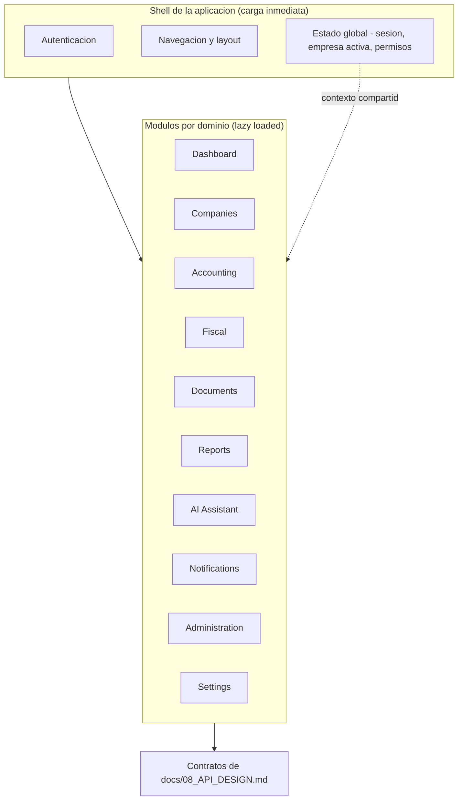
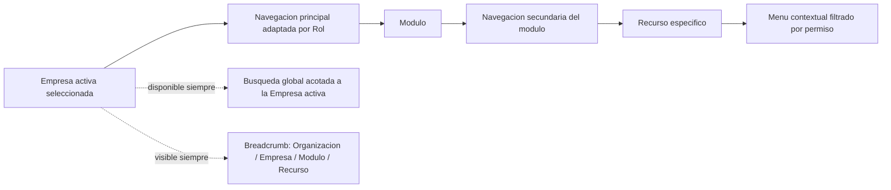
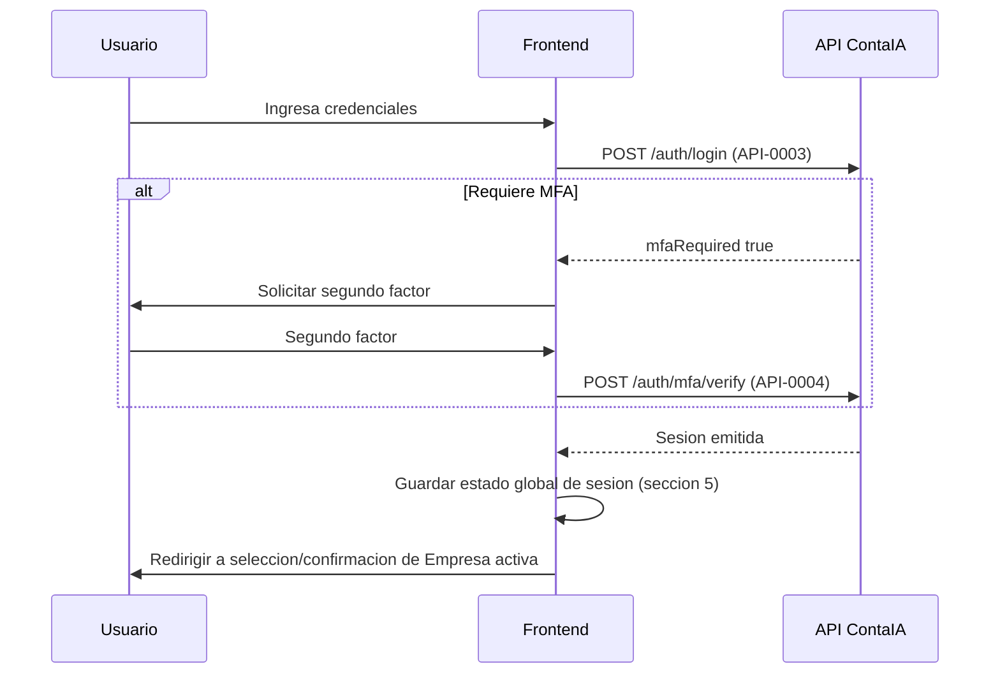
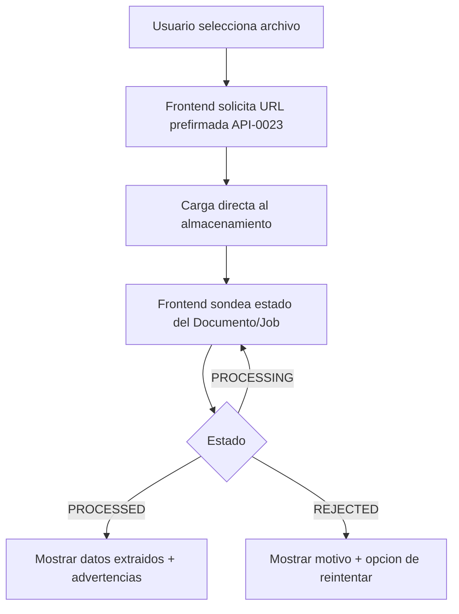
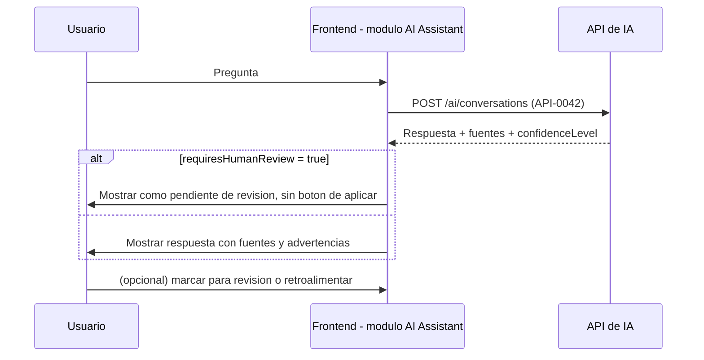
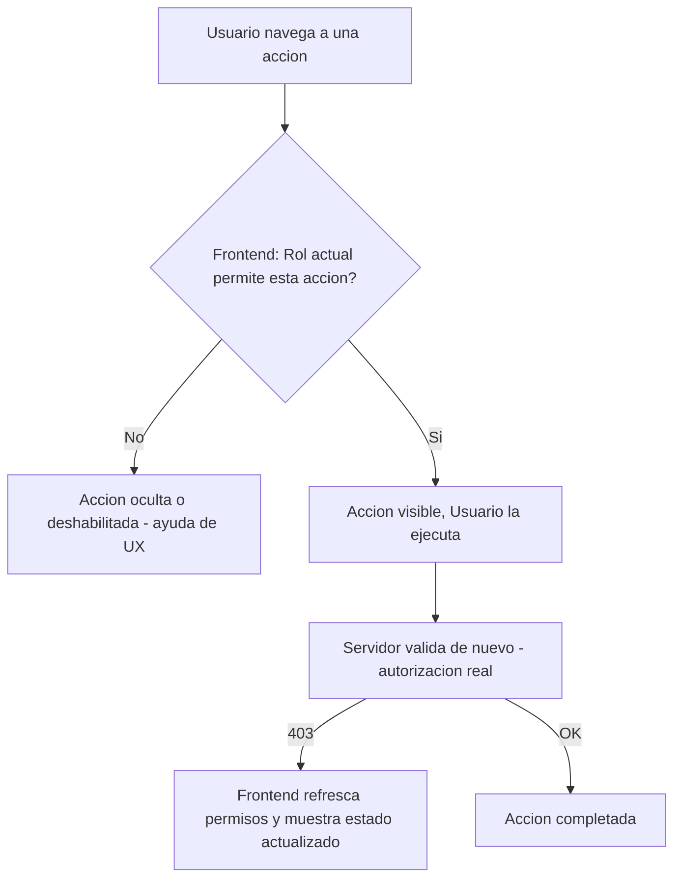

# Arquitectura de Frontend — ContaIA

## Control del documento

| Campo                                     | Valor                                                                                                                                                                                                                                                                                                                                                     |
| ----------------------------------------- | --------------------------------------------------------------------------------------------------------------------------------------------------------------------------------------------------------------------------------------------------------------------------------------------------------------------------------------------------------- |
| Documento                                 | 12_FRONTEND_ARCHITECTURE.md                                                                                                                                                                                                                                                                                                                               |
| Orden de trabajo                          | AWO-008                                                                                                                                                                                                                                                                                                                                                   |
| Versión                                   | 1.0                                                                                                                                                                                                                                                                                                                                                       |
| **Estado**                                | **Draft v1.0**                                                                                                                                                                                                                                                                                                                                            |
| Fecha de creación                         | 2026-07-18                                                                                                                                                                                                                                                                                                                                                |
| Última actualización                      | 2026-07-18                                                                                                                                                                                                                                                                                                                                                |
| Fuentes de verdad                         | `MASTER_CONTEXT.md`, `docs/00_PRODUCT_VISION.md`, `docs/01_PRD.md`, `docs/02_USER_PERSONAS.md`, `docs/04_BUSINESS_RULES.md`, `docs/05_SYSTEM_DOMAIN_MODEL.md`, `docs/06_SYSTEM_WORKFLOWS.md`, `docs/07_SOFTWARE_ARCHITECTURE.md`, `docs/08_API_DESIGN.md`, `docs/09_DATABASE_DESIGN.md`, `docs/10_AI_ARCHITECTURE.md`, `docs/11_SECURITY_ARCHITECTURE.md` |
| Documentos que esta arquitectura alimenta | Design System (próximo, ver "Observaciones del Arquitecto"), `docs/18_TESTING_STRATEGY.md`                                                                                                                                                                                                                                                                |

> Nota sobre numeración: la Work Order pedía `docs/12_FRONTEND_ARCHITECTURE.md`, posición que ocupaba `docs/12_RAG_ARCHITECTURE.md` (placeholder vacío, pendiente desde AWO-006). Se desplazó junto con los documentos siguientes (`docs/13` a `docs/18` → `docs/13` a `docs/19`) sin pérdida de contenido — todos eran placeholders vacíos salvo los ya completados en turnos anteriores. Todas las referencias cruzadas del proyecto se actualizaron antes de escribir este contenido. Ver "Observaciones del Arquitecto" sobre la mención de `docs/13_DESIGN_SYSTEM.md` en esta Work Order.

> Este documento diseña arquitectura de frontend conceptual: no es código, no diseña pantallas finales ni componentes visuales pixel por pixel (eso corresponde al Design System, ver sección 24).

---

## 1. Objetivos del frontend

**Responsabilidades del frontend:** renderizar la experiencia de usuario; gestionar interacción y estado de interfaz; invocar los contratos de `docs/08_API_DESIGN.md`; ofrecer ayudas de UX basadas en permisos (nunca la autorización final); gestionar la navegación y el contexto de Empresa activa (`docs/08_API_DESIGN.md`, sección 5 — es una noción exclusiva de interfaz); sondear/consumir el estado de operaciones asíncronas (Jobs); presentar contenido accesible y responsivo; mostrar fundamentos, advertencias y nivel de confianza de las respuestas de IA tal como los entrega la API.

**Responsabilidades exclusivas del backend (el frontend nunca las duplica):** validar reglas de negocio de forma autoritativa (BR-*, `docs/04_BUSINESS_RULES.md`); autorizar en servidor (`docs/08_API_DESIGN.md` sección 7, `docs/11_SECURITY_ARCHITECTURE.md` sección 8); ejecutar cálculos contables o fiscales (BR-GLB-004 — el frontend nunca calcula una Balanza o un Estado Financiero, solo los presenta); decidir o ejecutar acciones de IA (principio fundamental); gestionar secretos, claves o credenciales de integración; aplicar el aislamiento multiempresa como garantía real (el frontend lo refleja, el servidor lo garantiza — sección 7).

## 2. Arquitectura general

ContaIA se construye como una **aplicación de una sola página (SPA)** que consume exclusivamente los contratos de `docs/08_API_DESIGN.md`. Organización por dominios: cada módulo de negocio (sección 3) es una unidad de código independiente, cargada mediante **code splitting** y **lazy loading** — el código de un módulo (por ejemplo, Fiscal) no se descarga hasta que el Usuario navega a él, reduciendo la carga inicial. El renderizado inicial (shell de la aplicación: autenticación, navegación, layout) se mantiene ligero y siempre disponible; el contenido de cada módulo se carga bajo demanda.

## 3. Organización de módulos

| Módulo frontend    | Responsabilidad                                                                      | Backend consumido                            | Personas principales           |
| ------------------ | ------------------------------------------------------------------------------------ | -------------------------------------------- | ------------------------------ |
| **Authentication** | Registro, login, MFA, recuperación, verificación (workflow 3)                        | Identity (`docs/08_API_DESIGN.md`, 9.1)      | Todos                          |
| **Dashboard**      | Vista consolidada de indicadores ya calculados; punto de entrada tras iniciar sesión | Accounting, AI, Notifications (solo lectura) | Todos, adaptado por Rol        |
| **Companies**      | Gestión de Organización, Empresas, Membresías, Ejercicios                            | Organizations, Identity (9.2-9.4)            | Administrador                  |
| **Accounting**     | Catálogo de Cuentas, Pólizas, aprobación                                             | Accounting (9.6-9.7)                         | Contador, Auxiliar, Supervisor |
| **Fiscal**         | Carga y consulta de CFDI/XML                                                         | Documents, Fiscal (9.5)                      | Auxiliar, Contador             |
| **Documents**      | Repositorio documental genérico                                                      | Documents (9.5)                              | Auxiliar, Contador             |
| **Reports**        | Balanza y Estados Financieros                                                        | Accounting (9.8)                             | Contador, Administrador        |
| **AI Assistant**   | Chat contable-fiscal, sugerencias, aprobación                                        | AI, Approvals (9.9-9.10)                     | Todos, con alcance por Rol     |
| **Notifications**  | Alertas y cola de Casos de Revisión                                                  | Notifications (9.12)                         | Rol responsable según el caso  |
| **Administration** | Panel interno de plataforma (fuera del alcance de Empresa cliente)                   | Administration (9.13)                        | Administrador de plataforma    |
| **Settings**       | Configuración de Empresa, catálogo base, invitación de Usuarios                      | Organizations, Identity (9.2-9.3, 9.6)       | Administrador                  |

Cada módulo es dueño de su propia navegación interna, estado local y componentes; ningún módulo importa directamente el estado interno de otro (coherente con el bajo acoplamiento de `docs/07_SOFTWARE_ARCHITECTURE.md`, sección 2) — la comunicación entre módulos ocurre a través del estado global (sección 5) o recargando datos vía API.

## 4. Navegación

- **Navegación principal:** adaptada por Rol (`MASTER_CONTEXT.md`, sección 18 — "navegación adaptativa"); un Auxiliar ve Documents/Fiscal/Accounting de forma prominente, un Auditor ve principalmente Reports/Notifications en modo consulta.
- **Navegación secundaria:** dentro de cada módulo (por ejemplo, dentro de Accounting: Catálogo, Pólizas, Ajustes).
- **Breadcrumbs:** reflejan la jerarquía Organización → Empresa activa → módulo → recurso, para que el Usuario nunca pierda de vista en qué Empresa está operando (refuerzo de UX del aislamiento multiempresa).
- **Menú contextual:** acciones disponibles sobre un recurso específico (por ejemplo, sobre una Póliza: enviar a revisión, ver evidencia), filtradas por permiso (sección 7).
- **Navegación móvil:** colapsa la navegación principal a un patrón de acceso reducido (menú/drawer), priorizando las tareas más frecuentes por Rol (sección 15).
- **Búsqueda global:** acota siempre a la Empresa activa — nunca busca a través de Empresas (BR-GLB-001); busca sobre Documentos, CFDI y Pólizas de forma unificada.

## 5. Arquitectura de estado

Sin seleccionar una librería concreta (instrucción explícita):

| Tipo de estado      | Ejemplos                                                                                   | Duración                                                                                                                                                                                                 |
| ------------------- | ------------------------------------------------------------------------------------------ | -------------------------------------------------------------------------------------------------------------------------------------------------------------------------------------------------------- |
| **Estado global**   | Sesión, Empresa activa, permisos del Usuario en esa Empresa, Rol vigente                   | Toda la sesión del navegador                                                                                                                                                                             |
| **Estado local**    | Contenido de un formulario en edición, filtros de una tabla                                | Vida del componente/vista                                                                                                                                                                                |
| **Caché**           | Respuestas de lectura recientes (Catálogo, Documentos listados)                            | Corta, invalidada por mutación relacionada; **siempre con la Empresa activa como parte de la clave de caché**, nunca compartida entre Empresas (extiende `docs/11_SECURITY_ARCHITECTURE.md`, sección 13) |
| **Datos derivados** | Totales mostrados en pantalla a partir de una lista ya cargada                             | Recalculados en cliente solo para presentación — **nunca la fuente de verdad**; la cifra autoritativa siempre viene del servidor (BR-GLB-004)                                                            |
| **Sincronización**  | Tras aprobar una Póliza, invalidar caché de Balanza/Estados Financieros de esa Empresa     | Disparada por eventos de mutación exitosa                                                                                                                                                                |
| **Invalidación**    | Cambio de Empresa activa invalida todo el estado y caché específico de la Empresa anterior | Inmediata al cambiar de contexto                                                                                                                                                                         |

## 6. Manejo de autenticación

- **Inicio de sesión / cierre de sesión / recuperación / verificación de correo:** consumen `docs/08_API_DESIGN.md` (grupo 9.1), workflow 3.
- **Renovación:** transparente para el Usuario mientras la sesión esté dentro del umbral de inactividad (BR-AUTH-004); al expirar, el frontend redirige a login conservando la intención de navegación previa cuando sea posible.
- **Sesiones expiradas:** el frontend detecta una respuesta `401 AUTHENTICATION_ERROR` y fuerza reautenticación, sin intentar "adivinar" una sesión válida.
- **Empresa activa:** concepto exclusivo de interfaz (`docs/08_API_DESIGN.md`, sección 5); el frontend la mantiene en estado global y la envía explícitamente (`companyId`) en cada solicitud — nunca depende de un valor implícito del servidor.
- **Cambio de Empresa:** no es una llamada a la API en sí misma — es un cambio de estado local que hace que las siguientes solicitudes usen otro `companyId`; dispara invalidación completa de caché de la Empresa anterior (sección 5).

## 7. Gestión de permisos

- **Interpretación:** el frontend recibe el Rol del Usuario en la Empresa activa (vía Membresía) y lo usa para decidir qué mostrar.
- **Protección de rutas:** rutas de un módulo verifican el Rol antes de renderizar (por ejemplo, `Administration` nunca es alcanzable por un Rol de Empresa).
- **Ocultar acciones:** botones y acciones no permitidas para el Rol actual se ocultan o deshabilitan como ayuda de experiencia.
- **Sincronización de permisos:** al cambiar de Empresa activa o al recibir una notificación de cambio de Rol propio, el frontend refresca sus permisos en memoria antes de permitir nuevas acciones.
- **Respuesta a cambios de Rol:** si el servidor responde `403 AUTHORIZATION_ERROR` a una acción que la interfaz creía permitida (por ejemplo, el Rol cambió en otra sesión), el frontend refresca permisos y muestra el estado actualizado, nunca insiste silenciosamente.

**La autorización definitiva ocurre siempre en el servidor** (`docs/08_API_DESIGN.md` sección 7; `docs/11_SECURITY_ARCHITECTURE.md`, principio "ocultar una opción en pantalla no reemplaza la autorización en servidor") — todo lo anterior es exclusivamente experiencia de usuario.

## 8. Gestión de formularios

- **Validaciones:** en cliente como ayuda inmediata (formato, campos obligatorios), reflejando las mismas reglas que el servidor revalidará — nunca la única barrera.
- **Errores:** se mapean del contrato estándar de error (`docs/08_API_DESIGN.md`, sección 11) a mensajes de campo específicos cuando el error trae `field`, o a un mensaje general cuando no.
- **Guardado automático y borradores:** aplican a recursos con estado `DRAFT` (por ejemplo, una Póliza en captura); el frontend guarda progreso incremental sin requerir que el Usuario complete el formulario de una sola vez.
- **Confirmaciones:** obligatorias antes de cualquier acción irreversible o sensible (aprobar, rechazar, cerrar Ejercicio) — un segundo paso explícito, nunca un solo clic accidental para una acción crítica.
- **Accesibilidad de formularios:** ver sección 14.

## 9. Gestión documental

Sigue el patrón de `docs/08_API_DESIGN.md` (sección 14): el frontend nunca transfiere el archivo binario a través de su propio backend.

1. El Usuario selecciona un archivo (XML o PDF).
2. El frontend solicita la intención de carga (`API-0023`) y recibe una URL prefirmada.
3. El frontend sube el archivo **directamente** al almacenamiento de objetos, mostrando progreso real de la subida.
4. El frontend sondea o se suscribe al estado del Documento/Job (`PENDING_UPLOAD → PROCESSING → PROCESSED | REJECTED`).
5. Si `PROCESSED`, se muestran los datos extraídos (para XML/CFDI) con advertencias de campos ambiguos (BR-XML-002) claramente resaltadas.
6. Si `REJECTED`, se muestra el motivo en lenguaje claro (BR-ERR-001) y una opción de reintentar la carga.

## 10. Experiencia IA

- **Conversaciones e historial:** el frontend presenta la conversación como un hilo continuo, con acceso al historial previo de esa Empresa (`API-0043`).
- **Evidencias y referencias:** toda afirmación normativa relevante se presenta con su fuente visible (fuente, apartado, vigencia) — nunca un bloque de texto sin procedencia (BR-IA-006).
- **Sugerencias:** presentadas explícitamente como propuestas, nunca como hechos consumados; distinguibles visualmente de contenido ya confirmado.
- **Aprobación:** cuando una sugerencia requiere convertirse en una acción real (por ejemplo, una Póliza), el frontend dirige al Usuario al flujo de aprobación estándar (`API-0033` → workflow 8), nunca ofrece un botón de "aplicar" que ejecute directamente desde el chat.
- **Advertencias y confianza:** el nivel de confianza se muestra tal como lo entrega la API — categórico (`APPROVED`/`REQUIRES_REVIEW`/`INSUFFICIENT`, `docs/10_AI_ARCHITECTURE.md` sección 13), **nunca un porcentaje inventado por el frontend**.
- **Ausencia de fundamento:** se comunica explícitamente, no se oculta ni se disfraza de respuesta completa.

**La IA nunca ejecuta acciones definitivas desde el frontend** (instrucción explícita, coherente con el principio fundamental) — toda superficie de IA en la interfaz termina, cuando corresponde, en un paso de revisión humana visible, nunca en una ejecución silenciosa.

## 11. Manejo de operaciones asíncronas

Reutiliza el modelo de Job de `docs/08_API_DESIGN.md` (sección 15) para: importación/extracción de XML, generación de reportes de gran volumen, procesamiento extenso de IA, exportaciones.

Estados presentados al Usuario: `pending (queued) → processing → completed | failed | cancelled`. El frontend sondea `GET /jobs/{jobId}` (`API-0055`) o reacciona a una actualización empujada, mostrando progreso indicativo (sin inventar porcentaje preciso si el backend no lo provee) y, al completar, navega o notifica al resultado (sección 12).

## 12. Notificaciones

- **Tiempo real (o cuasi real vía sondeo periódico):** Alertas y Casos de Revisión nuevos aparecen sin que el Usuario tenga que refrescar manualmente.
- **Alertas persistentes:** las de negocio (BR-NOT) permanecen visibles en un centro de notificaciones hasta atenderse — no son mensajes efímeros.
- **Mensajes efímeros (toast):** confirmaciones de acciones exitosas o errores transitorios, que desaparecen solos.
- **Errores:** ver sección 13.
- **Confirmaciones:** refuerzan que una acción sensible se completó (sección 8).

## 13. Manejo de errores

| Categoría                             | Presentación                                                                                |
| ------------------------------------- | ------------------------------------------------------------------------------------------- |
| Validación                            | Inline, junto al campo afectado (sección 8)                                                 |
| Autenticación                         | Redirección a login, sin exponer detalle técnico                                            |
| Autorización                          | Mensaje claro de acceso no permitido; nunca revela qué existiría si tuviera permiso         |
| Red                                   | Mensaje de conectividad con opción de reintentar, distinguible de un error de servidor      |
| Servidor                              | Mensaje genérico y seguro (BR-ERR-002, BR-SEC-003) — nunca detalle técnico interno          |
| Negocio (`BUSINESS_RULE_VIOLATION`)   | Mensaje explicando la regla en lenguaje claro (por ejemplo, "la póliza no está balanceada") |
| IA (confianza insuficiente / bloqueo) | Mensaje explícito de que la respuesta requiere revisión humana, no un error genérico        |

Todo error incluye, cuando la API lo provee, el `correlationId` accesible (por ejemplo, en un detalle expandible) para soporte, sin saturar el mensaje principal.

## 14. Accesibilidad

Objetivo: **WCAG 2.2 nivel AA**. Incluye: navegación completa por teclado sin trampas de foco; compatibilidad con lectores de pantalla (semántica correcta, etiquetas asociadas); contraste de color suficiente en todo estado (incluidos estados de error y deshabilitado); gestión de foco visible y predecible (por ejemplo, al abrir un modal de confirmación); formularios con etiquetas y mensajes de error anunciados por tecnología asistiva; navegación y estructura de encabezados coherente para facilitar la orientación sin depender solo de lo visual.

## 15. Responsive design

Sin diseñar pantallas (instrucción explícita); comportamiento por punto de quiebre:

- **Escritorio/laptop:** navegación principal siempre visible, tablas de datos completas, paneles de detalle lado a lado con listados.
- **Tablet:** navegación colapsable, tablas con scroll horizontal controlado o columnas priorizadas.
- **Móvil:** navegación por menú/drawer, tablas transformadas a tarjetas apiladas con la información más relevante primero, formularios de un campo por fila, acciones críticas (aprobar/rechazar) accesibles pero con confirmación reforzada dado el mayor riesgo de toque accidental.

## 16. Rendimiento

- **Lazy loading y code splitting:** por módulo (sección 2); ningún módulo no visitado consume ancho de banda inicial.
- **Caché:** ver sección 5.
- **Virtualización:** listas largas (Pólizas, Registro de Trazabilidad consultado) se renderizan de forma virtualizada, no todo el conjunto a la vez.
- **Archivos grandes:** nunca pasan por el servidor de aplicación del frontend/backend (sección 9; `docs/08_API_DESIGN.md` sección 14) — carga y descarga directa contra almacenamiento de objetos.
- **Carga progresiva:** el Dashboard y Reports muestran estructura y datos disponibles de inmediato, cargando secciones más costosas (por ejemplo, un Estado Financiero de un Ejercicio con mucho volumen) de forma diferida con indicación clara de progreso.
- **Optimización general:** minimizar la cantidad de llamadas redundantes a la API reutilizando el estado de caché (sección 5) en vez de recargar datos ya disponibles y vigentes.

## 17. Comunicación con APIs

El frontend consume exclusivamente los contratos ya definidos en `docs/08_API_DESIGN.md` — este documento no los rediseña:

- **Autenticación:** grupo 9.1, gestionado por el módulo Authentication (sección 3).
- **API de negocio:** el resto de grupos de `docs/08_API_DESIGN.md` (9.2 a 9.13), consumidos por su módulo frontend correspondiente (sección 3).
- **Jobs:** `API-0055`, consumido por cualquier módulo que dispare una operación asíncrona (sección 11).
- **Archivos:** flujo de URL prefirmada (sección 9).
- **IA:** grupo 9.9, consumido por AI Assistant (sección 10).
- **Eventos:** el frontend no consume eventos de dominio internos directamente (esos son internos del monolito, `docs/07_SOFTWARE_ARCHITECTURE.md` sección 8); recibe sus efectos a través de las respuestas de API y, para Notifications, mediante sondeo o actualización push del recurso Alertas/Approvals.

Toda solicitud de mutación relevante genera o reutiliza una `Idempotency-Key` (`docs/08_API_DESIGN.md`, sección 13) del lado del cliente, para que un reintento de red no duplique el efecto.

## 18. Seguridad del frontend

Extiende `docs/11_SECURITY_ARCHITECTURE.md` (sección 21) sin repetirla:

- **XSS:** ningún contenido generado por Usuario o por IA se renderiza como código ejecutable; todo contenido dinámico se sanitiza antes de mostrarse.
- **CSRF:** toda mutación desde el frontend incluye el mecanismo anti-falsificación correspondiente.
- **Manejo y almacenamiento de tokens:** nunca en almacenamiento local accesible por script de terceros sin protección; nunca en la URL (`docs/11_SECURITY_ARCHITECTURE.md`, sección 7).
- **Rutas protegidas:** ver sección 7 de este documento — protección de experiencia, reforzada siempre por el servidor.
- **Sanitización:** de toda entrada mostrada de vuelta al Usuario (nombres de archivo, contenido de Documentos, respuestas de IA).
- **Subida de archivos:** solo mediante el flujo de URL prefirmada (sección 9); el frontend nunca ejecuta ni interpreta el contenido de un archivo cargado.

## 19. Observabilidad

- **Logging:** errores de cliente se capturan y se envían al backend con su `correlationId`, sin incluir datos sensibles de la Empresa en el cuerpo del log (`docs/11_SECURITY_ARCHITECTURE.md`, sección 29).
- **Métricas de rendimiento:** tiempos de carga por módulo, tiempo hasta interactividad, latencia percibida de operaciones clave.
- **Errores:** tasa de error por módulo y por tipo (sección 13), correlacionable con el backend vía `correlationId`.
- **Sesiones:** patrones de uso agregados y anonimizados para mejorar la experiencia, nunca contenido de datos de negocio.
- **Eventos de interacción:** navegación entre módulos, uso de funciones de IA (frecuencia, no contenido), para priorizar mejoras futuras — respetando siempre la clasificación de datos de `docs/11_SECURITY_ARCHITECTURE.md` (sección 3).

## 20. Estrategia de pruebas

- **Unitarias:** lógica de presentación y transformación de datos de cada módulo.
- **Integración:** interacción entre componentes de un módulo y su consumo real de los contratos de `docs/08_API_DESIGN.md` (contra un entorno de pruebas, nunca producción).
- **End-to-end (E2E):** flujos completos de negocio (por ejemplo, workflow 8 completo: captura → envío a revisión → aprobación) simulando los Roles relevantes.
- **Accesibilidad:** verificación automatizada de WCAG 2.2 AA (sección 14) como parte del pipeline, complementada con revisión manual periódica.
- **Rendimiento:** pruebas de carga inicial y de interacción bajo volumen de datos representativo (listas largas, Ejercicios con muchas Pólizas).

Se integran como insumo de `docs/18_TESTING_STRATEGY.md` (documento aún pendiente), no como un proceso aislado del frontend.

## 21. Diagramas Mermaid

Arquitectura general (sección 2) y navegación (sección 4) ya incluidos. Se agregan los restantes:

### 21.1 Flujo de autenticación

### 21.2 Procesamiento de XML

### 21.3 Interacción con IA

### 21.4 Flujo de permisos

## 22. Riesgos

- **Cuellos de botella:** tablas grandes sin virtualización (Pólizas, Trazabilidad) pueden degradar el rendimiento percibido si no se implementa desde el inicio (sección 16).
- **Dependencias:** el frontend depende completamente de la disponibilidad de la API (`docs/08_API_DESIGN.md`); sin una estrategia clara de estados de carga/error, una degradación del backend se percibe como una aplicación rota, no como una degradación controlada.
- **Problemas de UX:** el cambio de Empresa activa (sección 6) es un punto de confusión potencial para Usuarios de Despacho con muchas Empresas — requiere validación con usuarios reales (coherente con la recomendación ya pendiente en `docs/02_USER_PERSONAS.md`).
- **Crecimiento:** el número de módulos (11 en el MVP) puede crecer con las fases futuras de `docs/01_PRD.md`; sin disciplina de organización por dominio (sección 3), el código puede volverse difícil de mantener.
- **Deuda técnica:** el estado global (sección 5) es el componente con mayor riesgo de acumular complejidad no planeada si distintos módulos empiezan a leer/escribir estado ajeno directamente en vez de a través de sus propios contratos.

## 23. MVP

**Incluye en la primera versión del frontend:** Authentication completo; Companies (creación, cambio de contexto, Membresías básicas); Accounting (Catálogo, Pólizas con flujo de aprobación); Fiscal y Documents (carga y consulta de CFDI/Documentos); Reports limitado a Balanza y Estados Financieros básicos (`docs/01_PRD.md`, módulos M7-M8); AI Assistant limitado a los cuatro Agentes activos (`docs/10_AI_ARCHITECTURE.md`, sección 5); Notifications (Alertas básicas y cola de Approvals); Settings básico (datos generales, invitación de Usuarios).

**Se implementa en fases posteriores:** Administration con funcionalidad completa (el MVP puede requerir solo lo mínimo operativo para dar soporte, coherente con `docs/01_PRD.md` módulo M12 como P1); Reports avanzado (analítica, tableros comparativos entre Ejercicios); búsqueda global enriquecida; notificaciones en tiempo real completo (el MVP puede operar con sondeo periódico en vez de push instantáneo); vistas específicas para Agentes de IA diferidos (educativo, financiero-empresarial) cuando se activen.

## 24. Recomendaciones para Design System

- **Tokens de marca y accesibilidad:** el Design System debe partir de los criterios de contraste y foco ya exigidos en la sección 14, no definirlos desde cero.
- **Componentes por patrón de dato, no por pantalla:** priorizar componentes reutilizables para los patrones ya identificados aquí — tabla virtualizada (sección 16), formulario con borrador (sección 8), indicador de estado de Job (sección 11), tarjeta de respuesta de IA con fuente y confianza (sección 10), breadcrumb de contexto multiempresa (sección 4).
- **Estados visuales estándar:** un único lenguaje visual para "borrador", "pendiente de revisión", "definitivo/aprobado", "rechazado" — reutilizado en Pólizas, Casos de Revisión y Documentos, en vez de un tratamiento distinto por módulo.
- **Patrón de confianza de IA:** un componente visual único para `APPROVED`/`REQUIRES_REVIEW`/`INSUFFICIENT` (sección 10), consistente en todo el AI Assistant.
- **Responsive por comportamiento, no por breakpoint aislado:** los patrones de la sección 15 (tabla → tarjeta, navegación → drawer) deben resolverse como componentes adaptativos del Design System, no como estilos ad hoc por módulo.

Este documento no diseña esos componentes — entrega los insumos funcionales para que el próximo documento (ver nota abajo) los diseñe visualmente.

---

## Historial de cambios

| Fecha      | Cambio                                                                                                                                                                                                                                                                                                                                                                                                                                                                                                                                                           | Responsable                        |
| ---------- | ---------------------------------------------------------------------------------------------------------------------------------------------------------------------------------------------------------------------------------------------------------------------------------------------------------------------------------------------------------------------------------------------------------------------------------------------------------------------------------------------------------------------------------------------------------------- | ---------------------------------- |
| 2026-07-18 | Creación de la primera versión completa de `docs/12_FRONTEND_ARCHITECTURE.md` bajo AWO-008: arquitectura SPA modular de 11 módulos, navegación adaptativa, arquitectura de estado sin librería concreta, gestión de autenticación/permisos/formularios/documentos/IA/operaciones asíncronas/notificaciones/errores, accesibilidad WCAG 2.2 AA, responsive por comportamiento, rendimiento, seguridad alineada con `docs/11_SECURITY_ARCHITECTURE.md`, 6 diagramas Mermaid, riesgos, alcance del MVP y recomendaciones para el Design System. Estado: Draft v1.0. | Responsable de producto de ContaIA |

---

## Observaciones del Arquitecto

**Decisiones tomadas:**

- Se resolvió la colisión de `docs/12` desplazando `RAG_ARCHITECTURE`, `UI_UX_DESIGN`, `TESTING_STRATEGY`, `DEVOPS`, `LOCAL_DEVELOPMENT`, `LEGAL_COMPLIANCE` y `GLOSSARY` una posición cada uno (`docs/13` a `docs/19`), sin pérdida de contenido — todos placeholders vacíos salvo los ya completados en turnos anteriores, que se movieron intactos.
- Los 11 módulos frontend sugeridos por la Work Order se mapearon explícitamente contra los 8 módulos backend de `docs/07_SOFTWARE_ARCHITECTURE.md` (sección 3 de este documento) — Dashboard, Reports y Settings no son módulos backend propios, son agrupaciones de experiencia que consumen otros módulos (Accounting, AI, Organizations), documentado explícitamente para no sugerir un backend paralelo no aprobado.
- Se reiteró en tres puntos distintos (secciones 7, 10, 18) que la interfaz nunca sustituye la autorización de servidor ni ejecuta acciones de IA — es la misma regla aplicada a tres superficies distintas (permisos generales, IA, seguridad), no una repetición accidental.
- No se seleccionó ninguna librería de gestión de estado ni framework de SPA concreto, conforme a la instrucción explícita.

**Riesgos:**

- Ver sección 22 completa. El de mayor atención inmediata es la ausencia de validación de UX real sobre el cambio de Empresa activa con Usuarios de despacho — ya señalado como pendiente desde `docs/02_USER_PERSONAS.md`.

**Mejoras futuras:**

- Evaluar notificaciones push reales (más allá de sondeo periódico) una vez que el volumen de uso lo justifique.
- Ampliar Reports con analítica comparativa entre Ejercicios en una fase posterior al MVP.

**Dependencias para AWO-009 (Design System):**

- Esta Work Order menciona `docs/13_DESIGN_SYSTEM.md` como destino del siguiente documento. Esa posición (`docs/13`) está ocupada actualmente por `docs/13_RAG_ARCHITECTURE.md` (placeholder vacío, reubicado en este mismo turno) — se reitera el patrón ya visto en Work Orders anteriores: la numeración sugerida por una Work Order puede no coincidir con el estado real de `docs/`, y deberá resolverse (probablemente insertando el Design System donde corresponda y desplazando lo demás) cuando esa Work Order llegue, siguiendo el mismo criterio usado en AWO-001 a AWO-008.
- El Design System debe tomar la sección 24 de este documento como punto de partida funcional antes de proponer componentes visuales.
- `docs/00_DOCUMENTATION_INDEX.md` y `docs/00_DOCUMENTATION_GUIDE.md` siguen sin existir (hallazgo original en `docs/02_USER_PERSONAS.md`); con trece documentos técnicos ya interconectados y una nueva reubicación de numeración en este turno, se reitera nuevamente la recomendación de crearlos.
