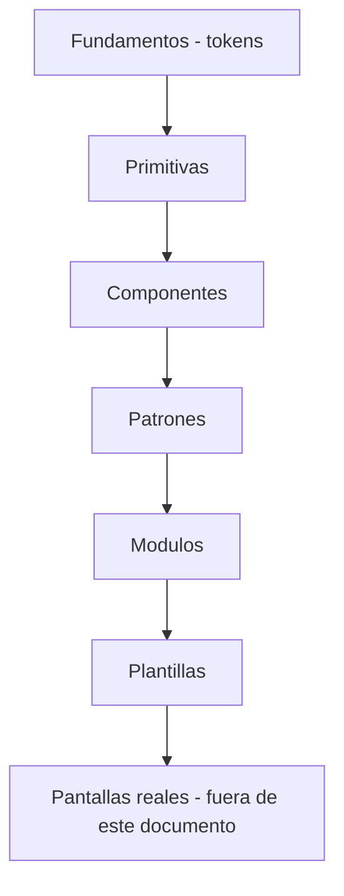
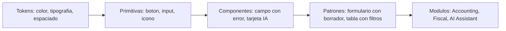
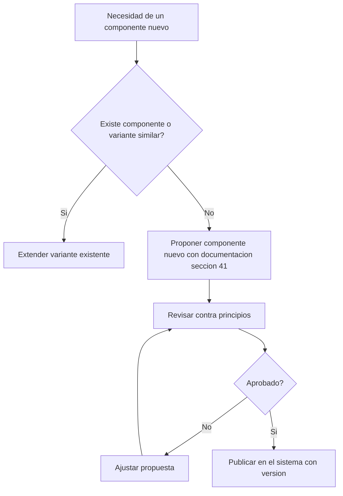
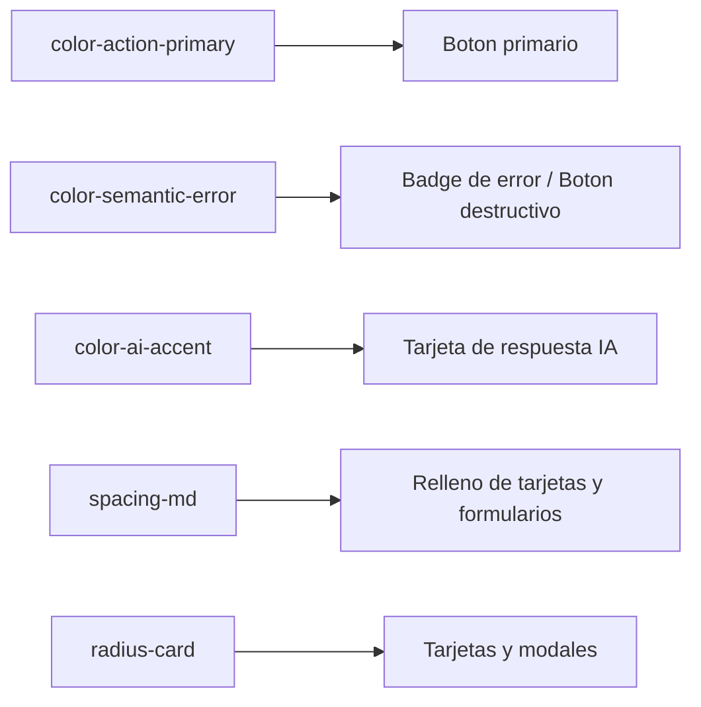
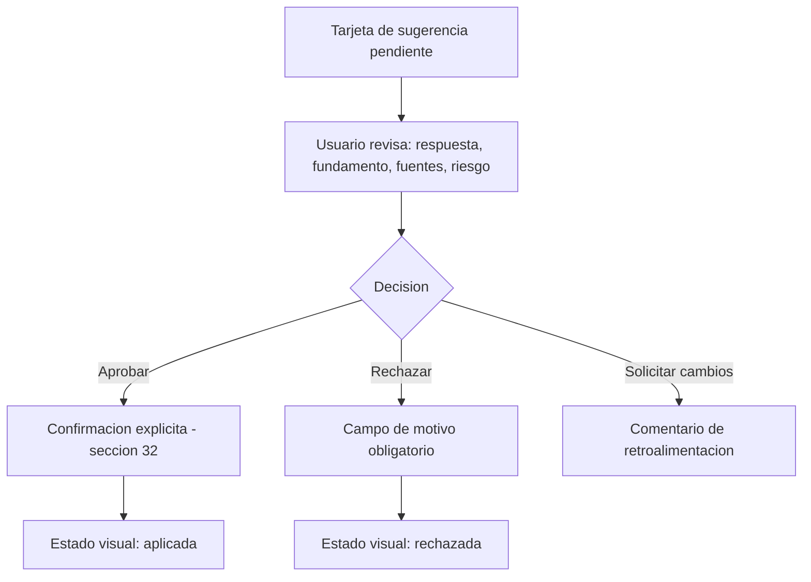
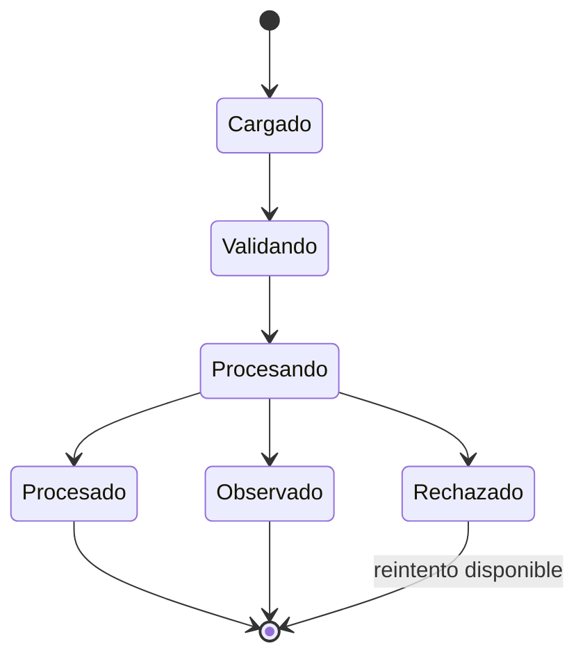

# Sistema de Diseño — ContaIA

## Control del documento

| Campo                                | Valor                                                                                                                                                                                                                                                                                                                                                                                         |
| ------------------------------------ | --------------------------------------------------------------------------------------------------------------------------------------------------------------------------------------------------------------------------------------------------------------------------------------------------------------------------------------------------------------------------------------------- |
| Documento                            | 13_DESIGN_SYSTEM.md                                                                                                                                                                                                                                                                                                                                                                           |
| Orden de trabajo                     | AWO-009                                                                                                                                                                                                                                                                                                                                                                                       |
| Versión                              | 1.0                                                                                                                                                                                                                                                                                                                                                                                           |
| **Estado**                           | **Draft v1.0**                                                                                                                                                                                                                                                                                                                                                                                |
| Fecha de creación                    | 2026-07-18                                                                                                                                                                                                                                                                                                                                                                                    |
| Última actualización                 | 2026-07-18                                                                                                                                                                                                                                                                                                                                                                                    |
| Fuentes de verdad                    | `MASTER_CONTEXT.md`, `docs/00_PRODUCT_VISION.md`, `docs/01_PRD.md`, `docs/02_USER_PERSONAS.md`, `docs/04_BUSINESS_RULES.md`, `docs/05_SYSTEM_DOMAIN_MODEL.md`, `docs/06_SYSTEM_WORKFLOWS.md`, `docs/07_SOFTWARE_ARCHITECTURE.md`, `docs/08_API_DESIGN.md`, `docs/09_DATABASE_DESIGN.md`, `docs/10_AI_ARCHITECTURE.md`, `docs/11_SECURITY_ARCHITECTURE.md`, `docs/12_FRONTEND_ARCHITECTURE.md` |
| Documentos que este sistema alimenta | Information Architecture (próximo, ver "Observaciones del Arquitecto")                                                                                                                                                                                                                                                                                                                        |

> Nota sobre numeración: la Work Order pedía `docs/13_DESIGN_SYSTEM.md`, posición que ocupaba `docs/13_RAG_ARCHITECTURE.md` (placeholder vacío, pendiente desde AWO-006, ya anticipado como conflicto en las Observaciones de AWO-008). Se desplazó junto con los documentos siguientes (`docs/13` a `docs/19` → `docs/14` a `docs/20`) sin pérdida de contenido. Todas las referencias cruzadas del proyecto se actualizaron antes de escribir este contenido.

> Este documento define el sistema de diseño conceptual: personalidad, tokens, componentes y gobernanza. No es código de producción, no construye pantallas completas y no selecciona una librería visual concreta sin justificación (ver sección 39).

---

## 1. Propósito del Design System

**Alcance:** todo lenguaje visual e interactivo de ContaIA — aplicación web, panel administrativo interno, módulos contables/fiscales/documentales/de reportes, asistente de IA y dispositivos móviles.

**Objetivos:** consistencia entre módulos (`docs/12_FRONTEND_ARCHITECTURE.md`, sección 3); reducción de tiempo de diseño e implementación de nuevas pantallas; accesibilidad garantizada desde el origen, no añadida después; comunicación visual de confianza y precisión, coherente con la naturaleza contable/fiscal del producto.

**Usuarios del sistema:** diseñadores, desarrolladores frontend, y — indirectamente — los diez usuarios de `docs/02_USER_PERSONAS.md`, cuya experiencia final depende de estas decisiones.

**Productos cubiertos:** los once módulos frontend de `docs/12_FRONTEND_ARCHITECTURE.md` (sección 3).

**Relación con Frontend Architecture:** este documento no repite la arquitectura de módulos, estado o comunicación con APIs ya definida en `docs/12_FRONTEND_ARCHITECTURE.md` — le da su lenguaje visual y sus componentes.

**Responsabilidades del diseño (este documento):** definir personalidad, tokens, componentes y sus estados, patrones de contenido y accesibilidad.

**Responsabilidades de implementación (fuera de este documento):** la construcción real de componentes en código, la elección final de una librería de componentes base (sección 39), y el diseño pixel-perfect de pantallas específicas.

## 2. Personalidad visual

| Atributo        | Cómo se manifiesta                                                                                                                             |
| --------------- | ---------------------------------------------------------------------------------------------------------------------------------------------- |
| **Profesional** | Composición ordenada, sin elementos decorativos sin función; se ve como una herramienta de trabajo seria, no como una demo.                    |
| **Tecnológica** | Uso deliberado y acotado de un acento visual distintivo para IA (sección 5), sin saturar el resto de la interfaz de "efectos futuristas".      |
| **Confiable**   | Estados siempre visibles y comprensibles (principio 5); nunca una acción sensible ocurre sin retroalimentación visual clara.                   |
| **Precisa**     | Cifras alineadas, tipografía tabular, jerarquía numérica consistente (sección 20).                                                             |
| **Sobria**      | Paleta acotada (sección 5), sin gradientes llamativos ni ilustraciones decorativas dominantes.                                                 |
| **Moderna**     | Espaciado generoso donde la densidad lo permite, tipografía contemporánea de alta legibilidad, sin recurrir a tendencias efímeras (sección 4). |
| **Accesible**   | WCAG 2.2 AA como piso, no como aspiración (sección 34).                                                                                        |
| **Inteligente** | La IA se percibe como un colaborador transparente que muestra su razonamiento (fuente, confianza, advertencias), nunca como una caja negra.    |

**Cómo debe sentirse el uso:** como trabajar con un colega meticuloso — que muestra su trabajo, admite cuando no sabe algo, y nunca actúa sin avisar. ContaIA explícitamente **no** debe parecer una plantilla genérica, un banco tradicional, un portal gubernamental, un chatbot aislado, un sistema contable saturado, ni una aplicación infantil (restricciones ya declaradas en la Work Order).

## 3. Principios de experiencia

| Dominio              | Principio específico                                                         | Decisión correcta                                               | Decisión incorrecta                                                                      |
| -------------------- | ---------------------------------------------------------------------------- | --------------------------------------------------------------- | ---------------------------------------------------------------------------------------- |
| Contabilidad         | Cada cifra debe ser rastreable a su origen                                   | Un total en un reporte es clicable hacia su detalle             | Un total sin forma de verificar de dónde proviene                                        |
| Fiscal               | La incertidumbre normativa se muestra, no se oculta                          | "No se encontró fundamento vigente para este caso"              | Una respuesta fiscal sin fuente presentada con el mismo peso visual que una fundamentada |
| Documentos           | El estado de procesamiento siempre es visible                                | Un indicador de progreso claro por documento                    | Un documento que desaparece de la vista mientras se procesa                              |
| Administración       | Las acciones de plataforma nunca se confunden con las de una Empresa cliente | Superficie visual claramente distinta para el panel interno     | Reutilizar el mismo diseño de Empresa para el panel de soporte                           |
| Reportes             | La comparación es tan importante como el dato individual                     | Mostrar periodo actual junto a periodo anterior                 | Mostrar solo el número absoluto sin contexto temporal                                    |
| IA                   | Toda sugerencia se distingue visualmente de un hecho confirmado              | Tarjeta con borde y etiqueta distintiva para contenido generado | Texto de IA con el mismo estilo que datos ya validados                                   |
| Educación (diferido) | El contenido educativo se distingue del operativo                            | Un modo visual claramente "de práctica"                         | Mezclar ejercicios con datos reales sin distinción visual                                |

## 4. Identidad visual

**Dirección visual:** interfaz de datos profesional — cercana a herramientas como paneles financieros modernos, no a sitios de marketing. **Estilo:** minimalista funcional, no minimalista vacío — cada elemento visible tiene un propósito. **Formalidad:** alta en superficies de datos (tablas, reportes), moderada en superficies conversacionales (IA), nunca informal. **Espacios:** generosos en pantallas de decisión (aprobaciones), compactos en pantallas de operación de alto volumen (captura, listados — ver sección 36). **Profundidad:** mínima, mediante elevación sutil (sección 11), no efectos 3D. **Bordes:** definidos pero suaves, nunca gruesos ni decorativos. **Sombras:** solo para indicar superposición real (modales, menús flotantes), nunca decorativas sobre superficies planas. **Superficies:** neutras, con jerarquía por tono, no por textura. **Ilustraciones y fotografías:** uso mínimo, reservado a estados vacíos (sección 29) con estilo lineal simple, nunca fotografía de stock genérica. **Gráficos:** funcionales primero, estéticos después (sección 23) — nunca decorativos sin representar datos reales.

**Tendencias evitadas explícitamente:** glassmorphism excesivo, gradientes vibrantes de marca, ilustraciones 3D, iconografía sobrecargada, animaciones decorativas sin propósito — todas envejecen rápido y reducen claridad, contrario al principio 1.

## 5. Sistema de color

Base: **azul oscuro profesional + neutros + un acento tecnológico controlado**, conforme a la instrucción explícita. Paleta inicial en HEX — **propuesta sujeta a validación mediante pruebas de contraste reales y revisión de diseño**, no un valor final.

| Categoría              | Función                                                 | HEX propuesto (referencia)                        | Contraste objetivo                     | Usos permitidos                                                                           | Usos prohibidos                                                           |
| ---------------------- | ------------------------------------------------------- | ------------------------------------------------- | -------------------------------------- | ----------------------------------------------------------------------------------------- | ------------------------------------------------------------------------- |
| Marca primaria         | Identidad de producto, navegación, botón primario       | `#1B3A6B` (azul marino profesional)               | AA sobre fondo claro y oscuro          | Logotipo, elementos de marca, acción primaria                                             | Fondos extensos de página                                                 |
| Acción (interactivo)   | Botones primarios, enlaces, foco                        | `#2F6FED`                                         | AA sobre fondo claro                   | Botón primario, enlace activo, indicador de foco                                          | Texto de cuerpo extenso                                                   |
| Fondo (modo claro)     | Base de página                                          | `#F7F8FA`                                         | —                                      | Fondo general                                                                             | Superficies elevadas (sección 11)                                         |
| Superficie             | Tarjetas, tablas, paneles                               | `#FFFFFF`                                         | —                                      | Contenedores de contenido                                                                 | Fondo de página completo                                                  |
| Texto primario         | Contenido principal                                     | `#101828`                                         | AA+ sobre superficie                   | Cuerpo, títulos                                                                           | Texto sobre fondos de color saturado                                      |
| Texto secundario/muted | Ayudas, metadatos                                       | `#5B6472`                                         | AA                                     | Etiquetas auxiliares, timestamps                                                          | Contenido crítico o de error                                              |
| Borde                  | Separadores, contornos de control                       | `#D8DCE3`                                         | —                                      | Divisores, bordes de input                                                                | Énfasis de estado (usar color semántico)                                  |
| Información            | Mensajes neutros, ayuda contextual                      | `#2F6FED` (mismo tono de acción, uso informativo) | AA                                     | Banners informativos, tooltips                                                            | Indicar error o éxito                                                     |
| Éxito                  | Confirmaciones, estados completados                     | `#1E8E5A`                                         | AA                                     | Iconos y texto de éxito, badge `PROCESSED`/`APPROVED`                                     | Botón primario por defecto                                                |
| Advertencia            | Atención requerida, no bloqueante                       | `#B7791F`                                         | AA                                     | Campos ambiguos de CFDI (BR-XML-002), avisos                                              | Errores bloqueantes                                                       |
| Error                  | Fallos, rechazos, bloqueos                              | `#C0392B`                                         | AA                                     | Mensajes de error, estado `REJECTED`/`FAILED`                                             | Advertencias leves                                                        |
| Riesgo                 | Escalón entre advertencia y error — "requiere revisión" | `#C2540C`                                         | AA                                     | `confidenceLevel = REQUIRES_REVIEW`, Casos de Revisión pendientes de alto riesgo          | Uso genérico decorativo                                                   |
| IA                     | Contenido generado por un Agente                        | `#6D5BD0`                                         | AA                                     | Bordes/etiquetas de tarjetas de IA (sección 27), nunca como color de acción crítica       | Botones de aprobación/rechazo (deben usar éxito/error, no el color de IA) |
| Selección              | Fila/elemento seleccionado                              | `#E4EDFF` (fondo)                                 | —                                      | Selección en tablas                                                                       | Texto                                                                     |
| Foco                   | Indicador de foco de teclado                            | `#2F6FED` con contorno de alto contraste          | AA, visible en todo fondo              | Todo elemento interactivo enfocado                                                        | Nunca eliminado ni solo por color (sección 34)                            |
| Deshabilitado          | Controles no disponibles                                | `#A6ADB8` sobre `#F0F1F3`                         | No aplica AA (elemento no interactivo) | Controles inactivos, siempre acompañado de indicación no visual (cursor, `aria-disabled`) | Nunca como único indicador de un estado de negocio                        |

**No se usan más de dos colores de marca principales** (marca + acción, que comparten familia azul), conforme a la instrucción explícita — el resto son colores semánticos funcionales, no de identidad.

## 6. Modo claro y modo oscuro

El modo oscuro **no es una inversión automática** del modo claro — usa una escala de neutros propia:

| Elemento                                               | Modo claro                                                    | Modo oscuro                                                                                                          |
| ------------------------------------------------------ | ------------------------------------------------------------- | -------------------------------------------------------------------------------------------------------------------- |
| Fondo                                                  | `#F7F8FA`                                                     | `#0E1218` (no negro puro, reduce fatiga visual)                                                                      |
| Superficie base                                        | `#FFFFFF`                                                     | `#161B22`                                                                                                            |
| Superficie elevada                                     | Más clara que el fondo, sombra sutil                          | Más clara que la superficie base (elevación por tono, no por sombra oscura)                                          |
| Texto primario                                         | `#101828`                                                     | `#E6E9EF` (no blanco puro)                                                                                           |
| Texto secundario                                       | `#5B6472`                                                     | `#9AA3B2`                                                                                                            |
| Bordes                                                 | `#D8DCE3`                                                     | `#2A313C`                                                                                                            |
| Colores semánticos (éxito/error/advertencia/riesgo/IA) | Tono base                                                     | Misma familia de color, ligeramente desaturada y aclarada para mantener contraste AA sobre fondo oscuro sin "vibrar" |
| Tablas                                                 | Filas alternas con diferencia de tono mínima pero perceptible | Igual criterio, evitando bandas demasiado oscuras que rompan la jerarquía                                            |
| Gráficos                                               | Paleta categórica sección 23, sobre fondo claro               | Misma paleta ajustada en luminosidad para mantener contraste sobre fondo oscuro                                      |
| Formularios                                            | Bordes visibles sobre fondo claro                             | Bordes con suficiente contraste sobre superficie oscura, nunca solo diferencia de sombra                             |
| IA                                                     | Acento violeta sobre superficie clara                         | Acento violeta aclarado ligeramente para no perder legibilidad sobre fondo oscuro                                    |

## 7. Tipografía

- **Familia principal recomendada:** una sans-serif humanista/geométrica de alta legibilidad y soporte completo de español (acentos, ñ, signos de apertura ¿¡) — por ejemplo, familias abiertas y sin costo de licencia como Inter, IBM Plex Sans o Public Sans son candidatas válidas; **no se depende obligatoriamente de una fuente de pago** (instrucción explícita).
- **Familia alternativa (sistema):** pila de fuentes del sistema operativo como respaldo de rendimiento.
- **Tipografía para datos numéricos:** la misma familia, con **cifras tabulares obligatorias** (OpenType `tnum`) para que las columnas de dinero alineen verticalmente (sección 20) — un requisito funcional, no una fuente distinta.
- **Pesos:** regular (cuerpo), medium (énfasis, etiquetas), semibold (títulos, cifras destacadas) — evitar más de tres pesos para no fragmentar la jerarquía.
- **Jerarquía de estilos:**

| Estilo               | Uso                                              | Peso relativo                                                                                               |
| -------------------- | ------------------------------------------------ | ----------------------------------------------------------------------------------------------------------- |
| Display              | Encabezado de Dashboard, pantallas de bienvenida | Semibold, mayor tamaño                                                                                      |
| Título (H1/H2)       | Encabezado de módulo/página                      | Semibold                                                                                                    |
| Subtítulo (H3)       | Encabezado de sección dentro de una página       | Medium                                                                                                      |
| Cuerpo               | Texto general, contenido de conversación IA      | Regular                                                                                                     |
| Etiqueta             | Nombres de campo, encabezados de tabla           | Medium, tamaño reducido                                                                                     |
| Ayuda                | Texto de apoyo bajo un campo                     | Regular, tamaño reducido, color secundario                                                                  |
| Tabla                | Contenido de celdas                              | Regular, con variante tabular para cifras                                                                   |
| Cifras destacadas    | Totales, indicadores de Dashboard                | Semibold, tabular                                                                                           |
| Código/técnico       | Identificadores, `correlationId`                 | Monoespaciada                                                                                               |
| Referencias fiscales | Citas normativas (fuente, artículo, vigencia)    | Regular, estilo distintivo (por ejemplo itálica o color secundario) para diferenciarlas del cuerpo generado |

**Longitud de texto:** líneas de cuerpo limitadas a un ancho de lectura cómodo, nunca ancho completo de pantalla en escritorio amplio. **Alineación:** izquierda para texto, derecha para cifras (sección 20), nunca texto centrado en contenido extenso. **Mayúsculas:** solo en etiquetas cortas de estado/badge, nunca en párrafos.

## 8. Sistema de espaciado

Escala basada en una unidad de **4px**: `xs=4, sm=8, md=16, lg=24, xl=32, 2xl=48, 3xl=64`. Aplicación: `sm`/`md` para relleno interno de controles; `md`/`lg` entre bloques relacionados dentro de una tarjeta; `lg`/`xl` entre secciones independientes de una página; `xl`/`2xl` entre bloques de un dashboard; formularios usan `md` entre campos y `lg` entre secciones; tablas usan `sm` de relleno vertical en densidad compacta y `md` en densidad cómoda (sección 36); modales usan `lg` de margen interno.

## 9. Sistema de tamaños

| Elemento                         | Densidad cómoda                                                        | Densidad compacta |
| -------------------------------- | ---------------------------------------------------------------------- | ----------------- |
| Altura de control (input, botón) | 40px                                                                   | 32px              |
| Altura de fila de tabla          | 48px                                                                   | 36px              |
| Tamaño táctil mínimo (móvil)     | 44px (siempre, independiente de densidad — accesibilidad)              | 44px              |
| Icono                            | 20px                                                                   | 16px              |
| Avatar                           | 32px (lista), 48px (perfil)                                            | 24px              |
| Ancho de modal                   | Pequeño 400px / mediano 600px / grande 800px, como referencia relativa | —                 |
| Panel lateral (drawer)           | 360-480px de ancho en escritorio, ancho completo en móvil              | —                 |

Estos valores son referencia de diseño, no una implementación fija — se validan al construir el sistema real de tokens (sección 38).

## 10. Grid y estructura

- **Grid principal:** 12 columnas en escritorio amplio, con márgenes laterales consistentes con la escala de espaciado (`xl`).
- **Gutters:** `md` entre columnas.
- **Contenido máximo:** páginas de lectura (por ejemplo, un Estado Financiero) se limitan a un ancho máximo legible; dashboards y tablas usan el ancho disponible completo dentro del margen.
- **Dashboards:** grid de tarjetas responsivo (sección 22), de 1 a 4 columnas según el punto de quiebre.
- **Formularios:** una o dos columnas según la relación entre campos; nunca más de dos en escritorio, una sola en móvil.
- **Tablas:** ancho completo del contenedor, con densidad ajustable (sección 36).
- **Paneles divididos** (por ejemplo, lista + detalle): proporción aproximada 1/3–2/3 en escritorio, apilados en móvil.

**Responsive:** el grid de 12 columnas se reduce a 8 en tablet y a 4 en móvil, con los mismos múltiplos de la escala de espaciado para gutters y márgenes.

## 11. Bordes, radios y elevación

- **Radios:** una escala pequeña y consistente (por ejemplo, `sm` para controles, `md` para tarjetas, `lg` para modales) — nunca radios inconsistentes entre componentes similares.
- **Contornos:** visibles pero sutiles (color "Borde" de la sección 5), suficientes para delimitar sin sobrecargar.
- **Separadores:** línea fina del color de borde, usada con moderación — preferir espaciado antes que líneas cuando sea posible.
- **Sombras y elevación:** una escala corta (0: plano, 1: tarjeta, 2: menú flotante/dropdown, 3: modal) — **se evitan sombras excesivas** (instrucción explícita); en modo oscuro, la elevación se comunica principalmente por tono de superficie (sección 6), no por sombra.
- **Superficies superpuestas:** modales y drawers usan la elevación máxima definida, con un velo de fondo que oscurece el contenido subyacente sin ocultarlo por completo (mantiene contexto).
- **Jerarquía visual:** se construye primero con espaciado y tipografía, y solo después con elevación — la elevación es el último recurso, no el primero.

## 12. Iconografía

- **Estilo:** lineal, consistente en grosor de trazo, geométrico — nunca mezclar estilos (lineal con relleno) en la misma pantalla.
- **Tamaño:** escala de la sección 9 (16/20/24px).
- **Grosor:** uniforme en todo el set.
- **Etiquetas:** todo icono de acción crítica (aprobar, rechazar, eliminar, cerrar Ejercicio) **siempre acompañado de texto**, nunca solo el icono — instrucción explícita ("no utilices iconos ambiguos sin texto en acciones importantes").
- **Accesibilidad:** todo icono informativo sin texto visible lleva una etiqueta accesible (`aria-label` equivalente).
- **Iconos de estado:** un icono distinto y consistente por estado (borrador, pendiente, aprobado, rechazado, error) reutilizado en Pólizas, Documentos y Casos de Revisión, nunca reinventado por módulo.
- **Iconos contables y fiscales:** un set acotado y reconocible (documento, comprobante, cuenta, balanza) usado solo para orientación visual rápida, nunca como único medio de distinguir tipos de documento — el texto/etiqueta siempre acompaña.

## 13. Movimiento y animación

- **Propósito:** solo para comunicar cambio de estado o guiar la atención — nunca decorativo.
- **Duración:** corta (transiciones de interfaz) para no ralentizar operaciones frecuentes (instrucción explícita) — las animaciones de captura y navegación deben sentirse instantáneas.
- **Entrada/salida:** transiciones suaves y breves para aparición/desaparición de modales, toasts y elementos de lista.
- **Progreso:** indicadores de carga (sección 30) con animación continua clara, sin parecer congelados.
- **Confirmación:** una micro-animación breve refuerza que una acción se completó (por ejemplo, en el momento de aprobar una Póliza), sin bloquear la siguiente interacción.
- **Errores:** una señal visual breve (por ejemplo, un leve movimiento en el campo con error) ayuda a dirigir la atención, sin ser intrusiva.
- **Reducción de movimiento:** el sistema respeta la preferencia de reducción de movimiento del sistema operativo/navegador del Usuario, desactivando animaciones no esenciales.

## 14. Lenguaje y contenido

Principios de microcopy: **profesional, claro, directo** (instrucción explícita).

| Elemento               | Norma                                                                                                                                                                                                                                       |
| ---------------------- | ------------------------------------------------------------------------------------------------------------------------------------------------------------------------------------------------------------------------------------------- |
| Títulos                | Sustantivos claros ("Pólizas del ejercicio"), no frases vagas                                                                                                                                                                               |
| Botones                | Verbo + objeto ("Aprobar póliza", no "Aceptar" sin contexto — instrucción explícita)                                                                                                                                                        |
| Formularios            | Etiquetas explícitas, nunca solo placeholder como única indicación                                                                                                                                                                          |
| Errores                | Explican qué ocurrió y qué hacer — nunca "Algo salió mal" sin explicación ni "Error desconocido" como único mensaje (instrucciones explícitas)                                                                                              |
| Advertencias           | Indican la causa y la consecuencia si se ignoran                                                                                                                                                                                            |
| Confirmaciones         | Nombran la acción y el recurso afectado explícitamente ("¿Aprobar la póliza #1234 de Ejercicio 2026?")                                                                                                                                      |
| Acciones irreversibles | Se nombran como tales explícitamente ("Esta acción no se puede deshacer" cuando sea cierto — y solo cuando sea cierto, dado que la mayoría de acciones contables en ContaIA son reversibles por ajuste, BR-POL-004, no por edición directa) |
| Permisos               | Mensajes de "no autorizado" explican qué Rol se requiere, sin exponer datos de la operación bloqueada                                                                                                                                       |
| Estados                | Etiquetas de estado consistentes y en español natural ("Pendiente de revisión", no "PENDING_REVIEW" expuesto al Usuario)                                                                                                                    |
| IA                     | Lenguaje que distingue claramente explicación de hecho ("Según la fuente citada..." vs. afirmaciones categóricas no fundamentadas)                                                                                                          |
| Normativa fiscal       | Nunca se afirma una obligación sin cita; se usa lenguaje condicional cuando hay incertidumbre ("podría aplicar", "sujeto a confirmación")                                                                                                   |

## 15. Componentes fundamentales

Para cada componente: propósito, variantes, tamaños, estados (sección 16), accesibilidad, usos correctos/incorrectos. Se documentan en conjunto por familia para mantener el documento manejable; el detalle completo por componente se ampliará en la documentación de componentes (sección 41).

| Componente                          | Propósito                                                               | Variantes principales                                                         |
| ----------------------------------- | ----------------------------------------------------------------------- | ----------------------------------------------------------------------------- |
| Botones                             | Disparar una acción                                                     | Primaria, secundaria, terciaria, silenciosa, destructiva, enlace (sección 17) |
| Enlaces                             | Navegación o referencia                                                 | En línea, independiente                                                       |
| Campos de texto / áreas de texto    | Captura de datos                                                        | Con/sin ayuda, con validación en vivo                                         |
| Selectores (select, combobox)       | Elegir entre opciones                                                   | Simple, búsqueda, múltiple                                                    |
| Checkboxes / radios / interruptores | Selección booleana o exclusiva                                          | Individual, en grupo                                                          |
| Calendarios / selector de fecha     | Captura de fechas y periodos (sección 21)                               | Fecha única, rango                                                            |
| Carga de archivos                   | Subida de Documentos (sección 26)                                       | Zona de arrastre, selector estándar                                           |
| Etiquetas (labels)                  | Identificar un campo                                                    | Estática, con indicador de obligatorio                                        |
| Badges                              | Estado corto (sección 16)                                               | Por color semántico (sección 5)                                               |
| Tooltips                            | Ayuda contextual breve                                                  | Nunca portadora de información crítica en solitario (sección 19)              |
| Alertas / mensajes                  | Comunicación de estado a nivel de página o sección                      | Informativo, éxito, advertencia, error, riesgo                                |
| Tarjetas                            | Agrupar contenido relacionado                                           | Indicador, resumen, acción, alerta, tendencia, tarea, estado, IA (sección 22) |
| Acordeones                          | Contenido colapsable                                                    | Simple, múltiple                                                              |
| Pestañas (tabs)                     | Navegación secundaria dentro de una vista                               | Horizontal, con contador                                                      |
| Menús / dropdowns                   | Selección de acción o valor                                             | Simple, con íconos, con submenú                                               |
| Breadcrumbs                         | Ubicación jerárquica (sección 4 de `docs/12_FRONTEND_ARCHITECTURE.md`)  | Con truncamiento en móvil                                                     |
| Paginación                          | Navegación de colecciones grandes (`docs/08_API_DESIGN.md`, sección 12) | Numérica, simple anterior/siguiente                                           |
| Modales                             | Confirmación o captura que interrumpe el flujo                          | Confirmación, formulario, informativo                                         |
| Drawers (paneles laterales)         | Detalle o formulario sin abandonar el contexto de lista                 | Vista, edición                                                                |
| Skeletons                           | Indicador de carga estructural (sección 30)                             | Por tipo de contenido (tabla, tarjeta, texto)                                 |
| Spinners                            | Indicador de carga puntual                                              | Pequeño (en botón), mediano (en sección)                                      |
| Empty states                        | Ausencia de datos (sección 29)                                          | Por contexto específico                                                       |

**Accesibilidad transversal:** todo componente interactivo cumple navegación por teclado y anuncio correcto por lector de pantalla (sección 34). **Usos incorrectos transversales:** ningún componente se usa fuera de su propósito declarado (por ejemplo, un tooltip no sustituye una etiqueta de campo obligatoria).

## 16. Estados universales

Todo componente interactivo contempla: `default, hover, focus, active, selected, loading, disabled, read-only, error, success`.

**Diferenciación sin depender solo del color** (principio 9): cada estado se refuerza con al menos un indicador no cromático — cambio de borde/grosor (focus), icono (error/success/loading), texto o etiqueta (disabled: "no disponible", read-only: candado o texto "solo lectura"), posición/sombra (active/selected), cursor (disabled).

## 17. Botones y jerarquía de acciones

| Variante                | Uso                                                                                                                                                                                              |
| ----------------------- | ------------------------------------------------------------------------------------------------------------------------------------------------------------------------------------------------ |
| Primaria                | La acción principal de la pantalla o sección — **una sola por zona visible** (instrucción explícita: evitar varias acciones principales con el mismo peso)                                       |
| Secundaria              | Acción alternativa relevante, menor peso visual que la primaria                                                                                                                                  |
| Terciaria               | Acción de apoyo, bajo peso visual                                                                                                                                                                |
| Silenciosa (ghost/text) | Acciones de baja frecuencia o contextuales                                                                                                                                                       |
| Destructiva             | Acciones irreversibles reales (poco frecuentes en ContaIA dado BR-INT-002, pero aplicables a, por ejemplo, descartar un borrador) — usa el color de error, siempre con confirmación (sección 32) |
| Aprobación              | Variante semántica de éxito, reservada exclusivamente a acciones de aprobación humana (BR-GLB-002)                                                                                               |
| Rechazo                 | Variante semántica de error/riesgo, siempre exige motivo (BR-TRZ-003)                                                                                                                            |
| Enlace                  | Navegación, no ejecución de una acción con efecto                                                                                                                                                |

**Cada zona de la interfaz (formulario, tarjeta, modal) tiene una acción primaria claramente identificable** — el resto son secundarias o terciarias, nunca varias primarias compitiendo por atención.

## 18. Formularios

- **Estructura:** agrupación lógica por sección, con títulos de sección cuando el formulario es extenso.
- **Etiquetas:** siempre visibles, nunca solo placeholder (sección 14).
- **Ayuda:** texto breve bajo el campo cuando el formato no es obvio (por ejemplo, formato de RFC).
- **Campos obligatorios:** indicador consistente, nunca ambiguo.
- **Validación:** en tiempo real donde sea posible sin ser intrusiva (por ejemplo, al perder el foco del campo), nunca solo al enviar todo el formulario.
- **Errores:** aparecen cerca del campo afectado; si existen varios, se resumen también al inicio del formulario (instrucción explícita) para que el Usuario no tenga que buscar cada uno.
- **Secciones y pasos:** formularios largos (por ejemplo, configuración inicial de Empresa) se dividen en pasos con progreso visible.
- **Guardado y borradores:** coherente con `docs/12_FRONTEND_ARCHITECTURE.md` (sección 8) — indicador claro de "guardado" vs. "cambios sin guardar".
- **Cancelación:** siempre disponible y clara, sin perder datos ya guardados como borrador.
- **Confirmación:** para el envío de formularios con efecto sensible (sección 32).
- **Accesibilidad:** asociación explícita etiqueta-campo, orden de tabulación lógico, anuncio de errores por lector de pantalla.

## 19. Tablas de datos

Estándar único aplicado a: CFDI, Pólizas, Cuentas, Usuarios, Documentos, Sugerencias de IA, Auditoría, Reportes.

| Aspecto      | Estándar                                                                                                                       |
| ------------ | ------------------------------------------------------------------------------------------------------------------------------ |
| Encabezados  | Fijos al hacer scroll vertical en tablas largas; etiqueta clara, sin abreviaturas ambiguas                                     |
| Ordenamiento | Indicador visual claro de columna y dirección activa                                                                           |
| Filtrado     | Filtros específicos por tipo de dato (fecha, estado, monto), no un cuadro de texto genérico único                              |
| Búsqueda     | Dentro del contexto ya acotado a la Empresa activa (`docs/12_FRONTEND_ARCHITECTURE.md`, sección 4)                             |
| Selección    | Casillas de selección múltiple cuando existan acciones por lote (por ejemplo, exportación)                                     |
| Acciones     | Menú contextual por fila (sección 4 de Frontend Architecture), con las acciones más frecuentes también accesibles directamente |
| Paginación   | Estándar de `docs/08_API_DESIGN.md` (sección 12)                                                                               |
| Columnas     | Configurables en tablas con muchos campos (por ejemplo, CFDI), con un conjunto por defecto sensato                             |
| Densidad     | Cómoda o compacta (sección 36), elegible por el Usuario en tablas de alto volumen                                              |
| Cifras       | Alineadas a la derecha, tabulares (sección 20)                                                                                 |
| Fechas       | Formato consistente (sección 21)                                                                                               |
| Estados      | Badge semántico (sección 5), nunca solo texto plano cuando el estado es crítico                                                |
| Vacío        | Estado vacío específico (sección 29), nunca una tabla en blanco sin explicación                                                |
| Carga        | Skeleton de tabla (sección 30), nunca la tabla completa bloqueada por una carga parcial                                        |
| Error        | Mensaje de error dentro del área de la tabla, con opción de reintentar, sin perder los filtros ya aplicados                    |
| Móvil        | Transformación a tarjetas apiladas (`docs/12_FRONTEND_ARCHITECTURE.md`, sección 15), priorizando las columnas más relevantes   |

**Nunca se oculta información crítica únicamente dentro de un tooltip** (instrucción explícita) — un tooltip complementa, no reemplaza, un dato o estado importante visible directamente.

## 20. Presentación de cifras contables

- **Alineación:** siempre a la derecha en columnas numéricas.
- **Tipografía tabular:** obligatoria (sección 7), para que las cifras alineen verticalmente entre filas.
- **Moneda:** código de moneda explícito (por ejemplo, "MXN") cuando exista ambigüedad; símbolo `$` permitido en contexto donde la moneda ya es evidente.
- **Decimales:** consistentes dentro de una misma columna/reporte — nunca mezclar 2 y 4 decimales en la misma tabla sin razón explícita.
- **Negativos:** se distinguen con signo o paréntesis contable, **nunca únicamente con color rojo** (instrucción explícita — principio 9, el color nunca es el único indicador).
- **Ceros:** representación consistente (por ejemplo, "0.00" o un guion estándar para "sin movimiento"), nunca una celda vacía ambigua entre "cero" y "sin dato".
- **Totales y subtotales:** peso tipográfico mayor (semibold) y, cuando aplique, un separador visual sobre la fila de total.
- **Comparaciones y variaciones:** siempre con contexto (periodo anterior, variación porcentual) cuando el reporte lo permita, con indicador de dirección (aumento/disminución) que no dependa solo del color.
- **Periodos:** el periodo cubierto por la cifra es siempre visible en el encabezado del bloque o columna, coherente con BR-EF-003.
- **Columnas numéricas múltiples:** mismo ancho y alineación entre columnas comparables, para facilitar el escaneo visual.

## 21. Fechas y periodos

- **Fechas:** formato explícito y no ambiguo (por ejemplo, "18 jul 2026" en vez de "18/07/26", que puede confundirse entre formatos día/mes/año) — se evita cualquier formato puramente numérico ambiguo (instrucción explícita).
- **Horas:** formato de 24 horas o 12 horas con indicador AM/PM explícito, con zona horaria visible cuando sea relevante para IA/auditoría (`docs/11_SECURITY_ARCHITECTURE.md`, sección 29).
- **Periodos fiscales / Ejercicios:** siempre etiquetados con su año/rango explícito ("Ejercicio 2026"), nunca solo un número ambiguo.
- **Rangos:** formato "fecha inicio – fecha fin" consistente en toda la aplicación.
- **Vencimientos:** con indicador visual de proximidad/vencido, sin depender solo de color.
- **Vigencias normativas:** para fuentes citadas por IA (`docs/10_AI_ARCHITECTURE.md`, sección 7), se muestran fecha de inicio y, si existe, fecha de término de vigencia — nunca solo "vigente" sin fecha.

## 22. Tarjetas y dashboards

| Tipo de tarjeta | Uso                                                                          |
| --------------- | ---------------------------------------------------------------------------- |
| Indicador       | Una cifra clave con contexto mínimo (por ejemplo, saldo total)               |
| Resumen         | Varias cifras relacionadas agrupadas                                         |
| Acción          | Invita a completar una tarea pendiente                                       |
| Alerta          | Refleja una Alerta determinista (BR-NOT)                                     |
| Tendencia       | Cifra con visualización de variación en el tiempo (sección 23)               |
| Tarea           | Ítem de una cola de trabajo (por ejemplo, Casos de Revisión pendientes)      |
| Estado          | Resumen del estado de un proceso (por ejemplo, Documentos en procesamiento)  |
| IA              | Sugerencia o hallazgo de un Agente, con la etiqueta visual de IA (sección 5) |

**Prioridad y jerarquía:** las tarjetas de mayor urgencia para el Rol del Usuario (Casos de Revisión pendientes, Alertas críticas) se ubican primero; las de contexto general (indicadores, tendencias) después. **Densidad:** un dashboard nunca satura más tarjetas de las que un Usuario puede escanear en pocos segundos — se prioriza sobre "mostrar todo lo posible".

## 23. Visualización de datos

| Tipo de gráfica              | Uso apropiado                                                                                                                              |
| ---------------------------- | ------------------------------------------------------------------------------------------------------------------------------------------ |
| Barras                       | Comparación entre categorías (por ejemplo, gasto por Cuenta)                                                                               |
| Líneas                       | Tendencia a lo largo del tiempo (por ejemplo, evolución mensual de un indicador)                                                           |
| Áreas                        | Composición acumulada en el tiempo                                                                                                         |
| Composición                  | Proporción de un total, preferentemente barras apiladas sobre pastel cuando haya más de 3-4 categorías                                     |
| Variaciones                  | Barras divergentes (positivo/negativo) con indicador no solo de color                                                                      |
| Comparaciones entre periodos | Barras agrupadas o líneas superpuestas con leyenda clara                                                                                   |
| Flujo                        | Diagramas de flujo simples para movimientos entre categorías, evitando complejidad innecesaria                                             |
| Estados financieros          | Representación estructurada (no siempre una gráfica; a menudo tabla es más precisa — la gráfica complementa, no sustituye la cifra exacta) |
| Tendencias                   | Líneas con marcadores en puntos relevantes                                                                                                 |
| Anomalías                    | Resaltado visual puntual sobre la serie, con explicación textual asociada (nunca solo un punto de color distinto sin contexto)             |

**Elementos obligatorios:** título claro, ejes etiquetados, escala apropiada al rango de datos (nunca truncada de forma que distorsione la magnitud visual), leyenda cuando haya más de una serie, tooltips con el valor exacto al pasar el cursor/tocar, contraste suficiente entre series (no solo diferenciadas por color — usar también patrón o forma cuando sea crítico), manejo explícito de datos faltantes (hueco visible, no interpolado silenciosamente), y opción de exportación de los datos subyacentes.

**Explícitamente evitado:** gráficas de pastel cuando dificulten la comparación entre más de pocas categorías, y **cualquier efecto tridimensional** (ambos por instrucción explícita — distorsionan la percepción de magnitud, contrario al principio de precisión).

## 24. Navegación

Componentes: barra lateral (sidebar) con navegación principal adaptada por Rol; barra superior con selector de Empresa activa, búsqueda global, notificaciones y perfil; navegación móvil por menú/drawer; breadcrumbs; pestañas para navegación secundaria dentro de un módulo; menús contextuales por recurso; selector de Empresa; indicador de notificaciones con conteo.

**El selector de Empresa activa es siempre visible** (barra superior, nunca oculto en un submenú) — instrucción explícita, para reducir el riesgo de operar en la Empresa incorrecta (sección 25).

## 25. Experiencia multiempresa

- **Empresa activa:** nombre visible permanentemente en la barra superior, con un color/identificador distintivo si el Usuario administra varias Empresas con nombres similares.
- **Cambio de Empresa:** acción explícita de dos pasos como mínimo (abrir selector → confirmar selección), nunca un solo clic accidental que cambie de contexto sin intención clara.
- **Identidad visual de la Empresa:** si existe (por ejemplo, un color o inicial asignada), se usa de forma consistente en el selector y en el encabezado, como refuerzo adicional — nunca como único indicador (principio 9).
- **Permisos y contexto:** la navegación y las acciones disponibles se actualizan inmediatamente al cambiar de Empresa (`docs/12_FRONTEND_ARCHITECTURE.md`, sección 7).
- **Advertencias:** si el Usuario tiene una operación no guardada al intentar cambiar de Empresa, se le advierte antes de perder el contexto.
- **Operaciones pendientes:** el indicador de notificaciones (sección 33) se recalcula por Empresa activa — nunca mezcla pendientes de una Empresa con otra.

**Debe ser deliberadamente difícil ejecutar una operación en la Empresa incorrecta** (instrucción explícita) — el nombre de la Empresa activa aparece en las confirmaciones de acciones sensibles (sección 32), no solo en la barra superior.

## 26. Gestión documental

| Estado (workflow 6/7 de `docs/06_SYSTEM_WORKFLOWS.md`) | Tratamiento visual                                                                                        |
| ------------------------------------------------------ | --------------------------------------------------------------------------------------------------------- |
| Cargado (`PENDING_UPLOAD`)                             | Indicador de "en cola", icono neutro                                                                      |
| Validando                                              | Spinner con etiqueta "Validando estructura"                                                               |
| Procesando                                             | Barra de progreso o spinner con etiqueta "Extrayendo datos"                                               |
| Procesado (`PROCESSED`)                                | Badge de éxito, datos extraídos visibles con campos ambiguos resaltados (color de advertencia, sección 5) |
| Observado (campos ambiguos, BR-XML-002)                | Badge de advertencia distinto de "procesado sin observaciones"                                            |
| Rechazado (`REJECTED`)                                 | Badge de error, motivo visible, acción de reintentar disponible                                           |

Componentes: zona de carga (arrastrar y soltar + selector estándar); lista de archivos seleccionados antes de confirmar carga; indicador de progreso real de subida (sección 9 de `docs/12_FRONTEND_ARCHITECTURE.md`); vista previa cuando el formato lo permite (PDF, imágenes); panel de evidencia (documento origen vinculado a una Póliza); reintento explícito tras un rechazo; eliminación solo disponible para Documentos no confirmados (BR-INT-002); descarga vía enlace temporal, nunca una ruta permanente expuesta.

## 27. Diseño de experiencia IA

Componentes: burbuja de conversación (mensaje del Usuario, distinta de la respuesta del Agente); tarjeta de respuesta de IA, que **separa visualmente** (instrucción explícita): **respuesta** (el contenido principal), **fundamento** (fuente y apartado), **fuentes** (lista de referencias, sección 21), **supuestos/datos faltantes** (BR-IA-007), **advertencias** (BR-GLB-003), y **acciones sugeridas** (si aplica, con enlace al flujo de aprobación real, nunca un botón que ejecute directamente — `docs/12_FRONTEND_ARCHITECTURE.md` sección 10).

**"Pensamiento no expuesto":** si el proveedor de IA expone un razonamiento interno no destinado a mostrarse (`docs/10_AI_ARCHITECTURE.md`, sección 21), la interfaz **nunca lo renderiza** — ni siquiera en un panel colapsable "avanzado".

**Confianza:** badge categórico (`Aprobado` / `Requiere revisión` / `Fundamento insuficiente`), usando los colores de éxito/riesgo/advertencia de la sección 5 — **nunca un porcentaje** (coherente con `docs/10_AI_ARCHITECTURE.md`, sección 13).

**Aprobación/rechazo/retroalimentación:** ver sección 28. **Historial:** hilo de conversación accesible cronológicamente, con la misma separación visual repetida por cada respuesta. **Procesamiento:** indicador de "generando respuesta" distinto del spinner genérico, para comunicar que es un proceso de IA, no una carga de datos simple.

**Ninguna respuesta generada se presenta como hecho confirmado cuando requiere revisión** (instrucción explícita) — el badge de confianza siempre acompaña visualmente al contenido, nunca se omite ni se relega a un lugar poco visible.

## 28. Sugerencias y aprobación humana

Componentes: tarjeta de "sugerencia pendiente" (distinta visualmente de una Sugerencia ya aplicada); vista de comparación (estado actual vs. propuesto, cuando aplique — por ejemplo, una Póliza sugerida vs. el Catálogo existente); evidencia adjunta (Documento/CFDI origen); recurso afectado claramente nombrado; indicador de impacto/riesgo (reutiliza el color "Riesgo" de la sección 5 cuando corresponda); acciones **Aprobar**, **Rechazar** y **Solicitar cambios**, siempre como acciones explícitas y diferenciadas (nunca un checkbox genérico "aceptar todo"); campo de motivo obligatorio al rechazar (BR-TRZ-003); referencia visible a que la acción queda en auditoría.

**Las acciones de aprobación nunca son automáticas** (instrucción explícita) — no existe, en ningún componente de este sistema, un estado "aprobado automáticamente por el sistema" para una Sugerencia de IA.

## 29. Estados vacíos

| Contexto                 | Qué explica                                                                                      |
| ------------------------ | ------------------------------------------------------------------------------------------------ |
| Empresa nueva            | Qué es lo primero que debe configurarse (Catálogo, invitar colaboradores)                        |
| Sin Documentos           | Cómo cargar el primero, con acceso directo a la acción                                           |
| Sin CFDI                 | Igual que Documentos, con aclaración de que se aceptan XML ya emitidos                           |
| Sin Pólizas              | Invita a capturar la primera o a cargar un CFDI para generarla asistidamente                     |
| Sin datos en Reports     | Explica que se necesitan Pólizas definitivas del Ejercicio consultado                            |
| Sin notificaciones       | Confirma que no hay pendientes, no lo presenta como un error                                     |
| Sin conversaciones de IA | Invita a hacer la primera pregunta, con ejemplos del tipo de consulta que el chat puede resolver |
| Búsqueda sin resultados  | Sugiere revisar ortografía o ampliar filtros, nunca solo "sin resultados"                        |
| Error de permisos        | Explica qué Rol se requiere, no solo que el acceso fue denegado                                  |

Cada estado vacío responde tres preguntas (instrucción explícita): **qué ocurre, por qué, y cuál es el siguiente paso** — nunca solo una ilustración sin texto accionable.

## 30. Estados de carga

- **Carga inicial de página:** skeleton estructural que anticipa la forma del contenido real (sección 15).
- **Carga parcial:** solo la sección afectada muestra su propio indicador — **nunca se bloquea toda la interfaz cuando solo una parte está procesándose** (instrucción explícita).
- **Acciones puntuales (botón):** spinner pequeño dentro del propio botón, deshabilitándolo temporalmente sin ocultar el resto de la pantalla.
- **Archivos:** progreso real de subida (sección 26).
- **Procesamiento (Jobs):** estado explícito reutilizando el modelo de `docs/12_FRONTEND_ARCHITECTURE.md` (sección 11).
- **IA:** indicador distintivo de "generando respuesta" (sección 27).
- **Reportes:** carga progresiva — estructura y datos disponibles primero, secciones costosas después (`docs/12_FRONTEND_ARCHITECTURE.md`, sección 16).

## 31. Estados de error

| Tipo          | Componente                                                                                                                                   |
| ------------- | -------------------------------------------------------------------------------------------------------------------------------------------- |
| Validación    | Inline en el campo (sección 18)                                                                                                              |
| Red           | Banner con opción de reintentar                                                                                                              |
| Servidor      | Mensaje genérico seguro, con `correlationId` visible en detalle expandible para soporte                                                      |
| Permisos      | Mensaje explicando el Rol requerido                                                                                                          |
| Archivo       | Motivo específico (formato, tamaño, contenido no válido) con opción de reintentar                                                            |
| Negocio       | Explicación de la regla incumplida en lenguaje claro                                                                                         |
| Fiscal        | Explicación de la limitación de fundamento, nunca presentado como "error del sistema" cuando en realidad es honestidad de la IA (BR-GLB-003) |
| IA            | Distinto de un error técnico — se comunica como limitación de la respuesta, no como fallo                                                    |
| Mantenimiento | Página o banner de indisponibilidad planificada, con expectativa de tiempo si está disponible                                                |

Cada estado de error incluye, según aplique: explicación, posible solución, opción de reintento, acceso a soporte, e identificador de error (`correlationId`) cuando sea relevante para escalamiento.

## 32. Confirmaciones y acciones críticas

| Acción                                                | Debe comunicar                                                                          |
| ----------------------------------------------------- | --------------------------------------------------------------------------------------- |
| Eliminar (Documento no confirmado)                    | Recurso específico, que no es recuperable si aplica                                     |
| Cancelar (formulario en progreso)                     | Que los cambios no guardados se perderán                                                |
| Cerrar Ejercicio                                      | Ejercicio específico, Empresa afectada, advertencia de Pólizas pendientes (workflow 14) |
| Cambiar permisos                                      | Usuario afectado, Rol anterior y nuevo, Empresa                                         |
| Aprobar Póliza                                        | Póliza específica, Empresa, resumen de montos, que pasará a ser inmutable               |
| Exportar información                                  | Qué se exporta, de qué Empresa, alcance de los datos                                    |
| Rechazar sugerencia                                   | Que se requiere motivo antes de continuar                                               |
| Eliminar Empresa (fuera de alcance funcional del MVP) | Reservado para cuando el módulo exista — mismo estándar de confirmación reforzada       |

Toda confirmación comunica: **acción, recurso, consecuencias, posibilidad de recuperación (real, no genérica) y Empresa afectada** — instrucción explícita, coherente con la sección 25.

## 33. Notificaciones

| Componente               | Uso                                                                                                                 |
| ------------------------ | ------------------------------------------------------------------------------------------------------------------- |
| Toast                    | Confirmaciones y errores transitorios, no información crítica en solitario (instrucción explícita)                  |
| Alerta contextual        | Dentro de una vista específica (por ejemplo, advertencia sobre una Póliza descuadrada)                              |
| Banner                   | Mensajes de alcance amplio (mantenimiento, degradación de IA)                                                       |
| Centro de notificaciones | Alertas y Casos de Revisión persistentes (BR-NOT-001), consultable en cualquier momento                             |
| Notificación persistente | Permanece visible hasta que el Usuario la atiende explícitamente (sección 12 de `docs/12_FRONTEND_ARCHITECTURE.md`) |
| Correo relacionado       | Fuera del alcance del MVP (`docs/04_BUSINESS_RULES.md`, sección 4.13) — no se diseña en esta versión                |

**Ninguna información importante depende únicamente de una notificación temporal** (instrucción explícita) — todo lo que requiere acción del Usuario vive también en el centro de notificaciones persistente.

## 34. Accesibilidad

Alineado con WCAG 2.2 AA (`docs/12_FRONTEND_ARCHITECTURE.md`, sección 14) y `docs/11_SECURITY_ARCHITECTURE.md` (sección 21):

- **Contraste:** todos los valores de color de la sección 5 se validan contra AA antes de su uso final (no se asume que la propuesta HEX ya cumple sin prueba real).
- **Teclado:** toda función alcanzable sin mouse, orden de tabulación lógico.
- **Foco:** siempre visible, con el color e indicador de la sección 5 — nunca eliminado por estética.
- **Lectores de pantalla:** estructura semántica correcta en tablas, formularios y componentes de estado.
- **Etiquetas:** todo control tiene una etiqueta accesible, visible o programática.
- **Orden:** el orden de lectura del lector de pantalla coincide con el orden visual lógico.
- **Tamaño táctil:** mínimo 44px en superficies táctiles (sección 9), sin excepción.
- **Movimiento:** reducible (sección 13).
- **Errores:** anunciados por tecnología asistiva al ocurrir (sección 18).
- **Tablas:** encabezados asociados correctamente a celdas de datos.
- **Gráficas:** siempre con una alternativa textual/tabular equivalente al dato visual (sección 23).
- **Modales:** foco atrapado dentro del modal mientras está abierto, retorno de foco al cerrarlo.
- **IA:** el contenido generado sigue las mismas reglas de accesibilidad que cualquier otro contenido — sin excepción por ser "generado".

## 35. Diseño responsive

Sin diseñar pantallas (instrucción explícita); comportamiento general por dispositivo:

- **Escritorio amplio:** máxima densidad de información útil, paneles divididos, tablas completas.
- **Laptop:** equivalente a escritorio con ligeros ajustes de densidad si el ancho es limitado.
- **Tablet:** navegación colapsable, formularios de una columna, tablas con prioridad de columnas.
- **Móvil:** navegación por drawer, tablas como tarjetas, formularios de un campo por fila, acciones críticas con confirmación reforzada.

**Prioridad:** operaciones contables complejas (captura extensa de Pólizas, configuración de Catálogo) se optimizan para escritorio; **consultas y operaciones esenciales** (revisar Alertas, aprobar/rechazar un Caso de Revisión simple, consultar un Estado Financiero) están disponibles y usables en móvil (instrucción explícita).

## 36. Densidad de información

- **Cómoda:** espaciado generoso (sección 8), usada por defecto en Dashboard, formularios y flujos de aprobación — prioriza claridad sobre cantidad de datos visibles.
- **Compacta:** espaciado reducido, usada en tablas de alto volumen (Pólizas, Trazabilidad, CFDI) cuando el Usuario la selecciona — prioriza cantidad de datos visibles sin perder legibilidad mínima.

**Los usuarios profesionales (Contador, Auxiliar) deben poder trabajar eficientemente con grandes volúmenes** (instrucción explícita) — la densidad compacta es una preferencia disponible, no forzada, para no penalizar a Usuarios que prefieren la vista cómoda.

## 37. Internacionalización

El MVP se centra en México y español (`CLAUDE.md`), pero el sistema se prepara estructuralmente para:

- **Idiomas:** todo texto de interfaz vive en un catálogo de contenido externalizable, nunca texto embebido directamente en un componente, para permitir traducción futura sin rediseño.
- **Monedas:** el componente de cifras (sección 20) ya acepta un código de moneda como parte de su modelo, no asume "MXN" de forma fija en el componente mismo.
- **Formatos de fecha/número:** parametrizables por configuración regional, aunque el MVP solo activa la configuración mexicana.
- **Zonas horarias:** ya contempladas en el estándar de fechas (sección 21).
- **Jurisdicciones:** el sistema de "fuente y vigencia" de IA (sección 27) ya incluye jurisdicción como metadato (`docs/10_AI_ARCHITECTURE.md`, sección 7), preparado para operar con más de una jurisdicción en el futuro sin rediseño del componente.
- **Longitud de textos:** los componentes de texto (botones, etiquetas, badges) se diseñan con tolerancia a textos más largos que el español, anticipando traducción futura.

## 38. Tokens de diseño

Categorías conceptuales y nomenclatura semántica propuesta (sin implementación CSS, instrucción explícita):

| Categoría      | Ejemplos de nombre                                                                                                                                                   |
| -------------- | -------------------------------------------------------------------------------------------------------------------------------------------------------------------- |
| Color          | `color-background-primary`, `color-surface-elevated`, `color-text-muted`, `color-action-primary`, `color-semantic-success`, `color-semantic-risk`, `color-ai-accent` |
| Tipografía     | `font-family-base`, `font-weight-semibold`, `font-size-body`, `line-height-body`, `font-feature-tabular-numbers`                                                     |
| Espaciado      | `spacing-xs` … `spacing-3xl` (sección 8)                                                                                                                             |
| Tamaño         | `size-control-height-comfortable`, `size-control-height-compact`, `size-icon-md`, `size-touch-target-min`                                                            |
| Radio          | `radius-control`, `radius-card`, `radius-modal`                                                                                                                      |
| Borde          | `border-width-default`, `border-color-default`, `border-color-focus`                                                                                                 |
| Elevación      | `elevation-0` … `elevation-3` (sección 11)                                                                                                                           |
| Movimiento     | `motion-duration-fast`, `motion-duration-standard`, `motion-easing-standard`                                                                                         |
| Breakpoint     | `breakpoint-mobile`, `breakpoint-tablet`, `breakpoint-desktop`, `breakpoint-wide`                                                                                    |
| Opacidad       | `opacity-disabled`, `opacity-overlay`                                                                                                                                |
| Capa (z-index) | `layer-dropdown`, `layer-modal`, `layer-toast`                                                                                                                       |
| Iconografía    | `icon-size-sm/md/lg`, `icon-stroke-width`                                                                                                                            |

La nomenclatura sigue el patrón `categoría-rol-variante`, favoreciendo nombres **semánticos** (`color-action-primary`) sobre nombres **literales** (`color-blue-500`), para que un cambio de paleta futuro no requiera renombrar el uso en componentes.

## 39. Arquitectura de componentes

Niveles (metodología de capas, sin nombrar una librería específica):

1. **Fundamentos:** tokens (sección 38) — color, tipografía, espaciado, etc.
2. **Primitivas:** los bloques mínimos sin lógica de negocio (botón, campo de texto, icono).
3. **Componentes:** combinaciones con propósito definido (sección 15) — un campo con etiqueta y error es un componente, no dos primitivas sueltas.
4. **Patrones:** combinaciones de componentes que resuelven una tarea recurrente (formulario con guardado automático, tabla con filtros y paginación).
5. **Módulos:** vistas completas de un módulo de negocio (`docs/12_FRONTEND_ARCHITECTURE.md`, sección 3), compuestas de patrones.
6. **Plantillas:** estructura de página reutilizable (por ejemplo, "plantilla de listado + detalle") que distintos módulos instancian con su propio contenido.

**Cómo evitar duplicación o exceso de especificidad:** ningún módulo crea un componente nuevo si un componente o patrón existente ya resuelve la necesidad con una variante (sección 15); un componente se generaliza a la capa de "Componentes" en cuanto se necesita en un segundo módulo; ningún componente se bifurca por Empresa o por Rol — la variación se resuelve con props/estado (sección 16), no con copias del componente.

**Justificación de no seleccionar una librería visual concreta aquí:** esa decisión depende de restricciones técnicas de implementación (framework elegido, licenciamiento, tamaño de bundle) que corresponden a `docs/12_FRONTEND_ARCHITECTURE.md` y a decisiones de ingeniería posteriores a este documento — este Design System es agnóstico de librería, definido en tokens y comportamiento, para poder implementarse sobre cualquier librería base compatible con los principios aquí definidos (instrucción explícita: "no selecciones una librería visual sin justificarla" — la justificación de esta versión es que aún no existe suficiente información técnica de implementación para tomar esa decisión sin comprometer prematuramente la arquitectura).

## 40. Gobernanza

- **Propietario:** el responsable de producto de ContaIA, con un encargado de diseño designado cuando el equipo crezca.
- **Contribución:** cualquier equipo puede proponer un componente o cambio, siguiendo la plantilla de documentación (sección 41).
- **Revisión:** toda propuesta se revisa contra los principios (Work Order, sección de principios obligatorios) antes de aceptarse.
- **Aprobación:** cambios a tokens fundamentales (sección 38) requieren aprobación del propietario del sistema; cambios de componente individual pueden aprobarse a nivel de equipo de diseño.
- **Documentación:** obligatoria para todo componente nuevo (sección 41) antes de considerarse parte del sistema oficial.
- **Versiones:** el sistema se versiona explícitamente; cambios incompatibles (por ejemplo, renombrar un token) siguen el mismo criterio de compatibilidad que `docs/08_API_DESIGN.md` (sección 18) — aviso de deprecación antes de eliminar.
- **Cambios y deprecación:** un componente o token deprecado se marca explícitamente, con alternativa sugerida, antes de eliminarse.
- **Migración:** cambios que afectan múltiples módulos se acompañan de una guía de migración breve.
- **Auditoría visual:** revisión periódica de consistencia entre módulos para detectar divergencias no documentadas (riesgo de la sección 46).

## 41. Documentación de componentes

Cada componente del sistema documenta: **propósito** (qué resuelve y cuándo usarlo), **anatomía** (partes que lo componen), **variantes** (sección 15/17), **estados** (sección 16), **comportamiento** (interacción esperada), **contenido** (normas de microcopy aplicables, sección 14), **accesibilidad** (requisitos específicos más allá de los transversales, sección 34), **responsive** (cómo se adapta, sección 35), **ejemplos** (casos de uso reales del propio ContaIA, no genéricos), **errores comunes** (usos incorrectos observados o previsibles).

## 42. Estrategia de pruebas

- **Contraste:** verificación automatizada de todos los pares texto/fondo y estado/fondo contra AA.
- **Accesibilidad:** auditoría automatizada (estructura, foco, etiquetas) más revisión manual con teclado y lector de pantalla.
- **Visual regression:** comparación automatizada de componentes clave entre versiones para detectar cambios no intencionales.
- **Responsive:** verificación en los puntos de quiebre definidos (sección 35).
- **Interacción:** pruebas de los estados universales (sección 16) por componente.
- **Contenido:** revisión de microcopy contra los principios de la sección 14 (longitud, tono, claridad).
- **Navegadores:** verificación en los navegadores modernos soportados (sin fijar una lista cerrada en este documento).
- **Componentes:** pruebas unitarias de comportamiento por componente (nivel de implementación, no de este documento).
- **Temas:** verificación de modo claro y oscuro (sección 6) para cada componente.
- **Tablas y formularios:** casos específicos de estados vacíos/carga/error (secciones 18-19) verificados explícitamente, no solo el caso "feliz".

Se integra como insumo de `docs/18_TESTING_STRATEGY.md` (documento aún pendiente).

## 43. Alcance del MVP

**Debe existir antes de construir pantallas:** paleta de color validada por contraste (sección 5-6); tipografía y escala definida (sección 7); grid y espaciado (secciones 8, 10); botones, campos de formulario y validación (secciones 17-18); tabla de datos estándar (sección 19); navegación principal y selector de Empresa (secciones 24-25); modales y confirmaciones críticas (sección 32); notificaciones básicas (sección 33); carga de archivos (sección 26); todos los estados universales (sección 16); componentes de IA (secciones 27-28); tokens fundamentales (sección 38); documentación mínima de los componentes anteriores (sección 41).

| Fase                 | Contenido                                                                                                                                                                                                                                                                                     |
| -------------------- | --------------------------------------------------------------------------------------------------------------------------------------------------------------------------------------------------------------------------------------------------------------------------------------------- |
| **MVP**              | Todo lo listado arriba — el conjunto mínimo que sostiene los 12 módulos del MVP de `docs/01_PRD.md`.                                                                                                                                                                                          |
| **Fase intermedia**  | Modo oscuro completo y validado (puede lanzarse solo con modo claro en el MVP si el tiempo lo exige); visualización de datos avanzada (sección 23) más allá de barras/líneas básicas; densidad compacta refinada con pruebas de usuario reales; componentes de Administration más elaborados. |
| **Fase empresarial** | Internacionalización activada (sección 37); temas personalizables por cliente empresarial (coherente con `docs/11_SECURITY_ARCHITECTURE.md`, sección 40, fase empresarial); sistema de documentación de componentes interactivo y navegable públicamente.                                     |

## 44. Diagramas Mermaid

### 44.1 Jerarquía del sistema de diseño

### 44.2 Arquitectura de componentes

### 44.3 Flujo de contribución

### 44.4 Relación entre tokens y componentes

### 44.5 Flujo de aprobación de sugerencia IA (vista de componente)

### 44.6 Estados de procesamiento documental

## 45. Matriz de trazabilidad

| Componente                      | Módulo frontend          | Usuario                        | Workflow | Permiso                                                                     | Estado                        | Regla BR               | Requisito de accesibilidad                                  | Fase                            |
| ------------------------------- | ------------------------ | ------------------------------ | -------- | --------------------------------------------------------------------------- | ----------------------------- | ---------------------- | ----------------------------------------------------------- | ------------------------------- |
| Tabla de Pólizas                | Accounting               | Contador, Auxiliar, Supervisor | 8        | Lectura/creación/aprobación (sección 9, `docs/11_SECURITY_ARCHITECTURE.md`) | Borrador/pendiente/definitiva | BR-POL-001 a 004       | Tabla accesible, badge no solo color                        | MVP                             |
| Carga de CFDI                   | Fiscal, Documents        | Auxiliar, Contador             | 6, 7     | Creación                                                                    | Cargado→Procesado/Rechazado   | BR-XML-_, BR-CFDI-_    | Zona de carga accesible por teclado                         | MVP                             |
| Tarjeta de respuesta IA         | AI Assistant             | Todos, según Rol               | 9        | Lectura                                                                     | Generada/evaluada/mostrada    | BR-IA-001 a 008        | Separación semántica de secciones, sección 34               | MVP                             |
| Tarjeta de sugerencia pendiente | AI Assistant, Accounting | Contador, Supervisor           | 9        | Aprobación                                                                  | Pending/approved/rejected     | BR-GLB-002, BR-TRZ-003 | Motivo accesible, foco atrapado en confirmación             | MVP                             |
| Selector de Empresa activa      | Navegación global        | Todos                          | 4        | Ninguno (siempre visible)                                                   | N/A                           | BR-GLB-001             | Anunciado por lector de pantalla al cambiar                 | MVP                             |
| Centro de notificaciones        | Notifications            | Rol responsable                | 12       | Lectura                                                                     | Pendiente/atendida            | BR-NOT-001 a 003       | Conteo anunciado, no solo visual                            | MVP                             |
| Gráfica de tendencia            | Reports                  | Contador, Administrador        | 10       | Lectura                                                                     | N/A                           | BR-EF-001 a 003        | Alternativa tabular obligatoria                             | Fase intermedia (básico en MVP) |
| Panel de soporte interno        | Administration           | Administrador de plataforma    | 11, 15   | Acceso JIT                                                                  | N/A                           | BR-SEC-004, BR-AUD-003 | Mismo estándar de accesibilidad, superficie visual distinta | MVP (mínimo), ampliado después  |

## 46. Riesgos

- **Inconsistencia entre módulos:** sin gobernanza activa (sección 40), cada módulo podría desarrollar variantes propias de componentes ya existentes.
- **Duplicidad:** componentes recreados en vez de extendidos, aumentando el costo de mantenimiento.
- **Accesibilidad:** riesgo de que la validación de contraste real (sección 34) no confirme los valores HEX propuestos en la sección 5, requiriendo ajuste antes de producción.
- **Exceso de variantes:** demasiadas variantes de un mismo componente reducen la consistencia que el sistema busca proteger (principio 2).
- **Saturación visual:** presión de negocio por mostrar "más información" en dashboards puede erosionar la densidad controlada (principio 3) si no se sostiene con disciplina de gobernanza.
- **Deuda de diseño:** cambios apresurados sin pasar por el flujo de contribución (sección 44.3) acumulan inconsistencia con el tiempo.
- **Dependencia de librería:** al no fijar una librería visual (sección 39), existe el riesgo de que la implementación real diverja del sistema conceptual si no se traduce fielmente a tokens de código.
- **Mala representación de cifras:** un error de implementación en la tipografía tabular o el redondeo visual podría sugerir imprecisión donde los datos son exactos (contradice el principio de precisión).
- **Confusión multiempresa:** a pesar de los controles de la sección 25, el riesgo de operar en la Empresa incorrecta nunca se elimina por completo con diseño — requiere validación con usuarios reales (heredado de `docs/02_USER_PERSONAS.md` y `docs/12_FRONTEND_ARCHITECTURE.md`).
- **Confianza excesiva en IA:** si el badge de confianza (sección 27) no se refuerza con suficiente contraste y prominencia, un Usuario apurado podría tratar una sugerencia como un hecho — riesgo de diseño directamente ligado al principio fundamental de `docs/04_BUSINESS_RULES.md`.

## 47. Recomendaciones para Information Architecture

- **Navegación:** este documento ya define los componentes de navegación (sección 24); Information Architecture debe definir el árbol completo de contenido y su etiquetado, no los componentes visuales que lo representan.
- **Jerarquía:** partir de los 11 módulos frontend (`docs/12_FRONTEND_ARCHITECTURE.md`, sección 3) como primer nivel de la arquitectura de información.
- **Módulos:** cada módulo necesita su propio árbol de subcategorías (por ejemplo, dentro de Accounting: Catálogo, Pólizas, Ajustes) — este documento no lo detalla, solo los componentes que lo mostrarán.
- **Etiquetas:** deben seguir las normas de lenguaje de la sección 14 (profesional, claro, directo) de forma consistente en todo el árbol de navegación.
- **Búsqueda:** este documento define el componente de búsqueda global (sección 24); Information Architecture debe definir qué entidades son buscables y con qué prioridad de resultados.
- **Estructura de contenidos:** debe respetar la separación de módulos ya establecida, sin crear una jerarquía paralela que contradiga `docs/12_FRONTEND_ARCHITECTURE.md`.
- **Contexto empresarial:** la Empresa activa (sección 25) debe ser el primer filtro de cualquier estructura de contenido — ninguna sección de la arquitectura de información debe organizarse de forma que sugiera datos cruzados entre Empresas.

Este documento no redacta ese contenido — entrega los insumos visuales y de componente para que el siguiente documento lo haga.

---

## Historial de cambios

| Fecha      | Cambio                                                                                                                                                                                                                                                                                                                                                                                                                                                                                                                                                                                                                                                                                                                                                                                                                                                                                                                                                                                                               | Responsable                        |
| ---------- | -------------------------------------------------------------------------------------------------------------------------------------------------------------------------------------------------------------------------------------------------------------------------------------------------------------------------------------------------------------------------------------------------------------------------------------------------------------------------------------------------------------------------------------------------------------------------------------------------------------------------------------------------------------------------------------------------------------------------------------------------------------------------------------------------------------------------------------------------------------------------------------------------------------------------------------------------------------------------------------------------------------------- | ---------------------------------- |
| 2026-07-18 | Creación de la primera versión completa de `docs/13_DESIGN_SYSTEM.md` bajo AWO-009: personalidad visual, identidad, sistema de color de 15 categorías (base azul profesional + neutros + acento IA controlado), modo claro/oscuro, tipografía, espaciado, tamaños, grid, elevación, iconografía, movimiento, lenguaje, 26 componentes fundamentales, estados universales, jerarquía de botones, formularios, tablas, presentación de cifras contables, fechas, tarjetas/dashboards, visualización de datos, navegación, experiencia multiempresa, gestión documental, experiencia IA con separación visual obligatoria, aprobación humana, estados vacíos/carga/error, confirmaciones críticas, notificaciones, accesibilidad WCAG 2.2 AA, responsive, densidad, internacionalización, tokens de diseño, arquitectura de componentes, gobernanza, documentación, pruebas, alcance del MVP, 6 diagramas Mermaid, matriz de trazabilidad, riesgos y recomendaciones para Information Architecture. Estado: Draft v1.0. | Responsable de producto de ContaIA |

---

## Observaciones del Arquitecto

**Decisiones tomadas:**

- Se resolvió la colisión de `docs/13` desplazando `RAG_ARCHITECTURE`, `UI_UX_DESIGN`, `TESTING_STRATEGY`, `DEVOPS`, `LOCAL_DEVELOPMENT`, `LEGAL_COMPLIANCE` y `GLOSSARY` una posición cada uno, sin pérdida de contenido, conforme al patrón ya anticipado explícitamente en las Observaciones de AWO-008.
- La paleta de color (sección 5) se construyó a partir de la base explícitamente pedida (azul oscuro profesional + neutros + acento tecnológico controlado), añadiendo una categoría **"Riesgo"** distinta de "Advertencia" y "Error" — necesaria porque `docs/10_AI_ARCHITECTURE.md` (sección 13) define tres niveles de confianza (`APPROVED`/`REQUIRES_REVIEW`/`INSUFFICIENT`), y dos de ellos no mapean limpiamente solo a "éxito" y "error"; sin este tercer color, la interfaz no podría representar fielmente el modelo de confianza ya aprobado.
- Se definió un color "IA" (violeta) explícitamente restringido a superficies informativas — nunca a botones de acción crítica — para que el acento tecnológico no compita visualmente con las acciones de aprobación/rechazo (éxito/error), que deben seguir siendo inequívocas.
- No se seleccionó una fuente de pago ni una librería de componentes visual concreta, justificando en la sección 39 por qué esa decisión se difiere a `docs/12_FRONTEND_ARCHITECTURE.md` y a decisiones técnicas posteriores, conforme a la instrucción explícita de no seleccionarla sin justificación.
- Todos los valores HEX de la sección 5 se marcaron explícitamente como propuesta sujeta a validación de contraste real, no como decisión final — conforme a la instrucción de la propia Work Order.

**Identidad propuesta:**
Azul marino profesional como color de marca, azul de acción para interactividad, neutros amplios para fondos/superficies/texto, cinco colores semánticos (éxito/advertencia/error/riesgo/información) y un acento violeta acotado para IA — ocho categorías funcionales en total, sin exceder el principio de paleta acotada.

**Componentes prioritarios (MVP):** ver sección 43 — paleta validada, tipografía, grid, botones, formularios, tabla estándar, navegación con selector de Empresa, modales de confirmación, notificaciones básicas, carga de archivos, todos los estados universales, componentes de IA (tarjeta de respuesta y de sugerencia), y tokens fundamentales documentados.

**Riesgos:**
Ver sección 46 completa. El de mayor relevancia estratégica es "confianza excesiva en IA" — un fallo de énfasis visual en el badge de confianza (sección 27) socavaría directamente el principio fundamental de todo el proyecto ("la IA nunca decide"), no sería solo un defecto estético.

**Inconsistencias encontradas:**
Ninguna contradicción con las fuentes de verdad aprobadas; solo el conflicto de numeración ya descrito, resuelto automáticamente por no afectar visión ni alcance del MVP.

**Pendientes de validación visual:**

- Confirmación de contraste real (no solo teórico) de los valores HEX de la sección 5, en modo claro y oscuro, con herramientas de prueba dedicadas.
- Validación de la tipografía recomendada (sección 7) con usuarios reales, incluida su legibilidad en tablas de alta densidad.
- Prueba de la paleta de "Riesgo" (naranja) frente a "Advertencia" (ámbar) y "Error" (rojo) para confirmar que son suficientemente distinguibles, incluida para personas con daltonismo (validación de accesibilidad de color, no solo de contraste).

**Pendientes de pruebas:**

- Ver sección 42 completa — ninguna prueba se ejecutó todavía; este documento define la estrategia, no sus resultados.

**Dependencias para AWO-010 (Information Architecture):**

- Ver sección 47 completa.
- Es previsible, según el patrón observado en AWO-001 a AWO-009, que la próxima Work Order (`docs/14_INFORMATION_ARCHITECTURE.md`, según la sección 47 de la Work Order de este documento) vuelva a colisionar con la posición actual de `docs/14_RAG_ARCHITECTURE.md` — se recomienda anticipar esa resolución con el mismo criterio ya aplicado consistentemente.
- `docs/00_DOCUMENTATION_INDEX.md` y `docs/00_DOCUMENTATION_GUIDE.md` siguen sin existir (hallazgo original en `docs/02_USER_PERSONAS.md`); con catorce documentos técnicos ya interconectados y una nueva reubicación de numeración en este turno, la recomendación de crearlos es, a estas alturas, un riesgo de mantenimiento documental en sí mismo.
