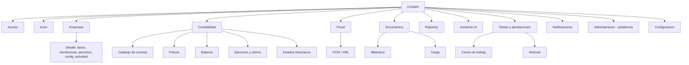
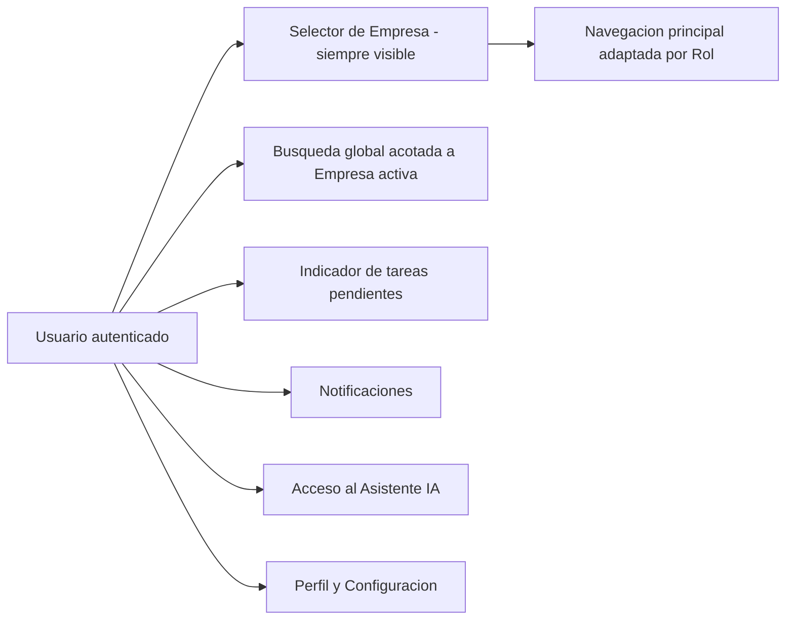
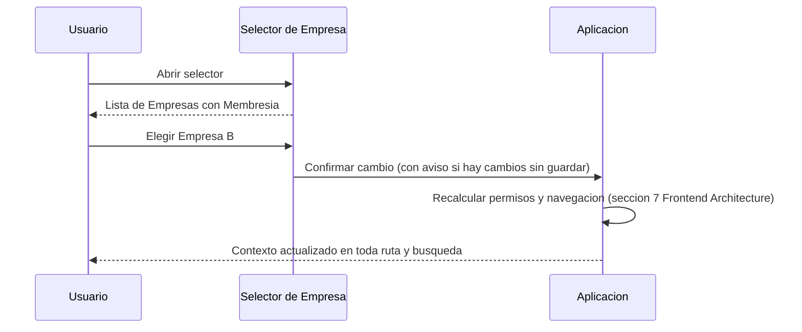
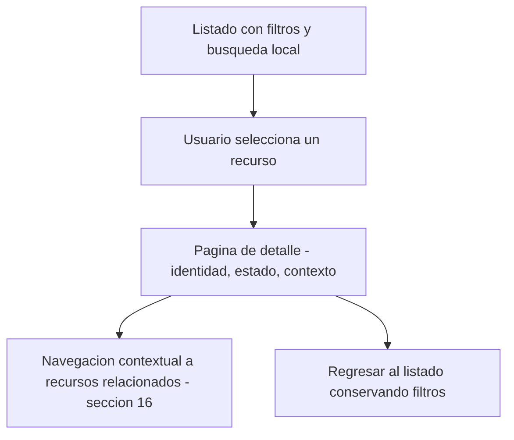
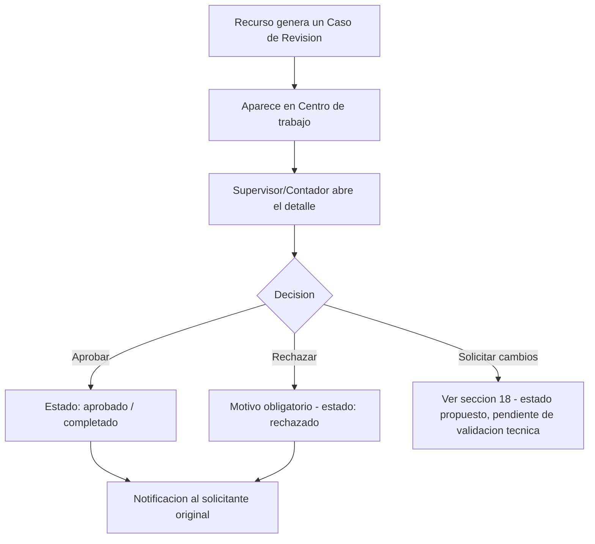
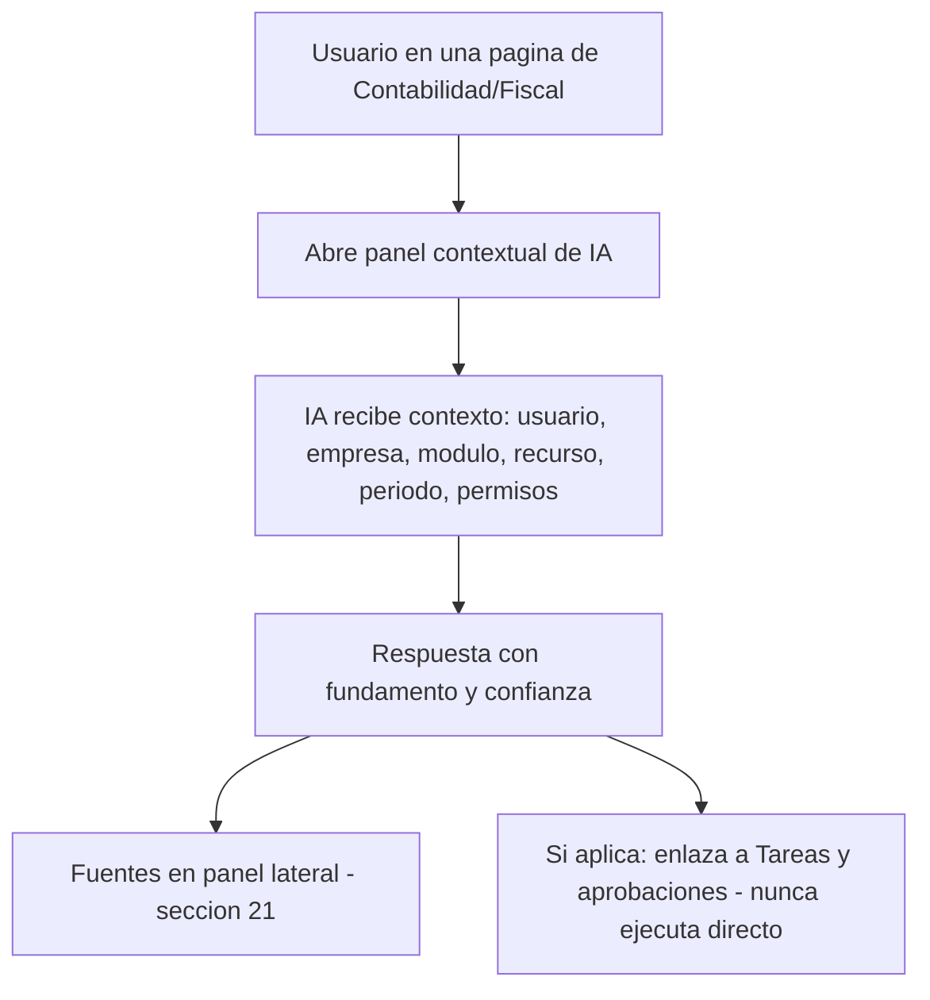
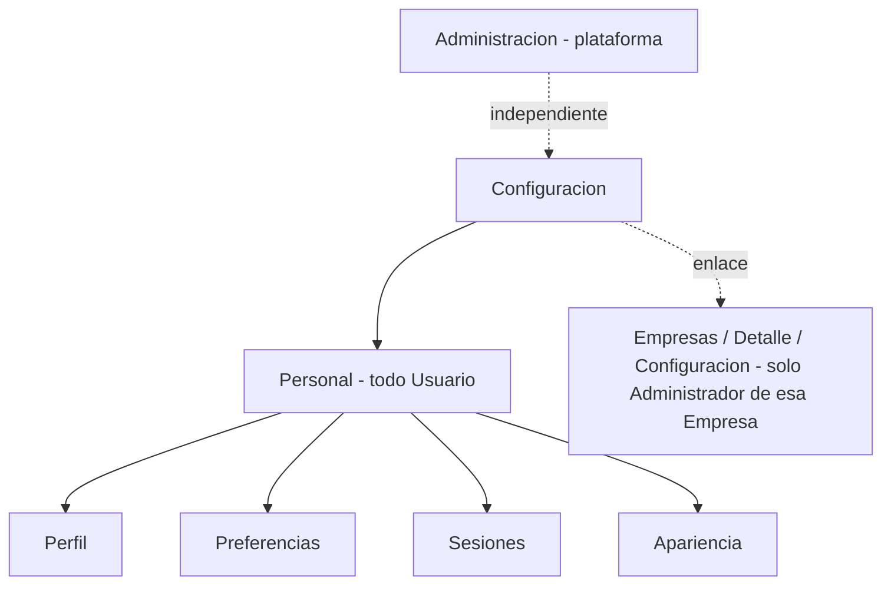

# Arquitectura de Información — ContaIA

## Control del documento

| Campo                                     | Valor                                                                                                                                                                                                                                                                                                                                                                                                                     |
| ----------------------------------------- | ------------------------------------------------------------------------------------------------------------------------------------------------------------------------------------------------------------------------------------------------------------------------------------------------------------------------------------------------------------------------------------------------------------------------- |
| Documento                                 | 14_INFORMATION_ARCHITECTURE.md                                                                                                                                                                                                                                                                                                                                                                                            |
| Orden de trabajo                          | AWO-010                                                                                                                                                                                                                                                                                                                                                                                                                   |
| Versión                                   | 1.0                                                                                                                                                                                                                                                                                                                                                                                                                       |
| **Estado**                                | **Draft v1.0**                                                                                                                                                                                                                                                                                                                                                                                                            |
| Fecha de creación                         | 2026-07-18                                                                                                                                                                                                                                                                                                                                                                                                                |
| Última actualización                      | 2026-07-18                                                                                                                                                                                                                                                                                                                                                                                                                |
| Fuentes de verdad                         | `MASTER_CONTEXT.md`, `docs/00_PRODUCT_VISION.md`, `docs/01_PRD.md`, `docs/02_USER_PERSONAS.md`, `docs/04_BUSINESS_RULES.md`, `docs/05_SYSTEM_DOMAIN_MODEL.md`, `docs/06_SYSTEM_WORKFLOWS.md`, `docs/07_SOFTWARE_ARCHITECTURE.md`, `docs/08_API_DESIGN.md`, `docs/09_DATABASE_DESIGN.md`, `docs/10_AI_ARCHITECTURE.md`, `docs/11_SECURITY_ARCHITECTURE.md`, `docs/12_FRONTEND_ARCHITECTURE.md`, `docs/13_DESIGN_SYSTEM.md` |
| Documentos que esta arquitectura alimenta | UX Flows (próximo, ver "Observaciones del Arquitecto")                                                                                                                                                                                                                                                                                                                                                                    |

> Nota sobre numeración: la Work Order pedía `docs/14_INFORMATION_ARCHITECTURE.md`, posición que ocupaba `docs/14_RAG_ARCHITECTURE.md` (placeholder vacío, ya anticipado como conflicto en las Observaciones de AWO-009). Se desplazó junto con los documentos siguientes (`docs/14` a `docs/20` → `docs/15` a `docs/21`) sin pérdida de contenido. Todas las referencias cruzadas del proyecto se actualizaron antes de escribir este contenido.

> Este documento define estructura de información y navegación conceptual. No diseña pantallas pixel por pixel, no genera componentes visuales (eso ya lo hace `docs/13_DESIGN_SYSTEM.md`) y no modifica la arquitectura técnica (`docs/07_SOFTWARE_ARCHITECTURE.md`, `docs/08_API_DESIGN.md`, `docs/09_DATABASE_DESIGN.md`).

---

## 1. Propósito y alcance

**Objetivo:** definir qué existe en ContaIA, cómo se organiza, cómo se nombra y cómo se llega a ello — el mapa completo que un Usuario recorre para encontrar qué puede hacer, dónde hacerlo, en qué Empresa está trabajando, qué está consultando, qué requiere aprobación y qué está pendiente.

**Alcance:** los once módulos frontend de `docs/12_FRONTEND_ARCHITECTURE.md` (sección 3), reorganizados en una taxonomía orientada al Usuario (sección 3 de este documento), su sitemap completo (sección 7), catálogo de páginas y rutas (secciones 40-41).

**Usuarios:** los diez de `docs/02_USER_PERSONAS.md`, operando con los seis Roles oficiales.

**Productos cubiertos:** aplicación web de ContaIA (escritorio y móvil) y el panel administrativo interno, como una misma arquitectura de información con superficies claramente separadas (sección 24).

**Relación con Frontend Architecture:** este documento no redefine módulos, estado ni comunicación con APIs (`docs/12_FRONTEND_ARCHITECTURE.md`, secciones 2-3, 5, 17) — les da estructura de navegación y contenido.

**Relación con Design System:** este documento no redefine componentes ni tokens (`docs/13_DESIGN_SYSTEM.md`) — usa sus componentes de navegación (sección 24 de ese documento) para construir el mapa real del producto.

**Responsabilidades de este documento:** taxonomía, sitemap, rutas conceptuales, patrones de página, búsqueda, permisos de navegación, nomenclatura.

**Exclusiones:** diseño visual final, código de enrutamiento, y cualquier decisión que amplíe el alcance del MVP más allá de `docs/01_PRD.md`.

## 2. Modelo mental de los usuarios

| Rol               | Objetivos                                                | Tareas frecuentes                                                             | Información prioritaria                                   | Lenguaje esperado                     | Riesgo de confusión                                                                         | Accesos principales                                                                   |
| ----------------- | -------------------------------------------------------- | ----------------------------------------------------------------------------- | --------------------------------------------------------- | ------------------------------------- | ------------------------------------------------------------------------------------------- | ------------------------------------------------------------------------------------- |
| **Administrador** | Configurar y controlar su(s) Empresa(s)                  | Invitar usuarios, configurar catálogo, cerrar Ejercicio                       | Estado general de la Empresa, pendientes de su equipo     | Administrativo, orientado a control   | Confundir Administración de plataforma con la de su propia Empresa (sección 24)             | Empresas, Configuración, Tareas y aprobaciones                                        |
| **Contador**      | Mantener la contabilidad correcta y aprobar con criterio | Capturar/aprobar Pólizas, consultar Estados Financieros, usar el Asistente IA | Pólizas pendientes, Balanza, respuestas fundamentadas     | Técnico-contable, preciso             | Perder de vista en qué Empresa está capturando (multiempresa)                               | Contabilidad, Fiscal, Asistente IA, Tareas y aprobaciones                             |
| **Auxiliar**      | Capturar y organizar sin fricción                        | Cargar CFDI/Documentos, capturar Pólizas en borrador                          | Documentos por procesar, Alertas de datos incompletos     | Operativo, simple                     | Confundir "guardado como borrador" con "enviado a revisión"                                 | Documentos, Fiscal, Contabilidad (borrador)                                           |
| **Supervisor**    | Revisar y decidir sobre lo sensible                      | Resolver Casos de Revisión, consultar evidencia                               | Cola de pendientes de aprobación, fundamento de cada caso | Claro, orientado a evidencia y riesgo | No encontrar el enlace directo al recurso que originó el caso                               | Tareas y aprobaciones, Auditoría (empresa)                                            |
| **Auditor**       | Verificar consistencia y evidencia sin alterar nada      | Consultar Trazabilidad, Pólizas, Estados Financieros                          | Historial completo, motivo de cada acción                 | Formal, orientado a evidencia         | Ver controles de escritura que no puede usar (deben estar ausentes, no solo deshabilitados) | Auditoría, Contabilidad (solo lectura), Fiscal (solo lectura)                         |
| **Estudiante**    | Aprender de forma práctica y segura                      | Explorar el Asistente IA en modo educativo                                    | Ejemplos, explicaciones, nunca datos reales               | Didáctico, accesible                  | Confundir el entorno simulado con datos reales de una Empresa                               | Asistente IA (modo educativo) — alcance de MVP pendiente, `docs/01_PRD.md` sección 21 |

## 3. Taxonomía principal

| Categoría                 | Por qué existe                                                                                                                                                                                                                                                                                                                   |
| ------------------------- | -------------------------------------------------------------------------------------------------------------------------------------------------------------------------------------------------------------------------------------------------------------------------------------------------------------------------------- |
| **Inicio**                | Punto de entrada y visión general; no duplica ningún módulo, resume varios (Contabilidad, Tareas, Notificaciones) para orientación rápida.                                                                                                                                                                                       |
| **Empresas**              | Gestión de la entidad de aislamiento (Organización/Empresa/Membresía/Ejercicio, `docs/05_SYSTEM_DOMAIN_MODEL.md`); existe porque administrar Empresas es una tarea distinta de operar dentro de una.                                                                                                                             |
| **Contabilidad**          | Operación diaria del núcleo contable (Catálogo, Pólizas, Balanza, Estados Financieros) — el trabajo recurrente de Contador y Auxiliar.                                                                                                                                                                                           |
| **Fiscal**                | Comprobantes fiscales (CFDI/XML) como dominio propio (`docs/05_SYSTEM_DOMAIN_MODEL.md`, contexto Fiscal), distinto de Documentos genéricos.                                                                                                                                                                                      |
| **Documentos**            | Repositorio genérico de archivos, separado de Fiscal porque no todo Documento es un CFDI (BR-DOC-001).                                                                                                                                                                                                                           |
| **Reportes**              | Empaquetado de datos ya calculados con fines de consulta histórica, comparación y exportación — **no duplica Contabilidad**: Contabilidad muestra el Estado Financiero vigente como parte de la operación; Reportes lo empaqueta para comparar periodos, exportar o consultar históricos (ver aclaración en sección 23).         |
| **Asistente IA**          | Superficie dedicada de conversación con los Agentes activos (`docs/10_AI_ARCHITECTURE.md`, sección 5), además de su integración contextual (sección 20).                                                                                                                                                                         |
| **Tareas y aprobaciones** | Cola centralizada de revisión humana — se eleva a categoría propia (no plegada dentro de Notificaciones) porque sostiene el principio fundamental del producto (revisión humana obligatoria) y porque `docs/08_API_DESIGN.md` ya la trata como grupo de recursos independiente (9.10 Approvals, distinto de 9.12 Notifications). |
| **Notificaciones**        | Alertas deterministas (BR-NOT) — distintas de Tareas y aprobaciones: una notificación informa, una tarea requiere una decisión.                                                                                                                                                                                                  |
| **Administración**        | Exclusivamente plataforma interna de ContaIA (soporte, cuentas agregadas) — **nunca** administración de una Empresa cliente, que vive en Empresas/Configuración (aclaración explícita, sección 24).                                                                                                                              |
| **Configuración**         | Ajustes personales y de Empresa que no son "operación" ni "administración de plataforma".                                                                                                                                                                                                                                        |

**Ningún módulo se duplica:** cada categoría tiene una responsabilidad exclusiva; donde dos categorías parecen solaparse (Contabilidad/Reportes, Empresas/Administración/Configuración), se aclara explícitamente el límite (secciones 23-24).

## 4. Navegación global

| Elemento               | Ubicación conceptual                         | Prioridad  | Comportamiento                                             | Permisos                                                                                                   | Móvil                                     |
| ---------------------- | -------------------------------------------- | ---------- | ---------------------------------------------------------- | ---------------------------------------------------------------------------------------------------------- | ----------------------------------------- |
| Selector de Empresa    | Barra superior, siempre visible              | Máxima     | Cambia el contexto completo (sección 9)                    | Todos (según sus Membresías)                                                                               | Visible, colapsado a nombre corto         |
| Navegación principal   | Barra lateral                                | Alta       | Adaptada por Rol (sección 5)                               | Filtrada por Rol                                                                                           | Colapsa a menú/drawer                     |
| Búsqueda global        | Barra superior                               | Alta       | Acotada a la Empresa activa (sección 13)                   | Filtrada por Rol y Empresa                                                                                 | Ícono que expande a pantalla completa     |
| Tareas pendientes      | Indicador en barra superior/lateral          | Alta       | Contador visible, enlaza al Centro de trabajo (sección 19) | Solo Roles con capacidad de aprobación ven el conteo de aprobación; todos ven sus propias tareas asignadas | Badge visible, lista accesible desde menú |
| Notificaciones         | Icono en barra superior                      | Media-alta | Panel desplegable + enlace al centro completo (sección 27) | Filtradas por Empresa y Rol                                                                                | Accesible desde menú                      |
| Acceso al Asistente IA | Botón persistente (barra lateral o flotante) | Alta       | Abre el módulo o un panel contextual (sección 20)          | Todos, con alcance de contenido por Rol                                                                    | Accesible, nunca oculto                   |
| Ayuda                  | Barra superior/perfil                        | Baja-media | Enlace a documentación de uso, no a contenido fiscal       | Todos                                                                                                      | Accesible desde menú de perfil            |
| Perfil                 | Barra superior                               | Media      | Acceso a Configuración personal (sección 25)               | Todos                                                                                                      | Accesible desde menú                      |
| Configuración          | Desde perfil o navegación principal          | Media      | Distingue personal vs. Empresa (sección 25)                | Filtrada por Rol                                                                                           | Accesible desde menú                      |

## 5. Navegación principal

| #   | Nombre                | Propósito                                  | Usuarios                                           | Permisos                             | Submódulos                                                  | Estado activo                   | Indicador                                | Responsive                                       |
| --- | --------------------- | ------------------------------------------ | -------------------------------------------------- | ------------------------------------ | ----------------------------------------------------------- | ------------------------------- | ---------------------------------------- | ------------------------------------------------ |
| 1   | Inicio                | Vista general                              | Todos                                              | Ninguno adicional                    | —                                                           | Resaltado al estar en `/inicio` | —                                        | Siempre visible                                  |
| 2   | Empresas              | Gestionar Organización/Empresas            | Administrador (gestión); todos (consulta)          | Ver sección 34                       | Listado, Detalle                                            | Resaltado en `/empresas/*`      | —                                        | Colapsa a icono en móvil                         |
| 3   | Contabilidad          | Operación contable                         | Contador, Auxiliar, Supervisor, Auditor (lectura)  | Ver sección 34                       | Catálogo, Pólizas, Balanza, Estados Financieros, Ejercicios | Resaltado en `/contabilidad/*`  | Conteo de Pólizas en borrador (opcional) | Prioridad alta en escritorio, accesible en móvil |
| 4   | Fiscal                | CFDI/XML                                   | Auxiliar, Contador, Auditor (lectura)              | Ver sección 34                       | Listado de CFDI                                             | Resaltado en `/fiscal/*`        | Conteo de campos ambiguos pendientes     | Prioridad alta                                   |
| 5   | Documentos            | Repositorio genérico                       | Auxiliar, Contador                                 | Ver sección 34                       | Biblioteca, Carga                                           | Resaltado en `/documentos/*`    | Conteo en procesamiento                  | Prioridad alta                                   |
| 6   | Reportes              | Consulta histórica/exportación             | Contador, Administrador, Auditor                   | Ver sección 34                       | Contables, Fiscales, Exportaciones                          | Resaltado en `/reportes/*`      | —                                        | Prioridad media en móvil                         |
| 7   | Asistente IA          | Conversación con Agentes                   | Todos                                              | Ver sección 34                       | Conversación, Historial                                     | Resaltado en `/asistente/*`     | —                                        | Siempre accesible                                |
| 8   | Tareas y aprobaciones | Cola de revisión humana                    | Contador, Supervisor (aprobación); todos (propias) | Ver sección 34                       | Centro de trabajo, Detalle                                  | Resaltado en `/tareas/*`        | Conteo de pendientes                     | Prioridad alta                                   |
| 9   | Notificaciones        | Alertas deterministas                      | Todos                                              | Ver sección 34                       | Centro                                                      | Resaltado en `/notificaciones`  | Conteo no leídas                         | Accesible siempre                                |
| 10  | Administración        | Plataforma interna (nunca Empresa cliente) | Administrador de plataforma exclusivamente         | Invisible para el resto (sección 24) | Soporte, Cuentas, Auditoría de plataforma                   | Resaltado en `/admin/*`         | —                                        | Oculto para Roles de Empresa                     |
| 11  | Configuración         | Ajustes personales/Empresa                 | Todos (personal); Administrador (Empresa)          | Ver sección 34                       | Personal, Empresa                                           | Resaltado en `/configuracion/*` | —                                        | Accesible desde perfil en móvil                  |

**Ningún nombre de menú usa terminología técnica interna** (nunca "Journal Entries", "Approvals" o "Memberships" expuestos — siempre "Pólizas", "Tareas y aprobaciones", "Miembros").

## 6. Navegación secundaria

| Módulo                | Pestañas/submenús                                | Filtros persistentes     | Vistas           | Acciones contextuales                | Breadcrumbs              |
| --------------------- | ------------------------------------------------ | ------------------------ | ---------------- | ------------------------------------ | ------------------------ |
| Empresas (Detalle)    | Datos generales, Miembros, Ejercicios, Actividad | —                        | —                | Invitar, editar, cerrar Ejercicio    | Empresas / [Nombre]      |
| Contabilidad          | Catálogo, Pólizas, Balanza, Estados Financieros  | Ejercicio/periodo activo | Listado, detalle | Aprobar, rechazar, ajustar           | Contabilidad / [Sección] |
| Fiscal                | (listado único, sin pestañas adicionales en MVP) | Periodo, estado          | Listado, detalle | Vincular a Póliza                    | Fiscal / [Folio]         |
| Documentos            | Biblioteca, Carga                                | Tipo, estado             | Listado          | Descargar, reintentar                | Documentos / [Nombre]    |
| Reportes              | Contables, Fiscales, Exportaciones               | Ejercicio/periodo        | Listado, visor   | Exportar                             | Reportes / [Reporte]     |
| Tareas y aprobaciones | Pendientes, Asignadas, Historial                 | Estado, tipo             | Cola, detalle    | Aprobar, rechazar, solicitar cambios | Tareas / [Caso]          |

**Cuándo usar cada patrón:**

| Patrón                 | Cuándo                                                                                                              |
| ---------------------- | ------------------------------------------------------------------------------------------------------------------- |
| Página completa        | Navegación principal entre módulos, listados extensos                                                               |
| Pestaña                | Subsecciones relacionadas del mismo recurso (Detalle de Empresa)                                                    |
| Modal                  | Confirmaciones y formularios breves que no requieren abandonar el contexto (`docs/13_DESIGN_SYSTEM.md`, sección 32) |
| Drawer / panel lateral | Detalle rápido sin perder el listado de fondo (por ejemplo, ver una Alerta desde su lista)                          |
| Página de detalle      | Recursos con suficiente información propia para justificar una URL dedicada (Póliza, CFDI, Empresa)                 |

## 7. Mapa completo del producto

```
Acceso
├── Iniciar sesión
├── Verificación
├── Recuperación de contraseña
├── Aceptar invitación
└── Selección inicial de Empresa

Inicio
├── Resumen
├── Pendientes (resumen, enlaza a Tareas y aprobaciones)
├── Alertas (resumen, enlaza a Notificaciones)
├── Actividad reciente
└── Accesos rápidos

Empresas
├── Listado
├── Alta
└── Detalle
    ├── Datos generales
    ├── Membresías
    ├── Permisos (vista de Roles asignados)
    ├── Configuración
    └── Actividad

Contabilidad
├── Catálogo de cuentas
├── Pólizas
│   └── Detalle de póliza (movimientos, evidencia, historial)
├── Balanza de comprobación
├── Ejercicios
│   └── Cierre de ejercicio
├── Estados financieros
└── Sugerencias contables (enlaza a Tareas y aprobaciones cuando requieren decisión)

Fiscal
├── CFDI
│   └── Detalle de CFDI (datos extraídos, advertencias, vínculo a Póliza)
└── XML (mismo listado que CFDI; "XML" es el formato, no una categoría separada — ver sección 30)

Documentos
├── Biblioteca
├── Carga
└── Detalle de documento (estado, evidencia, descarga)

Reportes
├── Contables
├── Fiscales
├── Financieros (Estados Financieros empaquetados para comparación/exportación)
├── Exportaciones (historial de exportaciones)
└── Programados (fase intermedia)

Asistente IA
├── Conversación
├── Historial
└── Fuentes (panel contextual, no una página independiente — sección 21)

Tareas y aprobaciones
├── Centro de trabajo (pendientes, asignadas, procesándose, alertas — sección 19)
├── Enviadas (propias, para quien capturó)
├── Historial (aprobadas, rechazadas, vencidas, canceladas)
└── Detalle de tarea/caso de revisión

Notificaciones
├── Centro
└── Preferencias

Administración (exclusivo plataforma)
├── Soporte a cuentas
├── Cuentas (listado agregado)
└── Auditoría de plataforma

Configuración
├── Personal (perfil, preferencias, idioma, zona horaria, apariencia, sesiones)
└── Empresa (atajo a Empresas/Detalle/Configuración para el Administrador)
```



## 8. Arquitectura de rutas

Patrón general: `/{companyId}/{modulo}/{recurso}/{recursoId}/{accion}` — la Empresa activa **siempre** forma parte de la ruta (coherente con `docs/08_API_DESIGN.md`, sección 5: nunca contexto implícito).

| Tipo                                     | Patrón conceptual                                                                                                    |
| ---------------------------------------- | -------------------------------------------------------------------------------------------------------------------- |
| Autenticación                            | `/acceso/iniciar-sesion`, `/acceso/verificar`, `/acceso/recuperar` (sin `companyId`, ocurre antes de tener contexto) |
| Empresa activa / selección               | `/seleccionar-empresa` (sin `companyId`); después, todo enlaza con `{companyId}`                                     |
| Módulo (listado)                         | `/{companyId}/contabilidad/polizas`                                                                                  |
| Detalle                                  | `/{companyId}/contabilidad/polizas/{polizaId}`                                                                       |
| Edición                                  | `/{companyId}/contabilidad/polizas/{polizaId}/editar` (solo si `DRAFT`)                                              |
| Creación                                 | `/{companyId}/contabilidad/polizas/nueva`                                                                            |
| Tareas                                   | `/{companyId}/tareas/{casoId}`                                                                                       |
| IA                                       | `/{companyId}/asistente/{conversationId}`                                                                            |
| Administración (plataforma, sin Empresa) | `/admin/soporte`, `/admin/cuentas`                                                                                   |

**Convenciones:** rutas estables (un recurso conserva su URL mientras exista); identificadores opacos (UUID, nunca secuenciales — coherente con `docs/09_DATABASE_DESIGN.md`); rutas profundas accesibles directamente (un enlace a una Póliza específica funciona sin pasar por el listado); parámetros de consulta para filtros no esenciales a la identidad del recurso (`?estado=pendiente`); navegación directa siempre revalida permisos en servidor (nunca se asume que un enlace antiguo sigue siendo válido); enlaces compartibles funcionan solo si el destinatario tiene su propia Membresía autorizada (BR-GLB-001 — un enlace nunca es, por sí mismo, una prueba de acceso); estado "no encontrado" (sección 29) cuando el recurso no existe o no pertenece a la Empresa de la ruta; estado "acceso denegado" cuando existe pero el Rol no autoriza — **ambos casos se distinguen visualmente, pero ninguno revela más información de la necesaria** (coherente con `docs/11_SECURITY_ARCHITECTURE.md`, sección 12: no filtrar existencia de un recurso ajeno).

## 9. Contexto multiempresa

- **Selector:** siempre visible en la barra superior (sección 4).
- **Persistencia:** la Empresa activa persiste durante la sesión y se refleja en cada ruta (sección 8).
- **Cambio:** acción explícita de confirmación (`docs/13_DESIGN_SYSTEM.md`, sección 25).
- **Confirmación:** requerida antes de perder contexto de un formulario no guardado.
- **Permisos:** se recalculan de inmediato al cambiar de Empresa (`docs/12_FRONTEND_ARCHITECTURE.md`, sección 7).
- **Datos en pantalla:** ninguna vista mezcla datos de dos Empresas — incluso comparaciones futuras entre Empresas (fuera del MVP) deberían mostrarlas en paneles claramente separados, nunca fusionados.
- **Advertencias:** las confirmaciones de acciones sensibles nombran explícitamente la Empresa afectada (`docs/13_DESIGN_SYSTEM.md`, sección 32).
- **Rutas:** la Empresa activa es parte de la URL (sección 8), no un estado oculto.
- **Búsqueda:** acotada a la Empresa activa (sección 13).
- **IA:** el contexto de conversación se ancla a la Empresa activa (sección 20).
- **Descargas y exportaciones:** el archivo generado indica la Empresa de origen en su propio contenido, no solo en la interfaz.
- **Tareas:** el Centro de trabajo (sección 19) muestra únicamente pendientes de la Empresa activa.

## 10. Arquitectura de páginas

| Tipo              | Propósito                                               | Estructura                                                    | Navegación                           | Acciones                             | Permisos                                                       |
| ----------------- | ------------------------------------------------------- | ------------------------------------------------------------- | ------------------------------------ | ------------------------------------ | -------------------------------------------------------------- |
| Dashboard         | Visión general                                          | Tarjetas priorizadas (`docs/13_DESIGN_SYSTEM.md`, sección 22) | Enlaces a módulos de origen          | Ninguna directa, solo navegación     | Filtrado por Rol                                               |
| Listado           | Explorar una colección                                  | Título, acción principal, filtros, tabla (sección 11)         | A detalle o creación                 | Crear, exportar, acciones masivas    | Ver sección 34                                                 |
| Detalle           | Ver/operar un recurso específico                        | Identidad, estado, pestañas, actividad (sección 12)           | A recursos relacionados              | Según estado y Rol                   | Ver sección 34                                                 |
| Creación          | Capturar un recurso nuevo                               | Formulario, posiblemente por pasos                            | Cancelar vuelve al listado           | Guardar borrador, enviar             | Rol con permiso de captura                                     |
| Edición           | Modificar un recurso existente (solo estados editables) | Igual que creación, precargado                                | —                                    | Guardar, cancelar                    | Rol con permiso de edición sobre ese estado                    |
| Configuración     | Ajustar parámetros                                      | Secciones agrupadas (sección 25)                              | —                                    | Guardar                              | Administrador (Empresa) o el propio Usuario (personal)         |
| Revisión          | Examinar antes de decidir                               | Comparación/resumen, evidencia                                | A la evidencia y al recurso original | Ninguna de escritura directa         | Rol de aprobación                                              |
| Aprobación        | Decidir sobre una tarea                                 | Igual que revisión + acciones de decisión                     | —                                    | Aprobar, rechazar, solicitar cambios | Rol de aprobación específico                                   |
| Reporte           | Consultar datos empaquetados                            | Encabezado de contexto (Empresa/periodo), cuerpo de datos     | Exportar, comparar                   | Exportar                             | Rol con permiso de lectura de Reportes                         |
| Historial         | Consultar eventos pasados                               | Línea de tiempo o tabla cronológica                           | A cada evento/recurso                | Ninguna de escritura                 | Auditor, Supervisor, Administrador                             |
| Asistente         | Conversar con IA                                        | Hilo de conversación (`docs/13_DESIGN_SYSTEM.md`, sección 27) | A fuentes y tareas relacionadas      | Preguntar, marcar para revisión      | Todos, alcance por Rol                                         |
| Estado de proceso | Seguir una operación asíncrona                          | Indicador de estado, resultado al completar                   | Al recurso resultante                | Cancelar (si aplica), reintentar     | Quien inició el proceso + Roles con visibilidad de esa Empresa |

## 11. Listados

Patrón único aplicado a Empresas, CFDI, Documentos, Pólizas, Cuentas, Usuarios, Tareas, Sugerencias, Reportes, Auditoría: **título** (nombre de la colección) → **descripción breve** (opcional, cuando el propósito no es obvio) → **acción principal** (crear/cargar, si aplica al Rol) → **búsqueda local** (sección 14) → **filtros** (sección 15) → **tabla** (`docs/13_DESIGN_SYSTEM.md`, sección 19) → **selección y acciones masivas** (cuando aplique) → **paginación** → **vistas guardadas** (sección 35, fase intermedia) → **estado vacío** (sección 29) → **estado de error** (sección 29).

## 12. Páginas de detalle

Patrón único: **identidad del recurso** (tipo + identificador legible, nunca solo un UUID) → **estado** (badge semántico) → **contexto empresarial** (Empresa, y Ejercicio/periodo si aplica) → **resumen** (datos clave sin necesidad de navegar más) → **pestañas** (cuando el recurso tiene múltiples dimensiones) → **actividad** (extracto de Trazabilidad relevante) → **evidencias** (documentos/fuentes vinculados) → **acciones** (según estado y Rol) → **historial** (versiones/ajustes previos) → **recursos relacionados** (navegación contextual, sección 16).

| Ejemplo                  | Particularidad                                                                                                         |
| ------------------------ | ---------------------------------------------------------------------------------------------------------------------- |
| Detalle de CFDI          | Datos extraídos con campos ambiguos resaltados; enlace a Documento origen y a Póliza vinculada                         |
| Detalle de Póliza        | Movimientos (cargo/abono), estado de aprobación, Documento origen si existe, historial de ajustes                      |
| Detalle de Documento     | Estado de procesamiento, vínculo a CFDI si aplica, descarga                                                            |
| Detalle de Empresa       | Pestañas (sección 6), sin mezclar nunca datos de otra Empresa                                                          |
| Detalle de Sugerencia IA | Respuesta, fundamento, fuentes, nivel de confianza, acciones de aprobación (`docs/13_DESIGN_SYSTEM.md`, sección 27-28) |
| Detalle de Tarea         | Recurso afectado, motivo (si fue rechazada), responsable, plazo si existe                                              |

## 13. Búsqueda global

Localiza: Empresas (solo las propias), CFDI, Documentos, Pólizas, Cuentas, Usuarios (de la Empresa activa), Reportes, Conversaciones de IA, Tareas, y fundamentos normativos (contenido de `knowledge/`, resultado distinto — ver abajo).

- **Alcance:** acotado a la Empresa activa para todo lo operativo; el contenido normativo (`knowledge/`) es global por naturaleza (no pertenece a una Empresa) y se muestra en una sección de resultados **claramente separada y etiquetada**, nunca mezclada con resultados de datos de la Empresa (instrucción explícita: "no mezcles resultados de empresas sin indicarlo claramente" — aquí extendido a "nunca mezcles resultados operativos con normativos sin indicarlo").
- **Permisos:** un resultado solo aparece si el Rol del Usuario tiene permiso de verlo (sección 34) — la búsqueda nunca revela la existencia de un recurso que el Usuario no podría abrir directamente.
- **Empresa activa:** visible en el encabezado de resultados, para que el Usuario sepa en qué contexto está buscando.
- **Filtros:** por tipo de recurso, tras la búsqueda inicial.
- **Resultados:** agrupados por tipo de recurso (sección abajo).
- **Recientes:** accesos recientes del propio Usuario, mostrados antes de escribir una consulta.
- **Vacíos:** ver sección 29.
- **Accesibilidad:** navegable por teclado, resultados anunciados por lector de pantalla.
- **Seguridad:** ninguna consulta de búsqueda ni sus resultados se registran con contenido sensible completo en observabilidad (`docs/12_FRONTEND_ARCHITECTURE.md`, sección 19).

## 14. Búsqueda dentro de módulos

Se usa cuando el Usuario ya está en un listado extenso y quiere acotarlo sin salir del módulo (por ejemplo, buscar una Cuenta dentro del Catálogo). **Comportamiento:** filtra la tabla visible en tiempo real o tras confirmar. **Filtros:** se combina con los filtros ya activos (sección 15), no los reemplaza. **Persistencia:** el término de búsqueda persiste mientras el Usuario permanece en esa vista, se limpia al salir. **Parámetros:** reflejado en la URL como parámetro de consulta (sección 8), para permitir compartir la vista filtrada. **Cero resultados:** mensaje específico dentro de la tabla (sección 29), no una redirección. **Restablecimiento:** acción explícita de "limpiar búsqueda".

## 15. Filtros

| Tipo de filtro    | Aplica a                                                                                |
| ----------------- | --------------------------------------------------------------------------------------- |
| Periodos / fechas | Pólizas, CFDI, Reportes, Auditoría                                                      |
| Estados           | Pólizas, Documentos, CFDI, Tareas                                                       |
| Empresa           | Solo relevante en vistas de Administración de plataforma (listado agregado, sección 24) |
| Usuario           | Auditoría, Tareas asignadas                                                             |
| RFC               | CFDI                                                                                    |
| Tipo de documento | Documentos                                                                              |
| Monto             | Pólizas, CFDI, Reportes                                                                 |
| Riesgo            | Tareas, Sugerencias IA (`REQUIRES_REVIEW`)                                              |
| Aprobación        | Tareas y aprobaciones                                                                   |
| Origen            | CFDI (manual vs. vinculado), Trazabilidad                                               |

**Filtros rápidos:** los 2-3 más usados por módulo, siempre visibles. **Avanzados:** el resto, en un panel expandible. **Activos:** mostrados como chips removibles individualmente. **Guardados y compartidos:** fase intermedia (`docs/13_DESIGN_SYSTEM.md`, sección 35), nunca comparten datos entre Empresas distintas aunque el Usuario tenga acceso a varias. **Eliminación:** un botón "limpiar todos" siempre disponible cuando hay filtros activos. **Móvil:** filtros avanzados colapsan a una hoja/panel de pantalla completa.

## 16. Navegación contextual

| Desde           | Hacia                                  | Mecanismo                                                                                         |
| --------------- | -------------------------------------- | ------------------------------------------------------------------------------------------------- |
| CFDI            | Documento origen                       | Enlace directo en el detalle de CFDI                                                              |
| Documento       | Su validación/estado de procesamiento  | Indicador de estado clicable dentro del propio Documento                                          |
| Sugerencia IA   | Póliza propuesta                       | Botón "Ver propuesta" dentro de la tarjeta de sugerencia (`docs/13_DESIGN_SYSTEM.md`, sección 28) |
| Tarea           | Recurso afectado                       | Enlace directo desde el detalle de la tarea (sección 12)                                          |
| Reporte         | Datos origen (Pólizas que lo componen) | Enlace desde totales/cifras hacia el detalle subyacente cuando sea técnicamente viable            |
| Conversación IA | Evidencia/fuente citada                | Panel contextual (sección 21), sin abandonar la conversación                                      |

**El Usuario nunca necesita regresar manualmente al menú principal** para moverse entre recursos relacionados — cada página de detalle contiene sus propios enlaces salientes (instrucción explícita).

## 17. Breadcrumbs

**Cuándo aparecen:** en toda página de detalle, edición o creación (nunca en Inicio ni en el nivel superior de un módulo, donde no aportan valor). **Profundidad:** máximo 3-4 niveles (Módulo / Sub-sección / Recurso), coherente con el principio de profundidad de navegación controlada. **Etiquetas:** el nombre real del recurso cuando existe (por ejemplo, el nombre de la Empresa), no su identificador técnico. **Comportamiento:** cada nivel es un enlace funcional, no solo texto informativo. **Empresa activa:** no se repite en el breadcrumb (ya vive en el selector global, sección 4) para no duplicar información. **Móvil:** se trunca al nivel inmediato anterior con posibilidad de expandir. **Accesibilidad:** estructura semántica de navegación con el nivel actual marcado como tal para lectores de pantalla. **Los breadcrumbs no sustituyen una navegación principal clara** (instrucción explícita) — son un complemento de orientación, no el mecanismo primario para moverse por la aplicación.

## 18. Tareas y aprobaciones

Arquitectura centralizada para revisiones, aprobaciones, rechazos, solicitudes de cambio, asignaciones, vencimientos y prioridades — toda tarea **enlaza siempre al recurso afectado** (sección 12).

**Reconciliación de estados:** la Work Order pide nueve estados conceptuales. El modelo de datos ya aprobado (`docs/09_DATABASE_DESIGN.md`, entidad CasoDeRevisión; BR-TRZ-003) define tres: `PENDING`, `APPROVED`, `REJECTED`. Este documento no contradice ese modelo — distingue explícitamente qué estados ya existen y cuáles son una extensión conceptual de interfaz que requeriría validación técnica antes de implementarse:

| Estado (Work Order) | Origen                                                                                                                                                                                                                                                   |
| ------------------- | -------------------------------------------------------------------------------------------------------------------------------------------------------------------------------------------------------------------------------------------------------- |
| `pending`           | Ya aprobado — `CasoDeRevisión.status = PENDING`                                                                                                                                                                                                          |
| `assigned`          | Presentación de `pending` con responsable explícito — ya implícito en BR-NOT-002 (alerta dirigida al Rol responsable), no un estado de datos nuevo                                                                                                       |
| `in_review`         | Estado transitorio de interfaz (alguien tiene el caso abierto) — no necesariamente persistido en el backend actual                                                                                                                                       |
| `changes_requested` | **No existe en el modelo aprobado** — hoy solo hay `rejected` con motivo; se propone aquí como una variante de interfaz de un rechazo con motivo de tipo "requiere ajustes", pendiente de validación técnica antes de tratarse como estado real distinto |
| `approved`          | Ya aprobado — `CasoDeRevisión.status = APPROVED`                                                                                                                                                                                                         |
| `rejected`          | Ya aprobado — `CasoDeRevisión.status = REJECTED`                                                                                                                                                                                                         |
| `completed`         | Corresponde al estado `applied` de una Sugerencia de IA (`docs/10_AI_ARCHITECTURE.md`, sección 11) o a una Póliza `DEFINITIVE`                                                                                                                           |
| `expired`           | Ya anticipado como pendiente de validación de negocio en `docs/10_AI_ARCHITECTURE.md` (sección 11)                                                                                                                                                       |
| `cancelled`         | **No existe en el modelo aprobado** — se documenta aquí como necesidad de interfaz, pendiente de validación técnica                                                                                                                                      |

Esta tabla se traslada como pregunta pendiente a la sección 44 y a `brain/QUESTIONS.md` en una tarea futura — no se asume que `changes_requested` y `cancelled` ya son estados de datos reales.

## 19. Centro de trabajo

**Decisión:** el Centro de trabajo es la **página de entrada del módulo "Tareas y aprobaciones"**, no una fusión con Inicio ni un módulo adicional distinto.

**Justificación:** Inicio (sección 7) es una vista de **orientación** de alcance amplio (resume Contabilidad, Tareas y Notificaciones a la vez); el Centro de trabajo es una vista de **ejecución** enfocada exclusivamente en lo que requiere acción del Usuario (pendientes, asignadas, procesándose, sugerencias de IA, cierres, alertas relevantes para decisión, actividad reciente de aprobación). Fusionarlo con Inicio sobrecargaría la página de orientación con contenido operativo (violando el principio de densidad controlada de `docs/13_DESIGN_SYSTEM.md`); convertirlo en un módulo separado de "Tareas y aprobaciones" habría creado un duodécimo elemento de navegación sin necesidad, dado que ya existe la categoría "Tareas y aprobaciones" (sección 3) que necesita, de todos modos, una página de entrada. Inicio, por su parte, muestra un **resumen enlazado** al Centro de trabajo (tarjeta "Pendientes"), no una duplicación de su contenido completo.

## 20. Integración del asistente IA

| Dónde aparece                  | Tipo                                                                                          |
| ------------------------------ | --------------------------------------------------------------------------------------------- |
| Módulo dedicado (Asistente IA) | Conversación completa, historial                                                              |
| Panel contextual               | Dentro de Contabilidad/Fiscal, para preguntar sobre el recurso actual sin abandonar la página |
| Acciones dentro de recursos    | "Explicar esta póliza", "¿Por qué este CFDI tiene una advertencia?"                           |
| Ayuda en formularios           | Sugerencia contextual durante la captura, sin bloquear el flujo                               |
| Explicación de errores         | Vínculo desde un mensaje de error de negocio hacia una explicación ampliada                   |
| Análisis de documentos         | Resultado de extracción de CFDI presentado con el mismo lenguaje de fundamento que el chat    |
| Sugerencias                    | Tarjetas de sugerencia (sección 12, `docs/13_DESIGN_SYSTEM.md` sección 28)                    |

**Contexto mantenido en toda superficie de IA:** Usuario, Empresa activa, módulo, recurso actual (si aplica), Ejercicio/periodo, y permisos del Rol — exactamente el contexto que `docs/10_AI_ARCHITECTURE.md` (sección 24) exige que la aplicación entregue a la IA a través de contratos, nunca por acceso directo. **La IA nunca accede automáticamente a información no autorizada** — el panel contextual solo puede referenciar lo que el Rol del Usuario ya podría ver por sí mismo en esa pantalla.

## 21. Fuentes y fundamentos

Las fuentes se abren en un **panel lateral o modal** (sección 6) desde cualquier respuesta o sugerencia — nunca navegando a una página completamente distinta que haga perder el contexto de la conversación o el recurso en revisión. El panel muestra: fuente, institución, artículo/apartado, vigencia, y un enlace a "ver contradicciones" cuando el Agente supervisor de calidad detectó más de una fuente aplicable (`docs/10_AI_ARCHITECTURE.md`, sección 8). Cerrar el panel regresa exactamente al punto de la conversación o revisión donde el Usuario estaba.

## 22. Documentos y archivos

La biblioteca de Documentos **no replica un explorador de archivos tradicional** (instrucción explícita) — los Contadores y Auxiliares piensan en términos de "tipo de documento" y "periodo/cliente", no de carpetas anidadas. Organización: por **tipo** (CFDI, PDF, otros), **periodo/Ejercicio**, y **estado de procesamiento** (sección 26 de `docs/13_DESIGN_SYSTEM.md`) — como filtros combinables sobre una lista única, no como jerarquía de carpetas navegable. Etiquetas y categorías son metadatos filtrables, no ubicaciones. La relación con CFDI es directa (un Documento XML procesado expone su CFDI vinculado). Versiones: no aplica en el MVP (los Documentos no se editan, BR-INT-002); "archivo" (histórico) es simplemente un filtro de antigüedad/Ejercicio cerrado, no una sección físicamente distinta.

## 23. Reportes

| Tipo          | Contenido                                                                               |
| ------------- | --------------------------------------------------------------------------------------- |
| Predefinidos  | Balanza, Estados Financieros — generados bajo demanda desde datos ya calculados (BR-EF) |
| Recientes     | Últimos generados por el Usuario                                                        |
| Favoritos     | Fase intermedia                                                                         |
| Programados   | Fase intermedia (`docs/13_DESIGN_SYSTEM.md`, sección 43)                                |
| Generándose   | Estado de Job visible (sección 28)                                                      |
| Disponibles   | Completados, listos para consulta/exportación                                           |
| Fallidos      | Con motivo y opción de reintentar                                                       |
| Exportaciones | Historial de archivos generados, con vigencia de descarga                               |

Cada reporte muestra siempre: **Empresa, periodo/Ejercicio, fecha de generación, origen (predefinido/personalizado), estado, y responsable** (quién lo generó) — coherente con BR-EF-003.

**Aclaración de la relación con Contabilidad (sección 3):** un mismo Estado Financiero puede consultarse desde Contabilidad (vista operativa del Ejercicio vigente) o generarse como Reporte (empaquetado, comparable, exportable, con snapshot de fecha) — son dos superficies sobre el mismo dato subyacente, no dos fuentes de verdad distintas.

## 24. Administración

**Separación explícita en tres niveles**, para prevenir exactamente la ambigüedad que la Work Order advierte evitar:

1. **Administración de Empresa** — vive en **Empresas → Detalle → Configuración/Membresías** (sección 7); la ejecuta el Rol Administrador de esa Empresa; nunca aparece bajo el nombre "Administración" en el menú principal, para no confundirse con el punto 3.
2. **Configuración personal** — vive en **Configuración → Personal** (sección 7); la ejecuta cualquier Usuario sobre sí mismo.
3. **Administración de plataforma** — vive exclusivamente en el módulo **Administración** del menú principal (sección 5); la ejecuta solo el Rol Administrador de plataforma; **invisible en la navegación para cualquier Usuario sin ese Rol** — no oculto por CSS, ausente de la estructura de navegación que se entrega al cliente (coherente con `docs/11_SECURITY_ARCHITECTURE.md`, sección 21: ocultar no es autorizar, pero la ausencia estructural reduce superficie de exposición).

## 25. Configuración

| Sección        | Alcance                                                                                                        | Quién accede                                                                  |
| -------------- | -------------------------------------------------------------------------------------------------------------- | ----------------------------------------------------------------------------- |
| Personal       | Perfil, preferencias, idioma, zona horaria, apariencia, sesiones activas                                       | El propio Usuario                                                             |
| Empresa        | Datos generales, catálogo base                                                                                 | Administrador de esa Empresa                                                  |
| Seguridad      | MFA, sesiones, revocación                                                                                      | El propio Usuario (personal); Administrador (a nivel Empresa, ver Membresías) |
| Notificaciones | Preferencias de qué recibir y cómo                                                                             | El propio Usuario                                                             |
| Integraciones  | Reservado — sin integraciones activas en el MVP (`docs/11_SECURITY_ARCHITECTURE.md`, sección 20)               | Administrador (cuando exista)                                                 |
| Fiscal         | Reservado para configuración fiscal de la Empresa (fuera de alcance operativo profundo del MVP)                | Administrador                                                                 |
| Contable       | Configuración de Catálogo base (enlaza a Contabilidad)                                                         | Administrador, Contador                                                       |
| Apariencia     | Modo claro/oscuro (`docs/13_DESIGN_SYSTEM.md`, sección 6)                                                      | El propio Usuario                                                             |
| Privacidad     | Información sobre uso de datos, sin constituir asesoría legal (`docs/11_SECURITY_ARCHITECTURE.md`, sección 35) | El propio Usuario                                                             |

## 26. Auditoría

Estructura legible para **Roles autorizados no necesariamemente técnicos** (Auditor, Supervisor, Administrador) — instrucción explícita. Se presenta como una línea de tiempo o tabla cronológica con lenguaje natural ("Mariana aprobó la Póliza #1234 el 18 de julio de 2026 a las 14:30"), no como un volcado de campos técnicos. Incluye: actor, Empresa, recurso, acción, fecha, resultado, origen, y motivo cuando existe (BR-TRZ-001, extendido en `docs/11_SECURITY_ARCHITECTURE.md` sección 9). Filtros: por actor, recurso, rango de fechas, tipo de acción. Exportación: disponible para Auditor y Administrador. Detalle: cada evento es expandible a su información completa sin salir de la vista cronológica.

## 27. Notificaciones

Clasificación: por **importancia** (crítica/alta/media/baja, coherente con `docs/11_SECURITY_ARCHITECTURE.md` sección 30), **estado** (pendiente/atendida), **módulo de origen**, **Empresa** (siempre la activa, sección 9), y **fecha**. El centro de notificaciones agrupa por relevancia primero, cronología después — nunca solo cronológico cuando existen notificaciones críticas antiguas sin atender.

## 28. Estados del sistema

Todo proceso asíncrono (Job, `docs/12_FRONTEND_ARCHITECTURE.md` sección 11) permanece localizable desde el **Centro de trabajo** (sección 19) o el **indicador persistente de tareas pendientes** (sección 4), **incluso si el Usuario navegó a otra pantalla mientras el proceso corría** (instrucción explícita) — un proceso nunca se "pierde" por cambiar de vista. Estados: pendiente, procesando, completado, fallido, observado, rechazado, cancelado, expirado — cada uno con su badge semántico (`docs/13_DESIGN_SYSTEM.md`, sección 5) y acción disponible cuando aplica (reintentar, ver resultado, ver motivo).

## 29. Estados vacíos, error y acceso denegado

| Estado                                                                                               | Siguiente paso ofrecido                                           |
| ---------------------------------------------------------------------------------------------------- | ----------------------------------------------------------------- |
| Sin datos                                                                                            | Acción para crear/cargar el primero                               |
| Sin resultados (búsqueda/filtro)                                                                     | Sugerencia de ajustar términos o limpiar filtros                  |
| Sin permisos                                                                                         | Explicación del Rol requerido, sin exponer el contenido bloqueado |
| Recurso eliminado (solo aplica a no confirmados, BR-INT-002)                                         | Volver al listado correspondiente                                 |
| Empresa suspendida (fuera de alcance funcional del MVP)                                              | Contacto con soporte                                              |
| Sesión expirada                                                                                      | Reautenticación con retorno a la página original                  |
| Ruta inexistente (404)                                                                               | Enlace a Inicio y a búsqueda global                               |
| Módulo no disponible (Rol sin acceso)                                                                | Mensaje claro, sin listar qué existiría con otro Rol              |
| Límite de plan (fuera de alcance del MVP — modelo de negocio pendiente, `docs/01_PRD.md` sección 19) | Reservado para cuando exista                                      |
| Mantenimiento                                                                                        | Expectativa de tiempo si está disponible                          |

## 30. Etiquetas y nomenclatura

Reglas: lenguaje comprensible para usuarios mexicanos, sin tecnicismos internos (`journal entry` → "Póliza"; `membership` → "Miembro"/"Membresía" solo en contexto administrativo, nunca en navegación cotidiana), sin anglicismos innecesarios (se usa "Panel" no "Dashboard" de cara al Usuario, aunque el equipo interno use "Dashboard" en documentación técnica), sin etiquetas ambiguas (nunca "Datos" como nombre de sección sin calificar de qué), y **una sola palabra por acción en toda la aplicación** (siempre "Aprobar", nunca alternar con "Confirmar" para la misma acción de negocio). "XML" y "CFDI" se tratan como el mismo listado de cara al Usuario (sección 7) — XML es el formato técnico del archivo, CFDI es el concepto de negocio que el Usuario reconoce; el menú usa "CFDI".

## 31. Arquitectura de contenido

Jerarquía: **título** (qué es esta pantalla) → **subtítulo/descripción** (solo si el título no basta) → **ayuda contextual** (breve, junto al elemento que la necesita, no en un bloque separado) → **instrucciones** (solo en flujos de varios pasos) → **advertencias** (antes de la acción que las provoca, nunca después) → **fundamentos** (sección 21, en panel dedicado) → **vacíos/errores/confirmaciones** (secciones 29, `docs/13_DESIGN_SYSTEM.md` secciones 31-32). **Prioriza contenido breve y contextual** (instrucción explícita) — ningún bloque de texto largo reemplaza una estructura de interfaz clara.

## 32. Accesibilidad de navegación

Alineado con WCAG 2.2 AA (`docs/13_DESIGN_SYSTEM.md`, sección 34): navegación completa por teclado entre módulos, páginas y componentes de esta arquitectura; landmarks semánticos (navegación principal, contenido, búsqueda) para lectores de pantalla; jerarquía de encabezados consistente con la jerarquía de la sección 31; foco visible y predecible al navegar entre páginas; salto directo al contenido principal (skip link) antes de la navegación repetitiva; menús y pestañas navegables por teclado; breadcrumbs con semántica de navegación; búsqueda accesible (sección 13); modales con foco atrapado (`docs/13_DESIGN_SYSTEM.md`, sección 34).

## 33. Responsive

| Elemento                                                           | Escritorio/laptop                 | Tablet                 | Móvil                                                                                                                     |
| ------------------------------------------------------------------ | --------------------------------- | ---------------------- | ------------------------------------------------------------------------------------------------------------------------- |
| Navegación principal                                               | Barra lateral fija                | Colapsable             | Drawer/menú                                                                                                               |
| Selector de Empresa                                                | Siempre visible en barra superior | Igual                  | Igual, con nombre corto                                                                                                   |
| Tablas                                                             | Completas                         | Columnas priorizadas   | Tarjetas apiladas                                                                                                         |
| Formularios extensos                                               | Multi-columna donde aplique       | Una columna            | Una columna, un campo por fila                                                                                            |
| Centro de trabajo                                                  | Panel completo                    | Panel completo         | Lista priorizada por urgencia                                                                                             |
| Operaciones complejas (captura extensa, configuración de Catálogo) | Optimizadas aquí                  | Usables con más scroll | Limitadas a consulta y decisiones simples (aprobar/rechazar), coherente con `docs/12_FRONTEND_ARCHITECTURE.md` sección 15 |
| Contexto de Empresa                                                | Persistente en todo momento       | Persistente            | Persistente, aunque la navegación colapse                                                                                 |

## 34. Permisos y visibilidad

Estados de visibilidad por combinación (Rol, Empresa activa, módulo/página/acción/recurso): **permitido** (lectura y escritura completa según el recurso), **solo lectura**, **aprobación** (puede decidir sobre el recurso pero no crearlo/editarlo directamente), **restringido** (existe pero requiere una condición adicional, por ejemplo Ejercicio abierto), **no disponible** (ausente de la navegación, no solo deshabilitado).

| Módulo                      | Administrador                  | Contador             | Auxiliar              | Supervisor           | Auditor       | Estudiante               |
| --------------------------- | ------------------------------ | -------------------- | --------------------- | -------------------- | ------------- | ------------------------ |
| Empresas                    | Permitido                      | Solo lectura         | No disponible         | Solo lectura         | Solo lectura  | No disponible            |
| Contabilidad                | Solo lectura                   | Permitido/Aprobación | Permitido (borrador)  | Aprobación           | Solo lectura  | No disponible (simulado) |
| Fiscal                      | Solo lectura                   | Permitido            | Permitido             | Solo lectura         | Solo lectura  | No disponible            |
| Documentos                  | Solo lectura                   | Permitido            | Permitido             | Solo lectura         | Solo lectura  | No disponible            |
| Reportes                    | Permitido                      | Permitido            | No disponible         | Solo lectura         | Solo lectura  | No disponible            |
| Asistente IA                | Permitido                      | Permitido            | Permitido (limitado)  | Permitido (revisión) | No disponible | Permitido (educativo)    |
| Tareas y aprobaciones       | Solo lectura                   | Aprobación           | Restringido (propias) | Aprobación           | Solo lectura  | No disponible            |
| Notificaciones              | Permitido                      | Permitido            | Permitido             | Permitido            | Permitido     | Restringido (educativo)  |
| Administración (plataforma) | No disponible                  | No disponible        | No disponible         | No disponible        | No disponible | No disponible            |
| Configuración               | Permitido (Empresa + personal) | Solo personal        | Solo personal         | Solo personal        | Solo personal | Solo personal            |

**Los permisos siempre se evalúan dentro de la Empresa activa** (instrucción explícita) — esta tabla es la vista por defecto; el mismo Usuario puede tener una fila distinta en otra Empresa (BR-EMP-004).

## 35. Personalización controlada

Preferencias permitidas: favoritos (accesos rápidos a recursos frecuentes), vistas guardadas (filtros combinados con nombre, fase intermedia), orden de tarjetas en Inicio (dentro de las categorías ya definidas, sin permitir ocultar categorías críticas como Tareas), filtros recientes, densidad de tabla (`docs/13_DESIGN_SYSTEM.md`, sección 36), columnas visibles en listados extensos, accesos rápidos personalizados en navegación móvil. **Se evita** personalización que reorganice la taxonomía principal (sección 3) o el menú de navegación estructural (sección 5) — la consistencia entre Usuarios de una misma Empresa se protege deliberadamente.

## 36. Analítica de navegación

Eventos conceptuales: páginas visitadas (por tipo, sección 10, no contenido), búsquedas realizadas (término anonimizado o solo categoría, no el texto completo si contiene datos sensibles), búsquedas sin resultados, abandonos de formulario, errores encontrados (categoría, sección 13 de `docs/12_FRONTEND_ARCHITECTURE.md`), rutas de navegación frecuentes, tareas completadas, cambios de Empresa activa, uso del Asistente IA (frecuencia, no contenido de las preguntas), uso de filtros. **Ningún evento incluye datos sensibles completos** (instrucción explícita) — coherente con `docs/11_SECURITY_ARCHITECTURE.md` (sección 3, clasificación de activos).

## 37. SEO y páginas públicas

**Decisión:** ContaIA sí tendrá un conjunto mínimo de páginas públicas, separadas de la aplicación privada: landing/producto, seguridad (resumen no técnico de `docs/11_SECURITY_ARCHITECTURE.md`), acceso (login), términos, privacidad, contacto. **Precios** se marca como reservado — el modelo de negocio sigue "Propuesta pendiente de validación" (`docs/01_PRD.md`, sección 19), por lo que no se define contenido de precios en este documento. **Recursos** (contenido educativo/blog) se marca como fase intermedia, no MVP. **La aplicación privada (todo lo definido en las secciones 1-36) no depende de SEO como prioridad** (instrucción explícita) — las páginas públicas son un frente de marketing/confianza, arquitectónicamente independiente del producto autenticado.

## 38. Alcance del MVP

| Fase                 | Sitemap incluido                                                                                                                                                                                                                                                                                                                                                                                                                                                                                                |
| -------------------- | --------------------------------------------------------------------------------------------------------------------------------------------------------------------------------------------------------------------------------------------------------------------------------------------------------------------------------------------------------------------------------------------------------------------------------------------------------------------------------------------------------------- |
| **MVP**              | Acceso completo; Inicio; Empresas (listado, alta, detalle básico); Documentos (biblioteca, carga); Fiscal (CFDI, listado y detalle); Contabilidad (Catálogo, Pólizas, Balanza, Estados Financieros básicos, Ejercicios); Sugerencias contables; Asistente IA (conversación, historial, fuentes); Tareas y aprobaciones (Centro de trabajo, detalle, historial); Notificaciones (centro, preferencias básicas); Configuración (personal, Empresa básica); Auditoría básica (consulta, sin exportación avanzada). |
| **Fase intermedia**  | Reportes avanzados (programados, favoritos); vistas guardadas y filtros compartidos; Administración de plataforma con funcionalidad completa; páginas públicas de recursos/blog.                                                                                                                                                                                                                                                                                                                                |
| **Fase empresarial** | Integraciones configurables (Configuración → Integraciones); páginas públicas de precios (una vez validado el modelo de negocio); analítica de navegación avanzada; personalización ampliada.                                                                                                                                                                                                                                                                                                                   |

Coherente con los doce módulos del MVP de `docs/01_PRD.md` (sección 9) y con el alcance de `docs/12_FRONTEND_ARCHITECTURE.md` (sección 23).

## 39. Diagramas Mermaid

Sitemap general ya incluido (sección 7). Se agregan los restantes:

### 39.1 Navegación global



### 39.2 Contexto multiempresa



### 39.3 Flujo entre listado y detalle



### 39.4 Flujo de tarea y aprobación



### 39.5 Integración contextual de IA



### 39.6 Arquitectura de configuración



## 40. Catálogo de páginas

| ID        | Nombre                            | Módulo                         | Tipo                  | Usuario principal                         | Empresa requerida      | Fase            |
| --------- | --------------------------------- | ------------------------------ | --------------------- | ----------------------------------------- | ---------------------- | --------------- |
| PAGE-0001 | Iniciar sesión                    | Acceso                         | Formulario            | Todos                                     | No                     | MVP             |
| PAGE-0002 | Verificación de correo            | Acceso                         | Estado de proceso     | Todos                                     | No                     | MVP             |
| PAGE-0003 | Recuperar contraseña              | Acceso                         | Formulario            | Todos                                     | No                     | MVP             |
| PAGE-0004 | Aceptar invitación                | Acceso                         | Formulario            | Invitado (futuro Usuario)                 | No                     | MVP             |
| PAGE-0005 | Selección inicial de Empresa      | Acceso                         | Listado               | Todos                                     | No (elige una)         | MVP             |
| PAGE-0006 | Inicio                            | Inicio                         | Dashboard             | Todos                                     | Sí                     | MVP             |
| PAGE-0007 | Listado de Empresas               | Empresas                       | Listado               | Administrador                             | No (lista las propias) | MVP             |
| PAGE-0008 | Alta de Empresa                   | Empresas                       | Creación              | Administrador                             | No                     | MVP             |
| PAGE-0009 | Detalle de Empresa                | Empresas                       | Detalle               | Administrador (gestión), todos (consulta) | Sí                     | MVP             |
| PAGE-0010 | Catálogo de cuentas               | Contabilidad                   | Listado               | Contador                                  | Sí                     | MVP             |
| PAGE-0011 | Detalle/edición de Cuenta         | Contabilidad                   | Detalle/Edición       | Contador                                  | Sí                     | MVP             |
| PAGE-0012 | Listado de Pólizas                | Contabilidad                   | Listado               | Contador, Auxiliar, Supervisor            | Sí                     | MVP             |
| PAGE-0013 | Detalle de Póliza                 | Contabilidad                   | Detalle               | Contador, Auxiliar, Supervisor            | Sí                     | MVP             |
| PAGE-0014 | Captura de Póliza                 | Contabilidad                   | Creación              | Auxiliar, Contador                        | Sí                     | MVP             |
| PAGE-0015 | Balanza de comprobación           | Contabilidad                   | Reporte               | Contador, Administrador                   | Sí                     | MVP             |
| PAGE-0016 | Estados financieros               | Contabilidad                   | Reporte               | Contador, Administrador                   | Sí                     | MVP             |
| PAGE-0017 | Ejercicios y cierres              | Contabilidad                   | Listado/Configuración | Administrador                             | Sí                     | MVP             |
| PAGE-0018 | Sugerencias contables             | Contabilidad / Asistente IA    | Listado               | Contador                                  | Sí                     | MVP             |
| PAGE-0019 | Listado de CFDI                   | Fiscal                         | Listado               | Auxiliar, Contador                        | Sí                     | MVP             |
| PAGE-0020 | Detalle de CFDI                   | Fiscal                         | Detalle               | Auxiliar, Contador                        | Sí                     | MVP             |
| PAGE-0021 | Biblioteca de Documentos          | Documentos                     | Listado               | Auxiliar, Contador                        | Sí                     | MVP             |
| PAGE-0022 | Carga de Documentos               | Documentos                     | Creación              | Auxiliar, Contador                        | Sí                     | MVP             |
| PAGE-0023 | Detalle de Documento              | Documentos                     | Detalle               | Auxiliar, Contador                        | Sí                     | MVP             |
| PAGE-0024 | Catálogo de Reportes              | Reportes                       | Listado               | Contador, Administrador                   | Sí                     | MVP             |
| PAGE-0025 | Visor de Reporte                  | Reportes                       | Reporte               | Contador, Administrador                   | Sí                     | MVP             |
| PAGE-0026 | Reportes programados              | Reportes                       | Listado               | Contador, Administrador                   | Sí                     | Fase intermedia |
| PAGE-0027 | Conversación con Asistente IA     | Asistente IA                   | Asistente             | Todos                                     | Sí (o sandbox)         | MVP             |
| PAGE-0028 | Historial de conversaciones       | Asistente IA                   | Historial             | Todos                                     | Sí                     | MVP             |
| PAGE-0029 | Centro de trabajo                 | Tareas y aprobaciones          | Dashboard             | Contador, Supervisor                      | Sí                     | MVP             |
| PAGE-0030 | Detalle de Tarea/Caso de Revisión | Tareas y aprobaciones          | Revisión/Aprobación   | Contador, Supervisor                      | Sí                     | MVP             |
| PAGE-0031 | Centro de notificaciones          | Notificaciones                 | Listado               | Todos                                     | Sí                     | MVP             |
| PAGE-0032 | Preferencias de notificaciones    | Notificaciones / Configuración | Configuración         | Todos                                     | No                     | MVP             |
| PAGE-0033 | Panel de soporte (plataforma)     | Administración                 | Dashboard             | Administrador de plataforma               | No                     | MVP             |
| PAGE-0034 | Cuentas de plataforma             | Administración                 | Listado               | Administrador de plataforma               | No                     | MVP             |
| PAGE-0035 | Auditoría de plataforma           | Administración                 | Historial             | Administrador de plataforma               | No                     | MVP             |
| PAGE-0036 | Perfil personal                   | Configuración                  | Configuración         | Todos                                     | No                     | MVP             |
| PAGE-0037 | Preferencias personales           | Configuración                  | Configuración         | Todos                                     | No                     | MVP             |
| PAGE-0038 | Sesiones activas                  | Configuración                  | Configuración         | Todos                                     | No                     | MVP             |
| PAGE-0039 | Configuración de Empresa (atajo)  | Configuración / Empresas       | Configuración         | Administrador                             | Sí                     | MVP             |
| PAGE-0040 | Auditoría de la Empresa           | Configuración / Empresas       | Historial             | Auditor, Supervisor, Administrador        | Sí                     | MVP             |
| PAGE-0041 | Acceso denegado                   | (transversal)                  | Estado                | Todos                                     | Variable               | MVP             |
| PAGE-0042 | Ruta no encontrada                | (transversal)                  | Estado                | Todos                                     | Variable               | MVP             |

## 41. Catálogo de rutas

| ID         | Patrón                                          | Página    | Autenticación          | Empresa activa      | Fase |
| ---------- | ----------------------------------------------- | --------- | ---------------------- | ------------------- | ---- |
| ROUTE-0001 | `/acceso/iniciar-sesion`                        | PAGE-0001 | No requerida           | No                  | MVP  |
| ROUTE-0002 | `/acceso/verificar`                             | PAGE-0002 | Parcial (token)        | No                  | MVP  |
| ROUTE-0003 | `/acceso/recuperar`                             | PAGE-0003 | No requerida           | No                  | MVP  |
| ROUTE-0004 | `/acceso/invitacion/{token}`                    | PAGE-0004 | Parcial (token)        | No                  | MVP  |
| ROUTE-0005 | `/seleccionar-empresa`                          | PAGE-0005 | Requerida              | No (la asigna)      | MVP  |
| ROUTE-0006 | `/{companyId}/inicio`                           | PAGE-0006 | Requerida              | Sí                  | MVP  |
| ROUTE-0007 | `/empresas`                                     | PAGE-0007 | Requerida              | No                  | MVP  |
| ROUTE-0008 | `/empresas/nueva`                               | PAGE-0008 | Requerida              | No                  | MVP  |
| ROUTE-0009 | `/empresas/{companyId}`                         | PAGE-0009 | Requerida              | Sí (la propia ruta) | MVP  |
| ROUTE-0010 | `/{companyId}/contabilidad/cuentas`             | PAGE-0010 | Requerida              | Sí                  | MVP  |
| ROUTE-0011 | `/{companyId}/contabilidad/cuentas/{accountId}` | PAGE-0011 | Requerida              | Sí                  | MVP  |
| ROUTE-0012 | `/{companyId}/contabilidad/polizas`             | PAGE-0012 | Requerida              | Sí                  | MVP  |
| ROUTE-0013 | `/{companyId}/contabilidad/polizas/{entryId}`   | PAGE-0013 | Requerida              | Sí                  | MVP  |
| ROUTE-0014 | `/{companyId}/contabilidad/polizas/nueva`       | PAGE-0014 | Requerida              | Sí                  | MVP  |
| ROUTE-0015 | `/{companyId}/contabilidad/balanza`             | PAGE-0015 | Requerida              | Sí                  | MVP  |
| ROUTE-0016 | `/{companyId}/contabilidad/estados-financieros` | PAGE-0016 | Requerida              | Sí                  | MVP  |
| ROUTE-0017 | `/{companyId}/contabilidad/ejercicios`          | PAGE-0017 | Requerida              | Sí                  | MVP  |
| ROUTE-0018 | `/{companyId}/fiscal/cfdi`                      | PAGE-0019 | Requerida              | Sí                  | MVP  |
| ROUTE-0019 | `/{companyId}/fiscal/cfdi/{cfdiId}`             | PAGE-0020 | Requerida              | Sí                  | MVP  |
| ROUTE-0020 | `/{companyId}/documentos`                       | PAGE-0021 | Requerida              | Sí                  | MVP  |
| ROUTE-0021 | `/{companyId}/documentos/nuevo`                 | PAGE-0022 | Requerida              | Sí                  | MVP  |
| ROUTE-0022 | `/{companyId}/documentos/{documentId}`          | PAGE-0023 | Requerida              | Sí                  | MVP  |
| ROUTE-0023 | `/{companyId}/reportes`                         | PAGE-0024 | Requerida              | Sí                  | MVP  |
| ROUTE-0024 | `/{companyId}/reportes/{reportId}`              | PAGE-0025 | Requerida              | Sí                  | MVP  |
| ROUTE-0025 | `/{companyId}/asistente/{conversationId?}`      | PAGE-0027 | Requerida              | Sí                  | MVP  |
| ROUTE-0026 | `/{companyId}/asistente/historial`              | PAGE-0028 | Requerida              | Sí                  | MVP  |
| ROUTE-0027 | `/{companyId}/tareas`                           | PAGE-0029 | Requerida              | Sí                  | MVP  |
| ROUTE-0028 | `/{companyId}/tareas/{approvalId}`              | PAGE-0030 | Requerida              | Sí                  | MVP  |
| ROUTE-0029 | `/{companyId}/notificaciones`                   | PAGE-0031 | Requerida              | Sí                  | MVP  |
| ROUTE-0030 | `/admin/soporte`                                | PAGE-0033 | Requerida (plataforma) | No                  | MVP  |
| ROUTE-0031 | `/admin/cuentas`                                | PAGE-0034 | Requerida (plataforma) | No                  | MVP  |
| ROUTE-0032 | `/configuracion/perfil`                         | PAGE-0036 | Requerida              | No                  | MVP  |
| ROUTE-0033 | `/{companyId}/configuracion`                    | PAGE-0039 | Requerida              | Sí                  | MVP  |
| ROUTE-0034 | `/{companyId}/auditoria`                        | PAGE-0040 | Requerida              | Sí                  | MVP  |
| ROUTE-0035 | `/403`                                          | PAGE-0041 | Variable               | Variable            | MVP  |
| ROUTE-0036 | `/404`                                          | PAGE-0042 | Variable               | Variable            | MVP  |

**Navegación de retorno:** toda ruta de detalle/edición/creación conserva un enlace explícito a su listado padre. **Errores:** rutas con `{companyId}` inválido o sin Membresía devuelven `ROUTE-0035`; rutas con recurso inexistente devuelven `ROUTE-0036` — nunca se distingue en el mensaje si el recurso "no existe" o "existe pero no está autorizado" (`docs/11_SECURITY_ARCHITECTURE.md`, sección 12).

## 42. Matriz de navegación por rol

| Rol           | Módulos visibles                                                                                                                                          | Páginas principales                                      | Modo lectura                             | Aprobación                                                                                     | Restricciones                                                                                  |
| ------------- | --------------------------------------------------------------------------------------------------------------------------------------------------------- | -------------------------------------------------------- | ---------------------------------------- | ---------------------------------------------------------------------------------------------- | ---------------------------------------------------------------------------------------------- |
| Administrador | Inicio, Empresas, Contabilidad (lectura), Fiscal (lectura), Documentos (lectura), Reportes, Asistente IA, Tareas (lectura), Notificaciones, Configuración | Empresas/Detalle, Reportes, Configuración                | Contabilidad, Fiscal, Documentos, Tareas | No aprueba Pólizas por defecto (salvo que también tenga Rol Contador en la práctica operativa) | Sin acceso a Administración de plataforma                                                      |
| Contador      | Inicio, Contabilidad, Fiscal, Documentos, Reportes, Asistente IA, Tareas, Notificaciones, Configuración                                                   | Pólizas, Balanza, Estados Financieros, Centro de trabajo | —                                        | Pólizas, Sugerencias IA                                                                        | Sin acceso a Empresas (gestión) ni Administración                                              |
| Auxiliar      | Inicio, Contabilidad (borrador), Fiscal, Documentos, Asistente IA (limitado), Notificaciones                                                              | Documentos, CFDI, Pólizas (borrador)                     | Reportes                                 | Ninguna                                                                                        | Sin acceso a Empresas, Reportes completos, Administración                                      |
| Supervisor    | Inicio, Contabilidad (lectura), Fiscal (lectura), Asistente IA (revisión), Tareas, Notificaciones, Configuración                                          | Centro de trabajo, Auditoría (Empresa)                   | Contabilidad, Fiscal                     | Tareas y aprobaciones                                                                          | Sin acceso a Empresas (gestión), Documentos (carga), Administración                            |
| Auditor       | Inicio (limitado), Contabilidad (lectura), Fiscal (lectura), Auditoría, Notificaciones                                                                    | Auditoría, Estados Financieros, Balanza                  | Todo lo visible                          | Ninguna                                                                                        | Sin ninguna acción de escritura, sin Asistente IA (`docs/04_BUSINESS_RULES.md`, matriz de rol) |
| Estudiante    | Asistente IA (educativo)                                                                                                                                  | Conversación (sandbox)                                   | Solo entorno simulado                    | Ninguna                                                                                        | Sin acceso a ningún dato real de ninguna Empresa; alcance de MVP pendiente                     |

## 43. Matriz de trazabilidad

Muestra representativa (patrón aplicable al catálogo completo de las secciones 40-41):

| Página                         | Ruta       | Módulo            | Persona                            | Workflow | Regla BR                      | Endpoint conceptual       | Permiso                          | Componente                                                                    | Fase |
| ------------------------------ | ---------- | ----------------- | ---------------------------------- | -------- | ----------------------------- | ------------------------- | -------------------------------- | ----------------------------------------------------------------------------- | ---- |
| PAGE-0013 Detalle de Póliza    | ROUTE-0013 | Accounting        | Contador, Auxiliar, Supervisor     | 8        | BR-POL-001 a 004              | API-0035 a 0039           | Aprobación (Contador/Supervisor) | Tabla de movimientos, badge de estado (`docs/13_DESIGN_SYSTEM.md` sección 19) | MVP  |
| PAGE-0020 Detalle de CFDI      | ROUTE-0019 | Fiscal            | Auxiliar, Contador                 | 7        | BR-CFDI-001 a 003, BR-XML-002 | API-0027                  | Lectura + vinculación            | Badge de advertencia, panel de evidencia                                      | MVP  |
| PAGE-0027 Asistente IA         | ROUTE-0025 | AI                | Todos                              | 9        | BR-IA-001 a 008               | API-0042 a 0045           | Según Rol                        | Tarjeta de respuesta (`docs/13_DESIGN_SYSTEM.md` sección 27)                  | MVP  |
| PAGE-0029 Centro de trabajo    | ROUTE-0027 | AI, Notifications | Contador, Supervisor               | 9        | BR-GLB-002, BR-NOT-001        | API-0046                  | Aprobación                       | Tarjetas de tarea (sección 22 de Design System)                               | MVP  |
| PAGE-0009 Detalle de Empresa   | ROUTE-0009 | Organizations     | Administrador                      | 4, 5     | BR-EMP-001 a 003              | API-0013, 0014, 0015-0019 | Gestión (Administrador)          | Pestañas, selector de Empresa                                                 | MVP  |
| PAGE-0033 Panel de soporte     | ROUTE-0030 | Administration    | Administrador de plataforma        | 11, 15   | BR-SEC-004, BR-AUD-003        | API-0053                  | Acceso JIT                       | Superficie visual distinta (sección 24)                                       | MVP  |
| PAGE-0040 Auditoría de Empresa | ROUTE-0034 | Audit             | Auditor, Supervisor, Administrador | 11       | BR-AUD-001 a 003              | API-0049, 0050            | Solo lectura                     | Línea de tiempo (sección 26)                                                  | MVP  |

## 44. Riesgos

- **Exceso de profundidad:** algunas rutas (Empresa → Detalle → pestaña → Ejercicio → Póliza) se acercan al límite de 3-4 niveles recomendado (sección 17); requiere validación de uso real antes de considerarse definitivo.
- **Duplicidad:** el límite entre Contabilidad y Reportes (sección 23) y entre los tres niveles de "Administración" (sección 24) es una decisión de este documento que debe validarse con usuarios reales para confirmar que no genera confusión práctica.
- **Nombres ambiguos:** "XML" tratado como sinónimo de "CFDI" de cara al Usuario (sección 30) podría no ser intuitivo para un Usuario que carga un XML que no es un CFDI (por ejemplo, un archivo mal identificado) — pendiente de validación de contenido.
- **Confusión multiempresa:** persiste como riesgo heredado (`docs/02_USER_PERSONAS.md`, `docs/12_FRONTEND_ARCHITECTURE.md`, `docs/13_DESIGN_SYSTEM.md`) — este documento refuerza los controles (sección 9) pero no lo elimina por diseño únicamente.
- **Módulos saturados:** Contabilidad concentra el mayor número de páginas (0010-0018); si crece más en fases futuras, podría requerir su propia subdivisión de navegación.
- **Dependencia excesiva de búsqueda:** si la taxonomía (sección 3) no es intuitiva en la práctica, los Usuarios recurrirán a la búsqueda global para compensar una mala estructura — contrario al principio 11; debe monitorearse vía analítica de navegación (sección 36).
- **Permisos inconsistentes:** la matriz de la sección 34 es una primera propuesta; debe validarse contra la matriz de permisos ya aprobada en `docs/04_BUSINESS_RULES.md` (sección 9) y `docs/11_SECURITY_ARCHITECTURE.md` (sección 9) antes de implementarse, dado que aquí se expresa a nivel de navegación, no de API.
- **IA desconectada:** si la integración contextual (sección 20) no se implementa fielmente, el Asistente IA podría sentirse como una aplicación aparte, contrario al principio 9.
- **Navegación móvil deficiente:** la reducción de Contabilidad a "consulta y decisiones simples" en móvil (sección 33) requiere validación de que sea realmente suficiente para los casos de uso reales de Contadores en movimiento.
- **Crecimiento descontrolado:** sin gobernanza activa (similar a la de `docs/13_DESIGN_SYSTEM.md`, sección 40), nuevas páginas podrían agregarse sin pasar por esta taxonomía, fragmentando la estructura con el tiempo.

## 45. Recomendaciones para UX Flows

- **Flujos prioritarios:** los workflows de negocio ya aprobados en `docs/06_SYSTEM_WORKFLOWS.md` (3 a 15) deben traducirse a flujos de pantalla a pantalla usando el catálogo de páginas (sección 40) y rutas (sección 41) de este documento como vocabulario común.
- **Puntos de entrada:** cada flujo debe declarar desde qué página(s) de este documento puede iniciarse (por ejemplo, capturar una Póliza inicia desde PAGE-0012, PAGE-0014, o desde PAGE-0020 vía vinculación de CFDI).
- **Decisiones:** los puntos de aprobación/rechazo (sección 18) deben mapearse a PAGE-0030 de forma consistente en todo flujo que los incluya.
- **Errores:** todo flujo debe declarar qué estado de la sección 29 aplica en cada punto de falla posible.
- **Aprobaciones:** reutilizar el flujo de tarea y aprobación (sección 39.4) como plantilla base para cualquier flujo específico (aprobar Póliza, aprobar Sugerencia IA, cerrar Ejercicio).
- **Estados:** todo flujo asíncrono debe declarar explícitamente cómo el Usuario lo retoma si abandona la pantalla (sección 28).
- **Retornos:** cada flujo debe declarar su punto de salida/retorno natural (normalmente el listado de origen, sección 41).
- **Recuperación:** todo flujo debe declarar qué ocurre si el Usuario pierde la conexión o recarga la página a medio camino, coherente con `docs/08_API_DESIGN.md` (sección 13, idempotencia).

Este documento no redacta esos flujos — entrega el mapa y el vocabulario para que el siguiente documento lo haga.

---

## Historial de cambios

| Fecha      | Cambio                                                                                                                                                                                                                                                                                                                                                                                                                                                                                                                                                                                                                                                                                                                                                                                                                                                                                                                                                                                         | Responsable                        |
| ---------- | ---------------------------------------------------------------------------------------------------------------------------------------------------------------------------------------------------------------------------------------------------------------------------------------------------------------------------------------------------------------------------------------------------------------------------------------------------------------------------------------------------------------------------------------------------------------------------------------------------------------------------------------------------------------------------------------------------------------------------------------------------------------------------------------------------------------------------------------------------------------------------------------------------------------------------------------------------------------------------------------------- | ---------------------------------- |
| 2026-07-18 | Creación de la primera versión completa de `docs/14_INFORMATION_ARCHITECTURE.md` bajo AWO-010: taxonomía de 11 categorías, modelo mental por Rol, navegación global/principal/secundaria, sitemap completo, arquitectura de rutas, contexto multiempresa, arquitectura de páginas, listados, detalle, búsqueda global y local, filtros, navegación contextual, breadcrumbs, Tareas y aprobaciones (con reconciliación explícita de estados frente al modelo de datos ya aprobado), decisión justificada sobre el Centro de trabajo, integración de IA, fuentes, documentos, reportes, tres niveles de Administración, configuración, auditoría, notificaciones, estados del sistema/vacíos/error, nomenclatura, accesibilidad, responsive, permisos, personalización, analítica, páginas públicas, alcance del MVP, 7 diagramas Mermaid, catálogo de 42 páginas y 36 rutas, matriz de navegación por rol, matriz de trazabilidad, riesgos y recomendaciones para UX Flows. Estado: Draft v1.0. | Responsable de producto de ContaIA |

---

## Observaciones del Arquitecto

**Decisiones tomadas:**

- Se resolvió la colisión de `docs/14` desplazando `RAG_ARCHITECTURE`, `UI_UX_DESIGN`, `TESTING_STRATEGY`, `DEVOPS`, `LOCAL_DEVELOPMENT`, `LEGAL_COMPLIANCE` y `GLOSSARY` una posición cada uno, conforme al patrón ya anticipado en las Observaciones de AWO-009.
- **Tareas y aprobaciones** se elevó a categoría de navegación de primer nivel, distinta de Notificaciones — justificado porque `docs/08_API_DESIGN.md` ya trata "Approvals" (9.10) como grupo de recursos independiente de "Notifications" (9.12); esta decisión de arquitectura de información es más consistente con el backend ya aprobado que agruparlas, no una desviación de él.
- Se documentó explícitamente, en la sección 18, que seis de los nueve estados de tarea pedidos por la Work Order ya existen en el modelo aprobado y tres (`in_review`, `changes_requested`, `cancelled`) son extensiones conceptuales de interfaz sin confirmación técnica todavía — se evitó tanto ignorar la petición de la Work Order como asumir silenciosamente que esos estados ya son reales en el backend.
- Se decidió y justificó explícitamente (sección 19) que el Centro de trabajo es la página de entrada de "Tareas y aprobaciones", no una fusión con Inicio ni un módulo adicional — cumpliendo la instrucción explícita de "tomar una decisión y justificarla".
- Se separó "Administración" en tres niveles inequívocos (sección 24) — de Empresa, personal, y de plataforma — con la de plataforma **ausente de la navegación**, no solo deshabilitada, para cualquier Rol que no sea Administrador de plataforma.
- Se aclaró explícitamente la relación no duplicada entre Contabilidad y Reportes (sección 23), y entre "XML" y "CFDI" como una sola categoría de cara al Usuario (sección 30).
- Se decidió sí incluir páginas públicas mínimas (sección 37), excluyendo explícitamente precios (pendiente del modelo de negocio) y contenido educativo extenso (fase intermedia).

**Sitemap aprobado:** ver sección 7 y catálogo de 42 páginas (sección 40) — cubre íntegramente los doce módulos del MVP de `docs/01_PRD.md`.

**Navegación principal propuesta:** los once elementos de la sección 5, en el orden ahí definido, con visibilidad filtrada por Rol según la matriz de la sección 34/42.

**Riesgos:** ver sección 44 completa; los de mayor atención inmediata son la validación real de los límites Contabilidad/Reportes y de los tres niveles de Administración, y la consistencia de la matriz de permisos de navegación (sección 34) contra las matrices ya aprobadas de `docs/04_BUSINESS_RULES.md` y `docs/11_SECURITY_ARCHITECTURE.md`.

**Inconsistencias encontradas:** ninguna contradicción con las fuentes de verdad aprobadas, salvo el conflicto de numeración ya descrito y la brecha de estados de tarea ya documentada de forma transparente en la sección 18.

**Etiquetas pendientes de validar:** "XML"/"CFDI" como una sola categoría (sección 30); nombres de las tres subsecciones de Administración (sección 24) con usuarios reales, para confirmar que la separación es clara en la práctica y no solo en el documento.

**Páginas prioritarias:** PAGE-0012/0013/0014 (Pólizas), PAGE-0019/0020 (CFDI), PAGE-0027 (Asistente IA), PAGE-0029/0030 (Centro de trabajo) — son las que sostienen el ciclo de valor central del MVP (`docs/01_PRD.md`, sección 8) y deberían ser las primeras en detallarse en UX Flows.

**Dependencias para AWO-011 (UX Flows):**

- Ver sección 45 completa.
- Debe resolverse, junto con el responsable de producto, la pregunta abierta de la sección 18 (estados `in_review`, `changes_requested`, `cancelled`) antes de que UX Flows los use como si fueran estados de datos confirmados.
- Es previsible, según el patrón observado en AWO-001 a AWO-010, que la próxima Work Order vuelva a requerir una posición de `docs/` ya ocupada por un placeholder pendiente (`docs/15_RAG_ARCHITECTURE.md` es la siguiente candidata) — se recomienda anticipar esa resolución con el mismo criterio ya aplicado consistentemente.
- `docs/00_DOCUMENTATION_INDEX.md` y `docs/00_DOCUMENTATION_GUIDE.md` siguen sin existir (hallazgo original en `docs/02_USER_PERSONAS.md`); con catorce documentos técnicos ya interconectados, un catálogo de 42 páginas y 36 rutas, y una nueva reubicación de numeración en este turno, la ausencia de un índice mantenido es ya un riesgo operativo de la propia documentación, no solo una recomendación pendiente.
