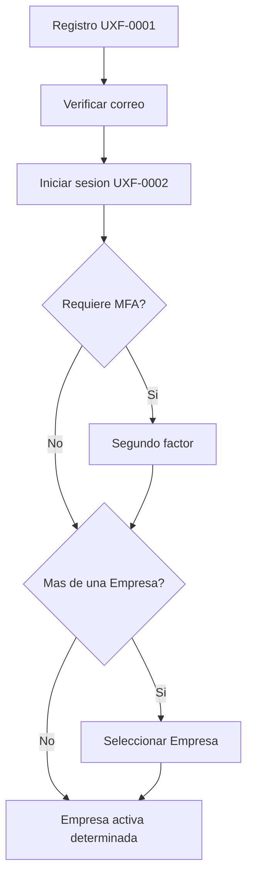
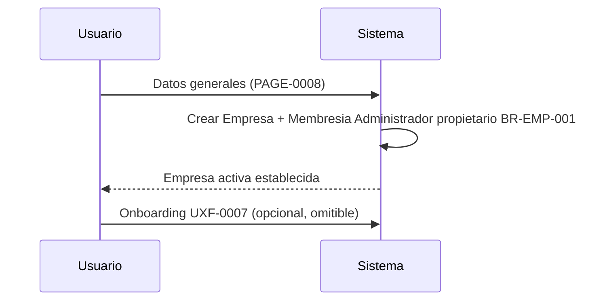
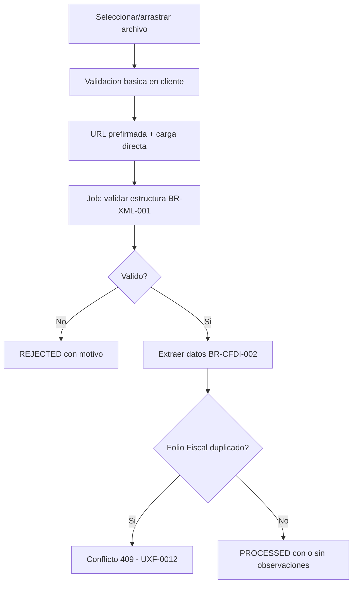
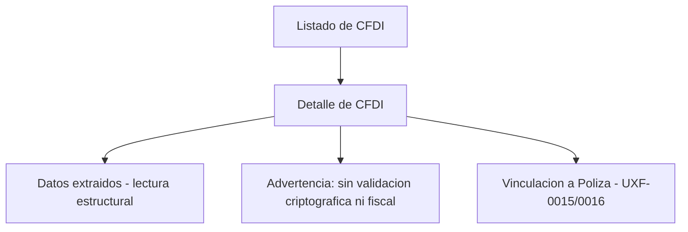
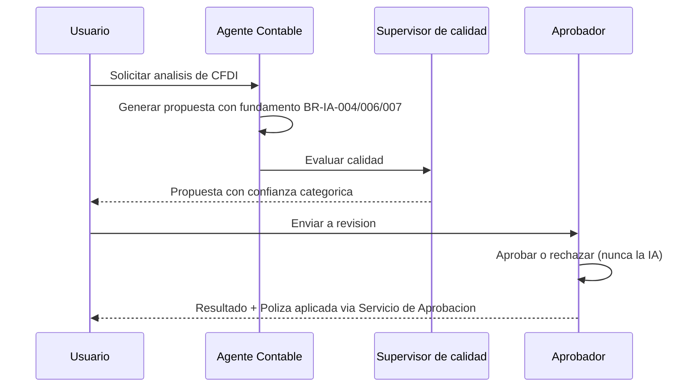
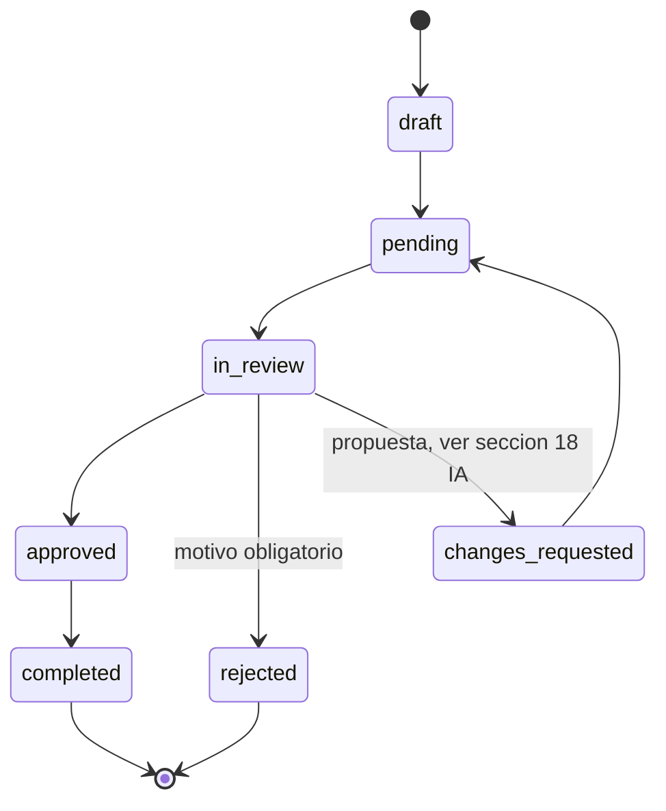
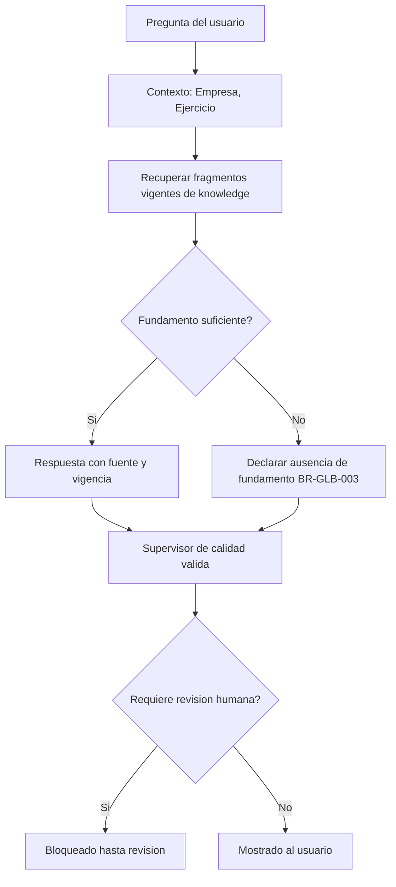
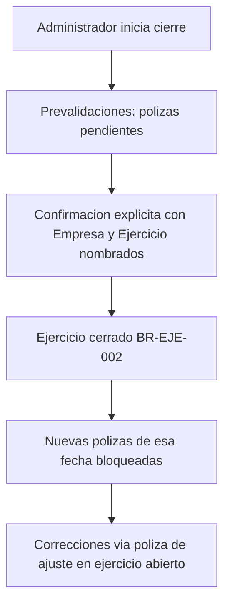
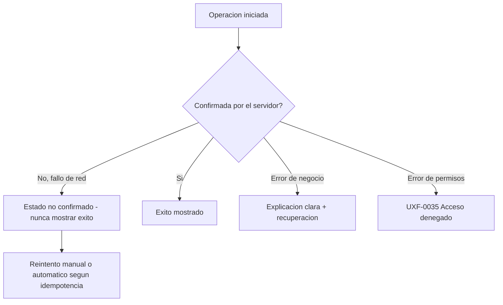
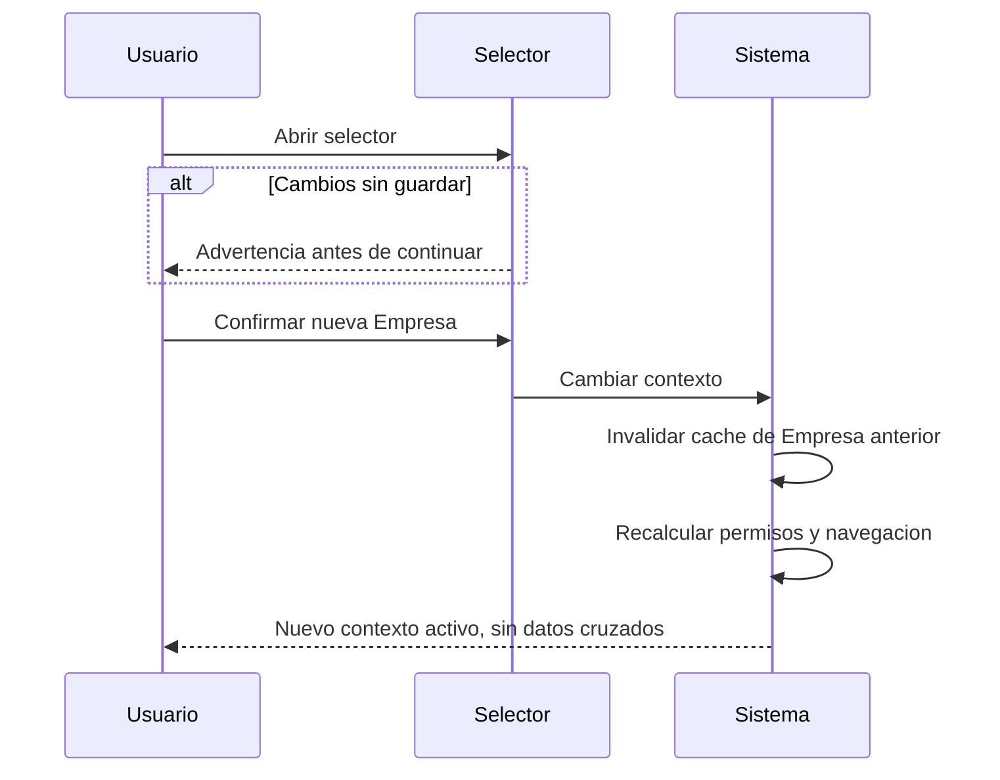

# Flujos de Experiencia — ContaIA

## Control del documento

| Campo                                  | Valor                                                                                                                                                                                                                                                                                                                                                                                                                                                            |
| -------------------------------------- | ---------------------------------------------------------------------------------------------------------------------------------------------------------------------------------------------------------------------------------------------------------------------------------------------------------------------------------------------------------------------------------------------------------------------------------------------------------------- |
| Documento                              | 15_UX_FLOWS.md                                                                                                                                                                                                                                                                                                                                                                                                                                                   |
| Orden de trabajo                       | AWO-011                                                                                                                                                                                                                                                                                                                                                                                                                                                          |
| Versión                                | 1.0                                                                                                                                                                                                                                                                                                                                                                                                                                                              |
| **Estado**                             | **Draft v1.0**                                                                                                                                                                                                                                                                                                                                                                                                                                                   |
| Fecha de creación                      | 2026-07-18                                                                                                                                                                                                                                                                                                                                                                                                                                                       |
| Última actualización                   | 2026-07-18                                                                                                                                                                                                                                                                                                                                                                                                                                                       |
| Fuentes de verdad                      | `MASTER_CONTEXT.md`, `docs/00_PRODUCT_VISION.md`, `docs/01_PRD.md`, `docs/02_USER_PERSONAS.md`, `docs/04_BUSINESS_RULES.md`, `docs/05_SYSTEM_DOMAIN_MODEL.md`, `docs/06_SYSTEM_WORKFLOWS.md`, `docs/07_SOFTWARE_ARCHITECTURE.md`, `docs/08_API_DESIGN.md`, `docs/09_DATABASE_DESIGN.md`, `docs/10_AI_ARCHITECTURE.md`, `docs/11_SECURITY_ARCHITECTURE.md`, `docs/12_FRONTEND_ARCHITECTURE.md`, `docs/13_DESIGN_SYSTEM.md`, `docs/14_INFORMATION_ARCHITECTURE.md` |
| Documentos que este documento alimenta | Wireframes Specification (próximo, ver "Observaciones del Arquitecto")                                                                                                                                                                                                                                                                                                                                                                                           |

> Nota sobre numeración: la Work Order pedía `docs/15_UX_FLOWS.md`, posición ocupada por `docs/15_RAG_ARCHITECTURE.md` (placeholder vacío, en su sexta reubicación consecutiva sin usarse desde AWO-006). Se desplazó junto con los documentos siguientes (`docs/15` a `docs/21` → `docs/16` a `docs/22`) sin pérdida de contenido. Todas las referencias cruzadas del proyecto se actualizaron antes de escribir este contenido.

> Este documento convierte reglas, workflows, arquitectura de información y componentes ya aprobados en recorridos de Usuario paso a paso. No diseña pantallas pixel por pixel, no genera componentes visuales, no rediseña la arquitectura de información (`docs/14_INFORMATION_ARCHITECTURE.md`) y no inventa funcionalidad fuera del alcance ya aprobado.

---

## 1. Propósito y alcance

**Objetivo:** documentar cómo un Usuario completa cada tarea real de ContaIA, de principio a fin, con sus decisiones, errores y recuperaciones.

**Alcance:** los 41 flujos de las secciones 5-45, cubriendo los doce módulos del MVP de `docs/01_PRD.md`.

**Usuarios:** los seis Roles oficiales, según `docs/02_USER_PERSONAS.md` y `docs/14_INFORMATION_ARCHITECTURE.md` (sección 2).

**Módulos:** los once de `docs/12_FRONTEND_ARCHITECTURE.md` (sección 3) / la taxonomía de `docs/14_INFORMATION_ARCHITECTURE.md` (sección 3).

**Relación con System Workflows (`docs/06_SYSTEM_WORKFLOWS.md`):** ese documento define el flujo de **negocio** (actores, reglas, eventos); este documento lo traduce a **experiencia de Usuario** (pantallas, decisiones visibles, mensajes) — sin contradecirlo.

**Relación con Information Architecture (`docs/14_INFORMATION_ARCHITECTURE.md`):** cada flujo usa el catálogo de páginas y rutas ya definido (secciones 40-41 de ese documento) como vocabulario, sin crear páginas nuevas no catalogadas.

**Relación con Design System (`docs/13_DESIGN_SYSTEM.md`):** cada flujo referencia componentes y estados ya definidos, sin especificar su apariencia.

**Exclusiones:** código, wireframes finales, nueva funcionalidad no aprobada (por ejemplo, automatización de conciliación real — ver sección 35, marcada explícitamente fuera del MVP).

## 2. Metodología oficial de flujos

Plantilla estándar (formato compacto para mantener el documento manejable dado su volumen — 41 flujos):

**UXF-XXXX — Nombre**

- **Objetivo** · **Actor principal** / Actores secundarios · **Empresa activa** (Sí/No) · **Permisos**
- **Precondiciones** · **Disparador** · **Entrada**
- **Flujo principal** (pasos numerados)
- **Decisiones y variantes**
- **Errores y recuperación**
- **Resultado** · **Auditoría/eventos** · **Notificaciones**
- **Fase** (MVP / intermedia / empresarial)

Métricas (sección 47) se definen como marco general reutilizable, no repetidas campo por campo en cada flujo, para evitar redundancia — cada flujo indica solo la métrica más distintiva cuando aporta valor.

## 3. Estados comunes

| Estado               | Visible al Usuario       | Uso                                                                                                               |
| -------------------- | ------------------------ | ----------------------------------------------------------------------------------------------------------------- |
| `idle`               | No (implícito)           | Sin actividad — estado por defecto antes de iniciar una acción                                                    |
| `draft`              | Sí ("Borrador")          | Formulario, Póliza, Sugerencia no enviada                                                                         |
| `validating`         | Sí ("Validando")         | Archivo, formulario en verificación                                                                               |
| `pending`            | Sí ("Pendiente")         | Tarea, aprobación, Documento antes de procesar                                                                    |
| `processing`         | Sí ("Procesando")        | Job asíncrono en curso                                                                                            |
| `requires_attention` | Sí ("Requiere atención") | Campos ambiguos, advertencias no bloqueantes                                                                      |
| `in_review`          | Sí ("En revisión")       | Tarea abierta por un aprobador — presentación de interfaz (ver `docs/14_INFORMATION_ARCHITECTURE.md`, sección 18) |
| `approved`           | Sí ("Aprobado")          | Resultado positivo de una decisión humana                                                                         |
| `rejected`           | Sí ("Rechazado")         | Resultado negativo, con motivo                                                                                    |
| `completed`          | Sí ("Completado")        | Proceso o tarea finalizada                                                                                        |
| `failed`             | Sí ("Fallido")           | Proceso técnico no completado                                                                                     |
| `cancelled`          | Sí ("Cancelado")         | Interrumpido por el Usuario — extensión de interfaz, ver sección 18 de `docs/14_INFORMATION_ARCHITECTURE.md`      |
| `expired`            | Sí ("Vencido")           | Tarea o Sugerencia sin resolución en la ventana definida                                                          |

**Internos (nunca mostrados directamente al Usuario):** claves de idempotencia, versiones de bloqueo optimista, identificadores de correlación (visibles solo en detalle técnico expandible, `docs/13_DESIGN_SYSTEM.md` sección 31).

## 4. Convenciones de interacción

| Acción             | Convención                                                                                         |
| ------------------ | -------------------------------------------------------------------------------------------------- |
| Primaria           | Verbo + objeto explícito ("Aprobar póliza") — nunca "Aceptar" sin contexto (instrucción explícita) |
| Secundaria         | Acción alternativa clara ("Guardar como borrador")                                                 |
| Cancelar           | Siempre disponible en formularios, advierte si hay cambios sin guardar                             |
| Regresar           | Vuelve al listado u origen, conserva filtros (`docs/14_INFORMATION_ARCHITECTURE.md`, sección 14)   |
| Cerrar             | Para modales/drawers informativos, sin implicar descarte de datos                                  |
| Guardar            | Confirma un cambio ya válido                                                                       |
| Guardar borrador   | Explícitamente distinto de "Guardar" cuando el recurso tiene ciclo de vida `DRAFT`                 |
| Continuar          | Avanza en un flujo de varios pasos, sin finalizar la operación                                     |
| Aprobar / Rechazar | Nunca "Sí/No" genérico — siempre nombran la acción de negocio                                      |
| Reintentar         | Repite la última operación fallida sin duplicar (idempotencia, `docs/08_API_DESIGN.md` sección 13) |
| Corregir           | Regresa al campo/paso específico con el error, no al inicio del flujo                              |
| Descargar          | Archivo propio del Usuario (evidencia, comprobante)                                                |
| Exportar           | Genera un archivo nuevo a partir de datos (Reportes, listados)                                     |

---

## 5. Flujos

### UXF-0001 — Registro

- **Objetivo:** crear una cuenta de Usuario verificada. **Actor:** Usuario nuevo. **Empresa activa:** No. **Permisos:** ninguno.
- **Precondiciones:** ninguna. **Disparador:** acceso a `/acceso/registro` (PAGE no listada como independiente en `docs/14_INFORMATION_ARCHITECTURE.md` — parte de PAGE-0001, Acceso). **Entrada:** correo, contraseña.
- **Flujo principal:** 1) Usuario ingresa correo y contraseña. 2) Acepta términos. 3) Sistema crea cuenta no verificada (BR-AUTH-001). 4) Envía correo de verificación. 5) Usuario confirma verificación (PAGE-0002). 6) Usuario inicia sesión (UXF-0002). 7) Completa perfil mínimo. 8) Continúa a selección/creación de Empresa (UXF-0005/UXF-0006).
- **Decisiones y variantes:** correo ya existente → mensaje claro sin confirmar si la cuenta existe con otra contraseña (previene enumeración, `docs/11_SECURITY_ARCHITECTURE.md` sección 6); enlace de verificación expirado → opción de reenviar; intento duplicado de registro con el mismo correo → mismo tratamiento que "ya existente"; abandono antes de verificar → cuenta permanece no verificada, sin acceso a datos reales.
- **Errores y recuperación:** contraseña que no cumple criterios → mensaje específico en el campo (sección 18 de `docs/14_INFORMATION_ARCHITECTURE.md`); fallo de red → ver UXF-0039.
- **Resultado:** cuenta activa y verificada. **Auditoría:** evento de registro y verificación (BR-AUTH-001). **Notificaciones:** correo de verificación (único caso de correo saliente en el MVP, `docs/04_BUSINESS_RULES.md` sección 4.13).
- **Fase:** MVP.

### UXF-0002 — Inicio de sesión

- **Objetivo:** autenticar a un Usuario existente. **Actor:** Usuario. **Empresa activa:** No (aún). **Permisos:** ninguno previo.
- **Precondiciones:** cuenta verificada. **Disparador:** acceso a PAGE-0001. **Entrada:** correo, contraseña, MFA si aplica.
- **Flujo principal:** 1) Usuario ingresa credenciales. 2) Sistema valida (BR-AUTH-002/003). 3) Si el Rol requiere MFA, solicita segundo factor. 4) Sistema verifica si existe sesión previa válida en otro dispositivo (informativo, no bloqueante). 5) Sistema determina si el Usuario tiene una sola Empresa (entra directo) o varias (PAGE-0005, UXF-0006).
- **Decisiones y variantes:** credenciales inválidas → mensaje genérico sin indicar cuál campo falló (previene enumeración); intentos fallidos repetidos → bloqueo progresivo (BR-AUTH-003); MFA no disponible temporalmente → mensaje claro con alternativa de recuperación.
- **Errores y recuperación:** ver UXF-0003 (recuperación), UXF-0036 (sesión expirada en el propio proceso), UXF-0039 (red).
- **Resultado:** sesión activa con Empresa determinada o por seleccionar. **Auditoría:** todo intento, éxito o fallo (BR-AUTH-003). **Notificaciones:** ninguna por defecto.
- **Fase:** MVP.

### UXF-0003 — Recuperación de acceso

- **Objetivo:** restablecer acceso sin exponer la cuenta. **Actor:** Usuario. **Empresa activa:** No. **Permisos:** ninguno.
- **Flujo principal:** 1) Usuario solicita recuperación con su correo (PAGE-0003). 2) Sistema envía enlace de un solo uso, sin confirmar si el correo existe. 3) Usuario abre el enlace dentro de la ventana de validez. 4) Define nueva contraseña. 5) Sistema revoca sesiones activas previas (medida de seguridad ante posible compromiso, `docs/11_SECURITY_ARCHITECTURE.md` sección 7). 6) Usuario inicia sesión de nuevo (UXF-0002).
- **Decisiones y variantes:** enlace expirado → opción de solicitar uno nuevo, sin reutilizar el anterior.
- **Errores y recuperación:** enlace ya usado → mensaje claro, solicitar uno nuevo.
- **Resultado:** contraseña actualizada, sesiones previas revocadas. **Auditoría:** solicitud, uso del enlace, cambio de contraseña, revocación (BR-AUTH-001, BR-SEC-002).
- **Fase:** MVP.

### UXF-0004 — Invitación a Empresa

- **Objetivo:** incorporar un Usuario a una Empresa con un Rol definido. **Actor principal:** Administrador. **Actor secundario:** Usuario invitado. **Empresa activa:** Sí (la que invita). **Permisos:** Administrador (BR-USR-001).
- **Flujo principal:** 1) Administrador abre Empresas/Detalle/Membresías (PAGE-0009). 2) Ingresa correo y elige Rol (workflow 5, `docs/06_SYSTEM_WORKFLOWS.md`). 3) Sistema crea Membresía `pendiente`. 4) Invitado recibe la invitación (canal fuera del alcance del MVP salvo notificación in-app si ya tiene cuenta). 5) Invitado nuevo se registra (UXF-0001) o inicia sesión si ya existe (UXF-0002). 6) Acepta (PAGE-0004). 7) Membresía pasa a `activa`.
- **Decisiones y variantes:** Usuario ya existente → salta registro, va directo a aceptación tras iniciar sesión; Usuario nuevo → pasa por registro completo primero; invitación expirada → Administrador puede reenviar; duplicidad (invitación repetida al mismo correo) → sistema reutiliza la invitación pendiente en vez de crear una segunda.
- **Errores y recuperación:** correo inválido → validación en el propio formulario de invitación.
- **Resultado:** nueva Membresía activa. **Auditoría:** invitación, aceptación (BR-USR-001, BR-USR-002).
- **Fase:** MVP.

### UXF-0005 — Creación de Empresa

- **Objetivo:** dar de alta una nueva Empresa. **Actor:** Usuario autenticado (se vuelve Administrador propietario). **Empresa activa:** No (se está creando). **Permisos:** ninguno previo (BR-EMP-001).
- **Flujo principal:** 1) Usuario accede a PAGE-0008. 2) Ingresa datos generales (razón social, giro, RFC — validado solo en formato, nunca contra el SAT, BR-CFDI-001). 3) Confirma. 4) Sistema crea la Empresa y asigna Membresía Administrador con `isOwner = true` (BR-EMP-001) en una sola operación. 5) Empresa se vuelve la Empresa activa.
- **Decisiones y variantes:** régimen/Ejercicio inicial → puede completarse después (Catálogo de cuentas y primer Ejercicio no son obligatorios en este paso, siguen en onboarding UXF-0007); Organización → se crea implícitamente si es la primera Empresa del Usuario, o se asocia a la existente (BR-ORG-001).
- **Errores y recuperación:** datos incompletos → validación en formulario, sin perder lo ya capturado.
- **Resultado:** Empresa operativa con Administrador propietario. **Auditoría:** creación (BR-EMP-001). **Eventos:** `EmpresaCreada`.
- **Fase:** MVP.

### UXF-0006 — Cambio de Empresa

- **Objetivo:** cambiar el contexto activo sin mezclar datos. **Actor:** cualquier Usuario con más de una Membresía. **Empresa activa:** Sí (cambia).
- **Flujo principal:** 1) Usuario abre el selector de Empresa (siempre visible, `docs/14_INFORMATION_ARCHITECTURE.md` sección 4). 2) Sistema valida Membresía vigente en cada opción listada. 3) Si hay cambios sin guardar en la vista actual, se advierte antes de continuar. 4) Usuario confirma la nueva Empresa. 5) Sistema recalcula permisos, navegación, caché (invalidación total de la Empresa anterior) y contexto de IA.
- **Decisiones y variantes:** cambio durante una operación asíncrona propia (Job en curso) → el Job continúa asociado a su Empresa de origen, visible desde el Centro de trabajo al regresar a esa Empresa.
- **Errores y recuperación:** Membresía revocada entre que se cargó el selector y se confirmó el cambio → error claro, recarga de la lista de Empresas.
- **Resultado:** nuevo contexto activo, sin ningún dato de la Empresa anterior visible. **Auditoría:** cambio de contexto no se audita como evento de negocio en sí (es navegación), pero toda acción subsecuente queda asociada a la nueva Empresa.
- **Fase:** MVP.

### UXF-0007 — Onboarding

- **Objetivo:** guiar la primera configuración según el Rol. **Actor:** Propietario/Administrador (flujo completo); Contador, Auxiliar (flujo reducido, se unen vía invitación); Estudiante (flujo educativo aparte, alcance pendiente).
- **Flujo principal (Propietario/Administrador):** 1) Tras UXF-0005, se ofrece una guía de pasos: configurar Catálogo de cuentas (o importar uno básico marcado como plantilla no oficial, `docs/09_DATABASE_DESIGN.md` sección 17), abrir el primer Ejercicio, invitar colaboradores (UXF-0004). 2) Cada paso muestra progreso. 3) Todos los pasos son omitibles salvo la creación de la Empresa ya completada.
- **Decisiones y variantes:** omisión → el Usuario llega a Inicio con tarjetas de "pendiente de configurar"; reanudación → el progreso persiste entre sesiones.
- **Errores y recuperación:** ninguno específico más allá de los formularios individuales (UXF-0014, UXF-0004).
- **Resultado:** Empresa mínimamente operativa. **Ayuda:** enlace a Asistente IA disponible en cada paso (sin sustituir la guía estructurada).
- **Fase:** MVP (guía básica); fase intermedia (onboarding adaptativo más elaborado).

### UXF-0008 — Carga de XML

- **Objetivo:** incorporar un CFDI al repositorio. **Actor:** Auxiliar, Contador. **Empresa activa:** Sí. **Permisos:** captura (BR-DOC-001).
- **Flujo principal (workflow 6-7, `docs/06_SYSTEM_WORKFLOWS.md`):** 1) Usuario selecciona o arrastra el archivo (PAGE-0022). 2) Frontend valida tipo/tamaño básico antes de iniciar la carga (`docs/12_FRONTEND_ARCHITECTURE.md` sección 9). 3) Sistema emite URL prefirmada; carga directa al almacenamiento. 4) Job de análisis valida estructura (BR-XML-001) y extrae datos (BR-CFDI-002). 5) Resultado: `PROCESSED` (con o sin observaciones) o `REJECTED`.
- **Errores por:** formato no soportado → rechazo inmediato antes de subir; tamaño excedido → rechazo inmediato con el límite indicado (`docs/11_SECURITY_ARCHITECTURE.md` sección 16, valor pendiente de validación); duplicidad (Folio Fiscal ya existente en la Empresa) → `409` con referencia al Documento existente (`docs/08_API_DESIGN.md` sección 13); contenido malicioso detectado → rechazo, sin exponer detalle técnico; XML mal formado → `REJECTED` con motivo; RFC con formato incorrecto → observación, no rechazo automático (puede ser un dato real inusual, se marca para revisión, BR-XML-002); archivo cifrado → tratado como no procesable, `REJECTED` con motivo; servicio de IA/extracción no disponible → Job pasa a `FAILED`, reintento disponible (UXF-0044).
- **Resultado:** CFDI disponible en PAGE-0020, o Documento marcado con su motivo de rechazo. **Auditoría:** carga, validación, extracción (BR-DOC-002, BR-XML-001, BR-CFDI-002).
- **Fase:** MVP.

### UXF-0009 — Carga múltiple

- **Objetivo:** cargar varios archivos en un solo lote. **Actor:** Auxiliar, Contador.
- **Flujo principal:** 1) Selección múltiple de archivos (PAGE-0022). 2) Cada archivo se valida y sube de forma independiente (mismo mecanismo que UXF-0008). 3) Progreso global (X de N completados) y progreso individual por archivo. 4) Al finalizar, resumen: procesados, observados, rechazados.
- **Decisiones y variantes:** **un archivo inválido no bloquea el resto del lote** (instrucción explícita) — cada archivo sigue su propio ciclo de vida independiente. **Reintento selectivo:** solo los archivos fallidos, sin recargar los ya exitosos. **Cancelación:** detiene los archivos aún no iniciados; los ya en proceso continúan hasta su estado terminal.
- **Errores y recuperación:** iguales a UXF-0008, por archivo.
- **Resultado:** resumen final navegable a cada Documento individual.
- **Fase:** MVP.

### UXF-0010 — Procesamiento documental

- **Objetivo:** que el Usuario nunca pierda de vista un Documento en proceso. **Actor:** Auxiliar, Contador.
- **Flujo principal:** Estados `cargado → validando → procesando → procesado | observado | rechazado | fallido` (sección 3), visibles en PAGE-0021/0023, en el Centro de trabajo (PAGE-0029) y en Notificaciones (PAGE-0031) si el Usuario navegó fuera. **Retomar:** desde cualquiera de esas tres superficies, el enlace lleva directo al Documento (`docs/14_INFORMATION_ARCHITECTURE.md` sección 28).
- **Resultado:** ningún proceso asíncrono "desaparece" al cambiar de pantalla (principio 9).
- **Fase:** MVP.

### UXF-0011 — Revisión de CFDI

- **Objetivo:** que el Usuario entienda exactamente qué se extrajo y qué no se validó. **Actor:** Auxiliar, Contador, Auditor (lectura).
- **Flujo principal:** 1) Entrada desde PAGE-0019 (listado) o navegación contextual (desde una Póliza vinculada). 2) PAGE-0020 muestra resumen (emisor, receptor, total), datos fiscales completos, conceptos, impuestos, relaciones (CFDI relacionados si el propio XML los declara), evidencia (Documento origen), observaciones (campos ambiguos, BR-XML-002), y acciones permitidas según Rol (vincular a Póliza, descargar).
- **Distinción explícita en la interfaz (workflow 7, `docs/06_SYSTEM_WORKFLOWS.md`; `docs/11_SECURITY_ARCHITECTURE.md` sección 17):** **lectura estructural** (siempre realizada) se presenta como "datos extraídos del archivo"; **validación criptográfica** y **validación fiscal** (no realizadas en el MVP) nunca aparecen como si hubieran ocurrido — ningún texto afirma "válido ante el SAT"; **validación de negocio** (deduplicación, coherencia con la Empresa) se presenta como "verificaciones internas de ContaIA", distinguible de las anteriores.
- **Resultado:** Usuario informado con precisión de qué nivel de confianza tiene cada dato mostrado.
- **Fase:** MVP.

### UXF-0012 — Detección de duplicados

- **Objetivo:** evitar registrar dos veces el mismo CFDI. **Actor:** Auxiliar, Contador.
- **Flujo principal:** 1) Durante UXF-0008, el sistema detecta Folio Fiscal ya existente en la Empresa (`docs/08_API_DESIGN.md` sección 13). 2) Se muestra una comparación breve (fecha de carga original, quién lo cargó) en vez de solo un error genérico. 3) Usuario decide: **descartar** el nuevo intento, o **conservar como evidencia** si el archivo es legítimamente distinto (por ejemplo, una copia de respaldo) — en ese caso se almacena como Documento adicional sin generar un segundo CFDI operativo, o se **escala** marcándolo para revisión de un Contador/Supervisor si hay duda real de fraude o error del emisor.
- **Errores y recuperación:** ninguno adicional — el propio flujo es la recuperación del conflicto `409`.
- **Resultado:** ningún duplicado operativo sin que el Usuario haya decidido conscientemente. **Auditoría:** intento de duplicado y decisión tomada.
- **Fase:** MVP (detección básica); fase intermedia (comparación enriquecida y escalamiento formal).

### UXF-0013 — Clasificación documental

- **Objetivo:** sugerir el tipo de un Documento cargado. **Actor:** Auxiliar, Contador.
- **Flujo principal:** 1) Tras procesar un Documento (UXF-0010), el sistema sugiere su tipo cuando no es evidente por sí mismo (capacidad menor del Agente de CFDI y XML, `docs/10_AI_ARCHITECTURE.md` sección 5, no un Agente propio). 2) Se muestra con evidencia (por qué se sugiere ese tipo) y nivel de confianza (categórico, nunca porcentaje — `docs/10_AI_ARCHITECTURE.md` sección 13). 3) Usuario revisa, corrige si es necesario, o aprueba tácitamente al continuar usando el Documento con esa clasificación.
- **Decisiones y variantes:** corrección → se registra como retroalimentación (UXF-0023), **nunca reentrena un modelo en producción automáticamente** (instrucción explícita, coherente con `docs/10_AI_ARCHITECTURE.md` sección 16: sin aprendizaje no supervisado con datos de clientes).
- **Resultado:** Documento con tipo clasificado y trazable a si fue automático o corregido.
- **Fase:** MVP (básico); fase intermedia (clasificación más granular).

### UXF-0014 — Catálogo de cuentas

- **Objetivo:** mantener la estructura contable de la Empresa. **Actor:** Contador. **Empresa activa:** Sí. **Permisos:** BR-CAT-001/002.
- **Flujo principal:** 1) PAGE-0010 (listado, con búsqueda y jerarquía). 2) Alta (PAGE-0011): código, nombre, tipo, cuenta padre si aplica. 3) Sistema valida unicidad de código por Empresa (BR-CAT-002) antes de guardar. 4) Edición: cambios generan una entrada en CuentaHistorial (BR-CAT-001), visible en la pestaña "Actividad" del detalle. 5) Desactivación: **no se permite si la Cuenta tiene movimientos sin un proceso controlado** (instrucción explícita) — el sistema explica el impacto (cuántas Pólizas la referencian) antes de permitir continuar, y ofrece desactivar hacia adelante (sin eliminar el historial) en vez de un borrado.
- **Errores y recuperación:** código duplicado → validación inline antes de enviar.
- **Resultado:** Catálogo consistente y versionado. **Auditoría:** todo cambio (BR-VER-003).
- **Fase:** MVP.

### UXF-0015 — Creación de Póliza manual

- **Objetivo:** registrar un movimiento contable. **Actor:** Auxiliar (borrador), Contador. **Empresa activa:** Sí. **Permisos:** BR-POL-001.
- **Flujo principal (workflow 8, `docs/06_SYSTEM_WORKFLOWS.md`):** 1) PAGE-0014: encabezado (fecha, Ejercicio determinado automáticamente por la fecha, BR-EJE-001, tipo, descripción). 2) Movimientos: agregar líneas de cargo/abono, cada una con Cuenta del Catálogo. 3) Documentos relacionados: vincular CFDI/Documento si existe. 4) Sistema valida en tiempo real que cargos = abonos (BR-POL-002), mostrando el descuadre si existe, **antes de permitir enviar a revisión** (principio 3: prevenir antes de confirmar). 5) Guardar como borrador en cualquier momento (UXF-0037). 6) Enviar a revisión (crea Caso de Revisión). 7) Aprobación (UXF-0017) → `DEFINITIVE`, inmutable.
- **Errores y recuperación:** descuadre → bloqueo con el monto exacto de diferencia mostrado; Ejercicio cerrado para esa fecha → mensaje claro sugiriendo una fecha en el Ejercicio abierto o una Póliza de ajuste (BR-POL-004).
- **Resultado:** Póliza en el estado correspondiente, siempre rastreable a su Ejercicio y, si aplica, a su Documento origen.
- **Fase:** MVP.

### UXF-0016 — Sugerencia de Póliza mediante IA

- **Objetivo:** generar un borrador de Póliza asistido, nunca aplicado directamente. **Actor:** Contador, Auxiliar (inicia); Contador/Supervisor (aprueba). **Empresa activa:** Sí.
- **Flujo principal (16 pasos, ya definidos por la Work Order, aquí formalizados):** 1) Usuario selecciona un CFDI o Documento procesado. 2) Solicita análisis al Asistente. 3) Sistema valida permisos del solicitante. 4) Recupera contexto (Empresa, Catálogo, CFDI). 5) Agente Contable genera la sugerencia (BR-IA-004). 6) Muestra Cuentas propuestas. 7) Muestra cargos y abonos propuestos. 8) Explica el fundamento de la clasificación. 9) Muestra fuentes (NIF/criterio, si existen — BR-IA-006). 10) Muestra supuestos usados. 11) Advierte datos faltantes explícitamente (BR-IA-007). 12) Usuario puede editar la propuesta antes de continuar. 13) Envía a revisión (crea Caso de Revisión, igual que UXF-0015 paso 6). 14) Contador/Supervisor aprueba o rechaza (UXF-0017). 15) Si se aprueba, se **aplica mediante el Servicio de Aprobación** — la Póliza real se crea por ese servicio, no por el Agente. 16) Se audita cada paso.
- **Errores y recuperación:** sin fundamento suficiente → la sugerencia se marca `INSUFFICIENT`, se bloquea hasta ajuste manual completo por el Usuario (no se ofrece como propuesta a medias sin advertencia); proveedor de IA no disponible → mensaje claro, opción de continuar con captura manual (UXF-0015).
- **Resultado:** **la IA nunca registra la Póliza directamente** (instrucción explícita, principio fundamental) — el resultado siempre pasa por el mismo camino de aprobación que una Póliza manual.
- **Fase:** MVP.

### UXF-0017 — Revisión y aprobación de Póliza

- **Objetivo:** decidir sobre una Póliza pendiente. **Actor:** Contador, Supervisor. **Empresa activa:** Sí. **Permisos:** BR-POL-003, **nunca Auxiliar** (BR-ROL-001).
- **Flujo principal:** 1) Caso aparece en Centro de trabajo (PAGE-0029), asignado por Rol responsable (no necesariamente una persona específica en el MVP). 2) Aprobador abre PAGE-0030: comparación (datos propuestos), evidencia (CFDI/Documento origen), comentarios previos si los hay. 3) Decide: **Aprobar** (con confirmación que nombra la Póliza, el monto y la Empresa, `docs/13_DESIGN_SYSTEM.md` sección 32), **Rechazar** (motivo obligatorio, BR-TRZ-003), o **Solicitar cambios** (ver UXF-0018, estado propuesto pendiente de validación técnica — sección 18 de `docs/14_INFORMATION_ARCHITECTURE.md`).
- **Decisiones y variantes:** **doble control** — en el MVP, quien capturó no puede ser quien aprueba la misma Póliza (separación de funciones, `docs/11_SECURITY_ARCHITECTURE.md` sección 10), validado en servidor, no solo en interfaz.
- **Errores y recuperación:** otro aprobador ya resolvió el caso (condición de carrera) → conflicto de versión (`docs/08_API_DESIGN.md` sección 13, bloqueo optimista), mensaje claro de que el caso ya fue atendido, sin duplicar la decisión.
- **Resultado:** Póliza `DEFINITIVE` o de vuelta a `DRAFT` con motivo. **Auditoría:** decisión completa con actor y motivo. **Notificaciones:** al solicitante original.
- **Fase:** MVP.

### UXF-0018 — Corrección solicitada

- **Objetivo:** permitir un ciclo de ajuste sin rechazo definitivo. **Actor:** Contador/Supervisor (solicita); Auxiliar/Contador (corrige).
- **Flujo principal:** 1) Aprobador dentro de UXF-0017 elige "Solicitar cambios" con comentario específico. 2) El caso regresa al solicitante original con el comentario visible junto al recurso. 3) Solicitante edita (si el recurso sigue en estado editable, `DRAFT`). 4) Reenvía a revisión. 5) Historial conserva ambas versiones y el comentario (versionado, no sobrescritura).
- **Nota de alcance:** ver sección 18 de `docs/14_INFORMATION_ARCHITECTURE.md` — este flujo se documenta como propuesta de experiencia; su respaldo como estado de datos distinto de "rechazado" requiere confirmación técnica antes de implementarse tal cual.
- **Resultado:** ciclo de ajuste trazable sin perder el contexto de la solicitud original. **Auditoría:** comentario y cada versión.
- **Fase:** Propuesta — pendiente de validación técnica antes de MVP definitivo (ver limitación arriba); si no se confirma a tiempo, se implementa como rechazo con motivo estructurado (UXF-0017).

### UXF-0019 — Asistente fiscal

- **Objetivo:** responder preguntas fiscales con fundamento. **Actor:** Contador, Asesor fiscal (consulta, diferido), Administrador. **Empresa activa:** Sí (o ninguna para preguntas puramente conceptuales).
- **Flujo principal (workflow 9, `docs/06_SYSTEM_WORKFLOWS.md`):** 1) Usuario pregunta en PAGE-0027. 2) Sistema identifica Empresa y Ejercicio activos como contexto. 3) Clasifica la intención como fiscal. 4) Recupera fragmentos de `knowledge/` filtrados por vigencia del Ejercicio (`docs/10_AI_ARCHITECTURE.md` sección 7). 5) Agente Fiscal genera respuesta. 6) Muestra fundamento y fuentes. 7) Muestra advertencias y datos faltantes si aplica. 8) Usuario puede dar seguimiento (nueva pregunta en el mismo hilo) o retroalimentar (UXF-0023).
- **Regla explícita:** **nunca se presenta una respuesta fiscal sin vigencia normativa identificable** (instrucción explícita) — si no hay fecha de vigencia asociada a la fuente, la respuesta declara esa limitación en vez de omitirla.
- **Resultado:** respuesta con `confidenceLevel` visible, nunca un porcentaje inventado.
- **Fase:** MVP (alcance de contenido curado deliberadamente acotado, `docs/01_PRD.md` módulo M9).

### UXF-0020 — Asistente contable

- **Objetivo:** explicar y clasificar información contable. **Actor:** Contador, Auxiliar.
- **Flujo principal:** igual estructura que UXF-0019, con Agente Contable: contexto incluye Catálogo y Pólizas recientes de la Empresa activa (lectura); respuesta puede incluir sugerencias de clasificación (enlaza a UXF-0016 si el Usuario decide convertirla en propuesta formal) y referencias a NIF cuando exista fuente curada.
- **Resultado:** explicación fundamentada, nunca un cálculo directo de IA (BR-IA-002 — cifras siempre provienen del motor determinístico).
- **Fase:** MVP.

### UXF-0021 — Conversación IA contextual

- **Objetivo:** iniciar el Asistente desde cualquier recurso sin perder contexto. **Actor:** cualquier Rol con acceso al chat.
- **Flujo principal:** 1) Desde CFDI, Documento, Póliza, Cuenta, Reporte, mensaje de error, o Tarea, el Usuario abre el panel contextual de IA (`docs/14_INFORMATION_ARCHITECTURE.md` sección 20). 2) El recurso actual se adjunta automáticamente como contexto (visible al Usuario, no oculto). 3) Usuario confirma o ajusta qué recurso está en contexto antes de preguntar. 4) Conversación continúa como UXF-0019/0020, con el contexto adicional.
- **Decisiones y variantes:** eliminar el contexto adjunto → el Usuario puede quitarlo y preguntar de forma general; cambio de Empresa a mitad de conversación → la conversación queda anclada a su Empresa de origen (sección 9 de `docs/14_INFORMATION_ARCHITECTURE.md`), no se traslada a la nueva.
- **Resultado:** el Asistente nunca accede a un recurso que el Usuario no podría ver por sí mismo en esa pantalla.
- **Fase:** MVP.

### UXF-0022 — Fuentes y fundamentos

- **Objetivo:** verificar una cita sin perder el hilo de la conversación. **Actor:** cualquier Rol con acceso al chat.
- **Flujo principal:** 1) Usuario hace clic en una fuente citada. 2) Panel lateral (`docs/14_INFORMATION_ARCHITECTURE.md` sección 21) muestra artículo/apartado, vigencia, y — cuando el Agente supervisor de calidad detectó más de una fuente aplicable — la comparación de vigencias. 3) Usuario puede "reportar un problema" con la fuente (retroalimentación, UXF-0023) o "guardar como evidencia" (la vincula al recurso en revisión, si aplica). 4) Cerrar el panel regresa exactamente al punto de la conversación.
- **Resultado:** verificación sin navegación destructiva del contexto.
- **Fase:** MVP.

### UXF-0023 — Retroalimentación de IA

- **Objetivo:** capturar la valoración del Usuario sobre una respuesta. **Actor:** cualquier Rol.
- **Flujo principal:** 1) Bajo cada respuesta, opciones: útil / no útil / incorrecta / fuente incorrecta / falta información / riesgo detectado. 2) Comentario opcional. 3) Sistema registra la retroalimentación (`RetroalimentaciónIA`, `docs/09_DATABASE_DESIGN.md`).
- **Regla explícita:** **la retroalimentación nunca modifica automáticamente modelos o reglas en producción** (instrucción explícita) — se acumula como insumo para revisión humana del equipo de IA/contenido (`docs/10_AI_ARCHITECTURE.md` sección 20), nunca aplica un cambio en tiempo real.
- **Seguimiento:** si el Usuario marca "riesgo detectado", el caso se enruta también como Caso de Revisión (UXF-0024), no solo como dato de mejora.
- **Fase:** MVP.

### UXF-0024 — Tareas y aprobaciones

- **Objetivo:** ciclo completo de una unidad de trabajo pendiente de decisión humana. **Actor:** Contador, Supervisor (deciden); Auxiliar, Auditor (consultan según corresponda).
- **Flujo principal:** creación (automática, al enviar una Póliza o Sugerencia a revisión — UXF-0015/0016) → asignación (por Rol responsable, sección 18 de `docs/14_INFORMATION_ARCHITECTURE.md`) → aceptación (implícita al abrir el caso) → revisión → comentario (opcional) → vencimiento (si aplica, ventana pendiente de validación de negocio) → recordatorio (vía Notificaciones, UXF-0026) → reasignación (solo por Administrador, si el responsable original no puede atender) → aprobación/rechazo (UXF-0017) → cierre (pasa a Historial).
- **Resultado:** ninguna tarea queda sin trazabilidad completa de su ciclo de vida.
- **Fase:** MVP (sin reasignación ni vencimiento automatizado, que son fase intermedia).

### UXF-0025 — Centro de trabajo

- **Objetivo:** vista única de todo lo accionable. **Actor:** Contador, Supervisor principalmente; visibilidad parcial para otros Roles.
- **Flujo principal:** PAGE-0029 agrupa: pendientes por prioridad, Empresa activa (siempre, nunca cruzada), módulo de origen, responsable, estado, con filtros (sección 15 de `docs/14_INFORMATION_ARCHITECTURE.md`) y accesos directos a cada recurso. Resolver un ítem lo remueve de la vista activa y actualiza el conteo global (sección 4 de `docs/14_INFORMATION_ARCHITECTURE.md`) sin recargar toda la página.
- **Fase:** MVP.

### UXF-0026 — Notificaciones

- **Objetivo:** que ninguna alerta relevante pase desapercibida. **Actor:** todos.
- **Flujo principal:** 1) Evento determinista genera una Alerta (BR-NOT-002) o una Tarea genera su entrada correspondiente. 2) Aparece en el centro de notificaciones (PAGE-0031) y como indicador en la barra superior. 3) Usuario lee (marca como atendida) o actúa (enlace directo al recurso). 4) Se agrupan por importancia primero, cronología después (`docs/14_INFORMATION_ARCHITECTURE.md` sección 27).
- **Decisiones y variantes:** notificación crítica → no se archiva automáticamente, requiere acción explícita; cambio de Empresa activa → el centro se recalcula para la nueva Empresa, sin mezclar pendientes; recurso al que apunta la notificación fue eliminado (Documento no confirmado descartado) → mensaje claro, no un enlace roto silencioso.
- **Fase:** MVP (in-app únicamente, sin correo — `docs/04_BUSINESS_RULES.md` sección 4.13).

### UXF-0027 — Búsqueda global

- **Objetivo:** localizar cualquier recurso autorizado rápidamente. **Actor:** todos.
- **Flujo principal:** 1) Usuario abre la búsqueda (siempre accesible). 2) Escribe; sugerencias aparecen tras un mínimo de caracteres. 3) Resultados agrupados por tipo (Empresas, CFDI, Documentos, Pólizas, Cuentas, Usuarios, Reportes, Conversaciones, Tareas) y, separado explícitamente, fundamentos normativos. 4) Usuario filtra por tipo si hay muchos resultados. 5) Selecciona un resultado y navega directo a su detalle.
- **Errores y recuperación:** sin resultados → sugerencia de ajustar términos (sección 29 de `docs/14_INFORMATION_ARCHITECTURE.md`); error del servicio de búsqueda → mensaje claro, sin bloquear el resto de la interfaz.
- **Resultado:** ningún resultado mezcla Empresas ni expone un recurso que el Rol no podría abrir directamente.
- **Fase:** MVP.

### UXF-0028 — Filtros y vistas guardadas

- **Objetivo:** acotar listados de forma reutilizable. **Actor:** todos, según el listado.
- **Flujo principal:** aplicar → combinar (varios filtros a la vez) → limpiar (uno o todos) → guardar (con nombre, fase intermedia) → renombrar → compartir (solo dentro de la misma Empresa y Rol equivalente, fase intermedia) → establecer como predeterminada → eliminar.
- **Fase:** MVP (aplicar/combinar/limpiar); fase intermedia (guardar/renombrar/compartir/predeterminada).

### UXF-0029 — Generación de reporte

- **Objetivo:** obtener Balanza/Estados Financieros empaquetados. **Actor:** Contador, Administrador. **Permisos:** BR-EF-001 a 003.
- **Flujo principal:** 1) PAGE-0024: elegir tipo, Empresa (ya activa), Ejercicio/periodo, filtros. 2) Validación de parámetros (por ejemplo, rango de fechas coherente). 3) Generación — síncrona si es rápida, o como Job asíncrono para volúmenes grandes (`docs/08_API_DESIGN.md` sección 15). 4) Resultado en PAGE-0025 con periodo, fecha de generación y advertencia de que no es documento fiscal oficial cuando aplique (BR-EF-003). 5) Descarga/exportación (UXF-0030).
- **Errores y recuperación:** sin Pólizas definitivas en el rango → resultado válido en ceros, no un error (BR-EF-001/002); fallo del Job → `FAILED` con reintento (UXF-0044).
- **Resultado:** reporte trazable a su origen, quedando en Historial (PAGE-0024, sección "Recientes").
- **Fase:** MVP (predefinidos); fase intermedia (programados, favoritos).

### UXF-0030 — Exportación

- **Objetivo:** generar un archivo a partir de datos ya autorizados. **Actor:** Contador, Administrador, Auditor (según recurso).
- **Flujo principal:** 1) Usuario elige exportar desde un listado o reporte. 2) Sistema confirma alcance (qué Empresa, qué rango) — la Empresa se nombra explícitamente en la confirmación (`docs/13_DESIGN_SYSTEM.md` sección 32). 3) Valida permisos de exportación (sección 9 de `docs/08_API_DESIGN.md`). 4) Genera el archivo (síncrono o Job). 5) Enlace de descarga temporal.
- **Exportaciones masivas** (volumen alto o datos sensibles agregados): requieren confirmación adicional explícita, coherente con el principio de separación de funciones (`docs/11_SECURITY_ARCHITECTURE.md` sección 10) — en el MVP, esta "aprobación adicional" es una segunda confirmación del propio Usuario con advertencia reforzada, no necesariamente una aprobación de otro Rol, salvo que el volumen la clasifique como acción crítica administrativa.
- **Auditoría:** toda exportación se registra, incluido su alcance exacto (BR-TRZ-001).
- **Fase:** MVP.

### UXF-0031 — Conciliación

- **Objetivo:** apoyar la comparación entre fuentes (por ejemplo, CFDI y registros contables). **Fase:** **fuera del MVP — Etapa 3 de `MASTER_CONTEXT.md` ("automatización contable: conciliaciones")**, no incluida en los doce módulos del MVP de `docs/01_PRD.md`.
- **Diseño conceptual, sin automatizar nada no aprobado (instrucción explícita):** selección de periodo → fuentes a comparar (definidas en la fase correspondiente, no aquí) → coincidencias/diferencias presentadas para revisión humana → cualquier sugerencia de ajuste sigue el mismo camino de aprobación que UXF-0016 → cierre del ciclo de conciliación solo tras aprobación explícita.
- **Nota:** este flujo se documenta en su forma más conceptual posible para no bloquear el catálogo (la Work Order lo solicita), pero **no debe interpretarse como una funcionalidad del MVP** — cualquier desarrollo de este flujo requiere primero su aprobación como alcance en `docs/01_PRD.md`.

### UXF-0032 — Cierre de periodo (Ejercicio)

- **Objetivo:** cerrar un Ejercicio de forma controlada. **Actor:** Administrador (por analogía con BR-CFG-001, ya señalado como supuesto en `docs/06_SYSTEM_WORKFLOWS.md` workflow 14).
- **Flujo principal:** 1) Administrador inicia cierre desde PAGE-0017. 2) Sistema muestra prevalidaciones: Pólizas en `DRAFT`/`PENDING_REVIEW` sin resolver, como advertencia no bloqueante (workflow 14). 3) Confirmación explícita, nombrando el Ejercicio y la Empresa. 4) Ejercicio pasa a `cerrado`. 5) Ninguna Póliza nueva de esa fecha puede volverse `DEFINITIVE` (BR-EJE-002); correcciones futuras usan Póliza de ajuste en el Ejercicio abierto (BR-POL-004).
- **Reapertura:** **no definida en el modelo aprobado** (riesgo heredado desde `docs/06_SYSTEM_WORKFLOWS.md`, `docs/09_DATABASE_DESIGN.md`, `docs/11_SECURITY_ARCHITECTURE.md`). Este documento propone, sin implementarlo como aprobado, que **si se habilita, debe requerir permiso de Administrador y motivo explícito** (instrucción de esta Work Order), quedando como pregunta pendiente para `brain/QUESTIONS.md`.
- **Fase:** MVP (cierre); reapertura fuera de alcance hasta validación de negocio.

### UXF-0033 — Administración de usuarios

- **Objetivo:** gestionar Membresías de una Empresa. **Actor:** Administrador. **Permisos:** BR-USR-001, BR-PERM-002.
- **Flujo principal:** listado (PAGE-0009/Membresías) → invitar (UXF-0004) → asignar/cambiar Rol (UXF-0034) → suspender (desactivar Membresía, BR-USR-003, preserva historial) → reactivar (nueva invitación o reactivación directa si la cuenta sigue vigente) → eliminar (no aplica eliminación física, solo desactivación) → revisar sesiones activas del Usuario (solo a nivel propio, no de terceros, salvo soporte JIT) → consultar auditoría relacionada.
- **Regla explícita:** **un Usuario no puede aumentarse privilegios a sí mismo** (instrucción explícita, BR-PERM-002) — el formulario de cambio de Rol está deshabilitado sobre la propia fila del Administrador que lo edita, validado también en servidor.
- **Fase:** MVP.

### UXF-0034 — Cambio de Rol

- **Objetivo:** modificar el Rol de un Usuario en una Empresa. **Actor:** Administrador.
- **Flujo principal:** 1) Selecciona Usuario en PAGE-0009. 2) Ve Rol actual. 3) Elige nuevo Rol. 4) Sistema muestra el impacto (qué gana/pierde acceso, por ejemplo "dejará de poder aprobar Pólizas"). 5) Confirmación explícita. 6) Cambio aplicado — sesiones activas de ese Usuario recalculan permisos de inmediato (no requieren cerrar sesión).
- **Errores y recuperación:** intento de auto-modificación → bloqueado (UXF-0033).
- **Auditoría:** Rol anterior y nuevo, actor, fecha (BR-PERM-002, `docs/11_SECURITY_ARCHITECTURE.md` sección 9).
- **Fase:** MVP.

### UXF-0035 — Acceso denegado

- **Objetivo:** comunicar con claridad una restricción, sin exponer de más. **Actor:** cualquiera.
- **Flujo principal:** 1) Usuario intenta una ruta o acción sin permiso. 2) Sistema muestra PAGE-0041: qué Rol se requiere (sin listar qué contendría el recurso), Empresa involucrada si aplica, opción de regresar, y — si tiene sentido — un enlace para solicitar acceso a su Administrador (no automatizado, solo orientación).
- **Regla explícita:** **nunca se expone información sensible sobre el recurso inaccesible** (instrucción explícita) — ni su existencia se confirma o niega de forma distinguible de "no encontrado" cuando la ambigüedad es la opción más segura (`docs/11_SECURITY_ARCHITECTURE.md` sección 12).
- **Auditoría:** el intento se registra cuando corresponde a un recurso sensible (no cada clic accidental de navegación).
- **Fase:** MVP.

### UXF-0036 — Sesión expirada

- **Objetivo:** no perder trabajo por expiración de sesión. **Actor:** cualquiera.
- **Flujo principal:** 1) Sistema detecta expiración (respuesta `401`). 2) **Conserva de forma segura** el trabajo no guardado del Usuario en memoria local temporal (sin persistir datos sensibles fuera de la sesión autenticada) — principio 10 ("los datos ya capturados no deben perderse por errores evitables"). 3) Solicita reautenticación (UXF-0002) sin perder la ruta a la que el Usuario intentaba volver. 4) Tras reautenticar, si había un borrador recuperable, se ofrece restaurarlo; si no, se informa con claridad qué se perdió, si acaso algo.
- **Fase:** MVP.

### UXF-0037 — Guardado de borradores

- **Objetivo:** preservar trabajo en progreso. **Actor:** Auxiliar, Contador (Pólizas); cualquiera con formularios largos.
- **Flujo principal:** guardado manual (acción explícita) y guardado automático periódico (silencioso, con indicador de "guardado" visible, `docs/12_FRONTEND_ARCHITECTURE.md` sección 8) → estado siempre visible ("Guardado" / "Cambios sin guardar") → conflicto (ver UXF-0038) → recuperación tras cierre accidental (mismo mecanismo que UXF-0036) → versión (el borrador más reciente reemplaza al anterior, no se acumulan versiones de un borrador no enviado) → abandono (el Usuario puede descartar explícitamente) → eliminación (solo de borradores no confirmados, BR-INT-002).
- **Fase:** MVP.

### UXF-0038 — Concurrencia

- **Objetivo:** manejar ediciones simultáneas sin corrupción de datos. **Actor:** cualquiera que edite un recurso compartido (Empresa, Póliza, Tarea, Sugerencia, configuración).
- **Flujo principal:** 1) Sistema usa bloqueo optimista (versión/`If-Match`, `docs/08_API_DESIGN.md` sección 13). 2) Si dos Usuarios intentan guardar sobre la misma versión, el segundo recibe un conflicto `409`. 3) Sistema muestra qué cambió y por quién, no solo "hubo un conflicto". 4) Usuario decide: descartar su cambio y ver el actual, o reaplicar su cambio sobre la versión más reciente si sigue siendo válido.
- **Resultado:** ninguna escritura se pierde silenciosamente.
- **Fase:** MVP (mecanismo base); fase intermedia (fusión asistida de cambios no conflictivos).

### UXF-0039 — Errores de red

- **Objetivo:** manejar pérdida de conectividad sin generar estados inciertos. **Actor:** cualquiera.
- **Flujo principal:** 1) Solicitud falla por red. 2) Si es una lectura, reintento automático con retroceso; si es una escritura, **no se reintenta automáticamente sin la clave de idempotencia ya usada** (`docs/08_API_DESIGN.md` sección 13). 3) Interfaz muestra estado "no confirmado" explícitamente — **nunca se muestra éxito hasta que el servidor lo confirme** (instrucción explícita). 4) Usuario puede reintentar manualmente o esperar a que la conectividad se restaure.
- **Resultado:** ningún dato queda en un estado ambiguo entre "quizás se guardó" sin decírselo al Usuario.
- **Fase:** MVP.

### UXF-0040 — Procesamiento fallido

- **Objetivo:** comunicar y permitir recuperar un Job fallido. **Actor:** quien inició el proceso.
- **Flujo principal:** 1) Job pasa a `FAILED`. 2) Explicación en lenguaje claro (BR-ERR-001) con identificador (`correlationId`) para soporte si es necesario. 3) El archivo/origen se preserva (nunca se descarta por un fallo de procesamiento). 4) Opción de reintentar o de corregir el origen (por ejemplo, un archivo distinto) antes de reintentar.
- **Auditoría:** el fallo y cualquier reintento quedan registrados.
- **Fase:** MVP.

### UXF-0041 — Flujo móvil

- **Objetivo:** operaciones esenciales usables en móvil sin excluir a Usuarios en movimiento. **Actor:** todos, alcance reducido.
- **Adaptaciones:** autenticación (completa); notificaciones (completo); revisión y aprobación de Tareas simples (completo, con confirmación reforzada); consulta de Reportes/Estados Financieros (completo, en formato tarjeta); carga de archivo (completo, incluida cámara del dispositivo como fuente); Asistente IA (completo); Tareas (completo). **Requieren escritorio o experiencia simplificada:** captura extensa de Pólizas con muchos movimientos, configuración inicial de Catálogo de cuentas, cierre de Ejercicio (posible en móvil pero con advertencia de que es una acción crítica mejor realizada con más contexto disponible).
- **Fase:** MVP (esencial); fase intermedia (paridad más amplia).

---

## 46. Accesibilidad de flujos

Aplicable transversalmente a **todos** los flujos críticos (UXF-0001 a UXF-0041, particularmente los que involucran formularios, aprobaciones y IA): navegación completa por teclado en cada paso; foco gestionado explícitamente al abrir/cerrar modales y paneles contextuales; mensajes de error y confirmación anunciados por lectores de pantalla en el momento en que aparecen; indicadores de progreso (Jobs, cargas) con texto equivalente, no solo animación; confirmaciones de acciones críticas (UXF-0017, UXF-0032, UXF-0034) con foco atrapado y retorno de foco al cerrar; tablas dentro de flujos (listados de Pólizas, CFDI) con navegación de encabezados correcta; **ningún flujo impone un límite de tiempo estricto sin aviso y extensión posible** (por ejemplo, sesión por expirar advierte antes de expirar, coherente con UXF-0036).

## 47. Métricas de experiencia

| Métrica                                     | Aplica a                                                |
| ------------------------------------------- | ------------------------------------------------------- |
| Tasa de finalización                        | Todo flujo con un resultado claro (UXF-0001 a UXF-0041) |
| Tiempo por tarea                            | Flujos operativos frecuentes (UXF-0008, 0015, 0017)     |
| Abandono                                    | Formularios largos (UXF-0005, 0007, 0015)               |
| Errores por paso                            | Todo flujo con validación (sección 52)                  |
| Reintentos                                  | UXF-0008, 0039, 0040                                    |
| Pasos completados vs. totales               | Onboarding (UXF-0007), Sugerencia IA (UXF-0016)         |
| Solicitudes de ayuda / uso de IA contextual | UXF-0021                                                |
| Correcciones solicitadas                    | UXF-0018                                                |
| Tasa de aprobación vs. rechazo              | UXF-0017, 0024                                          |
| Rechazo de sugerencias de IA                | UXF-0016, 0023                                          |
| Recuperación exitosa tras error             | UXF-0036, 0038, 0039, 0040                              |

**Ningún evento de métrica registra datos sensibles innecesarios** (instrucción explícita) — coherente con `docs/14_INFORMATION_ARCHITECTURE.md` (sección 36) y `docs/11_SECURITY_ARCHITECTURE.md` (sección 3).

## 48. Flujos prioritarios del MVP

| Fase                                            | Flujos                                                                                                                                                                                                                                    |
| ----------------------------------------------- | ----------------------------------------------------------------------------------------------------------------------------------------------------------------------------------------------------------------------------------------- |
| **MVP**                                         | UXF-0001 a 0030, 0032 a 0041 (todos salvo los marcados fuera de alcance abajo)                                                                                                                                                            |
| **Propuesta pendiente de validación técnica**   | UXF-0018 (Corrección solicitada) — depende de confirmar el estado `changes_requested`                                                                                                                                                     |
| **Fuera del MVP (fase intermedia o posterior)** | UXF-0031 (Conciliación, Etapa 3 de `MASTER_CONTEXT.md`); reapertura de Ejercicio dentro de UXF-0032; vistas guardadas compartidas (UXF-0028); reasignación/vencimiento automatizado (UXF-0024); onboarding adaptativo avanzado (UXF-0007) |

## 49. Diagramas Mermaid

### 49.1 Registro e inicio de sesión

### 49.2 Creación de Empresa

### 49.3 Carga y procesamiento de XML

### 49.4 Revisión de CFDI

### 49.5 Sugerencia de Póliza por IA

### 49.6 Aprobación humana (genérico)

### 49.7 Consulta fiscal con RAG

### 49.8 Cierre de periodo

### 49.9 Error y recuperación

### 49.10 Cambio de Empresa

## 50. Catálogo de flujos

| ID       | Nombre                          | Actor                            | Módulo         | Empresa requerida | Riesgo        | Aprobación  | Workflow | Fase           |
| -------- | ------------------------------- | -------------------------------- | -------------- | ----------------- | ------------- | ----------- | -------- | -------------- |
| UXF-0001 | Registro                        | Usuario nuevo                    | Identity       | No                | Bajo          | No          | 3        | MVP            |
| UXF-0002 | Inicio de sesión                | Usuario                          | Identity       | No                | Medio         | No          | 3        | MVP            |
| UXF-0003 | Recuperación de acceso          | Usuario                          | Identity       | No                | Medio         | No          | 3        | MVP            |
| UXF-0004 | Invitación a Empresa            | Administrador                    | Organizations  | Sí                | Bajo          | No          | 5        | MVP            |
| UXF-0005 | Creación de Empresa             | Usuario                          | Organizations  | No                | Bajo          | No          | 4        | MVP            |
| UXF-0006 | Cambio de Empresa               | Usuario                          | Organizations  | Sí                | Alto si falla | No          | 4        | MVP            |
| UXF-0007 | Onboarding                      | Administrador                    | Organizations  | Sí                | Bajo          | No          | 4, 5     | MVP            |
| UXF-0008 | Carga de XML                    | Auxiliar, Contador               | Fiscal         | Sí                | Medio         | No          | 6, 7     | MVP            |
| UXF-0009 | Carga múltiple                  | Auxiliar, Contador               | Fiscal         | Sí                | Medio         | No          | 6        | MVP            |
| UXF-0010 | Procesamiento documental        | Auxiliar, Contador               | Documents      | Sí                | Bajo          | No          | 6, 7     | MVP            |
| UXF-0011 | Revisión de CFDI                | Auxiliar, Contador, Auditor      | Fiscal         | Sí                | Medio         | No          | 7        | MVP            |
| UXF-0012 | Detección de duplicados         | Auxiliar, Contador               | Fiscal         | Sí                | Medio         | No          | 7        | MVP            |
| UXF-0013 | Clasificación documental        | Auxiliar, Contador               | Documents, AI  | Sí                | Bajo          | No          | 6        | MVP            |
| UXF-0014 | Catálogo de cuentas             | Contador                         | Accounting     | Sí                | Medio         | No          | —        | MVP            |
| UXF-0015 | Creación de Póliza manual       | Auxiliar, Contador               | Accounting     | Sí                | Alto          | Sí          | 8        | MVP            |
| UXF-0016 | Sugerencia de Póliza por IA     | Contador, Auxiliar               | AI, Accounting | Sí                | Alto          | Sí          | 8, 9     | MVP            |
| UXF-0017 | Revisión y aprobación de Póliza | Contador, Supervisor             | Accounting     | Sí                | Alto          | Sí          | 8        | MVP            |
| UXF-0018 | Corrección solicitada           | Contador, Supervisor             | Accounting, AI | Sí                | Medio         | Sí          | 8, 9     | Propuesta      |
| UXF-0019 | Asistente fiscal                | Contador                         | AI             | Sí                | Alto          | No          | 9        | MVP            |
| UXF-0020 | Asistente contable              | Contador, Auxiliar               | AI             | Sí                | Medio         | No          | 9        | MVP            |
| UXF-0021 | Conversación IA contextual      | Todos                            | AI             | Sí                | Medio         | No          | 9        | MVP            |
| UXF-0022 | Fuentes y fundamentos           | Todos                            | AI             | Sí                | Bajo          | No          | 9        | MVP            |
| UXF-0023 | Retroalimentación de IA         | Todos                            | AI             | Sí                | Bajo          | No          | 9        | MVP            |
| UXF-0024 | Tareas y aprobaciones           | Contador, Supervisor             | Notifications  | Sí                | Alto          | Sí          | 9        | MVP            |
| UXF-0025 | Centro de trabajo               | Contador, Supervisor             | Notifications  | Sí                | Medio         | No          | 9, 12    | MVP            |
| UXF-0026 | Notificaciones                  | Todos                            | Notifications  | Sí                | Bajo          | No          | 12       | MVP            |
| UXF-0027 | Búsqueda global                 | Todos                            | (transversal)  | Sí                | Medio         | No          | —        | MVP            |
| UXF-0028 | Filtros y vistas guardadas      | Todos                            | (transversal)  | Sí                | Bajo          | No          | —        | MVP/intermedia |
| UXF-0029 | Generación de reporte           | Contador, Administrador          | Accounting     | Sí                | Bajo          | No          | 10       | MVP            |
| UXF-0030 | Exportación                     | Contador, Administrador, Auditor | (transversal)  | Sí                | Medio         | Parcial     | —        | MVP            |
| UXF-0031 | Conciliación                    | Contador                         | Accounting     | Sí                | —             | Sí (futuro) | —        | Fuera de MVP   |
| UXF-0032 | Cierre de periodo               | Administrador                    | Organizations  | Sí                | Alto          | Sí          | 14       | MVP            |
| UXF-0033 | Administración de usuarios      | Administrador                    | Organizations  | Sí                | Alto          | No          | 5, 15    | MVP            |
| UXF-0034 | Cambio de Rol                   | Administrador                    | Organizations  | Sí                | Alto          | No          | 15       | MVP            |
| UXF-0035 | Acceso denegado                 | Todos                            | (transversal)  | Variable          | Bajo          | No          | —        | MVP            |
| UXF-0036 | Sesión expirada                 | Todos                            | Identity       | Variable          | Medio         | No          | 3        | MVP            |
| UXF-0037 | Guardado de borradores          | Auxiliar, Contador               | Accounting     | Sí                | Bajo          | No          | 8        | MVP            |
| UXF-0038 | Concurrencia                    | Todos                            | (transversal)  | Sí                | Alto si falla | No          | 8, 9     | MVP            |
| UXF-0039 | Errores de red                  | Todos                            | (transversal)  | Variable          | Medio         | No          | 13       | MVP            |
| UXF-0040 | Procesamiento fallido           | Quien inició                     | (transversal)  | Sí                | Medio         | No          | 13       | MVP            |
| UXF-0041 | Flujo móvil                     | Todos                            | (transversal)  | Sí                | Medio         | No          | —        | MVP            |

## 51. Matriz de decisiones

| Decisión                    | Condición                                        | Respuesta del sistema                                       | Usuario autorizado                      | Alternativa                                                | Auditoría |
| --------------------------- | ------------------------------------------------ | ----------------------------------------------------------- | --------------------------------------- | ---------------------------------------------------------- | --------- |
| Aprobar Póliza              | Balanceada y en `PENDING_REVIEW`                 | Pasa a `DEFINITIVE`, inmutable                              | Contador, Supervisor (no quien capturó) | Rechazar, solicitar cambios                                | Sí        |
| Rechazar Póliza             | Cualquier estado en revisión                     | Regresa a `DRAFT` con motivo                                | Contador, Supervisor                    | Reenviar tras corregir                                     | Sí        |
| Aplicar Sugerencia de IA    | Aprobada por un humano                           | Se ejecuta vía Servicio de Aprobación                       | Contador, Supervisor                    | Editar antes de aprobar                                    | Sí        |
| Cerrar Ejercicio            | Sin bloqueos técnicos (advertencias no bloquean) | Ejercicio `cerrado`, nuevas Pólizas de esa fecha bloqueadas | Administrador                           | Posponer el cierre                                         | Sí        |
| Cambiar Rol de Usuario      | Solicitante no es el propio afectado             | Rol actualizado, permisos recalculados                      | Administrador                           | Ninguna (requiere otro Administrador si es sobre sí mismo) | Sí        |
| Conceder acceso de soporte  | Motivo registrado                                | Acceso temporal concedido                                   | Administrador de plataforma             | Denegar                                                    | Sí        |
| Descartar duplicado de CFDI | Folio Fiscal ya existe                           | No se crea segundo CFDI operativo                           | Auxiliar, Contador                      | Conservar como evidencia, escalar                          | Sí        |
| Exportación masiva          | Volumen alto o dato agregado sensible            | Requiere confirmación reforzada                             | Rol con permiso de exportación          | Exportación acotada sin confirmación adicional             | Sí        |

## 52. Matriz de errores y recuperación

| Error                               | Causa                                | Mensaje                               | Acción ofrecida                       | Preservación de datos                                        | Reintento                    |
| ----------------------------------- | ------------------------------------ | ------------------------------------- | ------------------------------------- | ------------------------------------------------------------ | ---------------------------- |
| Credenciales inválidas              | Correo o contraseña incorrectos      | Genérico, sin indicar cuál campo      | Reintentar, recuperar acceso          | N/A                                                          | Sí, con bloqueo progresivo   |
| Póliza descuadrada                  | Cargos ≠ Abonos                      | Diferencia exacta mostrada            | Corregir movimientos                  | Borrador conservado                                          | Sí, tras corrección          |
| CFDI duplicado                      | Folio Fiscal ya existe en la Empresa | Referencia al Documento existente     | Ver UXF-0012                          | El intento nuevo no se pierde, queda como decisión pendiente | Depende de la decisión       |
| Archivo rechazado                   | Formato/tamaño/contenido no válido   | Motivo específico                     | Reintentar con otro archivo           | Metadatos del intento fallido conservados                    | Sí                           |
| Sesión expirada a medio formulario  | Inactividad prolongada               | Aviso antes de perder acceso          | Reautenticar                          | Borrador conservado localmente (UXF-0036)                    | Automático tras reautenticar |
| Conflicto de versión (concurrencia) | Edición simultánea                   | Quién cambió qué                      | Ver actual, reaplicar cambio          | El cambio propio no se pierde silenciosamente                | Sí, sobre versión actual     |
| Fallo de red en escritura           | Conectividad                         | Estado "no confirmado"                | Reintentar manualmente                | No se muestra éxito falso                                    | Sí, con idempotencia         |
| Job fallido                         | Error de procesamiento               | Motivo + identificador de correlación | Reintentar, corregir origen           | Archivo/origen preservado                                    | Sí                           |
| Ejercicio cerrado                   | Fecha fuera del Ejercicio abierto    | Explicación + sugerencia de ajuste    | Póliza de ajuste en Ejercicio abierto | Póliza original no se pierde                                 | No aplica directamente       |
| Acceso denegado                     | Rol sin permiso                      | Rol requerido, sin exponer el recurso | Regresar, solicitar acceso            | N/A                                                          | No aplica                    |

## 53. Matriz de trazabilidad

Muestra representativa (patrón aplicable a los 41 flujos del catálogo, sección 50):

| Flujo                                | Persona              | Módulo         | Página               | Ruta                   | Workflow | BR                            | Endpoint conceptual      | Permiso                 | Evento                             | Fase |
| ------------------------------------ | -------------------- | -------------- | -------------------- | ---------------------- | -------- | ----------------------------- | ------------------------ | ----------------------- | ---------------------------------- | ---- |
| UXF-0008 Carga de XML                | Auxiliar, Contador   | Fiscal         | PAGE-0022            | ROUTE-0021             | 6, 7     | BR-DOC-_, BR-XML-_, BR-CFDI-* | API-0023, 0027           | Captura                 | DocumentoCargado, CFDIExtraído     | MVP  |
| UXF-0016 Sugerencia de Póliza por IA | Contador, Auxiliar   | AI, Accounting | PAGE-0027, PAGE-0030 | ROUTE-0025, ROUTE-0028 | 8, 9     | BR-IA-*, BR-POL-001           | API-0042, API-0033       | Generación + Aprobación | IAGeneróRespuesta, PólizaCapturada | MVP  |
| UXF-0017 Aprobación de Póliza        | Contador, Supervisor | Accounting     | PAGE-0030            | ROUTE-0028             | 8        | BR-POL-003, BR-GLB-002        | API-0037/0038            | Aprobación              | PólizaAprobada/Rechazada           | MVP  |
| UXF-0032 Cierre de periodo           | Administrador        | Organizations  | PAGE-0017            | ROUTE-0017             | 14       | BR-EJE-002                    | API-0022                 | Gestión                 | EjercicioCerrado                   | MVP  |
| UXF-0027 Búsqueda global             | Todos                | (transversal)  | (todas las páginas)  | (todas)                | —        | BR-GLB-001                    | Múltiples (solo lectura) | Lectura filtrada        | —                                  | MVP  |

## 54. Riesgos

- **Demasiados pasos:** UXF-0016 (16 pasos) y UXF-0007 (onboarding) son los más largos; requieren validación con usuarios reales para confirmar que ningún paso es prescindible.
- **Pérdida de contexto:** el panel contextual de IA (UXF-0021) depende de una implementación fiel; si el contexto no se transmite correctamente, la experiencia se sentirá fragmentada (riesgo ya señalado en `docs/14_INFORMATION_ARCHITECTURE.md`, principio 9).
- **Errores entre Empresas:** persiste como el riesgo más crítico heredado de todos los documentos anteriores; UXF-0006 y UXF-0038 son los puntos de mayor exposición.
- **Aprobaciones confusas:** la brecha de estados documentada en UXF-0018 (sección 18 de `docs/14_INFORMATION_ARCHITECTURE.md`) podría generar expectativas de un flujo que aún no está confirmado técnicamente.
- **Dependencia de IA:** si el proveedor de IA se degrada, UXF-0016, 0019, 0020, 0021 deben degradarse con gracia (`docs/10_AI_ARCHITECTURE.md` sección 23) — validar que el flujo de captura manual (UXF-0015) siempre esté disponible como alternativa.
- **Mensajes ambiguos:** riesgo transversal si el contenido real (redactado en Wireframes/implementación) no sigue las convenciones de la sección 4 y de `docs/13_DESIGN_SYSTEM.md` (sección 14).
- **Procesos asíncronos invisibles:** mitigado por diseño (UXF-0010, 0028 de `docs/14_INFORMATION_ARCHITECTURE.md`), pero depende de una implementación consistente del Centro de trabajo en todos los módulos.
- **Pérdida de borradores:** mitigado por UXF-0036/0037, pero requiere pruebas reales de recuperación tras cierre accidental del navegador.
- **Navegación circular:** riesgo si UXF-0021 (IA contextual) o UXF-0016 (Sugerencia) no ofrecen un "regresar" claro al punto de origen.
- **Experiencia móvil deficiente:** UXF-0041 acota el alcance deliberadamente; validar con Auxiliares y Contadores reales si el conjunto "esencial" es realmente suficiente.
- **Accesibilidad insuficiente:** riesgo si la sección 46 no se aplica de forma disciplinada a cada flujo durante la implementación real, no solo en este documento.

## 55. Recomendaciones para Wireframes

- **Pantallas prioritarias:** las asociadas a UXF-0008, 0011, 0015, 0016, 0017, 0019, 0025, 0027 — sostienen el ciclo de valor central del MVP (coherente con las páginas prioritarias ya señaladas en `docs/14_INFORMATION_ARCHITECTURE.md`, Observaciones del Arquitecto).
- **Bloques:** cada wireframe debe derivar sus bloques de los "Flujo principal" ya numerados aquí — no inventar pasos adicionales no documentados.
- **Estados:** todo wireframe de un recurso con ciclo de vida (Póliza, CFDI, Documento, Tarea) debe representar al menos su estado por defecto, un estado de error, y su estado de éxito/completado (sección 3).
- **Jerarquía:** la acción primaria de cada pantalla debe ser inequívoca (sección 4; `docs/13_DESIGN_SYSTEM.md` sección 17).
- **Acciones:** wireframes de aprobación (UXF-0017, 0024) deben mostrar explícitamente las tres opciones (aprobar/rechazar/solicitar cambios) con el mismo peso visual que la matriz de decisiones (sección 51) exige.
- **Variantes:** wireframes deben cubrir tanto el camino feliz como al menos una variante de error significativa por flujo (sección 52).
- **Responsive:** cada wireframe prioritario debe incluir su adaptación móvil cuando UXF-0041 lo marca como esencial.
- **Evidencia:** wireframes de CFDI, Documento y Sugerencia de IA deben reservar espacio visual explícito para evidencia/fuente, nunca como un añadido posterior.
- **Aprobaciones:** todo wireframe de un flujo con revisión humana debe visualizar el estado "requiere aprobación" de forma distinguible de "informativo" (coherente con `docs/13_DESIGN_SYSTEM.md`, sección 12 de niveles de revisión en `docs/10_AI_ARCHITECTURE.md`).

Este documento no dibuja esos wireframes — entrega el guion completo, paso a paso, para que el siguiente documento lo haga.

---

## Historial de cambios

| Fecha      | Cambio                                                                                                                                                                                                                                                                                                                                                                                                                                                                                                                                                                                                                                                                                                                     | Responsable                        |
| ---------- | -------------------------------------------------------------------------------------------------------------------------------------------------------------------------------------------------------------------------------------------------------------------------------------------------------------------------------------------------------------------------------------------------------------------------------------------------------------------------------------------------------------------------------------------------------------------------------------------------------------------------------------------------------------------------------------------------------------------------- | ---------------------------------- |
| 2026-07-18 | Creación de la primera versión completa de `docs/15_UX_FLOWS.md` bajo AWO-011: metodología estándar, estados comunes, convenciones de interacción, 41 flujos (UXF-0001 a UXF-0041) cubriendo registro, autenticación, multiempresa, onboarding, documentos/CFDI, contabilidad, IA, tareas y aprobaciones, notificaciones, búsqueda, reportes/exportación, administración, y manejo de errores/concurrencia/móvil — con reconciliación explícita de UXF-0018 (estado propuesto) y UXF-0031 (Conciliación, marcada fuera del MVP) — 10 diagramas Mermaid, catálogo de flujos, matriz de decisiones, matriz de errores y recuperación, matriz de trazabilidad, riesgos y recomendaciones para Wireframes. Estado: Draft v1.0. | Responsable de producto de ContaIA |

---

## Observaciones del Arquitecto

**Decisiones tomadas:**

- Se resolvió la colisión de `docs/15` desplazando `RAG_ARCHITECTURE` (su sexta reubicación) y seis documentos más una posición, sin pérdida de contenido.
- Se usó un formato compacto de plantilla (sección 2) en vez de repetir los 20 campos completos en prosa extensa por cada uno de los 41 flujos — decisión de formato necesaria para mantener el documento manejable, declarada explícitamente para que sea auditable.
- **UXF-0031 (Conciliación)** se documentó en su forma mínima posible y se marcó explícitamente **fuera del MVP** (Etapa 3 de `MASTER_CONTEXT.md`), en vez de diseñar un flujo operativo completo — cumple la instrucción de "no inventar automatizaciones no aprobadas" sin dejar de responder a la sección 35 de la Work Order.
- **UXF-0018 (Corrección solicitada)** se documentó como flujo propuesto, no confirmado, heredando y reforzando la reconciliación de estados ya iniciada en `docs/14_INFORMATION_ARCHITECTURE.md` (sección 18) — evita que este documento afirme como definitivo algo que el modelo de datos aprobado no sostiene todavía.
- La reapertura de Ejercicio dentro de UXF-0032 se propuso con el estándar pedido explícitamente por la Work Order ("permiso y motivo"), sin tratarla como ya aprobada — sigue siendo un riesgo heredado documentado, no resuelto por este documento.

**Flujos prioritarios:** ver sección 48 y sección 55 — el ciclo CFDI → Póliza (manual o por IA) → aprobación → Estado Financiero es el núcleo que valida el MVP completo.

**Riesgos:** ver sección 54 completa; el de mayor atención inmediata sigue siendo el aislamiento multiempresa (UXF-0006, UXF-0038), consistente con todos los documentos anteriores de esta serie.

**Inconsistencias encontradas:** ninguna contradicción con las fuentes de verdad aprobadas, salvo el conflicto de numeración ya descrito y las dos brechas ya documentadas de forma transparente (UXF-0018, UXF-0031).

**Flujos pendientes:** reasignación y vencimiento automatizado de Tareas (UXF-0024); vistas guardadas compartidas (UXF-0028); onboarding adaptativo avanzado (UXF-0007) — todos ya marcados como fase intermedia en la sección 48.

**Validaciones necesarias:** confirmar con usuarios reales la longitud de UXF-0016 y UXF-0007; confirmar técnicamente los estados `in_review`, `changes_requested` y `cancelled` antes de que Wireframes los dé por sentados; validar el alcance "esencial" de UXF-0041 (móvil) con Auxiliares y Contadores reales.

**Dependencias para AWO-012 (Wireframes Specification):**

- Ver sección 55 completa.
- Debe resolverse, junto con el responsable de producto, el estado de UXF-0018 y la reapertura de Ejercicio (UXF-0032) antes de que Wireframes los represente como definitivos.
- Es previsible, según el patrón observado en AWO-001 a AWO-011, que la próxima Work Order vuelva a requerir una posición de `docs/` ya ocupada por un placeholder pendiente (`docs/16_RAG_ARCHITECTURE.md` es la siguiente candidata, en su séptima reubicación acumulada) — se reitera, con mayor énfasis que en turnos anteriores, que este placeholder ya debería resolverse de fondo (fusionarlo formalmente con `docs/10_AI_ARCHITECTURE.md` sección 6, o reservarlo explícitamente para detalle técnico futuro) en vez de seguir desplazándolo.
- `docs/00_DOCUMENTATION_INDEX.md` y `docs/00_DOCUMENTATION_GUIDE.md` siguen sin existir (hallazgo original en `docs/02_USER_PERSONAS.md`); con quince documentos técnicos ya interconectados, un catálogo de 41 flujos, 42 páginas y 36 rutas, la ausencia de un índice mantenido es, a estas alturas, el riesgo documental más alto de todo el proyecto.
