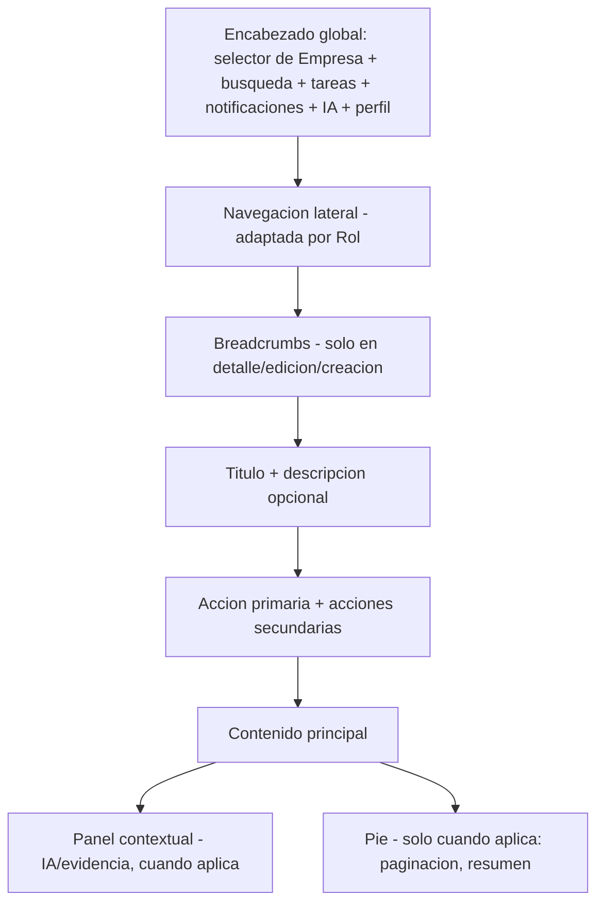
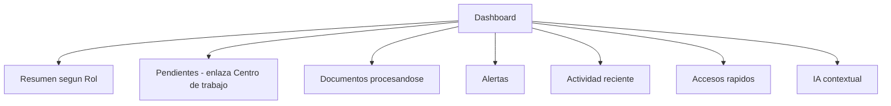
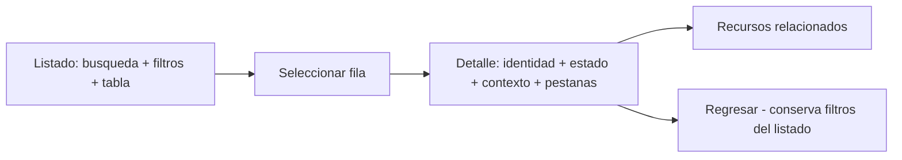
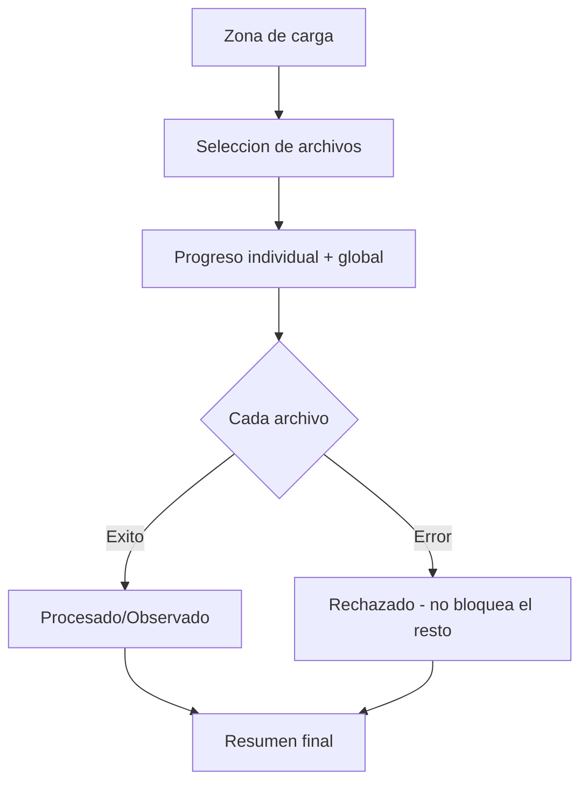
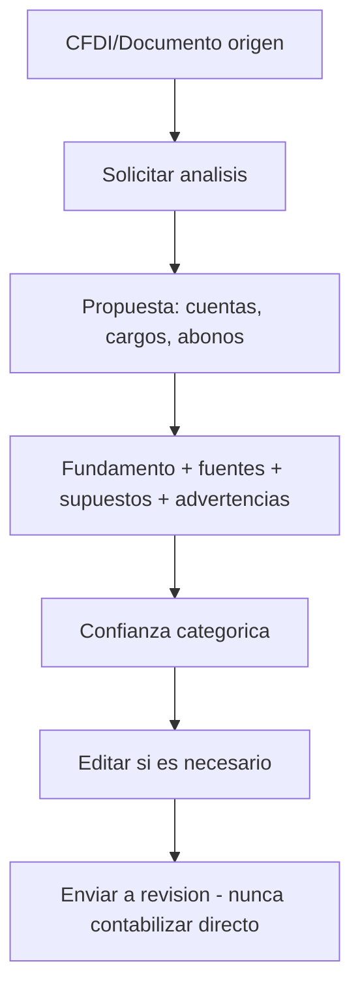
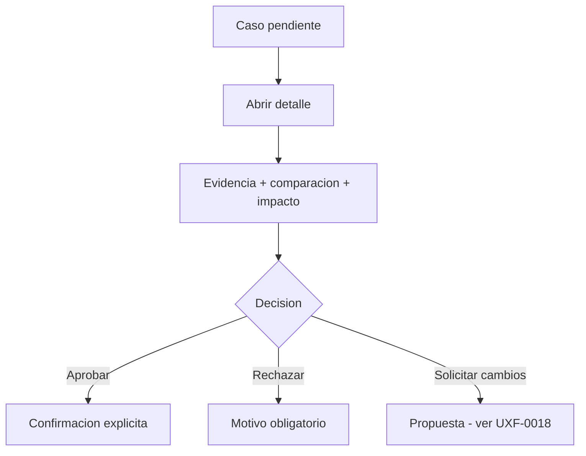
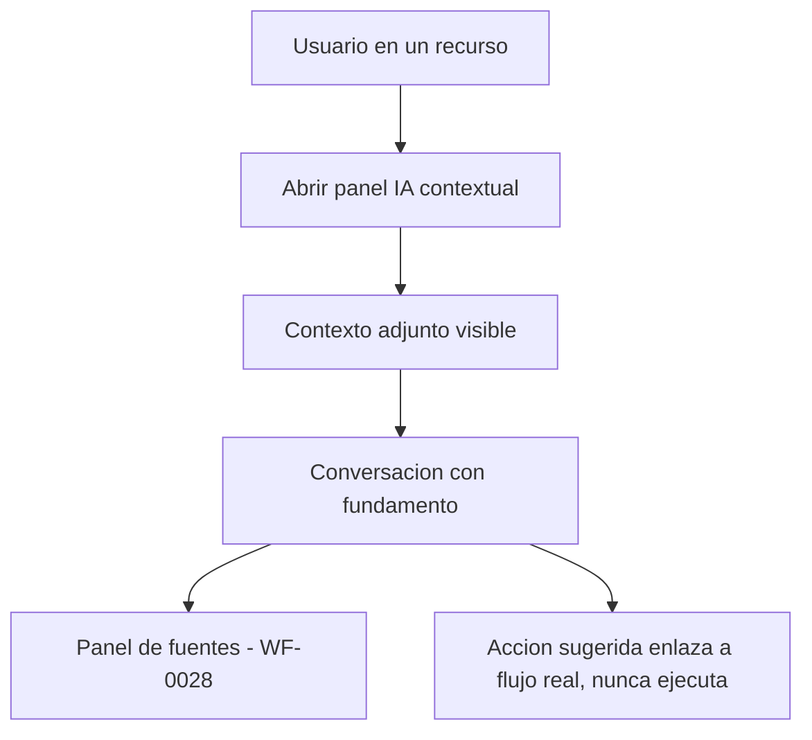
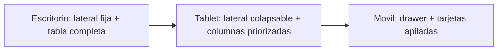

# Especificación de Wireframes — ContaIA

## Control del documento

| Campo                                  | Valor                                                                                                                                                                                                                                                                                                                                                                                                                                                                                   |
| -------------------------------------- | --------------------------------------------------------------------------------------------------------------------------------------------------------------------------------------------------------------------------------------------------------------------------------------------------------------------------------------------------------------------------------------------------------------------------------------------------------------------------------------- |
| Documento                              | 16_WIREFRAMES_SPECIFICATION.md                                                                                                                                                                                                                                                                                                                                                                                                                                                          |
| Orden de trabajo                       | AWO-012                                                                                                                                                                                                                                                                                                                                                                                                                                                                                 |
| Versión                                | 1.0                                                                                                                                                                                                                                                                                                                                                                                                                                                                                     |
| **Estado**                             | **Draft v1.0**                                                                                                                                                                                                                                                                                                                                                                                                                                                                          |
| Fecha de creación                      | 2026-07-18                                                                                                                                                                                                                                                                                                                                                                                                                                                                              |
| Última actualización                   | 2026-07-18                                                                                                                                                                                                                                                                                                                                                                                                                                                                              |
| Fuentes de verdad                      | `MASTER_CONTEXT.md`, `docs/00_PRODUCT_VISION.md`, `docs/01_PRD.md`, `docs/02_USER_PERSONAS.md`, `docs/04_BUSINESS_RULES.md`, `docs/05_SYSTEM_DOMAIN_MODEL.md`, `docs/06_SYSTEM_WORKFLOWS.md`, `docs/07_SOFTWARE_ARCHITECTURE.md`, `docs/08_API_DESIGN.md`, `docs/09_DATABASE_DESIGN.md`, `docs/10_AI_ARCHITECTURE.md`, `docs/11_SECURITY_ARCHITECTURE.md`, `docs/12_FRONTEND_ARCHITECTURE.md`, `docs/13_DESIGN_SYSTEM.md`, `docs/14_INFORMATION_ARCHITECTURE.md`, `docs/15_UX_FLOWS.md` |
| Documentos que este documento alimenta | Prototype Specification (próximo, ver "Observaciones del Arquitecto")                                                                                                                                                                                                                                                                                                                                                                                                                   |

> Nota sobre numeración: la Work Order pedía `docs/16_WIREFRAMES_SPECIFICATION.md`, posición ocupada por `docs/16_RAG_ARCHITECTURE.md` — su **séptima** colisión consecutiva desde AWO-006, ya señalada con creciente énfasis en las Observaciones de AWO-009, 010 y 011. En vez de desplazar de nuevo todo el bloque siguiente, se reubicó `RAG_ARCHITECTURE.md` de forma permanente a `docs/23_RAG_ARCHITECTURE.md` (posición libre al final de la secuencia), sin mover `docs/17` a `docs/22`. Esto resuelve la colisión sin generar una octava. Ver "Observaciones del Arquitecto".

> Este documento especifica estructura, jerarquía y comportamiento de pantallas. No es diseño visual final, no es mockup de alta fidelidad, no modifica la arquitectura de información (`docs/14_INFORMATION_ARCHITECTURE.md`) y no inventa funcionalidad no aprobada.

---

## 1. Propósito y alcance

**Objetivo:** especificar, para cada pantalla prioritaria del MVP, su estructura exacta, contenido, acciones, estados y comportamiento — suficiente para que un equipo de diseño construya wireframes de baja/media fidelidad sin tomar decisiones arquitectónicas adicionales.

**Alcance:** 43 wireframes (`WF-0001` a `WF-0043`, sección 54) que cubren la navegación global y las pantallas de los doce módulos del MVP de `docs/01_PRD.md`.

**Usuarios:** los seis Roles oficiales.

**Módulos:** los once de `docs/12_FRONTEND_ARCHITECTURE.md` / `docs/14_INFORMATION_ARCHITECTURE.md`.

**Relación con Information Architecture:** cada wireframe corresponde a una página ya catalogada (`docs/14_INFORMATION_ARCHITECTURE.md`, sección 40) — este documento no crea páginas nuevas.

**Relación con UX Flows:** cada wireframe representa uno o más pasos de un flujo ya definido (`docs/15_UX_FLOWS.md`) — no inventa pasos ni decisiones nuevas.

**Relación con Design System:** cada wireframe usa componentes ya definidos (`docs/13_DESIGN_SYSTEM.md`, sección 15) — no propone componentes nuevos sin justificarlo (sección 58).

**Exclusiones:** identidad visual final, mockups de alta fidelidad, código, y cualquier pantalla no derivada de una página ya catalogada.

## 2. Metodología de especificación

Plantilla estándar (formato compacto dado el volumen — 43 wireframes):

**WF-XXXX — Nombre**

- Página/Ruta (`docs/14_INFORMATION_ARCHITECTURE.md`) · Módulo · Usuario principal · Empresa requerida · Permiso
- Objetivo · Nivel de fidelidad (sección 3)
- Estructura (bloques en orden de jerarquía)
- Contenido y acciones (primaria/secundarias)
- Estados (sección 55) · Errores relevantes
- Responsive (nota) · Accesibilidad (nota)
- Dependencias (flujo UX, componentes) · Fase

## 3. Niveles de fidelidad

| Nivel                                                  | Resuelve                                                                              | No resuelve                                                       |
| ------------------------------------------------------ | ------------------------------------------------------------------------------------- | ----------------------------------------------------------------- |
| **Baja fidelidad** (este documento)                    | Estructura, jerarquía, bloques, contenido textual real, acciones, estados, relaciones | Color, tipografía final, espaciado exacto, iconografía específica |
| **Media fidelidad** (este documento, donde se detalla) | Disposición de bloques con proporciones relativas, densidad, agrupación visual        | Pixeles exactos, animaciones, micro-interacciones                 |
| **Alta fidelidad** (futuro, fuera de este documento)   | Aplicación completa de `docs/13_DESIGN_SYSTEM.md` (color, tipografía, tokens)         | —                                                                 |

## 4. Plantilla estructural de pantalla

Toda pantalla autenticada comparte el mismo esqueleto:

Este esqueleto es la base de **todos** los wireframes de las secciones 8-45; cada uno especifica solo lo que varía dentro del bloque "Contenido principal" y si requiere "Panel contextual".

## 5. Patrones de layout

| Patrón            | Propósito                    | Ancho                                        | Estructura                                                    |
| ----------------- | ---------------------------- | -------------------------------------------- | ------------------------------------------------------------- |
| Dashboard         | Orientación                  | Completo, grid de tarjetas                   | Tarjetas priorizadas (`docs/13_DESIGN_SYSTEM.md` sección 22)  |
| Listado           | Explorar colección           | Completo                                     | Búsqueda + filtros + tabla + paginación                       |
| Detalle           | Ver/operar un recurso        | Completo, con pestañas si aplica             | Identidad + estado + resumen + pestañas + actividad           |
| Formulario        | Capturar datos               | Ancho de lectura cómodo, 1-2 columnas        | Campos agrupados + acciones                                   |
| Asistente         | Conversación                 | Completo, columna de hilo + panel de fuentes | Mensajes + panel contextual                                   |
| Revisión          | Examinar antes de decidir    | Completo, comparación lado a lado            | Evidencia + comparación + decisión                            |
| Aprobación        | Decidir                      | Igual que revisión + acciones de decisión    | —                                                             |
| Reporte           | Consultar datos empaquetados | Completo                                     | Encabezado de contexto + cuerpo + exportar                    |
| Configuración     | Ajustar parámetros           | Ancho de lectura cómodo                      | Secciones agrupadas                                           |
| Pantalla dividida | Lista + detalle simultáneo   | Completo, 1/3–2/3                            | Lista a la izquierda, detalle a la derecha (colapsa en móvil) |
| Proceso asíncrono | Seguir un Job                | Compacto, tarjeta o banner                   | Estado + progreso + acción                                    |
| Estado vacío      | Ausencia de datos            | Centrado, compacto                           | Ilustración simple + texto + acción (sección 46)              |
| Acceso denegado   | Restricción                  | Centrado, compacto                           | Explicación + acción de retorno                               |

## 6. Jerarquía visual conceptual

| Nivel               | Contenido                                                   |
| ------------------- | ----------------------------------------------------------- |
| 1 — Contexto global | Selector de Empresa, navegación principal                   |
| 2 — Página          | Título, breadcrumb, acción primaria                         |
| 3 — Sección         | Bloques dentro del contenido (pestañas, tarjetas)           |
| 4 — Contenido       | Datos del recurso, filas de tabla, mensajes de conversación |
| 5 — Metadatos       | Fechas, estados, identificadores secundarios                |
| 6 — Ayuda           | Texto de apoyo, tooltips, enlaces de ayuda                  |

**Distinción sin depender de color** (principio 9 de `docs/13_DESIGN_SYSTEM.md`, reiterado aquí): título por tamaño y peso tipográfico; estado por badge con texto, no solo color; Empresa por posición fija (nivel 1, siempre visible); acción principal por prominencia estructural (mayor tamaño, primera en el orden de lectura); alertas por posición e icono, no solo color; evidencia por agrupación visual distintiva (borde, encabezado propio); información secundaria por menor peso tipográfico y nivel 5/6.

## 7. Navegación global

**WF-0001 — Navegación global**

- Persistente en toda pantalla autenticada · Módulo: transversal · Usuario: todos · Empresa: visible siempre · Permiso: filtra ítems visibles
- **Objetivo:** orientar y dar acceso constante a Empresa activa, módulos, búsqueda, tareas, notificaciones, IA y perfil. **Fidelidad:** media.
- **Estructura:** barra superior (selector de Empresa a la izquierda, búsqueda al centro, indicadores de tareas/notificaciones/IA/perfil a la derecha) + barra lateral (los once ítems de `docs/14_INFORMATION_ARCHITECTURE.md` sección 5, filtrados por Rol).
- **Estados:** expandido (escritorio, lateral visible) / colapsado (lateral reducido a iconos) / móvil (lateral oculto tras menú) / sin Empresa activa (solo selector visible, resto deshabilitado) / permisos limitados (ítems no autorizados ausentes, no solo atenuados).
- **Responsive:** lateral colapsa a drawer en móvil; barra superior conserva selector de Empresa y accesos de IA/notificaciones siempre.
- **Accesibilidad:** landmarks de navegación, salto directo al contenido principal, foco gestionado al abrir el drawer móvil.
- **Dependencias:** UXF-0006 (cambio de Empresa). **Fase:** MVP.

## 8. Pantalla de inicio de sesión

**WF-0002 — Inicio de sesión** · PAGE-0001 / ROUTE-0001 · Identity · Todos · Sin Empresa · Sin permiso previo

- **Objetivo:** autenticar. **Fidelidad:** media.
- **Estructura:** marca (logotipo, sin identidad visual final) → formulario (correo, contraseña) → enlace "Recuperar acceso" → acción primaria "Iniciar sesión" → paso de MFA condicional (segunda pantalla del mismo flujo, no un modal separado).
- **Estados:** default, `loading` (botón con indicador), error (credenciales inválidas, genérico), bloqueado (tras intentos fallidos, BR-AUTH-003), MFA requerido.
- **Responsive:** formulario centrado, ancho reducido en todos los tamaños (no se beneficia de más espacio).
- **Accesibilidad:** foco inicial en el campo de correo, error anunciado, botón de mostrar/ocultar contraseña con etiqueta accesible.
- **Dependencias:** UXF-0002. **Fase:** MVP.

## 9. Pantalla de recuperación

**WF-0003 — Recuperación de contraseña** · PAGE-0003 / ROUTE-0003 · Identity · Todos · Sin Empresa

- **Objetivo:** restablecer acceso. **Fidelidad:** media.
- **Estructura:** paso 1 (solicitud: correo, acción primaria "Enviar enlace") → confirmación ("Si el correo existe, se envió un enlace" — mensaje neutro, previene enumeración) → paso 2 (desde el enlace: nueva contraseña, confirmación).
- **Estados:** default, `loading`, éxito (confirmación neutra), enlace expirado (opción de solicitar uno nuevo), error de validación de contraseña.
- **Dependencias:** UXF-0003. **Fase:** MVP.

## 10. Pantalla de invitación

**WF-0004 — Aceptar invitación** · PAGE-0004 / ROUTE-0004 · Identity/Organizations · Usuario invitado · Empresa de la invitación

- **Objetivo:** incorporar al invitado con su Rol asignado. **Fidelidad:** media.
- **Estructura:** nombre de la Empresa invitante, Rol ofrecido, nombre de quien invita → acción primaria "Aceptar" / secundaria "Rechazar" → si el invitado no tiene cuenta, redirige a registro (UXF-0001) antes de volver a este paso.
- **Estados:** default, expirada (mensaje + solicitar reenvío al Administrador), ya aceptada previamente (redirección directa a la Empresa), duplicidad (invitación repetida, se reutiliza la pendiente).
- **Dependencias:** UXF-0004. **Fase:** MVP.

## 11. Selección de empresa

**WF-0005 — Selección de Empresa** · PAGE-0005 / ROUTE-0005 · Organizations · Todos con ≥1 Membresía · N/A

- **Objetivo:** establecer la Empresa activa inicial. **Fidelidad:** media.
- **Estructura:** lista de Empresas con Membresía (nombre, Rol del Usuario en cada una, actividad reciente) → Empresas recientes primero → acción primaria por Empresa "Entrar" → acción secundaria global "Crear Empresa" (UXF-0005 de `docs/15_UX_FLOWS.md`) → sección de invitaciones pendientes si existen.
- **Estados:** default, búsqueda (si hay muchas Empresas), sin Empresas (estado vacío con acción "Crear Empresa" o "Esperar invitación", sección 46), error de carga.
- **Dependencias:** UXF-0006. **Fase:** MVP.

## 12. Creación de empresa

**WF-0006 — Creación de Empresa** · PAGE-0008 / ROUTE-0008 · Organizations · Usuario autenticado · N/A (se crea)

- **Objetivo:** dar de alta una Empresa. **Fidelidad:** media.
- **Estructura por pasos:** 1) Datos generales (razón social, giro) + RFC (validado solo en formato). 2) Configuración inicial opcional (régimen informativo, primer Ejercicio) — **explícitamente marcada como completable después**. 3) Revisión (resumen de lo capturado). 4) Confirmación.
- **Estados:** progreso visible (paso X de 4), borrador conservado entre pasos, validación por paso, error de formato de RFC (advertencia, no bloqueo — BR-CFDI-001 no valida contra el SAT), abandono (se puede retomar), retorno (a Selección de Empresa).
- **Dependencias:** UXF-0005. **Fase:** MVP.

## 13. Onboarding

**WF-0007 — Onboarding** · Vinculada a PAGE-0006 (Inicio) · Organizations · Propietario/Administrador (completo); Contador/Auxiliar (reducido, vía invitación); Estudiante (aparte)

- **Objetivo:** guiar la primera configuración. **Fidelidad:** baja.
- **Estructura:** bienvenida (breve, nombra a la Empresa recién creada) → tarjeta de progreso con 3 pasos: Catálogo de cuentas (UXF-0014), primer Ejercicio, invitar equipo (UXF-0004) → cada paso omitible → asistente IA disponible como ayuda contextual en cada paso, sin sustituir la guía → finalización (redirige a Dashboard, WF-0008).
- **Diferenciación por Rol:** Auxiliar/Contador que llegan vía invitación no ven este onboarding completo, solo un recorrido breve de orientación de su propio Rol.
- **Estados:** progreso, omisión, reanudación (persiste entre sesiones).
- **Dependencias:** UXF-0007. **Fase:** MVP (guía básica); intermedia (adaptativo).

## 14. Dashboard principal

**WF-0008 — Inicio (Dashboard)** · PAGE-0006 / ROUTE-0006 · Todos los módulos (resumen) · Todos · Sí

- **Objetivo:** vista general orientadora, sin saturar. **Fidelidad:** media.
- **Estructura (grid de tarjetas, `docs/13_DESIGN_SYSTEM.md` sección 22):** resumen (indicadores clave según Rol) → Pendientes (enlaza a Centro de trabajo, WF-0009) → Documentos procesándose (si hay) → Alertas relevantes (enlaza a Notificaciones) → Actividad reciente → Accesos rápidos (según Rol) → IA contextual (tarjeta de acceso rápido al Asistente, no una conversación embebida).
- **Variantes por Rol:** Contador ve Pólizas pendientes y Balanza reciente; Auxiliar ve Documentos en proceso y sus propias capturas; Supervisor/Auditor ven principalmente pendientes de revisión/auditoría; Administrador ve resumen de Empresa y Membresías; Estudiante ve accesos al modo educativo únicamente.
- **Estados:** default, `loading` (skeleton por tarjeta, carga independiente entre bloques), Empresa nueva (mayoría de tarjetas en estado vacío con enlace a Onboarding), error parcial (una tarjeta falla sin bloquear las demás).
- **Dependencias:** UXF-0025 (Centro de trabajo). **Fase:** MVP.

## 15. Centro de trabajo

**WF-0009 — Centro de trabajo** · PAGE-0029 / ROUTE-0027 · Notifications/AI · Contador, Supervisor (principal); otros (visibilidad parcial) · Sí

- **Objetivo:** única vista de todo lo accionable. **Fidelidad:** media.
- **Estructura:** filtros (módulo, estado, responsable, fecha) → lista priorizada (urgencia primero, cronología después) → cada ítem: tipo, recurso afectado, responsable, fecha, acceso directo → acciones rápidas (aprobar/rechazar desde la lista solo para casos simples; casos complejos requieren abrir el detalle, WF-0024/0030).
- **Estados:** default, vacío (sin pendientes — mensaje positivo, no un error), `loading`, filtrado sin resultados.
- **Dependencias:** UXF-0025, UXF-0024. **Fase:** MVP.

## 16. Listado de empresas

**WF-0010 — Listado de Empresas** · PAGE-0007 / ROUTE-0007 · Organizations · Administrador · No (lista las propias)

- **Estructura:** encabezado + búsqueda + acción primaria "Crear Empresa" (WF-0006) → tabla/tarjetas: nombre, Rol del Usuario, estado, actividad reciente → acciones por fila (entrar, ver detalle).
- **Estados:** default, vacío (sin Empresas propias), error, móvil (tarjetas en vez de tabla, `docs/13_DESIGN_SYSTEM.md` sección 19).
- **Dependencias:** UXF-0005. **Fase:** MVP.

## 17. Detalle de empresa

**WF-0011 — Detalle de Empresa** · PAGE-0009 / ROUTE-0009 · Organizations · Administrador (gestión), todos (consulta) · Sí

- **Estructura:** identidad (nombre, RFC) + estado → pestañas: Datos generales, Membresías, Permisos (vista de Roles asignados), Configuración, Actividad → acciones críticas (cerrar Ejercicio — enlaza a WF específico de Ejercicios) visibles solo para Administrador → auditoría accesible desde la pestaña Actividad.
- **Estados:** default, edición (Datos generales), vacío en Membresías (solo el propietario), error.
- **Dependencias:** UXF-0033, UXF-0034. **Fase:** MVP.

## 18. Listado de documentos

**WF-0012 — Biblioteca de Documentos** · PAGE-0021 / ROUTE-0020 · Documents · Auxiliar, Contador · Sí

- **Estructura:** acción primaria "Cargar" (WF-0013) → búsqueda + filtros (tipo, estado, fecha) → tabla: nombre, tipo, estado (badge), fecha, relación con CFDI si aplica → selección múltiple con acciones de lote (descarga) → paginación.
- **Estados:** default, vacío, procesando (indicador por fila), error, móvil (tarjetas).
- **Dependencias:** UXF-0009 (carga múltiple), UXF-0010. **Fase:** MVP.

## 19. Zona de carga documental

**WF-0013 — Carga de Documentos** · PAGE-0022 / ROUTE-0021 · Documents · Auxiliar, Contador · Sí

- **Estructura:** zona de arrastrar y soltar + selector estándar → formatos aceptados y límite de tamaño indicados explícitamente → lista de archivos seleccionados antes de confirmar → progreso por archivo tras iniciar (UXF-0008/0009) → cancelación individual → resumen final (procesados/observados/rechazados) con enlaces a cada Documento.
- **Estados:** default, arrastrando (resaltado de la zona), subiendo (progreso), error por archivo (sin bloquear el resto — principio de UXF-0009), completado.
- **Dependencias:** UXF-0008, UXF-0009. **Fase:** MVP.

## 20. Monitor de procesamiento

**WF-0014 — Monitor de procesamiento** · Panel/banner reutilizable, no una página propia · Documents/Fiscal · Quien inició la carga · Sí

- **Estructura:** por lote (X de N completados) y por archivo individual (estado, tiempo transcurrido) → errores inline por archivo → reintento por archivo → "continuar en segundo plano" (cierra el panel sin cancelar el proceso, accesible después desde Centro de trabajo/Notificaciones).
- **Estados:** los de la sección 3 (`cargado/validando/procesando/procesado/observado/rechazado/fallido`).
- **Dependencias:** UXF-0010, UXF-0040. **Fase:** MVP.

## 21. Listado de CFDI

**WF-0015 — Listado de CFDI** · PAGE-0019 / ROUTE-0018 · Fiscal · Auxiliar, Contador, Auditor (lectura) · Sí

- **Estructura:** búsqueda + filtros (RFC, tipo, fecha, estado, monto, presencia de observaciones/riesgo) → tabla: folio, emisor/receptor, monto, estado, fecha → vista compacta opcional (densidad, `docs/13_DESIGN_SYSTEM.md` sección 36) → selección para exportación (UXF-0030).
- **Estados:** default, vacío, error, móvil (tarjetas).
- **Dependencias:** UXF-0011. **Fase:** MVP.

## 22. Detalle de CFDI

**WF-0016 — Detalle de CFDI** · PAGE-0020 / ROUTE-0019 · Fiscal · Auxiliar, Contador, Auditor (lectura) · Sí

- **Estructura:** resumen (folio, emisor, receptor, total) → datos fiscales completos (conceptos, impuestos, relaciones declaradas en el propio XML) → panel de validaciones (**distingue explícitamente:** "dato extraído del archivo" / "verificación interna de ContaIA" — nunca "validado por el SAT", `docs/11_SECURITY_ARCHITECTURE.md` sección 17) → evidencia (Documento origen, descarga) → observaciones (campos ambiguos resaltados) → sugerencias relacionadas (si existe una Póliza propuesta) → IA contextual (WF-0027) → acciones (vincular a Póliza).
- **Estados:** default, con observaciones, vinculado a Póliza, error.
- **Dependencias:** UXF-0011. **Fase:** MVP.

## 23. Comparación de duplicados

**WF-0017 — Comparación de duplicados** · Modal/página derivada de PAGE-0020 · Fiscal · Auxiliar, Contador · Sí

- **Estructura:** recurso A (CFDI ya existente) vs. recurso B (intento nuevo) lado a lado → coincidencias resaltadas (Folio Fiscal) → diferencias si las hay → evidencia de cada uno (fecha de carga, quién) → decisión: descartar / conservar como evidencia / escalar a Contador-Supervisor → consecuencias explicadas antes de confirmar → auditoría del resultado.
- **Dependencias:** UXF-0012. **Fase:** MVP.

## 24. Clasificación documental

**WF-0018 — Clasificación documental** · Panel dentro de PAGE-0023 · Documents/AI · Auxiliar, Contador · Sí

- **Estructura:** tipo sugerido + evidencia breve (por qué) + nivel de confianza (categórico, `docs/13_DESIGN_SYSTEM.md` sección 27) → alternativas si existen → corrección (selector manual) → aprobar (tácito al continuar) / rechazar con motivo → la corrección alimenta retroalimentación (UXF-0023), nunca reentrena en vivo.
- **Dependencias:** UXF-0013. **Fase:** MVP.

## 25. Catálogo de cuentas

**WF-0019 — Catálogo de Cuentas** · PAGE-0010 / ROUTE-0010 · Accounting · Contador · Sí

- **Estructura:** búsqueda + filtro por tipo → vista jerárquica (árbol de Cuentas por naturaleza: Activo/Pasivo/Capital/Ingreso/Gasto) → código, nombre, estado (activa/desactivada) por fila → panel de detalle al seleccionar (WF-0020) → acción primaria "Nueva cuenta".
- **Estados:** default, vacío (Empresa nueva, enlaza a plantilla no oficial marcada como tal), búsqueda sin resultados, error.
- **Dependencias:** UXF-0014. **Fase:** MVP.

## 26. Formulario de cuenta contable

**WF-0020 — Alta/edición de Cuenta** · PAGE-0011 / ROUTE-0011 · Accounting · Contador · Sí

- **Estructura:** código, nombre, tipo/naturaleza, nivel/cuenta padre, descripción opcional → validación de unicidad de código en tiempo real (BR-CAT-002) → para desactivación: **impacto explícito** (cuántas Pólizas la referencian) antes de confirmar, nunca eliminación directa si tiene movimientos.
- **Estados:** creación, edición (con historial visible, BR-CAT-001), error de duplicidad, confirmación de desactivación.
- **Dependencias:** UXF-0014. **Fase:** MVP.

## 27. Listado de pólizas

**WF-0021 — Listado de Pólizas** · PAGE-0012 / ROUTE-0012 · Accounting · Contador, Auxiliar, Supervisor · Sí

- **Estructura:** filtros (periodo/Ejercicio, tipo, estado, origen, creador, monto) → tabla: folio interno, fecha, descripción, monto, estado (badge: borrador/pendiente/definitiva/rechazada), origen (manual/CFDI/IA) → acción primaria "Nueva póliza" (WF-0022, según permiso) → exportación (UXF-0030).
- **Estados:** default, vacío, error, móvil (tarjetas).
- **Dependencias:** UXF-0015 a 0017. **Fase:** MVP.

## 28. Creación de póliza manual

**WF-0022 — Captura de Póliza** · PAGE-0014 / ROUTE-0014 · Accounting · Auxiliar, Contador · Sí

- **Estructura:** encabezado (fecha → determina Ejercicio automáticamente, tipo, descripción) → tabla de movimientos (Cuenta, cargo, abono, línea agregable/eliminable) → totales en tiempo real con **indicador de descuadre visible antes de intentar enviar** (principio 3 de `docs/15_UX_FLOWS.md`) → Documentos relacionados (vincular CFDI existente) → acciones: Guardar borrador / Enviar a revisión (deshabilitado mientras esté descuadrada).
- **Estados:** borrador, validando, descuadrada (bloqueante para envío, no para guardado), lista para enviar, Ejercicio cerrado (mensaje con alternativa de ajuste).
- **Dependencias:** UXF-0015, UXF-0037. **Fase:** MVP.

## 29. Sugerencia de póliza con IA

**WF-0023 — Sugerencia de Póliza (IA)** · Panel sobre PAGE-0020 o vista propia enlazada a PAGE-0014 · AI/Accounting · Contador, Auxiliar (inician); Contador/Supervisor (aprueban) · Sí

- **Estructura:** Documento/CFDI origen (referencia visible) → Cuentas propuestas con cargos/abonos → **separación visual obligatoria** (`docs/13_DESIGN_SYSTEM.md` sección 27): respuesta/propuesta, fundamento, fuentes, supuestos, advertencias, datos faltantes → confianza categórica → edición de la propuesta antes de continuar → comparación con lo que quedaría capturado → acciones: Enviar a revisión / Rechazar la sugerencia.
- **Regla explícita:** **ningún botón ejecuta "contabilizar" directamente** (instrucción explícita) — la única vía hacia `DEFINITIVE` es el mismo flujo de aprobación de WF-0024.
- **Dependencias:** UXF-0016. **Fase:** MVP.

## 30. Revisión de póliza

**WF-0024 — Revisión y aprobación de Póliza** · PAGE-0030 / ROUTE-0028 · Accounting · Contador, Supervisor (nunca Auxiliar, BR-ROL-001) · Sí

- **Estructura:** versión actual vs. anterior si es un ajuste → cambios resaltados → evidencia (Documento/CFDI origen) → comentarios previos (si viene de una corrección solicitada) → impacto (efecto en Balanza si se aprueba) → acciones: **Aprobar** / **Rechazar** (motivo obligatorio) / **Solicitar cambios** (estado propuesto, `docs/15_UX_FLOWS.md` UXF-0018) → historial de decisiones sobre este recurso.
- **Estados:** pendiente, en revisión (otro aprobador la tiene abierta — conflicto potencial, UXF-0038), aprobada, rechazada.
- **Dependencias:** UXF-0017, UXF-0018, UXF-0038. **Fase:** MVP (Aprobar/Rechazar); Solicitar cambios como propuesta pendiente de validación técnica.

## 31. Bandeja de aprobaciones

**WF-0025 — Bandeja de aprobaciones** · Vista filtrada de PAGE-0029 · Notifications/AI · Contador, Supervisor · Sí

- **Estructura:** recursos pendientes de decisión (Pólizas, Sugerencias de IA marcadas) → prioridad, riesgo (badge, `docs/13_DESIGN_SYSTEM.md` sección 5 — nivel "Riesgo" para `REQUIRES_REVIEW`), Empresa (siempre la activa), responsable, filtros → acceso a detalle (WF-0024) → **acciones masivas limitadas** (instrucción explícita: por ejemplo, marcar como revisado no equivale a aprobar en lote — aprobar siempre requiere abrir el detalle individual).
- **Dependencias:** UXF-0024. **Fase:** MVP.

## 32. Asistente IA principal

**WF-0026 — Asistente IA** · PAGE-0027 / ROUTE-0025 · AI · Todos (alcance por Rol) · Sí (o sandbox)

- **Estructura:** historial de conversaciones (lateral) → hilo activo (mensajes del Usuario y respuestas) → cada respuesta con fundamento/fuentes/advertencias visibles inline → cuadro de entrada con adjuntos de contexto (WF-0027 si se abrió desde un recurso) → retroalimentación por respuesta (UXF-0023).
- **Regla explícita:** **no se muestra ningún "razonamiento interno" del modelo** (instrucción explícita) — solo la respuesta final y su fundamento estructurado.
- **Estados:** conversación vacía (primera vez, con ejemplos de preguntas), generando respuesta (indicador distintivo, `docs/13_DESIGN_SYSTEM.md` sección 30), respuesta bloqueada por baja confianza (`REQUIRES_REVIEW`/`INSUFFICIENT`, con explicación).
- **Dependencias:** UXF-0019, UXF-0020. **Fase:** MVP.

## 33. Panel IA contextual

**WF-0027 — Panel IA contextual** · Panel lateral/drawer sobre cualquier página de recurso · AI · Todos · Sí

- **Estructura:** se abre desde CFDI, Documento, Póliza, Cuenta, Reporte, mensaje de error, o Tarea → contexto adjunto visible y removible → conversación embebida (misma estructura que WF-0026, versión compacta) → fuentes accesibles (WF-0028) → acciones sugeridas enlazan al flujo de aprobación real, nunca ejecutan directo.
- **Estados:** contexto confirmado, contexto eliminado (conversación general), cambio de Empresa (ancla la conversación a su Empresa de origen).
- **Dependencias:** UXF-0021. **Fase:** MVP.

## 34. Fuentes y fundamentos

**WF-0028 — Panel de fuentes** · Panel lateral sobre WF-0026/0027 · AI · Todos · N/A (contenido normativo global)

- **Estructura:** listado de fuentes citadas → por fuente: título, tipo, artículo/apartado, vigencia, jurisdicción, fragmento citado → acción "Abrir" (expande el fragmento completo) → "Comparar vigencias" cuando hay más de una fuente aplicable → "Reportar problema" (retroalimentación, UXF-0023) → "Guardar evidencia" (vincula al recurso en revisión activa, si existe) → "Volver a la respuesta" (cierra el panel sin perder el punto de la conversación).
- **Dependencias:** UXF-0022. **Fase:** MVP.

## 35. Tareas

**WF-0029 — Tareas** · Vista dentro de PAGE-0029 (pestaña "Enviadas"/"Asignadas") · Notifications · Todos (propias); Contador/Supervisor (asignadas para decisión) · Sí

- **Estructura:** pestañas (Asignadas, Creadas por mí, Vencidas, Completadas) → por tarea: prioridad, responsable, recurso afectado, estado → filtros → acceso a detalle (WF-0030).
- **Dependencias:** UXF-0024. **Fase:** MVP.

## 36. Detalle de tarea

**WF-0030 — Detalle de Tarea** · PAGE-0030 / ROUTE-0028 (comparte página con Revisión de Póliza cuando el recurso es una Póliza; genérico para otros recursos) · Notifications · Contador, Supervisor · Sí

- **Estructura:** objetivo de la tarea → recurso afectado (enlace directo) → Empresa → responsable → estado → fecha → comentarios → historial → evidencia → acciones según tipo de recurso (aprobar/rechazar si es una Póliza o Sugerencia; marcar atendida si es una Alerta escalada).
- **Dependencias:** UXF-0024. **Fase:** MVP.

## 37. Notificaciones

**WF-0031 — Centro de notificaciones** · PAGE-0031 / ROUTE-0029 · Notifications · Todos · Sí

- **Estructura:** agrupación por importancia (crítica primero) → por Empresa (siempre la activa) → por módulo de origen → cada notificación: icono de tipo, texto claro, fecha, acción directa → marcar como leída (individual o "todas") → enlace a preferencias (WF-0037).
- **Estados:** default, vacío (positivo, no error), notificación crítica (persistente, no se archiva automáticamente), recurso eliminado (mensaje claro, no enlace roto).
- **Dependencias:** UXF-0026. **Fase:** MVP.

## 38. Reportes

**WF-0032 — Catálogo de Reportes** · PAGE-0024 / ROUTE-0023 · Accounting/Reports · Contador, Administrador · Sí

- **Estructura:** reportes predefinidos (Balanza, Estados Financieros) → recientes → favoritos (fase intermedia) → programados (fase intermedia) → estado por reporte reciente (generándose/disponible/fallido) → acción primaria "Generar reporte" (WF-0033).
- **Dependencias:** UXF-0029. **Fase:** MVP (predefinidos, recientes); intermedia (favoritos, programados).

## 39. Generación de reporte

**WF-0033 — Generar Reporte** · Formulario dentro de PAGE-0024 · Accounting · Contador, Administrador · Sí

- **Estructura:** tipo de reporte → Empresa (ya activa) → Ejercicio/periodo → filtros adicionales → formato de salida → resumen de lo solicitado antes de generar → acción primaria "Generar" → si es Job asíncrono, transición a WF-0014 (monitor).
- **Estados:** validación de parámetros, generando, listo (WF-0034), error (con reintento).
- **Dependencias:** UXF-0029. **Fase:** MVP.

## 40. Visualización de reporte

**WF-0034 — Visor de Reporte** · PAGE-0025 / ROUTE-0024 · Accounting · Contador, Administrador · Sí

- **Estructura:** título, Empresa, periodo, fecha de generación, responsable → indicadores clave → tablas (cifras con formato de `docs/13_DESIGN_SYSTEM.md` sección 20) → gráficas cuando aporten (sección 23 de ese documento) → notas/advertencias (BR-EF-003, "no es documento fiscal oficial" cuando aplique) → acciones: Exportar (UXF-0030), Compartir (dentro de la misma Empresa) → auditoría de quién lo generó.
- **Dependencias:** UXF-0029, UXF-0030. **Fase:** MVP.

## 41. Administración de usuarios

**WF-0035 — Membresías de la Empresa** · Pestaña de PAGE-0009 · Organizations · Administrador · Sí

- **Estructura:** búsqueda → tabla: Usuario, Rol, estado, última actividad → acción primaria "Invitar" (WF-0004 en su variante de emisión) → acciones por fila: editar Rol (WF-0036), suspender, reactivar, ver sesiones.
- **Regla explícita:** el control de edición de Rol está **ausente** (no solo deshabilitado) sobre la propia fila del Administrador que la visualiza (BR-PERM-002).
- **Dependencias:** UXF-0033. **Fase:** MVP.

## 42. Edición de rol y permisos

**WF-0036 — Cambiar Rol** · Modal desde WF-0035 · Organizations · Administrador · Sí

- **Estructura:** Usuario, Rol actual → nuevo Rol (selector con los 6 Roles oficiales) → **impacto explícito** ("dejará de poder aprobar Pólizas", etc., derivado de la matriz de `docs/14_INFORMATION_ARCHITECTURE.md` sección 34) → confirmación nombrando Usuario y Empresa (`docs/13_DESIGN_SYSTEM.md` sección 32).
- **Dependencias:** UXF-0034. **Fase:** MVP.

## 43. Auditoría

**WF-0037 — Auditoría de la Empresa** · PAGE-0040 / ROUTE-0034 · Audit · Auditor, Supervisor, Administrador · Sí

- **Estructura:** filtros (actor, recurso, rango de fechas, tipo de acción) → línea de tiempo en lenguaje natural (`docs/14_INFORMATION_ARCHITECTURE.md` sección 26) → detalle expandible por evento (actor, recurso, resultado, origen, motivo) → exportación (Auditor, Administrador).
- **Dependencias:** flujo de auditoría de `docs/06_SYSTEM_WORKFLOWS.md` (workflow 11). **Fase:** MVP.

## 44. Configuración personal

**WF-0038 — Configuración personal** · PAGE-0036/0037/0038 · Configuración · Todos · No

- **Estructura:** perfil (nombre, correo) → idioma/zona horaria → apariencia (modo claro/oscuro, `docs/13_DESIGN_SYSTEM.md` sección 6) → densidad de tablas → notificaciones (preferencias) → seguridad (MFA, contraseña) → sesiones activas (con opción de cerrar individualmente o todas).
- **Dependencias:** UXF-0036 (guardado de cambios), `docs/14_INFORMATION_ARCHITECTURE.md` sección 25. **Fase:** MVP.

## 45. Configuración de empresa

**WF-0039 — Configuración de Empresa** · PAGE-0039 / ROUTE-0033 · Organizations · Administrador · Sí

- **Estructura:** datos generales → fiscal (reservado, sin campos operativos profundos en el MVP) → contable (atajo a Catálogo, WF-0019) → usuarios (atajo a WF-0035) → seguridad (a nivel Empresa, reservado) → integraciones (reservado, sin integraciones activas en el MVP) → documentos (políticas básicas, si existen) → Ejercicios y cierres (atajo a gestión de Ejercicio).
- **Dependencias:** `docs/14_INFORMATION_ARCHITECTURE.md` sección 25. **Fase:** MVP (datos generales, atajos); intermedia/empresarial (integraciones).

## 46. Estados vacíos

**WF-0040 — Conjunto de estados vacíos** (aplicable a WF-0008, 0010, 0012, 0015, 0019, 0021, 0026, 0029, 0031, 0032)

| Contexto                                   | Mensaje/acción                                                                   |
| ------------------------------------------ | -------------------------------------------------------------------------------- |
| Empresa nueva                              | "Aún no hay actividad — comienza configurando tu Catálogo" + enlace a Onboarding |
| Sin Documentos                             | "Carga tu primer documento" + acción directa                                     |
| Sin CFDI                                   | Igual, aclarando que se aceptan XML ya emitidos                                  |
| Sin Pólizas                                | "Captura tu primera póliza o carga un CFDI"                                      |
| Sin Tareas                                 | Mensaje positivo ("Sin pendientes")                                              |
| Sin resultados (búsqueda/filtro)           | Sugerencia de ajustar términos                                                   |
| Sin notificaciones                         | Mensaje positivo                                                                 |
| Sin conversaciones                         | Ejemplos de preguntas sugeridas                                                  |
| Sin permisos (contenido, no ruta completa) | Explicación del Rol requerido                                                    |

**Fase:** MVP.

## 47. Estados de error

**WF-0041 — Conjunto de estados de error** (transversal a todos los wireframes con datos remotos)

| Tipo                      | Explicación                                                    | Siguiente paso                                |
| ------------------------- | -------------------------------------------------------------- | --------------------------------------------- |
| Validación                | Específica por campo                                           | Corregir                                      |
| Red                       | Conectividad                                                   | Reintentar                                    |
| Servidor                  | Genérico, seguro                                               | Reintentar, soporte con `correlationId`       |
| Permiso                   | Rol requerido                                                  | Regresar, solicitar acceso                    |
| Archivo                   | Motivo específico (formato/tamaño/contenido)                   | Reintentar con otro archivo                   |
| Negocio                   | Regla incumplida en lenguaje claro                             | Corregir                                      |
| Fiscal                    | Limitación de fundamento, no "error"                           | Consultar de otra forma, marcar para revisión |
| IA                        | Confianza insuficiente                                         | Ver detalle, solicitar revisión humana        |
| Mantenimiento             | Indisponibilidad planificada                                   | Esperar, ver estado del servicio              |
| Recurso inexistente (404) | Genérico, sin distinguir de "sin permiso" cuando es más seguro | Volver a Inicio, buscar                       |

**Fase:** MVP.

## 48. Estados de carga

**WF-0042 — Conjunto de estados de carga**

| Contexto                            | Tratamiento                                                   |
| ----------------------------------- | ------------------------------------------------------------- |
| Carga inicial de página             | Skeleton estructural (`docs/13_DESIGN_SYSTEM.md` sección 30)  |
| Carga parcial (una tarjeta/sección) | Skeleton local, resto de la página interactivo                |
| Acción (botón)                      | Spinner dentro del botón, deshabilitado temporalmente         |
| Archivo                             | Progreso real de subida                                       |
| Reporte                             | Carga progresiva (estructura primero, datos costosos después) |
| IA                                  | Indicador distintivo "generando respuesta"                    |
| Tabla                               | Skeleton de filas                                             |
| Procesamiento (Job)                 | Ver WF-0014                                                   |

**Fase:** MVP.

## 49. Confirmaciones críticas

**WF-0043 — Conjunto de confirmaciones críticas**

| Acción                                 | Debe comunicar                                                                                                                                    |
| -------------------------------------- | ------------------------------------------------------------------------------------------------------------------------------------------------- |
| Eliminar (solo no confirmados)         | Recurso específico, irreversibilidad real                                                                                                         |
| Suspender Usuario                      | Usuario, Empresa, efecto inmediato en su acceso                                                                                                   |
| Cambiar Rol                            | Ver WF-0036                                                                                                                                       |
| Aprobar Póliza                         | Póliza, monto, Empresa, inmutabilidad resultante                                                                                                  |
| Rechazar                               | Motivo obligatorio antes de confirmar                                                                                                             |
| Cerrar Ejercicio                       | Ejercicio, Empresa, Pólizas pendientes advertidas                                                                                                 |
| Reabrir Ejercicio                      | **Propuesta, no confirmada técnicamente** (`docs/15_UX_FLOWS.md` UXF-0032) — si se habilita, requiere permiso de Administrador y motivo explícito |
| Exportar datos (masivo)                | Alcance exacto, Empresa, confirmación reforzada                                                                                                   |
| Cambiar Empresa con cambios pendientes | Qué se perdería si continúa sin guardar                                                                                                           |

**Fase:** MVP (salvo reabrir Ejercicio, marcado como propuesta).

## 50. Responsive

| Patrón               | Escritorio amplio                     | Laptop            | Tablet                   | Móvil                                        |
| -------------------- | ------------------------------------- | ----------------- | ------------------------ | -------------------------------------------- |
| Navegación (WF-0001) | Lateral fija                          | Lateral fija      | Colapsable               | Drawer                                       |
| Listados             | Tabla completa                        | Tabla completa    | Columnas priorizadas     | Tarjetas apiladas                            |
| Detalle              | Contenido + panel lateral simultáneos | Igual             | Panel lateral colapsable | Panel lateral como vista separada            |
| Formularios          | 1-2 columnas                          | 1-2 columnas      | 1 columna                | 1 columna, 1 campo por fila                  |
| Dashboards           | Grid 3-4 columnas                     | Grid 2-3 columnas | Grid 2 columnas          | Lista vertical priorizada                    |
| Modales              | Centrados, ancho fijo                 | Igual             | Igual                    | Pantalla completa                            |
| IA (WF-0026/0027)    | Panel lateral persistente             | Igual             | Panel expandible         | Vista de pantalla completa                   |
| Acciones críticas    | Confirmación estándar                 | Igual             | Igual                    | Confirmación reforzada (mayor tamaño táctil) |

## 51. Accesibilidad

Cada wireframe de las secciones 8-49 hereda, sin repetirse por entrada: orden de foco lógico (sigue la jerarquía de la sección 6); landmarks semánticos (navegación, contenido principal, búsqueda); jerarquía de encabezados consistente; etiquetas accesibles en todo control; mensajes y errores anunciados al aparecer; navegación completa por teclado; compatibilidad con lectores de pantalla; tamaño táctil mínimo 44px en superficies táctiles; contraste validado en la fase de alta fidelidad (no en este documento, pero reservado explícitamente); reducción de movimiento respetada en toda transición/animación.

## 52. Anotaciones de wireframe

Convención de anotación para cada bloque de un wireframe: `[Componente]` (referencia a `docs/13_DESIGN_SYSTEM.md`, sección 15) — `Comportamiento` (qué hace al interactuar) — `Estado(s) aplicable(s)` (sección 3 de `docs/15_UX_FLOWS.md`) — `Permiso` (qué Rol lo ve/usa) — `Validación` (si aplica) — `Evento` (qué dispara, `docs/05_SYSTEM_DOMAIN_MODEL.md` sección 8) — `Dependencia` (otro WF o UXF relacionado) — `Responsive` (cómo cambia) — `Accesibilidad` (nota específica si difiere de la transversal) — `Contenido dinámico` (qué texto/dato proviene del backend vs. es estático de interfaz).

## 53. Diagramas Mermaid

Anatomía de pantalla ya incluida (sección 4). Se agregan los restantes:

### 53.1 Dashboard

### 53.2 Listado y detalle

### 53.3 Carga documental

### 53.4 Sugerencia IA

### 53.5 Aprobación humana

### 53.6 Asistente contextual

### 53.7 Responsive conceptual

## 54. Catálogo de wireframes

| ID      | Nombre                             | Página          | Módulo           | Actor                              | Empresa    | Patrón               | Prioridad | Fase |
| ------- | ---------------------------------- | --------------- | ---------------- | ---------------------------------- | ---------- | -------------------- | --------- | ---- |
| WF-0001 | Navegación global                  | (transversal)   | (transversal)    | Todos                              | Sí         | —                    | Crítica   | MVP  |
| WF-0002 | Inicio de sesión                   | PAGE-0001       | Identity         | Todos                              | No         | Formulario           | Crítica   | MVP  |
| WF-0003 | Recuperación                       | PAGE-0003       | Identity         | Todos                              | No         | Formulario           | Alta      | MVP  |
| WF-0004 | Invitación                         | PAGE-0004       | Organizations    | Invitado                           | Sí         | Formulario           | Alta      | MVP  |
| WF-0005 | Selección de Empresa               | PAGE-0005       | Organizations    | Todos                              | No         | Listado              | Crítica   | MVP  |
| WF-0006 | Creación de Empresa                | PAGE-0008       | Organizations    | Usuario                            | No         | Formulario por pasos | Alta      | MVP  |
| WF-0007 | Onboarding                         | PAGE-0006       | Organizations    | Administrador                      | Sí         | Asistente guiado     | Media     | MVP  |
| WF-0008 | Dashboard                          | PAGE-0006       | (transversal)    | Todos                              | Sí         | Dashboard            | Crítica   | MVP  |
| WF-0009 | Centro de trabajo                  | PAGE-0029       | Notifications/AI | Contador, Supervisor               | Sí         | Listado              | Crítica   | MVP  |
| WF-0010 | Listado de Empresas                | PAGE-0007       | Organizations    | Administrador                      | No         | Listado              | Media     | MVP  |
| WF-0011 | Detalle de Empresa                 | PAGE-0009       | Organizations    | Administrador                      | Sí         | Detalle              | Alta      | MVP  |
| WF-0012 | Biblioteca de Documentos           | PAGE-0021       | Documents        | Auxiliar, Contador                 | Sí         | Listado              | Crítica   | MVP  |
| WF-0013 | Carga de Documentos                | PAGE-0022       | Documents        | Auxiliar, Contador                 | Sí         | Formulario           | Crítica   | MVP  |
| WF-0014 | Monitor de procesamiento           | (panel)         | Documents/Fiscal | Quien inició                       | Sí         | Proceso asíncrono    | Alta      | MVP  |
| WF-0015 | Listado de CFDI                    | PAGE-0019       | Fiscal           | Auxiliar, Contador, Auditor        | Sí         | Listado              | Crítica   | MVP  |
| WF-0016 | Detalle de CFDI                    | PAGE-0020       | Fiscal           | Auxiliar, Contador, Auditor        | Sí         | Detalle              | Crítica   | MVP  |
| WF-0017 | Comparación de duplicados          | (modal)         | Fiscal           | Auxiliar, Contador                 | Sí         | Revisión             | Media     | MVP  |
| WF-0018 | Clasificación documental           | (panel)         | Documents/AI     | Auxiliar, Contador                 | Sí         | Revisión             | Media     | MVP  |
| WF-0019 | Catálogo de Cuentas                | PAGE-0010       | Accounting       | Contador                           | Sí         | Listado              | Alta      | MVP  |
| WF-0020 | Formulario de Cuenta               | PAGE-0011       | Accounting       | Contador                           | Sí         | Formulario           | Alta      | MVP  |
| WF-0021 | Listado de Pólizas                 | PAGE-0012       | Accounting       | Contador, Auxiliar, Supervisor     | Sí         | Listado              | Crítica   | MVP  |
| WF-0022 | Captura de Póliza                  | PAGE-0014       | Accounting       | Auxiliar, Contador                 | Sí         | Formulario           | Crítica   | MVP  |
| WF-0023 | Sugerencia de Póliza (IA)          | (panel)         | AI/Accounting    | Contador, Auxiliar                 | Sí         | Revisión             | Crítica   | MVP  |
| WF-0024 | Revisión y aprobación de Póliza    | PAGE-0030       | Accounting       | Contador, Supervisor               | Sí         | Aprobación           | Crítica   | MVP  |
| WF-0025 | Bandeja de aprobaciones            | PAGE-0029       | Notifications/AI | Contador, Supervisor               | Sí         | Listado              | Alta      | MVP  |
| WF-0026 | Asistente IA                       | PAGE-0027       | AI               | Todos                              | Sí/sandbox | Asistente            | Crítica   | MVP  |
| WF-0027 | Panel IA contextual                | (panel)         | AI               | Todos                              | Sí         | Asistente            | Alta      | MVP  |
| WF-0028 | Fuentes y fundamentos              | (panel)         | AI               | Todos                              | N/A        | Revisión             | Media     | MVP  |
| WF-0029 | Tareas                             | PAGE-0029       | Notifications    | Todos                              | Sí         | Listado              | Alta      | MVP  |
| WF-0030 | Detalle de Tarea                   | PAGE-0030       | Notifications    | Contador, Supervisor               | Sí         | Detalle              | Alta      | MVP  |
| WF-0031 | Centro de notificaciones           | PAGE-0031       | Notifications    | Todos                              | Sí         | Listado              | Alta      | MVP  |
| WF-0032 | Catálogo de Reportes               | PAGE-0024       | Reports          | Contador, Administrador            | Sí         | Reporte              | Media     | MVP  |
| WF-0033 | Generar Reporte                    | PAGE-0024       | Reports          | Contador, Administrador            | Sí         | Formulario           | Media     | MVP  |
| WF-0034 | Visor de Reporte                   | PAGE-0025       | Reports          | Contador, Administrador            | Sí         | Reporte              | Media     | MVP  |
| WF-0035 | Membresías de la Empresa           | PAGE-0009       | Organizations    | Administrador                      | Sí         | Listado              | Alta      | MVP  |
| WF-0036 | Cambiar Rol                        | (modal)         | Organizations    | Administrador                      | Sí         | Confirmación         | Alta      | MVP  |
| WF-0037 | Auditoría de la Empresa            | PAGE-0040       | Audit            | Auditor, Supervisor, Administrador | Sí         | Historial            | Media     | MVP  |
| WF-0038 | Configuración personal             | PAGE-0036/37/38 | Configuración    | Todos                              | No         | Configuración        | Media     | MVP  |
| WF-0039 | Configuración de Empresa           | PAGE-0039       | Organizations    | Administrador                      | Sí         | Configuración        | Media     | MVP  |
| WF-0040 | Estados vacíos (conjunto)          | (transversal)   | (transversal)    | Todos                              | Variable   | Estado vacío         | Alta      | MVP  |
| WF-0041 | Estados de error (conjunto)        | (transversal)   | (transversal)    | Todos                              | Variable   | Estado de error      | Crítica   | MVP  |
| WF-0042 | Estados de carga (conjunto)        | (transversal)   | (transversal)    | Todos                              | Variable   | —                    | Crítica   | MVP  |
| WF-0043 | Confirmaciones críticas (conjunto) | (transversal)   | (transversal)    | Variable                           | Sí         | Confirmación         | Crítica   | MVP  |

## 55. Matriz de estados

`✓` disponible · `—` no aplica

| Wireframe                    | default | loading | empty                | error | success | read-only            | disabled                 | access denied                       | offline |
| ---------------------------- | ------- | ------- | -------------------- | ----- | ------- | -------------------- | ------------------------ | ----------------------------------- | ------- |
| WF-0008 Dashboard            | ✓       | ✓       | ✓                    | ✓     | —       | —                    | —                        | —                                   | ✓       |
| WF-0012 Biblioteca           | ✓       | ✓       | ✓                    | ✓     | —       | ✓ (Auditor)          | —                        | —                                   | ✓       |
| WF-0016 Detalle CFDI         | ✓       | ✓       | —                    | ✓     | ✓       | ✓ (Auditor)          | —                        | ✓                                   | ✓       |
| WF-0021 Listado Pólizas      | ✓       | ✓       | ✓                    | ✓     | —       | ✓ (Auditor)          | —                        | —                                   | ✓       |
| WF-0022 Captura de Póliza    | ✓       | ✓       | —                    | ✓     | ✓       | —                    | ✓ (Ejercicio cerrado)    | ✓ (Auxiliar sin permiso de aprobar) | ✓       |
| WF-0024 Aprobación de Póliza | ✓       | ✓       | ✓ (sin pendientes)   | ✓     | ✓       | ✓ (Auditor)          | ✓ (ya resuelto por otro) | ✓ (Auxiliar)                        | ✓       |
| WF-0026 Asistente IA         | ✓       | ✓       | ✓ (sin conversación) | ✓     | —       | —                    | ✓ (respuesta bloqueada)  | ✓ (Auditor)                         | ✓       |
| WF-0035 Membresías           | ✓       | ✓       | — (siempre ≥1)       | ✓     | —       | ✓ (no Administrador) | ✓ (fila propia)          | ✓                                   | ✓       |

_(Muestra representativa; el patrón se extiende al catálogo completo de la sección 54.)_

## 56. Matriz de trazabilidad

Muestra representativa:

| Wireframe                         | Página    | Ruta       | Flujo UX       | Módulo     | Persona                            | BR                     | Permiso      | Componente                                            | Endpoint conceptual | Fase |
| --------------------------------- | --------- | ---------- | -------------- | ---------- | ---------------------------------- | ---------------------- | ------------ | ----------------------------------------------------- | ------------------- | ---- |
| WF-0013 Carga de Documentos       | PAGE-0022 | ROUTE-0021 | UXF-0008, 0009 | Documents  | Auxiliar, Contador                 | BR-DOC-*, BR-XML-001   | Captura      | Zona de carga (`docs/13_DESIGN_SYSTEM.md` sección 26) | API-0023            | MVP  |
| WF-0022 Captura de Póliza         | PAGE-0014 | ROUTE-0014 | UXF-0015       | Accounting | Auxiliar, Contador                 | BR-POL-001/002         | Captura      | Formulario con validación en vivo                     | API-0033            | MVP  |
| WF-0023 Sugerencia de Póliza (IA) | —         | ROUTE-0025 | UXF-0016       | AI         | Contador, Auxiliar                 | BR-IA-004/006/007      | Generación   | Tarjeta de respuesta IA                               | API-0042            | MVP  |
| WF-0024 Aprobación de Póliza      | PAGE-0030 | ROUTE-0028 | UXF-0017       | Accounting | Contador, Supervisor               | BR-POL-003, BR-GLB-002 | Aprobación   | Confirmación crítica (sección 49)                     | API-0037/38         | MVP  |
| WF-0037 Auditoría                 | PAGE-0040 | ROUTE-0034 | (workflow 11)  | Audit      | Auditor, Supervisor, Administrador | BR-AUD-*               | Solo lectura | Línea de tiempo                                       | API-0049/50         | MVP  |

## 57. Wireframes prioritarios del MVP

| Prioridad                                        | Wireframes                                                                                              |
| ------------------------------------------------ | ------------------------------------------------------------------------------------------------------- |
| **Crítica (bloquean el ciclo de valor)**         | WF-0001, 0002, 0005, 0008, 0009, 0012, 0013, 0015, 0016, 0021, 0022, 0023, 0024, 0026, 0041, 0042, 0043 |
| **Alta**                                         | WF-0003, 0004, 0006, 0011, 0014, 0019, 0020, 0025, 0027, 0029, 0030, 0031, 0035, 0036, 0040             |
| **Media (MVP, no bloqueante del ciclo central)** | WF-0007, 0010, 0017, 0018, 0028, 0032, 0033, 0034, 0037, 0038, 0039                                     |
| **Fase intermedia**                              | Variantes enriquecidas de WF-0007 (onboarding adaptativo), WF-0032 (favoritos/programados)              |
| **Fase empresarial**                             | Variantes de WF-0039 (integraciones configurables)                                                      |

## 58. Riesgos

- **Saturación:** WF-0008 (Dashboard) es el de mayor riesgo de acumular demasiadas tarjetas si no se disciplina contra el principio de densidad controlada (`docs/13_DESIGN_SYSTEM.md`, sección 22).
- **Jerarquía confusa:** WF-0016 (Detalle de CFDI) mezcla varias fuentes de información (dato extraído, verificación interna, observaciones, sugerencias) — requiere disciplina visual estricta para no confundir niveles de certeza (sección 6).
- **Paneles excesivos:** WF-0027 (IA contextual) podría competir visualmente con el contenido principal si no se limita a un solo panel activo a la vez.
- **Tablas ilegibles:** WF-0015/0021 con alto volumen de columnas requieren la densidad compacta de `docs/13_DESIGN_SYSTEM.md` (sección 36) desde el diseño, no como ajuste posterior.
- **Navegación profunda:** WF-0030 (Detalle de Tarea) puede acumular niveles si no reutiliza fielmente el patrón de WF-0024.
- **Experiencia móvil deficiente:** WF-0022 (Captura de Póliza) es el candidato de mayor riesgo en móvil dado el volumen de campos — coherente con la limitación ya señalada en `docs/15_UX_FLOWS.md` (UXF-0041).
- **Pérdida de contexto:** WF-0027/0028 dependen de una implementación fiel del "regresar sin perder el punto de la conversación" — riesgo de implementación, no de especificación.
- **Confusión multiempresa:** mitigado estructuralmete (WF-0001, WF-0043) pero sigue siendo el riesgo más persistente heredado de toda la serie de documentos.
- **IA dominante:** riesgo de que WF-0023/0026/0027 se sientan como el centro de la aplicación en vez de una capa de apoyo — mitigado por la separación visual obligatoria (sección 27 de `docs/13_DESIGN_SYSTEM.md`), pero requiere disciplina en implementación.
- **Acciones críticas ambiguas:** mitigado por WF-0043, pero requiere que cada wireframe individual lo aplique consistentemente, no solo el catálogo transversal.
- **Exceso de modales:** WF-0017, 0036 y las confirmaciones de WF-0043 deben evaluarse en conjunto para no encadenar más de un modal a la vez sobre el mismo flujo.
- **Duplicidad de patrones:** riesgo si WF-0009 (Centro de trabajo) y WF-0025 (Bandeja de aprobaciones) no se diferencian con suficiente claridad en implementación — ambos comparten PAGE-0029, por diseño (`docs/14_INFORMATION_ARCHITECTURE.md` sección 19), pero deben distinguirse como vista general vs. vista filtrada de decisión.

## 59. Recomendaciones para Prototyping

- **Wireframes a prototipar primero:** los de prioridad crítica (sección 57) — sostienen el ciclo CFDI → Póliza → aprobación → Reporte que valida el MVP completo.
- **Interacciones:** el prototipo debe cubrir, como mínimo, las transiciones de WF-0013→0014 (carga a procesamiento), WF-0016→0023→0024 (CFDI a sugerencia a aprobación), y WF-0006 del selector de foto de estado de Job.
- **Transiciones:** duración y easing conceptual ya definidos en `docs/13_DESIGN_SYSTEM.md` (sección 13) — el prototipo los aplica, no los redefine.
- **Estados:** el prototipo debe ser capaz de simular al menos `default`, `loading`, `error` y `success` para cada wireframe crítico (sección 55).
- **Datos de prueba:** sintéticos únicamente, nunca datos reales de una Empresa (coherente con `docs/09_DATABASE_DESIGN.md` sección 17 y `docs/11_SECURITY_ARCHITECTURE.md` sección 25).
- **Tareas de usuario para pruebas:** "Cargar un CFDI y verificar sus datos", "Capturar y aprobar una Póliza", "Usar el Asistente para resolver una duda contable con fuente", "Revisar y aprobar una Sugerencia de IA", "Cambiar de Empresa sin perder el trabajo en curso".
- **Criterios de éxito:** tasa de finalización de cada tarea sin ayuda externa; ningún participante confunde una Empresa con otra durante la prueba; ningún participante interpreta una Sugerencia de IA como ya aplicada antes de aprobarla explícitamente.

Este documento no construye ese prototipo — entrega la especificación completa de estructura, estados y comportamiento para que el siguiente documento lo haga.

---

## Historial de cambios

| Fecha      | Cambio                                                                                                                                                                                                                                                                                                                                                                                                                                                                                                                                                                                                               | Responsable                        |
| ---------- | -------------------------------------------------------------------------------------------------------------------------------------------------------------------------------------------------------------------------------------------------------------------------------------------------------------------------------------------------------------------------------------------------------------------------------------------------------------------------------------------------------------------------------------------------------------------------------------------------------------------- | ---------------------------------- |
| 2026-07-18 | Creación de la primera versión completa de `docs/16_WIREFRAMES_SPECIFICATION.md` bajo AWO-012: metodología, niveles de fidelidad, plantilla estructural, patrones de layout, jerarquía visual, 43 wireframes (`WF-0001` a `WF-0043`) cubriendo navegación global y las pantallas de los doce módulos del MVP, estados vacíos/error/carga/confirmaciones críticas como conjuntos transversales, responsive, accesibilidad, anotaciones, 7 diagramas Mermaid, catálogo de wireframes, matriz de estados, matriz de trazabilidad, priorización del MVP, riesgos y recomendaciones para Prototyping. Estado: Draft v1.0. | Responsable de producto de ContaIA |

---

## Observaciones del Arquitecto

**Decisiones tomadas:**

- Se resolvió la séptima colisión consecutiva de `docs/16` **de forma permanente**, no con otro desplazamiento: `RAG_ARCHITECTURE.md` se reubicó a `docs/23` (posición libre al final de la secuencia), sin mover los seis documentos intermedios (`docs/17` a `docs/22`). Esto responde directamente a la recomendación creciente registrada en las Observaciones de AWO-009, 010 y 011.
- Se usó el mismo formato compacto de plantilla que `docs/15_UX_FLOWS.md` para los 43 wireframes, evitando repetir los 17 campos completos en prosa extensa por cada uno — decisión de formato declarada explícitamente.
- WF-0009 (Centro de trabajo) y WF-0025 (Bandeja de aprobaciones) se especificaron como la misma página (PAGE-0029) con dos vistas — coherente con la decisión ya tomada en `docs/14_INFORMATION_ARCHITECTURE.md` (sección 19), no una nueva página.
- WF-0024 (Revisión y aprobación de Póliza) y WF-0043 (confirmaciones críticas) heredan explícitamente la reconciliación de estados ya hecha en `docs/14_INFORMATION_ARCHITECTURE.md` y `docs/15_UX_FLOWS.md` — "Solicitar cambios" y "Reabrir Ejercicio" se marcan como propuestas, no como funcionalidad confirmada.
- Los estados vacíos, de error, de carga y las confirmaciones críticas (secciones 46-49) se especificaron como **conjuntos transversales reutilizables** (WF-0040 a WF-0043) en vez de repetirlos dentro de cada uno de los 39 wireframes anteriores — evita duplicidad de especificación sin perder cobertura.

**Patrones aprobados:** los 13 de la sección 5 (dashboard, listado, detalle, formulario, asistente, revisión, aprobación, reporte, configuración, pantalla dividida, proceso asíncrono, estado vacío, acceso denegado) — ningún wireframe usa un patrón fuera de este conjunto.

**Pantallas prioritarias:** ver sección 57 — 17 wireframes de prioridad crítica sostienen el ciclo de valor central del MVP.

**Riesgos:** ver sección 58 completa; el de mayor atención inmediata sigue siendo la confusión multiempresa, consistente con todos los documentos anteriores de esta serie.

**Inconsistencias encontradas:** ninguna contradicción con las fuentes de verdad aprobadas, salvo el conflicto de numeración ya resuelto de forma permanente.

**Wireframes pendientes:** variantes de fase intermedia (onboarding adaptativo, favoritos/programados de Reportes) y fase empresarial (integraciones configurables) — no especificadas en detalle, solo referenciadas en la sección 57.

**Validaciones necesarias:** confirmar con usuarios reales la densidad de WF-0008 (Dashboard) y la usabilidad móvil de WF-0022 (Captura de Póliza); validar que WF-0009/0025 se perciban como complementarias y no redundantes.

**Dependencias para AWO-013 (Prototype Specification):**

- Ver sección 59 completa.
- Debe resolverse, junto con el responsable de producto, el estado de "Solicitar cambios" (WF-0024) y "Reabrir Ejercicio" (WF-0043) antes de que el prototipo los represente como interactivos.
- `docs/00_DOCUMENTATION_INDEX.md` y `docs/00_DOCUMENTATION_GUIDE.md` siguen sin existir (hallazgo original en `docs/02_USER_PERSONAS.md`); con dieciséis documentos técnicos ya interconectados, un catálogo de 43 wireframes, 41 flujos, 42 páginas y 36 rutas, la ausencia de un índice mantenido sigue siendo el riesgo documental más alto del proyecto — la reubicación permanente de `RAG_ARCHITECTURE.md` en este turno es un ejemplo concreto del tipo de deuda que un índice mantenido habría hecho innecesaria.
