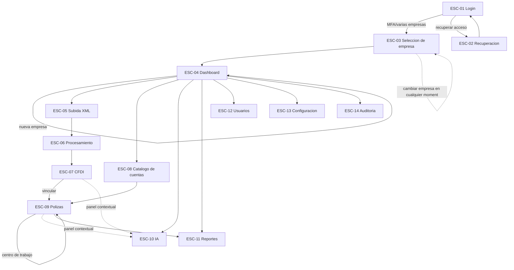
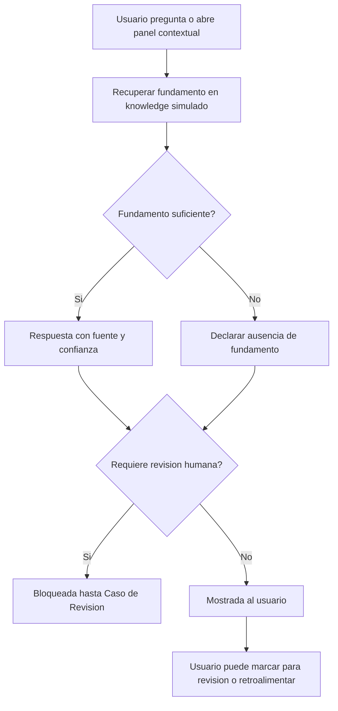
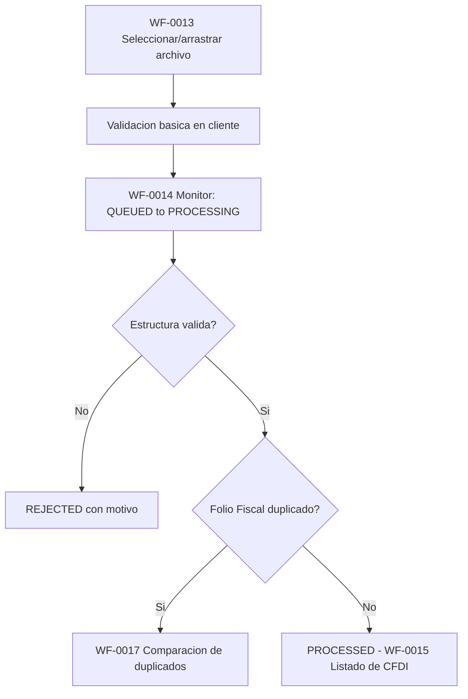
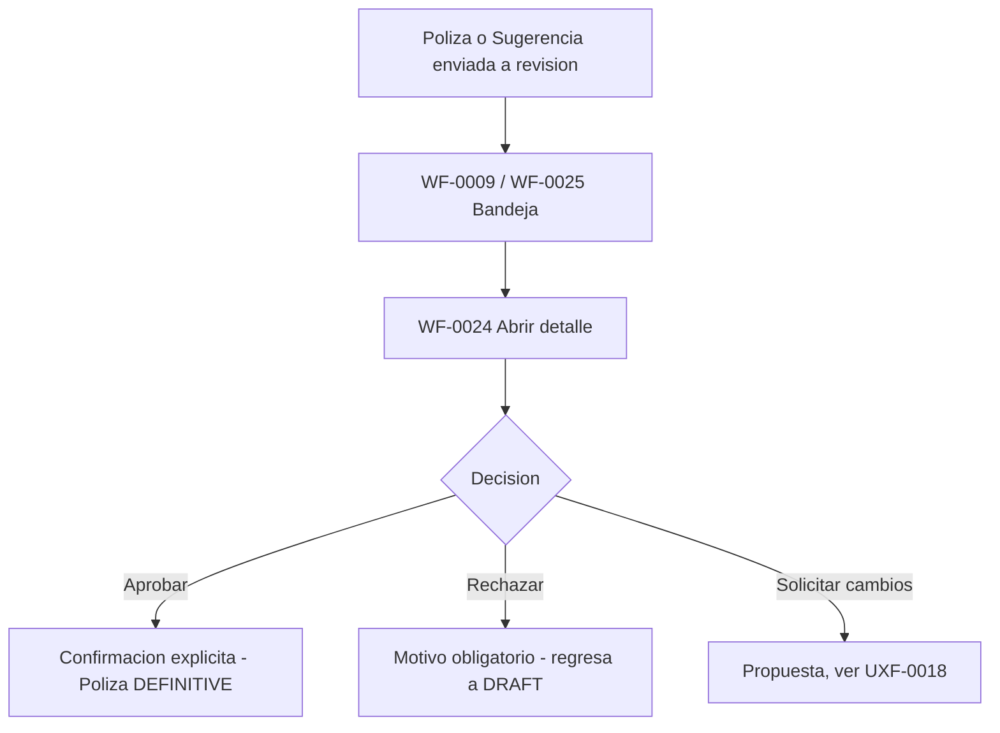
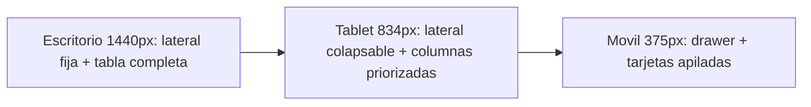

# Especificación de Prototipo — ContaIA

## Control del documento

| Campo                                  | Valor                                                                                                                                                                                                                                                                                                                                                                                                                                                                                                                          |
| -------------------------------------- | ------------------------------------------------------------------------------------------------------------------------------------------------------------------------------------------------------------------------------------------------------------------------------------------------------------------------------------------------------------------------------------------------------------------------------------------------------------------------------------------------------------------------------ |
| Documento                              | 17_PROTOTYPE_SPECIFICATION.md                                                                                                                                                                                                                                                                                                                                                                                                                                                                                                  |
| Orden de trabajo                       | AWO-013                                                                                                                                                                                                                                                                                                                                                                                                                                                                                                                        |
| Versión                                | 1.0                                                                                                                                                                                                                                                                                                                                                                                                                                                                                                                            |
| **Estado**                             | **Draft v1.0**                                                                                                                                                                                                                                                                                                                                                                                                                                                                                                                 |
| Fecha de creación                      | 2026-07-18                                                                                                                                                                                                                                                                                                                                                                                                                                                                                                                     |
| Última actualización                   | 2026-07-18                                                                                                                                                                                                                                                                                                                                                                                                                                                                                                                     |
| Fuentes de verdad                      | `MASTER_CONTEXT.md`, `docs/00_PRODUCT_VISION.md`, `docs/01_PRD.md`, `docs/02_USER_PERSONAS.md`, `docs/04_BUSINESS_RULES.md`, `docs/05_SYSTEM_DOMAIN_MODEL.md`, `docs/06_SYSTEM_WORKFLOWS.md`, `docs/07_SOFTWARE_ARCHITECTURE.md`, `docs/08_API_DESIGN.md`, `docs/09_DATABASE_DESIGN.md`, `docs/10_AI_ARCHITECTURE.md`, `docs/11_SECURITY_ARCHITECTURE.md`, `docs/12_FRONTEND_ARCHITECTURE.md`, `docs/13_DESIGN_SYSTEM.md`, `docs/14_INFORMATION_ARCHITECTURE.md`, `docs/15_UX_FLOWS.md`, `docs/16_WIREFRAMES_SPECIFICATION.md` |
| Documentos que este documento alimenta | `docs/18_UI_SPECIFICATION.md` (próximo, ver "Observaciones del Arquitecto")                                                                                                                                                                                                                                                                                                                                                                                                                                                    |

> Nota sobre numeración: la Work Order referenciaba `docs/03_BUSINESS_RULES.md`, `docs/04_SYSTEM_DOMAIN_MODEL.md` y `docs/05_SYSTEM_WORKFLOWS.md` — nombres desactualizados por las renumeraciones ya corregidas en AWO-001 y AWO-002; se usan aquí las rutas reales (`docs/04`, `docs/05`, `docs/06`). Además, la Work Order pedía `docs/17_PROTOTYPE_SPECIFICATION.md`, posición ocupada por `docs/17_UI_UX_DESIGN.md` — un marcador de estructura vacío (12 líneas, sin contenido real) cuyo alcance conceptual ya quedó completamente absorbido por `docs/12_FRONTEND_ARCHITECTURE.md`, `docs/13_DESIGN_SYSTEM.md`, `docs/14_INFORMATION_ARCHITECTURE.md`, `docs/15_UX_FLOWS.md` y `docs/16_WIREFRAMES_SPECIFICATION.md`. Siguiendo el mismo criterio ya aplicado en AWO-007 (reutilización de la posición vacía `docs/13_SECURITY.md`), se retiró el marcador `docs/17_UI_UX_DESIGN.md` y se reutilizó su posición para este documento, sin desplazar `docs/18` en adelante. Ver "Observaciones del Arquitecto".

> Este documento especifica el **comportamiento** de un prototipo navegable de media fidelidad: pantallas, transiciones, estados interactivos, datos simulados y casos de prueba. No es diseño visual final, no es código, no construye la aplicación, y no modifica ninguna decisión ya aprobada en los documentos de la sección "Fuentes de verdad".

---

## Principios del prototipo

Heredados de esta Work Order y consistentes con `docs/13_DESIGN_SYSTEM.md` y `docs/15_UX_FLOWS.md`: el prototipo debe ser **navegable** (cada pantalla prioritaria es alcanzable mediante interacción real, no solo descrita), **coherente** (usa exactamente el catálogo de páginas de `docs/14_INFORMATION_ARCHITECTURE.md` y de wireframes de `docs/16_WIREFRAMES_SPECIFICATION.md`, sin inventar pantallas nuevas), **realista** (datos simulados creíbles para el contexto contable/fiscal mexicano, nunca datos reales), **consistente** (mismo patrón de interacción para un mismo tipo de componente en todas las pantallas), **accesible** (WCAG 2.2 AA anotado, aunque la herramienta de prototipado no lo aplique automáticamente), **responsive** (al menos dos tamaños de marco simulados), **reutilizable** (componentes y estados compartidos entre pantallas, nunca reconstruidos por pantalla) y **validable con usuarios** (cada flujo crítico tiene una tarea de prueba con criterio de éxito explícito, sección 15).

---

## 1. Objetivo del prototipo

**Para qué sirve:** dar a los responsables de producto, a los futuros usuarios piloto (contadores, despachos, empresas) y al equipo de diseño/desarrollo una experiencia navegable — sin backend real — que demuestre cómo se siente usar ContaIA antes de invertir en identidad visual final y en implementación.

**Qué valida:**

- Que la navegación entre los doce módulos del MVP (`docs/01_PRD.md`, sección 9) es comprensible sin explicación previa.
- Que la jerarquía de información (`docs/16_WIREFRAMES_SPECIFICATION.md`, sección 6) comunica correctamente qué es dato, qué es sugerencia y qué es hecho confirmado.
- Que los recorridos críticos (`docs/15_UX_FLOWS.md`) — cargar CFDI, capturar/aprobar Pólizas, usar el Asistente IA, generar un Estado Financiero — son realizables sin fricción excesiva.
- Que el punto de revisión humana obligatoria (BR-GLB-002) es visible e inequívoco en cada flujo sensible.
- Que la integración de IA se percibe como transparente (fuente, confianza, advertencias) y nunca como una ejecución automática.
- Que la experiencia multiempresa (BR-GLB-001) hace evidente, en todo momento, cuál es la Empresa activa.

**Qué NO valida:**

- Identidad visual definitiva, tipografía o paleta final (`docs/13_DESIGN_SYSTEM.md` sigue en `Estado: Propuesta pendiente de validación` para esos valores).
- Rendimiento real, tiempos de carga reales o comportamiento bajo volumen de datos real.
- Cumplimiento real de reglas de negocio (BR-*) — las validaciones se **simulan** para demostrar el comportamiento esperado, no las **ejecuta** un motor real (BR-GLB-004, `docs/09_DATABASE_DESIGN.md`).
- Seguridad real: la autorización mostrada en el prototipo es una simulación de interfaz; la autorización definitiva ocurre siempre en el servidor (`docs/08_API_DESIGN.md` sección 7; `docs/11_SECURITY_ARCHITECTURE.md` sección 8) y no existe en esta etapa.
- Contraste de color final ni accesibilidad certificada (reservado a la fase de alta fidelidad, sección 2).
- Contenido normativo real de `knowledge/` — toda fuente/fundamento mostrado en el prototipo es **ficticio y está etiquetado como tal** (sección 6), para no distribuir contenido protegido ni afirmar vigencia real antes de que exista una base de conocimiento validada (`MASTER_CONTEXT.md`, sección 14.4).

**Alcance:** los 39 wireframes de `docs/16_WIREFRAMES_SPECIFICATION.md` con prioridad Crítica y Alta como núcleo obligatorio, más los de prioridad Media como extensión (sección 19); los cuatro conjuntos transversales (estados vacíos/error/carga/confirmaciones, `WF-0040` a `WF-0043`) se prototipan como componentes reutilizables integrados, no como pantallas independientes.

**Limitaciones:** el prototipo se construye con una herramienta de diseño interactivo (sin nombrar una herramienta específica, decisión de implementación fuera de este documento); los datos son estáticos o simulados mediante variables de prototipo, nunca conectados a un backend real; la IA se simula con respuestas prescritas, no con un modelo real (sección 8); el prototipo no sustituye pruebas de usabilidad con el producto real antes del lanzamiento.

## 2. Nivel de fidelidad

| Nivel                                                | Resuelve                                                                                                                                                                                                                                                                              | No resuelve                                                                                                |
| ---------------------------------------------------- | ------------------------------------------------------------------------------------------------------------------------------------------------------------------------------------------------------------------------------------------------------------------------------------- | ---------------------------------------------------------------------------------------------------------- |
| **Baja fidelidad**                                   | Estructura y orden de bloques (ya fijados en `docs/16_WIREFRAMES_SPECIFICATION.md`)                                                                                                                                                                                                   | Interacción real, transiciones, datos de ejemplo                                                           |
| **Media fidelidad** (este documento)                 | Navegación clicable real entre pantallas, estados interactivos simulados, datos de ejemplo realistas, transiciones conceptuales, componentes con apariencia genérica pero consistente (usando los tokens semánticos de `docs/13_DESIGN_SYSTEM.md` sección 38 sin sus valores finales) | Identidad visual definitiva, tipografía y color final, micro-interacciones pixel-perfect, rendimiento real |
| **Alta fidelidad** (futura, fuera de este documento) | Aplicación completa de `docs/13_DESIGN_SYSTEM.md` con tokens finales validados por contraste real                                                                                                                                                                                     | —                                                                                                          |

**Por qué el MVP usa media fidelidad:** el objetivo de esta etapa (sección 1) es validar navegación, jerarquía y comportamiento — no estética. Construir en baja fidelidad no permitiría probar con usuarios reales si un flujo "se siente" correcto (un wireframe estático no transmite el tiempo de espera de un Job ni la sensación de una aprobación). Construir directamente en alta fidelidad, sin haber validado antes la estructura interactiva, arriesgaría retrabajo de diseño visual completo si la navegación o la jerarquía cambian tras las pruebas de la sección 15 — contrario al principio de simplicidad y evolución progresiva (`MASTER_CONTEXT.md`, principio 10.7; `docs/07_SOFTWARE_ARCHITECTURE.md`, principio de evolución progresiva). La media fidelidad es el punto donde el costo de cambio sigue siendo bajo, pero la validación con usuarios ya es posible.

## 3. Escenarios completos

Catorce escenarios navegables (`ESC-01` a `ESC-14`), en el orden solicitado por esta Work Order. Cada uno usa exclusivamente pantallas ya catalogadas en `docs/16_WIREFRAMES_SPECIFICATION.md` (`WF-*`) y pasos ya definidos en `docs/15_UX_FLOWS.md` (`UXF-*`).

### ESC-01 — Login

- **Punto inicial:** `WF-0002` (Inicio de sesión), sin sesión previa.
- **Objetivo:** autenticar al Usuario y determinar su Empresa activa.
- **Pantallas:** `WF-0002` → (si el Rol requiere MFA) paso de segundo factor dentro de la misma pantalla → `WF-0005` (Selección de Empresa) si tiene varias, o directo a `WF-0008` (Dashboard) si tiene una sola.
- **Decisiones:** ¿credenciales válidas? ¿requiere MFA (BR-AUTH-002)? ¿una o varias Empresas?
- **Salida:** sesión activa con Empresa determinada, o error con recuperación (`WF-0041`).
- **Dependencias:** `UXF-0002`.

### ESC-02 — Recuperación

- **Punto inicial:** enlace "Recuperar acceso" desde `WF-0002`.
- **Objetivo:** restablecer acceso sin exponer si la cuenta existe.
- **Pantallas:** `WF-0003` (paso 1 solicitud → confirmación neutra → paso 2 nueva contraseña).
- **Decisiones:** ¿enlace vigente o expirado?
- **Salida:** retorno a `WF-0002` para reautenticar.
- **Dependencias:** `UXF-0003`.

### ESC-03 — Selección de empresa

- **Punto inicial:** tras `ESC-01`, o desde el selector global (`WF-0001`) en cualquier momento.
- **Objetivo:** establecer o cambiar la Empresa activa sin mezclar datos (BR-GLB-001).
- **Pantallas:** `WF-0005` (Selección) → `WF-0006` (Creación de Empresa, si el Usuario no tiene ninguna o decide crear otra) → confirmación de cambio (dos pasos, `docs/13_DESIGN_SYSTEM.md` sección 25).
- **Decisiones:** ¿tiene Empresas? ¿hay cambios sin guardar en la vista actual?
- **Salida:** `WF-0008` con la nueva Empresa activa visible en la barra superior.
- **Dependencias:** `UXF-0005`, `UXF-0006`.

### ESC-04 — Dashboard

- **Punto inicial:** tras `ESC-03`.
- **Objetivo:** orientar al Usuario y, si la Empresa es nueva, guiarlo a su primera configuración.
- **Pantallas:** `WF-0008` (Dashboard) → `WF-0007` (Onboarding, variante solo para Empresa recién creada) → accesos rápidos a cualquier módulo.
- **Decisiones:** ¿Empresa nueva (sin actividad)? ¿el Usuario omite el onboarding?
- **Salida:** Dashboard operativo con datos de la Empresa activa, o inicio de un módulo específico.
- **Dependencias:** `UXF-0007`, `UXF-0025`.

### ESC-05 — Subida de XML

- **Punto inicial:** `WF-0012` (Biblioteca de Documentos) o acceso directo desde Dashboard.
- **Objetivo:** incorporar uno o varios CFDI al repositorio.
- **Pantallas:** `WF-0012` → `WF-0013` (Carga: arrastrar/seleccionar, validación básica en cliente, progreso de subida).
- **Decisiones:** ¿archivo válido en cliente (tipo/tamaño)? ¿carga individual o múltiple?
- **Salida:** transición a `ESC-06` (Procesamiento).
- **Dependencias:** `UXF-0008`, `UXF-0009`.

### ESC-06 — Procesamiento

- **Punto inicial:** tras confirmar la carga en `ESC-05`.
- **Objetivo:** que el Usuario nunca pierda de vista el estado de un Documento en proceso.
- **Pantallas:** `WF-0014` (Monitor de procesamiento, por lote y por archivo) → resumen final (procesados/observados/rechazados) con enlaces directos.
- **Decisiones:** ¿estructura válida (BR-XML-001)? ¿Folio Fiscal duplicado (`WF-0017`)? ¿continuar en segundo plano y navegar a otra pantalla?
- **Salida:** `WF-0015` (Listado de CFDI) actualizado, o `WF-0041` (rechazo con motivo).
- **Dependencias:** `UXF-0010`, `UXF-0012`, `UXF-0040`.

### ESC-07 — CFDI

- **Punto inicial:** `WF-0015` (Listado de CFDI).
- **Objetivo:** revisar con precisión qué se extrajo, qué se validó y qué no.
- **Pantallas:** `WF-0015` → `WF-0016` (Detalle de CFDI: resumen, datos fiscales, panel de validaciones que distingue dato extraído / verificación interna, observaciones) → `WF-0018` (Clasificación documental, si aplica) → `WF-0027` (IA contextual, opcional).
- **Decisiones:** ¿campos ambiguos (BR-XML-002)? ¿el Usuario vincula el CFDI a una Póliza?
- **Salida:** transición a `ESC-09` (Pólizas) vía vinculación, o simple consulta.
- **Dependencias:** `UXF-0011`, `UXF-0013`.

### ESC-08 — Catálogo de cuentas

- **Punto inicial:** `WF-0019` (Catálogo de Cuentas).
- **Objetivo:** mantener la estructura contable de la Empresa.
- **Pantallas:** `WF-0019` (árbol jerárquico, búsqueda) → `WF-0020` (Alta/edición de Cuenta, con validación de unicidad en vivo).
- **Decisiones:** ¿código ya existe (BR-CAT-002)? ¿la Cuenta tiene movimientos (bloquea desactivación directa)?
- **Salida:** Catálogo actualizado, disponible para `ESC-09`.
- **Dependencias:** `UXF-0014`.

### ESC-09 — Pólizas

- **Punto inicial:** `WF-0021` (Listado de Pólizas).
- **Objetivo:** registrar un movimiento contable y llevarlo, con revisión humana, a estado definitivo.
- **Pantallas:** `WF-0021` → `WF-0022` (Captura manual: encabezado, movimientos, validación de balance en tiempo real) **o** `WF-0016` → `WF-0023` (Sugerencia de Póliza por IA) → `WF-0009`/`WF-0025` (Centro de trabajo / Bandeja de aprobaciones) → `WF-0024` (Revisión y aprobación: aprobar / rechazar / solicitar cambios).
- **Decisiones:** ¿cargos = abonos (BR-POL-002)? ¿Ejercicio abierto (BR-EJE-002)? ¿quién aprueba (nunca quien capturó, BR-ROL-001)?
- **Salida:** Póliza `DEFINITIVE` (impacta `ESC-11`) o de regreso a `DRAFT` con motivo.
- **Dependencias:** `UXF-0015` a `UXF-0018`.

### ESC-10 — IA

- **Punto inicial:** `WF-0026` (Asistente IA principal) o `WF-0027` (Panel IA contextual desde cualquier recurso).
- **Objetivo:** responder preguntas contables/fiscales con fundamento verificable, o explicar un recurso sin salir de su contexto.
- **Pantallas:** `WF-0026`/`WF-0027` → `WF-0028` (Fuentes y fundamentos) → retroalimentación (`UXF-0023`) → si aplica, enrutamiento a `WF-0024`/`WF-0030` como Caso de Revisión.
- **Decisiones:** ¿existe fundamento en el conjunto curado? ¿la respuesta requiere revisión humana (`confidenceLevel`)?
- **Salida:** respuesta mostrada con fuente y confianza, o declaración explícita de fundamento insuficiente (BR-GLB-003).
- **Dependencias:** `UXF-0019` a `UXF-0023`.

### ESC-11 — Reportes

- **Punto inicial:** `WF-0032` (Catálogo de Reportes).
- **Objetivo:** obtener Balanza/Estados Financieros empaquetados, comparables y exportables.
- **Pantallas:** `WF-0032` → `WF-0033` (Generar Reporte: tipo, Ejercicio/periodo) → `WF-0014` (monitor, si es Job asíncrono) → `WF-0034` (Visor de Reporte).
- **Decisiones:** ¿hay Pólizas definitivas en el rango (resultado válido en ceros si no las hay)? ¿exportar?
- **Salida:** reporte consultado o exportado, con periodo, fecha de generación y advertencia (BR-EF-003).
- **Dependencias:** `UXF-0029`, `UXF-0030`.

### ESC-12 — Usuarios

- **Punto inicial:** `WF-0011`/`WF-0035` (Membresías de la Empresa).
- **Objetivo:** administrar quién tiene acceso a la Empresa y con qué Rol.
- **Pantallas:** `WF-0035` → `WF-0004` (Invitar, variante de emisión) → `WF-0036` (Cambiar Rol, con impacto explícito antes de confirmar).
- **Decisiones:** ¿el Administrador intenta modificar su propio Rol (bloqueado, BR-PERM-002)?
- **Salida:** Membresía nueva o modificada, trazada.
- **Dependencias:** `UXF-0004`, `UXF-0033`, `UXF-0034`.

### ESC-13 — Configuración

- **Punto inicial:** `WF-0038` (Configuración personal) o `WF-0039` (Configuración de Empresa).
- **Objetivo:** ajustar preferencias personales o parámetros de la Empresa.
- **Pantallas:** `WF-0038` (perfil, idioma, apariencia, densidad, sesiones) / `WF-0039` (datos generales, atajos a Catálogo y Membresías).
- **Decisiones:** ¿personal o de Empresa (solo Administrador)?
- **Salida:** preferencias guardadas, con indicador de "guardado" (`docs/12_FRONTEND_ARCHITECTURE.md` sección 8).
- **Dependencias:** `docs/14_INFORMATION_ARCHITECTURE.md` sección 25.

### ESC-14 — Auditoría

- **Punto inicial:** `WF-0037` (Auditoría de la Empresa).
- **Objetivo:** consultar evidencia y trazabilidad sin alterar nada.
- **Pantallas:** `WF-0037` (filtros, línea de tiempo en lenguaje natural, detalle expandible por evento).
- **Decisiones:** ¿exportar (Auditor/Administrador)?
- **Salida:** evidencia consultada, ningún control de escritura disponible (BR-ROL-003).
- **Dependencias:** workflow 11 de `docs/06_SYSTEM_WORKFLOWS.md`.

## 4. Flujo de navegación

Mapa completo de transición entre escenarios (no reemplaza el sitemap de `docs/14_INFORMATION_ARCHITECTURE.md`, sección 7 — lo expresa como grafo navegable de prototipo):

**Regla de navegación transversal:** desde cualquier escenario, el selector de Empresa (`WF-0001`) y el acceso al Asistente IA están siempre disponibles — el diagrama omite esas aristas repetidas por claridad, pero se prototipan como persistentes en el encabezado global (`docs/16_WIREFRAMES_SPECIFICATION.md`, sección 7).

## 5. Estados interactivos

Esta Work Order pide diez estados (`default`, `hover`, `focus`, `loading`, `success`, `warning`, `error`, `disabled`, `read only`, `processing`). `docs/13_DESIGN_SYSTEM.md` (sección 16) ya aprobó un conjunto de estados universales de componente: `default, hover, focus, active, selected, loading, disabled, read-only, error, success`. Ninguno de los dos conjuntos contradice al otro — se reconcilian así, sin inventar nada fuera de lo ya aprobado:

| Estado                    | Origen                                                                                                                           | Tratamiento en el prototipo                                                                                                      |
| ------------------------- | -------------------------------------------------------------------------------------------------------------------------------- | -------------------------------------------------------------------------------------------------------------------------------- |
| `default`                 | Ambos                                                                                                                            | Estado base de todo componente                                                                                                   |
| `hover`                   | Ambos                                                                                                                            | Solo simulable en frames de escritorio (no aplica a interacción táctil)                                                          |
| `focus`                   | Ambos                                                                                                                            | Indicador visible obligatorio (sección 11), navegable con teclado dentro de la herramienta de prototipo cuando lo soporte        |
| `active` / `selected`     | Design System, no listado por esta Work Order pero necesario para navegación (fila seleccionada en tablas, ítem activo del menú) | Se conserva — omitirlo rompería la navegación de listados (`WF-0015`, `WF-0021`)                                                 |
| `loading`                 | Ambos                                                                                                                            | Skeleton o spinner, nunca bloquea toda la pantalla (`docs/13_DESIGN_SYSTEM.md` sección 30)                                       |
| `processing`              | Esta Work Order; ya existe como estado de dato (`Job.status = PROCESSING`, `docs/09_DATABASE_DESIGN.md`)                         | Se trata como variante visible de `loading` con etiqueta explícita ("Procesando"), reutilizada en `WF-0014`                      |
| `success`                 | Ambos                                                                                                                            | Badge y confirmación breve, nunca solo color (principio 9 de `docs/13_DESIGN_SYSTEM.md`)                                         |
| `warning`                 | Esta Work Order; ya existe como color semántico "Advertencia" (`docs/13_DESIGN_SYSTEM.md` sección 5)                             | Se incorpora formalmente como estado de componente — usado en campos ambiguos de CFDI (BR-XML-002) y advertencias no bloqueantes |
| `error`                   | Ambos                                                                                                                            | Icono + texto + color, con mensaje accionable (`docs/13_DESIGN_SYSTEM.md` sección 31)                                            |
| `disabled`                | Ambos                                                                                                                            | Siempre con indicador no cromático adicional (cursor, `aria-disabled`)                                                           |
| `read-only` / `read only` | Ambos                                                                                                                            | Candado o texto "solo lectura" — usado en toda superficie del Rol Auditor (BR-ROL-003)                                           |

**Regla explícita:** ningún estado se representa únicamente por color (principio 9 de `docs/13_DESIGN_SYSTEM.md`, reiterado aquí para el prototipo interactivo).

## 6. Simulación de datos

Todo dato del prototipo es **sintético**, nunca real (coherente con `docs/09_DATABASE_DESIGN.md` sección 17 y `docs/11_SECURITY_ARCHITECTURE.md` sección 25). El conjunto de datos reutiliza, por continuidad narrativa, las personas ya definidas en `docs/02_USER_PERSONAS.md`.

| Entidad      | Datos de ejemplo                                                                                                                                                                                                                                                                                                                                                                                                                                                  |
| ------------ | ----------------------------------------------------------------------------------------------------------------------------------------------------------------------------------------------------------------------------------------------------------------------------------------------------------------------------------------------------------------------------------------------------------------------------------------------------------------- |
| **Empresas** | "Comercializadora Ejemplo, S.A. de C.V." (RFC de prueba `CEJ010101AAA`, giro comercio) y "Consultoría Simulada, S.C." (RFC de prueba `CSI020202BBB`, giro servicios) — dos Empresas para demostrar aislamiento y cambio de contexto (`ESC-03`)                                                                                                                                                                                                                    |
| **Usuarios** | Mariana (Contador, Comercializadora Ejemplo), Roberto (Administrador propietario, agrupa ambas Empresas vía Organización), Daniela (Auxiliar, Comercializadora Ejemplo), Fernanda (Administrador propietario, Consultoría Simulada), Alejandro (Supervisor), Jorge (Auditor, solo lectura)                                                                                                                                                                        |
| **CFDI/XML** | 5-8 comprobantes sintéticos con Folio Fiscal de prueba (formato UUID), conceptos genéricos ("Servicios de consultoría", "Renta de oficina", "Compra de material de oficina"), montos redondos, al menos uno con un campo ambiguo (para demostrar BR-XML-002) y uno duplicado intencional (para demostrar `WF-0017`)                                                                                                                                               |
| **Pólizas**  | Mezcla de estados: 2 en `DRAFT`, 1 `PENDING_REVIEW`, 3 `DEFINITIVE`, 1 descuadrada intencionalmente (para demostrar el bloqueo de BR-POL-002)                                                                                                                                                                                                                                                                                                                     |
| **Cuentas**  | Catálogo mínimo de ejemplo por naturaleza (Activo: Bancos, Clientes; Pasivo: Proveedores; Capital: Capital social; Ingreso: Ventas; Gasto: Gastos de operación) — **marcado explícitamente como plantilla no oficial** (`docs/09_DATABASE_DESIGN.md` sección 17)                                                                                                                                                                                                  |
| **Reportes** | Una Balanza y un Estado de Resultados de ejemplo con cifras internamente consistentes (cargos = abonos, activo = pasivo + capital)                                                                                                                                                                                                                                                                                                                                |
| **Tareas**   | 3-4 Casos de Revisión pendientes de ejemplo (una Póliza, una Sugerencia de IA, una con riesgo `REQUIRES_REVIEW`)                                                                                                                                                                                                                                                                                                                                                  |
| **IA**       | Preguntas de ejemplo ("¿Cómo se clasifica un gasto de renta de oficina?") con respuestas que citan una **fuente ficticia y claramente etiquetada como tal** — por ejemplo, "Fuente simulada — NIF C-1 (ejemplo de prototipo, no es contenido normativo real)" — nunca contenido normativo real, para no distribuir material protegido antes de que exista contenido curado y validado (`MASTER_CONTEXT.md` sección 14.4) ni afirmar una vigencia real inexistente |

**Regla explícita:** ningún dato del prototipo usa un RFC, razón social, monto o cita normativa real reconocible — todos son evidentemente ficticios (nombres de ejemplo, RFC con patrón de prueba, cifras redondas).

## 7. Navegación entre pantallas

| Acción                                        | Abre                                                               | Conserva contexto                                        | Limpia contexto                                           | Requiere confirmación                                                       |
| --------------------------------------------- | ------------------------------------------------------------------ | -------------------------------------------------------- | --------------------------------------------------------- | --------------------------------------------------------------------------- |
| Iniciar sesión con éxito                      | `WF-0005` o `WF-0008`                                              | —                                                        | —                                                         | No                                                                          |
| Cambiar Empresa activa                        | Recarga de la vista actual con nueva Empresa                       | Ruta/módulo actual si existe en la nueva Empresa         | Caché y datos de la Empresa anterior (sección 13)         | Sí, dos pasos (`docs/13_DESIGN_SYSTEM.md` sección 25)                       |
| Seleccionar fila de un listado                | Página de detalle del recurso (`WF-0016`, `WF-0021`→detalle, etc.) | Filtros y búsqueda del listado de origen                 | —                                                         | No                                                                          |
| "Regresar" desde un detalle                   | Listado de origen                                                  | Filtros, búsqueda, posición de scroll                    | —                                                         | No                                                                          |
| Abrir Panel IA contextual (`WF-0027`)         | Panel lateral sobre la pantalla actual                             | Recurso en pantalla como contexto adjunto                | —                                                         | No                                                                          |
| Cerrar Panel IA contextual                    | Pantalla original                                                  | Punto exacto de la conversación (reabrible)              | —                                                         | No                                                                          |
| Enviar Póliza a revisión                      | `WF-0009`/`WF-0025` (Centro de trabajo)                            | —                                                        | Formulario de captura (ya guardado como `PENDING_REVIEW`) | No (la validación de balance ya bloqueó el envío antes)                     |
| Aprobar/Rechazar en `WF-0024`                 | Vuelve a la bandeja (`WF-0025`)                                    | Filtros de la bandeja                                    | Caso resuelto (sale de "pendientes")                      | Sí, nombrando recurso/monto/Empresa (`docs/13_DESIGN_SYSTEM.md` sección 32) |
| Iniciar carga de archivo                      | `WF-0014` (Monitor)                                                | —                                                        | —                                                         | No                                                                          |
| "Continuar en segundo plano" desde el monitor | Pantalla que el Usuario elija                                      | Job sigue visible desde Centro de trabajo/Notificaciones | —                                                         | No                                                                          |
| Cerrar Ejercicio                              | Confirmación crítica (`WF-0043`) → vuelve a `WF-0011`              | —                                                        | —                                                         | Sí, nombrando Ejercicio y Empresa                                           |
| Cambiar Rol de un Usuario                     | Confirmación (`WF-0036`) → vuelve a `WF-0035`                      | —                                                        | —                                                         | Sí, nombrando Usuario, Rol anterior/nuevo y Empresa                         |
| Cancelar un formulario con cambios            | Vista anterior                                                     | —                                                        | Cambios no guardados (con advertencia previa)             | Sí, si hay cambios sin guardar                                              |
| Sesión expirada durante un formulario         | `WF-0002`                                                          | Borrador recuperable localmente (sección 13)             | Sesión                                                    | No (es automático)                                                          |

## 8. Interacciones IA

Toda superficie de IA del prototipo (`WF-0023`, `WF-0026`, `WF-0027`, `WF-0028`) sigue el mismo patrón, coherente con `docs/10_AI_ARCHITECTURE.md` y `docs/13_DESIGN_SYSTEM.md` sección 27:

- **Conversación:** hilo de mensajes con burbuja del Usuario distinta de la respuesta del Agente; indicador de "generando respuesta" distintivo, nunca el spinner genérico de carga de datos.
- **Sugerencias:** tarjeta que separa visualmente **respuesta**, **fundamento**, **fuentes** (`WF-0028`), **supuestos/datos faltantes**, **advertencias** y **acciones sugeridas** — nunca un bloque de texto único.
- **Evidencia:** todo dato o cita clicable abre el panel de fuentes (sección 6, datos ficticios etiquetados) sin perder el punto de la conversación.
- **Confianza:** badge categórico (`Aprobado` / `Requiere revisión` / `Fundamento insuficiente`) — **nunca un porcentaje simulado**, coherente con `docs/10_AI_ARCHITECTURE.md` sección 13.
- **Aprobación:** cuando una sugerencia deriva en una acción real (por ejemplo, una Póliza), el prototipo navega al flujo de aprobación estándar (`ESC-09`) — **ningún botón del chat "contabiliza" directamente** (instrucción explícita de esta Work Order y de `docs/16_WIREFRAMES_SPECIFICATION.md`, WF-0023).
- **Rechazo:** disponible desde la propia tarjeta de sugerencia o desde `WF-0024`, siempre con motivo (BR-TRZ-003).
- **Historial:** hilo de conversaciones previas accesible cronológicamente, anclado a la Empresa activa de origen (nunca se traslada si el Usuario cambia de Empresa a mitad de conversación).

**Regla explícita, sin excepción en el prototipo:** ninguna interacción de IA ejecuta una acción definitiva por sí misma. Todo botón que "aplica" una sugerencia navega al mismo flujo de revisión humana que cualquier otro origen (principio fundamental, `docs/04_BUSINESS_RULES.md` sección 2).

## 9. Procesos asíncronos

Modelo único de Job (`docs/08_API_DESIGN.md` sección 15), simulado en el prototipo con una demora artificial breve (segundos, no minutos) para que la prueba de usuario no se alargue innecesariamente, manteniendo la sensación real del patrón:

| Proceso                                 | Pantalla de origen                              | Pantalla de seguimiento                                                    | Estados simulados                                                                           |
| --------------------------------------- | ----------------------------------------------- | -------------------------------------------------------------------------- | ------------------------------------------------------------------------------------------- |
| Carga y extracción de XML               | `WF-0013`                                       | `WF-0014`                                                                  | `QUEUED → PROCESSING → COMPLETED` (con variante `FAILED` para el caso negativo, sección 14) |
| Generación de Reportes                  | `WF-0033`                                       | `WF-0014` (o transición directa si se simula como síncrona por ser rápida) | `QUEUED → PROCESSING → COMPLETED`                                                           |
| Procesamiento de IA (respuesta extensa) | `WF-0026`/`WF-0023`                             | Indicador "generando respuesta" inline, sin salir de la conversación       | `PROCESSING → COMPLETED`                                                                    |
| Exportación                             | Cualquier listado/reporte con acción "Exportar" | Notificación con enlace de descarga simulado                               | `QUEUED → PROCESSING → COMPLETED`                                                           |

**Regla explícita:** en todos los casos, el prototipo permite navegar a otra pantalla mientras el proceso "corre" y recuperar su resultado desde el Centro de trabajo o las Notificaciones (`WF-0009`, `WF-0031`) — ningún proceso se "pierde" al cambiar de vista (principio 12 de esta Work Order; UXF-0010).

## 10. Responsive Prototype

| Aspecto           | Escritorio (marco de referencia 1440px) | Tablet (marco de referencia 834px) | Móvil (marco de referencia 375px)                         |
| ----------------- | --------------------------------------- | ---------------------------------- | --------------------------------------------------------- |
| Navegación        | Barra lateral fija                      | Barra lateral colapsable           | Menú/drawer                                               |
| Listados          | Tabla completa                          | Columnas priorizadas               | Tarjetas apiladas                                         |
| Detalle           | Contenido + panel lateral simultáneos   | Panel lateral colapsable           | Panel como vista separada                                 |
| Formularios       | 1-2 columnas                            | 1 columna                          | 1 columna, 1 campo por fila                               |
| Dashboard         | Grid de 3-4 tarjetas                    | Grid de 2 tarjetas                 | Lista vertical priorizada                                 |
| Modales           | Centrados, ancho fijo                   | Igual                              | Pantalla completa                                         |
| Asistente IA      | Panel lateral persistente               | Panel expandible                   | Vista de pantalla completa                                |
| Acciones críticas | Confirmación estándar                   | Igual                              | Confirmación reforzada, mayor tamaño táctil (mínimo 44px) |

**Alcance del prototipo:** se construyen como mínimo dos tamaños de marco (escritorio y móvil) para los wireframes de prioridad Crítica (sección 19); tablet se incluye donde el patrón difiere de forma relevante de los otros dos (por ejemplo, `WF-0022` Captura de Póliza). Coherente con `docs/15_UX_FLOWS.md` (UXF-0041): en móvil, la captura extensa de Pólizas y la configuración inicial de Catálogo se marcan como "usables con limitaciones", priorizando en cambio consulta y decisiones simples (aprobar/rechazar, revisar Alertas).

## 11. Accesibilidad

El prototipo hereda el objetivo WCAG 2.2 AA de `docs/13_DESIGN_SYSTEM.md` (sección 34) y `docs/16_WIREFRAMES_SPECIFICATION.md` (sección 51), con las siguientes anotaciones específicas para la construcción interactiva:

- **Teclado:** orden de tabulación anotado explícitamente en cada pantalla prioritaria, aunque la herramienta de prototipado no lo aplique automáticamente — se documenta como nota de diseño para el equipo de implementación.
- **Foco:** cada apertura/cierre de modal o panel (`WF-0024`, `WF-0027`) anota a dónde se mueve el foco y a dónde regresa al cerrar.
- **Lectores de pantalla:** cada componente crítico (formulario, tabla, badge de estado) anota su etiqueta accesible esperada, aunque el prototipo mismo no la exponga a un lector real.
- **Contraste:** **no se valida en este documento** — reservado explícitamente a la fase de alta fidelidad (sección 2), una vez exista una paleta de color validada.
- **Navegación:** landmarks (navegación principal, contenido, búsqueda) y jerarquía de encabezados se mantienen consistentes con `docs/14_INFORMATION_ARCHITECTURE.md` (sección 32) en la estructura del prototipo, incluso si la herramienta no los renderiza como HTML semántico real.

**Nota de alcance:** ninguna herramienta de prototipado interactivo estándar simula fielmente un lector de pantalla o navegación por teclado completa; este documento anota la intención de accesibilidad para que no se pierda al pasar a implementación, sin afirmar que el prototipo mismo es accesible.

## 12. Animaciones

Puramente conceptuales (sin implementación, coherente con `docs/13_DESIGN_SYSTEM.md` sección 13):

| Momento                    | Tratamiento conceptual                                                                                                                                                                                                                          |
| -------------------------- | ----------------------------------------------------------------------------------------------------------------------------------------------------------------------------------------------------------------------------------------------- |
| Transición entre pantallas | Breve y funcional, nunca decorativa; sin efectos de entrada/salida llamativos                                                                                                                                                                   |
| Carga                      | Skeleton o spinner con animación continua clara, nunca una pantalla "congelada"                                                                                                                                                                 |
| Éxito                      | Micro-confirmación breve (por ejemplo, un check que aparece), sin bloquear la siguiente interacción                                                                                                                                             |
| Error                      | Señal visual breve que dirige la atención al problema (por ejemplo, leve resalte del campo), sin ser intrusiva                                                                                                                                  |
| Cambio de Empresa          | Transición que refuerza visualmente que el contexto cambió por completo (no un simple parpadeo), coherente con la instrucción de que debe ser "deliberadamente difícil" operar en la Empresa incorrecta (`docs/13_DESIGN_SYSTEM.md` sección 25) |
| IA generando respuesta     | Indicador distintivo y continuo, diferenciado del spinner genérico, para comunicar que es un proceso de razonamiento, no una carga de datos simple                                                                                              |

**Regla explícita:** toda animación respeta la preferencia de reducción de movimiento del sistema del Usuario cuando la herramienta de prototipado lo permita; ninguna animación es puramente decorativa.

## 13. Datos persistentes

| Dato                   | Persiste entre pantallas                                                             | Se limpia                                                                  |
| ---------------------- | ------------------------------------------------------------------------------------ | -------------------------------------------------------------------------- |
| Empresa activa         | Durante toda la sesión, visible en cada pantalla (sección 7)                         | Al cerrar sesión o cambiar explícitamente de Empresa                       |
| Filtros de un listado  | Mientras el Usuario permanece en esa vista, y al regresar desde un detalle           | Al salir del módulo o limpiar explícitamente                               |
| Término de búsqueda    | Mientras el Usuario permanece en la vista                                            | Al salir de la vista                                                       |
| Conversaciones de IA   | Indefinidamente, como historial consultable, ancladas a su Empresa de origen         | Nunca (evidencia consultable, BR-TRZ-002)                                  |
| Formularios/borradores | Como borrador explícito (`DRAFT`) hasta enviar o descartar (UXF-0037)                | Al enviar a revisión, al descartar explícitamente, o nunca automáticamente |
| Tareas / Jobs en curso | Independientemente de la navegación, visibles desde Centro de trabajo/Notificaciones | Al completar y ser atendidos                                               |
| Sesión de Usuario      | Mientras esté dentro del umbral de inactividad (BR-AUTH-004)                         | Al expirar o cerrar sesión explícitamente                                  |

## 14. Casos negativos

| Caso                                       | Pantalla/estado del prototipo                           | Comportamiento simulado                                                                                                |
| ------------------------------------------ | ------------------------------------------------------- | ---------------------------------------------------------------------------------------------------------------------- |
| Error de servidor                          | `WF-0041` (genérico)                                    | Mensaje seguro y genérico, con `correlationId` simulado visible en detalle expandible                                  |
| XML inválido                               | `WF-0013`/`WF-0014` → `REJECTED`                        | Motivo específico de formato, archivo preservado, opción de reintentar                                                 |
| Permisos insuficientes                     | `WF-0041` (variante "Acceso denegado")                  | Explica el Rol requerido, sin exponer el contenido bloqueado                                                           |
| Sesión expirada                            | Interrupción de cualquier formulario → `WF-0002`        | Conserva el borrador si es posible, ofrece restaurarlo tras reautenticar                                               |
| IA sin respuesta / proveedor no disponible | `WF-0026`/`WF-0027`                                     | Mensaje explícito de indisponibilidad temporal, nunca una respuesta simulada sin verificación                          |
| Pérdida de conexión                        | Cualquier pantalla con una acción de escritura en curso | Estado "no confirmado" explícito — el prototipo **nunca muestra éxito antes de la confirmación simulada del servidor** |
| Folio Fiscal duplicado                     | `WF-0017`                                               | Comparación y decisión explícita (descartar / conservar como evidencia / escalar)                                      |
| Póliza descuadrada                         | `WF-0022`                                               | Bloqueo del envío a revisión con la diferencia exacta mostrada, guardado como borrador permitido                       |
| Conflicto de aprobación simultánea         | `WF-0024`                                               | Mensaje de que el caso ya fue resuelto por otro aprobador, sin duplicar la decisión                                    |

## 15. Casos de prueba UX

Para cada flujo crítico (alineado con `docs/16_WIREFRAMES_SPECIFICATION.md` sección 59):

| ID    | Objetivo                                                     | Pasos                                                                 | Resultado esperado                                                               | Criterio de éxito                                                                          |
| ----- | ------------------------------------------------------------ | --------------------------------------------------------------------- | -------------------------------------------------------------------------------- | ------------------------------------------------------------------------------------------ |
| TC-01 | Cargar un CFDI y verificar sus datos                         | `ESC-05` → `ESC-06` → `ESC-07`                                        | El Usuario ve los datos extraídos y entiende que no están "validados por el SAT" | Completa sin ayuda; identifica correctamente qué es dato extraído vs. verificación interna |
| TC-02 | Capturar y aprobar una Póliza                                | `ESC-09` (captura manual → envío → aprobación por un segundo Usuario) | Póliza `DEFINITIVE`, visible en Balanza                                          | Ningún participante aprueba su propia Póliza sin que el sistema lo bloquee                 |
| TC-03 | Usar el Asistente para resolver una duda contable con fuente | `ESC-10`                                                              | Respuesta con fuente y confianza visibles                                        | El participante puede explicar de dónde proviene la respuesta sin buscarlo                 |
| TC-04 | Revisar y aprobar una Sugerencia de IA                       | `ESC-07` → `ESC-09` (vía IA)                                          | Póliza generada solo tras aprobación explícita                                   | Ningún participante cree que la Póliza ya se contabilizó antes de aprobar                  |
| TC-05 | Cambiar de Empresa sin perder trabajo en curso               | `ESC-03` con un formulario abierto en otra Empresa                    | Advertencia antes de cambiar, ningún dato mezclado                               | Ningún participante confunde una Empresa con otra durante la prueba                        |
| TC-06 | Generar y exportar un Estado Financiero                      | `ESC-11`                                                              | Reporte con periodo, fecha y advertencia visibles                                | El participante ubica el periodo cubierto sin preguntar                                    |
| TC-07 | Invitar a un colaborador con un Rol específico               | `ESC-12`                                                              | Nueva Membresía pendiente, luego activa                                          | El participante elige el Rol correcto para la tarea descrita                               |
| TC-08 | Recuperar el acceso tras olvidar la contraseña               | `ESC-02`                                                              | Contraseña restablecida, sesiones previas cerradas                               | Completa sin exponer si el correo existía                                                  |

## 16. Métricas UX

| Métrica                                                    | Aplica a                                                                                            |
| ---------------------------------------------------------- | --------------------------------------------------------------------------------------------------- |
| Tiempo por tarea                                           | TC-01 a TC-08                                                                                       |
| Tasa de abandono                                           | Formularios largos (`WF-0006`, `WF-0022`) y onboarding (`ESC-04`)                                   |
| Clics/pasos hasta completar                                | Todos los casos de prueba, comparado contra el número de pasos documentado en `docs/15_UX_FLOWS.md` |
| Errores por paso                                           | Formularios con validación en vivo (`WF-0022`, `WF-0020`)                                           |
| Satisfacción percibida (encuesta breve post-tarea)         | TC-01 a TC-08                                                                                       |
| Tasa de aceptación/rechazo de Sugerencias de IA            | TC-04                                                                                               |
| Confusión de Empresa (incidentes observados)               | TC-05                                                                                               |
| Solicitudes de ayuda o uso del Asistente durante la prueba | Todas las tareas (señal indirecta de fricción)                                                      |

**Regla explícita:** ninguna métrica de prueba registra datos sensibles de los participantes más allá de lo estrictamente necesario para el análisis de usabilidad, coherente con `docs/15_UX_FLOWS.md` (sección 47) y `docs/11_SECURITY_ARCHITECTURE.md` (sección 3).

## 17. Diagramas Mermaid

Navegación global ya incluida (sección 4). Se agregan los restantes solicitados:

### 17.1 Flujo IA

### 17.2 Carga de XML

### 17.3 Aprobación

### 17.4 Responsive

## 18. Catálogo de prototipos

`PROTO-0001` a `PROTO-0039`, uno por cada wireframe de `docs/16_WIREFRAMES_SPECIFICATION.md` con numeración correlativa idéntica a `WF-0001`–`WF-0039` para trazabilidad directa. Los cuatro conjuntos transversales (`WF-0040` a `WF-0043`: estados vacíos, error, carga, confirmaciones críticas) **no generan entradas propias** — se prototipan como componentes reutilizables integrados en cada `PROTO-*` que los necesite (principios 17-18 de esta Work Order: reutilizar, no duplicar).

| ID         | Nombre (= WF)                   | Escenario     | Flujo UX        | Usuario principal                  | Prioridad | Fase |
| ---------- | ------------------------------- | ------------- | --------------- | ---------------------------------- | --------- | ---- |
| PROTO-0001 | Navegación global               | Transversal   | —               | Todos                              | Alta      | MVP  |
| PROTO-0002 | Inicio de sesión                | ESC-01        | UXF-0002        | Todos                              | Alta      | MVP  |
| PROTO-0003 | Recuperación                    | ESC-02        | UXF-0003        | Todos                              | Media     | MVP  |
| PROTO-0004 | Invitación                      | ESC-12        | UXF-0004        | Invitado                           | Media     | MVP  |
| PROTO-0005 | Selección de Empresa            | ESC-03        | UXF-0006        | Todos                              | Alta      | MVP  |
| PROTO-0006 | Creación de Empresa             | ESC-03        | UXF-0005        | Usuario                            | Media     | MVP  |
| PROTO-0007 | Onboarding                      | ESC-04        | UXF-0007        | Administrador                      | Baja      | MVP  |
| PROTO-0008 | Dashboard                       | ESC-04        | UXF-0025        | Todos                              | Alta      | MVP  |
| PROTO-0009 | Centro de trabajo               | ESC-09/ESC-10 | UXF-0024/0025   | Contador, Supervisor               | Alta      | MVP  |
| PROTO-0010 | Listado de Empresas             | ESC-03        | UXF-0005        | Administrador                      | Baja      | MVP  |
| PROTO-0011 | Detalle de Empresa              | ESC-12        | UXF-0033/0034   | Administrador                      | Media     | MVP  |
| PROTO-0012 | Biblioteca de Documentos        | ESC-05        | UXF-0009/0010   | Auxiliar, Contador                 | Alta      | MVP  |
| PROTO-0013 | Carga de Documentos             | ESC-05        | UXF-0008/0009   | Auxiliar, Contador                 | Alta      | MVP  |
| PROTO-0014 | Monitor de procesamiento        | ESC-06        | UXF-0010/0040   | Quien inició                       | Media     | MVP  |
| PROTO-0015 | Listado de CFDI                 | ESC-07        | UXF-0011        | Auxiliar, Contador, Auditor        | Alta      | MVP  |
| PROTO-0016 | Detalle de CFDI                 | ESC-07        | UXF-0011        | Auxiliar, Contador, Auditor        | Alta      | MVP  |
| PROTO-0017 | Comparación de duplicados       | ESC-06/07     | UXF-0012        | Auxiliar, Contador                 | Baja      | MVP  |
| PROTO-0018 | Clasificación documental        | ESC-07        | UXF-0013        | Auxiliar, Contador                 | Baja      | MVP  |
| PROTO-0019 | Catálogo de Cuentas             | ESC-08        | UXF-0014        | Contador                           | Media     | MVP  |
| PROTO-0020 | Formulario de Cuenta            | ESC-08        | UXF-0014        | Contador                           | Media     | MVP  |
| PROTO-0021 | Listado de Pólizas              | ESC-09        | UXF-0015 a 0017 | Contador, Auxiliar, Supervisor     | Alta      | MVP  |
| PROTO-0022 | Captura de Póliza               | ESC-09        | UXF-0015        | Auxiliar, Contador                 | Alta      | MVP  |
| PROTO-0023 | Sugerencia de Póliza (IA)       | ESC-09/ESC-10 | UXF-0016        | Contador, Auxiliar                 | Alta      | MVP  |
| PROTO-0024 | Revisión y aprobación de Póliza | ESC-09        | UXF-0017/0018   | Contador, Supervisor               | Alta      | MVP  |
| PROTO-0025 | Bandeja de aprobaciones         | ESC-09        | UXF-0024        | Contador, Supervisor               | Media     | MVP  |
| PROTO-0026 | Asistente IA                    | ESC-10        | UXF-0019/0020   | Todos                              | Alta      | MVP  |
| PROTO-0027 | Panel IA contextual             | ESC-10        | UXF-0021        | Todos                              | Media     | MVP  |
| PROTO-0028 | Fuentes y fundamentos           | ESC-10        | UXF-0022        | Todos                              | Media     | MVP  |
| PROTO-0029 | Tareas                          | ESC-09        | UXF-0024        | Todos                              | Media     | MVP  |
| PROTO-0030 | Detalle de Tarea                | ESC-09        | UXF-0024        | Contador, Supervisor               | Media     | MVP  |
| PROTO-0031 | Centro de notificaciones        | Transversal   | UXF-0026        | Todos                              | Media     | MVP  |
| PROTO-0032 | Catálogo de Reportes            | ESC-11        | UXF-0029        | Contador, Administrador            | Baja      | MVP  |
| PROTO-0033 | Generar Reporte                 | ESC-11        | UXF-0029        | Contador, Administrador            | Baja      | MVP  |
| PROTO-0034 | Visor de Reporte                | ESC-11        | UXF-0029/0030   | Contador, Administrador            | Baja      | MVP  |
| PROTO-0035 | Membresías de la Empresa        | ESC-12        | UXF-0033        | Administrador                      | Media     | MVP  |
| PROTO-0036 | Cambiar Rol                     | ESC-12        | UXF-0034        | Administrador                      | Media     | MVP  |
| PROTO-0037 | Auditoría de la Empresa         | ESC-14        | (workflow 11)   | Auditor, Supervisor, Administrador | Baja      | MVP  |
| PROTO-0038 | Configuración personal          | ESC-13        | UXF-0036        | Todos                              | Baja      | MVP  |
| PROTO-0039 | Configuración de Empresa        | ESC-13        | —               | Administrador                      | Baja      | MVP  |

## 19. MVP

Reconciliación de la priorización Crítica/Alta/Media ya fijada en `docs/16_WIREFRAMES_SPECIFICATION.md` (sección 57) con los tres niveles pedidos por esta Work Order (**Alta / Media / Baja**), para construir el prototipo en el orden correcto sin re-priorizar desde cero:

| Prioridad de construcción                                         | Corresponde a (prioridad de `docs/16`) | Wireframes/Prototipos                                                                                                                                                      |
| ----------------------------------------------------------------- | -------------------------------------- | -------------------------------------------------------------------------------------------------------------------------------------------------------------------------- |
| **Alta** — construir primero, sostiene el ciclo de valor completo | Crítica (17 WF)                        | PROTO-0001, 0002, 0005, 0008, 0009, 0012, 0013, 0015, 0016, 0021, 0022, 0023, 0024, 0026 (+ componentes transversales de `WF-0040` a `WF-0043` integrados desde el inicio) |
| **Media** — segunda ronda, completa la experiencia operativa      | Alta (15 WF)                           | PROTO-0003, 0004, 0006, 0011, 0014, 0019, 0020, 0025, 0027, 0029, 0030, 0031, 0035, 0036                                                                                   |
| **Baja** — tercera ronda, MVP no bloqueante                       | Media (11 WF)                          | PROTO-0007, 0010, 0017, 0018, 0028, 0032, 0033, 0034, 0037, 0038, 0039                                                                                                     |

**Criterio de la reconciliación:** el ciclo de valor central del MVP (`docs/01_PRD.md`, sección 8: cargar → organizar → contabilizar → consultar → entender) depende exclusivamente de los catorce PROTO de prioridad Alta; ninguna prueba de usuario del ciclo central debería bloquearse por la ausencia de los de prioridad Baja.

## 20. Riesgos

- **Falsa sensación de completitud:** al ser navegable, un prototipo de media fidelidad puede hacer creer a quien lo prueba que el producto ya funciona con datos reales — se mitiga con datos evidentemente ficticios (sección 6) y un aviso explícito antes de cada sesión de prueba.
- **Aprendizaje sesgado:** los participantes de prueba familiarizados con otros sistemas contables pueden proyectar expectativas ajenas al modelo de ContaIA (por ejemplo, esperar "Asientos" en vez de "Pólizas", ya aclarado como sinónimo no oficial en `docs/05_SYSTEM_DOMAIN_MODEL.md`) — se mitiga con una breve orientación antes de cada tarea, sin explicar la solución.
- **Saturación del Dashboard:** heredado de `docs/16_WIREFRAMES_SPECIFICATION.md` (sección 58); el prototipo es el primer punto real donde este riesgo se puede observar con usuarios.
- **IA percibida como dominante o como "caja negra":** mitigado por la separación visual obligatoria (sección 8), pero el prototipo debe probarse explícitamente para verificar que un participante nunca cree que una Sugerencia ya se aplicó.
- **Responsive incompleto:** si solo se prototipan las pantallas de prioridad Alta en móvil, algunas pruebas de tareas en dispositivo móvil quedarán limitadas — aceptado como alcance deliberado de esta fase (sección 10), no un defecto.
- **Accesibilidad no verificable en la herramienta de prototipo:** las anotaciones de la sección 11 dependen de que el equipo de implementación las respete después — el prototipo por sí solo no garantiza accesibilidad real.
- **Confusión multiempresa:** persiste como el riesgo más citado en toda la serie de documentos (`docs/05` a `docs/16`); TC-05 (sección 15) es la prueba diseñada específicamente para detectarlo a tiempo, antes de construir la interfaz final.
- **Datos ficticios de IA malinterpretados como reales:** si la etiqueta "fuente simulada" (sección 6) no es suficientemente visible, un participante podría creer que la respuesta cita una norma real — riesgo de mayor severidad que los anteriores por su cercanía al principio de honestidad de la IA (`MASTER_CONTEXT.md`, 10.10); requiere disciplina de diseño explícita en la construcción real del prototipo.

## 21. Recomendaciones para UI Final

- **Punto de partida para `docs/18_UI_SPECIFICATION.md`:** los resultados de las pruebas de usuario (sección 15) deben revisarse antes de fijar identidad visual definitiva — cualquier hallazgo que implique cambiar la estructura de un `WF-*`/`PROTO-*` debe volver primero a `docs/16_WIREFRAMES_SPECIFICATION.md`, no resolverse directamente en diseño visual.
- **Tokens:** la especificación de UI final debe tomar los tokens semánticos ya nombrados en `docs/13_DESIGN_SYSTEM.md` (sección 38) y asignarles valores finales validados por contraste real (sección 11 de este documento, pendiente hasta ahora).
- **Componentes:** priorizar primero los componentes usados en los catorce PROTO de prioridad Alta (sección 19) — son los que más impacto tienen en la percepción general del producto.
- **Estados:** todo componente de UI final debe implementar, como mínimo, el conjunto reconciliado de la sección 5 de este documento.
- **Contenido real de IA:** antes de reemplazar las fuentes ficticias (sección 6) por contenido real, debe existir una base curada y validada en `knowledge/` (riesgo crítico ya señalado en `docs/01_PRD.md`, sección 16) — la UI final no debe lanzarse con fuentes de ejemplo activas en producción.

Este documento no construye la interfaz final ni el prototipo mismo en código — entrega la especificación completa de comportamiento, navegación, datos simulados y casos de prueba para que el equipo de diseño lo construya en una herramienta de prototipado, y para que `docs/18_UI_SPECIFICATION.md` parta de resultados validados, no de suposiciones.

---

## Historial de cambios

| Fecha      | Cambio                                                                                                                                                                                                                                                                                                                                                                                                                                                                                                                                                                                                                                                                                                                                                                                                      | Responsable                        |
| ---------- | ----------------------------------------------------------------------------------------------------------------------------------------------------------------------------------------------------------------------------------------------------------------------------------------------------------------------------------------------------------------------------------------------------------------------------------------------------------------------------------------------------------------------------------------------------------------------------------------------------------------------------------------------------------------------------------------------------------------------------------------------------------------------------------------------------------- | ---------------------------------- |
| 2026-07-18 | Creación de la primera versión completa de `docs/17_PROTOTYPE_SPECIFICATION.md` bajo AWO-013: objetivo y límites del prototipo, justificación de media fidelidad, 14 escenarios navegables (`ESC-01` a `ESC-14`), mapa de navegación, reconciliación de 10 estados interactivos con los ya aprobados en `docs/13_DESIGN_SYSTEM.md`, catálogo de datos simulados, tabla de navegación entre pantallas, patrón de interacciones de IA, modelo de procesos asíncronos, responsive de prototipo, accesibilidad anotada, animaciones conceptuales, datos persistentes, casos negativos, 8 casos de prueba UX, métricas UX, 5 diagramas Mermaid, catálogo de 39 prototipos (`PROTO-0001` a `PROTO-0039`), reconciliación de prioridades MVP, riesgos y recomendaciones para UI Specification. Estado: Draft v1.0. | Responsable de producto de ContaIA |

---

## Observaciones del Arquitecto

**Decisiones tomadas:**

- Se resolvió la colisión de `docs/17` **retirando** el marcador vacío `docs/17_UI_UX_DESIGN.md` (12 líneas, sin contenido real) y reutilizando su posición para este documento, en vez de desplazar `docs/18` en adelante — mismo criterio ya aplicado en AWO-007 con `docs/13_SECURITY.md`. La decisión se justifica porque el alcance conceptual de "UI/UX Design" ya quedó completamente cubierto, con mayor detalle del que ese marcador jamás tuvo, por la serie `docs/12` a `docs/16`.
- El catálogo de prototipos (`PROTO-0001` a `PROTO-0039`) se numeró en correspondencia directa 1:1 con `WF-0001` a `WF-0039` de `docs/16_WIREFRAMES_SPECIFICATION.md` — decisión de trazabilidad explícita, evitando una renumeración paralela que dificultaría rastrear un prototipo hasta su wireframe de origen.
- Los cuatro conjuntos transversales (`WF-0040` a `WF-0043`) se excluyeron del catálogo de prototipos como entradas propias, tratándose en su lugar como componentes reutilizables integrados en cada `PROTO-*` — aplica directamente el principio 18 de esta Work Order ("no deben duplicarse componentes sin justificación").
- Se reconciliaron los diez estados interactivos pedidos por esta Work Order con los diez estados universales ya aprobados en `docs/13_DESIGN_SYSTEM.md` (sección 5 de este documento) en vez de sustituir un conjunto por otro — `warning` y `processing` se incorporan formalmente por ya existir como conceptos aprobados (color semántico y estado de Job, respectivamente), mientras que `active`/`selected` se conservan por ser indispensables para la navegación de listados.
- Se reconciliaron los tres niveles de prioridad pedidos por esta Work Order (Alta/Media/Baja) con los tres ya fijados en `docs/16_WIREFRAMES_SPECIFICATION.md` (Crítica/Alta/Media) mediante una tabla de correspondencia explícita (sección 19), en vez de repriorizar 39 pantallas desde cero sin fundamento nuevo.
- Los datos simulados de IA (sección 6) se diseñaron **explícitamente ficticios y etiquetados como tales**, no como contenido normativo real ni siquiera de ejemplo con apariencia oficial — decisión tomada para no contradecir el límite de `MASTER_CONTEXT.md` (sección 14.4, derechos de autor) ni el principio de honestidad de la IA (10.10) antes de que exista una base de conocimiento curada real.

**Riesgos:** ver sección 20 completa; el de mayor atención inmediata, por su cercanía a un principio obligatorio del producto (honestidad de la IA), es que las fuentes ficticias del prototipo se perciban como reales si la etiqueta "fuente simulada" no se implementa con suficiente prominencia visual.

**Mejoras futuras (fuera del alcance de esta fase):**

- Evaluar herramientas concretas de prototipado interactivo (decisión de implementación, deliberadamente no tomada en este documento).
- Ampliar la cobertura responsive de tablet más allá de los casos ya señalados como relevantes (sección 10), una vez validada la necesidad real con los resultados de las pruebas de la sección 15.
- Diseñar variantes de fase intermedia y empresarial de los prototipos ya marcados como diferidos en `docs/16_WIREFRAMES_SPECIFICATION.md` (sección 57), cuando esas fases se aproximen.

**Inconsistencias encontradas:** ninguna contradicción con las fuentes de verdad aprobadas, salvo el conflicto de numeración ya descrito y las referencias desactualizadas de nombres de archivo en la Work Order (`docs/03`, `docs/04`, `docs/05`), ambas resueltas de forma transparente.

**Validaciones necesarias antes de construir el prototipo real:**

- Confirmar la selección de herramienta de prototipado (fuera del alcance de este documento).
- Validar con al menos un contador o auxiliar real el conjunto de datos simulados (sección 6) para confirmar que se perciben como realistas sin ser reconocibles como reales.
- Confirmar, junto con el responsable de producto, si los ocho casos de prueba (sección 15) son suficientes o si deben ampliarse antes de la primera ronda de pruebas con usuarios piloto.

**Dependencias para AWO-014 (`docs/18_UI_SPECIFICATION.md`):**

- Ver sección 21 completa.
- Es previsible, siguiendo el patrón observado en AWO-001 a AWO-013, que la próxima Work Order solicite `docs/18_UI_SPECIFICATION.md`, posición hoy ocupada por el marcador vacío `docs/18_TESTING_STRATEGY.md`. Se recomienda resolver esa colisión con el mismo criterio ya aplicado aquí (reubicar el marcador vacío de Testing Strategy a una posición libre, por ejemplo junto a `docs/23_RAG_ARCHITECTURE.md`, o fusionar su alcance con un documento futuro) en el momento en que esa Work Order llegue, no antes.
- `docs/00_DOCUMENTATION_INDEX.md` y `docs/00_DOCUMENTATION_GUIDE.md` siguen sin existir (hallazgo original en `docs/02_USER_PERSONAS.md`); con diecisiete documentos técnicos ya interconectados, un catálogo de 39 prototipos, 43 wireframes, 41 flujos, 42 páginas y 36 rutas, la ausencia de un índice mantenido activamente sigue siendo el riesgo documental más alto de todo el proyecto — se reitera esta recomendación por octava vez consecutiva.
