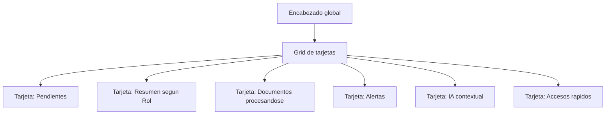
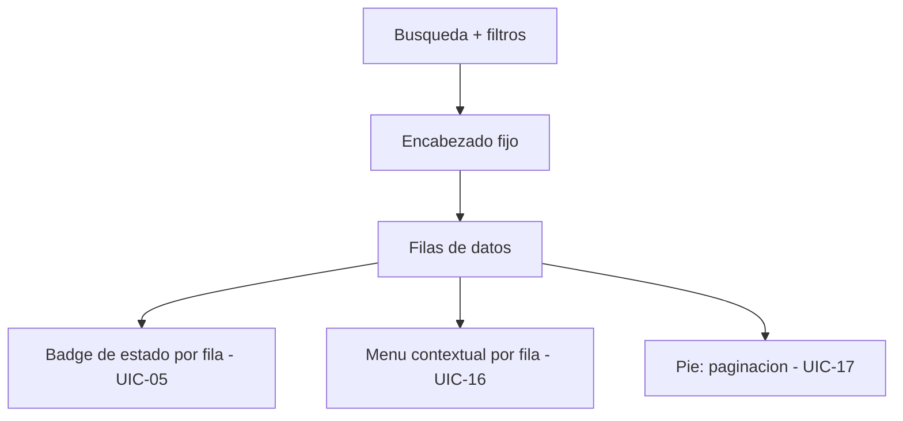
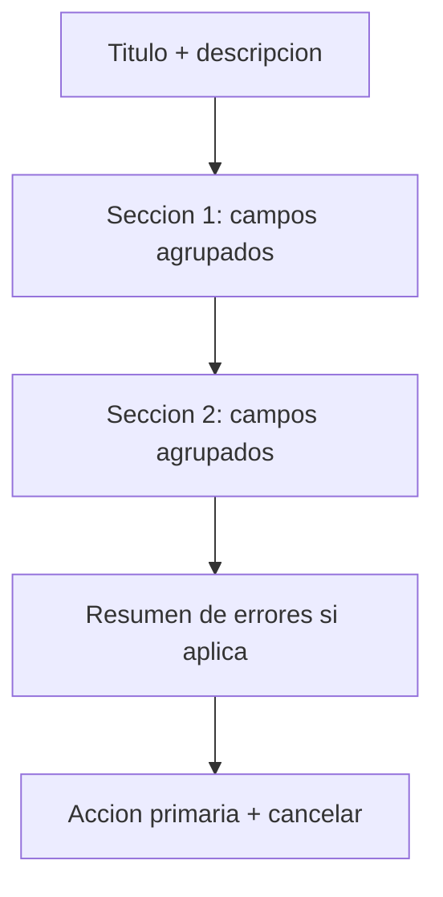
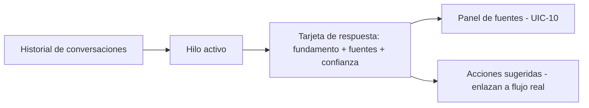
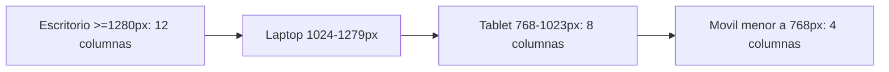

# Especificación de UI — ContaIA

## Control del documento

| Campo                                  | Valor                                                                                                                                                                                                                                                                                                                                                                                                                                                                                                                                                                |
| -------------------------------------- | -------------------------------------------------------------------------------------------------------------------------------------------------------------------------------------------------------------------------------------------------------------------------------------------------------------------------------------------------------------------------------------------------------------------------------------------------------------------------------------------------------------------------------------------------------------------- |
| Documento                              | 18_UI_SPECIFICATION.md                                                                                                                                                                                                                                                                                                                                                                                                                                                                                                                                               |
| Orden de trabajo                       | AWO-014                                                                                                                                                                                                                                                                                                                                                                                                                                                                                                                                                              |
| Versión                                | 1.0                                                                                                                                                                                                                                                                                                                                                                                                                                                                                                                                                                  |
| **Estado**                             | **Draft v1.0**                                                                                                                                                                                                                                                                                                                                                                                                                                                                                                                                                       |
| Fecha de creación                      | 2026-07-18                                                                                                                                                                                                                                                                                                                                                                                                                                                                                                                                                           |
| Última actualización                   | 2026-07-18                                                                                                                                                                                                                                                                                                                                                                                                                                                                                                                                                           |
| Fuentes de verdad                      | `MASTER_CONTEXT.md`, `docs/00_PRODUCT_VISION.md`, `docs/01_PRD.md`, `docs/02_USER_PERSONAS.md`, `docs/04_BUSINESS_RULES.md`, `docs/05_SYSTEM_DOMAIN_MODEL.md`, `docs/06_SYSTEM_WORKFLOWS.md`, `docs/07_SOFTWARE_ARCHITECTURE.md`, `docs/08_API_DESIGN.md`, `docs/09_DATABASE_DESIGN.md`, `docs/10_AI_ARCHITECTURE.md`, `docs/11_SECURITY_ARCHITECTURE.md`, `docs/12_FRONTEND_ARCHITECTURE.md`, `docs/13_DESIGN_SYSTEM.md`, `docs/14_INFORMATION_ARCHITECTURE.md`, `docs/15_UX_FLOWS.md`, `docs/16_WIREFRAMES_SPECIFICATION.md`, `docs/17_PROTOTYPE_SPECIFICATION.md` |
| Documentos que este documento alimenta | `docs/19_FRONTEND_IMPLEMENTATION_PLAN.md` (próximo, ver "Observaciones del Arquitecto")                                                                                                                                                                                                                                                                                                                                                                                                                                                                              |

> Nota sobre numeración: la Work Order referenciaba `docs/03_BUSINESS_RULES.md`, `docs/04_SYSTEM_DOMAIN_MODEL.md` y `docs/05_SYSTEM_WORKFLOWS.md` — nombres desactualizados por renumeraciones ya corregidas; se usan las rutas reales (`docs/04`, `docs/05`, `docs/06`). Además, la Work Order pedía `docs/18_UI_SPECIFICATION.md`, posición ocupada por el marcador vacío `docs/18_TESTING_STRATEGY.md` — colisión anticipada explícitamente en las Observaciones del Arquitecto de AWO-013. Siguiendo la recomendación ya registrada allí, `docs/18_TESTING_STRATEGY.md` se reubicó de forma permanente a `docs/24_TESTING_STRATEGY.md` (posición libre siguiente a `docs/23_RAG_ARCHITECTURE.md`), sin desplazar `docs/19` a `docs/22`. Ver "Observaciones del Arquitecto".

> Este documento es el **contrato entre diseño y desarrollo**: especifica la interfaz visual definitiva del MVP. No es código, no construye la aplicación, y no contradice ninguna decisión ya aprobada en `docs/13_DESIGN_SYSTEM.md` (fundamentos conceptuales) ni en `docs/17_PROTOTYPE_SPECIFICATION.md` (comportamiento ya validado) — los completa con los valores y especificaciones finales que ambos dejaron pendientes o conceptuales.

---

## Principios de la interfaz

La interfaz debe ser profesional, moderna, limpia, consistente, accesible, orientada a productividad, priorizada para escritorio (sin excluir tablet ni móvil), y optimizada para sesiones largas de trabajo contable — instrucción explícita de esta Work Order, coherente con la personalidad visual ya definida en `docs/13_DESIGN_SYSTEM.md` (sección 2) y con el hallazgo de `docs/02_USER_PERSONAS.md` de que Contadores y Auxiliares trabajan en sesiones intensas de captura durante cierres.

## 1. Objetivo de la UI

**Propósito:** convertir los fundamentos conceptuales del Design System (`docs/13_DESIGN_SYSTEM.md`) y el comportamiento ya validado del Prototype Specification (`docs/17_PROTOTYPE_SPECIFICATION.md`) en una especificación de interfaz completa, precisa y suficiente para que un equipo de desarrollo la implemente sin tomar decisiones visuales adicionales por su cuenta.

**Alcance:** los 39 pantallas/prototipos de prioridad Alta y Media del catálogo `PROTO-0001` a `PROTO-0039` (`docs/17_PROTOTYPE_SPECIFICATION.md`, sección 18), los 18 componentes de interfaz solicitados por esta Work Order (sección 4), y los 6 Roles oficiales del MVP.

**Responsabilidades de este documento:** fijar valores definitivos de color, tipografía, espaciado, elevación e iconografía; especificar completamente cada componente (anatomía, variantes, estados, comportamiento, responsive, accesibilidad); definir los layouts oficiales y los seis dashboards por Rol.

**Límites:** este documento no escribe código ni componentes de ningún framework; no decide arquitectura de frontend (ya fijada en `docs/12_FRONTEND_ARCHITECTURE.md`); no cambia el alcance del MVP (`docs/01_PRD.md`); no introduce pantallas, componentes ni funcionalidad no derivados de los documentos anteriores.

**Relación con Design System:** `docs/13_DESIGN_SYSTEM.md` propuso el sistema visual con valores marcados explícitamente como `Estado: Propuesta pendiente de validación mediante pruebas de contraste reales`. Este documento **realiza esa validación por cálculo** (sección 3) y fija los valores definitivos de implementación — no sustituye el Design System, lo completa donde quedó abierto.

**Relación con Prototype Specification:** `docs/17_PROTOTYPE_SPECIFICATION.md` validó _comportamiento_ (navegación, estados interactivos, casos de prueba) con datos simulados y apariencia genérica. Este documento aplica la _apariencia final_ sobre exactamente ese mismo comportamiento ya probado — ningún flujo, transición ni estado interactivo cambia aquí.

## 2. Filosofía visual

| Atributo            | Cómo se manifiesta en la UI final                                                                                                          |
| ------------------- | ------------------------------------------------------------------------------------------------------------------------------------------ |
| **Profesionalismo** | Composición ordenada, superficies neutras, sin elementos decorativos sin función (`docs/13_DESIGN_SYSTEM.md` sección 4)                    |
| **Precisión**       | Cifras con tipografía tabular obligatoria, alineación consistente, jerarquía numérica clara (sección 9)                                    |
| **Confianza**       | Todo estado es visible y explicado; ninguna acción sensible ocurre sin retroalimentación clara (sección 10)                                |
| **Simplicidad**     | Cada pantalla resuelve una tarea concreta (`docs/17_PROTOTYPE_SPECIFICATION.md`, principios); densidad controlada en Dashboard (sección 5) |
| **Velocidad**       | Microinteracciones breves (sección 13), carga progresiva, ninguna animación que retrase una operación frecuente                            |
| **Claridad**        | Un solo lenguaje visual por estado (borrador/pendiente/aprobado/rechazado) reutilizado en toda la aplicación, nunca reinventado por módulo |

**Cómo debe sentirse:** como trabajar con un colega meticuloso que muestra su trabajo, admite cuando no sabe algo, y nunca actúa sin avisar (heredado literalmente de `docs/13_DESIGN_SYSTEM.md`, sección 2) — esta UI Specification no cambia esa dirección, la ejecuta con valores finales.

## 3. Sistema visual definitivo

### 3.1 Colores finales

`docs/13_DESIGN_SYSTEM.md` (sección 5) propuso una paleta con contraste "objetivo AA" sin validarla. Se calculó aquí el contraste real de cada color semántico contra su superficie de uso más común (texto/icono sobre fondo blanco `#FFFFFF`), usando la fórmula de luminancia relativa de WCAG 2.1/2.2. Esto **no sustituye una validación con la herramienta final de diseño**, pero es una primera verificación real, no una suposición.

| Categoría            | HEX (heredado de `docs/13_DESIGN_SYSTEM.md`) | Contraste calculado sobre blanco | Cumple AA texto normal (≥4.5:1) | Estado definitivo                                                                                                                                                                                                                                                                        |
| -------------------- | -------------------------------------------- | -------------------------------- | ------------------------------- | ---------------------------------------------------------------------------------------------------------------------------------------------------------------------------------------------------------------------------------------------------------------------------------------- |
| Marca primaria       | `#1B3A6B`                                    | 11.3:1                           | Sí                              | **Confirmado**                                                                                                                                                                                                                                                                           |
| Acción / interactivo | `#2F6FED`                                    | 4.5:1                            | Sí (en el límite)               | **Confirmado, sin margen** — no oscurecer más el tono en ajustes futuros de marca                                                                                                                                                                                                        |
| Texto primario       | `#101828`                                    | 17.7:1                           | Sí                              | **Confirmado**                                                                                                                                                                                                                                                                           |
| Texto secundario     | `#5B6472`                                    | 6.0:1                            | Sí                              | **Confirmado**                                                                                                                                                                                                                                                                           |
| Éxito                | `#1E8E5A`                                    | 4.1:1                            | **No**                          | **Requiere ajuste** — oscurecer ~10-15% antes de implementación (candidato de referencia: tono en torno a `#187A4C`, a validar con herramienta de contraste real); válido para iconos y badges de alto contraste (superan el umbral de 3:1 de UI/texto grande), no para texto de párrafo |
| Advertencia          | `#B7791F`                                    | 3.6:1                            | **No**                          | **Requiere ajuste** — oscurecer ~15-20% antes de implementación (candidato de referencia: tono en torno a `#8F5D18`, a validar); válido para iconos/badges, no para texto de párrafo                                                                                                     |
| Error                | `#C0392B`                                    | 5.4:1                            | Sí                              | **Confirmado**                                                                                                                                                                                                                                                                           |
| Riesgo               | `#C2540C`                                    | 4.6:1                            | Sí (en el límite)               | **Confirmado, sin margen**                                                                                                                                                                                                                                                               |
| IA                   | `#6D5BD0`                                    | 5.2:1                            | Sí                              | **Confirmado**                                                                                                                                                                                                                                                                           |

**Regla de implementación derivada:** Éxito y Advertencia, en su HEX actual, **solo pueden usarse como texto de párrafo si se oscurecen**; como color de icono/badge con texto de apoyo en negro/gris (`docs/13_DESIGN_SYSTEM.md` sección 5, principio 9 — nunca solo color) siguen siendo aceptables porque el texto que los acompaña ya cumple contraste por sí mismo. Modo oscuro (`docs/13_DESIGN_SYSTEM.md` sección 6) hereda esta misma tabla, ajustada en luminosidad — su validación de contraste queda pendiente de la misma revisión final, ya que las fórmulas de ajuste "aclarado ligero" descritas allí son cualitativas, no cuantificadas.

### 3.2 Tipografía

**Familia definitiva:** **Inter** como familia principal — decisión tomada en este documento entre las tres candidatas ya propuestas en `docs/13_DESIGN_SYSTEM.md` (sección 7: Inter, IBM Plex Sans, Public Sans), por su soporte completo de español, cifras tabulares nativas (`tnum`), amplia adopción en interfaces de datos profesionales, y licencia abierta sin costo (SIL Open Font License) — coherente con la instrucción de no depender de una fuente de pago. **Familia alterna:** IBM Plex Sans, para el caso de que una decisión de marca futura requiera una alternativa. **Respaldo de sistema:** pila de fuentes del sistema operativo, para rendimiento en la primera carga.

**Pesos:** regular (400), medium (500), semibold (600) — sin variar de los tres ya definidos en `docs/13_DESIGN_SYSTEM.md` sección 7.

**Cifras tabulares:** obligatorias (`font-feature-settings: "tnum"`) en toda cifra contable, sin excepción — confirma `docs/13_DESIGN_SYSTEM.md` sección 7 y sección 38 (token `font-feature-tabular-numbers`).

### 3.3 Espaciados, elevaciones y bordes

Se confirman sin cambios los valores ya propuestos en `docs/13_DESIGN_SYSTEM.md`: escala de espaciado de base 4px (sección 8: `xs=4, sm=8, md=16, lg=24, xl=32, 2xl=48, 3xl=64`); escala de elevación de 4 niveles (sección 11: `0` plano, `1` tarjeta, `2` menú flotante, `3` modal); radios pequeños y consistentes por tipo de componente (`sm` controles, `md` tarjetas, `lg` modales).

### 3.4 Iconografía

**Estilo:** lineal, trazo uniforme (`docs/13_DESIGN_SYSTEM.md` sección 12). **Set recomendado:** una librería de iconos lineal de código abierto con cobertura amplia y trazo consistente (por ejemplo, Phosphor Icons o Lucide) — decisión de referencia, no vinculante a una implementación específica, sujeta a confirmación en `docs/19_FRONTEND_IMPLEMENTATION_PLAN.md`. **Tamaños:** 16/20/24px (sección 9 de `docs/13_DESIGN_SYSTEM.md`). **Regla no negociable:** ningún icono de acción crítica (aprobar, rechazar, eliminar, cerrar Ejercicio) se usa sin texto (sección 12 de ese documento, reiterada aquí como regla de UI final).

### 3.5 Ilustraciones

Uso mínimo, estilo lineal simple, reservado exclusivamente a estados vacíos (sección 10) — nunca fotografía de stock ni ilustración 3D (`docs/13_DESIGN_SYSTEM.md` sección 4, tendencias evitadas explícitamente).

### 3.6 Uso del espacio

Se confirma el modelo de densidad dual: **cómoda** por defecto (Dashboard, formularios, flujos de aprobación) y **compacta** como preferencia del Usuario en tablas de alto volumen (`docs/13_DESIGN_SYSTEM.md` sección 36) — sin cambios respecto al Design System.

## 4. Especificación de componentes

Dieciocho componentes (`UIC-01` a `UIC-18`), cada uno con propósito, anatomía, variantes, estados, comportamiento, responsive y accesibilidad.

**UIC-01 — Botones**

- Propósito: disparar una acción explícita.
- Anatomía: contenedor → icono opcional → texto (verbo + objeto, nunca solo icono en acciones críticas) → indicador de carga opcional.
- Variantes: primaria, secundaria, terciaria, silenciosa, destructiva, aprobación, rechazo, enlace (`docs/13_DESIGN_SYSTEM.md` sección 17).
- Estados: default, hover, focus, active, loading (deshabilita el botón, spinner interno), disabled, success (confirmación breve).
- Comportamiento: una sola acción primaria por zona visible.
- Responsive: tamaño táctil mínimo 44px en móvil, sin excepción.
- Accesibilidad: rol de botón nativo, `aria-busy` durante `loading`, `aria-label` obligatorio si el contenido es solo icono.

**UIC-02 — Inputs**

- Propósito: capturar texto, número, moneda o fecha.
- Anatomía: etiqueta visible → campo → ayuda opcional → mensaje de error.
- Variantes: texto, numérico/moneda (`docs/13_DESIGN_SYSTEM.md` sección 20), fecha/periodo (sección 21), área de texto.
- Estados: default, hover, focus, filled, error, disabled, read-only, success.
- Comportamiento: validación al perder el foco, nunca solo al enviar el formulario completo.
- Responsive: ancho completo en móvil, 1-2 columnas en escritorio.
- Accesibilidad: `<label>` asociada explícitamente; error anunciado al aparecer.

**UIC-03 — Selects / Comboboxes**

- Propósito: elegir entre opciones predefinidas (por ejemplo, Cuenta contable, Rol).
- Anatomía: etiqueta → control colapsado → lista desplegable.
- Variantes: simple, con búsqueda (catálogos extensos), múltiple.
- Estados: default, hover, focus, open, error, disabled, sin opciones.
- Comportamiento: operable completamente por teclado (flechas, `Enter`, `Escape`).
- Responsive: en móvil se expande a hoja de pantalla completa.
- Accesibilidad: patrón ARIA `combobox`/`listbox`.

**UIC-04 — Tablas**

- Propósito: explorar y comparar colecciones (CFDI, Pólizas, Cuentas, Trazabilidad).
- Anatomía: encabezado fijo al hacer scroll → filas → pie con paginación.
- Variantes: densidad cómoda/compacta, con selección múltiple, con acciones por fila (`docs/13_DESIGN_SYSTEM.md` sección 19).
- Estados: default, loading (skeleton de filas), vacío, error (con reintento, sin perder filtros).
- Comportamiento: ninguna información crítica exclusivamente en tooltip.
- Responsive: se transforma en tarjetas apiladas en móvil.
- Accesibilidad: encabezados asociados semánticamente a las celdas.

**UIC-05 — Badges**

- Propósito: comunicar un estado corto (borrador, pendiente, definitiva, aprobado, rechazado, `REQUIRES_REVIEW`, etc.).
- Anatomía: color semántico + texto explícito + icono opcional.
- Variantes: informativo, éxito, advertencia, error, riesgo, IA (sección 3.1).
- Estados: estático.
- Comportamiento: mismo lenguaje visual reutilizado en Pólizas, Documentos, CFDI y Casos de Revisión.
- Responsive: legible también en la variante de tarjeta móvil.
- Accesibilidad: el texto es siempre parte del contenido accesible, nunca solo el color de fondo.

**UIC-06 — Alertas / mensajes**

- Propósito: comunicar el estado de una página o sección completa.
- Anatomía: icono → texto (qué ocurrió + siguiente paso) → acción opcional → cierre opcional.
- Variantes: informativo, éxito, advertencia, error, riesgo.
- Estados: entrante, persistente, saliente.
- Comportamiento: nunca es la única superficie con información crítica (`docs/13_DESIGN_SYSTEM.md` sección 33).
- Responsive: ancho completo del contenedor.
- Accesibilidad: región `aria-live` al aparecer.

**UIC-07 — Tarjetas**

- Propósito: agrupar contenido relacionado, especialmente en Dashboard (sección 5).
- Anatomía: encabezado → contenido → acción opcional.
- Variantes: indicador, resumen, acción, alerta, tendencia, tarea, estado, IA (`docs/13_DESIGN_SYSTEM.md` sección 22).
- Estados: default, loading (independiente entre tarjetas), vacío, error (no bloquea las demás).
- Comportamiento: la tarjeta de IA siempre lleva el acento visual distintivo, nunca se confunde con dato confirmado.
- Responsive: grid de 1 a 4 columnas según punto de quiebre.
- Accesibilidad: encabezado como landmark navegable.

**UIC-08 — Paneles**

- Propósito: contener una sección dentro de una página (por ejemplo, panel de validaciones de un CFDI).
- Anatomía: título de sección → contenido → borde/superficie distintiva.
- Variantes: informativo, de evidencia, contextual (IA).
- Estados: default, colapsado/expandido cuando aplica.
- Comportamiento: agrupación visual distintiva para evidencia (`docs/16_WIREFRAMES_SPECIFICATION.md` sección 6).
- Responsive: se apila verticalmente en móvil.
- Accesibilidad: landmark de región con etiqueta descriptiva.

**UIC-09 — Modales**

- Propósito: confirmación o captura breve que interrumpe deliberadamente el flujo.
- Anatomía: título → contenido → acciones (primaria + cancelar).
- Variantes: confirmación, formulario, informativo.
- Estados: abriéndose, abierto, cerrándose.
- Comportamiento: foco atrapado, velo de fondo que no oculta por completo el contexto; nunca más de un modal encadenado sobre el mismo flujo.
- Responsive: pantalla completa en móvil.
- Accesibilidad: `role="dialog"`, foco inicial en el primer control, retorno de foco al cerrar.

**UIC-10 — Drawers**

- Propósito: detalle o formulario rápido sin abandonar el contexto (por ejemplo, Panel IA contextual).
- Anatomía: encabezado con cierre → contenido → acciones si aplica.
- Variantes: vista, edición, contextual (IA/evidencia).
- Estados: abriéndose, abierto, cerrándose.
- Comportamiento: cerrar regresa exactamente al punto de origen, nunca pierde el contexto de conversación o revisión.
- Responsive: vista de pantalla completa en móvil.
- Accesibilidad: mismo estándar de foco atrapado que los modales.

**UIC-11 — Tooltips**

- Propósito: ayuda contextual breve.
- Anatomía: disparador (hover/focus) → burbuja de texto corto.
- Variantes: informativo, de ayuda de campo.
- Estados: oculto, visible (demora breve).
- Comportamiento: nunca porta información crítica en solitario.
- Responsive: en móvil, toque prolongado o texto de ayuda siempre visible.
- Accesibilidad: accesible por foco de teclado, no solo por hover.

**UIC-12 — Breadcrumbs**

- Propósito: orientación jerárquica (Módulo / Sub-sección / Recurso).
- Anatomía: nivel 1 → nivel 2 → nivel 3 (máximo 3-4 niveles).
- Variantes: con truncamiento en móvil.
- Estados: nivel actual (no clicable) vs. niveles anteriores (enlaces).
- Comportamiento: solo en detalle/edición/creación.
- Responsive: se trunca al nivel inmediato anterior en móvil.
- Accesibilidad: estructura semántica de navegación.

**UIC-13 — Navegación (sidebar + topbar)**

- Propósito: acceso constante a Empresa activa, módulos, búsqueda, tareas, notificaciones, IA y perfil.
- Anatomía: ver plantilla estructural de `docs/16_WIREFRAMES_SPECIFICATION.md` (secciones 4 y 7).
- Variantes: expandida, colapsada, móvil (drawer).
- Estados: default, sin Empresa activa, permisos limitados (ítems ausentes, no atenuados).
- Comportamiento: el selector de Empresa nunca se oculta en un submenú.
- Responsive: colapsa a drawer en móvil, conserva selector de Empresa y accesos de IA/notificaciones.
- Accesibilidad: landmarks de navegación, salto directo al contenido principal.

**UIC-14 — Tabs**

- Propósito: navegación secundaria dentro de una misma vista.
- Anatomía: lista horizontal → indicador de pestaña activa → panel de contenido.
- Variantes: horizontal, con contador.
- Estados: default, activa, hover, focus, disabled (si no aplica al Rol).
- Comportamiento: cambiar de pestaña no navega a una nueva URL de nivel superior.
- Responsive: selector desplegable si no caben todas en móvil.
- Accesibilidad: patrón ARIA `tablist`/`tab`/`tabpanel`.

**UIC-15 — Acordeones**

- Propósito: contenido colapsable para reducir densidad visual.
- Anatomía: encabezado clicable con indicador → contenido.
- Variantes: simple, múltiple.
- Estados: colapsado, expandido, hover, focus.
- Comportamiento: nunca oculta información crítica por defecto.
- Responsive: mayor relevancia en móvil por espacio limitado.
- Accesibilidad: `aria-expanded`, contenido asociado con `aria-controls`.

**UIC-16 — Menús / dropdowns**

- Propósito: selección de una acción o valor desde una lista contextual.
- Anatomía: disparador → lista de opciones.
- Variantes: simple, con íconos, con submenú (menú contextual por fila).
- Estados: cerrado, abierto, opción resaltada, disabled por opción.
- Comportamiento: las acciones más frecuentes también son accesibles directamente, no solo dentro del menú.
- Responsive: hoja inferior en móvil.
- Accesibilidad: patrón ARIA de menú, cierre con `Escape`.

**UIC-17 — Paginación**

- Propósito: navegar colecciones grandes.
- Anatomía: indicador de página actual → controles anterior/siguiente → salto directo si aplica.
- Variantes: numérica, simple anterior/siguiente.
- Estados: default, página actual (no interactiva), disabled en extremos.
- Comportamiento: conserva filtros y búsqueda activos al cambiar de página.
- Responsive: simplificada a anterior/siguiente en móvil.
- Accesibilidad: etiqueta accesible clara por control ("Página 2 de 5").

**UIC-18 — Carga de archivos**

- Propósito: incorporar Documentos/CFDI al repositorio.
- Anatomía: zona de arrastrar y soltar → selector estándar → lista de archivos → progreso por archivo.
- Variantes: individual, múltiple.
- Estados: default, arrastrando, subiendo, procesado/observado/rechazado, error por archivo (sin bloquear el resto).
- Comportamiento: formatos y límite de tamaño indicados explícitamente antes de la carga.
- Responsive: incluye cámara del dispositivo como fuente en móvil.
- Accesibilidad: alternativa de selector estándar totalmente operable por teclado.

## 5. Especificación de dashboards

**Aclaración de modelo de roles:** "propietario" no es un Rol distinto (BR-PERM-003) — es un atributo del Rol Administrador. El "dashboard propietario" solicitado por esta Work Order se especifica aquí como una **variante del dashboard de Administrador**, no como un sexto dashboard adicional a los seis Roles ya oficiales.

| Dashboard (Rol)                                    | Widgets prioritarios                                                                                                              | Orden                                           | Personalización                                                                                                                                                                           |
| -------------------------------------------------- | --------------------------------------------------------------------------------------------------------------------------------- | ----------------------------------------------- | ----------------------------------------------------------------------------------------------------------------------------------------------------------------------------------------- |
| **Administrador** (variante propietario resaltada) | Resumen de Empresa(s), Membresías, Pendientes de configuración, Actividad reciente, Alertas administrativas                       | Configuración/estado primero, operación después | Orden de tarjetas dentro de las categorías fijas (`docs/14_INFORMATION_ARCHITECTURE.md` sección 35); el propietario ve además un resumen de "empresas que administra" si tiene más de una |
| **Contador**                                       | Pólizas pendientes de aprobación, Balanza reciente, Alertas de descuadre, Asistente IA (acceso rápido), Documentos por clasificar | Pendientes primero, indicadores después         | Densidad de tarjetas (cómoda/compacta), accesos rápidos personalizables                                                                                                                   |
| **Auxiliar**                                       | Documentos en proceso, sus propias capturas en borrador, Alertas de campos ambiguos                                               | Tareas operativas del día primero               | Accesos rápidos a carga de documentos y captura de Pólizas                                                                                                                                |
| **Supervisor**                                     | Cola de Casos de Revisión de alto riesgo, Pólizas pendientes de decisión, resumen de aprobaciones recientes                       | Pendientes de revisión siempre primero          | Filtro por Empresa si administra varias en revisión                                                                                                                                       |
| **Auditor**                                        | Accesos directos a Auditoría/Trazabilidad, Estados Financieros (solo lectura), sin tarjetas de captura                            | Evidencia y consulta primero                    | Ninguna personalización de escritura (Rol de solo lectura, BR-ROL-003)                                                                                                                    |
| **Estudiante**                                     | Accesos al Asistente IA en modo educativo únicamente, ejemplos sugeridos                                                          | Único bloque, sin resto de módulos              | Ninguna — alcance de MVP pendiente de decisión (`docs/01_PRD.md` sección 21)                                                                                                              |

**Regla transversal:** ningún dashboard satura más tarjetas de las que un Usuario puede escanear en pocos segundos (`docs/13_DESIGN_SYSTEM.md` sección 22) — se prioriza claridad sobre volumen de información visible.

## 6. Tablas empresariales

Confirmación definitiva de `docs/13_DESIGN_SYSTEM.md` (sección 19), aplicada a CFDI, Pólizas, Cuentas, Usuarios, Documentos, Sugerencias de IA, Auditoría y Reportes:

| Aspecto      | Especificación final                                                                                    |
| ------------ | ------------------------------------------------------------------------------------------------------- |
| Columnas     | Configurables donde el volumen de campos lo justifique (CFDI); conjunto por defecto sensato en el resto |
| Ordenamiento | Indicador visual de columna y dirección activa, siempre disponible en encabezados ordenables            |
| Filtros      | Específicos por tipo de dato (fecha, estado, monto) — nunca un cuadro de texto genérico único           |
| Búsqueda     | Acotada a la Empresa activa (BR-GLB-001)                                                                |
| Selección    | Casillas múltiples cuando existan acciones por lote (exportación)                                       |
| Acciones     | Menú contextual por fila + acciones frecuentes accesibles directamente                                  |
| Exportación  | Confirmación explícita del alcance exacto antes de generar el archivo                                   |
| Scroll       | Encabezado fijo en scroll vertical; scroll horizontal controlado en tablas con muchas columnas          |
| Responsive   | Tarjetas apiladas en móvil, con las columnas más relevantes priorizadas                                 |

## 7. Formularios

Confirmación definitiva de `docs/13_DESIGN_SYSTEM.md` (sección 18):

| Aspecto        | Especificación final                                                                                                  |
| -------------- | --------------------------------------------------------------------------------------------------------------------- |
| Estructura     | Agrupación lógica por sección; títulos de sección en formularios extensos                                             |
| Navegación     | Orden de tabulación lógico, pasos con progreso visible en formularios largos (`WF-0006`)                              |
| Ayuda          | Texto breve bajo el campo cuando el formato no es obvio (por ejemplo, RFC)                                            |
| Errores        | Inline junto al campo + resumen al inicio del formulario si hay varios                                                |
| Confirmaciones | Obligatorias para envíos con efecto sensible (sección 10 de este documento)                                           |
| Borradores     | Indicador explícito "Guardado" / "Cambios sin guardar", coherente con `docs/17_PROTOTYPE_SPECIFICATION.md` sección 13 |
| Autoguardado   | Periódico y silencioso para recursos en estado `DRAFT`, nunca sustituye el guardado explícito como opción disponible  |

## 8. IA

Especificación visual definitiva, sin variar el comportamiento ya validado en `docs/17_PROTOTYPE_SPECIFICATION.md` (sección 8):

- **Conversación:** burbuja del Usuario visualmente distinta de la respuesta del Agente; tipografía de cuerpo regular, sin el acento visual de IA en el mensaje del Usuario.
- **Evidencia y fuentes:** panel separado (`UIC-10` Drawer), con título, tipo, artículo/apartado, vigencia y fragmento citado — nunca integrado como texto corrido dentro de la respuesta.
- **Confianza:** badge categórico con los tres colores ya reconciliados (Éxito=`Aprobado`, Riesgo=`Requiere revisión`, Advertencia=`Fundamento insuficiente`) — **nunca un porcentaje**.
- **Sugerencias:** tarjeta con borde y encabezado del acento IA (`#6D5BD0`, sección 3.1), separando visualmente respuesta / fundamento / fuentes / supuestos / advertencias / acción sugerida.
- **Aprobación / rechazo:** siempre botones explícitos fuera de la tarjeta de IA, con la misma semántica de color que cualquier otra aprobación del sistema (Éxito/Error) — **nunca el color de IA en un botón de acción crítica** (regla ya fijada en `docs/13_DESIGN_SYSTEM.md` sección 5).
- **Historial:** hilo cronológico con la misma separación visual repetida por respuesta.

**Regla no negociable, reiterada una última vez en esta capa visual:** ninguna respuesta de IA se representa como una decisión ya tomada — el badge de confianza y la etiqueta de "sugerencia" acompañan siempre al contenido generado, sin excepción.

## 9. Visualización financiera

Confirmación definitiva de `docs/13_DESIGN_SYSTEM.md` (secciones 20 y 23):

- **Tablas financieras:** cifras alineadas a la derecha, tipografía tabular obligatoria, decimales consistentes por columna, totales en semibold con separador visual.
- **Estados financieros:** encabezado con periodo, fecha de generación y advertencia (BR-EF-003) siempre visible antes del cuerpo de datos.
- **Gráficos:** barras para comparación entre categorías, líneas para tendencia temporal, barras apiladas preferidas sobre pastel (más de 3-4 categorías); nunca efectos tridimensionales.
- **Comparativas:** periodo actual junto a periodo anterior cuando el reporte lo permita, con indicador de dirección no dependiente solo del color.
- **Cifras:** negativos con signo o paréntesis contable, nunca solo color rojo.
- **Tendencias:** líneas con marcadores en puntos relevantes; anomalías resaltadas con explicación textual asociada, nunca solo un punto de color distinto.

## 10. Estados universales

Esta Work Order pide siete estados (`loading`, `success`, `warning`, `error`, `empty`, `processing`, `offline`). Se reconcilian con el conjunto ya aprobado en `docs/13_DESIGN_SYSTEM.md` (sección 16) y ya extendido en `docs/17_PROTOTYPE_SPECIFICATION.md` (sección 5), dando el catálogo definitivo de 14 estados universales de componente:

| Estado                | Origen                           | Tratamiento visual definitivo                                                                                                               |
| --------------------- | -------------------------------- | ------------------------------------------------------------------------------------------------------------------------------------------- |
| `default`             | Design System                    | Apariencia base                                                                                                                             |
| `hover`               | Design System                    | Solo en interacción de mouse (escritorio)                                                                                                   |
| `focus`               | Design System                    | Contorno de alto contraste, nunca eliminado                                                                                                 |
| `active` / `selected` | Design System                    | Fondo de selección (`#E4EDFF` en modo claro, sección 6 de `docs/13_DESIGN_SYSTEM.md`)                                                       |
| `loading`             | Ambos                            | Skeleton estructural o spinner, nunca bloquea toda la pantalla                                                                              |
| `processing`          | Prototype Spec / esta Work Order | Variante de `loading` con etiqueta explícita ("Procesando")                                                                                 |
| `success`             | Ambos                            | Badge/icono de éxito + confirmación breve                                                                                                   |
| `warning`             | Prototype Spec / esta Work Order | Badge/icono de advertencia (ver ajuste de contraste, sección 3.1)                                                                           |
| `error`               | Ambos                            | Icono + texto + acción de recuperación                                                                                                      |
| `disabled`            | Ambos                            | Indicador no cromático adicional (cursor, `aria-disabled`)                                                                                  |
| `read-only`           | Ambos                            | Candado o texto "solo lectura"                                                                                                              |
| `empty`               | Esta Work Order                  | Ilustración lineal mínima + texto + acción (sección 3.5, `docs/13_DESIGN_SYSTEM.md` sección 29)                                             |
| `offline`             | Esta Work Order                  | Banner de conectividad, estado "no confirmado" explícito en cualquier escritura pendiente (`docs/17_PROTOTYPE_SPECIFICATION.md` sección 14) |

## 11. Responsive

Confirmación de puntos de quiebre de referencia (valores concretos, sujetos a validación técnica final en `docs/19_FRONTEND_IMPLEMENTATION_PLAN.md`):

| Tamaño                     | Rango de referencia | Prioridad                                           | Diferencias clave                                                                                                           |
| -------------------------- | ------------------- | --------------------------------------------------- | --------------------------------------------------------------------------------------------------------------------------- |
| **Escritorio** (principal) | ≥1280px             | Máxima — optimizado para sesiones largas de captura | Grid de 12 columnas, navegación lateral fija, tablas completas, paneles divididos                                           |
| Laptop                     | 1024-1279px         | Alta                                                | Igual que escritorio con ligero ajuste de densidad si el ancho es limitado                                                  |
| Tablet                     | 768-1023px          | Media                                               | Grid de 8 columnas, navegación colapsable, columnas de tabla priorizadas, formularios de 1 columna                          |
| Móvil                      | <768px              | Media — consulta y decisiones simples               | Grid de 4 columnas, navegación por drawer, tablas como tarjetas, formularios de 1 campo por fila, confirmaciones reforzadas |

**Prioridad de contenido en móvil:** heredada sin cambios de `docs/15_UX_FLOWS.md` (UXF-0041) — captura extensa de Pólizas y configuración inicial de Catálogo se optimizan para escritorio; consulta de Reportes, revisión/aprobación de Tareas simples y uso del Asistente IA son completos en móvil.

## 12. Accesibilidad

Objetivo **WCAG 2.2 AA**, consolidando lo ya definido en `docs/13_DESIGN_SYSTEM.md` (sección 34), `docs/14_INFORMATION_ARCHITECTURE.md` (sección 32) y `docs/17_PROTOTYPE_SPECIFICATION.md` (sección 11):

- **Contraste:** validado por cálculo en sección 3.1 de este documento; dos colores requieren ajuste antes de la implementación final.
- **Teclado:** navegación completa sin trampas de foco, orden lógico en todo componente de la sección 4.
- **Lectores de pantalla:** semántica correcta en tablas, formularios y componentes de estado; toda etiqueta accesible especificada por componente (sección 4).
- **ARIA:** patrones estándar por tipo de componente (diálogo, combobox, tabs, menú, acordeón — ya anotados en sus fichas respectivas).
- **Foco:** gestionado explícitamente al abrir/cerrar modales y drawers (`UIC-09`, `UIC-10`), con retorno al punto de origen.
- **Mensajes:** errores y confirmaciones anunciados por tecnología asistiva al aparecer (`aria-live`, `UIC-06`).

## 13. Microinteracciones

Valores de referencia conceptual (sin implementación concreta, coherente con `docs/13_DESIGN_SYSTEM.md` sección 13 y `docs/17_PROTOTYPE_SPECIFICATION.md` sección 12):

| Interacción                | Duración de referencia         | Comportamiento                                               |
| -------------------------- | ------------------------------ | ------------------------------------------------------------ |
| Hover                      | ~100-150ms                     | Cambio sutil de tono/sombra, sin desplazamiento              |
| Focus                      | Instantáneo                    | Contorno visible, sin animación de entrada                   |
| Transición entre pantallas | ~150-200ms                     | Breve y funcional, sin efectos de entrada/salida llamativos  |
| Carga                      | Continua hasta completar       | Animación de skeleton/spinner sin apariencia "congelada"     |
| Aprobación / éxito         | ~200-300ms                     | Micro-confirmación breve, no bloqueante                      |
| IA generando               | Continua, indicador distintivo | Diferenciado del spinner genérico de carga de datos          |
| Cambio de Empresa          | ~250-350ms                     | Transición que refuerza que el contexto cambió por completo  |
| Errores                    | ~150ms                         | Resalte breve del campo/elemento afectado, sin ser intrusivo |

**Regla explícita:** toda animación respeta la preferencia de reducción de movimiento del sistema del Usuario; ninguna es puramente decorativa.

## 14. Estados IA

Seis estados solicitados, mapeados al pipeline ya aprobado en `docs/10_AI_ARCHITECTURE.md` (sección 9) y al `confidenceLevel` de `docs/08_API_DESIGN.md` (sección 16):

| Estado visual        | Corresponde a (pipeline técnico)                                               | Representación                                                                |
| -------------------- | ------------------------------------------------------------------------------ | ----------------------------------------------------------------------------- |
| Pensando             | Clasificación de intención + recuperación de contexto (pasos 2-6 del pipeline) | Indicador distintivo de IA, sin contenido aún                                 |
| Recuperando fuentes  | Recuperación RAG (paso 7)                                                      | Mismo indicador, sin exponer el proceso interno de búsqueda                   |
| Generando            | Generación de respuesta por el Agente (paso 10)                                | Indicador distintivo continuo, coherente con sección 13                       |
| Esperando aprobación | `confidenceLevel = REQUIRES_REVIEW` o `INSUFFICIENT` (BR-IA-005)               | Badge de riesgo/advertencia + bloqueo explícito hasta revisión humana         |
| Aprobado             | Caso de Revisión resuelto como `APPROVED`                                      | Badge de éxito, acción ejecutada vía Servicio de Aprobación (nunca por la IA) |
| Rechazado            | Caso de Revisión resuelto como `REJECTED`                                      | Badge de error + motivo visible (BR-TRZ-003)                                  |

**Ninguno de estos seis estados omite el paso del Agente supervisor de calidad** (BR-IA-008) — "Pensando", "Recuperando fuentes" y "Generando" son sub-estados de un mismo proceso que siempre termina evaluado antes de mostrarse.

## 15. Sistema de iconografía

Clasificación por categoría (conceptos, no nombres de icono específicos — la librería final se confirma en `docs/19_FRONTEND_IMPLEMENTATION_PLAN.md`, sección 3.4):

| Categoría      | Conceptos representados                                                   |
| -------------- | ------------------------------------------------------------------------- |
| Navegación     | Inicio, módulo, búsqueda, notificación, perfil, menú, flecha de expansión |
| Fiscal         | Comprobante/factura, folio, RFC, impuesto                                 |
| Contabilidad   | Cuenta, póliza, balanza, libro/catálogo                                   |
| IA             | Asistente, fuente/cita, confianza, sugerencia                             |
| Administración | Usuario, rol, organización, configuración                                 |
| Seguridad      | Candado, escudo, sesión, auditoría                                        |
| Documentos     | Archivo, carga, descarga, adjunto, estado de procesamiento                |

**Regla transversal:** un icono de estado (borrador, pendiente, aprobado, rechazado, error) es único y consistente en toda la aplicación, nunca reinventado por módulo (`docs/13_DESIGN_SYSTEM.md` sección 12).

## 16. Layouts oficiales

`docs/16_WIREFRAMES_SPECIFICATION.md` (sección 5) definió 13 patrones de layout. Se consolidan aquí en **ocho layouts oficiales** de UI final, reconociendo que varios patrones de wireframe son variantes de un mismo layout visual, no layouts distintos:

| Layout oficial     | Patrones de `docs/16` que consolida                                    | Estructura                                                                                                                                                                                                                    |
| ------------------ | ---------------------------------------------------------------------- | ----------------------------------------------------------------------------------------------------------------------------------------------------------------------------------------------------------------------------- |
| **Dashboard**      | Dashboard                                                              | Grid de tarjetas priorizadas (sección 5 de este documento)                                                                                                                                                                    |
| **Listado**        | Listado                                                                | Búsqueda + filtros + tabla (`UIC-04`) + paginación (`UIC-17`)                                                                                                                                                                 |
| **Detalle**        | Detalle, Pantalla dividida                                             | Identidad + estado + resumen + pestañas (`UIC-14`) + panel lateral opcional (`UIC-10`)                                                                                                                                        |
| **Formulario**     | Formulario                                                             | Ancho de lectura cómodo, 1-2 columnas, agrupación por sección (sección 7)                                                                                                                                                     |
| **Reporte**        | Reporte                                                                | Encabezado de contexto + cuerpo de datos + visualización (sección 9) + exportar                                                                                                                                               |
| **Configuración**  | Configuración                                                          | Ancho de lectura cómodo, secciones agrupadas                                                                                                                                                                                  |
| **IA**             | Asistente                                                              | Columna de hilo + panel de fuentes (sección 8)                                                                                                                                                                                |
| **Administración** | Revisión, Aprobación, Proceso asíncrono, Estado vacío, Acceso denegado | Layout compacto/centrado reutilizado según el caso — revisión y aprobación comparten estructura con Detalle más acciones de decisión; proceso asíncrono, vacío y acceso denegado son estados (sección 10), no layouts propios |

## 17. Diagramas Mermaid

### 17.1 Anatomía de Dashboard

### 17.2 Anatomía de Tabla

### 17.3 Anatomía de Formulario

### 17.4 Layout IA

### 17.5 Responsive

## 18. Catálogo UI

`UI-0001` a `UI-0039`, en correspondencia directa con `PROTO-0001`–`PROTO-0039` (`docs/17_PROTOTYPE_SPECIFICATION.md`, sección 18) y, por extensión, con `WF-0001`–`WF-0039` (`docs/16_WIREFRAMES_SPECIFICATION.md`, sección 54) — misma cadena de trazabilidad ya establecida (WF → PROTO → UI).

| ID      | Pantalla                        | Layout oficial | Componentes principales                   | Prioridad  |
| ------- | ------------------------------- | -------------- | ----------------------------------------- | ---------- |
| UI-0001 | Navegación global               | —              | UIC-13                                    | Crítica    |
| UI-0002 | Inicio de sesión                | Formulario     | UIC-01, UIC-02, UIC-06                    | Crítica    |
| UI-0003 | Recuperación                    | Formulario     | UIC-01, UIC-02, UIC-06                    | Importante |
| UI-0004 | Invitación                      | Formulario     | UIC-01, UIC-06                            | Importante |
| UI-0005 | Selección de Empresa            | Listado        | UIC-01, UIC-07                            | Crítica    |
| UI-0006 | Creación de Empresa             | Formulario     | UIC-01, UIC-02, UIC-17(progreso)          | Importante |
| UI-0007 | Onboarding                      | Dashboard      | UIC-07, UIC-01                            | Opcional   |
| UI-0008 | Dashboard                       | Dashboard      | UIC-07 (todas variantes)                  | Crítica    |
| UI-0009 | Centro de trabajo               | Listado        | UIC-04, UIC-05, UIC-16                    | Crítica    |
| UI-0010 | Listado de Empresas             | Listado        | UIC-04, UIC-01                            | Opcional   |
| UI-0011 | Detalle de Empresa              | Detalle        | UIC-14, UIC-08                            | Importante |
| UI-0012 | Biblioteca de Documentos        | Listado        | UIC-04, UIC-05, UIC-18                    | Crítica    |
| UI-0013 | Carga de Documentos             | Formulario     | UIC-18, UIC-06                            | Crítica    |
| UI-0014 | Monitor de procesamiento        | Administración | UIC-06, UIC-05                            | Importante |
| UI-0015 | Listado de CFDI                 | Listado        | UIC-04, UIC-05                            | Crítica    |
| UI-0016 | Detalle de CFDI                 | Detalle        | UIC-08, UIC-05, UIC-10                    | Crítica    |
| UI-0017 | Comparación de duplicados       | Administración | UIC-09, UIC-01                            | Opcional   |
| UI-0018 | Clasificación documental        | Administración | UIC-05, UIC-01                            | Opcional   |
| UI-0019 | Catálogo de Cuentas             | Listado        | UIC-04, UIC-15                            | Importante |
| UI-0020 | Formulario de Cuenta            | Formulario     | UIC-02, UIC-03                            | Importante |
| UI-0021 | Listado de Pólizas              | Listado        | UIC-04, UIC-05, UIC-17                    | Crítica    |
| UI-0022 | Captura de Póliza               | Formulario     | UIC-02, UIC-03, UIC-04                    | Crítica    |
| UI-0023 | Sugerencia de Póliza (IA)       | IA             | UIC-07(IA), UIC-05                        | Crítica    |
| UI-0024 | Revisión y aprobación de Póliza | Administración | UIC-09, UIC-01, UIC-06                    | Crítica    |
| UI-0025 | Bandeja de aprobaciones         | Listado        | UIC-04, UIC-05                            | Importante |
| UI-0026 | Asistente IA                    | IA             | UIC-10, UIC-01                            | Crítica    |
| UI-0027 | Panel IA contextual             | IA             | UIC-10                                    | Importante |
| UI-0028 | Fuentes y fundamentos           | IA             | UIC-10, UIC-12                            | Importante |
| UI-0029 | Tareas                          | Listado        | UIC-04, UIC-14                            | Importante |
| UI-0030 | Detalle de Tarea                | Detalle        | UIC-08, UIC-01                            | Importante |
| UI-0031 | Centro de notificaciones        | Listado        | UIC-04, UIC-06                            | Importante |
| UI-0032 | Catálogo de Reportes            | Reporte        | UIC-07, UIC-01                            | Opcional   |
| UI-0033 | Generar Reporte                 | Formulario     | UIC-03, UIC-01                            | Opcional   |
| UI-0034 | Visor de Reporte                | Reporte        | UIC-04 (financiera), gráficos (sección 9) | Opcional   |
| UI-0035 | Membresías de la Empresa        | Listado        | UIC-04, UIC-01                            | Importante |
| UI-0036 | Cambiar Rol                     | Administración | UIC-09, UIC-03                            | Importante |
| UI-0037 | Auditoría de la Empresa         | Reporte        | UIC-04, UIC-12                            | Opcional   |
| UI-0038 | Configuración personal          | Configuración  | UIC-02, UIC-14                            | Opcional   |
| UI-0039 | Configuración de Empresa        | Configuración  | UIC-02, UIC-14                            | Opcional   |

## 19. MVP

Clasificación de los 18 componentes (sección 4) por prioridad de construcción, coherente con los `PROTO-*` de prioridad Alta ya fijados en `docs/17_PROTOTYPE_SPECIFICATION.md` (sección 19):

| Prioridad                                                          | Componentes                                                                                                                              |
| ------------------------------------------------------------------ | ---------------------------------------------------------------------------------------------------------------------------------------- |
| **Críticos** — sin ellos no existe el ciclo de valor central       | UIC-01 Botones, UIC-02 Inputs, UIC-04 Tablas, UIC-05 Badges, UIC-06 Alertas, UIC-09 Modales, UIC-13 Navegación, UIC-18 Carga de archivos |
| **Importantes** — necesarios para una experiencia completa del MVP | UIC-03 Selects, UIC-07 Tarjetas, UIC-08 Paneles, UIC-10 Drawers, UIC-14 Tabs, UIC-16 Menús, UIC-17 Paginación                            |
| **Opcionales** — mejoran la experiencia, no bloquean el MVP        | UIC-11 Tooltips, UIC-12 Breadcrumbs, UIC-15 Acordeones                                                                                   |

## 20. Riesgos

- **Complejidad:** 18 componentes con hasta 8-10 estados cada uno multiplican la superficie de prueba visual; sin una librería base sólida (`docs/19_FRONTEND_IMPLEMENTATION_PLAN.md`), el riesgo de inconsistencia entre implementaciones es alto.
- **Accesibilidad:** dos colores semánticos (Éxito, Advertencia) requieren ajuste de contraste (sección 3.1) antes de implementar — si se omite, el sistema nace sin cumplir su propio objetivo AA.
- **Consistencia:** el mayor riesgo es que un componente se reimplemente ligeramente distinto por módulo bajo presión de tiempo (mismo riesgo ya señalado en `docs/07_SOFTWARE_ARCHITECTURE.md` sección 18 para el backend, aquí trasladado al frontend).
- **Deuda visual:** los valores de espaciado/tipografía/color de este documento son definitivos para el MVP, pero una decisión de marca futura (logotipo, identidad comercial completa) podría requerir revisar la paleta — el uso de nomenclatura semántica de tokens (`docs/13_DESIGN_SYSTEM.md` sección 38) ya mitiga el costo de ese cambio.
- **Escalabilidad:** el catálogo de 39 pantallas UI crecerá con las fases posteriores del roadmap (`docs/01_PRD.md`); sin disciplina de reutilización de los 18 componentes ya definidos, cada nueva pantalla podría inventar variantes no catalogadas.

## 21. Recomendaciones para Frontend Implementation Plan

- **Punto de partida:** los ocho layouts oficiales (sección 16) y los 18 componentes (sección 4) son el inventario completo a implementar como librería base, antes de construir pantallas individuales.
- **Contraste:** resolver los dos ajustes de color pendientes (sección 3.1) con una herramienta de contraste real antes de fijar los tokens finales en código.
- **Tipografía e iconografía:** confirmar la licencia y disponibilidad técnica de Inter y de la librería de iconos recomendada (sección 3.2, 3.4) en el stack real del proyecto.
- **Orden de construcción:** seguir la clasificación de la sección 19 (Críticos → Importantes → Opcionales), coherente con la priorización ya usada en `docs/16_WIREFRAMES_SPECIFICATION.md` y `docs/17_PROTOTYPE_SPECIFICATION.md`.
- **Pruebas visuales:** cada componente crítico debe tener una prueba de regresión visual antes de integrarse a una pantalla real, dado el riesgo de inconsistencia señalado en la sección 20.

Este documento no implementa código ni selecciona un framework — entrega la especificación visual completa para que `docs/19_FRONTEND_IMPLEMENTATION_PLAN.md` decida cómo construirla técnicamente.

---

## Historial de cambios

| Fecha      | Cambio                                                                                                                                                                                                                                                                                                                                                                                                                                                                                                                                                                                                                                                                                                                                                                                                                                                                                                                                                                                                                                                                             | Responsable                        |
| ---------- | ---------------------------------------------------------------------------------------------------------------------------------------------------------------------------------------------------------------------------------------------------------------------------------------------------------------------------------------------------------------------------------------------------------------------------------------------------------------------------------------------------------------------------------------------------------------------------------------------------------------------------------------------------------------------------------------------------------------------------------------------------------------------------------------------------------------------------------------------------------------------------------------------------------------------------------------------------------------------------------------------------------------------------------------------------------------------------------- | ---------------------------------- |
| 2026-07-18 | Creación de la primera versión completa de `docs/18_UI_SPECIFICATION.md` bajo AWO-014: objetivo y límites de la UI final, filosofía visual, sistema visual definitivo (colores con validación de contraste calculada, tipografía definitiva Inter, espaciados/elevaciones/bordes/iconografía confirmados), especificación completa de 18 componentes (`UIC-01` a `UIC-18`), 6 dashboards por Rol (con reconciliación del atributo propietario), tablas empresariales y formularios confirmados, especificación visual de IA y de visualización financiera, 14 estados universales reconciliados, responsive con puntos de quiebre de referencia, accesibilidad consolidada, microinteracciones con duraciones de referencia, 6 estados de IA mapeados al pipeline técnico, sistema de iconografía por categoría, 8 layouts oficiales consolidados desde los 13 patrones de wireframe, 5 diagramas Mermaid, catálogo de 39 pantallas UI (`UI-0001` a `UI-0039`), clasificación MVP de componentes, riesgos y recomendaciones para Frontend Implementation Plan. Estado: Draft v1.0. | Responsable de producto de ContaIA |

---

## Observaciones del Arquitecto

**Decisiones tomadas:**

- Se resolvió la colisión de `docs/18`, anticipada explícitamente en las Observaciones de AWO-013, reubicando de forma permanente `docs/18_TESTING_STRATEGY.md` a `docs/24_TESTING_STRATEGY.md` (siguiente posición libre tras `docs/23_RAG_ARCHITECTURE.md`), sin desplazar `docs/19` a `docs/22`.
- Se realizó una **validación de contraste por cálculo real** (fórmula de luminancia relativa WCAG) sobre los nueve colores semánticos ya propuestos en `docs/13_DESIGN_SYSTEM.md`, en vez de repetir indefinidamente su estado "pendiente de validación". Esto detectó que dos colores (Éxito, Advertencia) no cumplen AA como texto de párrafo en su tono actual — hallazgo real, no una suposición, documentado con la recomendación de ajuste correspondiente (sección 3.1). Se aclara explícitamente que este cálculo no sustituye una validación con herramienta de diseño final, para no sobre-afirmar certeza.
- Se tomó una decisión definitiva de tipografía (Inter) entre las tres candidatas ya propuestas por el Design System, necesaria porque una "especificación de UI" no puede quedar con una familia tipográfica sin decidir — se documentó el criterio de la decisión (soporte de español, cifras tabulares, licencia abierta, adopción en interfaces de datos) para que sea auditable y reversible si el equipo de implementación encuentra una razón de peso para cambiarla.
- Se reconcilió "dashboard propietario" (pedido por esta Work Order) con el modelo de Roles ya aprobado (BR-PERM-003: propietario es atributo, no Rol) — se especificó como variante del dashboard de Administrador, no como un séptimo dashboard.
- Se consolidaron los 13 patrones de layout de `docs/16_WIREFRAMES_SPECIFICATION.md` en 8 layouts oficiales (sección 16), reconociendo explícitamente cuáles eran variantes de un mismo layout y cuáles eran, en realidad, estados (proceso asíncrono, vacío, acceso denegado) — evita duplicar layouts sin justificación (principio 18 heredado de AWO-012/013).
- El catálogo `UI-0001` a `UI-0039` se numeró en correspondencia directa con `PROTO-0001`–`PROTO-0039` y `WF-0001`–`WF-0039`, extendiendo la cadena de trazabilidad WF → PROTO → UI ya establecida, en vez de introducir una cuarta numeración desconectada.

**Riesgos:** ver sección 20 completa; el de mayor atención inmediata es el ajuste de contraste pendiente de Éxito y Advertencia (sección 3.1) — si no se resuelve antes de fijar los tokens de color en código, el sistema no cumplirá su propio objetivo de accesibilidad desde el lanzamiento.

**Pendientes:**

- Validación de contraste con herramienta real (no solo cálculo) antes de la implementación final.
- Confirmación técnica de la familia tipográfica y la librería de iconos recomendadas (sección 3.2, 3.4) contra el stack real del proyecto.
- Validación de contraste del modo oscuro (`docs/13_DESIGN_SYSTEM.md` sección 6), que este documento no calculó por depender de ajustes cualitativos ("aclarado ligero") aún no cuantificados.
- Decisión pendiente heredada de `docs/01_PRD.md` (sección 21) sobre el alcance del Rol Estudiante, que sigue limitando cuánto se puede especificar de su dashboard (sección 5).

**Inconsistencias encontradas:** ninguna contradicción con las fuentes de verdad aprobadas, salvo la colisión de numeración ya resuelta y las referencias desactualizadas de nombres de archivo en la Work Order (`docs/03`, `docs/04`, `docs/05`).

**Dependencias para AWO-015 (`docs/19_FRONTEND_IMPLEMENTATION_PLAN.md`):**

- Ver sección 21 completa.
- Es previsible, siguiendo el patrón observado en AWO-001 a AWO-014, que la próxima Work Order solicite `docs/19_FRONTEND_IMPLEMENTATION_PLAN.md`, posición hoy ocupada por el marcador vacío `docs/19_DEVOPS.md`. Se recomienda resolver esa colisión con el mismo criterio ya aplicado dos veces (reubicar el marcador vacío a la siguiente posición libre, hoy `docs/25`) en el momento en que esa Work Order llegue.
- `docs/00_DOCUMENTATION_INDEX.md` y `docs/00_DOCUMENTATION_GUIDE.md` siguen sin existir (hallazgo original en `docs/02_USER_PERSONAS.md`); con dieciocho documentos técnicos ya interconectados y tres reubicaciones permanentes de marcadores vacíos acumuladas (`docs/23`, `docs/24`, y la de este turno), la ausencia de un índice mantenido activamente sigue siendo el riesgo documental más alto del proyecto — se reitera esta recomendación por novena vez consecutiva.
