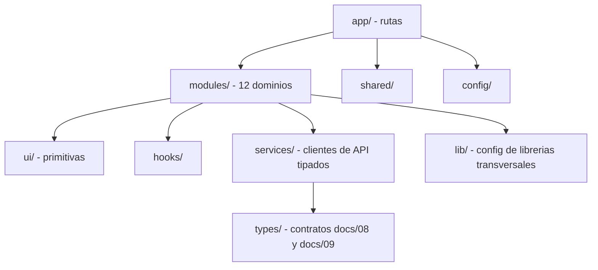
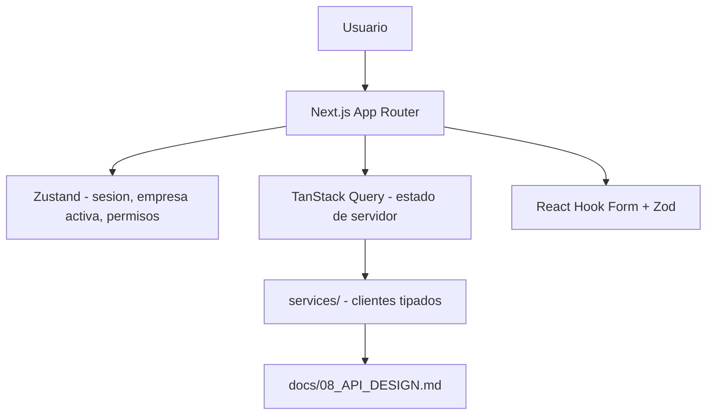
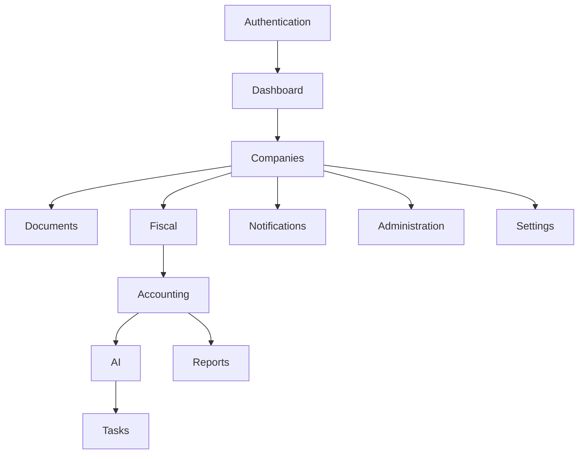
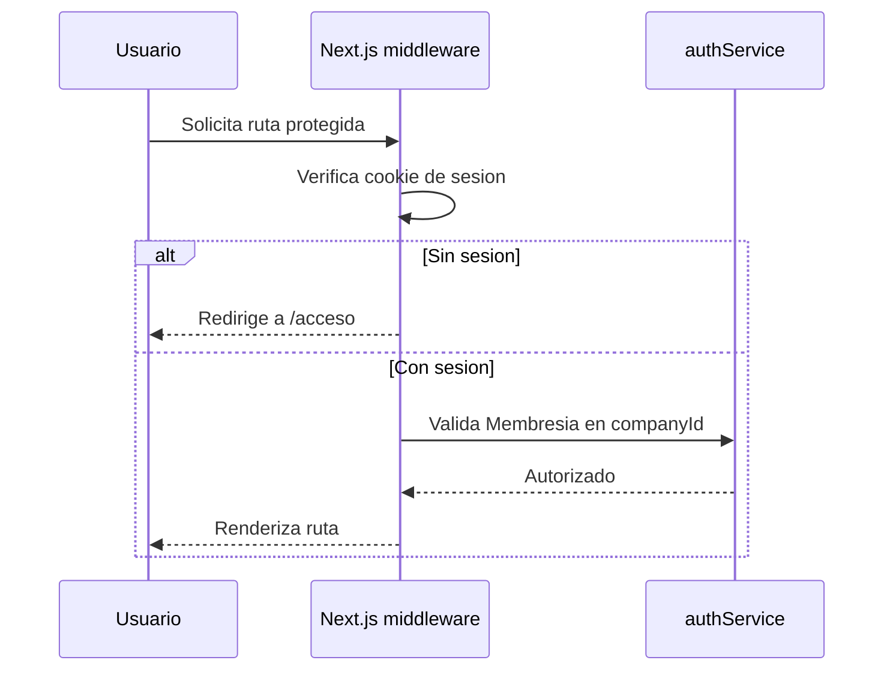
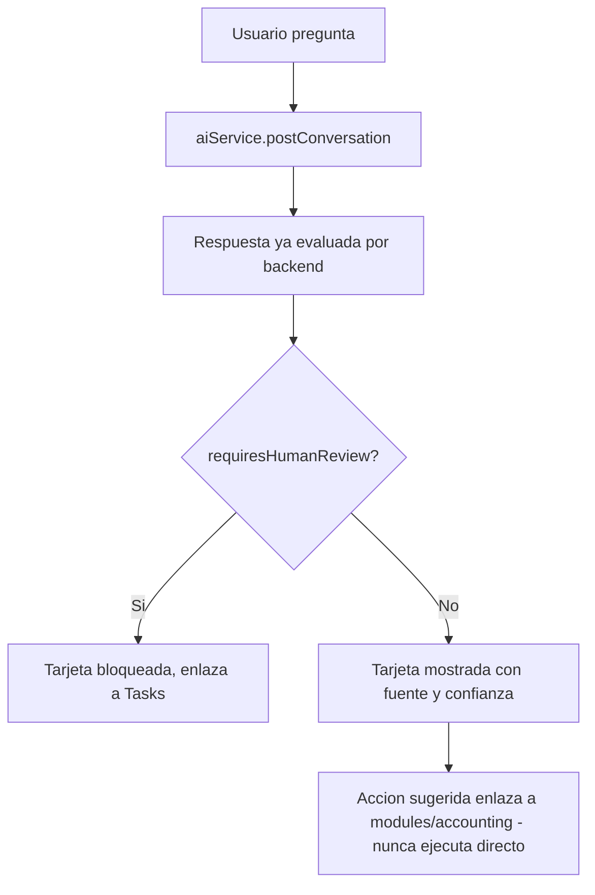

# Plan de Implementación de Frontend — ContaIA

## Control del documento

| Campo                             | Valor                                                                                                                                                                                                                                                                                                                                                                                                                                                                                                                                                                                               |
| --------------------------------- | --------------------------------------------------------------------------------------------------------------------------------------------------------------------------------------------------------------------------------------------------------------------------------------------------------------------------------------------------------------------------------------------------------------------------------------------------------------------------------------------------------------------------------------------------------------------------------------------------- |
| Documento                         | 19_FRONTEND_IMPLEMENTATION_PLAN.md                                                                                                                                                                                                                                                                                                                                                                                                                                                                                                                                                                  |
| Orden de trabajo                  | AWO-015                                                                                                                                                                                                                                                                                                                                                                                                                                                                                                                                                                                             |
| Versión                           | 1.0                                                                                                                                                                                                                                                                                                                                                                                                                                                                                                                                                                                                 |
| **Estado**                        | **Draft v1.0**                                                                                                                                                                                                                                                                                                                                                                                                                                                                                                                                                                                      |
| Fecha de creación                 | 2026-07-18                                                                                                                                                                                                                                                                                                                                                                                                                                                                                                                                                                                          |
| Última actualización              | 2026-07-18                                                                                                                                                                                                                                                                                                                                                                                                                                                                                                                                                                                          |
| Fuentes de verdad                 | `MASTER_CONTEXT.md`, `docs/00_PRODUCT_VISION.md`, `docs/01_PRD.md`, `docs/02_USER_PERSONAS.md`, `docs/04_BUSINESS_RULES.md`, `docs/05_SYSTEM_DOMAIN_MODEL.md`, `docs/06_SYSTEM_WORKFLOWS.md`, `docs/07_SOFTWARE_ARCHITECTURE.md`, `docs/08_API_DESIGN.md`, `docs/09_DATABASE_DESIGN.md`, `docs/10_AI_ARCHITECTURE.md`, `docs/11_SECURITY_ARCHITECTURE.md`, `docs/12_FRONTEND_ARCHITECTURE.md`, `docs/13_DESIGN_SYSTEM.md`, `docs/14_INFORMATION_ARCHITECTURE.md`, `docs/15_UX_FLOWS.md`, `docs/16_WIREFRAMES_SPECIFICATION.md`, `docs/17_PROTOTYPE_SPECIFICATION.md`, `docs/18_UI_SPECIFICATION.md` |
| Documentos que este plan alimenta | `docs/20_BACKEND_IMPLEMENTATION_PLAN.md` (próximo, ver "Observaciones del Arquitecto")                                                                                                                                                                                                                                                                                                                                                                                                                                                                                                              |

> Nota sobre numeración: la Work Order referenciaba `docs/03_BUSINESS_RULES.md`, `docs/04_SYSTEM_DOMAIN_MODEL.md` y `docs/05_SYSTEM_WORKFLOWS.md` — nombres desactualizados por renumeraciones ya corregidas; se usan las rutas reales (`docs/04`, `docs/05`, `docs/06`). A diferencia de los últimos catorce documentos técnicos, `docs/19` **no presentó colisión de numeración** — la posición quedó liberada por el Maintenance Work Order de reorganización ejecutado inmediatamente antes de esta Work Order (`docs/19_DEVOPS.md` → `docs/25_DEVOPS.md`, registrado en `MASTER_CONTEXT.md`, sección 27). Ver "Observaciones del Arquitecto" sobre la siguiente colisión ya anticipable.

> Este documento es un **plan de implementación técnica**, la primera capa de esta serie que selecciona tecnologías concretas. No es código, no genera componentes completos, y no contradice ninguna decisión conceptual ya aprobada — las traduce a un stack real y a una secuencia de trabajo ejecutable.

---

## Principios de la implementación

La implementación del frontend debe ser modular, escalable, mantenible, tipada, desacoplada, accesible, preparada para pruebas, preparada para IA y preparada para múltiples empresas — instrucción explícita de esta Work Order, y consistente con los principios ya aprobados de modularidad (`MASTER_CONTEXT.md` 10.9), aislamiento multiempresa (BR-GLB-001) y el principio fundamental de que la IA nunca decide (`docs/04_BUSINESS_RULES.md`, sección 2).

## 1. Objetivo del plan

**Propósito:** dar a cualquier desarrollador o agente de implementación (incluido Claude Code) una guía suficiente para construir el frontend de ContaIA desde cero hasta una versión empresarial, sin tomar decisiones de arquitectura, tecnología o alcance por su cuenta.

**Alcance:** los doce módulos frontend (sección 4), los 39 pantallas del catálogo `UI-0001`–`UI-0039` (`docs/18_UI_SPECIFICATION.md`), y las siete fases de implementación (sección 17), desde el MVP (`docs/01_PRD.md`) hasta el roadmap de fases posteriores (`docs/01_PRD.md`, sección 17: Beta → V1 → V2 → Enterprise).

**Exclusiones:** código de producción; selección de proveedor cloud o de hosting; configuración de CI/CD (`docs/22_INFRASTRUCTURE_IMPLEMENTATION_PLAN.md`, reservado); implementación del backend (`docs/20_BACKEND_IMPLEMENTATION_PLAN.md`, próximo); decisiones de base de datos (ya fijadas en `docs/09_DATABASE_DESIGN.md`, sin repetirlas aquí).

**Dependencias:** este plan depende íntegramente de los contratos ya fijados en `docs/08_API_DESIGN.md` (el frontend nunca los rediseña), del comportamiento validado en `docs/17_PROTOTYPE_SPECIFICATION.md`, y de la especificación visual definitiva de `docs/18_UI_SPECIFICATION.md`.

## 2. Tecnologías recomendadas

`MASTER_CONTEXT.md` (sección 17) ya propuso "aplicación web con Next.js, React y TypeScript" como parte del stack técnico preliminar, marcado `Estado: Propuesta pendiente de validación`. Este documento **confirma esa propuesta para la capa de frontend** y selecciona las librerías complementarias que `docs/12_FRONTEND_ARCHITECTURE.md` dejó deliberadamente abiertas ("sin seleccionar ninguna librería de gestión de estado ni framework de SPA concreto, conforme a la instrucción explícita" — sección 21 de ese documento).

| Tecnología                         | Propósito                                         | Justificación                                                                                                                                                                                                                                                                                                                                                                        | Alternativa descartada                                                                                                                                                                                                                                                                                                           |
| ---------------------------------- | ------------------------------------------------- | ------------------------------------------------------------------------------------------------------------------------------------------------------------------------------------------------------------------------------------------------------------------------------------------------------------------------------------------------------------------------------------ | -------------------------------------------------------------------------------------------------------------------------------------------------------------------------------------------------------------------------------------------------------------------------------------------------------------------------------- |
| **Next.js** (App Router)           | Framework de aplicación                           | Enrutamiento basado en archivos que mapea de forma natural el sitemap ya aprobado (`docs/14_INFORMATION_ARCHITECTURE.md`, sección 8); code splitting y lazy loading nativos por ruta, requisito ya fijado en `docs/12_FRONTEND_ARCHITECTURE.md` sección 2; renderizado híbrido (server/cliente) útil para el shell ligero de autenticación/navegación exigido en ese mismo documento | Una SPA pura (Vite + React Router) — descartada porque exige construir manualmente el code splitting por módulo que Next.js ya resuelve, sin beneficio claro dado que ContaIA no necesita SEO público (es una aplicación autenticada) pero sí se beneficia del enrutamiento basado en archivos para sus 39 pantallas catalogadas |
| **React**                          | Librería de UI                                    | Ya propuesto en `MASTER_CONTEXT.md` sección 17; modelo de componentes coherente con la arquitectura de capas de `docs/13_DESIGN_SYSTEM.md` (sección 39: fundamentos → primitivas → componentes)                                                                                                                                                                                      | — (ya era la decisión base)                                                                                                                                                                                                                                                                                                      |
| **TypeScript**                     | Tipado estático                                   | Principio obligatorio "tipada" de esta Work Order; detecta en tiempo de compilación cualquier desalineación con los contratos de `docs/08_API_DESIGN.md` (tipos generados o espejados de sus esquemas de respuesta/error)                                                                                                                                                            | JavaScript sin tipos — incompatible con el principio explícito de esta Work Order                                                                                                                                                                                                                                                |
| **Tailwind CSS**                   | Estilos utilitarios                               | Mapea directamente sobre los tokens semánticos ya nombrados en `docs/13_DESIGN_SYSTEM.md` (sección 38: `color-*`, `spacing-*`, `radius-*`) mediante configuración de tema, sin inventar una arquitectura CSS paralela; acelera la implementación de la escala de densidad cómoda/compacta (sección 36 de ese documento)                                                              | CSS-in-JS (styled-components) — descartado por mayor costo en tiempo de ejecución y menor alineación directa con un sistema de tokens ya definido como valores estáticos                                                                                                                                                         |
| **React Hook Form**                | Gestión de formularios                            | Validación en tiempo real sin re-renderizados excesivos, requisito de rendimiento coherente con formularios extensos como `WF-0022` (Captura de Póliza); integración nativa con resolvers de esquema (Zod)                                                                                                                                                                           | Formik — descartado por menor rendimiento en formularios con muchas filas dinámicas (movimientos de Póliza)                                                                                                                                                                                                                      |
| **TanStack Query**                 | Estado de servidor y caché                        | Implementa directamente el modelo de caché ya exigido en `docs/12_FRONTEND_ARCHITECTURE.md` (sección 5): invalidación por mutación, clave de caché que incluye la Empresa activa, sondeo de Jobs asíncronos (`docs/08_API_DESIGN.md` sección 15) mediante `refetchInterval`                                                                                                          | SWR — descartado por menor soporte nativo de mutaciones complejas con invalidación en cascada, necesarias para el flujo Aprobación → Balanza (workflow 8 y 10 de `docs/06_SYSTEM_WORKFLOWS.md`)                                                                                                                                  |
| **Zod**                            | Validación de esquemas en tiempo de ejecución     | Complementa TypeScript (que solo valida en compilación) con validación real de las respuestas de `docs/08_API_DESIGN.md`; se integra con React Hook Form como resolver único                                                                                                                                                                                                         | Yup — descartado por menor integración con inferencia de tipos TypeScript                                                                                                                                                                                                                                                        |
| **Zustand**                        | Estado global de cliente                          | Resuelve la decisión que `docs/12_FRONTEND_ARCHITECTURE.md` dejó abierta (sección 5: sesión, Empresa activa, permisos); modelo mínimo sin el boilerplate de un store tipo Redux, adecuado al principio de simplicidad (`MASTER_CONTEXT.md` 10.7)                                                                                                                                     | Redux Toolkit — descartado por mayor complejidad estructural innecesaria para el alcance de estado global real del MVP (sesión + Empresa activa + permisos, no un árbol de estado extenso)                                                                                                                                       |
| **shadcn/ui**                      | Primitivas de componente                          | Componentes copiados al repositorio (no una dependencia instalada), construidos sobre Radix UI — accesibilidad ARIA correcta por defecto, coherente con el objetivo WCAG 2.2 AA (`docs/13_DESIGN_SYSTEM.md` sección 34); se personalizan directamente con los tokens de Tailwind sin quedar atados a la identidad visual de un tercero                                               | Una librería de componentes cerrada (por ejemplo, Material UI) — descartada porque impondría su propio lenguaje visual, en tensión con la identidad visual definitiva ya fijada en `docs/18_UI_SPECIFICATION.md`                                                                                                                 |
| **TanStack Table** ("React Table") | Lógica de tablas                                  | Headless (sin UI propia), permite implementar exactamente el estándar de `docs/13_DESIGN_SYSTEM.md` sección 19 (ordenamiento, filtrado, densidad, columnas configurables) sin heredar un diseño ajeno; se combina con virtualización para las tablas de alto volumen ya señaladas como riesgo (`docs/16_WIREFRAMES_SPECIFICATION.md` sección 58)                                     | Una tabla con UI propia (por ejemplo, AG Grid) — descartada por el mismo motivo que shadcn/ui: impondría apariencia no alineada con `docs/18_UI_SPECIFICATION.md`                                                                                                                                                                |
| **React Aria**                     | Patrones de interacción avanzados, cuando aplique | Reservado para componentes cuya complejidad ARIA exceda lo que cubren las primitivas de Radix/shadcn/ui (por ejemplo, un selector de rango de fechas para Ejercicio/periodo, o un combobox de búsqueda extensa de Cuentas) — uso selectivo, no reemplaza shadcn/ui de forma general                                                                                                  | Construir esos patrones desde cero — descartado por el riesgo de accesibilidad incompleta en componentes con lógica de teclado compleja                                                                                                                                                                                          |

**Regla de origen:** ninguna tecnología de esta lista contradice `docs/07_SOFTWARE_ARCHITECTURE.md` (que no fijó librerías, solo capas y módulos) ni `docs/12_FRONTEND_ARCHITECTURE.md` (que dejó la selección de librería de estado y framework SPA abierta explícitamente "para no tomar esa decisión antes de tiempo") — este documento es, precisamente, el lugar donde correspondía tomarla.

## 3. Arquitectura del proyecto

Estructura conceptual de carpetas (sin código, solo responsabilidad de cada una):

```
app/        Rutas de Next.js (App Router) — un archivo de página por cada ruta ya catalogada en docs/14 (sección 8); no contiene lógica de negocio, solo composición de componentes de modules/ y shared/
modules/    Un subdirectorio por cada uno de los 12 módulos de dominio (sección 4); cada módulo es dueño de sus propios componentes, hooks y servicios — ningún módulo importa el interior de otro (docs/12 sección 3)
shared/     Utilidades, componentes y hooks compartidos entre dos o más módulos (por ejemplo, el badge de estado reutilizado en Pólizas, CFDI y Tareas — UIC-05 de docs/18)
ui/         Primitivas de shadcn/ui personalizadas con los tokens de docs/13_DESIGN_SYSTEM.md — la capa "fundamentos + primitivas" de docs/13 sección 39; ningún módulo de negocio vive aquí
hooks/      Hooks genéricos no atados a un dominio (por ejemplo, un hook de detección de conectividad para el estado offline de docs/18 sección 10)
services/   Clientes de API tipados por grupo de recursos de docs/08_API_DESIGN.md (sección 8) — la única capa que conoce las rutas HTTP reales; los módulos nunca llaman a fetch directamente
lib/        Configuración de librerías transversales (cliente de TanStack Query, esquemas base de Zod, utilidades de fecha/moneda coherentes con docs/13 secciones 20-21)
types/      Tipos TypeScript derivados de los contratos de docs/08_API_DESIGN.md y las entidades de docs/09_DATABASE_DESIGN.md — fuente única de verdad de tipos, nunca duplicados por módulo
config/     Configuración de entorno, flags de Agentes de IA activos (coherente con docs/07_SOFTWARE_ARCHITECTURE.md sección 13: activación por configuración, no por código muerto)
assets/     Ilustraciones lineales mínimas (docs/13 sección 3.5) e iconografía (docs/18 sección 3.4) — uso deliberadamente reducido
```



## 4. Organización por dominios

**Reconciliación de módulos:** `docs/12_FRONTEND_ARCHITECTURE.md` (sección 3) definió 11 módulos frontend, con "Tasks" (Tareas y aprobaciones) integrado dentro de "Notifications". `docs/14_INFORMATION_ARCHITECTURE.md` (sección 3), posterior y más específico en su taxonomía de navegación, elevó "Tareas y aprobaciones" a categoría propia — "no plegada dentro de Notificaciones", justificado explícitamente porque sostiene el principio fundamental de revisión humana y porque `docs/08_API_DESIGN.md` ya trata `Approvals` como grupo de recursos independiente de `Notifications` (secciones 9.10 y 9.12 respectivamente). Los doce módulos pedidos por esta Work Order **aplican esa decisión más específica y posterior**, sin contradecir `docs/12_FRONTEND_ARCHITECTURE.md` — lo refinan.

| Módulo             | Alcance                                                                                                           | Componentes principales                                                       | Hooks                                                        | Servicios                                                                   | Estado                                                                               | Rutas                                                     |
| ------------------ | ----------------------------------------------------------------------------------------------------------------- | ----------------------------------------------------------------------------- | ------------------------------------------------------------ | --------------------------------------------------------------------------- | ------------------------------------------------------------------------------------ | --------------------------------------------------------- |
| **Authentication** | Registro, login, MFA, recuperación, verificación, invitación (`ESC-01`, `ESC-02` de `docs/17`)                    | `UI-0002` a `UI-0004`                                                         | `useSession`, `useLogin`, `useMfaChallenge`                  | `authService` (grupo 9.1 de `docs/08`)                                      | Zustand: sesión; ninguno en TanStack Query (no hay datos de negocio)                 | `/acceso/*`                                               |
| **Dashboard**      | Vista de orientación por Rol (`UI-0008`, `ESC-04`)                                                                | Tarjetas de `docs/18` sección 5                                               | `useDashboardSummary`                                        | Agrega lecturas de `accountingService`, `aiService`, `notificationsService` | TanStack Query (lecturas agregadas, corta duración de caché)                         | `/{companyId}/inicio`                                     |
| **Companies**      | Organización, Empresas, Membresías, Ejercicios (`UI-0005`, `UI-0006`, `UI-0010`, `UI-0011`, `UI-0035`, `UI-0036`) | Selector de Empresa (`UIC-13`), formularios de alta/edición                   | `useCompanies`, `useActiveCompany`, `useMemberships`         | `organizationsService` (grupo 9.2-9.4 de `docs/08`)                         | Zustand: Empresa activa (persistente en sesión); TanStack Query: listados/detalle    | `/seleccionar-empresa`, `/{companyId}/empresas/*`         |
| **Accounting**     | Catálogo, Pólizas, Balanza, Estados Financieros, Ejercicios (`UI-0019` a `UI-0024`)                               | Tabla de Cuentas/Pólizas, formulario de captura, panel de aprobación          | `useChartOfAccounts`, `useJournalEntries`, `useApproveEntry` | `accountingService` (grupos 9.6-9.8)                                        | TanStack Query con invalidación en cascada (aprobar Póliza invalida Balanza)         | `/{companyId}/contabilidad/*`                             |
| **Fiscal**         | CFDI/XML, duplicados, clasificación (`UI-0012` a `UI-0018`)                                                       | Zona de carga (`UIC-18`), detalle de CFDI, comparación de duplicados          | `useDocumentUpload`, `useCfdiDetail`, `useJobStatus`         | `documentsService`, `fiscalService` (grupo 9.5)                             | TanStack Query con sondeo (`refetchInterval`) para Jobs                              | `/{companyId}/documentos/*`, `/{companyId}/fiscal/*`      |
| **Documents**      | Reutiliza componentes de Fiscal para el repositorio genérico (mismo módulo backend, `docs/07` sección 6)          | Ver Fiscal                                                                    | Ver Fiscal                                                   | `documentsService`                                                          | Ver Fiscal                                                                           | `/{companyId}/documentos`                                 |
| **Reports**        | Catálogo, generación, visor de Reportes (`UI-0032` a `UI-0034`)                                                   | Formulario de generación, tabla financiera, gráficos (sección 9 de `docs/18`) | `useGenerateReport`, `useReportViewer`                       | `accountingService` (grupo 9.8)                                             | TanStack Query, sin mutación directa (solo lectura)                                  | `/{companyId}/reportes/*`                                 |
| **AI**             | Asistente, panel contextual, fuentes, sugerencias (`UI-0023`, `UI-0026` a `UI-0028`)                              | Hilo de conversación, tarjeta de sugerencia, panel de fuentes (`UIC-10`)      | `useAiConversation`, `useAiSuggestion`, `useSourcesPanel`    | `aiService` (grupo 9.9)                                                     | TanStack Query para historial; estado efímero de "generando" en el propio componente | `/{companyId}/asistente/*`                                |
| **Tasks**          | Centro de trabajo, bandeja de aprobaciones, detalle de tarea (`UI-0009`, `UI-0025`, `UI-0029`, `UI-0030`)         | Listado priorizado, panel de decisión                                         | `useApprovalQueue`, `useResolveApproval`                     | `approvalsService` (grupo 9.10)                                             | TanStack Query con invalidación tras aprobar/rechazar                                | `/{companyId}/tareas/*`                                   |
| **Notifications**  | Alertas deterministas (`UI-0031`)                                                                                 | Centro de notificaciones                                                      | `useAlerts`                                                  | `notificationsService` (grupo 9.12)                                         | TanStack Query con sondeo ligero                                                     | `/{companyId}/notificaciones`                             |
| **Administration** | Panel interno de plataforma (`docs/14` sección 24)                                                                | Fuera del contexto de Empresa cliente                                         | `useSupportAccess`                                           | `administrationService` (grupo 9.13)                                        | TanStack Query, acceso restringido a Rol de plataforma                               | `/admin/*`                                                |
| **Settings**       | Configuración personal y de Empresa (`UI-0038`, `UI-0039`)                                                        | Formularios agrupados por sección                                             | `useUserPreferences`, `useCompanySettings`                   | `organizationsService`, `authService`                                       | TanStack Query + mutación de guardado                                                | `/{companyId}/configuracion/*`, `/configuracion/personal` |

## 5. Estrategia de componentes

| Categoría                     | Definición                                                                | Ejemplos                                           | Regla anti-duplicidad                                                                                                                                 |
| ----------------------------- | ------------------------------------------------------------------------- | -------------------------------------------------- | ----------------------------------------------------------------------------------------------------------------------------------------------------- |
| **Componentes base**          | Primitivas de `ui/`, shadcn/ui personalizado con tokens (sección 3)       | Botón, Input, Diálogo                              | Un solo componente base por elemento de `docs/18_UI_SPECIFICATION.md` sección 4 (`UIC-01` a `UIC-18`); ningún módulo crea su propia variante de botón |
| **Componentes reutilizables** | Composición de primitivas con un patrón de negocio genérico, en `shared/` | Badge de estado, Tarjeta de IA, Panel de evidencia | Antes de crear un componente nuevo, verificar si ya existe una variante en `shared/` que cubra el caso con una prop adicional                         |
| **Componentes de negocio**    | Específicos de un módulo, en `modules/{modulo}/components/`               | `PolizaLineEditor`, `CfdiValidationPanel`          | Nunca importados por otro módulo directamente — si dos módulos necesitan el mismo componente de negocio, se promueve a `shared/`                      |
| **Layouts**                   | Los 8 layouts oficiales de `docs/18_UI_SPECIFICATION.md` sección 16       | `DashboardLayout`, `ListLayout`, `DetailLayout`    | Toda página nueva reutiliza uno de los 8, nunca compone una estructura ad hoc                                                                         |
| **Páginas**                   | Archivos de `app/`, composición final de layout + componentes de módulo   | —                                                  | Una página nunca contiene lógica de negocio propia — solo orquesta componentes ya existentes                                                          |

## 6. Estrategia de estado

| Tipo                       | Herramienta                                 | Duración                                   | Regla                                                                                                                                 |
| -------------------------- | ------------------------------------------- | ------------------------------------------ | ------------------------------------------------------------------------------------------------------------------------------------- |
| Estado global de cliente   | Zustand                                     | Toda la sesión                             | Sesión, Empresa activa, permisos del Rol vigente — nada más (coherente con `docs/12_FRONTEND_ARCHITECTURE.md` sección 5)              |
| Estado de servidor / caché | TanStack Query                              | Corta, invalidada por mutación relacionada | Toda clave de consulta incluye `companyId` cuando el recurso es de negocio — nunca se comparte caché entre Empresas                   |
| Estado local de formulario | React Hook Form                             | Vida del componente                        | Nunca se sincroniza con Zustand ni TanStack Query hasta el envío                                                                      |
| Datos derivados            | Cálculo en memoria del componente           | Recalculado en cada render relevante       | Nunca es la fuente de verdad — la cifra autoritativa siempre viene de la respuesta de la API (BR-GLB-004)                             |
| Persistencia               | Ninguna más allá de la sesión del navegador | —                                          | Ningún dato de negocio se persiste en almacenamiento local del cliente entre sesiones (`docs/11_SECURITY_ARCHITECTURE.md` sección 13) |
| Sincronización             | Invalidación de TanStack Query              | Disparada por mutación exitosa             | Por ejemplo, aprobar una Póliza invalida las consultas de Balanza y Estados Financieros de esa Empresa                                |
| Invalidación               | Cambio de Empresa activa                    | Inmediata                                  | Limpia toda la caché de TanStack Query asociada a la Empresa anterior (`docs/12_FRONTEND_ARCHITECTURE.md` sección 6)                  |

## 7. Formularios

React Hook Form + Zod como resolver único. **Validaciones:** esquema Zod compartido con el tipo esperado por `docs/08_API_DESIGN.md`, evaluado en tiempo real al perder el foco (`docs/13_DESIGN_SYSTEM.md` sección 18). **Errores:** el contrato `VALIDATION_ERROR` de `docs/08_API_DESIGN.md` (sección 11) se mapea directamente a `setError(field, message)` de React Hook Form; errores sin `field` se muestran como resumen general. **Borradores:** recursos con ciclo de vida `DRAFT` (Pólizas) usan una mutación de guardado con `debounce`, mostrando el indicador "Guardado"/"Cambios sin guardar" de `docs/12_FRONTEND_ARCHITECTURE.md` sección 8. **Autoguardado:** periódico (por ejemplo, cada 30 segundos de inactividad) además del guardado manual explícito — nunca sustituye la opción manual. **Accesibilidad:** cada campo generado por React Hook Form se asocia a su `<label>` mediante `ui/` (shadcn/ui ya resuelve esto por defecto vía Radix).

## 8. Gestión documental

Flujo fiel a `docs/08_API_DESIGN.md` (sección 14) y `docs/17_PROTOTYPE_SPECIFICATION.md` (sección 9):

1. `useDocumentUpload` llama a `documentsService.initiateUpload` (mutación de TanStack Query) → recibe `documentId` + URL prefirmada.
2. El archivo se sube **directamente** al almacenamiento de objetos con `fetch`/`XMLHttpRequest` nativo (progreso real vía evento de progreso), **nunca a través de una ruta de Next.js** — coherente con "el frontend nunca transfiere el archivo binario a través de su propio backend" (`docs/12_FRONTEND_ARCHITECTURE.md` sección 9).
3. `useJobStatus` sondea el estado del Documento/Job con `refetchInterval` hasta un estado terminal.
4. **Reintentos:** por archivo individual, sin reintentar automáticamente una escritura sin su `Idempotency-Key` original (`docs/08_API_DESIGN.md` sección 13).
5. **Carga múltiple:** cada archivo es una mutación independiente — un archivo fallido nunca bloquea el resto del lote (`UXF-0009`).
6. **Estados:** los mismos ocho estados de `docs/17_PROTOTYPE_SPECIFICATION.md` sección 5, representados por el componente `UIC-18`.

## 9. Integración con IA

| Aspecto           | Implementación                                                                                                                                                                                                                                                                                                                                                                |
| ----------------- | ----------------------------------------------------------------------------------------------------------------------------------------------------------------------------------------------------------------------------------------------------------------------------------------------------------------------------------------------------------------------------- |
| Chat              | `useAiConversation` — mutación que envía la pregunta y consulta que devuelve la Respuesta ya evaluada por el Agente supervisor de calidad; sin streaming directo del modelo al cliente sin pasar por el backend (el backend siempre valida y adjunta fundamento antes de exponer la respuesta, `docs/10_AI_ARCHITECTURE.md` sección 17)                                       |
| Contexto          | El recurso actual (CFDI, Póliza, etc.) se adjunta explícitamente como parámetro visible y removible en la UI (`docs/17_PROTOTYPE_SPECIFICATION.md` sección 8) — nunca inferido implícitamente                                                                                                                                                                                 |
| Sugerencias       | Componente de negocio `AiSuggestionCard`, separado visualmente en respuesta/fundamento/fuentes/supuestos/advertencias (`docs/18_UI_SPECIFICATION.md` sección 8)                                                                                                                                                                                                               |
| Historial         | `useAiConversation` con paginación de TanStack Query, anclado a `companyId`                                                                                                                                                                                                                                                                                                   |
| Fuentes           | `useSourcesPanel`, drawer independiente (`UIC-10`) que nunca navega fuera del hilo de conversación                                                                                                                                                                                                                                                                            |
| Evidencia         | Enlace directo al recurso citado (Documento, CFDI), reutilizando la navegación estándar del módulo correspondiente                                                                                                                                                                                                                                                            |
| Aprobación humana | **Ninguna mutación de IA ejecuta una acción contable directamente** — toda tarjeta de sugerencia que deriva en una Póliza navega al flujo estándar de `modules/accounting` (`API-0033` en adelante); se aplica como regla de revisión de código: ningún componente de `modules/ai` puede importar una mutación de aprobación de `modules/accounting`, solo enlazarla por ruta |

**Regla no negociable de implementación:** ningún hook ni componente del módulo `AI` invoca directamente un endpoint de escritura contable — esta restricción se aplica también a nivel de `services/`, donde `aiService` no expone ningún método de mutación fuera de `POST /ai/conversations`, `flag-for-review` y `feedback` (grupo 9.9 de `docs/08_API_DESIGN.md`).

## 10. Autenticación

- **Login/Logout/Refresh:** mutaciones de TanStack Query contra el grupo 9.1 de `docs/08_API_DESIGN.md`; la sesión se establece mediante una cookie `HttpOnly`/`Secure` gestionada por el servidor — **nunca** el token de sesión en `localStorage` (`docs/11_SECURITY_ARCHITECTURE.md` sección 7).
- **Sesiones:** middleware de Next.js valida la cookie en cada solicitud a una ruta protegida antes de renderizar.
- **MFA:** segundo paso dentro del mismo flujo de login (`ESC-01` de `docs/17_PROTOTYPE_SPECIFICATION.md`), sin una pantalla separada de nivel superior.
- **Cambio de Empresa:** operación exclusivamente de estado de cliente (Zustand) — no es una llamada de autenticación nueva (`docs/08_API_DESIGN.md` sección 5); dispara invalidación de caché (sección 6).

## 11. Rutas protegidas

| Regla                    | Implementación                                                                                                                                                                                                                                                                 |
| ------------------------ | ------------------------------------------------------------------------------------------------------------------------------------------------------------------------------------------------------------------------------------------------------------------------------ |
| Autenticación            | Middleware de Next.js redirige a `/acceso/iniciar-sesion` si no hay cookie de sesión válida                                                                                                                                                                                    |
| Empresa activa requerida | Layout de `app/[companyId]/` valida Membresía vigente antes de renderizar cualquier hijo; sin Membresía válida, redirige a `/seleccionar-empresa`                                                                                                                              |
| Autorización por Rol     | La navegación oculta ítems no permitidos (`docs/14_INFORMATION_ARCHITECTURE.md` sección 34), pero **la autorización real siempre se revalida en el servidor** (`docs/08_API_DESIGN.md` sección 7) — el frontend nunca confía en su propia ocultación como control de seguridad |
| Rutas públicas           | Solo `/acceso/*` y `/seleccionar-empresa` (tras autenticar, sin Empresa aún)                                                                                                                                                                                                   |
| Rutas privadas           | Todo lo demás, sin excepción                                                                                                                                                                                                                                                   |

## 12. Responsive

Implementación mediante los puntos de quiebre de Tailwind configurados exactamente sobre los rangos de referencia de `docs/18_UI_SPECIFICATION.md` (sección 11): `sm`/`md` para tablet (768-1023px), `lg` para laptop (1024-1279px), `xl` para escritorio (≥1280px). Componentes con transformación estructural (tabla → tarjeta) usan renderizado condicional basado en el punto de quiebre activo, no solo CSS — la estructura del DOM cambia, no solo su apariencia (coherente con `docs/13_DESIGN_SYSTEM.md` sección 19).

## 13. Accesibilidad

- Primitivas de shadcn/ui (Radix) como base de cumplimiento ARIA en modales, menús, tabs, acordeones.
- React Aria para los patrones no cubiertos por Radix (sección 2).
- Verificación automatizada con `axe-core` integrada en la construcción de cada componente de `ui/` y `shared/` antes de su uso en un módulo.
- Navegación por teclado y gestión de foco verificadas manualmente en cada uno de los `PROTO-*`/`UI-*` de prioridad Crítica antes de su entrega.
- Contraste: los dos ajustes de color pendientes de `docs/18_UI_SPECIFICATION.md` (sección 3.1, Éxito y Advertencia) deben resolverse en la configuración de tema de Tailwind antes de la primera pantalla que los use.

## 14. Performance

| Técnica                       | Aplicación                                                                                                                                        |
| ----------------------------- | ------------------------------------------------------------------------------------------------------------------------------------------------- |
| Lazy loading / code splitting | Por módulo, nativo de Next.js App Router (sección 2)                                                                                              |
| Virtualización                | TanStack Table + virtualización de filas en Pólizas, CFDI y Trazabilidad (riesgo ya señalado en `docs/16_WIREFRAMES_SPECIFICATION.md` sección 58) |
| Memoización                   | `useMemo`/`React.memo` para datos derivados de presentación (sección 6) — nunca para la fuente de verdad de una cifra                             |
| Optimización de imágenes      | `next/image` para las ilustraciones mínimas de estados vacíos (`docs/13_DESIGN_SYSTEM.md` sección 3.5)                                            |
| Optimización de tablas        | Columnas configurables cargadas bajo demanda; densidad compacta como opción del Usuario, no forzada (`docs/13_DESIGN_SYSTEM.md` sección 36)       |

## 15. Manejo de errores

| Categoría     | Tratamiento en implementación                                                                                                                               |
| ------------- | ----------------------------------------------------------------------------------------------------------------------------------------------------------- |
| Red           | Estado de error de TanStack Query, reintento manual o automático según el tipo de operación (`docs/08_API_DESIGN.md` sección 13)                            |
| Servidor      | Mensaje genérico mapeado del código `INTERNAL_ERROR`, con `correlationId` visible en detalle expandible                                                     |
| Negocio       | Mensaje mapeado de `BUSINESS_RULE_VIOLATION`, en lenguaje claro                                                                                             |
| IA            | Tratamiento distinto de un error técnico — `confidenceLevel` bloqueado se presenta como limitación, no como fallo (`docs/10_AI_ARCHITECTURE.md` sección 23) |
| Formularios   | `VALIDATION_ERROR` mapeado a errores de campo de React Hook Form (sección 7)                                                                                |
| Autenticación | `401` fuerza redirección a login vía interceptor del cliente de API, conservando la ruta de destino                                                         |

## 16. Testing

| Tipo             | Herramienta de referencia                  | Alcance                                                                                                                                |
| ---------------- | ------------------------------------------ | -------------------------------------------------------------------------------------------------------------------------------------- |
| Unitarias        | Vitest                                     | Hooks, utilidades de `lib/`, lógica pura de `services/`                                                                                |
| Integración      | React Testing Library                      | Componente + hook + API simulada (`msw` u equivalente), sin backend real                                                               |
| E2E              | Playwright                                 | Los 8 casos de prueba UX ya definidos (`docs/17_PROTOTYPE_SPECIFICATION.md`, sección 15: `TC-01` a `TC-08`) como suite base, ampliable |
| Accesibilidad    | `axe-core` en CI                           | Cada componente de `ui/`/`shared/` antes de su integración a un módulo                                                                 |
| Regresión visual | Captura de pantalla por componente crítico | Componentes de prioridad Crítica/Importante (`docs/18_UI_SPECIFICATION.md` sección 19)                                                 |

## 17. Roadmap de implementación

El ejemplo de esta Work Order agrupa siete fases sin mencionar explícitamente Contabilidad/Pólizas — se agrega aquí como fase propia, dado que es el ciclo de valor central del MVP (`docs/01_PRD.md`, módulos M5-M8) y no puede quedar implícita en ninguna otra fase sin contradecir la priorización ya establecida en `docs/16_WIREFRAMES_SPECIFICATION.md`, `docs/17_PROTOTYPE_SPECIFICATION.md` y `docs/18_UI_SPECIFICATION.md` (todas ellas con Pólizas en prioridad Crítica).

| Fase                   | Módulo(s)                                       | Dependencias                                 | Prioridad | Duración estimada | Criterios de finalización                                                                             |
| ---------------------- | ----------------------------------------------- | -------------------------------------------- | --------- | ----------------- | ----------------------------------------------------------------------------------------------------- |
| **1 — Fundamentos**    | Authentication + layout + navegación (`UIC-13`) | Ninguna                                      | Crítica   | 2-3 sprints       | `ESC-01`/`ESC-02` navegables; navegación global operativa con Rol simulado; sesión persistente        |
| **2 — Empresas**       | Companies                                       | Fase 1                                       | Crítica   | 2 sprints         | `ESC-03` completo; aislamiento multiempresa verificado en pruebas de integración                      |
| **3 — Documentos**     | Documents + Fiscal (carga)                      | Fase 2                                       | Crítica   | 2-3 sprints       | `ESC-05`/`ESC-06` completos; carga múltiple sin bloqueo entre archivos (`UXF-0009`)                   |
| **4 — Fiscal/CFDI**    | Fiscal (detalle, duplicados, clasificación)     | Fase 3                                       | Crítica   | 2 sprints         | `ESC-07` completo; distinción visual dato extraído/verificación interna verificada                    |
| **5 — Contabilidad**   | Accounting                                      | Fases 2 y 4                                  | Crítica   | 3-4 sprints       | `ESC-08`/`ESC-09` completos; aprobación con doble control (TC-02) verificada; Balanza consistente     |
| **6 — IA**             | AI + Tasks (aprobación de sugerencias)          | Fase 5                                       | Alta      | 3 sprints         | `ESC-10` completo; regla de la sección 9 verificada por revisión de código (ninguna mutación directa) |
| **7 — Reportes**       | Reports                                         | Fase 5                                       | Alta      | 2 sprints         | `ESC-11` completo; exportación funcional                                                              |
| **8 — Administración** | Administration + Settings + Notifications       | Fase 1 (paralelizable desde ahí en adelante) | Media     | 2-3 sprints       | `ESC-12`/`ESC-13`/`ESC-14` completos                                                                  |

**Estado real de implementación (actualizado 2026-07-19):** las Fases 1 (Fundamentos — Authentication) y 2 (Empresas — Companies) ya están implementadas en código, ejecutadas bajo `EWO-002` y `EWO-003` respectivamente — ver `docs/engineering/EWO-002_AUTH_REPORT.md` y `docs/engineering/EWO-003_COMPANY_REPORT.md` para el detalle completo. La verificación de infraestructura en vivo (Docker/PostgreSQL: migración real, seed real, recorrido en navegador con backend real) sigue pendiente en ambas fases por ausencia de Docker en el entorno de ejecución — no es un defecto de código. Las Fases 3 en adelante siguen sin iniciar. Esta nota no sustituye al historial de cambios de `MASTER_CONTEXT.md` (fuente de verdad de decisiones); solo mantiene este plan sincronizado con el estado real del código para que una futura Work Order no duplique trabajo ya hecho.

## 18. Definition of Done

Un módulo se considera terminado cuando:

- Implementa exactamente las rutas y páginas ya catalogadas en `docs/14_INFORMATION_ARCHITECTURE.md` (sección 8) — ninguna pantalla no documentada.
- Cada pantalla corresponde 1:1 con su especificación de `docs/18_UI_SPECIFICATION.md` (catálogo `UI-*`) sin desviación no justificada.
- Implementa el conjunto completo de 14 estados universales aplicables (`docs/18_UI_SPECIFICATION.md` sección 10).
- Pasa la verificación automatizada de accesibilidad (`axe-core`, cero incidencias críticas) más una revisión manual de teclado.
- Cuenta con pruebas unitarias e de integración (sección 16) y, si el módulo está cubierto por un caso `TC-*`, con su prueba E2E correspondiente.
- Verificado en al menos tres puntos de quiebre (escritorio, tablet, móvil).
- La autorización se revalida en servidor, nunca solo ocultando controles en cliente (sección 11).
- Revisión de código confirma cero duplicidad de componentes fuera de las reglas de la sección 5.

## 19. Riesgos técnicos

- **Deuda técnica:** bajo presión de tiempo, un módulo podría importar directamente un componente o hook interno de otro módulo en vez de pasar por `shared/` — mismo riesgo ya señalado a nivel de backend en `docs/07_SOFTWARE_ARCHITECTURE.md` (sección 18), trasladado aquí a la capa de frontend.
- **Rendimiento:** tablas de alto volumen (Pólizas, Trazabilidad) sin virtualización desde el inicio degradan la experiencia — riesgo heredado y reiterado desde `docs/16_WIREFRAMES_SPECIFICATION.md`.
- **Complejidad:** la combinación Zustand + TanStack Query requiere disciplina para no duplicar estado entre ambos (por ejemplo, no cachear la Empresa activa en TanStack Query cuando ya vive en Zustand).
- **Dependencias:** shadcn/ui se copia al repositorio, no se instala como paquete — las actualizaciones de Radix upstream requieren seguimiento manual, sin actualización automática.
- **Escalabilidad:** los doce módulos de hoy crecerán con las fases posteriores del roadmap (`docs/01_PRD.md`, sección 17); la estructura de `modules/` (sección 3) debe soportar nuevos módulos sin reestructurar los existentes.

## 20. Diagramas Mermaid

Arquitectura de carpetas ya incluida (sección 3). Se agregan los restantes:

### 20.1 Arquitectura frontend



### 20.2 Módulos



### 20.3 Flujo de autenticación



### 20.4 Flujo IA



### 20.5 Estructura de carpetas

Ya incluida en la sección 3.

## 21. Matriz de implementación

| Módulo         | Prioridad | Complejidad | Dependencias              | Fase | Documento relacionado                  |
| -------------- | --------- | ----------- | ------------------------- | ---- | -------------------------------------- |
| Authentication | Crítica   | Media       | —                         | 1    | `docs/08` 9.1, `docs/17` ESC-01/02     |
| Dashboard      | Crítica   | Media       | Authentication, Companies | 1-2  | `docs/18` UI-0008                      |
| Companies      | Crítica   | Media       | Authentication            | 2    | `docs/08` 9.2-9.4, `docs/17` ESC-03    |
| Documents      | Crítica   | Media-alta  | Companies                 | 3    | `docs/08` 9.5                          |
| Fiscal         | Crítica   | Alta        | Documents                 | 3-4  | `docs/08` 9.5, `docs/17` ESC-06/07     |
| Accounting     | Crítica   | Alta        | Companies, Fiscal         | 5    | `docs/08` 9.6-9.8, `docs/17` ESC-08/09 |
| AI             | Alta      | Alta        | Accounting                | 6    | `docs/08` 9.9, `docs/10`               |
| Tasks          | Alta      | Media       | Accounting, AI            | 5-6  | `docs/08` 9.10                         |
| Reports        | Alta      | Media       | Accounting                | 7    | `docs/08` 9.8                          |
| Notifications  | Media     | Baja        | Companies                 | 8    | `docs/08` 9.12                         |
| Administration | Media     | Media       | Authentication            | 8    | `docs/08` 9.13                         |
| Settings       | Media     | Baja        | Companies                 | 8    | `docs/14` sección 25                   |

## 22. MVP

| Clasificación   | Módulos                                                                                                                                                                                                                                   |
| --------------- | ----------------------------------------------------------------------------------------------------------------------------------------------------------------------------------------------------------------------------------------- |
| **Críticos**    | Authentication, Dashboard, Companies, Documents, Fiscal, Accounting — sostienen el ciclo de valor completo de `docs/01_PRD.md` (cargar → organizar → contabilizar → consultar)                                                            |
| **Importantes** | AI (alcance curado, `docs/01_PRD.md` módulo M9), Tasks, Reports — necesarios para que el MVP cumpla su promesa de revisión humana fundamentada y consulta de resultados                                                                   |
| **Posteriores** | Notifications (versión completa más allá de lo básico), Administration (funcionalidad completa, más allá del mínimo operativo — `docs/12_FRONTEND_ARCHITECTURE.md` sección 23), Settings (secciones avanzadas: integraciones, reservadas) |

## 23. Recomendaciones para Backend

- **Contratos:** el frontend asume que `docs/08_API_DESIGN.md` es estable — cualquier cambio de contrato durante la implementación del backend debe coordinarse antes de romper un tipo ya consumido por `services/`.
- **Orden sugerido:** el Backend Implementation Plan debería priorizar los mismos módulos marcados como Críticos en la sección 22, en el mismo orden de fases (sección 17), para que el frontend nunca espere un endpoint no disponible en su fase correspondiente.
- **Simulación:** mientras el backend no esté disponible para un módulo, el frontend puede desarrollarse contra una simulación de API basada en los mismos esquemas de `docs/08_API_DESIGN.md` (Zod/`msw`) — nunca contra datos inventados fuera de esos contratos.

Este documento no implementa el backend — entrega el plan de frontend completo para que `docs/20_BACKEND_IMPLEMENTATION_PLAN.md` planifique su contraparte de forma coordinada.

---

## Historial de cambios

| Fecha      | Cambio                                                                                                                                                                                                                                                                                                                                                                                                                                                                                                                                                                                                                                                                                                                                                                                                                                                                                                                                                                                                           | Responsable                                             |
| ---------- | ---------------------------------------------------------------------------------------------------------------------------------------------------------------------------------------------------------------------------------------------------------------------------------------------------------------------------------------------------------------------------------------------------------------------------------------------------------------------------------------------------------------------------------------------------------------------------------------------------------------------------------------------------------------------------------------------------------------------------------------------------------------------------------------------------------------------------------------------------------------------------------------------------------------------------------------------------------------------------------------------------------------- | ------------------------------------------------------- |
| 2026-07-18 | Creación de la primera versión completa de `docs/19_FRONTEND_IMPLEMENTATION_PLAN.md` bajo AWO-015: confirmación del stack preliminar de `MASTER_CONTEXT.md` (Next.js/React/TypeScript) y selección justificada de las librerías complementarias (Tailwind, React Hook Form, TanStack Query, Zod, Zustand, shadcn/ui, TanStack Table, React Aria); arquitectura de carpetas; doce módulos de dominio (reconciliando Tasks como módulo propio, alineado con `docs/14_INFORMATION_ARCHITECTURE.md`); estrategias de componentes, estado, formularios, gestión documental e integración de IA; autenticación y rutas protegidas; responsive, accesibilidad y performance; manejo de errores; estrategia de testing; roadmap de ocho fases (se agregó Contabilidad como fase propia, ausente del ejemplo ilustrativo de la Work Order); Definition of Done; riesgos técnicos; 5 diagramas Mermaid; matriz de implementación; clasificación MVP; recomendaciones para Backend Implementation Plan. Estado: Draft v1.0. | Responsable de producto de ContaIA                      |
| 2026-07-19 | Se agrega, al final de la sección 17 (Roadmap de implementación), una nota de "Estado real de implementación" señalando que las Fases 1 y 2 ya están implementadas en código (`EWO-002`, `EWO-003`), con referencia a sus reportes de ingeniería. Corrección de sincronización documental — no modifica ninguna decisión técnica ni de alcance ya aprobada en este plan.                                                                                                                                                                                                                                                                                                                                                                                                                                                                                                                                                                                                                                         | Claude Code (mejora autónoma acotada, tarea programada) |

---

## Observaciones del Arquitecto

**Decisiones tomadas:**

- Se confirmó el stack preliminar de `MASTER_CONTEXT.md` (sección 17: Next.js, React, TypeScript) para la capa de frontend, cerrando esa parte específica de la pregunta pendiente 3 de la sección 25 de ese documento — la parte de backend/base de datos/ORM de esa misma pregunta sigue abierta, a resolverse en `docs/20_BACKEND_IMPLEMENTATION_PLAN.md`.
- Se seleccionaron Tailwind CSS, React Hook Form, TanStack Query, Zod, Zustand, shadcn/ui, TanStack Table y React Aria — decisiones que `docs/12_FRONTEND_ARCHITECTURE.md` dejó explícitamente abiertas ("sin seleccionar ninguna librería... conforme a la instrucción explícita"); cada una se justificó con referencia directa a un requisito ya aprobado en documentos anteriores, no por preferencia sin fundamento.
- Se reconciliaron los doce módulos pedidos por esta Work Order con los once ya definidos en `docs/12_FRONTEND_ARCHITECTURE.md`, aplicando la decisión más específica y posterior de `docs/14_INFORMATION_ARCHITECTURE.md` de elevar "Tareas y aprobaciones" a categoría propia — no es una contradicción de `docs/12`, es la aplicación consistente de una decisión ya tomada después en la misma serie de documentos.
- Se agregó una fase explícita de "Contabilidad" en el roadmap de implementación (sección 17), ausente del ejemplo ilustrativo de siete fases de esta Work Order — se declaró explícitamente como adición justificada, dado que Pólizas/Catálogo/Balanza es el ciclo de valor central del MVP en `docs/01_PRD.md` y en la priorización Crítica de los tres documentos anteriores; omitirlo habría sido una inconsistencia real, no una simplificación válida.
- Se fijó una regla de implementación no negociable (sección 9): ningún componente o servicio del módulo `AI` puede invocar directamente una mutación de escritura contable — declarada explícitamente como regla de revisión de código, no solo como intención de diseño, para que sea verificable.

**Riesgos:** ver sección 19 completa; el de mayor atención inmediata es la disciplina de reutilización de componentes bajo presión de tiempo (mismo patrón de riesgo ya visto a nivel de backend en `docs/07_SOFTWARE_ARCHITECTURE.md`).

**Prioridades:** ver secciones 21 y 22 — los seis módulos críticos (Authentication, Dashboard, Companies, Documents, Fiscal, Accounting) sostienen el ciclo de valor completo y deben completarse antes de invertir esfuerzo significativo en Administration o Settings avanzado.

**Mejoras futuras (fuera del alcance de esta fase):**

- Evaluar streaming real de respuestas de IA (en vez de espera de respuesta completa) una vez que el volumen de uso lo justifique, sin violar la regla de evaluación previa del Agente supervisor de calidad.
- Evaluar notificaciones push reales más allá del sondeo periódico, ya señalado como mejora futura en `docs/12_FRONTEND_ARCHITECTURE.md`.

**Inconsistencias encontradas:** ninguna contradicción con las fuentes de verdad aprobadas, salvo la reconciliación ya descrita del módulo Tasks y la adición justificada de la fase de Contabilidad.

**Dependencias para AWO-016 (`docs/20_BACKEND_IMPLEMENTATION_PLAN.md`):**

- Ver sección 23 completa.
- Es previsible, siguiendo el patrón observado en el Maintenance Work Order anterior, que la próxima Work Order solicite `docs/20_BACKEND_IMPLEMENTATION_PLAN.md`, posición hoy ocupada por el marcador vacío `docs/20_LOCAL_DEVELOPMENT.md`. Dado que ya existe un Maintenance Work Order dedicado a este tipo de reorganización (ejecutado antes de esta misma Work Order), se recomienda que la resolución de esa colisión seguirá el mismo patrón — reubicación del marcador vacío a la siguiente posición libre — cuando la Work Order correspondiente llegue, sin necesidad de una orden de mantenimiento separada si el patrón ya está establecido y aceptado.
- `docs/00_DOCUMENTATION_INDEX.md` y `docs/00_DOCUMENTATION_GUIDE.md` siguen sin existir; con diecinueve documentos técnicos ya interconectados y un historial de reorganización ya centralizado en `MASTER_CONTEXT.md` (sección 27), la creación de un índice mantenido activamente sigue siendo la mejora estructural pendiente de mayor impacto para el proyecto.
