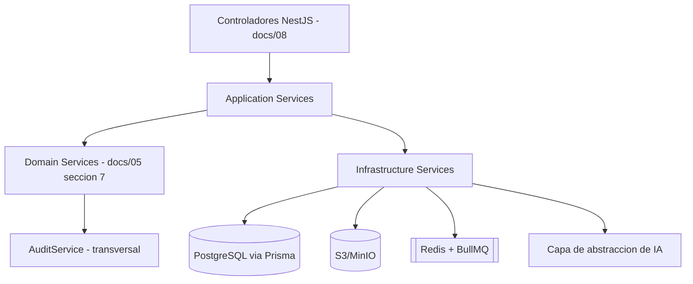
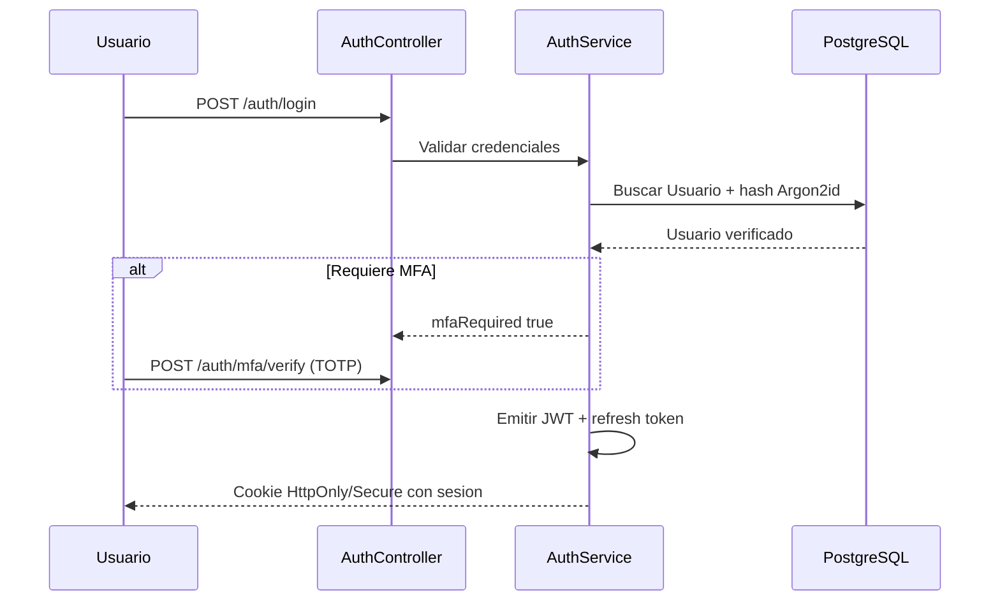
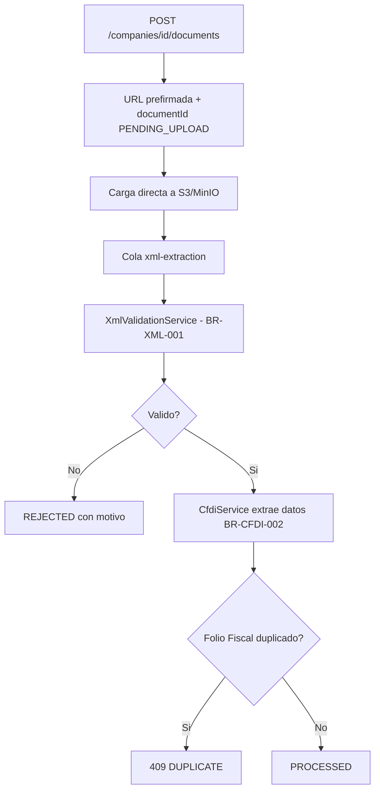
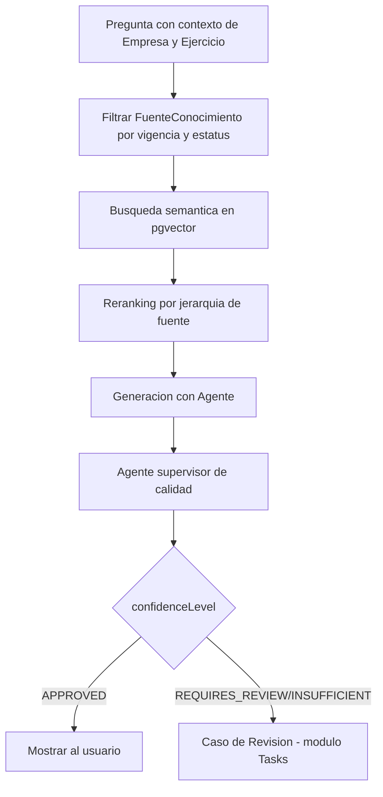
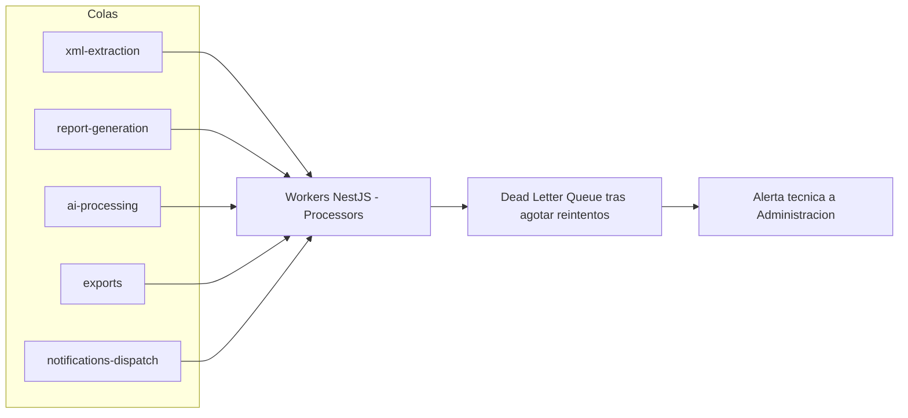
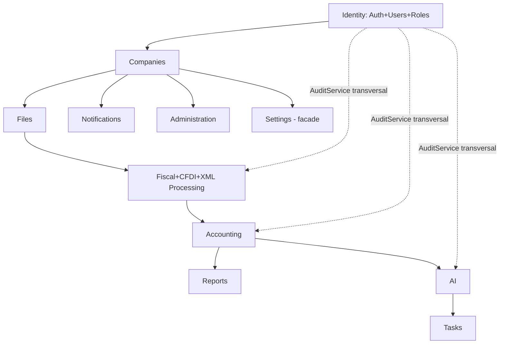

# Plan de Implementación de Backend — ContaIA

## Control del documento

| Campo                             | Valor                                                                                                                                                                                                                                                                                                                                                                                                                                                                                                                                                                                                                                          |
| --------------------------------- | ---------------------------------------------------------------------------------------------------------------------------------------------------------------------------------------------------------------------------------------------------------------------------------------------------------------------------------------------------------------------------------------------------------------------------------------------------------------------------------------------------------------------------------------------------------------------------------------------------------------------------------------------- |
| Documento                         | 20_BACKEND_IMPLEMENTATION_PLAN.md                                                                                                                                                                                                                                                                                                                                                                                                                                                                                                                                                                                                              |
| Orden de trabajo                  | AWO-016                                                                                                                                                                                                                                                                                                                                                                                                                                                                                                                                                                                                                                        |
| Versión                           | 1.0                                                                                                                                                                                                                                                                                                                                                                                                                                                                                                                                                                                                                                            |
| **Estado**                        | **Draft v1.0**                                                                                                                                                                                                                                                                                                                                                                                                                                                                                                                                                                                                                                 |
| Fecha de creación                 | 2026-07-18                                                                                                                                                                                                                                                                                                                                                                                                                                                                                                                                                                                                                                     |
| Última actualización              | 2026-07-18                                                                                                                                                                                                                                                                                                                                                                                                                                                                                                                                                                                                                                     |
| Fuentes de verdad                 | `MASTER_CONTEXT.md`, `docs/00_PRODUCT_VISION.md`, `docs/01_PRD.md`, `docs/02_USER_PERSONAS.md`, `docs/04_BUSINESS_RULES.md`, `docs/05_SYSTEM_DOMAIN_MODEL.md`, `docs/06_SYSTEM_WORKFLOWS.md`, `docs/07_SOFTWARE_ARCHITECTURE.md`, `docs/08_API_DESIGN.md`, `docs/09_DATABASE_DESIGN.md`, `docs/10_AI_ARCHITECTURE.md`, `docs/11_SECURITY_ARCHITECTURE.md`, `docs/12_FRONTEND_ARCHITECTURE.md`, `docs/13_DESIGN_SYSTEM.md`, `docs/14_INFORMATION_ARCHITECTURE.md`, `docs/15_UX_FLOWS.md`, `docs/16_WIREFRAMES_SPECIFICATION.md`, `docs/17_PROTOTYPE_SPECIFICATION.md`, `docs/18_UI_SPECIFICATION.md`, `docs/19_FRONTEND_IMPLEMENTATION_PLAN.md` |
| Documentos que este plan alimenta | `docs/21_DATABASE_MIGRATION_PLAN.md` (próximo, ver "Observaciones del Arquitecto")                                                                                                                                                                                                                                                                                                                                                                                                                                                                                                                                                             |

> Nota sobre numeración: la Work Order referenciaba `docs/03_BUSINESS_RULES.md`, `docs/04_SYSTEM_DOMAIN_MODEL.md` y `docs/05_SYSTEM_WORKFLOWS.md` — nombres desactualizados por renumeraciones ya corregidas; se usan las rutas reales (`docs/04`, `docs/05`, `docs/06`). `docs/20` **no presentó colisión** — la Política oficial de gestión de colisiones de numeración (`MASTER_CONTEXT.md`, sección 27.4) ya había liberado el bloque `docs/19`-`docs/24` de forma preventiva antes de esta Work Order.

> Este documento es un plan de implementación técnica del backend. No es código, no contradice ninguna decisión conceptual ya aprobada — confirma el ORM que `MASTER_CONTEXT.md` (sección 25, pregunta 4) dejó como pregunta abierta, y traduce la arquitectura de 8 Bounded Contexts de `docs/07_SOFTWARE_ARCHITECTURE.md` a 16 módulos concretos de implementación.

---

## Principios del backend

El backend debe ser modular, desacoplado, escalable, seguro, auditable, multiempresa, orientado a dominio, preparado para procesamiento asíncrono, preparado para IA y preparado para alta disponibilidad — instrucción explícita de esta Work Order, consistente con los principios ya aprobados de modularidad (`MASTER_CONTEXT.md` 10.9), aislamiento multiempresa (BR-GLB-001), cálculos determinísticos (BR-GLB-004) y el principio fundamental de que la IA nunca decide (`docs/04_BUSINESS_RULES.md`, sección 2).

## 1. Objetivo del backend

**Propósito:** dar a cualquier desarrollador o agente de implementación una guía suficiente para construir el backend de ContaIA desde cero hasta una plataforma empresarial escalable, sin tomar decisiones de arquitectura, tecnología o alcance por su cuenta.

**Alcance:** los 16 módulos de esta Work Order (sección 3), implementando íntegramente los contratos ya fijados en `docs/08_API_DESIGN.md` (55 endpoints) sobre el modelo de datos ya fijado en `docs/09_DATABASE_DESIGN.md` (20 entidades), dentro de la arquitectura de monolito modular ya fijada en `docs/07_SOFTWARE_ARCHITECTURE.md`.

**Exclusiones:** código de producción; selección de proveedor cloud (`docs/22_INFRASTRUCTURE_IMPLEMENTATION_PLAN.md`, reservado); migraciones concretas de esquema (`docs/21_DATABASE_MIGRATION_PLAN.md`, próximo); integración real con el SAT o un PAC — permanece fuera del MVP (BR-CFDI-001, BR-GLB-005, `MASTER_CONTEXT.md` sección 15), ver sección 8.

**Responsabilidades:** implementar los ocho Bounded Contexts de `docs/07_SOFTWARE_ARCHITECTURE.md` como módulos NestJS; sostener técnicamente el aislamiento multiempresa como propiedad estructural (sección 12); separar físicamente el Motor de Cálculo Contable de los Agentes de IA (AD-04 de `docs/07`); exponer exactamente los contratos de `docs/08_API_DESIGN.md`, sin rediseñarlos.

## 2. Tecnologías recomendadas

| Tecnología            | Rol                             | Justificación                                                                                                                                                                                                                                                                                                                                                                             |
| --------------------- | ------------------------------- | ----------------------------------------------------------------------------------------------------------------------------------------------------------------------------------------------------------------------------------------------------------------------------------------------------------------------------------------------------------------------------------------- |
| **NestJS**            | Framework de aplicación backend | Su sistema de módulos con inyección de dependencias mapea de forma natural sobre los 8 módulos de `docs/07_SOFTWARE_ARCHITECTURE.md` (sección 6); TypeScript de punta a punta con el frontend (`docs/19_FRONTEND_IMPLEMENTATION_PLAN.md`) permite compartir tipos derivados de `docs/08_API_DESIGN.md`; soporte nativo de Swagger, colas (BullMQ) y WebSockets si se necesitaran a futuro |
| **TypeScript**        | Lenguaje                        | Ya implícito en "Backend modular" tipado de `MASTER_CONTEXT.md` sección 17; detecta en compilación cualquier desalineación con los contratos de `docs/08_API_DESIGN.md`                                                                                                                                                                                                                   |
| **Prisma ORM**        | Acceso a datos                  | **Cierra la pregunta pendiente 4 de `MASTER_CONTEXT.md` (sección 25):** "¿Qué ORM se utilizará sobre PostgreSQL?" Prisma genera tipos TypeScript directamente desde el esquema, coherente con el modelo lógico ya fijado en `docs/09_DATABASE_DESIGN.md`; su motor de migraciones soporta el patrón expand/contract ya exigido en ese documento (sección 17)                              |
| **PostgreSQL**        | Base de datos relacional        | Ya propuesto en `MASTER_CONTEXT.md` sección 17 y asumido implícitamente en todo `docs/09_DATABASE_DESIGN.md` (restricciones de unicidad compuesta, integridad referencial); soporta la extensión `pgvector` para RAG sin requerir una base de datos vectorial separada (ver sección 7)                                                                                                    |
| **Redis**             | Caché y backend de colas        | Sostiene BullMQ (procesamiento asíncrono, sección 6), rate limiting (`docs/08_API_DESIGN.md` sección 19) y caché de lectura de corta duración (sección 14)                                                                                                                                                                                                                                |
| **BullMQ**            | Colas y workers                 | Implementación concreta del "sistema de colas para trabajos en segundo plano" ya propuesto en `MASTER_CONTEXT.md` sección 17 y del modelo de Job de `docs/08_API_DESIGN.md` (sección 15); integración oficial con NestJS                                                                                                                                                                  |
| **MinIO / S3**        | Almacenamiento de objetos       | Implementa el "almacenamiento de objetos compatible con S3" ya propuesto en `MASTER_CONTEXT.md` sección 17; MinIO para entornos de desarrollo/self-hosted, cualquier proveedor S3-compatible en producción — sin fijar proveedor cloud (fuera del alcance de este documento)                                                                                                              |
| **OpenTelemetry**     | Observabilidad                  | Instrumentación neutral de proveedor, coherente con el principio ya aplicado a IA ("evitar dependencia absoluta de un solo proveedor", `MASTER_CONTEXT.md` sección 17) extendido aquí a la capa de observabilidad; alimenta directamente los requisitos de `docs/07_SOFTWARE_ARCHITECTURE.md` sección 12                                                                                  |
| **Swagger / OpenAPI** | Documentación de API            | Generado directamente desde los controladores NestJS, debe validarse contra los contratos ya fijados en `docs/08_API_DESIGN.md` — nunca la fuente de verdad, sí su reflejo ejecutable                                                                                                                                                                                                     |
| **Docker**            | Contenedores                    | Ya propuesto en `MASTER_CONTEXT.md` sección 17 ("Contenedores para entornos reproducibles")                                                                                                                                                                                                                                                                                               |
| **JWT**               | Formato de token de sesión      | Token de acceso de vida corta; **el formato del token (JWT) es independiente de su almacenamiento** — se emite dentro de una cookie `HttpOnly`/`Secure`, nunca expuesto a JavaScript de cliente (`docs/11_SECURITY_ARCHITECTURE.md` sección 7, `docs/19_FRONTEND_IMPLEMENTATION_PLAN.md` sección 10)                                                                                      |
| **OAuth2**            | Patrón de flujo de autorización | Se adopta el patrón de emisión/renovación de tokens (no un flujo de terceros) para la autenticación interna del MVP; deja reservado el mismo patrón como punto de extensión para SSO real, explícitamente fuera del MVP (`docs/11_SECURITY_ARCHITECTURE.md` sección 1: "Exclusiones del MVP: SSO...") — **no se implementa login de terceros en esta fase**                               |
| **Argon2** (Argon2id) | Hash de contraseñas             | Cumple literalmente BR-SEC-002 y `docs/11_SECURITY_ARCHITECTURE.md` sección 6: "función diseñada para credenciales, nunca hash genérico de propósito general" — Argon2id es la recomendación vigente de OWASP para este propósito                                                                                                                                                         |

## 3. Arquitectura por módulos

**Reconciliación de granularidad:** `docs/07_SOFTWARE_ARCHITECTURE.md` (sección 6) definió 8 módulos de código, uno por Bounded Context, con Auditoría/Trazabilidad como capacidad transversal de infraestructura (AD-02), no un módulo de negocio. Esta Work Order pide 16 módulos — una granularidad de implementación NestJS más fina, no una arquitectura distinta. La tabla siguiente mapea cada uno de los 16 al Bounded Context del que deriva, sin contradecir `docs/07`:

| Módulo (esta Work Order) | Bounded Context de origen (`docs/07`)                                                                                            | Responsabilidad                                                                   | Entidades (`docs/09`)                                                                  | Servicios                                                                       | Controladores                                                                                         | Eventos que publica                                                                                                                         | Dependencias                                               |
| ------------------------ | -------------------------------------------------------------------------------------------------------------------------------- | --------------------------------------------------------------------------------- | -------------------------------------------------------------------------------------- | ------------------------------------------------------------------------------- | ----------------------------------------------------------------------------------------------------- | ------------------------------------------------------------------------------------------------------------------------------------------- | ---------------------------------------------------------- |
| **Authentication**       | Identity (parte)                                                                                                                 | Credenciales, sesión, MFA                                                         | Usuario                                                                                | `AuthService`, `MfaService`                                                     | `AuthController` (`docs/08` 9.1)                                                                      | —                                                                                                                                           | Ninguna (módulo base)                                      |
| **Users**                | Identity (parte)                                                                                                                 | Identidad de Usuario, perfil                                                      | Usuario                                                                                | `UsersService`                                                                  | `UsersController`                                                                                     | —                                                                                                                                           | Authentication                                             |
| **Companies**            | Organizations                                                                                                                    | Organización, Empresa, Ejercicio                                                  | Organización, Empresa, Ejercicio                                                       | `CompaniesService`, `FiscalYearsService`                                        | `CompaniesController`, `FiscalYearsController` (`docs/08` 9.2, 9.4)                                   | `EmpresaCreada`, `EjercicioCerrado`                                                                                                         | Users                                                      |
| **Roles & Permissions**  | Identity (parte)                                                                                                                 | Membresía, Rol, autorización                                                      | Membresía                                                                              | `MembershipsService`, `AuthorizationGuard`                                      | `MembershipsController` (`docs/08` 9.3)                                                               | `UsuarioInvitado`, `InvitaciónAceptada`, `RolAsignado`/`RolModificado`                                                                      | Users, Companies                                           |
| **Files**                | Documents                                                                                                                        | Repositorio genérico de archivos                                                  | Documento                                                                              | `DocumentsService`, `UploadService`                                             | `DocumentsController` (`docs/08` 9.5)                                                                 | `DocumentoCargado`                                                                                                                          | Companies                                                  |
| **Fiscal**               | Fiscal                                                                                                                           | Coordinación de CFDI, vinculación                                                 | CFDI (referencia)                                                                      | `FiscalService`                                                                 | (comparte rutas con CFDI)                                                                             | —                                                                                                                                           | Files                                                      |
| **CFDI**                 | Fiscal (parte)                                                                                                                   | Extracción y datos estructurados de CFDI                                          | CFDI                                                                                   | `CfdiService`                                                                   | `CfdiController` (`docs/08` 9.5)                                                                      | `CFDIExtraído`, `CampoAmbiguoDetectado`                                                                                                     | Files, XML Processing                                      |
| **XML Processing**       | Fiscal (parte, técnico)                                                                                                          | Validación estructural de XML                                                     | — (servicio técnico, sin entidad propia)                                               | `XmlValidationService`                                                          | — (invocado internamente por CFDI)                                                                    | `XMLValidado`                                                                                                                               | Files                                                      |
| **Accounting**           | Accounting                                                                                                                       | Catálogo, Pólizas, Balanza, Estados Financieros                                   | Cuenta, CuentaHistorial, Póliza, MovimientoPoliza                                      | `ChartOfAccountsService`, `JournalEntriesService`, `FinancialStatementsService` | `AccountsController`, `JournalEntriesController`, `FinancialStatementsController` (`docs/08` 9.6-9.8) | `PólizaCapturada`, `...EnviadaARevisión`, `...Aprobada`, `...Rechazada`, `...DeAjusteCreada`, `BalanzaGenerada`, `EstadoFinancieroGenerado` | Companies, CFDI                                            |
| **Reports**              | Accounting (capa de presentación, sin datos propios)                                                                             | Empaquetado, comparación y exportación de resultados ya calculados por Accounting | Ninguna propia — consume resultados de Accounting                                      | `ReportsService` (orquesta, no calcula)                                         | Reutiliza `FinancialStatementsController`                                                             | —                                                                                                                                           | Accounting                                                 |
| **AI**                   | AI                                                                                                                               | Agentes, Fundamento, evaluación de calidad                                        | ConversaciónIA, RespuestaIA, FuenteFundamento, FuenteConocimiento, RetroalimentaciónIA | `AiConversationService`, `RagService`, `QualitySupervisorService`               | `AiController` (`docs/08` 9.9)                                                                        | `IAGeneróRespuesta`, `RespuestaEvaluada`                                                                                                    | Accounting (lectura), Files (lectura)                      |
| **Tasks**                | Notifications (parte, elevado según `docs/14_INFORMATION_ARCHITECTURE.md` sección 3)                                             | Casos de Revisión, cola de aprobación humana                                      | CasoDeRevisión                                                                         | `ApprovalsService`                                                              | `ApprovalsController` (`docs/08` 9.10)                                                                | `RespuestaMarcadaParaRevisión`                                                                                                              | Accounting, AI                                             |
| **Notifications**        | Notifications (parte)                                                                                                            | Alertas deterministas                                                             | Alerta                                                                                 | `AlertsService`                                                                 | `AlertsController` (`docs/08` 9.12)                                                                   | `AlertaGenerada`                                                                                                                            | Accounting, Files (origen de alertas)                      |
| **Audit**                | Governance/Infraestructura (AD-02 de `docs/07`)                                                                                  | Registro de Trazabilidad, también bus de eventos interno (AD-06)                  | RegistroDeTrazabilidad                                                                 | `AuditService` (inyectado transversalmente, no expone lógica de negocio propia) | `AuditController` (`docs/08` 9.11)                                                                    | — (es el propio mecanismo de eventos)                                                                                                       | Ninguna — todos los módulos dependen de él, nunca al revés |
| **Settings**             | Facade sobre Organizations e Identity (`docs/12_FRONTEND_ARCHITECTURE.md` sección 21: "Settings no es un módulo backend propio") | Composición de configuración personal y de Empresa, sin datos propios             | Ninguna propia                                                                         | `SettingsFacadeService` (delega en `CompaniesService`/`UsersService`)           | — (reutiliza `CompaniesController`/`UsersController`)                                                 | —                                                                                                                                           | Companies, Users                                           |
| **Administration**       | Administration                                                                                                                   | Panel interno de plataforma, soporte auditado                                     | (usa entidades de Companies/Users)                                                     | `PlatformAdminService`, `SupportAccessService`                                  | `AdminController` (`docs/08` 9.13)                                                                    | `AccesoDeSoporteRegistrado`                                                                                                                 | Companies, Users, Audit                                    |

**Nota sobre Audit:** aunque `docs/07_SOFTWARE_ARCHITECTURE.md` (AD-02) declara que Auditoría/Trazabilidad no es un módulo de negocio con interfaz propia, en NestJS es normal y no contradictorio organizar la implementación de una capacidad transversal como un módulo de código (`AuditModule`) que expone un `AuditService` inyectable — la distinción de `docs/07` es sobre arquitectura de dominio (¿tiene un Bounded Context propio con reglas de negocio?), no sobre organización de carpetas de NestJS. Ambas decisiones son compatibles, igual que ya se reconcilió a nivel de datos en `docs/09_DATABASE_DESIGN.md` (Observaciones del Arquitecto).

## 4. Arquitectura de servicios

Confirma las cuatro capas de `docs/07_SOFTWARE_ARCHITECTURE.md` (sección 5) con su expresión concreta en NestJS:

| Capa                        | Rol                                                                                                                                            | Ejemplos                                                                                                                                                                                                      |
| --------------------------- | ---------------------------------------------------------------------------------------------------------------------------------------------- | ------------------------------------------------------------------------------------------------------------------------------------------------------------------------------------------------------------- |
| **Application Services**    | Orquestan workflows completos (`docs/06_SYSTEM_WORKFLOWS.md`), validan Membresía/Rol antes de invocar al Dominio, traducen errores             | `JournalEntriesService.submitForApproval()`, coordinando validación, evento y notificación                                                                                                                    |
| **Domain Services**         | Los 7 ya nombrados en `docs/05_SYSTEM_DOMAIN_MODEL.md` (sección 7), sin reglas de infraestructura                                              | Servicio de Aislamiento Multiempresa, Servicio de Aprobación, Motor de Cálculo Contable, Servicio de Extracción de CFDI, Servicio de Fundamentación de IA, Servicio de Trazabilidad, Servicio de Notificación |
| **Infrastructure Services** | Implementan las interfaces que el Dominio define — persistencia (Prisma), almacenamiento (S3/MinIO), colas (BullMQ), capa de abstracción de IA | `PrismaJournalEntryRepository`, `S3StorageAdapter`, `BullMqJobQueue`, `AiProviderAdapter`                                                                                                                     |
| **Shared Services**         | Utilidades sin lógica de negocio, usadas por más de un módulo                                                                                  | Formateo de moneda/fecha, validación de formato de RFC (estructural, nunca contra el SAT — BR-CFDI-001), generación de UUID                                                                                   |

**Límite no negociable:** ningún Domain Service depende de un Infrastructure Service concreto — depende de una interfaz que Infrastructure implementa (inversión de dependencias, ya fijada en `docs/07_SOFTWARE_ARCHITECTURE.md` sección 5).

## 5. Estrategia de APIs

Implementación directa de `docs/08_API_DESIGN.md`, sin rediseñarlo:

| Aspecto           | Implementación NestJS                                                                                                                                                             |
| ----------------- | --------------------------------------------------------------------------------------------------------------------------------------------------------------------------------- |
| REST              | Controladores por grupo de recursos (sección 9 de `docs/08`), un controlador por recurso principal                                                                                |
| Versionado        | Prefijo de ruta `/api/v1` mediante el versionado nativo de NestJS (`docs/08` sección 18)                                                                                          |
| Paginación        | DTO compartido `PaginationQueryDto`, aplicado uniformemente vía un `Pipe` global                                                                                                  |
| Filtros           | DTOs de consulta tipados por recurso, validados con `class-validator`/Zod — nunca un filtro genérico no tipado (`docs/08` sección 12)                                             |
| Ordenamiento      | Parámetro `sort` parseado por un `Pipe` compartido, con `createdAt:desc` como default salvo excepción documentada                                                                 |
| Búsqueda          | Acotada por `companyId` en cada consulta, nunca a nivel global                                                                                                                    |
| Manejo de errores | `Filtro de excepciones global` que traduce excepciones de Dominio a la forma exacta del contrato de error de `docs/08` sección 11 (código, mensaje, `correlationId`, `retryable`) |
| Idempotencia      | `Interceptor` que verifica el encabezado `Idempotency-Key` contra la entidad `ClaveDeIdempotencia` (`docs/09_DATABASE_DESIGN.md`) antes de ejecutar una mutación de creación      |
| Bloqueo optimista | `Guard`/`Interceptor` que valida `If-Match` contra el campo `version` de Póliza/CasoDeRevisión/Membresía antes de aceptar una escritura (`docs/08` sección 13)                    |

## 6. Procesamiento asíncrono

Modelo de Job único (`docs/08_API_DESIGN.md` sección 15), implementado con colas BullMQ dedicadas por tipo:

| Cola                     | Uso                                                               | Reintentos                                                              | Prioridad                                                                   |
| ------------------------ | ----------------------------------------------------------------- | ----------------------------------------------------------------------- | --------------------------------------------------------------------------- |
| `xml-extraction`         | Validación estructural + extracción de CFDI (workflow 6-7)        | 3 intentos con backoff exponencial                                      | Alta (bloquea la disponibilidad del CFDI para el Usuario)                   |
| `report-generation`      | Balanza/Estados Financieros de gran volumen                       | 2 intentos                                                              | Media                                                                       |
| `ai-processing`          | Análisis extenso de IA (cuando no cabe en una respuesta síncrona) | 2 intentos, con circuit breaker hacia el proveedor (AD-05 de `docs/07`) | Media                                                                       |
| `exports`                | Generación de archivos de exportación                             | 2 intentos                                                              | Baja                                                                        |
| `notifications-dispatch` | Evaluación de reglas deterministas que generan Alertas            | 3 intentos                                                              | Alta (afecta la percepción de "sistema atento", `docs/02_USER_PERSONAS.md`) |

**Workers:** procesos NestJS dedicados (`@Processor`), separados del proceso HTTP principal para no competir por recursos con solicitudes síncronas. **DLQ:** todo Job que agota sus reintentos se mueve a una cola de fallos muertos, visible solo para Administración de plataforma, y genera una alerta técnica (distinta de una Alerta de negocio, `docs/07_SOFTWARE_ARCHITECTURE.md` sección 12). **Prioridades:** las colas con mayor prioridad se procesan primero cuando el worker tiene capacidad limitada, sin inanición indefinida de las colas de baja prioridad (límite de espera máxima configurable).

## 7. Integración con IA

Implementación concreta del pipeline ya diseñado en `docs/10_AI_ARCHITECTURE.md`:

| Componente                      | Implementación                                                                                                                                                                                                                                                                                                    |
| ------------------------------- | ----------------------------------------------------------------------------------------------------------------------------------------------------------------------------------------------------------------------------------------------------------------------------------------------------------------- |
| Orquestador                     | `AiOrchestratorService` — el "Coordinador" de `docs/10` sección 4-5, enruta a lógica determinística o a un Agente, nunca ambos a la vez                                                                                                                                                                           |
| RAG                             | Consulta híbrida sobre `pgvector` (extensión de PostgreSQL) — **se recomienda no introducir una base de datos vectorial separada en el MVP**, coherente con el principio de evitar complejidad de infraestructura prematura (`MASTER_CONTEXT.md` 10.9); reevaluar solo si el volumen de `knowledge/` lo justifica |
| Recuperación documental         | Consulta a `FuenteConocimiento` filtrada por vigencia y estatus de validación antes de la búsqueda semántica (`docs/10` sección 6)                                                                                                                                                                                |
| Versionado por Ejercicio fiscal | El Ejercicio de la Empresa activa se pasa como parámetro de contexto obligatorio a toda consulta al Agente Fiscal/Contable (`docs/10` sección 7)                                                                                                                                                                  |
| Validaciones                    | Guardrails de `docs/10` sección 17 implementados como una cadena de `Pipes`/validadores posteriores a la generación, antes de exponer la respuesta                                                                                                                                                                |
| Aprobación humana               | Toda Sugerencia que derive en una acción real pasa por `ApprovalsService` (módulo Tasks) — **ningún servicio de IA invoca directamente una mutación de `AccountingService`**                                                                                                                                      |
| Auditoría                       | Toda interacción de IA se registra vía `AuditService`, igual que el resto del sistema (AD-06)                                                                                                                                                                                                                     |

**Regla de implementación no negociable:** a nivel de código, ningún proveedor de `AiOrchestratorService` o sus Agentes tiene inyectado un repositorio de escritura de Cuenta, Póliza o MovimientoPoliza — la ausencia estructural ya exigida en `docs/09_DATABASE_DESIGN.md` (sección 11) se refuerza aquí como regla de inyección de dependencias verificable en revisión de código.

## 8. Integración SAT y PAC

**Esta sección documenta una estrategia futura (Etapa 4 de `MASTER_CONTEXT.md`), explícitamente fuera del alcance del MVP.** BR-CFDI-001 y BR-GLB-005 prohíben, sin excepción en el MVP, cualquier timbrado, validación oficial o simulación de conexión con el SAT; `docs/07_SOFTWARE_ARCHITECTURE.md` (sección 15) ya reservó, sin implementar, un punto de extensión para un proveedor PAC. Este documento no diseña una integración a construir ahora — describe únicamente la **interfaz reservada**, para que su futura implementación no requiera rediseñar el módulo Fiscal:

| Aspecto                   | Diseño reservado (no implementado en el MVP)                                                                                                                                                                                                                                                                                                                                                |
| ------------------------- | ------------------------------------------------------------------------------------------------------------------------------------------------------------------------------------------------------------------------------------------------------------------------------------------------------------------------------------------------------------------------------------------- |
| Descarga masiva           | Interfaz `SatDownloadProvider` (no implementada); ningún adaptador concreto existe en el MVP                                                                                                                                                                                                                                                                                                |
| Autenticación con e.firma | **Nunca se almacena la llave privada de e.firma en la base de datos de ContaIA**, ni en el MVP ni en la implementación futura — el diseño reservado delega la operación criptográfica a un servicio de firma externo (HSM/KMS) o al propio flujo del PAC, coherente con el límite explícito de `MASTER_CONTEXT.md` sección 15 ("No debe almacenar contraseñas o e.firma de forma insegura") |
| PAC para timbrado         | Interfaz `PacTimbradoProvider` (no implementada); el módulo CFDI del MVP solo lee XML ya timbrados por el emisor original                                                                                                                                                                                                                                                                   |
| Validación XML            | Ya implementada en el MVP (`XML Processing`, sección 3) — la validación **estructural**; la validación **fiscal** ante el SAT queda en esta sección, no implementada                                                                                                                                                                                                                        |
| Sincronización            | Fuera de alcance — no hay proceso de sincronización con el SAT en el MVP                                                                                                                                                                                                                                                                                                                    |
| Manejo de errores         | Reservado al mismo estándar de `docs/08_API_DESIGN.md` sección 11 cuando se implemente                                                                                                                                                                                                                                                                                                      |

**Ninguna tarea de esta sección se planifica dentro de las ocho fases del roadmap de esta Work Order (sección 16).**

## 9. Gestión de archivos

| Aspecto            | Especificación                                                                                                                                                         |
| ------------------ | ---------------------------------------------------------------------------------------------------------------------------------------------------------------------- |
| Almacenamiento     | S3/MinIO (sección 2); referencia lógica (`storageReference`) en `Documento`, nunca el binario en PostgreSQL (`docs/09_DATABASE_DESIGN.md` sección 10)                  |
| Organización       | Por Empresa + tipo + Ejercicio como metadatos filtrables, nunca como jerarquía de carpetas (`docs/14_INFORMATION_ARCHITECTURE.md` sección 22)                          |
| Versionado         | No aplica — los Documentos no se editan una vez procesados (BR-INT-002); una corrección es un nuevo Documento, no una versión del existente                            |
| Permisos           | Acceso exclusivamente vía URL prefirmada de carga/descarga, de vigencia corta (`docs/08_API_DESIGN.md` sección 14) — nunca una ruta pública permanente                 |
| Retención          | Indefinida para Documentos `PROCESSED` o vinculados a evidencia; corta para `PENDING_UPLOAD`/`REJECTED` no confirmados (`docs/11_SECURITY_ARCHITECTURE.md` sección 16) |
| Eliminación segura | Solo disponible para Documentos no confirmados; un Documento procesado y vinculado a evidencia nunca se elimina físicamente (BR-INT-002)                               |

## 10. Seguridad

Implementación concreta de `docs/11_SECURITY_ARCHITECTURE.md`, cerrando varios de sus mecanismos "pendientes de validación":

| Control            | Implementación                                                                                                                                                                                                                                                                                                                                |
| ------------------ | --------------------------------------------------------------------------------------------------------------------------------------------------------------------------------------------------------------------------------------------------------------------------------------------------------------------------------------------- |
| Autenticación      | Argon2id para hash de contraseñas (sección 2); verificación de correo obligatoria antes de acceso a datos reales (BR-AUTH-001)                                                                                                                                                                                                                |
| Autorización       | RBAC evaluado como (Usuario, `companyId`, Rol) en un `Guard` global de NestJS, ejecutado antes de cada controlador — nunca delegado solo a la interfaz                                                                                                                                                                                        |
| MFA                | **Mecanismo concreto:** TOTP (contraseña de un solo uso basada en tiempo, compatible con aplicaciones de autenticación estándar), cerrando el mecanismo que `docs/11_SECURITY_ARCHITECTURE.md` (sección 6) dejó como pendiente de definición técnica                                                                                          |
| Rotación de tokens | Token de acceso JWT de vida corta (~15 minutos); token de refresco de vida más larga, almacenado con hash (nunca en texto plano) y revocable individualmente                                                                                                                                                                                  |
| Cifrado            | TLS en tránsito sin excepción; cifrado a nivel de columna para RFC, correo y otros datos "Altamente sensibles" (`docs/11_SECURITY_ARCHITECTURE.md` sección 3) mediante el mecanismo de cifrado de PostgreSQL o de la capa de aplicación, sin fijar aquí el algoritmo específico (decisión de `docs/22_INFRASTRUCTURE_IMPLEMENTATION_PLAN.md`) |
| Secretos           | Gestor de secretos externo (KMS/Vault, sin fijar proveedor) — ningún secreto vive en variables de entorno versionadas ni en código                                                                                                                                                                                                            |
| Rate limiting      | `ThrottlerModule` de NestJS respaldado por Redis, con límites más estrictos en el grupo Identity (`docs/08_API_DESIGN.md` sección 19)                                                                                                                                                                                                         |
| Protección OWASP   | `helmet` para cabeceras de seguridad, CORS restringido al origen del Frontend oficial, consultas parametrizadas por defecto vía Prisma (previene inyección SQL), CSRF token en mutaciones desde cookie de sesión                                                                                                                              |

## 11. Observabilidad

| Flujo                | Herramienta                                                                                                                    | Propósito                                                                                                 |
| -------------------- | ------------------------------------------------------------------------------------------------------------------------------ | --------------------------------------------------------------------------------------------------------- |
| Logs estructurados   | JSON, con `correlationId` propagado desde el encabezado `X-Correlation-Id` (`docs/08_API_DESIGN.md` sección 4)                 | Diagnóstico técnico, nunca datos sensibles de una Empresa (`docs/11_SECURITY_ARCHITECTURE.md` sección 29) |
| Métricas             | OpenTelemetry Metrics — latencia, tasa de error, volumen de eventos por módulo (`docs/07_SOFTWARE_ARCHITECTURE.md` sección 12) | Salud técnica del sistema                                                                                 |
| Trazas               | OpenTelemetry Traces — de extremo a extremo entre módulos, útil incluso dentro de un monolito para detectar acoplamiento real  | Diagnóstico de flujo, por ejemplo de `DocumentoCargado` a `EstadoFinancieroGenerado`                      |
| Auditoría de negocio | `AuditService` (módulo Audit, sección 3) — **flujo separado de los logs técnicos**, inmutable, nunca purgado (BR-TRZ-002)      | Evidencia legal/operativa, distinta de diagnóstico técnico                                                |
| Monitoreo y alertas  | Reservado a `docs/22_INFRASTRUCTURE_IMPLEMENTATION_PLAN.md` — este documento no fija umbrales ni proveedor de monitoreo        |

## 12. Estrategia de base de datos

Implementación directa de `docs/09_DATABASE_DESIGN.md`, sin rediseñarlo:

| Aspecto           | Implementación                                                                                                                                                                                                                                                                                                            |
| ----------------- | ------------------------------------------------------------------------------------------------------------------------------------------------------------------------------------------------------------------------------------------------------------------------------------------------------------------------- |
| Migraciones       | Prisma Migrate, siguiendo el patrón expand/contract ya exigido (`docs/09` sección 17): agregar columna nullable → backfill → aplicar restricción → limpiar; nunca una migración destructiva directa sobre datos definitivos                                                                                               |
| Transacciones     | `prisma.$transaction()` para operaciones atómicas multi-entidad — por ejemplo, creación de Empresa + Membresía Administrador propietario en la misma transacción (BR-EMP-001)                                                                                                                                             |
| Índices           | Todo `companyId` es candidato a índice; unicidad compuesta indexada real (no solo validada en aplicación) para (`companyId`, `folioFiscal`) y (`companyId`, `accountCode`) — cierra el riesgo ya señalado en `docs/08_API_DESIGN.md` y `docs/09_DATABASE_DESIGN.md` sobre implementación real vs. solo contractual        |
| Bloqueo optimista | Campo `version` (entero) en Póliza, CasoDeRevisión y Membresía, verificado en cada escritura contra el `If-Match` recibido (sección 5)                                                                                                                                                                                    |
| Soft delete       | **No se usa para entidades de negocio definitivas** (BR-INT-002) — Póliza, Cuenta y Registro de Trazabilidad nunca se eliminan, solo transicionan de estado; el patrón de "eliminación suave" solo aplica a recursos técnicos no confirmados (`Documento` en `PENDING_UPLOAD`/`REJECTED`, Pólizas en `DRAFT` no enviadas) |
| Multi-tenancy     | Fila por Empresa (`companyId` como clave foránea obligatoria en toda tabla de negocio) reforzado con un middleware de Prisma que inyecta el filtro de `companyId` en cada consulta como defensa en profundidad adicional a la validación de la capa de Aplicación (`docs/11_SECURITY_ARCHITECTURE.md` sección 11)         |

## 13. Testing

| Tipo        | Herramienta de referencia                                                                                                                           | Alcance                                                                           |
| ----------- | --------------------------------------------------------------------------------------------------------------------------------------------------- | --------------------------------------------------------------------------------- |
| Unitarias   | Jest (módulo de pruebas nativo de NestJS)                                                                                                           | Domain Services, Shared Services, lógica pura                                     |
| Integración | Testcontainers (PostgreSQL + Redis reales, efímeros)                                                                                                | Application Services contra base de datos real, sin mocks de persistencia         |
| Contratos   | Validación contra el esquema OpenAPI generado (sección 2), verificando que la implementación no diverge de `docs/08_API_DESIGN.md`                  | Cada controlador antes de integrarse                                              |
| Rendimiento | Pruebas de carga sobre los endpoints críticos (aprobación de Pólizas, consulta de Balanza)                                                          | Antes de cada release mayor                                                       |
| Seguridad   | Análisis de dependencias + pruebas dirigidas de autorización (intentos de acceso cruzado entre Empresas)                                            | Cada módulo con datos sensibles                                                   |
| E2E         | Coordinado con la suite Playwright del frontend (`docs/19_FRONTEND_IMPLEMENTATION_PLAN.md` sección 16), ejecutada contra un backend real de staging | Los 8 casos de prueba de `docs/17_PROTOTYPE_SPECIFICATION.md` (`TC-01` a `TC-08`) |

## 14. Performance

| Técnica                  | Aplicación                                                                                                                                                                                                                                                                                   |
| ------------------------ | -------------------------------------------------------------------------------------------------------------------------------------------------------------------------------------------------------------------------------------------------------------------------------------------- |
| Caché                    | Redis para datos de lectura frecuente y baja volatilidad (Catálogo de Cuentas, `FuenteConocimiento` vigente) — **nunca para resultados financieros calculados**, que siempre reflejan el estado más reciente de Pólizas definitivas (BR-GLB-004); invalidación explícita en `PólizaAprobada` |
| Consultas                | Índices por `companyId` (sección 12); uso de `include`/`select` de Prisma para evitar el problema N+1                                                                                                                                                                                        |
| Procesamiento paralelo   | Concurrencia configurable por cola de BullMQ (sección 6), ajustada según el tipo de carga                                                                                                                                                                                                    |
| Colas                    | Prioridades ya definidas en la sección 6                                                                                                                                                                                                                                                     |
| Optimización de recursos | Pool de conexiones a PostgreSQL (por ejemplo, vía PgBouncer, sin fijar la herramienta concreta); escalado de workers reservado a `docs/22_INFRASTRUCTURE_IMPLEMENTATION_PLAN.md`                                                                                                             |

## 15. Escalabilidad

| Etapa                        | Descripción                                                                                                                                                                                                                                               |
| ---------------------------- | --------------------------------------------------------------------------------------------------------------------------------------------------------------------------------------------------------------------------------------------------------- |
| **MVP**                      | Monolito modular, una sola unidad desplegable (AD-01 de `docs/07_SOFTWARE_ARCHITECTURE.md`)                                                                                                                                                               |
| **Crecimiento**              | Instancias horizontales del proceso API detrás de un balanceador; réplicas de lectura de PostgreSQL para consultas de Reportes/Auditoría; pool de workers escalado de forma independiente del proceso API                                                 |
| **Arquitectura empresarial** | Extracción de AI y Fiscal a servicios independientes solo cuando existan razones operativas, de seguridad o de equipo concretas (principio 10.9 de `MASTER_CONTEXT.md`) — mismos candidatos ya señalados en `docs/07_SOFTWARE_ARCHITECTURE.md` sección 16 |

## 16. Roadmap de implementación

Ocho fases, alineadas módulo a módulo con `docs/19_FRONTEND_IMPLEMENTATION_PLAN.md` (sección 17) para permitir desarrollo paralelo por fase entre frontend y backend:

| Fase                   | Módulos                                                                  | Dependencias                     | Duración estimada | Definition of Done                                                                                                                         |
| ---------------------- | ------------------------------------------------------------------------ | -------------------------------- | ----------------- | ------------------------------------------------------------------------------------------------------------------------------------------ |
| **1 — Fundamentos**    | Authentication, Users, Roles & Permissions, Audit (infraestructura base) | Ninguna                          | 2-3 sprints       | Login/MFA/sesión funcionando end-to-end; `AuditService` disponible para inyección en el resto de módulos                                   |
| **2 — Empresas**       | Companies                                                                | Fase 1                           | 2 sprints         | Creación de Empresa + Membresía Administrador propietario atómica; aislamiento multiempresa verificado con pruebas de integración cruzadas |
| **3 — Archivos**       | Files                                                                    | Fase 2                           | 2 sprints         | Flujo de URL prefirmada completo; Job de validación básica operativo                                                                       |
| **4 — Fiscal**         | Fiscal, CFDI, XML Processing                                             | Fase 3                           | 2-3 sprints       | Extracción de CFDI con campos ambiguos marcados; deduplicación por Folio Fiscal verificada a nivel de índice único real                    |
| **5 — Contabilidad**   | Accounting                                                               | Fases 2 y 4                      | 3-4 sprints       | Balance obligatorio verificado a nivel de integridad de dato; aprobación con bloqueo optimista funcional; Balanza reproducible byte a byte |
| **6 — IA y Tareas**    | AI, Tasks                                                                | Fase 5                           | 3 sprints         | Pipeline completo con Agente supervisor de calidad; regla de la sección 7 verificada por revisión de código                                |
| **7 — Reportes**       | Reports                                                                  | Fase 5                           | 2 sprints         | Exportación funcional; ningún cálculo propio fuera de Accounting                                                                           |
| **8 — Administración** | Notifications, Settings, Administration                                  | Fase 1 (paralelizable desde ahí) | 2-3 sprints       | Alertas deterministas operativas; acceso de soporte con motivo obligatorio verificado                                                      |

**Estado real de implementación (actualizado 2026-07-22):** las Fases 1 (Fundamentos — Authentication, Users, Roles & Permissions, Audit) y 2 (Empresas — Companies) están implementadas en código bajo `EWO-002`, `EWO-003` y `EWO-004` — ver `docs/engineering/EWO-002_AUTH_REPORT.md`, `docs/engineering/EWO-003_COMPANY_REPORT.md` y `docs/engineering/EWO-004_USER_RBAC_REPORT.md` para el detalle completo. `EWO-004` completó la capa de guards RBAC (AuthenticationGuard, CompanyGuard, RoleGuard, PermissionGuard, OwnershipGuard), el decorator `@Company()` y el hook `useMyPermissions` del frontend (Workspace Context). La migración inicial de Prisma (`20260722194307`) fue aplicada el 2026-07-22 mediante contenedor Linux efímero (`node:22-bookworm-slim`) conectado a `contaia_network`, eludiendo el proxy TCP de Docker Desktop (WSL2) que aceptaba el handshake TCP desde Windows pero no reenviaba el protocolo PostgreSQL al contenedor; cubre las 17 tablas de los Bounded Contexts Identity, Organizations y RBAC — 137/137 pruebas en verde. **La Fase 3 (Files — `DocumentsModule`, `CfdiModule`, `XmlProcessingModule`, `StorageModule`, `JobsModule`) inicia bajo `EWO-005`, rama `feature/ewo-005-documents-fiscal`**, conforme al plan `docs/engineering/EWO-005_DOCUMENTS_FISCAL_PLAN.md`. Las Fases 4 en adelante siguen sin iniciar. Esta nota mantiene este plan sincronizado con el estado real del código para que una futura Work Order no duplique trabajo ya hecho.

## 17. Riesgos técnicos

- **Rendimiento:** consultas sin índice por `companyId` degradan linealmente con el crecimiento de datos — mitigado por la regla de índice obligatorio (sección 12), pero requiere disciplina de revisión.
- **Concurrencia:** el bloqueo optimista (sección 5) resuelve la condición de carrera en aprobaciones simultáneas ya señalada desde `docs/06_SYSTEM_WORKFLOWS.md`, pero exige que ningún endpoint de escritura crítica omita la verificación de `If-Match`.
- **Consistencia:** el Registro de Trazabilidad como bus de eventos y auditoría a la vez (AD-06) sigue siendo el mayor riesgo de cuello de botella de escritura, heredado de `docs/07`/`docs/09` — requiere estrategia de particionado antes de que el volumen lo exija, no después.
- **Dependencias externas:** un proveedor de IA degradado sin circuit breaker (AD-05) puede saturar el pool de conexiones del backend con solicitudes colgadas — mitigado por timeouts explícitos y la cola `ai-processing` con reintentos acotados.
- **IA:** riesgo de costo y latencia no controlados si el enrutamiento de modelos (`docs/10_AI_ARCHITECTURE.md` sección 19) no se implementa desde el inicio, en vez de usar siempre el modelo más capaz por defecto.
- **Integración SAT:** el riesgo de mayor severidad regulatoria sería iniciar una implementación real de la sección 8 antes de que el responsable de producto apruebe explícitamente entrar a la Etapa 4 — este documento lo previene declarando esa sección como diseño reservado, no como tarea planificada.
- **Escalabilidad:** los picos de uso en cierres mensuales (`docs/02_USER_PERSONAS.md`) concentran carga en las colas `xml-extraction` y `report-generation` — requiere probar el comportamiento del pool de workers bajo ese patrón antes del primer cierre real de un cliente piloto.

## 18. Diagramas Mermaid

### 18.1 Arquitectura backend

### 18.2 Flujo de autenticación

### 18.3 Flujo de importación XML

### 18.4 Flujo RAG

### 18.5 Procesamiento asíncrono

### 18.6 Comunicación entre módulos

## 19. Matriz de implementación

| Módulo              | Prioridad | Complejidad | Dependencias            | Fase | Documentos relacionados                       |
| ------------------- | --------- | ----------- | ----------------------- | ---- | --------------------------------------------- |
| Authentication      | Crítica   | Media       | —                       | 1    | `docs/08` 9.1, `docs/11` §6                   |
| Users               | Crítica   | Baja        | Authentication          | 1    | `docs/08` 9.1                                 |
| Roles & Permissions | Crítica   | Media       | Users                   | 1    | `docs/04` BR-PERM-*, `docs/08` 9.3            |
| Companies           | Crítica   | Media       | Roles & Permissions     | 2    | `docs/08` 9.2/9.4, `docs/09`                  |
| Files               | Crítica   | Media-alta  | Companies               | 3    | `docs/08` 9.5, `docs/07` §14                  |
| Fiscal              | Crítica   | Alta        | Files                   | 4    | `docs/08` 9.5                                 |
| CFDI                | Crítica   | Alta        | Fiscal                  | 4    | `docs/04` BR-CFDI-*, `docs/09`                |
| XML Processing      | Crítica   | Media       | Files                   | 4    | `docs/04` BR-XML-*                            |
| Accounting          | Crítica   | Alta        | Companies, CFDI         | 5    | `docs/08` 9.6-9.8, `docs/04` BR-POL-_/BR-EF-_ |
| AI                  | Alta      | Alta        | Accounting              | 6    | `docs/08` 9.9, `docs/10`                      |
| Tasks               | Alta      | Media       | Accounting, AI          | 6    | `docs/08` 9.10                                |
| Reports             | Alta      | Media       | Accounting              | 7    | `docs/08` 9.8                                 |
| Audit               | Crítica   | Media       | — (transversal)         | 1    | `docs/09` §5, `docs/07` AD-06                 |
| Notifications       | Media     | Baja        | Companies               | 8    | `docs/08` 9.12                                |
| Settings            | Media     | Baja        | Companies, Users        | 8    | `docs/12` §21                                 |
| Administration      | Media     | Media       | Companies, Users, Audit | 8    | `docs/08` 9.13                                |

## 20. MVP

| Clasificación   | Módulos                                                                                                                                                                                                                   |
| --------------- | ------------------------------------------------------------------------------------------------------------------------------------------------------------------------------------------------------------------------- |
| **Críticos**    | Authentication, Users, Roles & Permissions, Companies, Files, Fiscal, CFDI, XML Processing, Accounting, Audit — sostienen el ciclo de valor completo y el requisito transversal de trazabilidad (BR-TRZ-001, no opcional) |
| **Importantes** | AI (alcance curado, `docs/01_PRD.md` módulo M9), Tasks, Reports — necesarios para que el MVP cumpla su promesa de revisión humana fundamentada                                                                            |
| **Posteriores** | Notifications (versión completa), Settings, Administration (funcionalidad completa más allá del mínimo operativo)                                                                                                         |

## 21. Recomendaciones para Database Migration Plan

- **Punto de partida:** las 20 entidades de `docs/09_DATABASE_DESIGN.md` (sección 5) y las restricciones de integridad ya fijadas (sección 7 de ese documento) son el esquema objetivo — `docs/21_DATABASE_MIGRATION_PLAN.md` no debe rediseñarlas, solo planificar el orden y la estrategia de migración hacia ellas.
- **Orden sugerido:** seguir el mismo orden de fases de esta Work Order (sección 16), migrando primero las entidades de Identity/Organizations antes que Accounting/Fiscal, coherente con las dependencias ya declaradas.
- **Patrón obligatorio:** expand/contract (`docs/09` sección 17) para cualquier cambio sobre una tabla con datos de negocio ya en producción — nunca una migración destructiva directa.
- **Semillas:** limitarse a los seis Roles oficiales y tipos de documento permitidos (`docs/09` sección 17); ningún catálogo de cuentas "por defecto" se marca como oficial.

Este documento no implementa el backend ni migra la base de datos — entrega el plan completo para que `docs/21_DATABASE_MIGRATION_PLAN.md` planifique su ejecución de forma coordinada.

---

## Historial de cambios

| Fecha      | Cambio                                                                                                                                                                                                                                                                                                                                                                                                                                                                                                                                                                                                                                                                                                                                                                                                                                                                                                                                                                                                                                                                                       | Responsable                                             |
| ---------- | -------------------------------------------------------------------------------------------------------------------------------------------------------------------------------------------------------------------------------------------------------------------------------------------------------------------------------------------------------------------------------------------------------------------------------------------------------------------------------------------------------------------------------------------------------------------------------------------------------------------------------------------------------------------------------------------------------------------------------------------------------------------------------------------------------------------------------------------------------------------------------------------------------------------------------------------------------------------------------------------------------------------------------------------------------------------------------------------- | ------------------------------------------------------- |
| 2026-07-18 | Creación de la primera versión completa de `docs/20_BACKEND_IMPLEMENTATION_PLAN.md` bajo AWO-016: confirmación de Prisma como ORM (cerrando la pregunta pendiente 4 de `MASTER_CONTEXT.md` sección 25) y justificación técnica completa del stack (NestJS, TypeScript, PostgreSQL, Redis, BullMQ, MinIO/S3, OpenTelemetry, Swagger, Docker, JWT, OAuth2, Argon2); 16 módulos de implementación reconciliados con los 8 Bounded Contexts de `docs/07_SOFTWARE_ARCHITECTURE.md`; arquitectura de servicios en 4 capas; estrategia de API, procesamiento asíncrono, integración de IA; integración SAT/PAC documentada explícitamente como diseño reservado fuera del MVP; gestión de archivos, seguridad (MFA vía TOTP, cerrando otro mecanismo pendiente de `docs/11_SECURITY_ARCHITECTURE.md`), observabilidad, estrategia de base de datos, testing, performance, escalabilidad; roadmap de 8 fases alineado con el plan de frontend; riesgos técnicos; 6 diagramas Mermaid; matriz de implementación; clasificación MVP; recomendaciones para Database Migration Plan. Estado: Draft v1.0. | Responsable de producto de ContaIA                      |
| 2026-07-19 | Se agrega, al final de la sección 16 (Roadmap de implementación), una nota de "Estado real de implementación" señalando que las Fases 1 y 2 ya están implementadas en código (`EWO-002`, `EWO-003`), con referencia a sus reportes de ingeniería, y recordando que la migración Prisma real sigue pendiente por ausencia de Docker. Corrección de sincronización documental — no modifica ninguna decisión técnica ni de alcance ya aprobada en este plan.                                                                                                                                                                                                                                                                                                                                                                                                                                                                                                                                                                                                                                   | Claude Code (mejora autónoma acotada, tarea programada) |
| 2026-07-22 | Actualización de la nota de "Estado real de implementación" (sección 16): se agrega `EWO-004` (guards RBAC + Workspace Context frontend + Prisma migration `20260722194307`), se confirma que la deuda de migración queda saldada (aplicada vía contenedor efímero Linux en `contaia_network`), y se registra el inicio de la **Fase 3** bajo `EWO-005` en rama `feature/ewo-005-documents-fiscal`. Corrección de sincronización documental — no modifica ninguna decisión técnica ni de alcance ya aprobada en este plan.                                                                                                                                                                                                                                                                                                                                                                                                                                                                                                                                                                   | Claude Code (mejora autónoma acotada — Fase 2 EWO-005)  |

---

## Observaciones del Arquitecto

**Decisiones tomadas:**

- Se confirmó Prisma como ORM sobre PostgreSQL, cerrando la pregunta pendiente 4 de `MASTER_CONTEXT.md` (sección 25) — decisión tomada con el mismo criterio que la confirmación de Next.js/React/TypeScript en `docs/19_FRONTEND_IMPLEMENTATION_PLAN.md`: justificada por su alineación directa con requisitos ya aprobados (generación de tipos, soporte del patrón expand/contract ya exigido en `docs/09_DATABASE_DESIGN.md`), no por preferencia sin fundamento.
- Se especificó TOTP como mecanismo concreto de MFA, cerrando otro de los mecanismos que `docs/11_SECURITY_ARCHITECTURE.md` había dejado pendientes de definición técnica (sección 6 de ese documento).
- Se reconciliaron los 16 módulos pedidos por esta Work Order con los 8 Bounded Contexts ya aprobados en `docs/07_SOFTWARE_ARCHITECTURE.md`, documentando explícitamente de qué Bounded Context deriva cada uno — en particular, "Reports" se especificó sin datos propios (capa de presentación sobre Accounting, coherente con `docs/14_INFORMATION_ARCHITECTURE.md` sección 23) y "Settings" como módulo facade sin entidades propias (coherente con la aclaración ya hecha en `docs/12_FRONTEND_ARCHITECTURE.md` sección 21).
- **Se trató la sección 8 (Integración SAT y PAC) como diseño conceptual reservado, explícitamente no planificado dentro de las ocho fases del roadmap** — la Work Order pedía documentar la estrategia, y este documento la documenta, pero declarando con la misma claridad que `docs/07_SOFTWARE_ARCHITECTURE.md` y `docs/15_UX_FLOWS.md` (UXF-0031) ya declararon para casos análogos: ninguna tarea de integración real con el SAT o un PAC se planifica en el MVP, por estar prohibido explícitamente por BR-CFDI-001 y BR-GLB-005. Se documentó además, sin que la Work Order lo pidiera explícitamente, que la futura autenticación con e.firma nunca debe almacenar la llave privada en la base de datos de ContaIA — extensión directa del límite ya existente en `MASTER_CONTEXT.md` sección 15.
- Se recomendó `pgvector` sobre PostgreSQL en vez de una base de datos vectorial separada para RAG, aplicando el principio de evitar complejidad de infraestructura prematura (`MASTER_CONTEXT.md` 10.9) — decisión reversible si el volumen de `knowledge/` lo justifica en el futuro.

**Riesgos:** ver sección 17 completa; el de mayor severidad regulatoria es el riesgo de que una implementación futura inicie la sección 8 sin aprobación explícita del responsable de producto — mitigado documentalmente al declararla como diseño reservado, no como tarea planificada.

**Prioridades:** ver secciones 19 y 20 — los diez módulos críticos (incluido Audit, por sostener el requisito no opcional de trazabilidad) deben completarse antes de invertir esfuerzo significativo en Administration o Settings.

**Mejoras futuras (fuera del alcance de esta fase):**

- Evaluar la extracción de AI y Fiscal a servicios independientes cuando el volumen de procesamiento lo justifique (sección 15).
- Reevaluar `pgvector` frente a una base vectorial dedicada si el conjunto curado de `knowledge/` crece significativamente.

**Inconsistencias encontradas:** ninguna contradicción con las fuentes de verdad aprobadas.

**Dependencias para AWO-017 (`docs/21_DATABASE_MIGRATION_PLAN.md`):**

- Ver sección 21 completa.
- `docs/20` no presentó colisión de numeración, confirmando que la Política oficial de gestión de colisiones (`MASTER_CONTEXT.md` sección 27.4) funcionó según lo previsto; se espera la misma continuidad para `docs/21` en adelante, dado que todo el bloque reservado ya está libre.
- `docs/00_DOCUMENTATION_INDEX.md` y `docs/00_DOCUMENTATION_GUIDE.md` siguen sin existir; con veinte documentos técnicos ya interconectados, la creación de un índice mantenido activamente sigue siendo la mejora estructural pendiente de mayor impacto para el proyecto.
