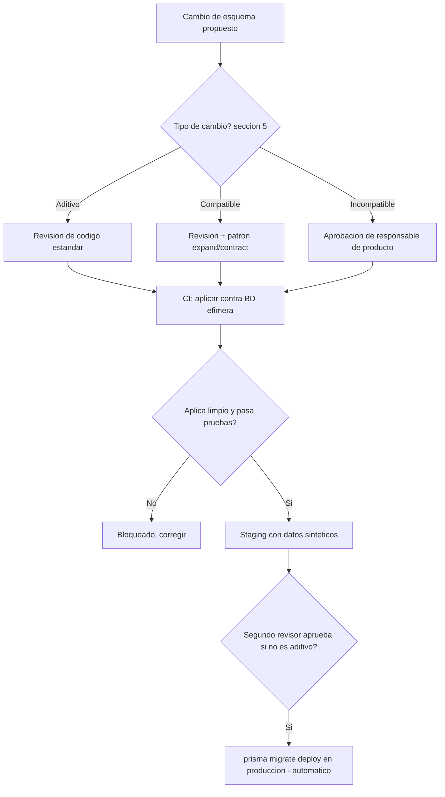
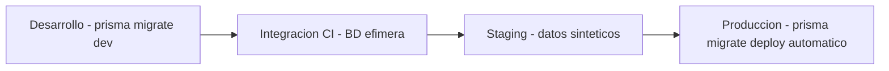
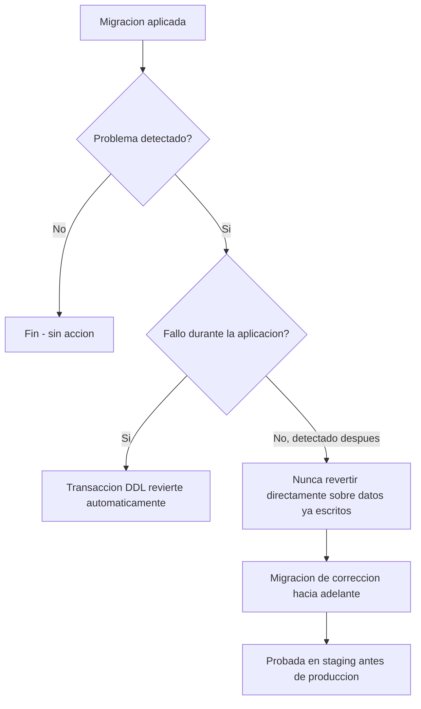
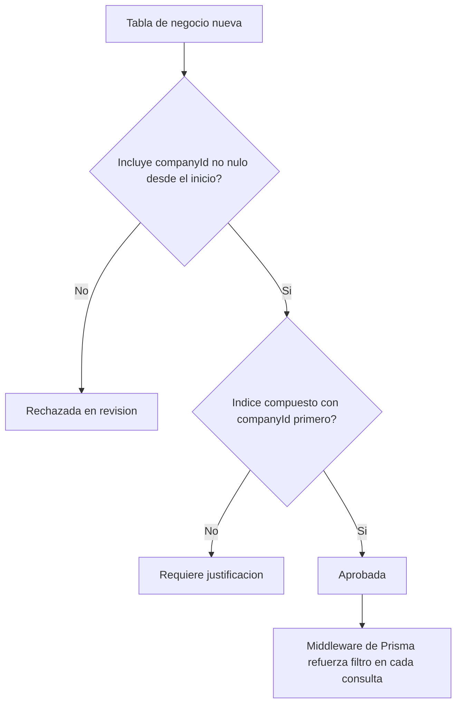
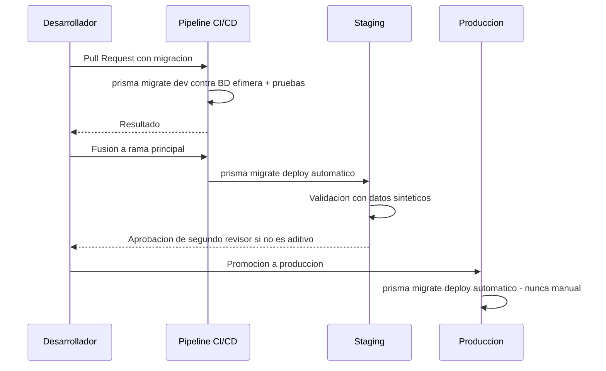

# Plan de Migración de Base de Datos — ContaIA

## Control del documento

| Campo                             | Valor                                                                                                                                                                                                                                                                                                                                                                                                                                                                                                                                                                                                                                                                                    |
| --------------------------------- | ---------------------------------------------------------------------------------------------------------------------------------------------------------------------------------------------------------------------------------------------------------------------------------------------------------------------------------------------------------------------------------------------------------------------------------------------------------------------------------------------------------------------------------------------------------------------------------------------------------------------------------------------------------------------------------------- |
| Documento                         | 21_DATABASE_MIGRATION_PLAN.md                                                                                                                                                                                                                                                                                                                                                                                                                                                                                                                                                                                                                                                            |
| Orden de trabajo                  | AWO-017                                                                                                                                                                                                                                                                                                                                                                                                                                                                                                                                                                                                                                                                                  |
| Versión                           | 1.0                                                                                                                                                                                                                                                                                                                                                                                                                                                                                                                                                                                                                                                                                      |
| **Estado**                        | **Draft v1.0**                                                                                                                                                                                                                                                                                                                                                                                                                                                                                                                                                                                                                                                                           |
| Fecha de creación                 | 2026-07-18                                                                                                                                                                                                                                                                                                                                                                                                                                                                                                                                                                                                                                                                               |
| Última actualización              | 2026-07-18                                                                                                                                                                                                                                                                                                                                                                                                                                                                                                                                                                                                                                                                               |
| Fuentes de verdad                 | `MASTER_CONTEXT.md`, `docs/00_PRODUCT_VISION.md`, `docs/01_PRD.md`, `docs/02_USER_PERSONAS.md`, `docs/04_BUSINESS_RULES.md`, `docs/05_SYSTEM_DOMAIN_MODEL.md`, `docs/06_SYSTEM_WORKFLOWS.md`, `docs/07_SOFTWARE_ARCHITECTURE.md`, `docs/08_API_DESIGN.md`, `docs/09_DATABASE_DESIGN.md`, `docs/10_AI_ARCHITECTURE.md`, `docs/11_SECURITY_ARCHITECTURE.md`, `docs/12_FRONTEND_ARCHITECTURE.md`, `docs/13_DESIGN_SYSTEM.md`, `docs/14_INFORMATION_ARCHITECTURE.md`, `docs/15_UX_FLOWS.md`, `docs/16_WIREFRAMES_SPECIFICATION.md`, `docs/17_PROTOTYPE_SPECIFICATION.md`, `docs/18_UI_SPECIFICATION.md`, `docs/19_FRONTEND_IMPLEMENTATION_PLAN.md`, `docs/20_BACKEND_IMPLEMENTATION_PLAN.md` |
| Documentos que este plan alimenta | `docs/22_INFRASTRUCTURE_IMPLEMENTATION_PLAN.md` (próximo, ver "Observaciones del Arquitecto")                                                                                                                                                                                                                                                                                                                                                                                                                                                                                                                                                                                            |

> Nota sobre numeración: la Work Order referenciaba `docs/03_BUSINESS_RULES.md`, `docs/04_SYSTEM_DOMAIN_MODEL.md` y `docs/05_SYSTEM_WORKFLOWS.md` — nombres desactualizados por renumeraciones ya corregidas; se usan las rutas reales (`docs/04`, `docs/05`, `docs/06`). `docs/21` **no presentó colisión**, segunda confirmación consecutiva de que la Política oficial de gestión de colisiones de numeración (`MASTER_CONTEXT.md` sección 27.4) sostiene la continuidad prometida.

> Este documento no rediseña el modelo lógico ya fijado en `docs/09_DATABASE_DESIGN.md` (20 entidades) ni el ORM ya elegido en `docs/20_BACKEND_IMPLEMENTATION_PLAN.md` (Prisma) — define cómo ese esquema evoluciona en el tiempo de forma segura, reversible y auditable. No es SQL ni código Prisma.

---

## Principios de la estrategia

La estrategia de migración debe ser segura, reversible, auditable, incremental, reproducible, automatizable, compatible con CI/CD y preparada para múltiples empresas — instrucción explícita de esta Work Order. **Nunca se asumen migraciones manuales en producción:** toda migración se aplica mediante el mismo pipeline automatizado que despliega el código, nunca por una persona ejecutando SQL directamente contra la base de datos productiva.

## 1. Objetivo del plan

**Propósito:** definir cómo el esquema de `docs/09_DATABASE_DESIGN.md` evoluciona de forma segura a lo largo del tiempo, sin comprometer integridad, disponibilidad ni compatibilidad.

**Alcance:** las 20 entidades de negocio y las 2 entidades técnicas ya fijadas en `docs/09_DATABASE_DESIGN.md` (sección 4), y el ciclo completo desarrollo → integración → staging → producción.

**Exclusiones:** SQL o código Prisma concreto; selección de proveedor de hosting de base de datos (`docs/22_INFRASTRUCTURE_IMPLEMENTATION_PLAN.md`, reservado); cualquier cambio al modelo lógico ya aprobado (este documento lo implementa, no lo rediseña).

**Responsabilidades:** garantizar que toda migración sea reversible o corregible hacia adelante (sección 12); sostener el aislamiento multiempresa como propiedad del esquema, no solo de la aplicación (sección 9); mantener la prohibición estructural de eliminación física de entidades definitivas (BR-INT-002, sección 8) a través de cualquier cambio futuro de esquema.

## 2. Estrategia general de migraciones

**Herramienta:** Prisma Migrate, ya elegido en `docs/20_BACKEND_IMPLEMENTATION_PLAN.md` (sección 2).

| Aspecto                        | Estrategia                                                                                                                                                                                                  |
| ------------------------------ | ----------------------------------------------------------------------------------------------------------------------------------------------------------------------------------------------------------- |
| Versionado                     | El historial de migraciones de Prisma (archivos con marca de tiempo) es la única fuente de verdad de qué versión de esquema existe en cada entorno — no se mantiene un número de versión semántico paralelo |
| Migraciones incrementales      | Cada cambio de esquema es un paso pequeño y reversible; nunca un cambio "de una sola vez" que reescriba múltiples tablas simultáneamente                                                                    |
| Orden de ejecución             | Estrictamente secuencial, validado contra la tabla de control de migraciones ya aplicadas — ninguna migración se reordena ni edita después de aplicarse en un ambiente compartido                           |
| Compatibilidad entre versiones | Una migración nunca rompe la versión de la aplicación aún desplegada durante un despliegue sin tiempo de inactividad (patrón expand/contract, sección 5)                                                    |
| Política de cambios            | Toda migración pasa por revisión de código antes de fusionarse — mismo estándar que el código de aplicación (`docs/19_FRONTEND_IMPLEMENTATION_PLAN.md`, `docs/20_BACKEND_IMPLEMENTATION_PLAN.md`)           |

Este documento no repite el modelo lógico de `docs/09_DATABASE_DESIGN.md` — cada migración debe trazarse a una entidad, relación o restricción ya definida allí; ninguna migración introduce una tabla o columna sin respaldo en ese documento salvo que primero se actualice (fuera del alcance de esta Work Order).

## 3. Convención de nomenclatura

| Elemento              | Convención                                                                                                                                                                                                          |
| --------------------- | ------------------------------------------------------------------------------------------------------------------------------------------------------------------------------------------------------------------- |
| Archivos de migración | Generados por Prisma: marca de tiempo + descripción breve en `snake_case`, en inglés técnico (coherente con `docs/08_API_DESIGN.md` sección 4: nombres técnicos en inglés, contenido de negocio en español)         |
| Versiones             | El propio timestamp de Prisma — sin esquema de versión semántica paralelo                                                                                                                                           |
| Tablas                | `snake_case` plural, correspondencia 1:1 con la entidad de `docs/09_DATABASE_DESIGN.md` (por ejemplo, `journal_entries` para Póliza, `chart_of_accounts` para Cuenta)                                               |
| Índices               | `idx_{tabla}_{columnas}`                                                                                                                                                                                            |
| Constraints           | `{tipo}_{tabla}_{columnas}` — `uq_` unicidad, `fk_` clave foránea, `ck_` restricción de verificación                                                                                                                |
| Triggers              | Reservados para casos excepcionales de integridad que la aplicación no puede garantizar bajo concurrencia — la lógica de negocio vive en la capa de Dominio (`docs/07_SOFTWARE_ARCHITECTURE.md`), nunca en triggers |
| Vistas                | Solo de solo lectura, para consultas de alto valor repetido (por ejemplo, una vista de auditoría legible) — nunca como fuente de escritura                                                                          |
| Funciones             | Solo para integridad de datos (validación de restricción); el Motor de Cálculo Contable nunca vive en la base de datos (BR-GLB-004)                                                                                 |

## 4. Ciclo de vida del esquema

```
Desarrollo → Integración (CI) → Staging → Producción
```

| Etapa            | Controles                                                                                                                                                                                                                                                                         |
| ---------------- | --------------------------------------------------------------------------------------------------------------------------------------------------------------------------------------------------------------------------------------------------------------------------------- |
| Desarrollo       | `prisma migrate dev` local, datos sintéticos (sección 6), sin control adicional — iteración libre                                                                                                                                                                                 |
| Integración (CI) | La migración se aplica automáticamente contra una base de datos efímera en cada Pull Request; el build falla si no aplica limpiamente o rompe una prueba (sección 16)                                                                                                             |
| Staging          | Aplicación automática tras fusión a la rama principal, con datos sintéticos representativos — **nunca datos reales de un cliente** (`docs/09_DATABASE_DESIGN.md` sección 17); aprobación de un segundo revisor obligatoria para cambios no aditivos (sección 5) antes de promover |
| Producción       | Aplicación automática como parte del pipeline de despliegue (`prisma migrate deploy`), **nunca ejecutada manualmente por una persona**; cambios de mayor riesgo requieren ventana de mantenimiento planificada y comunicada con anticipación (`MASTER_CONTEXT.md` sección 17)     |

## 5. Gestión de cambios

| Tipo             | Ejemplo                                                                                                              | Riesgo                 | Aprobación requerida                                                                                                                                                                                                                                               |
| ---------------- | -------------------------------------------------------------------------------------------------------------------- | ---------------------- | ------------------------------------------------------------------------------------------------------------------------------------------------------------------------------------------------------------------------------------------------------------------ |
| **Aditivo**      | Agregar tabla, columna nullable, índice nuevo                                                                        | Bajo                   | Un revisor de código (estándar)                                                                                                                                                                                                                                    |
| **Compatible**   | Agregar una restricción que los datos existentes ya cumplen, renombrado interno sin afectar la aplicación desplegada | Medio                  | Un revisor + verificación de pruebas de integración; sigue el patrón expand/contract                                                                                                                                                                               |
| **Incompatible** | Eliminar/renombrar una columna consumida, cambiar un tipo de dato, eliminar una tabla                                | Alto                   | Responsable de producto + coordinación explícita con `docs/19_FRONTEND_IMPLEMENTATION_PLAN.md` y `docs/20_BACKEND_IMPLEMENTATION_PLAN.md` (ambos consumen el mismo esquema); mismo criterio que un cambio incompatible de API (`docs/08_API_DESIGN.md` sección 18) |
| **Experimental** | Cambio detrás de una bandera de características                                                                      | Variable               | Equipo técnico; aplicable solo en desarrollo/staging, nunca en producción sin promoción explícita                                                                                                                                                                  |
| **Deprecado**    | Columna/tabla marcada obsoleta, aún presente durante un periodo de transición documentado                            | Bajo mientras coexiste | Responsable de producto define la fecha de eliminación real; nunca se elimina de inmediato                                                                                                                                                                         |

## 6. Estrategia de datos semilla (Seed)

| Elemento                  | Estrategia                                                                                                                                                                                                                                                                                                    |
| ------------------------- | ------------------------------------------------------------------------------------------------------------------------------------------------------------------------------------------------------------------------------------------------------------------------------------------------------------- |
| Datos mínimos             | Los seis Roles oficiales (`docs/04_BUSINESS_RULES.md` sección 5) y los tipos de documento permitidos (`docs/09_DATABASE_DESIGN.md` sección 17) — únicos seeds presentes también en producción                                                                                                                 |
| Catálogos                 | Ningún catálogo de cuentas contables se siembra como oficial; cualquier plantilla se marca explícitamente como no oficial, disponible solo en entornos no productivos                                                                                                                                         |
| Permisos/Roles            | El Rol es una enumeración cerrada (`docs/05_SYSTEM_DOMAIN_MODEL.md` sección 5) — no requiere semilla adicional más allá de sus seis valores                                                                                                                                                                   |
| Empresas demo             | Sintéticas, reutilizando el mismo conjunto ficticio ya definido en `docs/17_PROTOTYPE_SPECIFICATION.md` (sección 6) — "Comercializadora Ejemplo, S.A. de C.V." y "Consultoría Simulada, S.C." — para mantener consistencia narrativa entre prototipo, pruebas y desarrollo; **nunca sembradas en producción** |
| Ejercicios fiscales demo  | Un Ejercicio abierto de ejemplo por Empresa demo, con fechas relativas al entorno (no fijas), para que las pruebas no caduquen                                                                                                                                                                                |
| Configuraciones iniciales | Ninguna se siembra como válida fiscalmente — mismo límite que los catálogos de cuentas                                                                                                                                                                                                                        |

**Regla no negociable:** el proceso de seed es un script idempotente y versionado junto al código, ejecutable sin intervención manual en cualquier entorno no productivo — nunca datos reales de un cliente copiados a un entorno de prueba (`docs/09_DATABASE_DESIGN.md` sección 17, `docs/11_SECURITY_ARCHITECTURE.md` sección 25).

## 7. Integridad referencial

- **Claves foráneas:** toda relación entre entidades de la misma Empresa se refuerza con clave foránea, validando que ambas pertenecen al mismo `companyId` (BR-INT-003) — nunca solo verificado en la capa de aplicación.
- **Cascadas:** **nunca `ON DELETE CASCADE` sobre entidades definitivas** (Póliza, Cuenta, RegistroDeTrazabilidad) — consistente con BR-INT-002; cascada permitida únicamente entre entidades técnicas no confirmadas.
- **Restricciones:** unicidad compuesta indexada real para (`companyId`, `folioFiscal`) y (`companyId`, `accountCode`) — implementadas como restricciones de base de datos, no solo validación de aplicación (cierra el riesgo ya señalado en `docs/08`, `docs/09` y `docs/20`).
- **Validaciones:** restricciones `CHECK` para invariantes que la aplicación no puede garantizar bajo concurrencia — por ejemplo, `type` de MovimientoPoliza limitado a `DEBIT`/`CREDIT` a nivel de base de datos, no solo de tipo TypeScript.
- **Consistencia transaccional:** toda operación que crea más de una fila relacionada (Empresa + Membresía Administrador propietario, BR-EMP-001) ocurre en una única transacción de base de datos — nunca en escrituras separadas que puedan divergir ante un fallo parcial.

## 8. Soft Delete y Retención

**Aclaración de alcance, coherente con `docs/09_DATABASE_DESIGN.md` y `docs/20_BACKEND_IMPLEMENTATION_PLAN.md` (sección 12):** ContaIA **no aplica un patrón de eliminación lógica genérico a todas las entidades**. Solo un conjunto acotado de recursos no confirmados lo admite:

| Categoría                                                                                             | Eliminación lógica                                                                      | Restauración                               | Retención legal                                                              | Eliminación definitiva          | Archivado histórico                                                                                                                     |
| ----------------------------------------------------------------------------------------------------- | --------------------------------------------------------------------------------------- | ------------------------------------------ | ---------------------------------------------------------------------------- | ------------------------------- | --------------------------------------------------------------------------------------------------------------------------------------- |
| Entidades definitivas (Póliza `DEFINITIVE`, Cuenta, RegistroDeTrazabilidad)                           | **No aplica — nunca se eliminan, solo transicionan de estado** (BR-INT-002, BR-TRZ-002) | No aplica                                  | Indefinida                                                                   | **Nunca**                       | Sí, a almacenamiento más frío tras un umbral de antigüedad, permaneciendo consultable (`docs/09` sección 12: "archivar no es eliminar") |
| Documentos procesados/vinculados a evidencia                                                          | No aplica                                                                               | No aplica                                  | Indefinida (mientras exista evidencia que lo referencie)                     | Nunca                           | Igual que arriba                                                                                                                        |
| Recursos técnicos no confirmados (`Documento` `PENDING_UPLOAD`/`REJECTED`, Póliza `DRAFT` no enviada) | Sí — descarte explícito del Usuario                                                     | Sí, mientras no se confirme la eliminación | Corta (ventana operativa)                                                    | Sí, tras confirmación explícita | No aplica                                                                                                                               |
| Job, ClaveDeIdempotencia (infraestructura técnica)                                                    | Sí, por expiración automática                                                           | No aplica                                  | Ventana técnica corta (`docs/09` sección 16, pendiente de validación exacta) | Sí, automática al expirar       | No aplica                                                                                                                               |
| Membresía desactivada                                                                                 | Sí — `status = inactive`, nunca se elimina la fila (BR-USR-003)                         | Sí, vía reactivación o nueva invitación    | Indefinida (preserva quién tuvo acceso y cuándo)                             | Nunca                           | No aplica                                                                                                                               |

**Regla no negociable:** ninguna migración ni proceso de mantenimiento introduce una operación de eliminación física sobre Póliza `DEFINITIVE`, Cuenta, RegistroDeTrazabilidad o Documento vinculado a evidencia — a nivel de esquema, estas tablas nunca exponen un camino de eliminación física utilizable por la capa de aplicación (mismo principio de "ausencia estructural" ya aplicado a la escritura de IA en `docs/09_DATABASE_DESIGN.md` sección 11, extendido aquí a la eliminación).

## 9. Estrategia Multi-Tenant

**Reconciliación de terminología:** el "tenant_id" genérico de esta Work Order es, en ContaIA, el campo `companyId` ya definido en `docs/09_DATABASE_DESIGN.md` (sección 3) — no se introduce un concepto paralelo.

| Aspecto                   | Estrategia                                                                                                                                                                                                                                      |
| ------------------------- | ----------------------------------------------------------------------------------------------------------------------------------------------------------------------------------------------------------------------------------------------- |
| Aislamiento de datos      | Fila por Empresa (`companyId` obligatorio en toda tabla de negocio) — ya fijado en `docs/09`; este documento define cómo se mantiene íntegro a través de migraciones                                                                            |
| `companyId`               | Nunca nullable en una tabla de negocio; toda tabla nueva lo incluye desde su primera versión, nunca agregado después                                                                                                                            |
| Consultas                 | Reforzadas por el middleware de Prisma ya especificado en `docs/20_BACKEND_IMPLEMENTATION_PLAN.md` (sección 12); toda migración de columna nueva se revisa contra la pregunta "¿podría filtrar datos entre Empresas si se consulta sin filtro?" |
| Índices                   | Todo índice sobre una tabla de negocio incluye `companyId` como primer componente cuando la consulta típica ya lo filtra                                                                                                                        |
| Seguridad                 | Row-Level Security de PostgreSQL evaluado como capa adicional futura (sección 17, Fase Empresarial), no requisito del MVP — el aislamiento ya cuenta con dos capas (aplicación + índice/constraint)                                             |
| Migraciones entre tenants | **No existen** — ContaIA no mueve datos de una Empresa a otra (BR-GLB-001); la baja de una Empresa dentro de una Organización (CE-01 de `docs/04_BUSINESS_RULES.md`) no mueve datos, solo cambia visibilidad de acceso                          |

## 10. Rendimiento

| Técnica                 | Estrategia                                                                                                                                                                                              |
| ----------------------- | ------------------------------------------------------------------------------------------------------------------------------------------------------------------------------------------------------- |
| Índices                 | Todo índice nuevo se acompaña de un análisis de su costo de escritura antes de aprobarse — un índice mal elegido degrada inserciones de Pólizas en picos de cierre mensual (`docs/02_USER_PERSONAS.md`) |
| Particionamiento futuro | Por Empresa o Ejercicio para Póliza, MovimientoPoliza y RegistroDeTrazabilidad, cuando el volumen lo justifique (`docs/09` sección 12) — no se implementa en el MVP                                     |
| Optimización            | Revisión periódica de consultas lentas vía `EXPLAIN ANALYZE`, no automatizada en el MVP                                                                                                                 |
| Estadísticas            | `ANALYZE` automático de PostgreSQL habilitado por defecto                                                                                                                                               |
| Mantenimiento / VACUUM  | Autovacuum habilitado por defecto; revisión manual solo si el crecimiento append-only de RegistroDeTrazabilidad genera degradación detectable                                                           |
| Reindex                 | Tarea operativa de mantenimiento programado, no una migración — ejecutada por el equipo de infraestructura (`docs/22_INFRASTRUCTURE_IMPLEMENTATION_PLAN.md`)                                            |

## 11. Versionado del esquema

Esta Work Order agrupa dos conceptos que ContaIA ya trata por separado — se distinguen aquí explícitamente:

- **Versionado del esquema de base de datos** (este documento): el historial de migraciones de Prisma es la única fuente de verdad de qué versión de esquema existe en cada entorno.
- **Versionado de datos de negocio** (ya fijado en `docs/09_DATABASE_DESIGN.md` sección 8): Catálogo de Cuentas vía `CuentaHistorial`, fórmulas de cálculo vía referencia de versión por resultado, `FuenteConocimiento` vía `version`/`validFrom`/`validTo` — no se repite aquí, solo se aclara que es un concepto distinto.

**Compatibilidad:** ninguna versión de la aplicación requiere una versión de esquema más nueva que la ya desplegada en producción, gracias al patrón expand/contract (sección 5). **Soporte entre versiones:** el esquema soporta la versión de aplicación desplegada y la inmediatamente anterior durante toda ventana de despliegue gradual. **Ventanas de actualización:** los cambios incompatibles se coordinan en una ventana planificada, comunicada con anticipación. **Política de rollback:** ver sección 12.

## 12. Rollback

**Distinción explícita:** esta sección trata el rollback de una **migración de esquema** (operación técnica) — no la reversión de una **transacción de negocio ya confirmada**, que nunca se revierte por edición directa (BR-POL-004: siempre mediante Póliza de ajuste).

| Aspecto                | Estrategia                                                                                                                                                                                                                                                                                                                 |
| ---------------------- | -------------------------------------------------------------------------------------------------------------------------------------------------------------------------------------------------------------------------------------------------------------------------------------------------------------------------- |
| Fallos de migración    | Ejecutada dentro de una transacción cuando el motor lo permite (PostgreSQL soporta DDL transaccional para la mayoría de operaciones) — un fallo a medio camino revierte automáticamente, sin dejar el esquema en estado intermedio                                                                                         |
| Recuperación           | Si una migración ya aplicada causa un problema detectado después, la corrección es una migración **hacia adelante** — nunca una reversión directa sobre una base de datos con datos ya escritos bajo el nuevo esquema (mismo principio de "corrección hacia adelante, no reescritura" de BR-POL-004, extendido al esquema) |
| Validación             | Toda migración se prueba primero contra staging con datos representativos (sección 4) antes de producción                                                                                                                                                                                                                  |
| Puntos de restauración | Backup obligatorio previo a toda migración de riesgo alto (sección 5)                                                                                                                                                                                                                                                      |
| Continuidad operativa  | Migraciones aditivas y compatibles no requieren ventana de mantenimiento; solo las incompatibles pueden requerirla, comunicada con anticipación                                                                                                                                                                            |

## 13. Backup y Recuperación

Relación explícita con `docs/25_DEVOPS.md` (aún marcador de estructura vacío) y `docs/22_INFRASTRUCTURE_IMPLEMENTATION_PLAN.md` (próximo) — este documento no fija la infraestructura concreta, solo los requisitos que debe cumplir para la base de datos:

| Aspecto            | Requisito                                                                                                                                                                                                                                                             |
| ------------------ | --------------------------------------------------------------------------------------------------------------------------------------------------------------------------------------------------------------------------------------------------------------------- |
| Frecuencia         | Continua (WAL / point-in-time recovery) más respaldo completo periódico — frecuencia exacta `Estado: Propuesta pendiente de validación`, ya señalado en `docs/09_DATABASE_DESIGN.md` sección 14 y `docs/11_SECURITY_ARCHITECTURE.md` sección 34                       |
| Tipos de respaldo  | Completo + incremental/WAL continuo, para permitir recuperación a un punto en el tiempo                                                                                                                                                                               |
| Restauración       | Probada, no solo ejecutada — ver pruebas periódicas                                                                                                                                                                                                                   |
| Pruebas periódicas | Ejercicio de restauración real (no solo verificación de existencia del archivo) en entorno aislado; periodicidad reservada a `docs/22_INFRASTRUCTURE_IMPLEMENTATION_PLAN.md`                                                                                          |
| RPO                | El Registro de Trazabilidad exige el RPO más estricto del sistema — es evidencia legal/operativa irreproducible si se pierde (`docs/11_SECURITY_ARCHITECTURE.md` sección 33); el RPO general de la base de datos hereda ese mismo requisito, sin fijar aquí un número |
| RTO                | No se fija un número en este documento (mismo principio de no inventar cifras sin base real ya aplicado en `docs/08` y `docs/11`) — responsabilidad de `docs/22_INFRASTRUCTURE_IMPLEMENTATION_PLAN.md`                                                                |

## 14. Seguridad

| Aspecto                       | Estrategia                                                                                                                                                                                      |
| ----------------------------- | ----------------------------------------------------------------------------------------------------------------------------------------------------------------------------------------------- |
| Permisos sobre base de datos  | Mínimo privilegio (BR-PERM-001) aplicado también al rol de base de datos — el usuario de aplicación tiene lectura/escritura sobre tablas de negocio, nunca permisos de administración del motor |
| Acceso por ambientes          | Credenciales distintas por entorno, nunca compartidas (`docs/11_SECURITY_ARCHITECTURE.md` sección 15)                                                                                           |
| Cifrado                       | En tránsito (TLS sin excepción) y en reposo, más cifrado de columna para datos "Altamente sensibles" — ya fijado en `docs/09`/`docs/11`, no se repite aquí                                      |
| Auditoría                     | Toda migración aplicada queda registrada con autor, fecha y resultado — distinto del Registro de Trazabilidad de negocio, con el mismo estándar de inmutabilidad                                |
| Protección de datos sensibles | Ningún dato de producción se usa en desarrollo o pruebas, ni siquiera anonimizado, salvo excepción explícita documentada y aprobada (`docs/09_DATABASE_DESIGN.md` sección 17)                   |

## 15. Observabilidad

| Flujo                    | Estrategia                                                                                                                                                                      |
| ------------------------ | ------------------------------------------------------------------------------------------------------------------------------------------------------------------------------- |
| Monitoreo de migraciones | Cada migración aplicada emite un evento observable (éxito/fallo, duración) hacia OpenTelemetry (`docs/20_BACKEND_IMPLEMENTATION_PLAN.md` sección 11)                            |
| Métricas                 | Duración de migración, tamaño de tabla antes/después, bloqueos generados                                                                                                        |
| Logs                     | Registro técnico de cada paso, separado del Registro de Trazabilidad de negocio (mismo principio de separación de flujos de `docs/07_SOFTWARE_ARCHITECTURE.md` sección 11)      |
| Alertas                  | Una migración que excede un umbral de duración o genera bloqueos prolongados dispara alerta técnica — umbral exacto reservado a `docs/22_INFRASTRUCTURE_IMPLEMENTATION_PLAN.md` |
| Auditoría de cambios     | El historial de migraciones de Prisma es la fuente autoritativa de qué cambió y cuándo a nivel de esquema                                                                       |

## 16. Testing de migraciones

| Tipo           | Estrategia                                                                                                                                                                       |
| -------------- | -------------------------------------------------------------------------------------------------------------------------------------------------------------------------------- |
| Unitarias      | Aplicable a cualquier función/restricción personalizada introducida, no a la migración declarativa en sí                                                                         |
| Integración    | Cada migración se aplica contra una base de datos efímera (Testcontainers, `docs/20_BACKEND_IMPLEMENTATION_PLAN.md` sección 13) poblada con datos sintéticos antes de fusionarse |
| Compatibilidad | Se verifica que la versión de aplicación desplegada sigue funcionando contra el esquema post-migración (parte del patrón expand/contract)                                        |
| Rendimiento    | Para migraciones sobre tablas grandes (Póliza, RegistroDeTrazabilidad), se mide el tiempo de aplicación contra volumen representativo antes de programar producción              |
| Rollback       | Se prueba que la migración de corrección hacia adelante (sección 12) resuelve el problema sin duplicar ni perder datos                                                           |
| Recuperación   | Se prueba periódicamente la restauración completa desde backup (sección 13), no solo la migración                                                                                |

## 17. Roadmap de evolución

| Fase            | Cambios esperados                                                                                                                                                                                                                                                                                                     | Riesgos                                                                                                                      | Criterios de aprobación                                                                   |
| --------------- | --------------------------------------------------------------------------------------------------------------------------------------------------------------------------------------------------------------------------------------------------------------------------------------------------------------------- | ---------------------------------------------------------------------------------------------------------------------------- | ----------------------------------------------------------------------------------------- |
| **MVP**         | Esquema completo de las 20 entidades de `docs/09_DATABASE_DESIGN.md`, sin particionamiento ni Row-Level Security                                                                                                                                                                                                      | Ninguno mayor si se sigue expand/contract desde el primer despliegue                                                         | Revisión de código estándar (sección 5) por migración                                     |
| **Crecimiento** | Particionamiento de Póliza/MovimientoPoliza/RegistroDeTrazabilidad por Empresa o Ejercicio (`docs/09` sección 12); posible tabla de resultados materializados para Balanza/Estados Financieros; réplicas de lectura para Reportes/Auditoría                                                                           | Particionar una tabla con datos existentes es una migración de alto riesgo — ventana planificada y backup previo obligatorio | Responsable de producto + validación de rendimiento en staging con volumen representativo |
| **Empresarial** | Evaluación de Row-Level Security como capa adicional; posible almacén analítico separado para Reportes avanzados sin comprometer la fuente de verdad transaccional (BR-GLB-004); definición formal del flujo de reapertura de Ejercicio (riesgo heredado de `docs/06_SYSTEM_WORKFLOWS.md`), si el negocio lo requiere | Cualquier cambio que toque el modelo de aislamiento multiempresa exige el mismo rigor que una decisión arquitectónica        | Decisión de responsable de producto + revisión de seguridad                               |

## 18. Riesgos técnicos

- **Pérdida de datos:** mitigada por la prohibición estructural de eliminación física sobre entidades definitivas (sección 8) y por backups probados (sección 13); el riesgo residual es humano (una migración mal revisada con una eliminación accidental), mitigado por revisión de código obligatoria.
- **Corrupción:** mitigada por transacciones DDL (sección 12) y restricciones de integridad reforzadas a nivel de base de datos (sección 7).
- **Bloqueos:** una migración sobre una tabla grande sin estrategia de creación de índice concurrente puede bloquear escrituras durante un cierre mensual — riesgo de alta probabilidad dado el patrón de uso ya señalado en `docs/02_USER_PERSONAS.md`.
- **Incompatibilidades:** mitigadas por expand/contract (sección 5); el riesgo residual es que un equipo lo omita bajo presión de tiempo, mismo riesgo de disciplina ya señalado en `docs/07`, `docs/19` y `docs/20`.
- **Concurrencia:** el bloqueo optimista ya resuelto (`docs/08_API_DESIGN.md` sección 13, `docs/20_BACKEND_IMPLEMENTATION_PLAN.md` sección 5) exige que ninguna migración elimine el campo `version` de Póliza/CasoDeRevisión/Membresía sin una migración de compatibilidad previa.
- **Crecimiento del volumen:** RegistroDeTrazabilidad y Póliza crecen indefinidamente por diseño (BR-INT-002, BR-TRZ-002) — riesgo heredado y reiterado en `docs/07`, `docs/09` y `docs/20`; trasladado aquí a la Fase Crecimiento (sección 17) como primer candidato de particionamiento.

## 19. Diagramas Mermaid

### 19.1 Flujo de migraciones



### 19.2 Ciclo de vida del esquema



### 19.3 Proceso de rollback



### 19.4 Estrategia multi-tenant



### 19.5 Pipeline de despliegue de migraciones



## 20. Matriz de migraciones

| Tipo de cambio | Impacto                            | Complejidad | Riesgo                           | Rollback                                                                               | Aprobación requerida                                    |
| -------------- | ---------------------------------- | ----------- | -------------------------------- | -------------------------------------------------------------------------------------- | ------------------------------------------------------- |
| Aditivo        | Bajo                               | Baja        | Bajo                             | Automático (transacción DDL)                                                           | Un revisor de código                                    |
| Compatible     | Medio                              | Media       | Medio                            | Migración de corrección hacia adelante si aplica                                       | Un revisor + pruebas de integración                     |
| Incompatible   | Alto                               | Alta        | Alto                             | Migración de corrección hacia adelante, ventana planificada, backup previo obligatorio | Responsable de producto + coordinación frontend/backend |
| Experimental   | Variable (acotado a no producción) | Media       | Bajo (sin exposición productiva) | Descartable sin impacto (nunca en producción)                                          | Equipo técnico                                          |
| Deprecado      | Bajo mientras coexiste             | Baja        | Bajo                             | No aplica (eliminación real programada, no inmediata)                                  | Responsable de producto define fecha de eliminación     |

## 21. Definition of Done

Una migración se considera terminada solo cuando:

- **Validada:** aplicó limpiamente contra CI y staging con datos representativos.
- **Documentada:** su propósito y su clasificación (sección 5) están claros en la revisión de código, trazables a la entidad de `docs/09_DATABASE_DESIGN.md` que modifica.
- **Probada:** cuenta con al menos una prueba de integración que confirma el comportamiento esperado (sección 16).
- **Tiene rollback:** cuenta con una estrategia de corrección hacia adelante documentada si algo sale mal (sección 12) — no necesariamente una reversión automática, pero sí un plan.
- **Mantiene compatibilidad:** la versión de aplicación actualmente desplegada sigue funcionando sin cambios durante la ventana de transición (patrón expand/contract).
- **Conserva integridad:** ninguna restricción de integridad referencial, unicidad o aislamiento multiempresa se debilita como efecto secundario.

## 22. MVP

| Clasificación                    | Migraciones                                                                                                                                                                                                                                                                                                                                                              |
| -------------------------------- | ------------------------------------------------------------------------------------------------------------------------------------------------------------------------------------------------------------------------------------------------------------------------------------------------------------------------------------------------------------------------ |
| **Críticas para el lanzamiento** | Las 20 entidades completas de `docs/09_DATABASE_DESIGN.md`; seeds de los 6 Roles oficiales y tipos de documento permitidos; índices únicos compuestos reales (`companyId`+`folioFiscal`, `companyId`+`accountCode`); campos `version` para bloqueo optimista en Póliza/CasoDeRevisión/Membresía — sin estas, el MVP no cumple sus propias reglas de negocio ya aprobadas |
| **Diferibles**                   | Particionamiento (Fase Crecimiento), Row-Level Security (Fase Empresarial), tabla de resultados materializados, vistas de auditoría legible dedicadas — todo lo asociado a las fases posteriores del roadmap (sección 17)                                                                                                                                                |

## 23. Recomendaciones para Infrastructure Implementation Plan

- Fijar frecuencia de backup, valores numéricos de RPO/RTO, umbrales de alerta de migración (sección 15) y proveedor de hosting de PostgreSQL — todos dejados abiertos intencionalmente en este documento.
- Confirmar el mecanismo de ejecución automática de `prisma migrate deploy` dentro del pipeline de CI/CD, cerrando el principio explícito de esta Work Order: nunca migraciones manuales en producción.
- Definir la política operativa de ventanas de mantenimiento para migraciones incompatibles (secciones 5 y 11).
- Definir la política de retención y el mecanismo concreto de archivado histórico "a almacenamiento más frío" ya mencionado en `docs/09_DATABASE_DESIGN.md` (sección 12) y confirmado aquí (sección 8).

Este documento no ejecuta ninguna migración — entrega la estrategia completa para que `docs/22_INFRASTRUCTURE_IMPLEMENTATION_PLAN.md` defina el entorno donde esa estrategia se ejecuta.

---

## Historial de cambios

| Fecha      | Cambio                                                                                                                                                                                                                                                                                                                                                                                                                                                                                                                                                                                                                                                                                                                                                                                                                                                                                                                                                                                                                                                                                                                                              | Responsable                        |
| ---------- | --------------------------------------------------------------------------------------------------------------------------------------------------------------------------------------------------------------------------------------------------------------------------------------------------------------------------------------------------------------------------------------------------------------------------------------------------------------------------------------------------------------------------------------------------------------------------------------------------------------------------------------------------------------------------------------------------------------------------------------------------------------------------------------------------------------------------------------------------------------------------------------------------------------------------------------------------------------------------------------------------------------------------------------------------------------------------------------------------------------------------------------------------- | ---------------------------------- |
| 2026-07-18 | Creación de la primera versión completa de `docs/21_DATABASE_MIGRATION_PLAN.md` bajo AWO-017: estrategia general de migraciones con Prisma Migrate, convención de nomenclatura, ciclo de vida del esquema en 4 etapas, clasificación de 5 tipos de cambio con su aprobación requerida, estrategia de seeds explícitamente sintética y nunca productiva, integridad referencial, aclaración explícita de que ContaIA no usa soft-delete genérico (solo para recursos no confirmados, nunca para entidades definitivas), reconciliación de "tenant_id" con el `companyId` ya definido, rendimiento, distinción entre versionado de esquema y versionado de datos de negocio ya existente, rollback como corrección hacia adelante (nunca reversión directa sobre datos ya escritos), backup y recuperación relacionados con RPO del Registro de Trazabilidad, seguridad, observabilidad, testing de migraciones, roadmap de 3 fases (MVP/Crecimiento/Empresarial), riesgos técnicos, 5 diagramas Mermaid, matriz de migraciones, Definition of Done, clasificación MVP y recomendaciones para Infrastructure Implementation Plan. Estado: Draft v1.0. | Responsable de producto de ContaIA |

---

## Observaciones del Arquitecto

**Decisiones tomadas:**

- Se aclaró explícitamente, en la sección 8, que ContaIA **no adopta un patrón de eliminación lógica genérico** — la Work Order pedía documentar "Soft Delete y Retención" de forma general, pero aplicar eso sin matices habría contradicho BR-INT-002 y BR-TRZ-002 (ya aprobados, sin excepción, en `docs/04_BUSINESS_RULES.md`). Se resolvió con una tabla que distingue con precisión qué categorías de recursos admiten eliminación lógica (solo las no confirmadas/técnicas) y cuáles nunca la admiten (entidades definitivas).
- Se reconcilió el "tenant_id" genérico de la Work Order con el `companyId` ya definido en `docs/09_DATABASE_DESIGN.md`, evitando introducir un concepto de aislamiento paralelo al ya aprobado.
- Se distinguieron explícitamente dos conceptos que la Work Order agrupaba bajo "Versionado del esquema" (sección 11): el versionado técnico de migraciones (nuevo, definido aquí) y el versionado de datos de negocio (ya existente en `docs/09_DATABASE_DESIGN.md` sección 8) — evita que un lector futuro busque una redefinición del segundo dentro de este documento.
- Se distinguió con la misma disciplina el "Rollback" de una migración de esquema (sección 12, técnico) de la reversión de una transacción de negocio (que nunca ocurre por edición directa, BR-POL-004) — son dos conceptos que un lector sin este matiz podría confundir peligrosamente.
- Los datos semilla de "Empresas demo" se anclaron explícitamente al mismo conjunto ficticio ya usado en `docs/17_PROTOTYPE_SPECIFICATION.md` (sección 6), en vez de inventar un tercer conjunto de datos de ejemplo para el proyecto.

**Riesgos:** ver sección 18 completa; el de mayor probabilidad de materializarse es el bloqueo de escrituras por una migración de índice mal planificada durante un pico de cierre mensual, dado el patrón de uso ya documentado en `docs/02_USER_PERSONAS.md`.

**Prioridades:** ver sección 22 — las migraciones que sostienen las restricciones de integridad ya exigidas por las reglas de negocio (deduplicación de CFDI, bloqueo optimista) son críticas para el lanzamiento, no negociables ni diferibles.

**Mejoras futuras (fuera del alcance de esta fase):**

- Evaluar Row-Level Security de PostgreSQL como capa adicional de aislamiento multiempresa una vez que el modelo de dos capas actuales (aplicación + índice/constraint) muestre limitaciones reales.
- Definir el mecanismo concreto de archivado histórico ("almacenamiento más frío") cuando el volumen de RegistroDeTrazabilidad lo justifique.
- Formalizar el flujo de reapertura de Ejercicio (riesgo heredado desde `docs/06_SYSTEM_WORKFLOWS.md`) si el negocio lo requiere, evaluando su impacto de esquema en ese momento.

**Inconsistencias encontradas:** ninguna contradicción con las fuentes de verdad aprobadas.

**Dependencias para AWO-018 (`docs/22_INFRASTRUCTURE_IMPLEMENTATION_PLAN.md`):**

- Ver sección 23 completa.
- `docs/21` no presentó colisión de numeración — segunda confirmación consecutiva de que la Política oficial (`MASTER_CONTEXT.md` sección 27.4) sostiene la continuidad; se espera lo mismo para `docs/22`.
- `docs/00_DOCUMENTATION_INDEX.md` y `docs/00_DOCUMENTATION_GUIDE.md` siguen sin existir; con veintiún documentos técnicos ya interconectados, la creación de un índice mantenido activamente sigue siendo la mejora estructural pendiente de mayor impacto para el proyecto.
