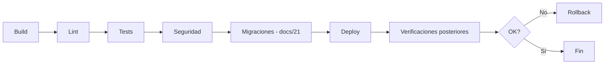
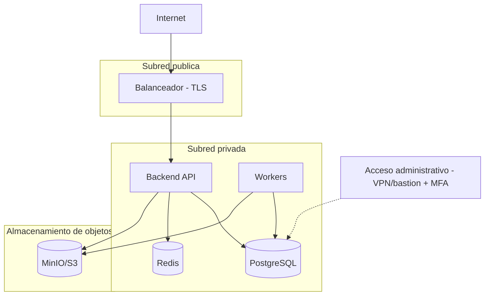
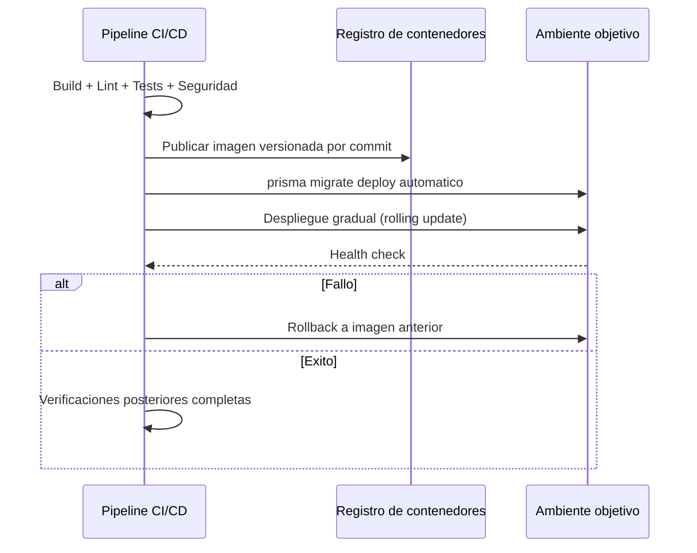
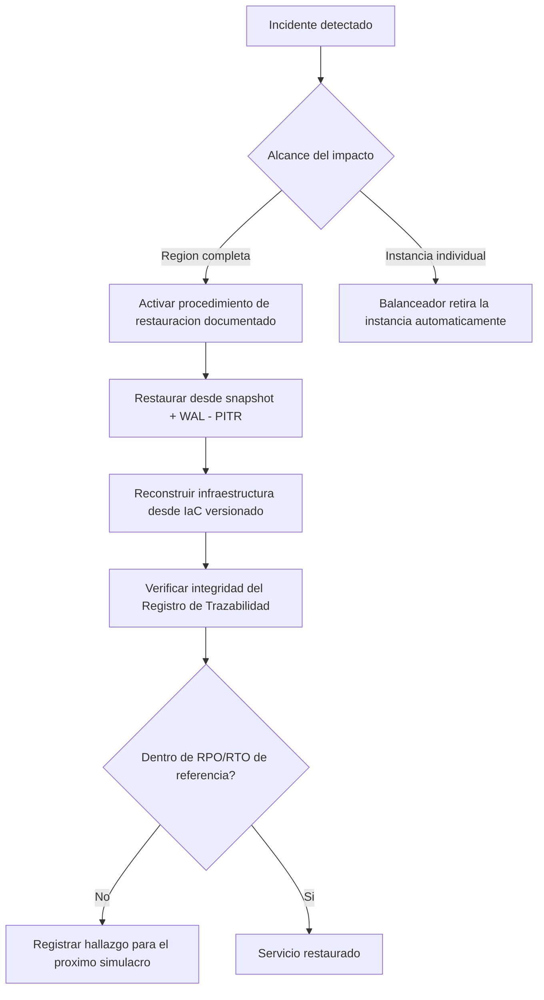

# Plan de Implementación de Infraestructura — ContaIA

## Control del documento

| Campo                             | Valor                                                                                                                                                                                                                                                                                                                                                                                                                                                                                                                                                                                                                                                                                                                          |
| --------------------------------- | ------------------------------------------------------------------------------------------------------------------------------------------------------------------------------------------------------------------------------------------------------------------------------------------------------------------------------------------------------------------------------------------------------------------------------------------------------------------------------------------------------------------------------------------------------------------------------------------------------------------------------------------------------------------------------------------------------------------------------ |
| Documento                         | 22_INFRASTRUCTURE_IMPLEMENTATION_PLAN.md                                                                                                                                                                                                                                                                                                                                                                                                                                                                                                                                                                                                                                                                                       |
| Orden de trabajo                  | AWO-018                                                                                                                                                                                                                                                                                                                                                                                                                                                                                                                                                                                                                                                                                                                        |
| Versión                           | 1.0                                                                                                                                                                                                                                                                                                                                                                                                                                                                                                                                                                                                                                                                                                                            |
| **Estado**                        | **Draft v1.0**                                                                                                                                                                                                                                                                                                                                                                                                                                                                                                                                                                                                                                                                                                                 |
| Fecha de creación                 | 2026-07-18                                                                                                                                                                                                                                                                                                                                                                                                                                                                                                                                                                                                                                                                                                                     |
| Última actualización              | 2026-07-18                                                                                                                                                                                                                                                                                                                                                                                                                                                                                                                                                                                                                                                                                                                     |
| Fuentes de verdad                 | `MASTER_CONTEXT.md`, `docs/00_PRODUCT_VISION.md`, `docs/01_PRD.md`, `docs/02_USER_PERSONAS.md`, `docs/04_BUSINESS_RULES.md`, `docs/05_SYSTEM_DOMAIN_MODEL.md`, `docs/06_SYSTEM_WORKFLOWS.md`, `docs/07_SOFTWARE_ARCHITECTURE.md`, `docs/08_API_DESIGN.md`, `docs/09_DATABASE_DESIGN.md`, `docs/10_AI_ARCHITECTURE.md`, `docs/11_SECURITY_ARCHITECTURE.md`, `docs/12_FRONTEND_ARCHITECTURE.md`, `docs/13_DESIGN_SYSTEM.md`, `docs/14_INFORMATION_ARCHITECTURE.md`, `docs/15_UX_FLOWS.md`, `docs/16_WIREFRAMES_SPECIFICATION.md`, `docs/17_PROTOTYPE_SPECIFICATION.md`, `docs/18_UI_SPECIFICATION.md`, `docs/19_FRONTEND_IMPLEMENTATION_PLAN.md`, `docs/20_BACKEND_IMPLEMENTATION_PLAN.md`, `docs/21_DATABASE_MIGRATION_PLAN.md` |
| Documentos que este plan alimenta | `docs/23_TESTING_AND_QA_PLAN.md` (próximo, ver "Observaciones del Arquitecto")                                                                                                                                                                                                                                                                                                                                                                                                                                                                                                                                                                                                                                                 |

> Nota sobre numeración: la Work Order referenciaba `docs/03_BUSINESS_RULES.md`, `docs/04_SYSTEM_DOMAIN_MODEL.md` y `docs/05_SYSTEM_WORKFLOWS.md` — nombres desactualizados por renumeraciones ya corregidas; se usan las rutas reales (`docs/04`, `docs/05`, `docs/06`). `docs/22` **no presentó colisión**, tercera confirmación consecutiva de la Política oficial de gestión de colisiones de numeración (`MASTER_CONTEXT.md` sección 27.4).

> Este documento cierra varios de los mecanismos que `docs/08_API_DESIGN.md`, `docs/09_DATABASE_DESIGN.md`, `docs/11_SECURITY_ARCHITECTURE.md` y `docs/21_DATABASE_MIGRATION_PLAN.md` dejaron explícitamente `Estado: Propuesta pendiente de validación` y remitieron aquí (RPO/RTO, frecuencia de backup, umbrales de rate limiting, tamaño máximo de archivo, ventanas de mantenimiento). No es un script de infraestructura ni un archivo YAML — es la referencia de diseño que ese código deberá implementar.

---

## Principios de la infraestructura

La infraestructura debe ser escalable, segura, reproducible, automatizable, observable, resiliente, preparada para recuperación ante desastres, optimizada en costos y **portable entre proveedores cloud** — instrucción explícita de esta Work Order, coherente con la restricción ya fijada en `docs/07_SOFTWARE_ARCHITECTURE.md` (sección 3: "no se eligen proveedores cloud ni herramientas específicas") y con el principio ya aplicado a proveedores de IA en `MASTER_CONTEXT.md` (sección 17: "evitar dependencia absoluta de un solo proveedor"), extendido aquí a toda la infraestructura.

## 1. Objetivo del plan

**Propósito:** definir cómo se despliega, opera, escala y mantiene ContaIA de forma segura y eficiente, desde el MVP hasta una plataforma empresarial de alta disponibilidad.

**Alcance:** los cinco ambientes oficiales (sección 3), la arquitectura lógica completa (sección 2), y el roadmap de infraestructura desde el MVP hasta la fase empresarial (sección 16).

**Exclusiones:** scripts de infraestructura, archivos YAML, selección de un proveedor cloud específico (se documentan requisitos y arquitectura lógica portable, no un proveedor); precios exactos (sección 15); implementación de código de aplicación (ya cubierta en `docs/19_FRONTEND_IMPLEMENTATION_PLAN.md` y `docs/20_BACKEND_IMPLEMENTATION_PLAN.md`).

**Dependencias:** este plan implementa, sin rediseñarlas, las decisiones ya tomadas en `docs/07_SOFTWARE_ARCHITECTURE.md` (monolito modular, AD-01), `docs/20_BACKEND_IMPLEMENTATION_PLAN.md` (stack tecnológico) y `docs/21_DATABASE_MIGRATION_PLAN.md` (estrategia de migraciones automatizadas).

## 2. Arquitectura de infraestructura

| Elemento               | Responsabilidad                                                                                                                                                                                                                                                                                          |
| ---------------------- | -------------------------------------------------------------------------------------------------------------------------------------------------------------------------------------------------------------------------------------------------------------------------------------------------------- |
| **Frontend**           | Aplicación Next.js (`docs/19_FRONTEND_IMPLEMENTATION_PLAN.md`) servida como proceso Node.js contenedorizado (renderizado híbrido) — no es un sitio estático puro, dado que usa rutas protegidas server-side                                                                                              |
| **Backend**            | API NestJS (`docs/20_BACKEND_IMPLEMENTATION_PLAN.md`) contenedorizada, más un pool de workers separado para las colas de BullMQ (sección 6 de ese documento) — dos tipos de proceso, escalados de forma independiente                                                                                    |
| **Base de datos**      | PostgreSQL gestionado (instancia primaria + réplica de lectura en fases posteriores, sección 11), con la extensión `pgvector` habilitada (`docs/20_BACKEND_IMPLEMENTATION_PLAN.md` sección 7)                                                                                                            |
| **Redis**              | Backend de BullMQ, caché de lectura de corta duración, almacén de límites de tasa (rate limiting) — instancia gestionada, con persistencia habilitada solo para las colas, no para la caché                                                                                                              |
| **MinIO / S3**         | Almacenamiento de objetos para Documentos/CFDI (sección 9); compatible con la API S3 para preservar portabilidad entre proveedores                                                                                                                                                                       |
| **IA**                 | Nunca se contacta directamente desde el Frontend ni desde una red pública — toda llamada pasa por la capa de abstracción del Backend (AD-05 de `docs/07_SOFTWARE_ARCHITECTURE.md`), con salida de red controlada por firewall (sección 8)                                                                |
| **Servicios externos** | Proveedor(es) de IA detrás de la capa de abstracción (sección 7 de `docs/20_BACKEND_IMPLEMENTATION_PLAN.md`) — sin dependencia de un único proveedor                                                                                                                                                     |
| **PAC**                | **Punto de conexión reservado, no activo en el MVP** (BR-CFDI-001, BR-GLB-005, `docs/20_BACKEND_IMPLEMENTATION_PLAN.md` sección 8) — ninguna regla de salida de red se habilita hasta que exista una integración aprobada en la Etapa 4 de `MASTER_CONTEXT.md`                                           |
| **SAT**                | **Mismo tratamiento que PAC** — sin conexión activa en el MVP; el SAT nunca se presenta como una API pública general disponible para ContaIA (límite explícito de `MASTER_CONTEXT.md`)                                                                                                                   |
| **CDN**                | Reservado exclusivamente para activos estáticos del Frontend (JS, CSS, fuentes, iconografía) — **nunca para contenido dinámico ni respuestas de API**, dado que toda respuesta de negocio depende de autorización por Empresa activa (BR-GLB-001) y no debe cachearse fuera del control de la aplicación |
| **Balanceadores**      | Distribuyen tráfico HTTP(S) entre instancias del proceso API; terminan TLS (sección 8); verifican salud de instancia antes de enrutar                                                                                                                                                                    |
| **DNS**                | Resolución de dominio hacia el balanceador (Frontend/API) — sin fijar registrador ni proveedor concreto                                                                                                                                                                                                  |

```mermaid
flowchart TB
    DNS[DNS] --> CDN[CDN - solo activos estaticos]
    DNS --> LB[Balanceador - TLS]
    CDN --> FE[Frontend Next.js]
    LB --> FE
    LB --> API[Backend NestJS - API]
    API --> WORKERS[Pool de workers BullMQ]
    API --> DB[(PostgreSQL + pgvector)]
    API --> REDIS[(Redis)]
    API --> STORAGE[(MinIO/S3)]
    API --> AIABS[Capa de abstraccion de IA]
    AIABS --> AIPROV[Proveedor(es) de IA]
    API -.reservado, inactivo.-> PAC[PAC]
    API -.reservado, inactivo.-> SAT[SAT]
    WORKERS --> DB
    WORKERS --> STORAGE
```

## 3. Ambientes

| Ambiente        | Propósito                                                                                                          | Restricciones                                                | Datos                                                                             | Acceso                                                              | Recursos                                                                                    | Política de despliegue                                                                                 |
| --------------- | ------------------------------------------------------------------------------------------------------------------ | ------------------------------------------------------------ | --------------------------------------------------------------------------------- | ------------------------------------------------------------------- | ------------------------------------------------------------------------------------------- | ------------------------------------------------------------------------------------------------------ |
| **Local**       | Desarrollo individual                                                                                              | Ninguna formal                                               | Sintéticos, generados por seed (`docs/21_DATABASE_MIGRATION_PLAN.md` sección 6)   | Desarrollador individual                                            | Docker Compose (sección 5)                                                                  | Manual, sin pipeline                                                                                   |
| **Development** | Integración continua entre desarrolladores                                                                         | Recursos mínimos, efímeros por Pull Request                  | Sintéticos, generados en cada ejecución de CI                                     | Equipo de desarrollo                                                | Contenedores efímeros (Testcontainers, `docs/20_BACKEND_IMPLEMENTATION_PLAN.md` sección 13) | Automático en cada Pull Request                                                                        |
| **QA**          | Validación funcional antes de staging                                                                              | Datos sintéticos representativos, nunca reales               | Sintéticos, actualizados periódicamente                                           | Equipo de QA + desarrollo                                           | Recursos moderados, persistentes                                                            | Automático tras fusión a rama de desarrollo                                                            |
| **Staging**     | Última validación antes de producción, incluida la de migraciones (`docs/21_DATABASE_MIGRATION_PLAN.md` sección 4) | Espejo de producción en configuración, nunca en datos reales | Sintéticos representativos de volumen                                             | Equipo técnico + responsable de producto (validación de aceptación) | Equivalente a producción en topología, menor capacidad                                      | Automático tras fusión a rama principal, con aprobación de segundo revisor para cambios no aditivos    |
| **Production**  | Servicio real a clientes                                                                                           | Máximo control de acceso y cambio                            | Datos reales de Empresas — máxima protección (`docs/11_SECURITY_ARCHITECTURE.md`) | Acceso administrativo mínimo, auditado (BR-SEC-004)                 | Capacidad dimensionada según sección 14                                                     | Automático vía pipeline (sección 6), nunca manual, con ventana planificada para cambios de alto riesgo |

**Regla no negociable, coherente con `docs/09_DATABASE_DESIGN.md` sección 17 y `docs/21_DATABASE_MIGRATION_PLAN.md` sección 6:** ningún dato real de una Empresa cliente se copia a Local, Development, QA o Staging, ni siquiera anonimizado, salvo excepción explícita documentada y aprobada.

## 4. Contenedorización

| Aspecto      | Estrategia                                                                                                                                     |
| ------------ | ---------------------------------------------------------------------------------------------------------------------------------------------- |
| Docker       | Imagen independiente por proceso desplegable: Frontend, API, Workers — nunca una imagen monolítica que mezcle los tres                         |
| Imágenes     | Basadas en una distribución mínima (por ejemplo, Alpine o distroless) para reducir superficie de ataque y tamaño                               |
| Versionado   | Cada imagen se etiqueta con el hash del commit que la generó — nunca `latest` en producción                                                    |
| Registros    | Registro de contenedores privado, con control de acceso equivalente al del código fuente                                                       |
| Optimización | Construcción multi-etapa (dependencias de compilación nunca viajan a la imagen final)                                                          |
| Seguridad    | Escaneo de vulnerabilidades de la imagen en el pipeline (sección 6) antes de publicar; ningún contenedor corre como usuario root en producción |

## 5. Orquestación

| Etapa           | Herramienta             | Justificación                                                                                                                                                                                                                                                                                                                                     |
| --------------- | ----------------------- | ------------------------------------------------------------------------------------------------------------------------------------------------------------------------------------------------------------------------------------------------------------------------------------------------------------------------------------------------- |
| **MVP**         | Docker Compose          | Coherente con el monolito modular como una sola unidad desplegable (AD-01 de `docs/07_SOFTWARE_ARCHITECTURE.md`) y con el principio de evitar complejidad de infraestructura prematura (`MASTER_CONTEXT.md` 10.9) — Docker Compose es suficiente para orquestar Frontend, API, Workers, PostgreSQL, Redis y MinIO en un solo entorno reproducible |
| **Crecimiento** | Kubernetes (opcional)   | Se evalúa solo cuando el número de instancias, la necesidad de autoescalado dinámico o la complejidad operativa de Docker Compose lo justifiquen — no por defecto                                                                                                                                                                                 |
| **Empresarial** | Kubernetes administrado | Cuando la separación de servicios (AI, Fiscal — candidatos ya señalados en `docs/07_SOFTWARE_ARCHITECTURE.md` sección 16 y `docs/20_BACKEND_IMPLEMENTATION_PLAN.md` sección 15) sea una decisión arquitectónica ya tomada, Kubernetes administrado reduce la carga operativa de gestionar el plano de control por cuenta propia                   |

**Regla de evolución:** el salto de una etapa a la siguiente solo ocurre ante razones operativas, de seguridad o de equipo concretas (principio 10.9 de `MASTER_CONTEXT.md`), nunca por adopción anticipada de una herramienta más compleja.

## 6. CI/CD

Pipeline oficial, sin workflows concretos:



| Etapa                      | Contenido                                                                                                                                                                                                                                                                        |
| -------------------------- | -------------------------------------------------------------------------------------------------------------------------------------------------------------------------------------------------------------------------------------------------------------------------------- |
| Build                      | Compilación de Frontend y Backend, construcción de imágenes (sección 4)                                                                                                                                                                                                          |
| Lint                       | Verificación de estilo y tipado estático (TypeScript en ambos, `docs/19`/`docs/20`)                                                                                                                                                                                              |
| Tests                      | Unitarias + integración de ambos planes de implementación (`docs/19_FRONTEND_IMPLEMENTATION_PLAN.md` sección 16, `docs/20_BACKEND_IMPLEMENTATION_PLAN.md` sección 13)                                                                                                            |
| Seguridad                  | Escaneo de dependencias y de imagen de contenedor (sección 4); bloquea el pipeline ante una vulnerabilidad crítica sin parche                                                                                                                                                    |
| Migraciones                | `prisma migrate deploy` automático contra el ambiente objetivo (`docs/21_DATABASE_MIGRATION_PLAN.md` sección 4) — **nunca manual**                                                                                                                                               |
| Deploy                     | Publicación de la nueva versión de contenedores al ambiente objetivo, con estrategia de despliegue gradual (por ejemplo, rolling update) para evitar tiempo de inactividad en cambios compatibles                                                                                |
| Verificaciones posteriores | Comprobación de salud del servicio (health check), validación de que las migraciones aplicaron correctamente, monitoreo activo durante una ventana breve tras el despliegue                                                                                                      |
| Rollback                   | Automático ante fallo de verificación posterior — revierte a la imagen de contenedor anterior; si el fallo involucra una migración incompatible, sigue la corrección hacia adelante de `docs/21_DATABASE_MIGRATION_PLAN.md` sección 12, nunca una reversión destructiva de datos |

## 7. Gestión de secretos

| Secreto                                  | Estrategia                                                                                                                                                                                                                                                                                                                                                 | Rotación                                                                                                                   |
| ---------------------------------------- | ---------------------------------------------------------------------------------------------------------------------------------------------------------------------------------------------------------------------------------------------------------------------------------------------------------------------------------------------------------- | -------------------------------------------------------------------------------------------------------------------------- |
| JWT (clave de firma)                     | Gestor de secretos externo, nunca en variables de entorno versionadas                                                                                                                                                                                                                                                                                      | Periódica y ante sospecha de compromiso; rotación con periodo de superposición para no invalidar sesiones activas de golpe |
| OAuth2 (credenciales del flujo interno)  | Mismo gestor de secretos                                                                                                                                                                                                                                                                                                                                   | Igual que JWT                                                                                                              |
| e.firma                                  | **No aplica en el MVP** — coherente con `docs/20_BACKEND_IMPLEMENTATION_PLAN.md` sección 8: ContaIA nunca almacena la llave privada de e.firma; no existe secreto que gestionar hasta que se implemente la integración reservada de la Etapa 4                                                                                                             |
| PAC                                      | **No aplica en el MVP** — mismo motivo que e.firma; credenciales reservadas, sin valor activo                                                                                                                                                                                                                                                              |
| APIs (proveedores de IA, almacenamiento) | Gestor de secretos externo, credencial de servicio propia por integración, nunca compartida entre integraciones                                                                                                                                                                                                                                            | Periódica y ante incidente                                                                                                 |
| Proveedor de IA — ejemplo ilustrativo    | Se menciona un proveedor comercial como ejemplo de candidato detrás de la capa de abstracción (AD-05 de `docs/07_SOFTWARE_ARCHITECTURE.md`) — **su credencial se gestiona igual que la de cualquier otro proveedor de IA candidato, nunca como una dependencia exclusiva o hardcodeada**, coherente con "evitar dependencia absoluta de un solo proveedor" | Periódica                                                                                                                  |
| Variables de entorno                     | Solo para configuración no sensible (nombres de host, flags de características); ningún secreto vive en una variable de entorno de texto plano en un archivo versionado                                                                                                                                                                                    | No aplica (no son secretos)                                                                                                |

## 8. Redes

| Aspecto               | Estrategia                                                                                                                                                                                       |
| --------------------- | ------------------------------------------------------------------------------------------------------------------------------------------------------------------------------------------------ |
| Dominios              | Un dominio principal para la aplicación, subdominios separados por ambiente (sección 3)                                                                                                          |
| DNS                   | Resolución hacia el balanceador; sin fijar proveedor                                                                                                                                             |
| HTTPS                 | Obligatorio sin excepción, en todo ambiente incluido Local (certificado autofirmado aceptable solo ahí)                                                                                          |
| TLS                   | Versión vigente, sin versiones obsoletas — mismo requisito ya fijado en `docs/11_SECURITY_ARCHITECTURE.md` sección 14, implementado aquí a nivel de balanceador                                  |
| Firewalls             | Reglas de salida explícitas: el Backend puede alcanzar el/los proveedor(es) de IA y el almacenamiento de objetos; **ninguna regla de salida hacia el SAT o un PAC existe en el MVP** (sección 2) |
| Subredes              | Subred pública solo para el balanceador; API, Workers, base de datos y Redis en subredes privadas sin acceso directo desde internet                                                              |
| Acceso administrativo | Solo vía VPN o bastión con MFA, nunca acceso directo a la base de datos de producción desde una red pública — coherente con `docs/11_SECURITY_ARCHITECTURE.md` sección 8                         |

## 9. Almacenamiento

| Tipo                    | Estrategia                                                                                                                                                                                                |
| ----------------------- | --------------------------------------------------------------------------------------------------------------------------------------------------------------------------------------------------------- |
| Documentos / XML / PDFs | MinIO/S3 (sección 2), organizados por Empresa + tipo + Ejercicio como metadatos, nunca como jerarquía de carpetas (`docs/14_INFORMATION_ARCHITECTURE.md` sección 22)                                      |
| Respaldos               | Almacenamiento de objetos separado del almacenamiento operativo, con el mismo nivel de cifrado que los datos de origen (`docs/11_SECURITY_ARCHITECTURE.md` sección 13)                                    |
| Archivos temporales     | Vida corta, purgados automáticamente — nunca contienen datos definitivos sin su contraparte persistida                                                                                                    |
| Evidencias de IA        | Las citas y fuentes de IA no son archivos binarios — son registros de `FuenteFundamento`/`FuenteConocimiento` en PostgreSQL (`docs/09_DATABASE_DESIGN.md`); no requieren almacenamiento de objetos propio |

## 10. Observabilidad

Extiende, sin repetir, `docs/07_SOFTWARE_ARCHITECTURE.md` (sección 12) y `docs/20_BACKEND_IMPLEMENTATION_PLAN.md` (sección 11) — ambos ya basados en **OpenTelemetry**:

| Flujo      | Herramienta de referencia                                                                                                                                                                                                         | Propósito                          |
| ---------- | --------------------------------------------------------------------------------------------------------------------------------------------------------------------------------------------------------------------------------- | ---------------------------------- |
| Logs       | Agregador centralizado de logs estructurados (formato JSON, `correlationId` propagado)                                                                                                                                            | Diagnóstico técnico                |
| Métricas   | Backend de métricas compatible con OpenTelemetry (por ejemplo, Prometheus o equivalente)                                                                                                                                          | Salud técnica, tableros            |
| Trazas     | Backend de trazas compatible con OpenTelemetry                                                                                                                                                                                    | Diagnóstico de flujo entre módulos |
| Dashboards | Un tablero por dominio: salud de API, salud de colas (sección 6 de `docs/20`), salud de base de datos, costo (sección 15)                                                                                                         | Visibilidad operativa              |
| Alertas    | Basadas en los umbrales definidos en la sección 11 (disponibilidad) y sección 12 (recuperación) de este documento                                                                                                                 | Notificación al equipo de guardia  |
| Auditoría  | El Registro de Trazabilidad de negocio (BR-TRZ-001) permanece como flujo separado de los logs técnicos — este documento no lo repite, solo confirma que su almacenamiento vive en PostgreSQL, no en el agregador de logs técnicos |

## 11. Alta disponibilidad

| Aspecto        | Estrategia por etapa                                                                                                                                                                                                                                                                                                                                                                    |
| -------------- | --------------------------------------------------------------------------------------------------------------------------------------------------------------------------------------------------------------------------------------------------------------------------------------------------------------------------------------------------------------------------------------- |
| Redundancia    | MVP: al menos dos instancias del proceso API detrás del balanceador, para tolerar el fallo de una sin interrupción total (`docs/11_SECURITY_ARCHITECTURE.md` sección 33); Crecimiento: múltiples zonas de disponibilidad                                                                                                                                                                |
| Failover       | Base de datos con réplica de lectura promovible (MVP tardío/Crecimiento); balanceador retira automáticamente una instancia que falla el health check                                                                                                                                                                                                                                    |
| Recuperación   | Ver sección 12                                                                                                                                                                                                                                                                                                                                                                          |
| Balanceo       | Distribución de tráfico por salud de instancia, nunca round-robin ciego sin verificación                                                                                                                                                                                                                                                                                                |
| Disponibilidad | Objetivo cualitativo para el MVP: degradación aceptable en modo limitado (por ejemplo, sin IA) antes que una caída total (`docs/10_AI_ARCHITECTURE.md` sección 23) — no se fija aquí un porcentaje de disponibilidad contractual (SLA), por ser una decisión comercial fuera del alcance de este documento (`docs/01_PRD.md` sección 19, modelo de negocio aún pendiente de validación) |

## 12. Recuperación ante desastres

Cierra explícitamente los valores que `docs/09_DATABASE_DESIGN.md`, `docs/11_SECURITY_ARCHITECTURE.md` y `docs/21_DATABASE_MIGRATION_PLAN.md` dejaron pendientes y remitieron a este documento:

| Aspecto                                   | Valor de referencia                                                                                                                                                                                | Justificación                                                                                                                                                                                                                                                                                |
| ----------------------------------------- | -------------------------------------------------------------------------------------------------------------------------------------------------------------------------------------------------- | -------------------------------------------------------------------------------------------------------------------------------------------------------------------------------------------------------------------------------------------------------------------------------------------- |
| **RPO** (punto de recuperación objetivo)  | **≤ 5 minutos**                                                                                                                                                                                    | Alcanzable con archivado continuo de WAL / replicación en streaming de PostgreSQL; coherente con la exigencia de `docs/11_SECURITY_ARCHITECTURE.md` (sección 33) de que el Registro de Trazabilidad, como evidencia legal/operativa irreproducible, requiere el RPO más estricto del sistema |
| **RTO** (tiempo de recuperación objetivo) | **≤ 4 horas** para restauración completa del servicio en un escenario de desastre de una sola región                                                                                               | Alcanzable mediante restauración a un punto en el tiempo más reconstrucción de infraestructura automatizada (Docker Compose/Kubernetes ya versionado) — valor de referencia inicial, no un compromiso contractual                                                                            |
| Backups                                   | Snapshot completo diario + WAL continuo, retenidos en una ventana móvil de 30 días para fines de recuperación técnica                                                                              | La retención **indefinida** de datos de negocio (BR-INT-002, BR-TRZ-002) vive en el sistema operativo mismo, no en los backups — los backups son un mecanismo de recuperación ante desastre, no el archivo histórico permanente                                                              |
| Restauración                              | Documentada como procedimiento reproducible, no solo como capacidad teórica                                                                                                                        | Ejecutable por cualquier ingeniero de guardia sin conocimiento tácito no documentado                                                                                                                                                                                                         |
| Simulacros                                | Al menos uno por trimestre en el MVP, aumentando en frecuencia en fases posteriores                                                                                                                | Un backup nunca probado no es una garantía de recuperación (`docs/09_DATABASE_DESIGN.md` sección 14)                                                                                                                                                                                         |
| Continuidad del negocio                   | El principio general de `docs/10_AI_ARCHITECTURE.md` (sección 23) se extiende aquí: ante un desastre parcial, el sistema prioriza mantenerse disponible en modo limitado antes que una caída total | Coherente con la degradación ya diseñada para fallos de proveedor de IA                                                                                                                                                                                                                      |

**Nota de transparencia:** los valores de RPO/RTO de esta sección son una propuesta de diseño fundamentada, no una validación con datos reales de producción — se marcan explícitamente para reevaluación tras el primer simulacro real (sección 17, riesgos).

## 13. Seguridad

Extiende, sin repetir, `docs/11_SECURITY_ARCHITECTURE.md` y `docs/20_BACKEND_IMPLEMENTATION_PLAN.md` (sección 10) a la capa de infraestructura:

| Control                     | Estrategia                                                                                                                                                                                                                                                                                                                      |
| --------------------------- | ------------------------------------------------------------------------------------------------------------------------------------------------------------------------------------------------------------------------------------------------------------------------------------------------------------------------------- |
| WAF                         | Reglas contra los patrones de ataque más comunes (OWASP Top 10) en el borde de la red, antes de que la solicitud llegue al balanceador                                                                                                                                                                                          |
| DDoS                        | Protección a nivel de red del proveedor de infraestructura, complementada con el rate limiting de aplicación (`docs/20_BACKEND_IMPLEMENTATION_PLAN.md` sección 10)                                                                                                                                                              |
| Rate Limiting               | **Valores de referencia inicial:** 100 solicitudes/minuto por Usuario autenticado en endpoints generales; 5-10 intentos por 15 minutos por combinación IP+cuenta en el grupo Identity (login, registro, recuperación) — coherente con el bloqueo progresivo ya exigido por BR-AUTH-003; sujeto a ajuste con datos reales de uso |
| IDS/IPS                     | Detección de patrones de acceso anómalo a nivel de red, complementaria al monitoreo de comportamiento anómalo ya descrito en `docs/11_SECURITY_ARCHITECTURE.md` sección 7                                                                                                                                                       |
| Segmentación                | Subredes privadas para API/Workers/base de datos/Redis (sección 8) — ningún componente de datos alcanzable directamente desde internet                                                                                                                                                                                          |
| Hardening                   | Imágenes mínimas (sección 4), sin usuario root, sin puertos innecesarios expuestos, actualizaciones de seguridad del sistema base aplicadas antes de cada construcción de imagen                                                                                                                                                |
| Escaneo de vulnerabilidades | Integrado en el pipeline de CI/CD (sección 6) — bloquea el despliegue ante una vulnerabilidad crítica sin parche disponible                                                                                                                                                                                                     |

## 14. Escalabilidad

Sin inventar cifras de capacidad exactas (mismo principio ya aplicado en `docs/08_API_DESIGN.md` y `docs/11_SECURITY_ARCHITECTURE.md`); descripción cualitativa de la estrategia por umbral de usuarios:

| Umbral                       | Estrategia                                                                                                                                                                                                                                                                                                                |
| ---------------------------- | ------------------------------------------------------------------------------------------------------------------------------------------------------------------------------------------------------------------------------------------------------------------------------------------------------------------------- |
| **MVP** (validación inicial) | Monolito modular en Docker Compose (sección 5), una instancia de API con redundancia mínima (sección 11), base de datos primaria sin réplica de lectura aún                                                                                                                                                               |
| **~1,000 usuarios**          | Redundancia de instancias de API detrás del balanceador (sección 11); pool de workers dimensionado según el patrón de picos de cierre mensual (`docs/02_USER_PERSONAS.md`); caché de lectura (Redis) para Catálogo y `FuenteConocimiento` (`docs/20_BACKEND_IMPLEMENTATION_PLAN.md` sección 14)                           |
| **~10,000 usuarios**         | Réplica(s) de lectura de PostgreSQL para Reportes/Auditoría; evaluación de Kubernetes si la complejidad operativa de Docker Compose ya lo justifica (sección 5); posible particionamiento de Póliza/Trazabilidad (`docs/21_DATABASE_MIGRATION_PLAN.md` sección 17, Fase Crecimiento)                                      |
| **~100,000 usuarios**        | Kubernetes administrado (sección 5, fase empresarial); extracción de AI y Fiscal a servicios independientes si el volumen lo justifica (`docs/07_SOFTWARE_ARCHITECTURE.md` sección 16); evaluación de Row-Level Security y almacén analítico separado (`docs/21_DATABASE_MIGRATION_PLAN.md` sección 17, Fase Empresarial) |

**Regla de evolución:** cada salto de umbral se decide por evidencia real de carga, nunca por anticipación especulativa (principio 10.9 de `MASTER_CONTEXT.md`, reiterado aquí por tercera vez en esta serie de documentos de implementación).

## 15. FinOps

Sin precios exactos (instrucción explícita de esta Work Order); centros de costo cualitativos:

| Centro de costo                             | Naturaleza                                                                                            | Estrategia de optimización                                                                                                                                                                                                                     |
| ------------------------------------------- | ----------------------------------------------------------------------------------------------------- | ---------------------------------------------------------------------------------------------------------------------------------------------------------------------------------------------------------------------------------------------- |
| Cómputo (API, Workers, Frontend)            | Variable según tráfico y volumen de colas                                                             | Autoescalado acotado con límite máximo explícito, para evitar crecimiento de costo no controlado ante un pico o un error de bucle                                                                                                              |
| Base de datos gestionada                    | Relativamente fijo, crece con el volumen de datos (Trazabilidad append-only, sección 12 de `docs/21`) | Monitoreo de crecimiento de tabla como señal temprana de necesidad de particionamiento/archivado, no solo como alerta de espacio                                                                                                               |
| Almacenamiento de objetos                   | Crece linealmente con Documentos cargados, nunca purgados (BR-INT-002)                                | Niveles de almacenamiento más económicos ("frío") para Documentos antiguos ya archivados (`docs/09_DATABASE_DESIGN.md` sección 12), sin afectar su disponibilidad de consulta                                                                  |
| Proveedor(es) de IA                         | El más variable y de mayor riesgo de costo no controlado                                              | Enrutamiento por categoría de modelo (`docs/10_AI_ARCHITECTURE.md` sección 19: pequeño/mediano/avanzado según complejidad de la tarea) como principal palanca de optimización — ya diseñado, este documento solo confirma su relevancia FinOps |
| Egress de red (CDN, transferencia de datos) | Bajo en el MVP, crece con adopción                                                                    | CDN acotado a activos estáticos (sección 2) reduce este costo desde el diseño, no como optimización posterior                                                                                                                                  |
| Backups y recuperación ante desastres       | Fijo, proporcional a la ventana de retención (sección 12)                                             | Ventana de 30 días como valor de referencia — cualquier extensión debe justificarse contra un requisito real de recuperación, no por precaución indefinida                                                                                     |

**Monitoreo de consumo:** un tablero de costos por centro (sección 10) revisado periódicamente, correlacionado con el costo de IA por usuario activo ya definido como métrica en `docs/01_PRD.md` (sección 15).

## 16. Roadmap de infraestructura

| Fase                                | Infraestructura                                                         | Herramientas                                    | Dependencias                    | Duración estimada             | Criterios de finalización                                                                                                |
| ----------------------------------- | ----------------------------------------------------------------------- | ----------------------------------------------- | ------------------------------- | ----------------------------- | ------------------------------------------------------------------------------------------------------------------------ |
| **1 — Base local y CI**             | Docker Compose local, pipeline de CI básico (build/lint/test)           | Docker, registro de contenedores, sistema de CI | Ninguna                         | 1-2 sprints                   | Cualquier desarrollador levanta el entorno completo con un solo comando; CI bloquea un Pull Request con pruebas fallidas |
| **2 — Ambientes QA/Staging**        | Despliegue automático a QA y Staging                                    | Pipeline de CI/CD completo (sección 6)          | Fase 1                          | 2 sprints                     | Migraciones se aplican automáticamente en ambos ambientes; datos sintéticos poblados por seed                            |
| **3 — Observabilidad base**         | Logs, métricas, trazas (sección 10)                                     | OpenTelemetry + backend de observabilidad       | Fase 2                          | 1-2 sprints                   | Un incidente simulado es diagnosticable de extremo a extremo vía trazas                                                  |
| **4 — Seguridad de red**            | Segmentación, WAF, TLS (secciones 8, 13)                                | Balanceador, firewall, gestor de secretos       | Fase 2                          | 2 sprints                     | Ningún componente de datos alcanzable directamente desde internet, verificado por prueba de penetración básica           |
| **5 — Producción MVP**              | Ambiente de producción completo con redundancia mínima (sección 11)     | Todo lo anterior                                | Fases 1-4                       | 2 sprints                     | Primer despliegue real a producción exitoso, con rollback probado                                                        |
| **6 — Recuperación ante desastres** | Backups automatizados, primer simulacro de restauración (sección 12)    | Herramienta de backup gestionado                | Fase 5                          | 1-2 sprints                   | Simulacro de restauración completado dentro del RTO de referencia                                                        |
| **7 — Escalado inicial**            | Redundancia adicional, réplica de lectura (sección 14, ~1,000 usuarios) | Balanceo ampliado                               | Fase 6, evidencia real de carga | Variable, según adopción real | Sistema estable bajo el primer pico real de cierre mensual de un cliente piloto                                          |
| **8 — Evaluación de Crecimiento**   | Decisión sobre Kubernetes opcional (sección 5)                          | Según lo que la evidencia real recomiende       | Fase 7                          | Variable                      | Decisión documentada como entrada de `brain/DECISIONS.md`, con justificación operativa concreta                          |

## 17. Riesgos técnicos

- **Proveedor cloud:** cualquier acoplamiento a un servicio propietario no portable (por ejemplo, una función serverless específica de un proveedor) contradice el principio de portabilidad de esta Work Order — mitigado por preferir siempre APIs estándar (S3, PostgreSQL, contenedores OCI) sobre servicios gestionados propietarios sin equivalente portable.
- **Costos:** un proveedor de IA mal enrutado (siempre el modelo más capaz, sección 15) puede generar costo no controlado — mitigado por el enrutamiento por categoría ya diseñado en `docs/10_AI_ARCHITECTURE.md`.
- **Disponibilidad:** una sola instancia de API sin redundancia (posible en las primeras semanas del MVP antes de completar la Fase 5) es un punto único de falla — riesgo aceptado temporalmente y documentado, no oculto.
- **Seguridad:** una regla de firewall mal configurada podría exponer la base de datos directamente a internet — mitigado por la segmentación de subredes (sección 8) como control estructural, no solo como configuración manual revisable.
- **Dependencia de terceros:** la caída de un proveedor de IA sin capa de abstracción bien implementada bloquearía todo el módulo AI — mitigado por AD-05 (`docs/07_SOFTWARE_ARCHITECTURE.md`) y el circuit breaker ya diseñado.
- **Recuperación:** los valores de RPO/RTO de la sección 12 son una propuesta de diseño, no una garantía validada — el riesgo de mayor severidad es operar bajo el supuesto de que ya están probados antes del primer simulacro real.

## 18. Diagramas Mermaid

Arquitectura cloud y flujo CI/CD ya incluidos (secciones 2 y 6). Se agregan los restantes:

### 18.1 Red lógica



### 18.2 Despliegue



### 18.3 Recuperación ante desastres



## 19. Matriz de infraestructura

| Componente                | Prioridad     | Criticidad                        | Dependencia                          | Ambiente                            | Estrategia de escalado                                      |
| ------------------------- | ------------- | --------------------------------- | ------------------------------------ | ----------------------------------- | ----------------------------------------------------------- |
| Frontend (Next.js)        | Crítica       | Alta                              | Backend                              | Todos                               | Horizontal, detrás de balanceador/CDN                       |
| Backend API (NestJS)      | Crítica       | Alta                              | Base de datos, Redis                 | Todos                               | Horizontal, detrás de balanceador                           |
| Workers (BullMQ)          | Crítica       | Alta                              | Redis, base de datos, almacenamiento | Todos                               | Horizontal, independiente de la API                         |
| PostgreSQL                | Crítica       | Máxima                            | —                                    | Todos                               | Vertical primero, réplicas de lectura después (sección 14)  |
| Redis                     | Alta          | Media                             | —                                    | Todos                               | Vertical; particionado solo si el volumen de colas lo exige |
| MinIO/S3                  | Crítica       | Alta                              | —                                    | Todos                               | Horizontal nativo del almacenamiento de objetos             |
| Capa de abstracción de IA | Alta          | Media (con degradación aceptable) | Proveedor(es) de IA externos         | Todos salvo Local (puede simularse) | Enrutamiento por categoría de modelo (sección 15)           |
| Balanceador               | Crítica       | Alta                              | DNS                                  | QA, Staging, Production             | Nativo del proveedor de balanceo                            |
| CDN                       | Media         | Baja (solo activos estáticos)     | Frontend                             | Staging, Production                 | Nativo del proveedor de CDN                                 |
| PAC / SAT                 | N/A en el MVP | N/A                               | —                                    | Ninguno (reservado)                 | No aplica hasta la Etapa 4                                  |

## 20. Definition of Done

La infraestructura de una fase (sección 16) se considera lista cuando:

- **Se despliega automáticamente:** ningún paso del despliegue requiere intervención manual, salvo la aprobación explícita ya prevista para cambios no aditivos (`docs/21_DATABASE_MIGRATION_PLAN.md` sección 4).
- **Es reproducible:** un entorno completo puede reconstruirse desde cero a partir de configuración versionada, sin conocimiento tácito no documentado.
- **Tiene monitoreo:** logs, métricas y trazas visibles en los tableros de la sección 10 antes de considerarse operativa.
- **Soporta rollback:** probado, no solo diseñado (sección 6).
- **Tiene respaldo:** con al menos un ejercicio de restauración exitoso antes de recibir datos reales (sección 12).
- **Cumple requisitos de seguridad:** segmentación de red, gestión de secretos y escaneo de vulnerabilidades verificados (secciones 7, 8, 13).

## 21. MVP

| Clasificación  | Infraestructura                                                                                                                                                                                                                                                                                          |
| -------------- | -------------------------------------------------------------------------------------------------------------------------------------------------------------------------------------------------------------------------------------------------------------------------------------------------------- |
| **Crítica**    | Docker Compose local y de producción; pipeline de CI/CD completo (build/lint/test/seguridad/migraciones/deploy/rollback); PostgreSQL con backup y al menos un simulacro de restauración probado; segmentación de red básica; gestión de secretos externa; observabilidad base (logs + métricas + trazas) |
| **Importante** | Redundancia de instancias de API; WAF; rate limiting a nivel de infraestructura; CDN para activos estáticos                                                                                                                                                                                              |
| **Futura**     | Kubernetes (opcional/administrado, sección 5); réplicas de lectura; particionamiento de tablas; Row-Level Security; conexión real a PAC/SAT (Etapa 4, fuera de todo alcance actual)                                                                                                                      |

## 22. Recomendaciones para Testing & QA Plan

- **Ambientes:** `docs/23_TESTING_AND_QA_PLAN.md` debe usar exactamente los cinco ambientes ya definidos (sección 3), sin proponer ambientes adicionales.
- **Datos:** toda estrategia de pruebas debe basarse en los datos sintéticos ya definidos en `docs/17_PROTOTYPE_SPECIFICATION.md` (sección 6) y `docs/21_DATABASE_MIGRATION_PLAN.md` (sección 6), sin inventar un tercer conjunto.
- **Pipeline:** las pruebas de `docs/23_TESTING_AND_QA_PLAN.md` deben integrarse en las etapas ya definidas del pipeline de CI/CD (sección 6), no como un proceso paralelo separado.
- **Simulacros de recuperación:** la validación periódica de restauración (sección 12) es también una responsabilidad de QA, no solo de infraestructura — coordinar el calendario entre ambos documentos.

Este documento no despliega infraestructura — entrega el plan completo para que `docs/23_TESTING_AND_QA_PLAN.md` defina cómo se valida la calidad del sistema sobre esta base.

---

## Historial de cambios

| Fecha      | Cambio                                                                                                                                                                                                                                                                                                                                                                                                                                                                                                                                                                                                                                                                                                                                                                                                                                                                                                                                                                                                                                                                             | Responsable                        |
| ---------- | ---------------------------------------------------------------------------------------------------------------------------------------------------------------------------------------------------------------------------------------------------------------------------------------------------------------------------------------------------------------------------------------------------------------------------------------------------------------------------------------------------------------------------------------------------------------------------------------------------------------------------------------------------------------------------------------------------------------------------------------------------------------------------------------------------------------------------------------------------------------------------------------------------------------------------------------------------------------------------------------------------------------------------------------------------------------------------------- | ---------------------------------- |
| 2026-07-18 | Creación de la primera versión completa de `docs/22_INFRASTRUCTURE_IMPLEMENTATION_PLAN.md` bajo AWO-018: arquitectura de infraestructura completa con PAC/SAT documentados explícitamente como puntos de conexión reservados e inactivos en el MVP; cinco ambientes oficiales; contenedorización; orquestación evolutiva (Docker Compose → Kubernetes opcional → Kubernetes administrado); pipeline de CI/CD; gestión de secretos (con e.firma/PAC marcados como no aplicables en el MVP); redes; almacenamiento; observabilidad sobre OpenTelemetry; alta disponibilidad; recuperación ante desastres con valores de referencia de RPO (≤5 min) y RTO (≤4 h), cerrando preguntas pendientes de `docs/09`, `docs/11` y `docs/21`; seguridad de infraestructura con umbrales de referencia de rate limiting; escalabilidad cualitativa por umbral de usuarios; FinOps sin precios exactos; roadmap de 8 fases; riesgos técnicos; 5 diagramas Mermaid; matriz de infraestructura; Definition of Done; clasificación MVP; recomendaciones para Testing & QA Plan. Estado: Draft v1.0. | Responsable de producto de ContaIA |

---

## Observaciones del Arquitecto

**Decisiones tomadas:**

- Se documentaron PAC y SAT (sección 2) como **puntos de conexión reservados e inactivos**, no como integraciones a construir — mismo criterio ya aplicado en `docs/07_SOFTWARE_ARCHITECTURE.md` y `docs/20_BACKEND_IMPLEMENTATION_PLAN.md`, ahora extendido a la capa de red (ninguna regla de firewall de salida habilitada hacia esos destinos en el MVP).
- Se cerraron explícitamente varios valores que documentos anteriores habían dejado como `Estado: Propuesta pendiente de validación` y remitido a este documento: **RPO ≤ 5 minutos, RTO ≤ 4 horas** (sección 12), umbrales de referencia de rate limiting (sección 13) — todos marcados con transparencia como propuestas de diseño fundamentadas, no garantías validadas con datos reales, y sujetas a reevaluación tras el primer simulacro de recuperación real.
- Se trató la mención explícita de "OpenAI" en la Work Order como un ejemplo ilustrativo de proveedor candidato detrás de la capa de abstracción de IA (AD-05), no como una dependencia exclusiva — evita contradecir el principio ya aprobado de "evitar dependencia absoluta de un solo proveedor" (`MASTER_CONTEXT.md` sección 17).
- Se aclaró que la gestión de secretos de e.firma y PAC **no aplica en el MVP** (sección 7), en vez de diseñar una gestión de secretos para algo que no existe todavía — coherente con la sección 8 de `docs/20_BACKEND_IMPLEMENTATION_PLAN.md`.
- Se extendió el principio de portabilidad ya aprobado para proveedores de IA (`MASTER_CONTEXT.md` sección 17) a toda la infraestructura, como principio rector explícito de este documento (evitar acoplamiento a servicios propietarios no portables).
- La escalabilidad por umbral de usuarios (sección 14) se describió de forma cualitativa, sin inventar cifras de capacidad de servidores — mismo principio de no inventar números sin base real ya aplicado repetidamente desde `docs/08_API_DESIGN.md`.

**Riesgos:** ver sección 17 completa; el de mayor atención inmediata es operar bajo el supuesto de que los valores de RPO/RTO de referencia (sección 12) ya están validados antes de ejecutar el primer simulacro real de recuperación.

**Prioridades:** ver sección 21 — la infraestructura crítica (CI/CD completo, backup probado, segmentación de red, gestión de secretos, observabilidad base) debe completarse antes de invertir en redundancia adicional o herramientas de orquestación más complejas.

**Mejoras futuras (fuera del alcance de esta fase):**

- Evaluar Kubernetes (opcional) una vez que exista evidencia real de que Docker Compose limita la operación (sección 5).
- Revisar los valores de RPO/RTO de referencia tras el primer simulacro real de recuperación (sección 12), documentando el resultado en `brain/DECISIONS.md`.
- Evaluar Row-Level Security y particionamiento cuando el volumen real lo justifique (ya coordinado con `docs/21_DATABASE_MIGRATION_PLAN.md` sección 17).

**Inconsistencias encontradas:** ninguna contradicción con las fuentes de verdad aprobadas.

**Dependencias para AWO-019 (`docs/23_TESTING_AND_QA_PLAN.md`):**

- Ver sección 22 completa.
- `docs/22` no presentó colisión de numeración — tercera confirmación consecutiva de que la Política oficial (`MASTER_CONTEXT.md` sección 27.4) sostiene la continuidad; se espera lo mismo para `docs/23`.
- `docs/00_DOCUMENTATION_INDEX.md` y `docs/00_DOCUMENTATION_GUIDE.md` siguen sin existir; con veintidós documentos técnicos ya interconectados, la creación de un índice mantenido activamente sigue siendo la mejora estructural pendiente de mayor impacto para el proyecto.
