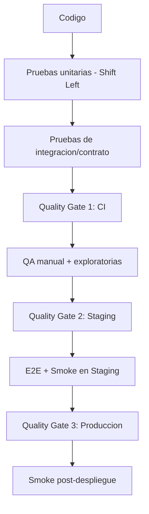
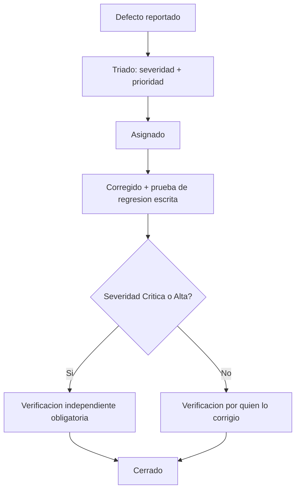
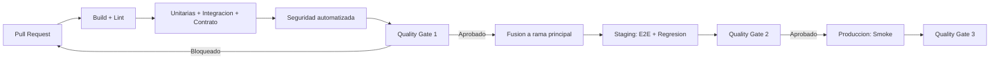
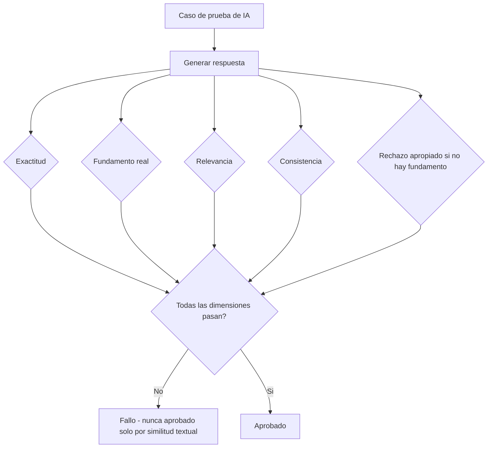

# Plan de Pruebas y Aseguramiento de Calidad — ContaIA

## Control del documento

| Campo                             | Valor                                                                                                                                                                                                                                                                                                                                                                                                                                                                                                                                                                                                                                                                                                                                                                           |
| --------------------------------- | ------------------------------------------------------------------------------------------------------------------------------------------------------------------------------------------------------------------------------------------------------------------------------------------------------------------------------------------------------------------------------------------------------------------------------------------------------------------------------------------------------------------------------------------------------------------------------------------------------------------------------------------------------------------------------------------------------------------------------------------------------------------------------- |
| Documento                         | 23_TESTING_AND_QA_PLAN.md                                                                                                                                                                                                                                                                                                                                                                                                                                                                                                                                                                                                                                                                                                                                                       |
| Orden de trabajo                  | AWO-019                                                                                                                                                                                                                                                                                                                                                                                                                                                                                                                                                                                                                                                                                                                                                                         |
| Versión                           | 1.0                                                                                                                                                                                                                                                                                                                                                                                                                                                                                                                                                                                                                                                                                                                                                                             |
| **Estado**                        | **Draft v1.0**                                                                                                                                                                                                                                                                                                                                                                                                                                                                                                                                                                                                                                                                                                                                                                  |
| Fecha de creación                 | 2026-07-19                                                                                                                                                                                                                                                                                                                                                                                                                                                                                                                                                                                                                                                                                                                                                                      |
| Última actualización              | 2026-07-19                                                                                                                                                                                                                                                                                                                                                                                                                                                                                                                                                                                                                                                                                                                                                                      |
| Fuentes de verdad                 | `MASTER_CONTEXT.md`, `docs/00_PRODUCT_VISION.md`, `docs/01_PRD.md`, `docs/02_USER_PERSONAS.md`, `docs/04_BUSINESS_RULES.md`, `docs/05_SYSTEM_DOMAIN_MODEL.md`, `docs/06_SYSTEM_WORKFLOWS.md`, `docs/07_SOFTWARE_ARCHITECTURE.md`, `docs/08_API_DESIGN.md`, `docs/09_DATABASE_DESIGN.md`, `docs/10_AI_ARCHITECTURE.md`, `docs/11_SECURITY_ARCHITECTURE.md`, `docs/12_FRONTEND_ARCHITECTURE.md`, `docs/13_DESIGN_SYSTEM.md`, `docs/14_INFORMATION_ARCHITECTURE.md`, `docs/15_UX_FLOWS.md`, `docs/16_WIREFRAMES_SPECIFICATION.md`, `docs/17_PROTOTYPE_SPECIFICATION.md`, `docs/18_UI_SPECIFICATION.md`, `docs/19_FRONTEND_IMPLEMENTATION_PLAN.md`, `docs/20_BACKEND_IMPLEMENTATION_PLAN.md`, `docs/21_DATABASE_MIGRATION_PLAN.md`, `docs/22_INFRASTRUCTURE_IMPLEMENTATION_PLAN.md` |
| Documentos que este plan alimenta | `docs/24_RELEASE_PLAN.md` (próximo, ver "Observaciones del Arquitecto")                                                                                                                                                                                                                                                                                                                                                                                                                                                                                                                                                                                                                                                                                                         |

> Nota sobre numeración: la Work Order referenciaba `docs/03_BUSINESS_RULES.md`, `docs/04_SYSTEM_DOMAIN_MODEL.md` y `docs/05_SYSTEM_WORKFLOWS.md` — nombres desactualizados por renumeraciones ya corregidas; se usan las rutas reales (`docs/04`, `docs/05`, `docs/06`). `docs/23` **no presentó colisión**, cuarta confirmación consecutiva de la Política oficial de gestión de colisiones de numeración (`MASTER_CONTEXT.md` sección 27.4).

> Este documento consolida y formaliza las estrategias de prueba ya esbozadas por separado en `docs/17_PROTOTYPE_SPECIFICATION.md` (casos de prueba UX), `docs/19_FRONTEND_IMPLEMENTATION_PLAN.md` (sección 16) y `docs/20_BACKEND_IMPLEMENTATION_PLAN.md` (sección 13) en un plan único de calidad — no las contradice, las integra. No es código de prueba ni configuración de un framework.

---

## Principios de la estrategia de calidad

La estrategia debe ser preventiva, automatizable, repetible, auditable, medible, escalable e integrada al pipeline CI/CD (`docs/22_INFRASTRUCTURE_IMPLEMENTATION_PLAN.md` sección 6) — instrucción explícita de esta Work Order. Las pruebas se ejecutan tan pronto como sea posible en el ciclo de desarrollo (**Shift Left Testing**): un error de regla de negocio (BR-*) detectado en una prueba unitaria durante el desarrollo es incomparablemente más barato de corregir que el mismo error detectado por un cliente piloto durante un cierre mensual real.

## 1. Objetivo del plan

**Propósito:** garantizar que cada módulo de ContaIA cumpla los requisitos funcionales (`docs/01_PRD.md`), técnicos (`docs/07` a `docs/22`), legales (`docs/04_BUSINESS_RULES.md`, `MASTER_CONTEXT.md`) y de experiencia de usuario (`docs/13` a `docs/18`) antes de llegar a producción.

**Alcance:** los 12 módulos del MVP (`docs/01_PRD.md` sección 9), sus 55 endpoints (`docs/08_API_DESIGN.md`), sus 39 pantallas prioritarias (`docs/16_WIREFRAMES_SPECIFICATION.md`), y los 8 casos de prueba UX ya definidos (`docs/17_PROTOTYPE_SPECIFICATION.md` sección 15).

**Exclusiones:** código de prueba o configuración de un framework específico; selección de la herramienta exacta de automatización (se recomiendan candidatas, sin fijarlas como decisión irreversible); pruebas de integración real con el SAT o un PAC (sección 8 — no existen en el MVP).

**Responsabilidades:** QA valida el cumplimiento de los criterios de aceptación ya definidos por módulo (`docs/01_PRD.md` sección 20); Desarrollo escribe y mantiene las pruebas automatizadas de su propio código (`docs/19_FRONTEND_IMPLEMENTATION_PLAN.md` sección 16, `docs/20_BACKEND_IMPLEMENTATION_PLAN.md` sección 13); DevOps integra las verificaciones de calidad en el pipeline (`docs/22_INFRASTRUCTURE_IMPLEMENTATION_PLAN.md` sección 6) — ninguna de las tres responsabilidades sustituye a las otras dos.

## 2. Estrategia general de calidad

| Concepto               | Aplicación en ContaIA                                                                                                                                                                                                                                                       |
| ---------------------- | --------------------------------------------------------------------------------------------------------------------------------------------------------------------------------------------------------------------------------------------------------------------------- |
| **Shift Left**         | Cada Domain Service (`docs/20_BACKEND_IMPLEMENTATION_PLAN.md` sección 4) tiene pruebas unitarias antes de integrarse; ningún módulo llega a QA sin cobertura mínima ya verificada en CI (sección 15, Quality Gates)                                                         |
| **Continuous Testing** | Las pruebas se ejecutan en cada Pull Request (`docs/22_INFRASTRUCTURE_IMPLEMENTATION_PLAN.md` sección 6, etapa "Tests"), no como un evento aislado antes de cada release                                                                                                    |
| **Test Pyramid**       | Base amplia de pruebas unitarias, capa media de integración/contrato, cúspide reducida de E2E — proporción de referencia: 70% unitarias, 20% integración/contrato, 10% E2E (guía de ingeniería, ajustable, no un compromiso contractual)                                    |
| **Risk-Based Testing** | Reutiliza directamente la clasificación de prioridad **Crítica/Alta/Media** ya establecida en `docs/16`, `docs/17`, `docs/18`, `docs/19` y `docs/20` — no se inventa un modelo de riesgo paralelo; un módulo Crítico exige el conjunto de pruebas más completo (sección 21) |
| **Quality Gates**      | Puntos de bloqueo obligatorios en el pipeline antes de avanzar de una etapa a la siguiente (sección 15)                                                                                                                                                                     |

## 3. Tipos de pruebas

| Tipo               | Cuándo se ejecuta                                                                                                                   | Alcance en ContaIA                                                                                                                                    |
| ------------------ | ----------------------------------------------------------------------------------------------------------------------------------- | ----------------------------------------------------------------------------------------------------------------------------------------------------- |
| **Unitarias**      | En cada commit, local y en CI                                                                                                       | Domain Services, Shared Services, hooks de frontend, utilidades (`docs/19` sección 16, `docs/20` sección 13)                                          |
| **Integración**    | En cada Pull Request                                                                                                                | Application Services contra base de datos real efímera (Testcontainers); componentes de frontend + hook + API simulada                                |
| **Contrato (API)** | En cada Pull Request que toque un controlador o un cliente de API                                                                   | Verifica que la implementación no diverge de `docs/08_API_DESIGN.md` (esquema OpenAPI generado, sección 5 de `docs/20`)                               |
| **End-to-End**     | Antes de promover a Staging y antes de cada release                                                                                 | Los 8 casos de `docs/17_PROTOTYPE_SPECIFICATION.md` (`TC-01` a `TC-08`) como suite base, ampliable                                                    |
| **Smoke**          | Inmediatamente después de cada despliegue (`docs/22_INFRASTRUCTURE_IMPLEMENTATION_PLAN.md` sección 6, "verificaciones posteriores") | Los flujos Crítica de la sección 21 — confirmación de que el sistema está vivo, no una validación funcional completa                                  |
| **Regression**     | Antes de cada release, sobre toda funcionalidad ya aprobada previamente                                                             | Suite acumulativa de E2E + integración, priorizada por Risk-Based Testing                                                                             |
| **Acceptance**     | Al cierre de cada módulo                                                                                                            | Verifica los criterios de aceptación ya definidos por módulo en `docs/01_PRD.md` (sección 9) y el Definition of Done de `docs/19`/`docs/20`           |
| **Exploratorias**  | Antes de cada release mayor, sesión dirigida por QA                                                                                 | Sin guion fijo — busca deliberadamente romper supuestos, especialmente en flujos de aprobación humana e IA (secciones 6, 7)                           |
| **Usabilidad**     | Con los casos de prueba UX ya definidos (`docs/17_PROTOTYPE_SPECIFICATION.md` sección 15)                                           | Con usuarios piloto reales cuando estén disponibles, antes con el equipo interno                                                                      |
| **Accesibilidad**  | En cada componente de `ui/`/`shared/` antes de integrarse a un módulo, y en cada pantalla de prioridad Crítica antes de release     | Ver sección 11                                                                                                                                        |
| **Compatibilidad** | Antes de cada release mayor                                                                                                         | Los tres puntos de quiebre responsive ya definidos (`docs/18_UI_SPECIFICATION.md` sección 11: escritorio/tablet/móvil), navegadores modernos vigentes |
| **Rendimiento**    | Antes de cada release mayor, y ante cambios en consultas críticas                                                                   | Ver sección 10                                                                                                                                        |
| **Carga**          | Antes de la primera exposición a un volumen real (por ejemplo, el primer cierre mensual de un cliente piloto)                       | Simulación del patrón de picos ya señalado en `docs/02_USER_PERSONAS.md`                                                                              |
| **Estrés**         | Antes de la fase de Crecimiento (`docs/22_INFRASTRUCTURE_IMPLEMENTATION_PLAN.md` sección 14)                                        | Encuentra el punto de quiebre del sistema, no solo su comportamiento normal                                                                           |
| **Seguridad**      | En cada Pull Request (escaneo automatizado) y antes de cada release mayor (dirigida)                                                | Ver sección 9                                                                                                                                         |
| **Recuperación**   | Coordinada con los simulacros de `docs/22_INFRASTRUCTURE_IMPLEMENTATION_PLAN.md` (sección 12)                                       | Verifica que la restauración documentada realmente funciona, no solo que existe                                                                       |

## 4. Cobertura objetivo

Metas de referencia (guía de ingeniería ajustable, no cifras legales o contractuales — mismo principio de no inventar números sin base aplicado en `docs/08`, `docs/11` y `docs/22`):

| Área                                                                      | Meta de cobertura                                                                                                                                                                             | Justificación                                                                                                          |
| ------------------------------------------------------------------------- | --------------------------------------------------------------------------------------------------------------------------------------------------------------------------------------------- | ---------------------------------------------------------------------------------------------------------------------- |
| Backend — Domain Services / reglas de negocio (BR-*)                      | ≥ 90%                                                                                                                                                                                         | Codifican reglas legalmente significativas (BR-POL-002, BR-GLB-001, etc.) — un error aquí tiene el mayor costo posible |
| Backend — Motores de cálculo (Balanza, Estados Financieros, calculadoras) | 100%, más pruebas de valores dorados (golden values)                                                                                                                                          | BR-GLB-004 exige reproducibilidad byte a byte; no es negociable                                                        |
| Backend — Application/Infrastructure Services                             | ≥ 75%                                                                                                                                                                                         | Orquestación y adaptadores, menor densidad de lógica de negocio propia                                                 |
| Frontend — hooks y lógica de presentación                                 | ≥ 70%                                                                                                                                                                                         | Prioriza cobertura de flujos críticos (`docs/19` sección 16) sobre cobertura total de UI                               |
| Servicios (clientes de API tipados)                                       | ≥ 80%                                                                                                                                                                                         | Traducen contratos de `docs/08_API_DESIGN.md`; un error aquí desalinea silenciosamente frontend y backend              |
| IA                                                                        | Sin porcentaje de cobertura de código — ver sección 6 (evaluación cualitativa por dimensión, no cobertura de líneas)                                                                          |
| Integraciones                                                             | Ver sección 8                                                                                                                                                                                 |
| Reglas fiscales/contables                                                 | 100% de las reglas BR-POL-_, BR-EF-_, BR-CFDI-* con al menos un caso de prueba documentado, coherente con `docs/04_BUSINESS_RULES.md` (cada regla ya declara su propio "Escenario de prueba") |
| Validaciones (formularios, DTOs)                                          | ≥ 85%                                                                                                                                                                                         | Alto valor, bajo costo de prueba                                                                                       |

**Excepciones documentadas:** código de infraestructura generado automáticamente (migraciones de Prisma, clientes de API generados) no requiere cobertura propia — se valida por las pruebas de contrato e integración que lo ejercitan indirectamente.

## 5. Estrategia de automatización

| Aspecto                  | Estrategia                                                                                                                                                                            |
| ------------------------ | ------------------------------------------------------------------------------------------------------------------------------------------------------------------------------------- |
| Qué automatizar          | Todo lo repetible y determinista: unitarias, integración, contrato, smoke, regression, seguridad automatizada — la mayoría del volumen de pruebas                                     |
| Qué validar manualmente  | Usabilidad con usuarios reales, exploratorias, revisión de contenido de IA no determinista (sección 6), decisiones de diseño visual (`docs/18_UI_SPECIFICATION.md`)                   |
| Prioridades              | Automatizar primero los módulos de prioridad Crítica (sección 21) — mismo criterio de priorización ya usado en `docs/19` y `docs/20`                                                  |
| Mantenimiento de pruebas | Una prueba que falla de forma intermitente sin causa real (`flaky test`) se corrige o se retira en un plazo definido — nunca se ignora silenciosamente ni se deshabilita sin registro |

## 6. Validación de IA

Extiende directamente las dimensiones de evaluación ya definidas en `docs/10_AI_ARCHITECTURE.md` (sección 20) — **nunca se valida solo por similitud textual**, instrucción explícita de esta Work Order y ya coherente con ese documento:

| Aspecto a validar       | Método                                                                                                                                                                                                                                                                                                                                                                    |
| ----------------------- | ------------------------------------------------------------------------------------------------------------------------------------------------------------------------------------------------------------------------------------------------------------------------------------------------------------------------------------------------------------------------- |
| Respuestas              | Evaluadas contra las dimensiones ya definidas: exactitud, fundamento, relevancia, consistencia, cumplimiento de formato, rechazo apropiado (`docs/10` sección 20) — nunca solo "se parece a la respuesta esperada"                                                                                                                                                        |
| Evidencia               | Toda afirmación normativa relevante debe tener una `FuenteFundamento` real y verificable — prueba automatizada que confirma que cada cita en la respuesta corresponde a una fuente realmente recuperada, no inventada                                                                                                                                                     |
| Trazabilidad            | Toda interacción de IA queda en el Registro de Trazabilidad — prueba de integración que confirma el registro completo (BR-TRZ-001)                                                                                                                                                                                                                                        |
| Confianza               | El `confidenceLevel` categórico (`APPROVED`/`REQUIRES_REVIEW`/`INSUFFICIENT`) se prueba contra casos de cada categoría, incluyendo casos límite donde la clasificación no es obvia                                                                                                                                                                                        |
| Recuperación documental | Casos de prueba con y sin cobertura en `knowledge/` — una pregunta sin fundamento curado debe declarar su ausencia (BR-GLB-003), nunca generalizar; un fragmento con vigencia vencida nunca debe recuperarse (`docs/10` sección 7)                                                                                                                                        |
| Aprobación humana       | Prueba de integración que confirma que ninguna Sugerencia de IA se convierte en Póliza sin pasar por `ApprovalsService` — la misma regla de "ausencia estructural de escritura directa" ya fijada en `docs/09_DATABASE_DESIGN.md` (sección 11) y `docs/20_BACKEND_IMPLEMENTATION_PLAN.md` (sección 7), verificada aquí como caso de prueba explícito, no solo como diseño |
| Manejo de alucinaciones | Conjunto de casos adversariales (`docs/10` sección 20: "casos adversariales") — preguntas diseñadas para inducir una respuesta inventada; el criterio de éxito es que el sistema declare ausencia de fundamento o remita a revisión humana, nunca que invente una cita                                                                                                    |

**Regla explícita:** ninguna prueba de IA se considera "pasada" únicamente porque el texto generado se parezca al esperado — debe pasar cada dimensión de la tabla anterior de forma independiente.

## 7. Validación contable y fiscal

**Alcance explícito, coherente con `docs/01_PRD.md` (módulo M10):** ContaIA no calcula el marco fiscal mexicano completo en el MVP — valida los motores determinísticos y el conjunto acotado de calculadoras realmente implementados, no un motor fiscal general inexistente.

| Elemento          | Estrategia de prueba                                                                                                                                                                                                                                                                                                                                                     |
| ----------------- | ------------------------------------------------------------------------------------------------------------------------------------------------------------------------------------------------------------------------------------------------------------------------------------------------------------------------------------------------------------------------ |
| CFDI              | Casos con XML válidos, con campos ambiguos (BR-XML-002), con Folio Fiscal duplicado (deduplicación real a nivel de índice, `docs/21_DATABASE_MIGRATION_PLAN.md` sección 7), con estructura inválida (BR-XML-001)                                                                                                                                                         |
| XML               | Validación estructural probada contra XML bien formados y mal formados; nunca se prueba contra el esquema oficial del SAT como si fuera una validación fiscal (fuera del alcance del MVP, BR-CFDI-001)                                                                                                                                                                   |
| Pólizas           | Balance obligatorio (BR-POL-002) probado con casos balanceados y descuadrados; ciclo de estados completo (`DRAFT → PENDING_REVIEW → DEFINITIVE`, BR-POL-001 a 004); inmutabilidad de una Póliza `DEFINITIVE` probada intentando editarla directamente y confirmando el rechazo                                                                                           |
| Reportes          | Balanza y Estados Financieros probados con valores dorados (golden values) — mismo conjunto de Pólizas produce siempre el mismo resultado (BR-EF-002), verificado byte a byte                                                                                                                                                                                            |
| Impuestos         | Únicamente dentro del alcance de las calculadoras determinísticas ya aprobadas (`docs/01_PRD.md` módulo M10) — cada una con su fórmula documentada y sus propios casos de prueba, coherente con `docs/13_DESIGN_SYSTEM.md` (advertencia de que no sustituye revisión profesional); **ninguna prueba valida "corrección fiscal general"**, por no ser una promesa del MVP |
| Cálculos          | Todo cálculo crítico se prueba exclusivamente contra el motor determinístico — una prueba que detecte una llamada a un modelo de IA generativa dentro de un cálculo crítico debe fallar automáticamente (refuerza BR-GLB-004 como caso de prueba, no solo como principio de diseño)                                                                                      |
| Reglas de negocio | Las 90+ reglas de `docs/04_BUSINESS_RULES.md` ya declaran su propio "Escenario de prueba" — este documento no las reescribe, exige que cada una tenga al menos una prueba automatizada que ejecute literalmente ese escenario                                                                                                                                            |

## 8. Pruebas de integración

| Integración               | Estrategia                                                                                                                                                                                                                                                                                                            | Estado en el MVP                                                                                                                                                                                 |
| ------------------------- | --------------------------------------------------------------------------------------------------------------------------------------------------------------------------------------------------------------------------------------------------------------------------------------------------------------------- | ------------------------------------------------------------------------------------------------------------------------------------------------------------------------------------------------ |
| PAC                       | **No aplica**                                                                                                                                                                                                                                                                                                         | Sin integración activa (BR-CFDI-001, `docs/20_BACKEND_IMPLEMENTATION_PLAN.md` sección 8, `docs/22_INFRASTRUCTURE_IMPLEMENTATION_PLAN.md` sección 2) — no existe nada que probar hasta la Etapa 4 |
| SAT                       | **No aplica**                                                                                                                                                                                                                                                                                                         | Mismo motivo que PAC                                                                                                                                                                             |
| Almacenamiento (S3/MinIO) | Prueba de integración contra un almacenamiento de objetos real (o compatible) en el pipeline de CI, verificando el flujo completo de URL prefirmada (`docs/08_API_DESIGN.md` sección 14)                                                                                                                              | Activa                                                                                                                                                                                           |
| Correo                    | **Alcance mínimo:** el único correo saliente del MVP es la verificación de cuenta y la recuperación de contraseña (`docs/04_BUSINESS_RULES.md` sección 4.13, `docs/15_UX_FLOWS.md` UXF-0001/UXF-0003) — se prueba el envío y la validez del enlace de un solo uso, no un sistema general de notificaciones por correo | Activa, alcance acotado                                                                                                                                                                          |
| Autenticación             | Prueba de integración del flujo completo login → MFA (TOTP) → sesión, incluyendo intentos fallidos y bloqueo progresivo (BR-AUTH-003)                                                                                                                                                                                 | Activa                                                                                                                                                                                           |
| IA                        | Prueba de integración contra el/los proveedor(es) de IA reales en un entorno controlado (nunca en pruebas unitarias, que deben simular la respuesta), más pruebas del circuit breaker ante fallo simulado del proveedor (AD-05 de `docs/07`)                                                                          | Activa                                                                                                                                                                                           |

## 9. Pruebas de seguridad

| Área          | Estrategia                                                                                                                                                                                                                                                                                                                                             |
| ------------- | ------------------------------------------------------------------------------------------------------------------------------------------------------------------------------------------------------------------------------------------------------------------------------------------------------------------------------------------------------ |
| Autenticación | Casos de credenciales inválidas, cuenta no verificada, MFA requerido y omitido, bloqueo progresivo (BR-AUTH-001 a 004)                                                                                                                                                                                                                                 |
| Autorización  | **La prueba más crítica del sistema:** intentos de acceso cruzado entre Empresas (BR-GLB-001) para cada endpoint de `docs/08_API_DESIGN.md` — un Usuario con Membresía solo en la Empresa A nunca debe poder leer o escribir datos de la Empresa B, incluso llamando al endpoint directamente sin pasar por la interfaz                                |
| OWASP Top 10  | Suite de pruebas dirigidas por categoría (inyección, control de acceso roto, configuración insegura, etc.), integrada al escaneo automatizado del pipeline (`docs/22_INFRASTRUCTURE_IMPLEMENTATION_PLAN.md` sección 13)                                                                                                                                |
| Rate limiting | Verificación de que los umbrales de referencia de `docs/22_INFRASTRUCTURE_IMPLEMENTATION_PLAN.md` (sección 13) realmente bloquean el exceso, no solo que están configurados                                                                                                                                                                            |
| Inyección     | Pruebas automatizadas de inyección SQL (mitigada por Prisma, `docs/20_BACKEND_IMPLEMENTATION_PLAN.md` sección 10) y de inyección de instrucciones a la IA (prompt injection, `docs/10_AI_ARCHITECTURE.md` sección 15) — un documento cargado con contenido adversarial nunca debe alterar el comportamiento del Agente                                 |
| XSS           | Ningún contenido generado por Usuario o por IA se renderiza como código ejecutable — prueba automatizada de sanitización en ambos flujos                                                                                                                                                                                                               |
| CSRF          | Verificación de que una mutación desde una sesión de cookie sin el token anti-falsificación correcto es rechazada                                                                                                                                                                                                                                      |
| SSRF          | Verificación de que ninguna funcionalidad que acepte una URL o referencia externa (por ejemplo, un futuro adaptador de PAC) puede usarse para alcanzar recursos internos de la red (`docs/22_INFRASTRUCTURE_IMPLEMENTATION_PLAN.md` sección 8, subredes privadas) — relevante principalmente para la Etapa 4, documentado aquí como control preventivo |
| Auditoría     | Prueba de que toda acción sensible genera exactamente los siete campos mínimos de trazabilidad (BR-TRZ-001), y que el registro es verdaderamente inmutable (intento de edición/borrado directo rechazado)                                                                                                                                              |

## 10. Pruebas de rendimiento

Sin cifras exactas de SLA (mismo principio de `docs/08`/`docs/11`/`docs/22`); objetivos de referencia:

| Aspecto         | Objetivo de referencia                                                                                                                                                                                                                      |
| --------------- | ------------------------------------------------------------------------------------------------------------------------------------------------------------------------------------------------------------------------------------------- |
| Tiempos máximos | Operaciones comunes (consulta de Balanza, listado de Documentos) perceptibles como ágiles (`docs/01_PRD.md` sección 14); operaciones pesadas (generación de reportes, carga masiva) con progreso visible en vez de un umbral de tiempo fijo |
| Concurrencia    | Simulación de múltiples aprobadores resolviendo Casos de Revisión simultáneamente — confirma que el bloqueo optimista (`docs/08_API_DESIGN.md` sección 13) resuelve la condición de carrera sin duplicar decisiones                         |
| Consumo         | Monitoreo de uso de CPU/memoria por tipo de solicitud durante pruebas de carga, correlacionado con el tablero de costos de `docs/22_INFRASTRUCTURE_IMPLEMENTATION_PLAN.md` (sección 15)                                                     |
| Estrés          | Incremento progresivo de carga hasta encontrar el punto de degradación — documentado como línea base, no como meta a alcanzar en el MVP                                                                                                     |
| Recuperación    | Verificación de que el sistema vuelve a un comportamiento normal después de un pico de carga simulado, sin requerir reinicio manual                                                                                                         |

## 11. Accesibilidad

Objetivo **WCAG 2.2 AA**, consolidando `docs/13_DESIGN_SYSTEM.md` (sección 34), `docs/18_UI_SPECIFICATION.md` (sección 12) y `docs/19_FRONTEND_IMPLEMENTATION_PLAN.md` (sección 13):

| Aspecto    | Validación                                                                                                                                                                                                           |
| ---------- | -------------------------------------------------------------------------------------------------------------------------------------------------------------------------------------------------------------------- |
| Teclado    | Navegación completa sin trampas de foco, verificada manualmente en cada pantalla de prioridad Crítica (sección 21) antes de release                                                                                  |
| Foco       | Gestión correcta al abrir/cerrar modales y drawers, con retorno al punto de origen — verificado en los componentes `UIC-09`/`UIC-10` (`docs/18_UI_SPECIFICATION.md`)                                                 |
| Lectores   | Verificación automatizada con `axe-core` en cada componente de `ui/`/`shared/` (`docs/19_FRONTEND_IMPLEMENTATION_PLAN.md` sección 13) antes de integrarse a un módulo                                                |
| Contraste  | Los dos ajustes de color pendientes de `docs/18_UI_SPECIFICATION.md` (sección 3.1, Éxito y Advertencia) deben pasar la verificación de contraste real antes de que cualquier pantalla que los use se considere lista |
| Navegación | Landmarks semánticos y jerarquía de encabezados verificados en cada layout oficial (`docs/18_UI_SPECIFICATION.md` sección 16)                                                                                        |

**Regla no negociable:** ninguna pantalla de prioridad Crítica se libera a producción con incidencias críticas de `axe-core` sin resolver — parte del Quality Gate de la sección 15.

## 12. Ambientes de prueba

Reutiliza exactamente los ambientes ya definidos en `docs/22_INFRASTRUCTURE_IMPLEMENTATION_PLAN.md` (sección 3) — este documento no propone ambientes adicionales, coherente con la recomendación que ese mismo documento dejó para este (sección 22):

| Ambiente    | Propósito de QA                                                                                                                                                                             |
| ----------- | ------------------------------------------------------------------------------------------------------------------------------------------------------------------------------------------- |
| Local       | Ejecución de pruebas unitarias e integración por el propio desarrollador antes de abrir un Pull Request                                                                                     |
| Development | Ejecución automática de la suite completa de CI (unitarias, integración, contrato, seguridad automatizada) en cada Pull Request                                                             |
| QA          | Validación funcional manual, exploratoria y de usabilidad, con datos sintéticos representativos (sección 13)                                                                                |
| Staging     | Última validación E2E y de regresión antes de producción, incluida la validación de migraciones (`docs/21_DATABASE_MIGRATION_PLAN.md` sección 4) y el ensayo de Quality Gate 2 (sección 15) |

**Producción no es un ambiente de prueba** — solo recibe pruebas smoke post-despliegue (sección 3), nunca pruebas exploratorias, de carga o de seguridad activa contra datos reales de clientes.

## 13. Datos de prueba

Reutiliza, por tercera vez consecutiva en esta serie de documentos, el mismo conjunto sintético ya definido en `docs/17_PROTOTYPE_SPECIFICATION.md` (sección 6) y `docs/21_DATABASE_MIGRATION_PLAN.md` (sección 6) — evita fragmentar la base de datos de ejemplo del proyecto en conjuntos incompatibles:

| Elemento            | Estrategia                                                                                                                                                                                                                                |
| ------------------- | ----------------------------------------------------------------------------------------------------------------------------------------------------------------------------------------------------------------------------------------- |
| Datos ficticios     | Nombres, RFC de prueba y montos evidentemente sintéticos — nunca datos reales reconocibles                                                                                                                                                |
| Anonimización       | **No se usa como estrategia** — coherente con `docs/09_DATABASE_DESIGN.md` (sección 17) y `docs/21_DATABASE_MIGRATION_PLAN.md` (sección 6): ningún dato real de un cliente se anonimiza para pruebas, se genera sintético desde el origen |
| Empresas demo       | "Comercializadora Ejemplo, S.A. de C.V." y "Consultoría Simulada, S.C." — mismas Empresas ya usadas en el prototipo y en los seeds de migración                                                                                           |
| Ejercicios fiscales | Relativos al entorno (no fechas fijas), para que las pruebas no caduquen con el tiempo                                                                                                                                                    |
| XML de ejemplo      | Conjunto de CFDI sintéticos que cubre los casos de prueba ya identificados en `docs/17_PROTOTYPE_SPECIFICATION.md` (sección 6): comprobante válido, campo ambiguo, Folio Fiscal duplicado, estructura inválida                            |

## 14. Gestión de defectos

| Aspecto             | Definición                                                                                                                                                                                                                                                                                                                       |
| ------------------- | -------------------------------------------------------------------------------------------------------------------------------------------------------------------------------------------------------------------------------------------------------------------------------------------------------------------------------- |
| Clasificación       | Funcional, de seguridad, de accesibilidad, de rendimiento, de IA (fundamento/alucinación), visual                                                                                                                                                                                                                                |
| Severidad           | Crítica (viola una regla de negocio BR-*, expone datos entre Empresas, o permite una acción sensible sin revisión humana — bloquea el release sin excepción); Alta (afecta un flujo Crítica de la sección 21 sin solución alterna); Media (afecta un flujo Alta/Media, con solución alterna); Baja (cosmético o de bajo impacto) |
| Prioridad           | Determinada por la combinación de severidad y la clasificación de riesgo ya establecida (Crítica/Alta/Media, sección 2) — un defecto de severidad Media en un módulo Crítico se prioriza sobre uno de severidad Alta en un módulo Media                                                                                          |
| Flujo de corrección | Reportado → triado (severidad + prioridad) → asignado → corregido → verificado por quien lo reportó (o QA) → cerrado — nunca cerrado por quien lo corrigió sin verificación independiente cuando la severidad es Crítica o Alta                                                                                                  |
| Criterios de cierre | La corrección tiene una prueba automatizada que reproduce el defecto original y confirma que ya no ocurre (regresión, sección 3)                                                                                                                                                                                                 |

## 15. Quality Gates

Puntos de bloqueo obligatorios, integrados al pipeline de `docs/22_INFRASTRUCTURE_IMPLEMENTATION_PLAN.md` (sección 6):

| Gate                            | Ubicación                                 | Requisito para avanzar                                                                                                                                                                                                       |
| ------------------------------- | ----------------------------------------- | ---------------------------------------------------------------------------------------------------------------------------------------------------------------------------------------------------------------------------- |
| **Quality Gate 1 — CI**         | Tras "Tests" y "Seguridad" en el pipeline | Cobertura mínima por área (sección 4) no reducida respecto al commit anterior; cero vulnerabilidades críticas sin parche; cero incidencias críticas de `axe-core` en componentes modificados                                 |
| **Quality Gate 2 — Staging**    | Antes de promover a producción            | Suite E2E completa (`TC-01` a `TC-08`) en verde; migraciones validadas (`docs/21_DATABASE_MIGRATION_PLAN.md` sección 4); aprobación de segundo revisor para cambios no aditivos; cero defectos de severidad Crítica abiertos |
| **Quality Gate 3 — Producción** | Inmediatamente después del despliegue     | Pruebas smoke en verde (sección 3); monitoreo activo sin anomalías durante la ventana de verificación posterior (`docs/22_INFRASTRUCTURE_IMPLEMENTATION_PLAN.md` sección 6) — si falla, rollback automático                  |

**Regla no negociable:** ningún Quality Gate puede omitirse manualmente para acelerar un despliegue — coherente con el principio explícito de esta Work Order de que las pruebas deben ser automatizables e integradas al pipeline, no un paso opcional bajo presión de tiempo.

## 16. Roadmap QA

| Fase                               | Pruebas                                                                                                     | Herramientas de referencia                                        | Responsables                | Definition of Done                                               |
| ---------------------------------- | ----------------------------------------------------------------------------------------------------------- | ----------------------------------------------------------------- | --------------------------- | ---------------------------------------------------------------- |
| **1 — Fundamentos de calidad**     | Unitarias + integración para Authentication/Users/Roles & Permissions/Audit (alineado con `docs/20` Fase 1) | Jest, Testcontainers                                              | Desarrollo                  | Quality Gate 1 operativo en CI                                   |
| **2 — Contrato y seguridad base**  | Pruebas de contrato contra `docs/08_API_DESIGN.md`; autorización cruzada entre Empresas (sección 9)         | Validación de esquema OpenAPI, suite de autorización dedicada     | Desarrollo + QA             | Ningún endpoint del MVP sin prueba de aislamiento multiempresa   |
| **3 — E2E del ciclo de valor**     | Los 8 casos `TC-01` a `TC-08` automatizados                                                                 | Playwright                                                        | QA + Desarrollo             | Suite E2E completa en verde en Staging                           |
| **4 — Validación de IA**           | Suite de la sección 6 (fundamento, alucinaciones, aprobación humana)                                        | Conjunto de evaluación de `docs/10_AI_ARCHITECTURE.md` sección 20 | QA + equipo de IA/contenido | Ninguna respuesta de IA aprobada sin pasar las 6 dimensiones     |
| **5 — Accesibilidad y usabilidad** | `axe-core` integrado; primera ronda de pruebas de usabilidad con usuarios piloto                            | `axe-core`, sesiones moderadas                                    | QA + Diseño                 | Cero incidencias críticas de accesibilidad en pantallas Crítica  |
| **6 — Rendimiento y carga**        | Simulación del patrón de picos de cierre mensual (`docs/02_USER_PERSONAS.md`)                               | Herramienta de carga (k6/Artillery, sin fijar)                    | DevOps + QA                 | Sistema estable bajo el primer pico simulado                     |
| **7 — Recuperación**               | Coordinado con el primer simulacro de `docs/22_INFRASTRUCTURE_IMPLEMENTATION_PLAN.md` (sección 12)          | —                                                                 | DevOps + QA                 | Simulacro dentro del RTO de referencia                           |
| **8 — Regresión continua**         | Consolidación de toda la suite anterior como regresión automática permanente                                | —                                                                 | Desarrollo + QA             | Toda la suite se ejecuta en cada release sin intervención manual |

## 17. Riesgos

- **Cobertura insuficiente:** un módulo Crítico con cobertura por debajo de la meta (sección 4) puede llegar a producción si el Quality Gate 1 no se aplica con disciplina — mitigado por hacerlo un bloqueo automático, no una recomendación.
- **Falsos positivos:** pruebas frágiles (`flaky`) erosionan la confianza en la suite y generan presión para omitir Quality Gates — mitigado por la política de mantenimiento de la sección 5.
- **Dependencia de terceros:** pruebas de integración de IA (sección 8) dependen de la disponibilidad del proveedor externo — mitigado por simular la respuesta en pruebas unitarias/integración regulares, reservando la llamada real a un conjunto acotado de pruebas dedicadas.
- **IA:** el riesgo de mayor severidad reputacional es que una prueba de alucinación pase por evaluar solo similitud textual en vez de las 6 dimensiones de la sección 6 — mitigado por la regla explícita de esa sección.
- **Rendimiento:** pruebas de carga ejecutadas tarde (solo antes del primer cliente piloto real) pueden descubrir un problema estructural difícil de corregir a tiempo — mitigado por adelantar la Fase 6 del roadmap tan pronto como el módulo Accounting esté completo, no al final del proyecto.

## 18. Diagramas Mermaid

Test Pyramid y flujo de QA ya incluidos (sección 2). Se agregan los restantes:

### 18.1 Ciclo de defectos

### 18.2 Integración CI/CD

### 18.3 Validación de IA

## 19. Matriz de pruebas

| Módulo                                | Tipo de prueba                               | Prioridad           | Ambiente                 | Responsable     | Criterio de aprobación                                  |
| ------------------------------------- | -------------------------------------------- | ------------------- | ------------------------ | --------------- | ------------------------------------------------------- |
| Authentication                        | Unitaria, integración, seguridad             | Crítica             | Development, QA          | Desarrollo      | Login/MFA/bloqueo progresivo verificados (BR-AUTH-*)    |
| Companies                             | Integración, seguridad (aislamiento)         | Crítica             | Development, QA, Staging | Desarrollo + QA | Cero fuga de datos entre Empresas (BR-GLB-001)          |
| Files/Fiscal/CFDI                     | Integración, E2E                             | Crítica             | QA, Staging              | QA              | `TC-01` en verde; deduplicación real verificada         |
| Accounting                            | Unitaria (100% en motores), integración, E2E | Crítica             | Todos                    | Desarrollo + QA | `TC-02` en verde; Balanza reproducible byte a byte      |
| AI                                    | Suite de sección 6, integración              | Alta                | QA, Staging              | QA + equipo IA  | `TC-03`/`TC-04` en verde; 6 dimensiones aprobadas       |
| Tasks                                 | Integración, E2E                             | Alta                | QA, Staging              | QA              | Bloqueo optimista verificado bajo concurrencia simulada |
| Reports                               | Integración                                  | Alta                | QA, Staging              | QA              | `TC-06` en verde                                        |
| Notifications/Administration/Settings | Integración                                  | Media               | QA                       | Desarrollo      | Criterios de aceptación de `docs/01_PRD.md` cumplidos   |
| Frontend (transversal)                | Accesibilidad, compatibilidad, usabilidad    | Crítica (pantallas) | QA, Staging              | QA + Diseño     | Cero incidencias críticas de `axe-core`                 |
| Infraestructura                       | Recuperación, carga                          | Alta                | Staging                  | DevOps          | RTO de referencia cumplido en simulacro                 |

## 20. KPIs de calidad

| KPI                                        | Definición                                                                                                                                                    |
| ------------------------------------------ | ------------------------------------------------------------------------------------------------------------------------------------------------------------- |
| Cobertura                                  | Porcentaje por área (sección 4), monitoreado por commit, con tendencia nunca decreciente en un módulo Crítico                                                 |
| Defectos por versión                       | Conteo de defectos reportados tras cada release, segmentado por severidad                                                                                     |
| Tiempo de resolución                       | Desde reporte hasta cierre verificado, segmentado por severidad (sección 14)                                                                                  |
| Éxito de despliegues                       | Porcentaje de despliegues que no requirieron rollback (`docs/22_INFRASTRUCTURE_IMPLEMENTATION_PLAN.md` sección 6)                                             |
| Disponibilidad                             | Correlacionado con los objetivos cualitativos de `docs/22_INFRASTRUCTURE_IMPLEMENTATION_PLAN.md` (sección 11) — sin un porcentaje contractual fijo en el MVP  |
| Satisfacción del usuario                   | Resultado de las pruebas de usabilidad (sección 3) y, en producción, de la métrica de satisfacción ya definida en `docs/01_PRD.md` (sección 15)               |
| Respuestas de IA con fundamento suficiente | Porcentaje de respuestas que citan fuente y vigencia — métrica de calidad de IA ya definida en `docs/01_PRD.md` (sección 15), reutilizada aquí como KPI de QA |
| Rechazo de Sugerencias de IA               | Porcentaje de Sugerencias rechazadas en revisión humana — una cifra sana dentro de un rango esperado, no necesariamente cero (`docs/01_PRD.md` sección 15)    |

## 21. MVP

| Clasificación                              | Pruebas                                                                                                                                                                                                                                                                                                                                                                                                                                                              |
| ------------------------------------------ | -------------------------------------------------------------------------------------------------------------------------------------------------------------------------------------------------------------------------------------------------------------------------------------------------------------------------------------------------------------------------------------------------------------------------------------------------------------------- |
| **Obligatorias para el lanzamiento**       | Unitarias e integración de los módulos Críticos (`docs/20_BACKEND_IMPLEMENTATION_PLAN.md` sección 20); pruebas de contrato contra `docs/08_API_DESIGN.md`; autorización cruzada entre Empresas para todo endpoint; los 8 casos E2E (`TC-01` a `TC-08`); validación de IA de las 6 dimensiones (sección 6); accesibilidad `axe-core` en pantallas Crítica; al menos un simulacro de recuperación exitoso (`docs/22_INFRASTRUCTURE_IMPLEMENTATION_PLAN.md` sección 12) |
| **Incorporables en versiones posteriores** | Pruebas de estrés más allá de la línea base; compatibilidad exhaustiva entre navegadores antiguos; pruebas de carga a escala de 10,000+ usuarios (sin evidencia real que las justifique aún, `docs/22_INFRASTRUCTURE_IMPLEMENTATION_PLAN.md` sección 14); regresión visual automatizada más allá de los componentes de prioridad Crítica/Importante (`docs/18_UI_SPECIFICATION.md` sección 19)                                                                       |

## 22. Recomendaciones para Release Plan

- **Quality Gates como entrada directa:** `docs/24_RELEASE_PLAN.md` debe usar los tres Quality Gates de la sección 15 como los puntos de control oficiales de todo release, sin inventar un proceso de aprobación paralelo.
- **KPIs como criterio de salida:** los KPIs de la sección 20 deben informar la decisión de "listo para lanzar" del Release Plan, en particular defectos por versión (deben ser cero en severidad Crítica) y éxito de despliegues.
- **Roadmap coordinado:** las 8 fases de este documento (sección 16) deben alinearse con las fases de release, no ejecutarse de forma independiente.

Este documento no ejecuta ninguna prueba — entrega la estrategia completa para que `docs/24_RELEASE_PLAN.md` defina cuándo y cómo se libera cada versión sobre la base de esta calidad ya verificada.

---

## Historial de cambios

| Fecha      | Cambio                                                                                                                                                                                                                                                                                                                                                                                                                                                                                                                                                                                                                                                                                                                                                                                                                                                                                                                                                                                                                                                                                                                                                                                                                                              | Responsable                        |
| ---------- | --------------------------------------------------------------------------------------------------------------------------------------------------------------------------------------------------------------------------------------------------------------------------------------------------------------------------------------------------------------------------------------------------------------------------------------------------------------------------------------------------------------------------------------------------------------------------------------------------------------------------------------------------------------------------------------------------------------------------------------------------------------------------------------------------------------------------------------------------------------------------------------------------------------------------------------------------------------------------------------------------------------------------------------------------------------------------------------------------------------------------------------------------------------------------------------------------------------------------------------------------- | ---------------------------------- |
| 2026-07-19 | Creación de la primera versión completa de `docs/23_TESTING_AND_QA_PLAN.md` bajo AWO-019: estrategia general de calidad (Shift Left, Continuous Testing, Test Pyramid con proporciones de referencia, Risk-Based Testing reutilizando la clasificación de prioridad ya establecida, Quality Gates); 16 tipos de prueba con su momento de ejecución; metas de cobertura por área con motores de cálculo al 100%; estrategia de automatización; validación de IA por 6 dimensiones nunca solo por similitud textual; validación contable y fiscal acotada al alcance real del MVP (sin prometer cobertura fiscal completa); pruebas de integración con PAC/SAT explícitamente marcadas como no aplicables; pruebas de seguridad con la autorización cruzada entre Empresas como la más crítica del sistema; rendimiento sin cifras de SLA inventadas; accesibilidad WCAG 2.2 AA; 4 ambientes de prueba reutilizados de `docs/22`; datos de prueba reutilizando por tercera vez el mismo conjunto sintético del proyecto; gestión de defectos; 3 Quality Gates de bloqueo obligatorio; roadmap de 8 fases; riesgos; 5 diagramas Mermaid; matriz de pruebas; KPIs de calidad; clasificación MVP; recomendaciones para Release Plan. Estado: Draft v1.0. | Responsable de producto de ContaIA |

---

## Observaciones del Arquitecto

**Decisiones tomadas:**

- Se documentaron las pruebas de integración con PAC y SAT (sección 8) como **no aplicables en el MVP**, en vez de diseñar una suite de pruebas para una integración que no existe — mismo criterio ya aplicado en `docs/07`, `docs/20` y `docs/22` para esta misma integración reservada.
- Se acotó explícitamente el alcance de "Validación contable y fiscal" (sección 7) a los motores determinísticos y calculadoras realmente implementados en el MVP, evitando que el documento implique una promesa de "corrección fiscal general" que `docs/01_PRD.md` nunca hizo — un riesgo real si la sección se hubiera escrito de forma genérica siguiendo el título literal de la Work Order.
- Se reforzó explícitamente la instrucción de esta Work Order de "nunca validar [IA] únicamente por similitud textual" (sección 6) anclándola a las seis dimensiones ya definidas en `docs/10_AI_ARCHITECTURE.md` (sección 20), en vez de crear un criterio de evaluación nuevo y potencialmente incompatible.
- Se identificó la prueba de autorización cruzada entre Empresas (sección 9) como "la prueba más crítica del sistema" — juicio explícito del Arquitecto, justificado porque el aislamiento multiempresa (BR-GLB-001) es el riesgo más citado en absolutamente todos los documentos de esta serie desde `docs/04_BUSINESS_RULES.md`.
- Se propusieron metas de cobertura de código (sección 4) como guía de ingeniería ajustable, nunca como cifra contractual — mismo principio de no inventar números sin base real ya aplicado a RPO/RTO/rate limiting en documentos anteriores, aplicado aquí por primera vez a métricas de calidad de código.

**Riesgos:** ver sección 17 completa; el de mayor atención inmediata es que una prueba de IA se apruebe evaluando solo similitud textual en un descuido de implementación — mitigado documentalmente con la regla explícita de la sección 6, pero requiere disciplina real en la construcción de la suite.

**Prioridades:** ver sección 21 — ninguna prueba de autorización cruzada entre Empresas ni de las 6 dimensiones de validación de IA puede diferirse a una versión posterior, a diferencia de pruebas de estrés a gran escala o compatibilidad exhaustiva de navegadores antiguos.

**Mejoras futuras (fuera del alcance de esta fase):**

- Ampliar la suite de regresión visual automatizada más allá de los componentes de prioridad Crítica/Importante conforme el sistema de diseño madure.
- Incorporar pruebas de carga a mayor escala cuando exista evidencia real de adopción que las justifique (coherente con `docs/22_INFRASTRUCTURE_IMPLEMENTATION_PLAN.md` sección 14).
- Evaluar la inclusión de pruebas de compatibilidad con navegadores/dispositivos menos comunes si la base de usuarios piloto lo requiere.

**Inconsistencias encontradas:** ninguna contradicción con las fuentes de verdad aprobadas.

**Dependencias para AWO-020 (`docs/24_RELEASE_PLAN.md`):**

- Ver sección 22 completa.
- `docs/23` no presentó colisión de numeración — cuarta confirmación consecutiva de que la Política oficial (`MASTER_CONTEXT.md` sección 27.4) sostiene la continuidad; se espera lo mismo para `docs/24`, la última posición del bloque reservado original.
- `docs/00_DOCUMENTATION_INDEX.md` y `docs/00_DOCUMENTATION_GUIDE.md` siguen sin existir; con veintitrés documentos técnicos ya interconectados, la creación de un índice mantenido activamente sigue siendo la mejora estructural pendiente de mayor impacto para el proyecto.
