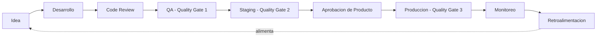
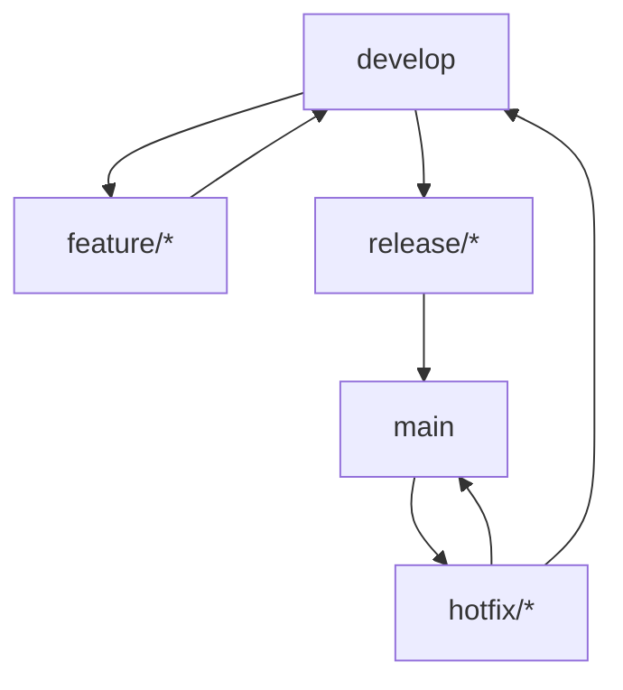
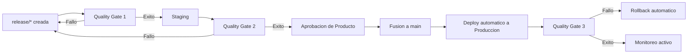
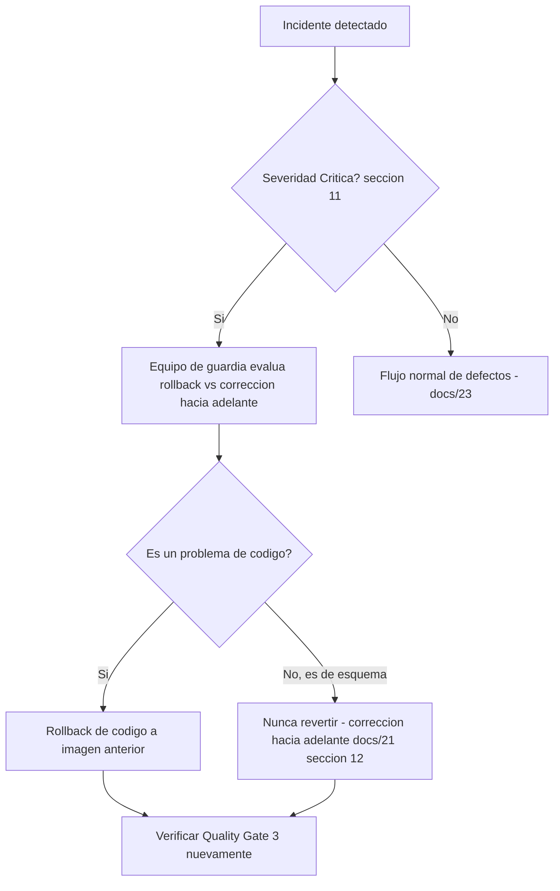
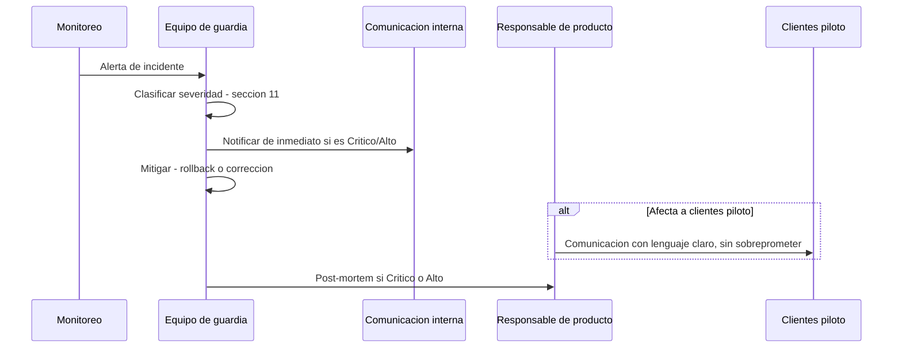

# Plan de Liberación de Versiones — ContaIA

## Control del documento

| Campo                             | Valor                                                                                                                                                                                                                                                                                                                                                                                                                                                                                                                                                                                                                                                                                                                                                                                                             |
| --------------------------------- | ----------------------------------------------------------------------------------------------------------------------------------------------------------------------------------------------------------------------------------------------------------------------------------------------------------------------------------------------------------------------------------------------------------------------------------------------------------------------------------------------------------------------------------------------------------------------------------------------------------------------------------------------------------------------------------------------------------------------------------------------------------------------------------------------------------------- |
| Documento                         | 24_RELEASE_PLAN.md                                                                                                                                                                                                                                                                                                                                                                                                                                                                                                                                                                                                                                                                                                                                                                                                |
| Orden de trabajo                  | AWO-020                                                                                                                                                                                                                                                                                                                                                                                                                                                                                                                                                                                                                                                                                                                                                                                                           |
| Versión                           | 1.0                                                                                                                                                                                                                                                                                                                                                                                                                                                                                                                                                                                                                                                                                                                                                                                                               |
| **Estado**                        | **Draft v1.0**                                                                                                                                                                                                                                                                                                                                                                                                                                                                                                                                                                                                                                                                                                                                                                                                    |
| Fecha de creación                 | 2026-07-19                                                                                                                                                                                                                                                                                                                                                                                                                                                                                                                                                                                                                                                                                                                                                                                                        |
| Última actualización              | 2026-07-19                                                                                                                                                                                                                                                                                                                                                                                                                                                                                                                                                                                                                                                                                                                                                                                                        |
| Fuentes de verdad                 | `MASTER_CONTEXT.md`, `docs/00_PRODUCT_VISION.md`, `docs/01_PRD.md`, `docs/02_USER_PERSONAS.md`, `docs/04_BUSINESS_RULES.md`, `docs/05_SYSTEM_DOMAIN_MODEL.md`, `docs/06_SYSTEM_WORKFLOWS.md`, `docs/07_SOFTWARE_ARCHITECTURE.md`, `docs/08_API_DESIGN.md`, `docs/09_DATABASE_DESIGN.md`, `docs/10_AI_ARCHITECTURE.md`, `docs/11_SECURITY_ARCHITECTURE.md`, `docs/12_FRONTEND_ARCHITECTURE.md`, `docs/13_DESIGN_SYSTEM.md`, `docs/14_INFORMATION_ARCHITECTURE.md`, `docs/15_UX_FLOWS.md`, `docs/16_WIREFRAMES_SPECIFICATION.md`, `docs/17_PROTOTYPE_SPECIFICATION.md`, `docs/18_UI_SPECIFICATION.md`, `docs/19_FRONTEND_IMPLEMENTATION_PLAN.md`, `docs/20_BACKEND_IMPLEMENTATION_PLAN.md`, `docs/21_DATABASE_MIGRATION_PLAN.md`, `docs/22_INFRASTRUCTURE_IMPLEMENTATION_PLAN.md`, `docs/23_TESTING_AND_QA_PLAN.md` |
| Documentos que este plan alimenta | `docs/25_DEVOPS.md` (ver "Observaciones del Arquitecto")                                                                                                                                                                                                                                                                                                                                                                                                                                                                                                                                                                                                                                                                                                                                                          |

> Nota sobre numeración: la Work Order referenciaba `docs/03_BUSINESS_RULES.md`, `docs/04_SYSTEM_DOMAIN_MODEL.md` y `docs/05_SYSTEM_WORKFLOWS.md` — nombres desactualizados por renumeraciones ya corregidas; se usan las rutas reales (`docs/04`, `docs/05`, `docs/06`). `docs/24` **no presentó colisión** — quinta y última confirmación del bloque reservado original (`MASTER_CONTEXT.md` sección 27.4): `docs/19` a `docs/24` quedan ahora completos. `docs/25_DEVOPS.md` ya existe con el nombre correcto (reubicado durante la Maintenance Work Order, ver `MASTER_CONTEXT.md` sección 27.2) — no habrá colisión para la siguiente Work Order, solo falta escribir su contenido real. Ver "Observaciones del Arquitecto".

> Este documento cierra la serie de seis planes de implementación (`docs/19` a `docs/24`). No escribe scripts de despliegue — define el proceso que esos scripts deberán ejecutar, apoyado íntegramente en el pipeline de CI/CD ya diseñado en `docs/22_INFRASTRUCTURE_IMPLEMENTATION_PLAN.md` (sección 6) y en los Quality Gates ya definidos en `docs/23_TESTING_AND_QA_PLAN.md` (sección 15).

---

## Principios de la liberación

Toda liberación debe ser repetible, automatizable, reversible, auditable, monitoreada, documentada y compatible con CI/CD — instrucción explícita de esta Work Order. **Nunca se permiten despliegues manuales directamente sobre producción** — mismo principio ya fijado en `docs/21_DATABASE_MIGRATION_PLAN.md` (migraciones) y `docs/22_INFRASTRUCTURE_IMPLEMENTATION_PLAN.md` (despliegue de contenedores), extendido aquí al proceso de liberación completo.

## 1. Objetivo del Release Plan

**Propósito:** definir un proceso repetible, seguro y auditable para mover una versión de ContaIA desde el desarrollo hasta producción, minimizando riesgo y tiempo de inactividad.

**Alcance:** toda versión de la aplicación (Frontend + Backend + esquema de base de datos) que se libera a cualquier ambiente compartido (QA, Staging, Producción) — no cubre el trabajo individual en Local o Development, ya cubiertos por `docs/22_INFRASTRUCTURE_IMPLEMENTATION_PLAN.md` (sección 3).

**Exclusiones:** scripts de despliegue concretos; selección de herramienta de CI/CD (ya con su pipeline conceptual fijado en `docs/22`, sin nombrar herramienta); contenido técnico de `docs/25_DEVOPS.md` (este documento lo prepara, no lo redacta).

**Responsabilidades:** ver sección 14 — ningún rol asume por sí solo la decisión de liberar una versión; es siempre una decisión compartida entre Producto (aprobación funcional), QA (Quality Gates) y DevOps (ejecución técnica).

## 2. Estrategia de versionado

Semantic Versioning (SemVer: `MAJOR.MINOR.PATCH`), aplicado sobre la aplicación completa (no por módulo individual, coherente con el monolito modular de `docs/07_SOFTWARE_ARCHITECTURE.md` AD-01):

| Tipo                            | Cuándo incrementa                                                                                                                                                             | Ejemplo en ContaIA                                                                                             |
| ------------------------------- | ----------------------------------------------------------------------------------------------------------------------------------------------------------------------------- | -------------------------------------------------------------------------------------------------------------- |
| **Major**                       | Cambio incompatible de API (`docs/08_API_DESIGN.md` sección 18) o transición de fase del roadmap de producto (MVP → Beta → V1 → V2 → Enterprise, `docs/01_PRD.md` sección 17) | Activación de un nuevo Agente de IA que cambia el contrato de respuesta; integración real con un PAC (Etapa 4) |
| **Minor**                       | Nueva funcionalidad compatible, sin romper contratos existentes                                                                                                               | Un nuevo módulo del roadmap de `docs/19`/`docs/20` completa su Definition of Done                              |
| **Patch**                       | Corrección de defecto sin cambio de comportamiento esperado                                                                                                                   | Corrección de un defecto de severidad Alta o Crítica (`docs/23_TESTING_AND_QA_PLAN.md` sección 14)             |
| **Release Candidate** (`-rc.N`) | Versión candidata a Minor/Major, en validación en Staging antes de confirmarse                                                                                                | `1.2.0-rc.1` durante la Fase Staging del ciclo de liberación (sección 3)                                       |
| **Hotfix** (`X.Y.(Z+1)-hotfix`) | Corrección urgente de un defecto Crítico ya en producción, fuera del ciclo normal                                                                                             | Ver sección 4 (rama `hotfix`) y sección 9 (rollback)                                                           |

## 3. Ciclo de liberación

```
Idea → Desarrollo → Code Review → QA → Staging → Aprobación → Producción → Monitoreo → Retroalimentación
```

| Etapa             | Artefacto/documento asociado                                                                                                                                                               |
| ----------------- | ------------------------------------------------------------------------------------------------------------------------------------------------------------------------------------------ |
| Idea              | Alcance ya validado contra `docs/01_PRD.md`; ideas nuevas no aprobadas se registran en `brain/IDEAS.md`, nunca se implementan directamente                                                 |
| Desarrollo        | Sigue `docs/19_FRONTEND_IMPLEMENTATION_PLAN.md` / `docs/20_BACKEND_IMPLEMENTATION_PLAN.md`, con pruebas unitarias desde el inicio (Shift Left, `docs/23_TESTING_AND_QA_PLAN.md` sección 2) |
| Code Review       | Revisión de código obligatoria antes de fusionar (`docs/21_DATABASE_MIGRATION_PLAN.md` sección 2 para migraciones, mismo estándar para código de aplicación)                               |
| QA                | Quality Gate 1 (`docs/23_TESTING_AND_QA_PLAN.md` sección 15) — cobertura, seguridad automatizada, accesibilidad                                                                            |
| Staging           | Quality Gate 2 — E2E completo, migraciones validadas, aprobación de segundo revisor para cambios no aditivos                                                                               |
| Aprobación        | Responsable de producto confirma cumplimiento funcional contra los criterios de aceptación de `docs/01_PRD.md` (sección 20)                                                                |
| Producción        | Despliegue automático vía pipeline (`docs/22_INFRASTRUCTURE_IMPLEMENTATION_PLAN.md` sección 6), nunca manual                                                                               |
| Monitoreo         | Quality Gate 3 — smoke tests, observabilidad activa (`docs/22` sección 10)                                                                                                                 |
| Retroalimentación | Métricas de `docs/01_PRD.md` (sección 15) y KPIs de este documento (sección 15); hallazgos no resueltos se registran en `brain/IMPROVEMENTS.md` o `brain/QUESTIONS.md`                     |



## 4. Estrategia de ramas

| Rama        | Responsabilidad                                                                                                                                                                                                                               |
| ----------- | --------------------------------------------------------------------------------------------------------------------------------------------------------------------------------------------------------------------------------------------- |
| `main`      | Refleja exactamente lo desplegado en producción — nunca recibe un commit directo, solo fusiones desde `release`/`hotfix` ya aprobadas                                                                                                         |
| `develop`   | Integración continua del trabajo en curso — base de toda rama `feature`; corresponde al ambiente Development de `docs/22_INFRASTRUCTURE_IMPLEMENTATION_PLAN.md` (sección 3)                                                                   |
| `feature/*` | Una rama por unidad de trabajo (un módulo, una corrección no urgente); se fusiona a `develop` solo tras pasar Quality Gate 1                                                                                                                  |
| `release/*` | Rama de estabilización de una versión candidata — recibe correcciones de última hora, nunca funcionalidad nueva; corresponde a la etapa Staging del ciclo de liberación (sección 3)                                                           |
| `hotfix/*`  | Ramifica directamente desde `main`, para corregir un defecto Crítico ya en producción sin esperar el ciclo completo (sección 9); se fusiona de vuelta a `main` **y** a `develop` para no perder la corrección en la siguiente release regular |



## 5. Criterios de entrada

Ninguna liberación inicia su ciclo (sección 3, etapa Staging) sin:

- Pruebas aprobadas: Quality Gate 1 en verde (`docs/23_TESTING_AND_QA_PLAN.md` sección 15).
- Cobertura mínima: sin reducción respecto a la versión anterior en ningún módulo Crítico (`docs/23` sección 4).
- Migraciones validadas: aplicadas limpiamente en CI y probadas en un ambiente con datos representativos (`docs/21_DATABASE_MIGRATION_PLAN.md` sección 16).
- Documentación actualizada: todo cambio de contrato de API refleja `docs/08_API_DESIGN.md`; todo cambio de esquema refleja `docs/09_DATABASE_DESIGN.md` — ninguna liberación documenta un comportamiento que los documentos de arquitectura no respaldan.
- Revisión de seguridad: escaneo automatizado sin vulnerabilidades críticas sin parche (`docs/22_INFRASTRUCTURE_IMPLEMENTATION_PLAN.md` sección 13).
- Aprobación funcional: responsable de producto confirma que la versión cumple los criterios de aceptación del alcance incluido.

## 6. Quality Gates

Este documento **no define nuevos Quality Gates** — reutiliza íntegramente los tres ya definidos en `docs/23_TESTING_AND_QA_PLAN.md` (sección 15), integrados en el ciclo de liberación (sección 3):

| Gate           | Ubicación en el ciclo de liberación  | Bloquea el avance a          |
| -------------- | ------------------------------------ | ---------------------------- |
| Quality Gate 1 | Tras Code Review, antes de QA        | Staging                      |
| Quality Gate 2 | Al final de Staging                  | Aprobación de Producto       |
| Quality Gate 3 | Inmediatamente después de Producción | Cierre del ciclo (Monitoreo) |

## 7. Estrategias de despliegue

| Estrategia             | Descripción                                                                                                                                                                      | Etapa de uso                                                                                                                                                                                                 |
| ---------------------- | -------------------------------------------------------------------------------------------------------------------------------------------------------------------------------- | ------------------------------------------------------------------------------------------------------------------------------------------------------------------------------------------------------------ |
| **Rolling Deployment** | Reemplazo gradual de instancias, una a la vez, verificando salud antes de continuar — ya descrito conceptualmente en `docs/22_INFRASTRUCTURE_IMPLEMENTATION_PLAN.md` (sección 6) | **MVP** — no requiere infraestructura duplicada, coherente con el principio de evitar complejidad prematura (`MASTER_CONTEXT.md` 10.9)                                                                       |
| **Blue/Green**         | Dos entornos productivos completos (activo/en espera); el tráfico se conmuta de golpe tras validar el entorno en espera                                                          | **Crecimiento** — requiere la redundancia de instancias ya prevista en esa fase (`docs/22` sección 14, ~1,000-10,000 usuarios); permite rollback instantáneo por conmutación, no por reversión de despliegue |
| **Canary**             | Una fracción pequeña del tráfico se enruta a la nueva versión antes de liberarla por completo, con monitoreo comparativo                                                         | **Empresarial** — requiere el enrutamiento sofisticado y la observabilidad granular ya previstas para Kubernetes administrado (`docs/22` sección 5)                                                          |

**Regla de evolución:** el salto de estrategia ocurre cuando la infraestructura de la fase correspondiente ya está operativa (`docs/22_INFRASTRUCTURE_IMPLEMENTATION_PLAN.md` sección 16), nunca antes — adoptar Canary en el MVP sin la observabilidad necesaria generaría una falsa sensación de seguridad.

## 8. Gestión de migraciones

Coordinación directa con `docs/21_DATABASE_MIGRATION_PLAN.md`, sin rediseñarla:

- **Migraciones y despliegues:** toda migración se aplica automáticamente como parte del pipeline (`docs/22` sección 6), **antes** de que el nuevo código empiece a recibir tráfico — el patrón expand/contract (`docs/21` sección 5) garantiza que el código anterior sigue funcionando durante la transición.
- **Rollback:** el rollback de código (sección 9) **nunca** implica revertir una migración ya aplicada — coherente con `docs/21_DATABASE_MIGRATION_PLAN.md` (sección 12): toda corrección de esquema es hacia adelante, nunca una reversión destructiva sobre datos ya escritos.
- **Validaciones posteriores:** confirmación de que la migración aplicó su versión esperada (comparando contra el historial de Prisma) como parte de las verificaciones posteriores al despliegue (`docs/22` sección 6).

## 9. Rollback

**Distinción explícita, heredada de `docs/21_DATABASE_MIGRATION_PLAN.md` (sección 12):** el rollback de esta sección es sobre **código de aplicación** (revertir a la imagen de contenedor anterior) — nunca sobre el esquema de base de datos, que solo se corrige hacia adelante.

| Causa                                                                     | Procedimiento                                                                                                                                                                                          | Tiempo objetivo (referencia)                                                                                                          |
| ------------------------------------------------------------------------- | ------------------------------------------------------------------------------------------------------------------------------------------------------------------------------------------------------ | ------------------------------------------------------------------------------------------------------------------------------------- |
| Fallo crítico detectado por Quality Gate 3 (smoke test)                   | Rollback automático a la imagen anterior, sin intervención humana                                                                                                                                      | Inmediato — parte del propio pipeline (`docs/22` sección 6)                                                                           |
| Error funcional detectado después del despliegue (no capturado por smoke) | Evaluación de severidad (`docs/23_TESTING_AND_QA_PLAN.md` sección 14); si es Crítico, rollback manual iniciado por el equipo de guardia                                                                | **≤ 15 minutos desde la detección** (valor de referencia, sujeto a ajuste con datos reales — mismo principio de `docs/22` sección 12) |
| Problema de rendimiento bajo carga real                                   | Evaluación si es reversible por rollback o requiere una corrección hacia adelante (por ejemplo, un índice faltante)                                                                                    | Depende del diagnóstico; nunca se fuerza un rollback si el problema es de datos, no de código                                         |
| Incompatibilidad detectada entre versión de código y esquema              | Solo posible si se omitió el patrón expand/contract (sección 8) — indica una falla de proceso, no solo un defecto; requiere revisión de por qué el criterio de entrada (sección 5) no lo detectó antes |

**Criterio de activación:** cualquier defecto de severidad Crítica en producción (`docs/23_TESTING_AND_QA_PLAN.md` sección 14) activa la evaluación de rollback de inmediato — la decisión de ejecutar o no el rollback (frente a una corrección hacia adelante rápida) la toma el equipo de guardia según cuál sea más rápido y seguro en ese momento específico.

## 10. Validación posterior al despliegue

| Validación               | Descripción                                                                                                                                                                                                                                                                                                                                                               |
| ------------------------ | ------------------------------------------------------------------------------------------------------------------------------------------------------------------------------------------------------------------------------------------------------------------------------------------------------------------------------------------------------------------------- |
| Smoke Tests              | Los flujos de prioridad Crítica (`docs/23_TESTING_AND_QA_PLAN.md` sección 21), ejecutados automáticamente inmediatamente después del despliegue                                                                                                                                                                                                                           |
| Monitoreo                | Observabilidad activa (`docs/22_INFRASTRUCTURE_IMPLEMENTATION_PLAN.md` sección 10) durante una ventana de vigilancia reforzada tras cada despliegue                                                                                                                                                                                                                       |
| Validaciones funcionales | Verificación manual breve de los criterios de aceptación del alcance incluido, por el responsable de producto, dentro de las primeras horas                                                                                                                                                                                                                               |
| **Verificación de IA**   | Un conjunto reducido de preguntas canónicas (subconjunto de la suite de `docs/23_TESTING_AND_QA_PLAN.md` sección 6) ejecutado contra el pipeline real de IA en producción — confirma que el Agente supervisor de calidad, la recuperación RAG y el enrutamiento a revisión humana siguen operando de extremo a extremo, sin repetir la suite exhaustiva de pre-liberación |
| Métricas                 | Confirmación de que las métricas de `docs/01_PRD.md` (sección 15) siguen dentro de rango esperado — cualquier desviación abrupta dispara una alerta, no espera al siguiente ciclo de retroalimentación                                                                                                                                                                    |

## 11. Gestión de incidentes

Adapta la clasificación de severidad de `docs/23_TESTING_AND_QA_PLAN.md` (sección 14) al contexto de producción:

| Severidad   | Ejemplo                                                                                                                                     | Flujo de atención                                                                                                                                                               |
| ----------- | ------------------------------------------------------------------------------------------------------------------------------------------- | ------------------------------------------------------------------------------------------------------------------------------------------------------------------------------- |
| **Crítico** | Fuga de datos entre Empresas (BR-GLB-001), brecha de seguridad, una acción sensible ejecutada sin revisión humana, caída total del servicio | Activación inmediata del equipo de guardia; evaluación de rollback (sección 9) en paralelo al diagnóstico; comunicación interna inmediata (sección 12); post-mortem obligatorio |
| **Alto**    | Un flujo Crítica (`docs/23` sección 21) roto sin alternativa — por ejemplo, imposible aprobar Pólizas                                       | Atención en la misma jornada; rollback si es la vía más rápida; comunicación a clientes piloto afectados si aplica                                                              |
| **Medio**   | Un flujo Alta/Media degradado, con solución alterna disponible                                                                              | Atención dentro del ciclo normal de corrección de defectos, sin rollback de emergencia                                                                                          |
| **Bajo**    | Cosmético o de bajo impacto                                                                                                                 | Registrado y priorizado en el backlog normal                                                                                                                                    |

**Post-mortem:** obligatorio para todo incidente Crítico o Alto, sin buscar culpables individuales — su único propósito es identificar si un criterio de entrada (sección 5) o un Quality Gate (sección 6) debió haberlo detectado antes, y corregir ese proceso.

## 12. Comunicación

| Tipo                      | Estrategia                                                                                                                                                                                                                                                                                            |
| ------------------------- | ----------------------------------------------------------------------------------------------------------------------------------------------------------------------------------------------------------------------------------------------------------------------------------------------------- |
| Release Notes             | En español (coherente con `CLAUDE.md`), redactadas en lenguaje claro (`docs/13_DESIGN_SYSTEM.md` sección 14) — nunca prometen más de lo que la versión realmente entrega (mismo principio de honestidad ya aplicado a la IA, `MASTER_CONTEXT.md` 10.10, extendido aquí a la comunicación de producto) |
| Comunicación interna      | Anuncio en el canal de trabajo del equipo antes y después de cada despliegue a producción, incluido el resultado de Quality Gate 3                                                                                                                                                                    |
| Comunicación a clientes   | Solo para clientes piloto activos (`docs/01_PRD.md`); nunca se comunica una funcionalidad como disponible antes de que supere Quality Gate 3 en producción real                                                                                                                                       |
| Ventanas de mantenimiento | Comunicadas con anticipación para cambios de alto riesgo (`MASTER_CONTEXT.md` sección 17); un Rolling Deployment de un cambio compatible no requiere ventana anunciada                                                                                                                                |
| Cambios incompatibles     | Cualquier versión Major (sección 2) que afecte un contrato de API consumido externamente se comunica con antelación suficiente para que los consumidores se preparen (`docs/08_API_DESIGN.md` sección 18) — no aplica en el MVP, dado que no existe API pública todavía (`docs/08` sección 23)        |

## 13. Calendario de liberaciones

| Tipo                         | Frecuencia de referencia                                                                                                                                                                                                                                                     |
| ---------------------------- | ---------------------------------------------------------------------------------------------------------------------------------------------------------------------------------------------------------------------------------------------------------------------------- |
| Releases programados (Minor) | En el MVP, bajo demanda conforme cada módulo completa su Definition of Done (`docs/19`/`docs/20`) — sin una cadencia fija impuesta artificialmente; una cadencia regular (por ejemplo, quincenal) se evalúa una vez que exista uso real de clientes piloto que la justifique |
| Hotfixes                     | Sin calendario — se liberan tan pronto como la corrección pasa Quality Gate 1 y 2 de forma acelerada (rama `hotfix`, sección 4), nunca esperando el siguiente release programado si la severidad es Crítica                                                                  |
| Parches                      | Agrupados en el siguiente release programado si son de severidad Media/Baja; inmediatos si son Alta/Crítica (mismo criterio que hotfix)                                                                                                                                      |
| Liberaciones extraordinarias | Reservadas para cambios de alto riesgo que requieren ventana de mantenimiento explícita (sección 12) — por ejemplo, una migración incompatible de gran volumen (`docs/21_DATABASE_MIGRATION_PLAN.md` sección 5)                                                              |

## 14. Roles y responsabilidades

| Rol          | Responsabilidad en el ciclo de liberación                                                                                                                                                     |
| ------------ | --------------------------------------------------------------------------------------------------------------------------------------------------------------------------------------------- |
| Desarrollo   | Implementa, escribe y mantiene pruebas automatizadas (`docs/23` sección 5), participa en Code Review                                                                                          |
| QA           | Ejecuta y valida los tres Quality Gates, coordina pruebas exploratorias y de usabilidad (`docs/23` sección 3)                                                                                 |
| DevOps       | Opera el pipeline de CI/CD, ejecuta el despliegue automatizado, responde a alertas de monitoreo (`docs/22` sección 10)                                                                        |
| Producto     | Aprueba funcionalmente cada release (etapa "Aprobación", sección 3), prioriza el alcance, redacta o revisa las Release Notes                                                                  |
| Arquitectura | Revisa que ninguna liberación contradiga las decisiones ya aprobadas en la serie `docs/00` a `docs/24`; mantiene la consistencia documental (mismo rol ya ejercido en cada AWO de esta serie) |
| Soporte      | Atiende incidentes reportados por clientes piloto, escala según la clasificación de la sección 11, alimenta `brain/IMPROVEMENTS.md` con hallazgos recurrentes                                 |

## 15. KPIs del proceso

| KPI                           | Definición                                                                                                                                                                                      |
| ----------------------------- | ----------------------------------------------------------------------------------------------------------------------------------------------------------------------------------------------- |
| Frecuencia de despliegues     | Número de releases exitosos por periodo — señal de fluidez del proceso, no una meta a maximizar por sí misma                                                                                    |
| Tasa de éxito                 | Porcentaje de despliegues que no requirieron rollback (mismo KPI ya definido en `docs/23_TESTING_AND_QA_PLAN.md` sección 20, reutilizado aquí como indicador central del proceso de liberación) |
| Tiempo de recuperación (MTTR) | Desde la detección de un incidente hasta su resolución, correlacionado con el tiempo objetivo de rollback de la sección 9                                                                       |
| Defectos post-release         | Igual definición que `docs/23` sección 20, segmentado por versión                                                                                                                               |
| Disponibilidad                | Consecuencia observada de este proceso, correlacionada con los objetivos cualitativos de `docs/22_INFRASTRUCTURE_IMPLEMENTATION_PLAN.md` (sección 11) — sin SLA contractual fijo en el MVP      |

## 16. Riesgos

- **Despliegues fallidos:** mitigado por Quality Gate 3 y rollback automático (sección 9); el riesgo residual es un fallo no capturado por smoke tests — mitigado ampliando la suite de smoke conforme se detecten huecos reales.
- **Migraciones:** el riesgo de mayor severidad es que una migración incompatible se libere sin haber seguido expand/contract — mitigado por el criterio de entrada de la sección 5 y la revisión de código obligatoria de `docs/21_DATABASE_MIGRATION_PLAN.md` (sección 2).
- **Terceros:** la caída de un proveedor de IA durante una ventana de despliegue puede confundirse con un fallo del propio despliegue — mitigado por la verificación de IA separada de la sección 10, que aísla la causa.
- **Infraestructura:** un despliegue durante un pico de carga real (cierre mensual, `docs/02_USER_PERSONAS.md`) aumenta el riesgo percibido de cualquier incidente — mitigado evitando programar liberaciones no urgentes durante esas ventanas conocidas (sección 13).
- **IA:** un cambio de prompt de sistema o de modelo liberado sin pasar por la evaluación de `docs/10_AI_ARCHITECTURE.md` (sección 20) podría degradar la calidad de fundamento sin que ningún Quality Gate técnico lo detecte — mitigado por incluir explícitamente esa evaluación como parte del criterio de entrada para cualquier release que toque el módulo AI.
- **SAT/PAC:** el riesgo de mayor severidad regulatoria de todo este documento sería que un release activara accidentalmente el punto de conexión reservado hacia el SAT o un PAC (`docs/07`/`docs/20`/`docs/22`, todos ya con este mismo punto de conexión marcado como inactivo) sin aprobación explícita del responsable de producto para entrar a la Etapa 4 — este Release Plan no habilita esa activación por sí mismo; requeriría una decisión de alcance registrada en `brain/DECISIONS.md`, no solo un release ordinario.

## 17. Roadmap

| Fase             | Evolución del proceso de liberación                                                                                                                                                                                                                                                                                          |
| ---------------- | ---------------------------------------------------------------------------------------------------------------------------------------------------------------------------------------------------------------------------------------------------------------------------------------------------------------------------- |
| **MVP**          | Rolling Deployment (sección 7); ciclo de liberación bajo demanda (sección 13); rollback manual con tiempo objetivo de referencia; un solo ambiente productivo                                                                                                                                                                |
| **Escalamiento** | Blue/Green (sección 7) conforme la redundancia de `docs/22_INFRASTRUCTURE_IMPLEMENTATION_PLAN.md` (sección 14, ~1,000-10,000 usuarios) esté operativa; cadencia de liberación más regular una vez validada con uso real; KPIs de la sección 15 con series históricas suficientes para fijar metas concretas                  |
| **Enterprise**   | Canary (sección 7) sobre Kubernetes administrado; posible ventana de liberación continua para cambios de bajo riesgo, reservando ventanas planificadas solo para cambios de alto riesgo; integración real con PAC (si la Etapa 4 ya fue aprobada) con su propio proceso de liberación reforzado, dado su impacto regulatorio |

## 18. Diagramas Mermaid

Release Flow y Git Flow ya incluidos (secciones 3 y 4). Se agregan los restantes:

### 18.1 Pipeline



### 18.2 Rollback



### 18.3 Comunicación de incidentes



## 19. Matriz de liberaciones

| Tipo de release   | Frecuencia                                  | Riesgo                                         | Aprobación                                     | Rollback                                            | Documentación requerida                                                    |
| ----------------- | ------------------------------------------- | ---------------------------------------------- | ---------------------------------------------- | --------------------------------------------------- | -------------------------------------------------------------------------- |
| Major             | Baja (alineada a fases de `docs/01_PRD.md`) | Alto                                           | Responsable de producto + Arquitectura         | Planificado, con ventana de mantenimiento si aplica | Release Notes detalladas, comunicación anticipada de cambios incompatibles |
| Minor             | Bajo demanda (sección 13)                   | Medio                                          | Responsable de producto                        | Automático vía rollback de código                   | Release Notes estándar                                                     |
| Patch             | Según severidad del defecto corregido       | Bajo-Medio                                     | QA + DevOps                                    | Automático                                          | Nota breve de corrección                                                   |
| Release Candidate | Una por Minor/Major, en Staging             | Bajo (no productivo)                           | QA                                             | No aplica (no es producción)                        | Ninguna externa                                                            |
| Hotfix            | Sin calendario, ante severidad Crítica      | Alto (por la urgencia, no por el cambio en sí) | Responsable de producto (aprobación acelerada) | Prioritario, tiempo objetivo de la sección 9        | Post-mortem obligatorio                                                    |

## 20. Definition of Done

Una versión se considera lista para liberar solo cuando:

- **QA aprueba:** Quality Gate 2 en verde, sin defectos de severidad Crítica abiertos.
- **CI/CD es exitoso:** el pipeline completo (`docs/22_INFRASTRUCTURE_IMPLEMENTATION_PLAN.md` sección 6) se ejecuta sin intervención manual, de principio a fin.
- **Seguridad validada:** escaneo automatizado y, para releases Major, revisión de seguridad dirigida (`docs/23_TESTING_AND_QA_PLAN.md` sección 9).
- **Monitoreo activo:** los tableros de observabilidad (`docs/22` sección 10) están operativos antes del primer usuario real de la nueva versión.
- **Documentación actualizada:** ningún documento de la serie `docs/00` a `docs/24` queda contradicho por el comportamiento real de la versión liberada.
- **Rollback disponible:** probado, no solo diseñado — mismo estándar ya exigido para migraciones en `docs/21_DATABASE_MIGRATION_PLAN.md` (sección 21).

## 21. MVP

**Estrategia mínima de liberación para el lanzamiento inicial:**

- Rolling Deployment (sección 7) sobre un solo ambiente productivo, sin Blue/Green ni Canary.
- Ciclo de liberación completo (sección 3) para cada Minor; rama `hotfix` disponible desde el primer día para defectos Críticos.
- Los tres Quality Gates de `docs/23_TESTING_AND_QA_PLAN.md` (sección 15) activos sin excepción desde la primera liberación a producción — no se posponen "para después del lanzamiento".
- Rollback de código automatizado y probado antes de la primera liberación real; rollback de esquema siempre hacia adelante (`docs/21_DATABASE_MIGRATION_PLAN.md`).
- Comunicación a clientes piloto exclusivamente para los flujos ya cubiertos por el MVP (`docs/01_PRD.md` sección 4) — ninguna Release Note sugiere cobertura fiscal o funcionalidad más allá de lo realmente entregado.
- Sin cadencia fija de calendario (sección 13) — se prioriza la estabilidad de cada release individual sobre la velocidad, coherente con el objetivo del MVP de "validar que el modelo funciona" (`docs/01_PRD.md` sección 3), no de maximizar frecuencia de entrega.

## 22. Recomendaciones para DevOps

- `docs/25_DEVOPS.md` debe consolidar en un solo documento operativo la ejecución concreta de lo ya diseñado en `docs/22_INFRASTRUCTURE_IMPLEMENTATION_PLAN.md` (infraestructura) y este documento (proceso de liberación) — no debe rediseñar ninguno de los dos, solo detallar su ejecución día a día (runbooks, procedimientos de guardia, checklist operativo).
- Debe incorporar los procedimientos de post-mortem (sección 11) como plantilla operativa reutilizable.
- Debe definir el calendario real de simulacros de recuperación (`docs/22_INFRASTRUCTURE_IMPLEMENTATION_PLAN.md` sección 12), coordinado con el calendario de liberaciones de este documento (sección 13) para no solaparlos.

Este documento no despliega ninguna versión — entrega el proceso completo para que `docs/25_DEVOPS.md` lo convierta en operación diaria.

---

## Historial de cambios

| Fecha      | Cambio                                                                                                                                                                                                                                                                                                                                                                                                                                                                                                                                                                                                                                                                                                                                                                                                                                                                                                                                                                                                                                                                                                                                                                                                                          | Responsable                        |
| ---------- | ------------------------------------------------------------------------------------------------------------------------------------------------------------------------------------------------------------------------------------------------------------------------------------------------------------------------------------------------------------------------------------------------------------------------------------------------------------------------------------------------------------------------------------------------------------------------------------------------------------------------------------------------------------------------------------------------------------------------------------------------------------------------------------------------------------------------------------------------------------------------------------------------------------------------------------------------------------------------------------------------------------------------------------------------------------------------------------------------------------------------------------------------------------------------------------------------------------------------------- | ---------------------------------- |
| 2026-07-19 | Creación de la primera versión completa de `docs/24_RELEASE_PLAN.md` bajo AWO-020: estrategia de versionado SemVer ligada a las fases del roadmap de producto; ciclo de liberación completo de 9 etapas; Git Flow con 5 tipos de rama; criterios de entrada; Quality Gates reutilizados íntegramente de `docs/23_TESTING_AND_QA_PLAN.md` sin duplicarlos; 3 estrategias de despliegue (Rolling/Blue-Green/Canary) mapeadas a las 3 fases de infraestructura ya definidas; gestión de migraciones coordinada explícitamente con la regla de "nunca reversión destructiva" de `docs/21_DATABASE_MIGRATION_PLAN.md`; rollback de código distinguido explícitamente del rollback de esquema; validación posterior al despliegue incluyendo verificación específica de IA; gestión de incidentes por severidad; comunicación con principio de no sobreprometer; calendario de liberaciones sin cadencia fija inventada; roles y responsabilidades; KPIs; riesgos (incluido el riesgo de activación accidental del punto de conexión SAT/PAC reservado); roadmap de 3 fases; 5 diagramas Mermaid; matriz de liberaciones; Definition of Done; estrategia mínima de MVP; recomendaciones para `docs/25_DEVOPS.md`. Estado: Draft v1.0. | Responsable de producto de ContaIA |

---

## Observaciones del Arquitecto

**Decisiones tomadas:**

- Se distinguió explícitamente, en la sección 9, el rollback de **código de aplicación** (revertir a la imagen de contenedor anterior, rápido y seguro) del rollback de **esquema de base de datos** (que `docs/21_DATABASE_MIGRATION_PLAN.md` ya prohíbe hacer de forma destructiva, siempre corrección hacia adelante) — evita que un lector futuro asuma que "rollback" significa lo mismo en ambos contextos, un error que podría llevar a intentar revertir una migración ya aplicada sobre datos de producción.
- Se mapearon las tres estrategias de despliegue pedidas (Rolling/Blue-Green/Canary) exactamente sobre las tres fases de infraestructura ya definidas en `docs/22_INFRASTRUCTURE_IMPLEMENTATION_PLAN.md` (MVP/Crecimiento/Empresarial), en vez de proponer una escala de madurez paralela e inconsistente.
- Se identificó explícitamente, en la sección 16, el riesgo de que un release activara accidentalmente el punto de conexión reservado hacia el SAT o un PAC — ninguna Work Order de esta serie lo había planteado como riesgo de _proceso de liberación_ específicamente (antes se trató como riesgo de arquitectura/implementación); se declaró aquí que este documento no autoriza esa activación por sí mismo, que requeriría una decisión de alcance registrada en `brain/DECISIONS.md`.
- Se propuso un tiempo objetivo de referencia para rollback manual (≤ 15 minutos desde la detección) con la misma transparencia ya aplicada a RPO/RTO en `docs/22_INFRASTRUCTURE_IMPLEMENTATION_PLAN.md`: valor de diseño fundamentado, no una garantía validada con datos reales.
- Se evitó fijar una cadencia de calendario de liberaciones (sección 13) — se documentó como "bajo demanda" para el MVP, coherente con el principio de no inventar compromisos sin base real, y coherente con el objetivo del MVP de validar el modelo antes que maximizar velocidad de entrega (`docs/01_PRD.md` sección 3).

**Riesgos:** ver sección 16 completa; el de mayor severidad regulatoria es la activación accidental del punto de conexión SAT/PAC, ya explicado arriba.

**Prioridades:** ver sección 21 — los tres Quality Gates deben estar activos desde la primera liberación real, sin excepción "temporal" para acelerar el lanzamiento; es la misma disciplina ya exigida en `docs/23_TESTING_AND_QA_PLAN.md` (sección 15).

**Mejoras futuras (fuera del alcance de esta fase):**

- Fijar una cadencia de calendario concreta una vez que exista una serie histórica de KPIs (sección 15) suficiente para justificarla.
- Diseñar el proceso de liberación reforzado específico para una futura integración real con el SAT/PAC, cuando la Etapa 4 sea aprobada explícitamente.
- Evaluar la adopción temprana de Blue/Green si el costo de la redundancia adicional resulta menor de lo anticipado, antes de alcanzar el umbral de usuarios de la fase Crecimiento.

**Inconsistencias encontradas:** ninguna contradicción con las fuentes de verdad aprobadas.

**Dependencias para AWO-021 (`docs/25_DEVOPS.md`):**

- Ver sección 22 completa.
- `docs/24` no presentó colisión de numeración — quinta y última confirmación del bloque reservado original; el bloque `docs/19` a `docs/24` queda ahora completo. `docs/25_DEVOPS.md` ya existe con su nombre correcto (reubicado durante la Maintenance Work Order) — la próxima Work Order solo necesita reemplazar su contenido de marcador por contenido real, sin colisión de numeración que resolver.
- `docs/00_DOCUMENTATION_INDEX.md` y `docs/00_DOCUMENTATION_GUIDE.md` siguen sin existir; con veinticuatro documentos técnicos ya interconectados y el bloque completo de planes de implementación cerrado, la creación de un índice mantenido activamente sigue siendo la mejora estructural pendiente de mayor impacto para el proyecto — recomendación reiterada por décima vez consecutiva.
