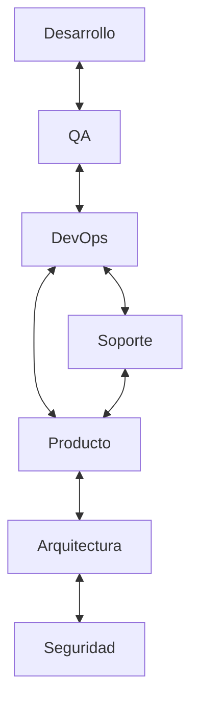
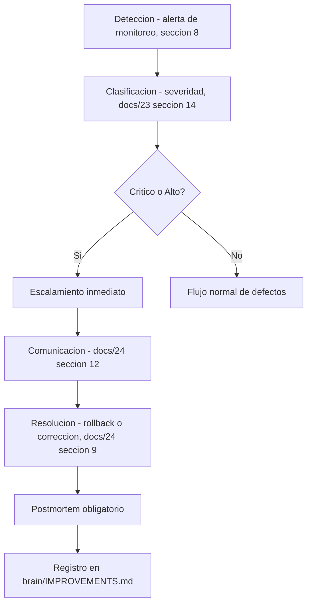
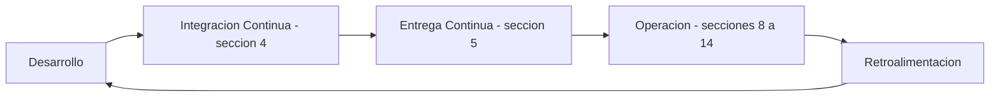
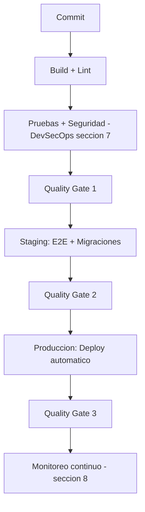
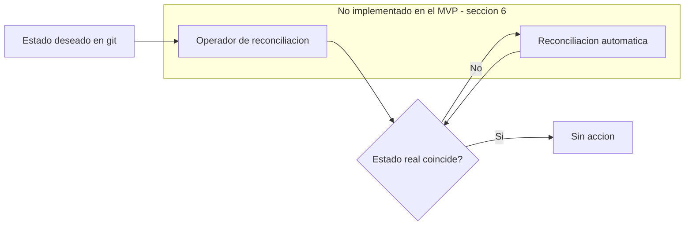
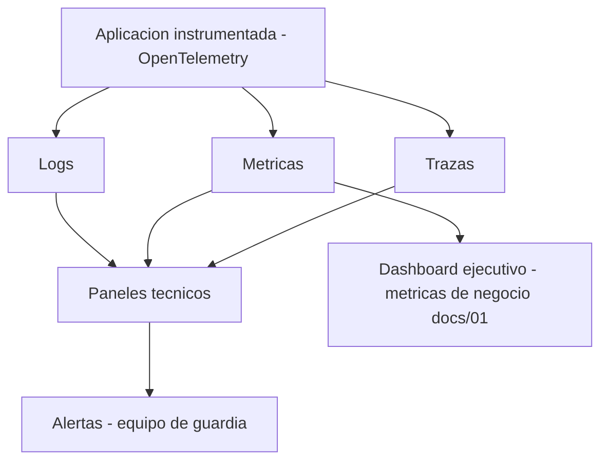
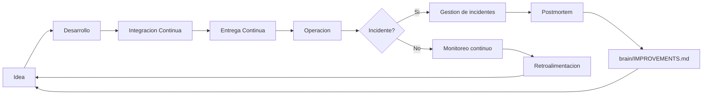

# Plan DevOps — ContaIA

## Control del documento

| Campo                             | Valor                                                                                                                                                                                                                                                                                                                                                                                                                                                                                                                                                                                                                                                                                                                                                                                                                                        |
| --------------------------------- | -------------------------------------------------------------------------------------------------------------------------------------------------------------------------------------------------------------------------------------------------------------------------------------------------------------------------------------------------------------------------------------------------------------------------------------------------------------------------------------------------------------------------------------------------------------------------------------------------------------------------------------------------------------------------------------------------------------------------------------------------------------------------------------------------------------------------------------------- |
| Documento                         | 25_DEVOPS.md                                                                                                                                                                                                                                                                                                                                                                                                                                                                                                                                                                                                                                                                                                                                                                                                                                 |
| Orden de trabajo                  | AWO-021                                                                                                                                                                                                                                                                                                                                                                                                                                                                                                                                                                                                                                                                                                                                                                                                                                      |
| Versión                           | 1.0                                                                                                                                                                                                                                                                                                                                                                                                                                                                                                                                                                                                                                                                                                                                                                                                                                          |
| **Estado**                        | **Draft v1.0**                                                                                                                                                                                                                                                                                                                                                                                                                                                                                                                                                                                                                                                                                                                                                                                                                               |
| Fecha de creación                 | 2026-07-18                                                                                                                                                                                                                                                                                                                                                                                                                                                                                                                                                                                                                                                                                                                                                                                                                                   |
| Última actualización              | 2026-07-19                                                                                                                                                                                                                                                                                                                                                                                                                                                                                                                                                                                                                                                                                                                                                                                                                                   |
| Fuentes de verdad                 | `MASTER_CONTEXT.md`, `docs/00_PRODUCT_VISION.md`, `docs/01_PRD.md`, `docs/02_USER_PERSONAS.md`, `docs/04_BUSINESS_RULES.md`, `docs/05_SYSTEM_DOMAIN_MODEL.md`, `docs/06_SYSTEM_WORKFLOWS.md`, `docs/07_SOFTWARE_ARCHITECTURE.md`, `docs/08_API_DESIGN.md`, `docs/09_DATABASE_DESIGN.md`, `docs/10_AI_ARCHITECTURE.md`, `docs/11_SECURITY_ARCHITECTURE.md`, `docs/12_FRONTEND_ARCHITECTURE.md`, `docs/13_DESIGN_SYSTEM.md`, `docs/14_INFORMATION_ARCHITECTURE.md`, `docs/15_UX_FLOWS.md`, `docs/16_WIREFRAMES_SPECIFICATION.md`, `docs/17_PROTOTYPE_SPECIFICATION.md`, `docs/18_UI_SPECIFICATION.md`, `docs/19_FRONTEND_IMPLEMENTATION_PLAN.md`, `docs/20_BACKEND_IMPLEMENTATION_PLAN.md`, `docs/21_DATABASE_MIGRATION_PLAN.md`, `docs/22_INFRASTRUCTURE_IMPLEMENTATION_PLAN.md`, `docs/23_TESTING_AND_QA_PLAN.md`, `docs/24_RELEASE_PLAN.md` |
| Documentos que este plan alimenta | Ninguno — es el último documento del Architecture Workflow. Su salida es la implementación real del proyecto, no un documento nuevo (ver sección 24).                                                                                                                                                                                                                                                                                                                                                                                                                                                                                                                                                                                                                                                                                        |

> Nota sobre numeración: la Work Order referenciaba `docs/03_BUSINESS_RULES.md`, `docs/04_SYSTEM_DOMAIN_MODEL.md` y `docs/05_SYSTEM_WORKFLOWS.md` — nombres desactualizados por renumeraciones ya corregidas; se usan las rutas reales (`docs/04`, `docs/05`, `docs/06`). `docs/25_DEVOPS.md` no presentó colisión: ya existía como marcador de estructura vacío en esta posición exacta desde la reubicación registrada en `MASTER_CONTEXT.md` (sección 27.2) — este documento reemplaza ese marcador por su contenido real, sin desplazar ningún otro archivo.

> Este documento **no rediseña** la infraestructura (`docs/22`) ni el proceso de liberación (`docs/24`) — los opera. Consolida en un solo modelo operativo lo que esos dos documentos ya diseñaron por separado, y cierra la serie completa del Architecture Workflow (`MASTER_CONTEXT.md` a `docs/24`) con la transición hacia la implementación real. No es un archivo YAML, Dockerfile, workflow ni script.

---

## Principios del modelo DevOps

La estrategia debe ser automatizada, reproducible, observable, segura, auditable, escalable, orientada a plataformas y preparada para mejora continua — instrucción explícita de esta Work Order, y la culminación natural de cada uno de esos mismos principios ya exigidos individualmente en `docs/21`, `docs/22`, `docs/23` y `docs/24`.

## 1. Objetivo del DevOps Plan

**Propósito:** definir el modelo operativo completo que permite desarrollar, desplegar, operar, monitorear, mantener y evolucionar ContaIA de forma continua, una vez que la fase de diseño (Etapa 0 de `MASTER_CONTEXT.md`, sección 16) se completa con este documento.

**Alcance:** la operación diaria de los cinco ambientes ya definidos (`docs/22_INFRASTRUCTURE_IMPLEMENTATION_PLAN.md` sección 3), el ciclo de vida completo de una versión (`docs/24_RELEASE_PLAN.md`), y la transición hacia el desarrollo real (sección 24).

**Exclusiones:** archivos YAML, Dockerfiles, workflows de CI/CD, scripts de ningún tipo; creación de documentos nuevos (sección 24 explícita); cualquier decisión ya tomada en `docs/07` a `docs/24`, que este documento consolida sin reabrir.

**Responsabilidades:** DevOps opera el pipeline y la infraestructura; Desarrollo, QA, Producto, Arquitectura, Soporte y Seguridad participan según el modelo operativo (sección 3) — ninguno de los siete roles actúa de forma aislada en una decisión que afecte a los demás.

## 2. Filosofía DevOps

DevOps en ContaIA no es una herramienta ni un equipo aislado — es la disciplina que sostiene, en la práctica diaria, los principios ya aprobados en `MASTER_CONTEXT.md` (sección 10):

| Elemento                       | Cómo se manifiesta                                                                                                                                                                                                                                                                                                                                           |
| ------------------------------ | ------------------------------------------------------------------------------------------------------------------------------------------------------------------------------------------------------------------------------------------------------------------------------------------------------------------------------------------------------------ |
| **Colaboración**               | Los siete roles de la sección 3 comparten la responsabilidad de cada liberación (`docs/24_RELEASE_PLAN.md` sección 14) — ninguno "lanza por encima del muro" a otro                                                                                                                                                                                          |
| **Automatización**             | Todo lo repetible se automatiza (`docs/22` sección 6, `docs/23` sección 5) — la intervención manual es la excepción documentada, nunca la norma                                                                                                                                                                                                              |
| **Feedback continuo**          | El ciclo de liberación termina en Retroalimentación (`docs/24_RELEASE_PLAN.md` sección 3), que alimenta la siguiente Idea — un ciclo cerrado, no lineal                                                                                                                                                                                                      |
| **Mejora continua**            | Todo post-mortem (`docs/24` sección 11) y todo hallazgo de simulacro (`docs/22` sección 12) se registra en `brain/IMPROVEMENTS.md`, nunca se descarta                                                                                                                                                                                                        |
| **Responsabilidad compartida** | Mismo principio fundamental ya aplicado a la IA (`docs/04_BUSINESS_RULES.md` sección 2: "la IA nunca decide") se extiende aquí a la operación: **ningún despliegue automático se salta un Quality Gate**, igual que ninguna Sugerencia de IA se salta la aprobación humana — la automatización ejecuta lo ya aprobado, nunca decide por sí misma qué liberar |

## 3. Modelo operativo

Extiende, sin repetir, la tabla de roles ya definida en `docs/24_RELEASE_PLAN.md` (sección 14), agregando **Seguridad** como el séptimo rol explícito pedido por esta Work Order — antes cubierto implícitamente dentro de Arquitectura, ahora diferenciado por su función específica:

| Rol           | Responsabilidad                                                                                                                                          | Límite                                                                                    |
| ------------- | -------------------------------------------------------------------------------------------------------------------------------------------------------- | ----------------------------------------------------------------------------------------- |
| Desarrollo    | Implementa, prueba, participa en Code Review (`docs/24` sección 3)                                                                                       | No despliega directamente a producción                                                    |
| QA            | Valida los tres Quality Gates (`docs/23_TESTING_AND_QA_PLAN.md` sección 15)                                                                              | No aprueba funcionalmente por sí sola — esa es responsabilidad de Producto                |
| DevOps        | Opera el pipeline, la infraestructura y el monitoreo (secciones 4, 5, 8)                                                                                 | No decide el alcance funcional de una liberación                                          |
| Producto      | Aprueba funcionalmente, prioriza, redacta Release Notes (`docs/24` sección 12)                                                                           | No omite un Quality Gate para acelerar un lanzamiento                                     |
| Arquitectura  | Verifica que ninguna liberación contradiga la serie `docs/00` a `docs/24`                                                                                | No implementa código directamente                                                         |
| Soporte       | Atiende incidentes de clientes piloto, primera línea de escalamiento (sección 9)                                                                         | No ejecuta un rollback sin coordinar con DevOps                                           |
| **Seguridad** | Revisa hallazgos de DevSecOps (sección 7), aprueba cambios de alto riesgo de seguridad, mantiene `docs/11_SECURITY_ARCHITECTURE.md` como referencia viva | No sustituye la revisión de código estándar — se enfoca en riesgo de seguridad específico |



## 4. Integración continua

Confirma y opera, sin rediseñar, el pipeline ya fijado en `docs/22_INFRASTRUCTURE_IMPLEMENTATION_PLAN.md` (sección 6) y los Quality Gates de `docs/23_TESTING_AND_QA_PLAN.md` (sección 15):

| Etapa                     | Relación con Release Plan                                                                                      |
| ------------------------- | -------------------------------------------------------------------------------------------------------------- |
| Validación automática     | Quality Gate 1 (`docs/23` sección 15)                                                                          |
| Calidad                   | Cobertura por área (`docs/23` sección 4), sin reducción respecto al commit anterior                            |
| Pruebas                   | Unitarias, integración, contrato (`docs/19`/`docs/20` sección 16/13)                                           |
| Seguridad                 | Escaneo automatizado (sección 7 de este documento)                                                             |
| Construcción              | Imágenes versionadas por commit (`docs/22` sección 4)                                                          |
| Publicación de artefactos | Registro de contenedores privado (`docs/22` sección 4), consumido por la etapa de Entrega Continua (sección 5) |

**Relación con el Release Plan:** la Integración Continua es la etapa "Code Review → QA" del ciclo de liberación (`docs/24_RELEASE_PLAN.md` sección 3) — este documento no la repite, confirma que su ejecución diaria es responsabilidad operativa de DevOps.

## 5. Entrega continua

| Aspecto                   | Relación con Release Plan                                                                                                                                                                                                                   |
| ------------------------- | ------------------------------------------------------------------------------------------------------------------------------------------------------------------------------------------------------------------------------------------- |
| Promoción entre ambientes | Development → QA → Staging → Producción (`docs/22_INFRASTRUCTURE_IMPLEMENTATION_PLAN.md` sección 3), automática salvo la aprobación de segundo revisor ya exigida para cambios no aditivos (`docs/21_DATABASE_MIGRATION_PLAN.md` sección 4) |
| Aprobaciones              | Quality Gate 2 (Staging) y aprobación funcional de Producto (`docs/24` sección 3, etapa "Aprobación")                                                                                                                                       |
| Validaciones              | Migraciones validadas antes de producción (`docs/21` sección 4); estrategia de despliegue según fase (`docs/24` sección 7: Rolling/Blue-Green/Canary)                                                                                       |
| Despliegues               | Automáticos, nunca manuales sobre producción — principio no negociable heredado literalmente de `docs/21`, `docs/22` y `docs/24`                                                                                                            |
| Monitoreo posterior       | Quality Gate 3 (`docs/23` sección 15) más verificación de IA específica (`docs/24` sección 10)                                                                                                                                              |

## 6. GitOps (estrategia futura)

| Aspecto          | Análisis                                                                                                                                                                                                                                                            |
| ---------------- | ------------------------------------------------------------------------------------------------------------------------------------------------------------------------------------------------------------------------------------------------------------------- |
| Beneficios       | Historial de git como única fuente de verdad del estado deseado de la infraestructura; reconciliación automática ante desviación (`drift`); auditoría implícita de todo cambio de infraestructura                                                                   |
| Cuándo adoptarlo | Cuando la orquestación evolucione a Kubernetes administrado (`docs/22_INFRASTRUCTURE_IMPLEMENTATION_PLAN.md` sección 5, fase Empresarial) — las herramientas de GitOps (por ejemplo, un operador de reconciliación) son nativas de Kubernetes, no de Docker Compose |
| Impacto          | Requiere inversión en herramienta dedicada y en la curva de aprendizaje del equipo antes de que su beneficio supere su costo operativo                                                                                                                              |
| Limitaciones     | Sobre Docker Compose (MVP), el valor principal de GitOps — detectar y corregir automáticamente la desviación entre el estado real y el deseado de muchos recursos — no tiene suficiente superficie de aplicación para justificar la herramienta adicional           |

**Por qué el MVP funciona sin GitOps completo:** el pipeline de CI/CD ya diseñado (`docs/22` sección 6) entrega automatización, reproducibilidad y auditoría — los tres beneficios centrales que DevOps necesita del MVP — sin requerir un operador de reconciliación dedicado. Introducir GitOps antes de Kubernetes contradiría el principio de evitar complejidad de infraestructura prematura (`MASTER_CONTEXT.md` 10.9), ya aplicado exactamente con el mismo razonamiento a la decisión de no adoptar Kubernetes en el MVP (`docs/22` sección 5).

## 7. DevSecOps

Extiende, sin repetir, `docs/11_SECURITY_ARCHITECTURE.md`, `docs/20_BACKEND_IMPLEMENTATION_PLAN.md` (sección 10), `docs/22_INFRASTRUCTURE_IMPLEMENTATION_PLAN.md` (sección 13) y `docs/23_TESTING_AND_QA_PLAN.md` (sección 9):

| Control                  | Estrategia                                                                                                                                                                                                                                                                                                                                      |
| ------------------------ | ----------------------------------------------------------------------------------------------------------------------------------------------------------------------------------------------------------------------------------------------------------------------------------------------------------------------------------------------- |
| Análisis estático (SAST) | Integrado en la etapa "Lint" del pipeline (`docs/22` sección 6) — TypeScript ya detecta una clase de errores en compilación; un analizador de seguridad estático complementa detectando patrones inseguros de código                                                                                                                            |
| Análisis dinámico (DAST) | **Nuevo, no nombrado explícitamente en documentos anteriores:** ejecutado periódicamente contra Staging (no en cada Pull Request, por requerir una instancia corriendo) — complementa las pruebas de seguridad dirigidas ya definidas en `docs/23_TESTING_AND_QA_PLAN.md` (sección 9) con un escaneo automatizado de la aplicación en ejecución |
| Dependencias             | Escaneo de dependencias ya establecido en `docs/20` sección 13 y `docs/22` sección 13 — bloquea el pipeline ante una vulnerabilidad crítica sin parche                                                                                                                                                                                          |
| Secretos                 | **Control adicional:** verificación en el propio pipeline de que ningún commit introduce un patrón que parezca un secreto (clave, token) antes de que llegue a fusionarse — previene la exposición, no solo la gestiona después (complementa la gestión de secretos ya diseñada en `docs/22` sección 7)                                         |
| Vulnerabilidades         | Escaneo de imagen de contenedor (`docs/22` sección 4/13)                                                                                                                                                                                                                                                                                        |
| Cumplimiento             | Verificación de que ningún cambio contradice las reglas de negocio con implicación legal/regulatoria (`docs/04_BUSINESS_RULES.md`) — conecta con `docs/27_LEGAL_COMPLIANCE.md` (aún un marcador de estructura vacío) cuando ese documento se desarrolle                                                                                         |
| Auditoría                | El Registro de Trazabilidad de negocio (BR-TRZ-001) y el historial de migraciones (`docs/21_DATABASE_MIGRATION_PLAN.md` sección 15) ya cubren la auditoría de dato y esquema — este documento no los repite, solo confirma que DevSecOps los consume como fuente, no como sistema paralelo                                                      |

## 8. Observabilidad operacional

Consolida `docs/07_SOFTWARE_ARCHITECTURE.md` (sección 12), `docs/20_BACKEND_IMPLEMENTATION_PLAN.md` (sección 11) y `docs/22_INFRASTRUCTURE_IMPLEMENTATION_PLAN.md` (sección 10) — todos ya basados en **OpenTelemetry**:

| Flujo                     | Consumidor principal                                                                                                                                                                                                                                                                                                                                                                 |
| ------------------------- | ------------------------------------------------------------------------------------------------------------------------------------------------------------------------------------------------------------------------------------------------------------------------------------------------------------------------------------------------------------------------------------ |
| Logs                      | Desarrollo/DevOps, diagnóstico técnico                                                                                                                                                                                                                                                                                                                                               |
| Métricas                  | DevOps/SRE, salud técnica                                                                                                                                                                                                                                                                                                                                                            |
| Trazas                    | Desarrollo/DevOps, diagnóstico de flujo entre módulos                                                                                                                                                                                                                                                                                                                                |
| Paneles técnicos          | DevOps — salud de API, colas, base de datos, costo (`docs/22` sección 10)                                                                                                                                                                                                                                                                                                            |
| Alertas                   | Equipo de guardia (sección 9)                                                                                                                                                                                                                                                                                                                                                        |
| **Dashboards ejecutivos** | **Nuevo:** un tablero orientado a Producto/liderazgo, con las métricas de negocio ya definidas en `docs/01_PRD.md` (sección 15) — empresas activas, costo de IA por usuario, porcentaje de respuestas con fundamento — separado deliberadamente de los tableros técnicos, para que una persona no técnica entienda la salud del producto sin interpretar métricas de infraestructura |

## 9. Gestión de incidentes

Extiende `docs/24_RELEASE_PLAN.md` (sección 11) con el ciclo completo pedido por esta Work Order:



**Escalamiento:** equipo de guardia de DevOps → Arquitectura y Seguridad (si el incidente involucra una posible violación de BR-GLB-001 o una brecha) → Producto (si requiere comunicación a clientes piloto) — la misma cadena para todo incidente Crítico, sin excepciones ad hoc decididas en el momento.

## 10. Gestión de cambios

| Tipo    | Corresponde a (`docs/24_RELEASE_PLAN.md`) | Aprobación              | Trazabilidad                                                                                                                             |
| ------- | ----------------------------------------- | ----------------------- | ---------------------------------------------------------------------------------------------------------------------------------------- |
| Normal  | Minor/Patch (sección 2)                   | Producto                | Historial de git + Release Notes                                                                                                         |
| Urgente | Hotfix (sección 4)                        | Producto, acelerada     | Post-mortem obligatorio (sección 9)                                                                                                      |
| Mayor   | Major (sección 2)                         | Producto + Arquitectura | Registrado en `brain/DECISIONS.md`, coherente con el estándar ya usado para la Política de numeración (`MASTER_CONTEXT.md` sección 27.4) |
| Menor   | Patch de baja severidad                   | QA + DevOps             | Nota breve en Release Notes                                                                                                              |

## 11. Gestión de configuración

| Elemento                   | Estrategia                                                                                                                                                                                                                                                                                                                                               |
| -------------------------- | -------------------------------------------------------------------------------------------------------------------------------------------------------------------------------------------------------------------------------------------------------------------------------------------------------------------------------------------------------- |
| Variables de entorno       | Solo configuración no sensible (`docs/22_INFRASTRUCTURE_IMPLEMENTATION_PLAN.md` sección 7) — ningún secreto vive aquí                                                                                                                                                                                                                                    |
| Configuración por ambiente | Los cinco ambientes ya definidos (`docs/22` sección 3), cada uno con su propio conjunto de valores, nunca compartido                                                                                                                                                                                                                                     |
| Feature flags              | Usados para cambios "Experimentales" (`docs/20_BACKEND_IMPLEMENTATION_PLAN.md` sección 5) — activación gradual sin requerir un nuevo despliegue; mecanismo natural para activar progresivamente los Agentes de IA adicionales conforme se aprueben (`docs/07_SOFTWARE_ARCHITECTURE.md` sección 13: "activación por configuración, no por código muerto") |
| Parámetros                 | Los cuatro Agentes activos del MVP se habilitan por configuración (`docs/01_PRD.md` sección 10), dejando el resto documentado pero apagado                                                                                                                                                                                                               |

## 12. Gestión de capacidad

| Aspecto        | Estrategia                                                                                                                                                                                                                                        |
| -------------- | ------------------------------------------------------------------------------------------------------------------------------------------------------------------------------------------------------------------------------------------------- |
| Monitoreo      | Tableros técnicos de la sección 8                                                                                                                                                                                                                 |
| Crecimiento    | Umbrales cualitativos ya definidos en `docs/22_INFRASTRUCTURE_IMPLEMENTATION_PLAN.md` (sección 14: MVP → ~1,000 → ~10,000 → ~100,000 usuarios)                                                                                                    |
| Almacenamiento | Crecimiento indefinido de Documentos y Registro de Trazabilidad por diseño (BR-INT-002, BR-TRZ-002) — monitoreado como señal temprana de necesidad de archivado (`docs/09_DATABASE_DESIGN.md` sección 12), no solo como alerta de espacio agotado |
| CPU / Memoria  | Por proceso desplegable (Frontend, API, Workers — `docs/22` sección 2), escalados de forma independiente según su propio patrón de consumo                                                                                                        |
| Escalado       | Horizontal para API/Workers, vertical primero para base de datos (`docs/22` sección 14)                                                                                                                                                           |

## 13. Gestión de disponibilidad

Reutiliza sin redefinir los valores ya cerrados en `docs/22_INFRASTRUCTURE_IMPLEMENTATION_PLAN.md`:

| Aspecto        | Valor de referencia                                                                                                     | Fuente               |
| -------------- | ----------------------------------------------------------------------------------------------------------------------- | -------------------- |
| RPO            | ≤ 5 minutos                                                                                                             | `docs/22` sección 12 |
| RTO            | ≤ 4 horas                                                                                                               | `docs/22` sección 12 |
| Disponibilidad | Objetivo cualitativo (degradación en modo limitado antes que caída total), sin SLA contractual en el MVP                | `docs/22` sección 11 |
| Mantenimiento  | Ventanas planificadas y comunicadas con anticipación para cambios de alto riesgo (`docs/24_RELEASE_PLAN.md` sección 12) | `docs/24`            |
| Recuperación   | Al menos un simulacro trimestral en el MVP (`docs/22` sección 12)                                                       | `docs/22`            |
| Redundancia    | Mínima desde la primera semana de producción (`docs/22` sección 11)                                                     | `docs/22`            |

## 14. Gestión de costos (FinOps)

Extiende `docs/22_INFRASTRUCTURE_IMPLEMENTATION_PLAN.md` (sección 15), sin precios exactos:

| Aspecto               | Estrategia                                                                                                                                                                                                                                  |
| --------------------- | ------------------------------------------------------------------------------------------------------------------------------------------------------------------------------------------------------------------------------------------- |
| Seguimiento de costos | Tablero de costos por centro (sección 8 de este documento), correlacionado con costo de IA por usuario activo (`docs/01_PRD.md` sección 15)                                                                                                 |
| Optimización          | Enrutamiento de IA por categoría de modelo (`docs/10_AI_ARCHITECTURE.md` sección 19) como palanca principal; niveles de almacenamiento más económicos para Documentos archivados (`docs/09` sección 12)                                     |
| Presupuestos          | Umbral de presupuesto mensual configurado por centro de costo, con alerta automática al alcanzar un porcentaje del umbral — sin fijar la cifra exacta (decisión comercial fuera del alcance de este documento, `docs/01_PRD.md` sección 19) |
| Alertas               | Integradas al mismo sistema de alertas técnicas (sección 8), con severidad propia — un presupuesto excedido no es un incidente de disponibilidad, pero requiere atención con la misma disciplina                                            |
| Revisiones periódicas | Revisión mensual del tablero de costos, coordinada con el calendario de liberaciones (`docs/24_RELEASE_PLAN.md` sección 13) para correlacionar cambios de costo con cambios de versión                                                      |

## 15. Gestión documental

**El propio Architecture Workflow es, a partir de este documento, un artefacto que debe mantenerse vivo, no solo un entregable de diseño ya cerrado.**

| Documento                                                 | Responsable de mantenerlo actualizado              | Cuándo se actualiza                                                                                                                      |
| --------------------------------------------------------- | -------------------------------------------------- | ---------------------------------------------------------------------------------------------------------------------------------------- |
| Arquitectura (`docs/07`, `docs/09`, `docs/10`, `docs/11`) | Arquitectura                                       | Ante cualquier decisión estructural nueva, registrada primero en `brain/DECISIONS.md`                                                    |
| PRD (`docs/01`)                                           | Producto                                           | Ante cualquier cambio de alcance del MVP o de las fases posteriores                                                                      |
| APIs (`docs/08`)                                          | Desarrollo Backend, revisado por Arquitectura      | Ante cualquier cambio de contrato — nunca el código diverge del documento sin que el documento se actualice primero o en el mismo cambio |
| Operaciones (este documento, `docs/22`, `docs/24`)        | DevOps                                             | Ante cualquier cambio real de infraestructura o proceso de liberación                                                                    |
| Runbooks                                                  | DevOps + Soporte                                   | Tras cada incidente que revele un procedimiento no documentado o desactualizado (sección 16)                                             |
| Manuales de usuario                                       | Producto (fuera del alcance técnico de esta serie) | Ante cualquier cambio de UI que afecte un flujo ya documentado para el usuario final                                                     |

**Recomendación final y no negociable de esta sección:** con veinticinco documentos técnicos ya interconectados (`MASTER_CONTEXT.md` a `docs/25`), la ausencia de `docs/00_DOCUMENTATION_INDEX.md` y `docs/00_DOCUMENTATION_GUIDE.md` — señalada de forma consistente desde `docs/02_USER_PERSONAS.md` y reiterada en prácticamente cada documento posterior — deja de ser una recomendación diferible en el momento en que comienza la implementación real. **Se recomienda que la primera tarea de mantenimiento documental, antes de escribir la primera línea de código de producto, sea crear esos dos documentos.** Durante la fase de diseño pura, un índice era una conveniencia; para un equipo de desarrollo real navegando veinticinco documentos mientras construye, es una necesidad operativa.

## 16. Runbooks

**Estructura estándar** (plantilla, sin runbooks específicos redactados — instrucción explícita de esta Work Order):

```
Título
Objetivo (qué resuelve este runbook)
Precondiciones (qué debe ser verdad antes de ejecutarlo)
Pasos numerados (accionables, sin ambigüedad)
Validación de éxito (cómo se confirma que funcionó)
Plan B / Rollback (qué hacer si el runbook mismo falla)
Responsable (rol, no persona — coherente con la sección 3)
Referencias (documentos de esta serie que respaldan cada paso)
```

| Categoría                | Alcance del runbook (a redactar en la implementación)                                                                                                                |
| ------------------------ | -------------------------------------------------------------------------------------------------------------------------------------------------------------------- |
| Incidentes               | Ejecuta el ciclo de la sección 9, con los pasos concretos de diagnóstico y escalamiento para cada severidad                                                          |
| Despliegues              | Ejecuta el pipeline de la sección 4/5, incluidos los pasos manuales de aprobación aún requeridos (`docs/21` sección 4)                                               |
| Recuperación             | Ejecuta el procedimiento de `docs/22_INFRASTRUCTURE_IMPLEMENTATION_PLAN.md` (sección 12), usado también en cada simulacro                                            |
| Mantenimiento            | Ejecuta una ventana planificada (`docs/24_RELEASE_PLAN.md` sección 12), incluida la comunicación previa                                                              |
| Rotación de credenciales | Ejecuta la política de rotación ya definida en `docs/22_INFRASTRUCTURE_IMPLEMENTATION_PLAN.md` (sección 7), sin exponer nunca el secreto rotado en el propio runbook |

## 17. Roadmap DevOps

| Fase             | Capacidades                                                                                                                                                           | Herramientas                                                         | Automatización                                                       | Riesgos                                                           | Criterios de éxito                                                              |
| ---------------- | --------------------------------------------------------------------------------------------------------------------------------------------------------------------- | -------------------------------------------------------------------- | -------------------------------------------------------------------- | ----------------------------------------------------------------- | ------------------------------------------------------------------------------- |
| **MVP**          | CI/CD completo con 3 Quality Gates; observabilidad base; gestión de incidentes básica; backup con un simulacro probado; runbooks de incidente/despliegue/recuperación | Docker Compose, pipeline de CI/CD, OpenTelemetry, gestor de secretos | Alta — cero pasos manuales sobre producción                          | Equipo pequeño cubriendo múltiples roles de la sección 3 a la vez | Primer despliegue real exitoso; primer simulacro dentro del RTO de referencia   |
| **Escalamiento** | Blue/Green; réplicas de lectura; dashboards ejecutivos; presupuestos con alertas automatizadas; DAST periódico                                                        | Evaluación de Kubernetes opcional (`docs/22` sección 5)              | Media-alta — persiste algo de coordinación manual en cambios Mayores | Costo creciente sin optimización proporcional                     | KPIs de la sección 18 con serie histórica suficiente para fijar metas concretas |
| **Enterprise**   | GitOps (sección 6); Canary; Kubernetes administrado; extracción de AI/Fiscal a servicios independientes si se justifica                                               | Operador de reconciliación GitOps, observabilidad granular           | Máxima — incluidos cambios de infraestructura                        | Complejidad operativa que exige especialización de equipo         | Error Budget (sección 18) gestionado activamente, no solo medido                |

## 18. KPIs Operacionales

Incluye los cuatro indicadores DORA más los complementarios de disponibilidad ya relevantes para ContaIA:

| KPI                                     | Propósito                                                                                                                                                                                                                                                                                                           |
| --------------------------------------- | ------------------------------------------------------------------------------------------------------------------------------------------------------------------------------------------------------------------------------------------------------------------------------------------------------------------- |
| **MTTR** (tiempo medio de recuperación) | Ya definido en `docs/24_RELEASE_PLAN.md` sección 15 — mide qué tan rápido el equipo recupera el servicio tras un incidente                                                                                                                                                                                          |
| **MTBF** (tiempo medio entre fallos)    | Complementa a MTTR — mide la frecuencia de incidentes, no solo la velocidad de recuperación; una tendencia decreciente es una señal de alerta temprana independiente de qué tan bien se resuelve cada uno                                                                                                           |
| **Deployment Frequency**                | Cuántas liberaciones exitosas ocurren por periodo (`docs/24` sección 15) — señal de fluidez del proceso                                                                                                                                                                                                             |
| **Lead Time**                           | Desde que un cambio se fusiona hasta que está en producción — mide la fricción real del pipeline, distinto de la frecuencia de despliegue                                                                                                                                                                           |
| **Change Failure Rate**                 | Porcentaje de cambios que requieren rollback o corrección urgente — complemento directo de la "tasa de éxito" ya definida en `docs/24` sección 15, expresado como métrica DORA estándar                                                                                                                             |
| **Uptime**                              | Disponibilidad observada, correlacionada con el objetivo cualitativo de `docs/22` sección 11                                                                                                                                                                                                                        |
| **Error Budget**                        | Mecanismo para operacionalizar la disponibilidad sin fijar un SLA contractual (`docs/22` sección 11): un presupuesto interno de indisponibilidad aceptable que, cuando se agota, prioriza estabilidad sobre nuevas liberaciones hasta recuperarlo — sin inventar el número exacto del presupuesto en este documento |
| **Disponibilidad**                      | Ver Uptime — mismo concepto, vista de negocio                                                                                                                                                                                                                                                                       |
| **Tiempo de respuesta**                 | Latencia percibida de operaciones comunes, coherente con el objetivo cualitativo de `docs/01_PRD.md` sección 14 ("percibirse como ágiles")                                                                                                                                                                          |

## 19. Riesgos

- **Automatización insuficiente:** cualquier paso manual reintroducido "temporalmente" bajo presión de tiempo contradice el principio no negociable de esta serie completa — mitigado por Quality Gates que bloquean, no solo advierten.
- **Dependencia cloud:** mitigada por el principio de portabilidad ya aprobado en `docs/22_INFRASTRUCTURE_IMPLEMENTATION_PLAN.md` (principios de la infraestructura).
- **Seguridad:** ver DevSecOps (sección 7) — el riesgo residual es humano (un hallazgo de escaneo ignorado bajo presión), mitigado por hacerlo un bloqueo de pipeline, no una recomendación.
- **Costos:** ver sección 14 — el riesgo de mayor probabilidad es un proveedor de IA mal enrutado, ya mitigado por diseño en `docs/10_AI_ARCHITECTURE.md`.
- **Disponibilidad:** ver sección 13 — los valores de RPO/RTO siguen siendo propuestas de diseño hasta el primer simulacro real (`docs/22` sección 17, riesgo ya heredado).
- **Terceros:** la caída de un proveedor de IA o de almacenamiento externo — mitigada por circuit breakers y capa de abstracción (AD-05 de `docs/07`).
- **Errores humanos:** el riesgo que ninguna automatización elimina por completo — un revisor que aprueba sin leer, un responsable de producto que aprueba funcionalmente sin verificar contra `docs/01_PRD.md` — mitigado por la responsabilidad compartida (sección 2), nunca por depositar toda la confianza en una sola persona o un solo control automatizado.

## 20. Diagramas Mermaid

Modelo operativo y gestión de incidentes ya incluidos (secciones 3 y 9). Se agregan los restantes:

### 20.1 Flujo DevOps



### 20.2 Ciclo CI/CD



### 20.3 Flujo GitOps (futuro, no implementado en el MVP)



### 20.4 Monitoreo



### 20.5 Operación continua



## 21. Matriz Operacional

| Proceso                   | Responsable                                     | Automatización                                           | Criticidad | Frecuencia                                         | Documentación asociada                    |
| ------------------------- | ----------------------------------------------- | -------------------------------------------------------- | ---------- | -------------------------------------------------- | ----------------------------------------- |
| Integración continua      | DevOps + Desarrollo                             | Alta                                                     | Crítica    | Cada Pull Request                                  | `docs/22` sección 6, `docs/23` sección 15 |
| Entrega continua          | DevOps                                          | Alta                                                     | Crítica    | Cada release                                       | `docs/24` secciones 3, 7                  |
| Gestión de incidentes     | DevOps + Soporte + Seguridad                    | Media (detección automática, resolución asistida)        | Crítica    | Ante evento                                        | Sección 9 de este documento               |
| Gestión de cambios        | Producto + Arquitectura                         | Baja-media (aprobación siempre humana)                   | Alta       | Por tipo de cambio                                 | Sección 10                                |
| Gestión de configuración  | DevOps                                          | Alta                                                     | Media      | Continua                                           | Sección 11, `docs/22` sección 7           |
| Gestión de capacidad      | DevOps                                          | Media (monitoreo automático, decisión humana de escalar) | Alta       | Continua, revisión periódica                       | Sección 12, `docs/22` sección 14          |
| Gestión de disponibilidad | DevOps + SRE                                    | Alta (failover), media (simulacros)                      | Crítica    | Continua, simulacro trimestral                     | Sección 13, `docs/22` sección 12          |
| FinOps                    | DevOps + Producto                               | Media (alertas automáticas, decisión humana)             | Media      | Revisión mensual                                   | Sección 14, `docs/22` sección 15          |
| Gestión documental        | Todos los roles (sección 3), según el documento | Baja (proceso humano deliberado)                         | Alta       | Ante cada cambio relevante                         | Sección 15                                |
| DevSecOps                 | Seguridad + DevOps                              | Alta (escaneo), media (revisión de hallazgos)            | Crítica    | Cada Pull Request (estático), periódica (dinámico) | Sección 7                                 |

## 22. Definition of Done

El modelo DevOps se considera completo cuando:

- **Existe automatización definida:** cada proceso de la matriz operacional (sección 21) tiene su nivel de automatización documentado, sin ambigüedad sobre qué es automático y qué requiere intervención humana.
- **CI/CD está documentado:** las secciones 4 y 5 reflejan fielmente `docs/22`/`docs/24`, sin contradicción.
- **Observabilidad es completa:** logs, métricas, trazas y dashboards (técnicos y ejecutivos) operativos antes del primer despliegue real.
- **Existe gestión de incidentes:** ciclo completo de detección a post-mortem (sección 9), con escalamiento definido.
- **Existe gestión de cambios:** los cuatro tipos (sección 10) tienen aprobación y trazabilidad claras.
- **Existen KPIs:** los nueve indicadores de la sección 18 son medibles desde el primer release.
- **Existe roadmap:** las tres fases (sección 17) con criterios de éxito verificables.
- **Existe trazabilidad completa:** todo proceso de este documento se remonta a una decisión ya aprobada en `docs/07` a `docs/24`, sin introducir una decisión nueva no fundamentada.

## 23. MVP

| Clasificación                                   | Capacidades DevOps                                                                                                                                                                                                                                                                                                                                                                                                            |
| ----------------------------------------------- | ----------------------------------------------------------------------------------------------------------------------------------------------------------------------------------------------------------------------------------------------------------------------------------------------------------------------------------------------------------------------------------------------------------------------------- |
| **Imprescindibles para el lanzamiento inicial** | CI/CD completo con los 3 Quality Gates activos sin excepción (`docs/23` sección 21); gestión de secretos operativa; observabilidad base (logs + métricas + trazas); gestión de incidentes con escalamiento definido (sección 9); backup con al menos un simulacro de recuperación exitoso; runbooks de incidente, despliegue y recuperación redactados (sección 16); gestión de cambios con aprobación clara para los 4 tipos |
| **Incorporables en fases posteriores**          | GitOps (sección 6); dashboards ejecutivos avanzados más allá del mínimo de métricas de negocio; presupuestos FinOps con alertas automatizadas sofisticadas; DAST recurrente a gran escala; Kubernetes (opcional/administrado); Error Budget gestionado activamente como política de pausa de releases (medido desde el MVP, pero no usado aún como política formal de decisión)                                               |

## 24. Recomendaciones Finales

**Transición de la documentación a la implementación — sin crear nuevos documentos.**

Los veinticinco documentos de esta serie (`MASTER_CONTEXT.md` a `docs/25_DEVOPS.md`) constituyen ahora la fuente de verdad completa de ContaIA en su etapa de diseño (Etapa 0 de `MASTER_CONTEXT.md`, sección 16). Esta sección recomienda cómo iniciar la Etapa 2 (MVP funcional) sobre esa base.

**Orden recomendado para comenzar el desarrollo:**

1. **Infraestructura base (`docs/22` Fase 1):** entorno local reproducible con Docker Compose y pipeline de CI básico — ningún módulo de aplicación se desarrolla antes de que exista un entorno donde probarlo automáticamente.
2. **Fundamentos (`docs/19`/`docs/20` Fase 1, `docs/21` migraciones de Identity):** Authentication, Users, Roles & Permissions, Audit — sin esto, ningún otro módulo puede validar aislamiento ni trazabilidad.
3. **Empresas (`docs/19`/`docs/20` Fase 2):** Companies, con `docs/22` Fase 2 (ambientes QA/Staging) ya disponible para probar el aislamiento multiempresa con datos sintéticos reales.
4. **Documentos y Fiscal (`docs/19`/`docs/20` Fases 3-4):** Files, Fiscal, CFDI, XML Processing.
5. **Contabilidad (`docs/19`/`docs/20` Fase 5):** el módulo más complejo y de mayor prioridad — Catálogo, Pólizas, Balanza, Estados Financieros. **Al completar este módulo, el ciclo de valor central del MVP (`docs/01_PRD.md` sección 8: cargar → organizar → contabilizar → consultar) ya es demostrable de extremo a extremo.**
6. **IA y Tareas (`docs/19`/`docs/20` Fase 6):** Asistente, Sugerencias, Aprobaciones — sobre una base contable ya estable.
7. **Reportes (`docs/19`/`docs/20` Fase 7).**
8. **Administración, Notificaciones, Configuración (`docs/19`/`docs/20` Fase 8):** en paralelo desde etapas tempranas donde sea posible, dado que dependen principalmente de Fundamentos.

**Módulos iniciales:** Authentication, Users, Roles & Permissions y Audit — sin excepción, son la base sobre la que todo lo demás se valida.

**Estrategia incremental:** cada fase se cierra con su Definition of Done ya definido en `docs/19`/`docs/20` antes de avanzar a la siguiente; QA (`docs/23`) participa desde la Fase 1 (Shift Left), nunca al final; el primer Release Candidate real (`docs/24`) ocurre al completar la Fase 5 (Contabilidad), no antes — es el primer punto donde el MVP cumple su propia promesa de valor.

**Hitos principales:**

| Hito                                                          | Corresponde a                                                                                             |
| ------------------------------------------------------------- | --------------------------------------------------------------------------------------------------------- |
| Entorno reproducible y CI operativo                           | `docs/22` Fase 1                                                                                          |
| Autenticación y multiempresa funcionando de extremo a extremo | `docs/19`/`docs/20` Fases 1-2                                                                             |
| Ciclo CFDI → Póliza → Aprobación → Balanza operativo          | `docs/19`/`docs/20` Fases 3-5 — **valida el MVP según su propia definición** (`docs/01_PRD.md` sección 3) |
| IA integrada con revisión humana verificada                   | `docs/19`/`docs/20` Fase 6                                                                                |
| Primera liberación real a un cliente piloto                   | `docs/24_RELEASE_PLAN.md` sección 21                                                                      |
| Primer simulacro de recuperación exitoso                      | `docs/22_INFRASTRUCTURE_IMPLEMENTATION_PLAN.md` sección 12                                                |

**Última recomendación, no técnica:** antes de escribir la primera línea de código, crear `docs/00_DOCUMENTATION_INDEX.md` y `docs/00_DOCUMENTATION_GUIDE.md` (sección 15) — es la única tarea de esta lista que no depende de ninguna otra y que hace que el resto de la lista sea más fácil de ejecutar para cualquier persona que se una al equipo a partir de este momento.

---

## Historial de cambios

| Fecha      | Cambio                                                                                                                                                                                                                                                                                                                                                                                                                                                                                                                                                                                                                                                                                                                                                                                                                                                                                                                                                                                                                                                                                                                                                                                                                                                                                                                                                                    | Responsable                        |
| ---------- | ------------------------------------------------------------------------------------------------------------------------------------------------------------------------------------------------------------------------------------------------------------------------------------------------------------------------------------------------------------------------------------------------------------------------------------------------------------------------------------------------------------------------------------------------------------------------------------------------------------------------------------------------------------------------------------------------------------------------------------------------------------------------------------------------------------------------------------------------------------------------------------------------------------------------------------------------------------------------------------------------------------------------------------------------------------------------------------------------------------------------------------------------------------------------------------------------------------------------------------------------------------------------------------------------------------------------------------------------------------------------- | ---------------------------------- |
| 2026-07-19 | Reemplazo del marcador de estructura vacío por la primera versión completa de `docs/25_DEVOPS.md` bajo AWO-021: filosofía DevOps anclada al principio fundamental del proyecto ("la IA nunca decide" extendido a "la automatización ejecuta, nunca decide"); modelo operativo de 7 roles (Seguridad diferenciada de Arquitectura); integración y entrega continua consolidando `docs/22`/`docs/24` sin rediseñarlas; GitOps documentado como estrategia futura con justificación explícita de por qué el MVP no lo necesita; DevSecOps con DAST y prevención de secretos en pipeline como controles nuevos; observabilidad operacional con dashboard ejecutivo diferenciado de los tableros técnicos; gestión de incidentes, cambios, configuración, capacidad, disponibilidad (RPO/RTO reutilizados de `docs/22`), costos y documental; recomendación final y no negociable de crear el índice de documentación antes de iniciar el desarrollo; runbooks como plantilla estándar sin contenido específico; roadmap de 3 fases; 9 KPIs operacionales incluyendo los 4 DORA; riesgos; 7 diagramas Mermaid; matriz operacional; Definition of Done; clasificación MVP; y la sección 24 con el orden recomendado completo de desarrollo, módulos iniciales, estrategia incremental e hitos principales, cerrando la totalidad del Architecture Workflow. Estado: Draft v1.0. | Responsable de producto de ContaIA |

---

## Observaciones del Arquitecto

**Resumen ejecutivo:** este documento cierra el Architecture Workflow de ContaIA. Desde `MASTER_CONTEXT.md` hasta `docs/25_DEVOPS.md`, la serie completa cubre visión, PRD, personas, reglas de negocio, modelo de dominio, workflows, arquitectura de software, API, base de datos, IA, seguridad, frontend, sistema de diseño, arquitectura de información, flujos UX, wireframes, prototipo, especificación de UI, y los seis planes de implementación (frontend, backend, migración de base de datos, infraestructura, calidad, liberación) más este modelo operativo — veinticinco documentos, ningún vacío de trazabilidad detectado entre ellos. El proyecto está, por primera vez desde que comenzó esta serie, en condiciones de iniciar la Etapa 2 (`MASTER_CONTEXT.md` sección 16: MVP funcional) sin ninguna decisión de arquitectura pendiente que bloquee el trabajo de desarrollo.

**Decisiones tomadas:**

- Se agregó Seguridad como séptimo rol operativo explícito, diferenciado de Arquitectura — la Work Order lo pedía y el modelo de siete roles de `docs/24_RELEASE_PLAN.md` (que solo tenía seis) se extendió de forma consistente, no contradictoria.
- Se justificó explícitamente, con el mismo principio ya usado para descartar Kubernetes en el MVP (`docs/22` sección 5), por qué GitOps tampoco se adopta hasta la fase Empresarial — evita tratar la pregunta de la Work Order como retórica y la responde con el mismo criterio arquitectónico ya validado en esta serie.
- Se introdujeron dos controles de DevSecOps no nombrados explícitamente en documentos anteriores (DAST periódico, prevención de secretos en el pipeline antes del commit) como extensiones naturales de lo ya diseñado, no como decisiones nuevas sin fundamento.
- Se formalizó el Error Budget como el mecanismo para operacionalizar la disponibilidad sin comprometerse a un SLA contractual — resuelve una tensión implícita entre "debe ser observable/medible" (esta Work Order) y "sin SLA contractual en el MVP" (`docs/22_INFRASTRUCTURE_IMPLEMENTATION_PLAN.md`).
- **Se elevó, por última vez en esta serie, la recomendación de crear `docs/00_DOCUMENTATION_INDEX.md` y `docs/00_DOCUMENTATION_GUIDE.md` de "recomendación diferible" a "primera tarea antes de escribir código"** — el contexto cambió: durante el diseño puro era una conveniencia; para un equipo real construyendo sobre veinticinco documentos, es una necesidad operativa. Esta es la última vez que se señala como pendiente en esta serie — de aquí en adelante es responsabilidad de quien inicie la implementación.

**Riesgos abiertos:** ver sección 19 completa. El de mayor persistencia a través de toda la serie sigue siendo el aislamiento multiempresa (BR-GLB-001) — ningún documento de esta serie lo ha resuelto por sí solo; solo la disciplina de implementación real, verificada por las pruebas de autorización cruzada ya diseñadas en `docs/23_TESTING_AND_QA_PLAN.md` (sección 9), lo cerrará definitivamente.

**Recomendaciones para iniciar el desarrollo:** ver sección 24 completa — orden de fases, módulos iniciales, estrategia incremental e hitos principales, con el ciclo CFDI → Póliza → Aprobación → Balanza como el hito que valida el MVP según su propia definición de éxito.

**Cierre de la serie:** no hay AWO-022 ni un `docs/26` esperado dentro del Architecture Workflow — el bloque de planes de implementación (`docs/19` a `docs/25`) está completo. Cualquier documento futuro de esta naturaleza sería una revisión de uno ya existente, no una extensión de la secuencia numerada.
