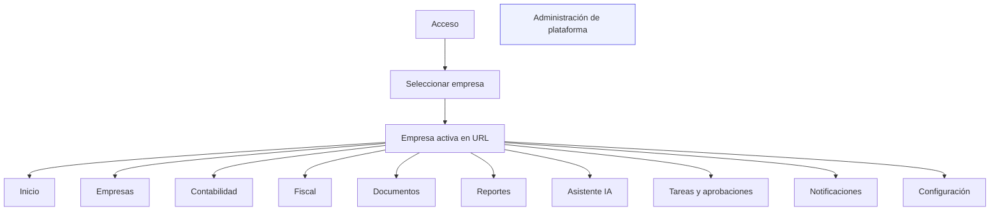

# MASTER_SCREEN_MAP.md — Mapa Maestro de Pantallas — ContaIA

## Control del documento

| Campo | Valor |
| --- | --- |
| Documento | `31_MASTER_SCREEN_MAP.md` |
| Versión | `0.1` |
| **Estado** | **Draft v0.1 — Propuesta para aprobación** |
| Fecha de creación | 2026-08-03 |
| Propietario propuesto | Product Owner de ContaIA |
| Alcance | Mapa de pantallas de la aplicación web; no modifica contratos, código ni reglas de negocio. |
| Baseline documental | `feature/frontend-ux-audit` · `b5b289d32fdcc8d7ab61fd62ecfe0316b8c75be8` |
| Fuentes de verdad | `docs/01_PRD.md`, `docs/04_BUSINESS_RULES.md`, `docs/08_API_DESIGN.md`, `docs/12_FRONTEND_ARCHITECTURE.md`, `docs/13_DESIGN_SYSTEM.md`, `docs/14_INFORMATION_ARCHITECTURE.md`, `docs/15_UX_FLOWS.md`, `docs/16_WIREFRAMES_SPECIFICATION.md`, `docs/17_PROTOTYPE_SPECIFICATION.md`, `docs/18_UI_SPECIFICATION.md`, `docs/19_FRONTEND_IMPLEMENTATION_PLAN.md` |

> **Estado de autoridad.** Este documento consolida y hace trazable la información existente; es una **propuesta** hasta su aprobación. No sustituye las fuentes listadas arriba. En especial, [`14_INFORMATION_ARCHITECTURE.md`](14_INFORMATION_ARCHITECTURE.md) conserva la autoridad sobre taxonomía, catálogo conceptual y rutas; [`08_API_DESIGN.md`](08_API_DESIGN.md) conserva la autoridad sobre contratos API.

> **Resultado de no duplicación.** No se encontró un archivo o título equivalente a `MASTER_SCREEN_MAP`. Sí existe un catálogo conceptual de **42 páginas** y **36 rutas** en `docs/14_INFORMATION_ARCHITECTURE.md` (§ Catálogo de páginas y § Catálogo de rutas). Este mapa lo complementa con cobertura, dependencias, prioridad, estado y límites de implementación; no reescribe aquel documento.

## 1. Propósito y límites

Este mapa permite diseñar y priorizar el producto como recorridos conectados, no como pantallas aisladas. Para cada superficie identifica el contexto de empresa, el acceso por rol, la acción principal, el bounded context/API relacionado, la prioridad y el grado de evidencia de diseño e implementación.

No autoriza:

- crear pantallas, endpoints, roles o rutas no respaldadas;
- convertir una función futura en alcance MVP;
- implementar React, backend, esquemas o contratos;
- asumir que una ruta o demo no versionada es funcionalidad aprobada.

`PLANNED` significa que la fuente existente la contempla, pero no hay evidencia suficiente de implementación aprobada en el baseline. No equivale a compromiso de producto ni a funcionalidad disponible.

## 2. Alcance por etapa

| Alcance | Qué cubre | Evidencia |
| --- | --- | --- |
| **MVP** | 41 de las 42 páginas catalogadas: acceso, multiempresa, documentos/CFDI, contabilidad, IA acotada, tareas, alertas, configuración, auditoría y administración básica. | `docs/01_PRD.md` § M1–M12 y `docs/14_INFORMATION_ARCHITECTURE.md` § Alcance del MVP. |
| **PLANNED — fase intermedia** | `PAGE-0026` Reportes programados; filtros/vistas guardadas compartidas; reportes avanzados; administración de plataforma completa; recursos/blog público. | `docs/14_INFORMATION_ARCHITECTURE.md` § Alcance del MVP. |
| **PLANNED — fase empresarial** | Integraciones configurables, precios una vez validado el modelo de negocio, analítica avanzada y personalización ampliada. | `docs/14_INFORMATION_ARCHITECTURE.md` § Alcance del MVP. |
| **Fuera de este mapa operativo** | Landing, términos, privacidad, contacto y precios. Son superficies públicas separadas; precios continúa reservado. | `docs/14_INFORMATION_ARCHITECTURE.md` § SEO y páginas públicas. |

## 3. Arquitectura de navegación

### 3.1 Reglas de navegación obligatorias

- Tras elegir una Empresa, toda ruta operativa incluye `/{companyId}/`; no hay contexto implícito.
- El selector de Empresa permanece visible, persiste durante la sesión y recalcula permisos. Si hay cambios sin guardar, requiere confirmación antes del cambio.
- La navegación, la búsqueda, las tareas, las descargas y la IA se limitan a la Empresa activa. Nunca se mezclan datos de Empresas.
- Las rutas de Administración de plataforma no llevan Empresa y son invisibles para roles no autorizados.
- En detalles, creación y edición hay breadcrumb y retorno explícito al listado padre. Un acceso directo siempre revalida membresía y permiso en servidor.

## 4. Contexto de acceso y permisos

| Rol | Acceso dominante en el MVP | Límites relevantes |
| --- | --- | --- |
| Administrador | Empresas, configuración de Empresa, reportes, lectura de operación y auditoría de Empresa. | No obtiene Administración de plataforma por ser administrador de una Empresa. |
| Contador | Contabilidad, CFDI/documentos, reportes, IA y aprobación de pólizas/casos aplicables. | La gestión de Empresas no forma parte de su navegación base. |
| Auxiliar | Carga documental, CFDI y pólizas en borrador. | No aprueba ni finaliza pólizas; reportes completos no disponibles. |
| Supervisor | Centro de trabajo, revisión/aprobación y consulta de evidencia. | No carga documentos ni administra Empresas. |
| Auditor | Consulta de contabilidad, fiscal y auditoría. | Sin acciones de escritura ni Asistente IA. |
| Estudiante | Asistente IA educativo con datos simulados. | Sin datos de Empresas reales; su alcance MVP sigue pendiente. |
| Administrador de plataforma | Soporte y cuentas agregadas de la plataforma. | Es un ámbito separado del Administrador de Empresa; acceso JIT y auditado cuando aplica. |

La autorización se evalúa por combinación de **rol + membresía vigente + Empresa activa + recurso + estado del recurso**. Los estados de visibilidad son: permitido, solo lectura, aprobación, restringido y no disponible. Ocultar una acción no sustituye la autorización del servidor.

## 5. Estados transversales requeridos

| Estado | Aplicación mínima | Recuperación esperada |
| --- | --- | --- |
| Carga / procesamiento | Listados, detalles, carga documental, generación y respuestas IA. | Skeleton/progreso visible; en Jobs, consultar `API-0055` hasta estado terminal. |
| Vacío | Colecciones sin registros o sin resultados tras filtros. | Explicar el contexto y ofrecer acción permitida o limpiar filtros; no redirigir. |
| Error recuperable | Red, validación, concurrencia o proceso fallido. | Mensaje comprensible, preservar entrada cuando sea seguro y ofrecer reintentar/corregir. |
| Sin permisos | Ruta, módulo o acción no autorizada. | No mostrar contenido protegido ni revelar existencia de recursos ajenos; explicar acceso de forma mínima. |
| Sesión expirada | Cualquier superficie autenticada. | Reautenticar y retornar a la ruta original si continúa autorizada. |
| No encontrado | Recurso o ruta inexistente. | Mostrar salida a Inicio/búsqueda sin revelar datos de otra Empresa. |

## 6. Inventario maestro de pantallas

**Leyenda de estado:** `DRAFT-IA` = está catalogada en la arquitectura de información, cuyo estado es Draft v1.0; no es validación visual final. `HEAD exacta` = existe un `page.tsx` versionado cuya ruta coincide con la ruta propuesta. `Variante HEAD` = existe una pantalla relacionada, pero su ruta o alcance no coincide. `PLANNED` = no debe tratarse como implementada.

| ID | Pantalla / subpantalla | Ruta propuesta | Empresa activa | Roles base | Acción principal | Contexto / API relacionada | Prioridad | Diseño | Implementación observada en HEAD |
| --- | --- | --- | --- | --- | --- | --- | --- | --- | --- |
| PAGE-0001 | Iniciar sesión | `/acceso/iniciar-sesion` | No | Todos | Iniciar sesión / MFA si aplica | Identity · API-0003/0004 | P0 | DRAFT-IA | HEAD exacta |
| PAGE-0002 | Verificación de correo | `/acceso/verificar` | No | Todos | Confirmar correo | Identity · API-0002 | P0 | DRAFT-IA | Variante HEAD: `/acceso/verificar-correo` |
| PAGE-0003 | Recuperar contraseña | `/acceso/recuperar` | No | Todos | Solicitar recuperación | Identity · API-0006/0007 | P0 | DRAFT-IA | Variante HEAD: `/acceso/recuperar-contrasena` |
| PAGE-0004 | Aceptar invitación | `/acceso/invitacion/{token}` | No | Invitado | Aceptar membresía | Memberships · API-0017 | P0 | DRAFT-IA | HEAD exacta |
| PAGE-0005 | Selección inicial de Empresa | `/seleccionar-empresa` | La asigna | Todos con membresía | Elegir Empresa | Companies · API-0012 | P0 | DRAFT-IA | HEAD exacta |
| PAGE-0006 | Inicio | `/{companyId}/inicio` | Sí | Todos | Ir a pendientes/alertas/módulos | Dashboard agregado; endpoint específico no catalogado | P0 | DRAFT-IA | HEAD exacta |
| PAGE-0007 | Listado de Empresas | `/empresas` | No | Administrador | Abrir/seleccionar Empresa | Companies · API-0012 | P0 | DRAFT-IA | HEAD exacta |
| PAGE-0008 | Alta de Empresa | `/empresas/nueva` | No | Administrador | Crear Empresa | Companies · API-0011 | P0 | DRAFT-IA | Variante HEAD: `/crear-empresa` |
| PAGE-0009 | Detalle de Empresa | `/empresas/{companyId}` | Ruta propia | Administrador; consulta según membresía | Gestionar datos y miembros | Companies/Memberships/Fiscal years · API-0013–0022 | P0 | DRAFT-IA | HEAD exacta |
| PAGE-0010 | Catálogo de cuentas | `/{companyId}/contabilidad/cuentas` | Sí | Contador; consulta por membresía | Crear/consultar cuentas | Chart of Accounts · API-0029–0032 | P0 | DRAFT-IA | PLANNED |
| PAGE-0011 | Detalle/edición de Cuenta | `/{companyId}/contabilidad/cuentas/{accountId}` | Sí | Contador | Editar/desactivar cuenta | Chart of Accounts · API-0030–0032 | P0 | DRAFT-IA | PLANNED |
| PAGE-0012 | Listado de Pólizas | `/{companyId}/contabilidad/polizas` | Sí | Contador, Auxiliar, Supervisor | Filtrar/abrir póliza | Journal Entries · API-0034 | P0 | DRAFT-IA | PLANNED |
| PAGE-0013 | Detalle de Póliza | `/{companyId}/contabilidad/polizas/{entryId}` | Sí | Contador, Auxiliar, Supervisor | Revisar evidencia y estado | Journal Entries · API-0035–0039 | P0 | DRAFT-IA | PLANNED |
| PAGE-0014 | Captura de Póliza | `/{companyId}/contabilidad/polizas/nueva` | Sí | Auxiliar, Contador | Guardar borrador/enviar revisión | Journal Entries · API-0033/0036 | P0 | DRAFT-IA | PLANNED |
| PAGE-0015 | Balanza de comprobación | `/{companyId}/contabilidad/balanza` | Sí | Contador, Administrador | Consultar por periodo | Financial Statements · API-0040 | P0 | DRAFT-IA | PLANNED |
| PAGE-0016 | Estados financieros | `/{companyId}/contabilidad/estados-financieros` | Sí | Contador, Administrador | Consultar/exportar estado | Financial Statements · API-0041 | P0 | DRAFT-IA | PLANNED |
| PAGE-0017 | Ejercicios y cierres | `/{companyId}/contabilidad/ejercicios` | Sí | Administrador | Abrir/cerrar Ejercicio | Fiscal Years · API-0020–0022 | P0 | DRAFT-IA | PLANNED |
| PAGE-0018 | Sugerencias contables | Sin ruta catalogada | Sí | Contador | Revisar propuesta IA | AI + Journal Entries + Approvals · API-0042–0048 | P0 | DRAFT-IA | PLANNED |
| PAGE-0019 | Listado de CFDI | `/{companyId}/fiscal/cfdi` | Sí | Administrador, Contador, Auxiliar, Supervisor, Auditor (`cfdi.read`; Supervisor y Auditor solo lectura, D-011) | Consultar/filtrar CFDI | Documents/CFDI · API-0028 | P0 | DRAFT-IA | PLANNED |
| PAGE-0020 | Detalle de CFDI | `/{companyId}/documentos/{documentId}/cfdi` | Sí | Administrador, Contador, Auxiliar, Supervisor, Auditor (`cfdi.read`; Supervisor y Auditor solo lectura; descargar el XML exige `document.download`, D-011) | Revisar datos extraídos/vincular | Documents/CFDI · API-0027 | P0 | DRAFT-IA | PLANNED |
| PAGE-0021 | Biblioteca de Documentos | `/{companyId}/documentos` | Sí | Administrador, Contador, Auxiliar, Supervisor, Auditor (`document.read`, D-011) | Buscar/abrir documento | Documents · API-0024 | P0 | DRAFT-IA | PLANNED |
| PAGE-0022 | Carga de Documentos | `/{companyId}/documentos/nuevo` | Sí | Administrador, Contador, Auxiliar (`document.upload`) | Iniciar carga y seguir proceso | Documents/Jobs · API-0023/0055 | P0 | DRAFT-IA | PLANNED |
| PAGE-0023 | Detalle de Documento | `/{companyId}/documentos/{documentId}` | Sí | Administrador, Contador, Auxiliar, Supervisor, Auditor (`document.read`; la descarga exige además `document.download`, D-011) | Ver estado/descargar | Documents/CFDI · API-0025–0027 | P0 | DRAFT-IA | PLANNED |
| PAGE-0024 | Catálogo de Reportes | `/{companyId}/reportes` | Sí | Contador, Administrador | Elegir reporte | Reportes; API de catálogo no documentada | P0 | DRAFT-IA | PLANNED |
| PAGE-0025 | Visor de Reporte | `/{companyId}/reportes/{reportId}` | Sí | Contador, Administrador | Consultar/exportar | Financial Statements · API-0040/0041 según reporte | P0 | DRAFT-IA | PLANNED |
| PAGE-0026 | Reportes programados | Sin ruta catalogada | Sí | Contador, Administrador | Gestionar programación | Reportes; contrato no documentado | P1 · PLANNED | DRAFT-IA | PLANNED |
| PAGE-0027 | Conversación con Asistente IA | `/{companyId}/asistente/{conversationId?}` | Sí o sandbox | Todos según alcance | Preguntar/marcar revisión | AI · API-0042–0045 | P0 | DRAFT-IA | PLANNED |
| PAGE-0028 | Historial de conversaciones | `/{companyId}/asistente/historial` | Sí | Todos | Reabrir conversación autorizada | AI · API-0043 | P0 | DRAFT-IA | PLANNED |
| PAGE-0029 | Centro de trabajo | `/{companyId}/tareas` | Sí | Contador, Supervisor | Abrir pendiente/caso | Approvals · API-0046 | P0 | DRAFT-IA | PLANNED |
| PAGE-0030 | Detalle de Tarea/Caso | `/{companyId}/tareas/{approvalId}` | Sí | Contador, Supervisor | Aprobar/rechazar/solicitar cambios | Approvals · API-0047/0048 | P0 | DRAFT-IA | PLANNED |
| PAGE-0031 | Centro de notificaciones | `/{companyId}/notificaciones` | Sí | Todos | Consultar/atender alerta | Notifications · API-0051/0052 | P0 | DRAFT-IA | PLANNED |
| PAGE-0032 | Preferencias de notificaciones | Sin ruta catalogada | No | Todos | Ajustar preferencias | Notifications; contrato específico no documentado | P0 | DRAFT-IA | PLANNED |
| PAGE-0033 | Panel de soporte | `/admin/soporte` | No | Administrador de plataforma | Solicitar soporte JIT | Administration · API-0053 | P1 | DRAFT-IA | PLANNED |
| PAGE-0034 | Cuentas de plataforma | `/admin/cuentas` | No | Administrador de plataforma | Consultar cuentas agregadas | Administration · API-0054 | P1 | DRAFT-IA | PLANNED |
| PAGE-0035 | Auditoría de plataforma | Sin ruta catalogada | No | Administrador de plataforma | Consultar eventos de plataforma | Audit; contrato de plataforma no documentado | P1 | DRAFT-IA | PLANNED |
| PAGE-0036 | Perfil personal | `/configuracion/perfil` | No | Todos | Editar perfil | Configuración personal; contrato no documentado | P0 | DRAFT-IA | Variante HEAD: `/configuracion/personal` |
| PAGE-0037 | Preferencias personales | Sin ruta catalogada | No | Todos | Ajustar preferencias | Configuración personal; contrato no documentado | P0 | DRAFT-IA | PLANNED |
| PAGE-0038 | Sesiones activas | Sin ruta catalogada | No | Todos | Consultar/gestionar sesiones | Identity; contrato de sesiones no documentado | P0 | DRAFT-IA | PLANNED |
| PAGE-0039 | Configuración de Empresa | `/{companyId}/configuracion` | Sí | Administrador | Guardar configuración | Companies · API-0013/0014 | P0 | DRAFT-IA | PLANNED |
| PAGE-0040 | Auditoría de Empresa | `/{companyId}/auditoria` | Sí | Auditor, Supervisor, Administrador | Filtrar eventos/evidencia | Audit · API-0049/0050 | P0 | DRAFT-IA | PLANNED |
| PAGE-0041 | Acceso denegado | `/403` | Variable | Todos | Volver a una superficie autorizada | Transversal; sin API | P0 | DRAFT-IA | Variante HEAD: `/no-autorizado`, `/prohibido` |
| PAGE-0042 | Ruta no encontrada | `/404` | Variable | Todos | Ir a Inicio/búsqueda | Transversal; sin API | P0 | DRAFT-IA | PLANNED |

### 6.1 Subpantallas y superficies declaradas

Estas superficies están respaldadas por el sitemap y las convenciones de navegación. No se contabilizan como rutas adicionales salvo que un documento posterior las formalice.

| ID | Superficie | Pantalla padre | Etapa | Acción/propósito |
| --- | --- | --- | --- | --- |
| SUB-01 a SUB-05 | Datos generales, Membresías, Roles/permisos, Configuración y Actividad | PAGE-0009 | MVP | Administrar o consultar el expediente de Empresa según rol. |
| SUB-06 | Cierre de Ejercicio | PAGE-0017 | MVP | Cerrar Ejercicio mediante acción confirmada y auditable. |
| SUB-07 a SUB-10 | Reportes contables, fiscales, financieros y exportaciones | PAGE-0024 | MVP | Acotar el catálogo y abrir el visor correspondiente. |
| SUB-11 | Reportes programados | PAGE-0024 | PLANNED — intermedia | Gestión futura de programación; no hay ruta ni contrato definido. |
| SUB-12 | Fuentes y fundamentos | PAGE-0027 | MVP | Abrir panel lateral/modal sin perder la conversación. |
| SUB-13 | Panel IA contextual | Contabilidad o Fiscal | MVP | Preguntar sobre el recurso actual; hereda Empresa, recurso, periodo y permisos. |
| SUB-14 a SUB-17 | Pendientes, Asignadas, Enviadas e Historial | PAGE-0029 | MVP | Vistas del Centro de trabajo; el historial también se enlaza a PAGE-0030. |

**Superficies globales (5):** selector de Empresa, búsqueda global, indicador de tareas, centro/panel de notificaciones y acceso persistente al Asistente IA. Todas son sensibles a Empresa activa y rol; no son rutas independientes.

## 7. Matriz de cobertura por módulo

| Módulo | Páginas catalogadas | MVP / PLANNED | Rutas catalogadas | Subpantallas | Prioridad base | Estado de diseño | Estado de implementación (HEAD) |
| --- | ---: | --- | ---: | ---: | --- | --- | --- |
| Acceso | 5 | 5 / 0 | 5 | 0 | P0 | DRAFT-IA | 3 exactas, 2 variantes |
| Inicio | 1 | 1 / 0 | 1 | 0 | P0 | DRAFT-IA | 1 exacta |
| Empresas | 3 | 3 / 0 | 3 | 5 | P0 | DRAFT-IA | 2 exactas, 1 variante |
| Contabilidad | 9 | 9 / 0 | 8 | 1 | P0 | DRAFT-IA | 0 exactas |
| Fiscal | 2 | 2 / 0 | 2 | 1 contextual | P0 | DRAFT-IA | 0 exactas |
| Documentos | 3 | 3 / 0 | 3 | 0 | P0 | DRAFT-IA | 0 exactas |
| Reportes | 3 | 2 / 1 | 2 | 5 | P0 / P1 planned | DRAFT-IA | 0 exactas |
| Asistente IA | 2 | 2 / 0 | 2 | 2 | P0 | DRAFT-IA | 0 exactas |
| Tareas y aprobaciones | 2 | 2 / 0 | 2 | 4 | P0 | DRAFT-IA | 0 exactas |
| Notificaciones | 2 | 2 / 0 | 1 | 1 global | P0 | DRAFT-IA | 0 exactas |
| Administración plataforma | 3 | 3 / 0 | 2 | 0 | P1 | DRAFT-IA | 0 exactas |
| Configuración | 5 | 5 / 0 | 2 | 0 | P0 | DRAFT-IA | 0 exactas, 1 variante |
| Transversal | 2 | 2 / 0 | 2 | 0 | P0 | DRAFT-IA | 1 variante, 1 pendiente |
| **Total** | **42** | **41 / 1** | **36** | **17** | — | **42 catalogadas en Draft** | **6 rutas exactas; 5 variantes relacionadas; 31 sin evidencia de ruta exacta** |

El total conceptual es de **64 superficies**: 42 páginas catalogadas + 17 subpantallas/paneles declarados + 5 superficies globales. Esta cifra reemplaza cualquier estimación no respaldada de “más de 100 pantallas”.

## 8. Matriz de dependencias y bounded contexts

| Dominio de pantalla | Bounded contexts / contratos necesarios | Dependencias UX principales | Riesgo si falta |
| --- | --- | --- | --- |
| Acceso y perfil | Identity, Memberships, Companies | Sesión, MFA, invitación, selector de Empresa | Alto: acceso o aislamiento incorrectos. |
| Empresas | Organizations/Companies, Memberships, Fiscal Years | Empresa activa, roles por Empresa, confirmación de cambios no guardados | Alto: mezcla de contexto o permisos. |
| Documentos y CFDI | Documents, XML/CFDI, Jobs, Storage | Carga prefirmada, progreso, rechazo con motivo, detalle | Alto: el usuario no puede confiar en el estado de un archivo. |
| Contabilidad | Chart of Accounts, Journal Entries, Fiscal Years, Financial Statements | Ejercicio abierto, borrador, revisión humana, auditoría | Alto: acciones o cifras con efecto contable incorrecto. |
| IA y aprobaciones | AI, Approvals, Notifications | Fuentes/vigencia, incertidumbre, derivación a revisión humana | Alto: presentar una propuesta IA como decisión definitiva. |
| Reportes | Financial Statements; futuro contrato de reportes | Empresa y periodo visibles, exportación | Medio: alcance de reporte sin contrato explícito. |
| Auditoría / plataforma | Audit, Administration | Consulta de evidencia, soporte JIT auditado | Alto: exposición de datos o trazabilidad insuficiente. |

## 9. Flujos críticos de producto

| Flujo | Recorrido de pantallas | Regla / condición de salida | Dependencias |
| --- | --- | --- | --- |
| F-01 Acceso y contexto | PAGE-0001 → PAGE-0005 → PAGE-0006 | Solo se entra a una ruta `companyId` con membresía vigente y rol recalculado. | API-0003/0004, API-0012; UXF-0002, UXF-0006. |
| F-02 Alta e invitación de Empresa | PAGE-0007 → PAGE-0008 → PAGE-0009 → SUB-02 | La persona invitada acepta por token; el rol se asigna por Empresa. | API-0011, API-0015–0019; UXF-0004/0005. |
| F-03 Carga y lectura CFDI | PAGE-0021 → PAGE-0022 → PAGE-0023 → PAGE-0020 | Documento: `PENDING_UPLOAD → PROCESSING → PROCESSED | REJECTED`; CFDI solo tras procesamiento válido. | API-0023–0028, API-0055; UXF-0008–0013. |
| F-04 Póliza con aprobación humana | PAGE-0012 → PAGE-0014 → PAGE-0013 → PAGE-0030 | Borrador balanceado antes de enviar; Auxiliar no aprueba; decisión queda auditada. | API-0033–0039, API-0046–0048; UXF-0015–0018. |
| F-05 Consulta/sugerencia IA segura | PAGE-0027 o SUB-13 → SUB-12 → PAGE-0030 si requiere revisión | Respuesta muestra fuente/vigencia o insuficiencia; IA no contabiliza ni decide. | API-0042–0045, API-0046–0048; UXF-0019–0024. |
| F-06 Cambio de Empresa | Selector global → confirmación si hay cambios → ruta equivalente de nueva Empresa | Se pierde cualquier contexto no guardado solo tras confirmación; nunca se conservan datos de la Empresa anterior. | Companies/membresía; UXF-0006. |

## 10. Hallazgos de coherencia

| Severidad | Ubicación | Problema comprobado | Impacto | Corrección mínima recomendada |
| --- | --- | --- | --- | --- |
| **ALTO** | `docs/14_INFORMATION_ARCHITECTURE.md` § Catálogo de páginas/rutas | 42 páginas catalogadas frente a 36 rutas; `PAGE-0018`, `0026`, `0032`, `0035`, `0037` y `0038` no tienen ruta catalogada. | El prototipo y la implementación no pueden probar navegación completa de forma inequívoca. | Decidir por cada una si es ruta, pestaña/panel o fuera de alcance; actualizar catálogo y rutas en la misma aprobación. |
| **ALTO** | `docs/14_INFORMATION_ARCHITECTURE.md` y `apps/web/src/app` en HEAD | Hay divergencias entre rutas propuestas y rutas implementadas: verificación, recuperación, alta de Empresa, perfil y acceso denegado. | Enlaces, middleware, pruebas y prototipo pueden partir de contratos de navegación distintos. | Elegir rutas canónicas y registrar una matriz de migración; no normalizar código hasta aprobarla. |
| **ALTO** | PAGE-0024–0026, PAGE-0032, PAGE-0035, PAGE-0036–0038 | El catálogo de APIs no define contrato para catálogo/programación de reportes, preferencias de notificaciones, auditoría de plataforma, perfil/preferencias/sesiones. | No hay base verificable para diseñar acciones, estados ni contratos de frontend de estas superficies. | Definir contrato API o marcar la pantalla como `PLANNED` fuera del incremento de implementación. |
| **MEDIO** | `docs/14_INFORMATION_ARCHITECTURE.md` § Catálogo de páginas | El registro de usuario, restablecimiento de contraseña, cierre de sesión y sesión expirada aparecen en UX/código de rutas, pero no todos están catalogados como páginas con ID/ruta. | La cobertura de acceso y de estados negativos es incompleta. | Ratificar si son páginas propias o estados transversales y añadir la clasificación consistente. |
| **MEDIO** | Documentación frontend | Los documentos de IA, UX, wireframes, prototipo y UI siguen en `Draft v1.0`; no se encontró evidencia de validación de un prototipo navegable aprobado. | No debe interpretarse el mapa como diseño final listo para React. | Aprobar primero navegación y cobertura MVP; después producir/validar prototipo contra este mapa. |
| **MEDIO** | `docs/frontend/CONTAIA_FUNCTIONAL_PROTOTYPE.md` | Existe una especificación de demo `/demo`, pero es material no versionado y no forma parte de la serie documental canónica. | Podría confundirse demo local con producto MVP aprobado. | Revisar, versionar y enlazarla formalmente o mantenerla explícitamente como material auxiliar. |
| **BAJO** | `PROJECT_INDEX.md` | El índice vigente no puede enlazar este nuevo borrador sin modificar un archivo que ya tiene cambios locales ajenos. | Descubribilidad reducida hasta la aprobación/integración documental. | Tras aprobación, actualizar índice y `CHANGELOG.md` en una modificación documental deliberada y aislada. |

## 11. Criterios de aprobación antes del prototipo navegable

- [ ] Resolver las seis páginas sin ruta y las divergencias de ruta señaladas.
- [ ] Confirmar los contratos ausentes o sacar explícitamente esas superficies del incremento MVP.
- [ ] Validar F-01 a F-06 con los seis roles y Empresa activa visible.
- [ ] Definir estados de carga, vacío, error y sin permisos para cada tipo de vista del § 5.
- [ ] Aprobar la cifra de 64 superficies conceptuales y el alcance de 41 páginas MVP / 1 `PLANNED`.
- [ ] Al aprobar, actualizar el índice y el changelog sin mezclar cambios de código ni cambios locales ajenos.

## 12. Referencias existentes

| Documento | Uso en este mapa | Estado de la fuente |
| --- | --- | --- |
| [`01_PRD.md`](01_PRD.md) | Alcance, prioridades por módulo y módulos MVP. | Draft v1.0 |
| [`04_BUSINESS_RULES.md`](04_BUSINESS_RULES.md) | Reglas de roles, aprobación, trazabilidad y aislamiento. | Draft v1.0 |
| [`08_API_DESIGN.md`](08_API_DESIGN.md) | IDs, rutas y límites de los contratos API. | Draft v1.0 |
| [`12_FRONTEND_ARCHITECTURE.md`](12_FRONTEND_ARCHITECTURE.md) | Módulos, permisos y arquitectura frontend. | Draft v1.0 |
| [`13_DESIGN_SYSTEM.md`](13_DESIGN_SYSTEM.md) | Componentes de navegación y estados universales. | Draft v1.0 |
| [`14_INFORMATION_ARCHITECTURE.md`](14_INFORMATION_ARCHITECTURE.md) | Autoridad de sitemap, catálogo de 42 páginas, rutas y roles. | Draft v1.0 |
| [`15_UX_FLOWS.md`](15_UX_FLOWS.md) | Flujos UXF-0001 a UXF-0041. | Draft v1.0 |
| [`16_WIREFRAMES_SPECIFICATION.md`](16_WIREFRAMES_SPECIFICATION.md) | Estructura de wireframes y estados por pantalla. | Draft v1.0 |
| [`17_PROTOTYPE_SPECIFICATION.md`](17_PROTOTYPE_SPECIFICATION.md) | Escenarios de prototipo y casos negativos. | Draft v1.0 |
| [`18_UI_SPECIFICATION.md`](18_UI_SPECIFICATION.md) | Layouts, componentes y estados de UI. | Draft v1.0 |
| [`19_FRONTEND_IMPLEMENTATION_PLAN.md`](19_FRONTEND_IMPLEMENTATION_PLAN.md) | Secuencia de implementación y Definition of Done. | Draft v1.0 |
| `docs/frontend/CONTAIA_FUNCTIONAL_PROTOTYPE.md` | Evidencia auxiliar de demo; no se usa como autoridad. | No versionado / no canónico |

## 13. Próximo paso recomendado

Realizar una **revisión de ratificación de navegación**: decidir las seis superficies sin ruta, resolver las divergencias entre ruta documentada y ruta existente, y confirmar qué contratos faltantes entran al MVP. Solo después debe producirse el prototipo navegable; la implementación React debe esperar a que esa matriz quede aprobada.
